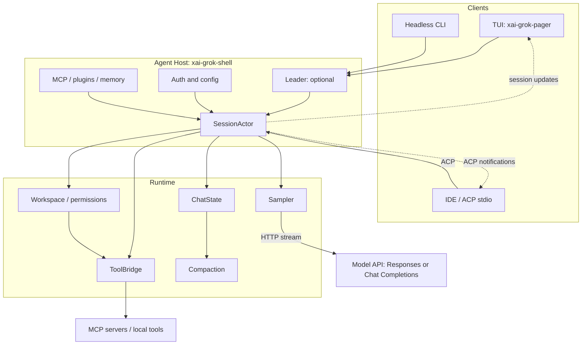
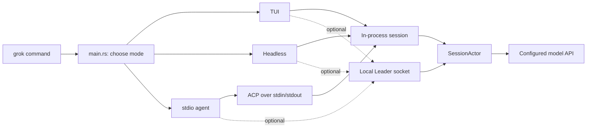
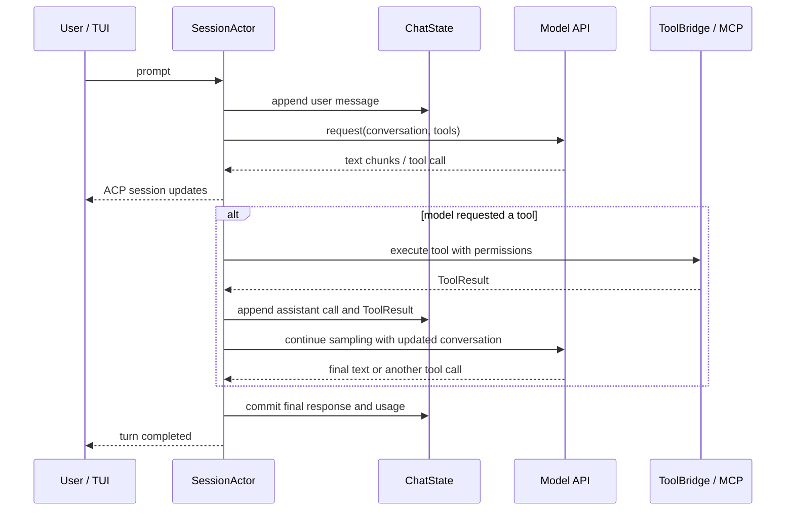
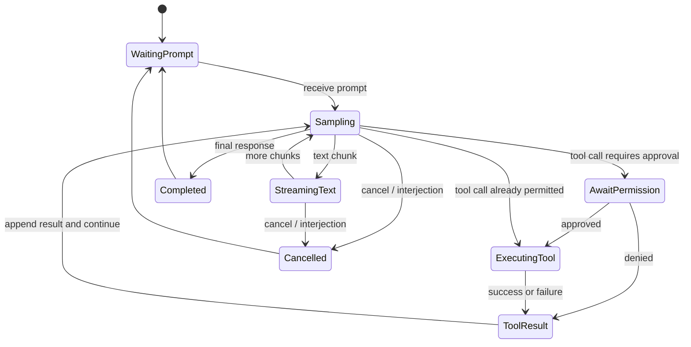

# 02 · 设计架构

## 1. 总览

Grok Build 采用 **分层 + Actor** 架构：UI、会话运行时、采样、工具、工作区、压缩引擎彼此解耦，通过 Handle / 协议边界通信。

```
┌─────────────────────────────────────────────────────────────────┐
│  Clients                                                         │
│  · TUI (xai-grok-pager)  · Headless CLI  · IDE via ACP/stdio    │
└───────────────────────────────┬─────────────────────────────────┘
                                │ ACP / Leader socket / 进程内
┌───────────────────────────────▼─────────────────────────────────┐
│  Agent Host — xai-grok-shell                                     │
│  · Leader (可选多客户端)  · SessionActor  · Auth  · Extensions   │
│  · MCP  · Subagent 协调  · Goal harness  · Persistence           │
└───┬─────────────┬─────────────┬─────────────┬───────────────────┘
    │             │             │             │
    ▼             ▼             ▼             ▼
 ChatState    Sampler      ToolBridge     Workspace
 (conversation) (HTTP LLM)  (tools/MCP)   (FS/VCS/perm)
    │             │             │             │
    ▼             ▼             ▼             ▼
 sampling-    API backends   tool-runtime  sandbox /
 types                       tool-protocol  worktree
                ▲
                │
         Compaction engine
         (xai-grok-compaction)
```

同一结构用可渲染的 Mermaid 图表示如下。实线表示主要调用或数据流，虚线表示通知/状态回传：



---

## 2. 进程与入口模型

### 2.1 运行形态与真实入口

| 形态 | 入口 | 说明 | 代码入口 |
|------|------|------|---|
| **交互 TUI** | `xai-grok-pager-bin` → pager app | UI 进程；可通过 **Leader** 或直连驱动 agent | [`pager-bin/src/main.rs`](../crates/codegen/xai-grok-pager-bin/src/main.rs)、[`pager/src/lib.rs`](../crates/codegen/xai-grok-pager/src/lib.rs) |
| **单轮 headless** | `grok -p` → `run_single_turn` | Pager 进程内创建 shell，通过 ACP 驱动一次 prompt；stdout 是 plain/JSON 结果 | [`pager/src/headless.rs`](../crates/codegen/xai-grok-pager/src/headless.rs)、[`pager-bin/src/main.rs`](../crates/codegen/xai-grok-pager-bin/src/main.rs) |
| **Relay headless** | `grok agent headless` → `run_headless` | 长期运行的非 TUI Agent，通过 Grok WebSocket relay 工作；要求 grok.com session | [`shell/src/agent/app.rs`](../crates/codegen/xai-grok-shell/src/agent/app.rs)、[`shell/src/agent/relay.rs`](../crates/codegen/xai-grok-shell/src/agent/relay.rs) |
| **stdio Agent** | `run_stdio_agent` | 标准输入输出上的 ACP，供 IDE 嵌入 | [`shell/src/agent/app.rs`](../crates/codegen/xai-grok-shell/src/agent/app.rs)、[`shell/src/agent/relay.rs`](../crates/codegen/xai-grok-shell/src/agent/relay.rs) |

不要把两个 headless 入口合并理解：顶层 `main` 在普通 `Command::Agent` 分流之前检查 `HeadlessPrompt::from_args`，所以 `grok -p` 不会调用 shell 的 `run_headless`，也不会自动接入 Leader。`grok agent` 没有子命令时，才会在 `run_agent_command` 的 `None` 分支调用 `run_headless`。完整的进程所有权、stdout 契约与重连语义见[宿主模式与运行入口精读](./deep-dives/host-modes-and-entrypoints.md)。

Leader（`xai-grok-shell::leader`）负责：

- 本机 socket 注册与能力协商  
- 多客户端附着同一 workspace  
- 版本偏斜检测（`leader_is_older_than`）  

相关文件：[`crates/codegen/xai-grok-shell/src/leader/mod.rs`](../crates/codegen/xai-grok-shell/src/leader/mod.rs)、[`server.rs`](../crates/codegen/xai-grok-shell/src/leader/server.rs)、[`client.rs`](../crates/codegen/xai-grok-shell/src/leader/client.rs)、[`protocol.rs`](../crates/codegen/xai-grok-shell/src/leader/protocol.rs)。

#### Leader 到底是什么

Leader 是**本机上的 Agent Host 进程**，不是模型服务、Git 分支的 leader，也不是远程中转站。它持有一个共享的 Agent/Session/Workspace 状态，其他客户端通过 Unix domain socket 连接它；默认 socket 类似 `~/.grok/leader.sock`。

可以把两种运行方式对比为：

```text
默认直连：  grok TUI ──> 当前进程内的 Agent ──> 模型 API

Leader 模式：TUI ─┐
             IDE ─┼─> ~/.grok/leader.sock ──> Leader ──> 模型 API
          Headless ┘          （共享 Agent/Session/Workspace）
```

Leader 的主要价值是让多个入口共享同一份会话和工作区状态。只运行一个终端 `grok` 时，它通常不会节省内存，反而会增加一个后台进程和 IPC 连接的少量开销；同时运行 TUI、IDE 插件和 Headless 客户端时，才可能减少各进程重复加载的状态。它的核心目的不是省内存，而是集中管理状态、重连和多客户端消息路由。

#### 默认是否开启

源码默认是**关闭**。直接执行 `grok` 通常采用进程内直连；只有明确配置或启动参数要求时才进入 Leader：

```toml
[cli]
use_leader = true
```

```bash
grok --leader       # 强制启用
grok --no-leader    # 强制关闭
```

实际决策优先级（从高到低）为：

```text
--no-leader > --leader > [cli] use_leader > 发行版远程策略 > 默认关闭
```

请求了受限 sandbox 时，Leader 还可能被安全策略否决，让工具调用留在当前进程。`grok workspace ...` 是特殊命令，它要求 Leader，因为 workspace 控制状态必须由共享 Leader 持有。

启动时，客户端调用 `connect_or_spawn`：发现可用 Leader 就连接，找不到就启动一个；连接建立后，`LeaderClient` 负责注册、能力协商、ACP 消息转发和 keepalive，服务端负责客户端接入、session ownership 和响应路由。

从“谁启动谁、谁连谁”的角度看，运行模式可以画成：



### 2.2 二进制 composition root

`xai-grok-pager-bin` **只做拼装**：解析 CLI、鉴权/更新、调用 pager 或 shell API。业务逻辑不在 bin 里堆砌。

### 2.3 从命令入口追到核心

建议按下面的顺序读代码。路径均相对于仓库根目录：

| 阅读目标 | 文件路径 | 重点 |
|---|---|---|
| CLI 参数和启动分流 | [`crates/codegen/xai-grok-pager-bin/src/main.rs`](../crates/codegen/xai-grok-pager-bin/src/main.rs) | `main`、`AgentCmd`、headless、stdio、Leader 分支。 |
| TUI 应用状态 | [`crates/codegen/xai-grok-pager/src/app/app_view.rs`](../crates/codegen/xai-grok-pager/src/app/app_view.rs) | 键盘事件、视图状态、会话客户端和渲染调度。 |
| TUI 会话视图 | [`crates/codegen/xai-grok-pager/src/app/agent_view/`](../crates/codegen/xai-grok-pager/src/app/agent_view) | 单个 Agent 会话的输入、滚屏和交互状态。 |
| ACP 更新接收 | [`crates/codegen/xai-grok-pager/src/app/acp_handler/`](../crates/codegen/xai-grok-pager/src/app/acp_handler) | 将 `session/update` 转成 TUI 状态和滚屏块。 |
| 会话宿主 | [`crates/codegen/xai-grok-shell/src/agent/app.rs`](../crates/codegen/xai-grok-shell/src/agent/app.rs) | 创建 Agent，启动 stdio/headless/Leader 宿主。 |
| 会话 Actor | [`crates/codegen/xai-grok-shell/src/session/acp_session.rs`](../crates/codegen/xai-grok-shell/src/session/acp_session.rs) | SessionActor 状态、命令入口和 ACP gateway。 |
| 会话主循环 | [`crates/codegen/xai-grok-shell/src/session/acp_session_impl/run_loop.rs`](../crates/codegen/xai-grok-shell/src/session/acp_session_impl/run_loop.rs) | `select!` 处理命令、模型事件、取消和定时任务。 |
| 一轮 prompt 编排 | [`crates/codegen/xai-grok-shell/src/session/acp_session_impl/turn.rs`](../crates/codegen/xai-grok-shell/src/session/acp_session_impl/turn.rs) | 构造请求、开始采样、结束一轮并写入结果。 |
| 采样与工具循环 | [`sampler_turn.rs`](../crates/codegen/xai-grok-shell/src/session/acp_session_impl/sampler_turn.rs)、[`tool_calls.rs`](../crates/codegen/xai-grok-shell/src/session/acp_session_impl/tool_calls.rs) | 流式响应、tool call、ToolResult 和继续采样。 |

一次普通交互可以简化为：

```text
main.rs
  -> pager app / LeaderClient
  -> SessionActor (acp_session.rs)
  -> run_loop.rs
  -> turn.rs
  -> sampler_turn.rs
  -> xai-grok-sampler (HTTP)
  -> model response / tool_calls.rs
  -> ACP session/update
  -> pager acp_handler + agent_view
```

这里的 ACP 主要是客户端与 Agent 宿主之间的会话消息格式；核心请求模型时仍然使用 Responses API 或 Chat Completions HTTP 请求。

### 2.4 运行模式的选择

这几种模式复用同一套 `xai-grok-shell` 会话和工具逻辑，差别在于客户端形态与通信边界：

| 模式 | 适用场景 | 客户端到核心 | 模型调用 |
|---|---|---|---|
| 默认交互式 `grok` | 人工在终端中持续协作 | Pager 直连 Session，或经本机 Leader | HTTP 到配置的模型 `base_url` |
| `grok agent headless` | CI、脚本、单次任务 | 直接调用 shell 的 headless 入口；可选 Leader | 同上 |
| `grok agent stdio` | IDE、编辑器插件 | ACP JSON-RPC，经标准输入输出 | 同上 |
| Leader 模式 | 多客户端附着、共享 workspace/session | 本机 socket + Leader 协议 | 由 Leader 持有的 shell Session 发起 |

不要把这几层协议混为一谈：ACP/Leader 解决的是**客户端如何与 Agent 核心交互**；`responses`、`chat_completions` 解决的是**核心如何与模型服务交互**；MCP 则解决的是**核心如何发现和调用外部工具**。

---

## 3. 分层职责

### L0 — 类型与协议（无 I/O 或仅线协议）

| Crate | 职责 |
|-------|------|
| `xai-grok-sampling-types` | ConversationItem / Request / Response / StopReason / HostedTool |
| `xai-tool-types` | 工具侧共享类型 |
| `xai-tool-protocol` | Computer Hub JSON-RPC 方法、帧、hook、session_event |
| `xai-grok-config-types` / `xai-hooks-plugins-types` | 配置与插件类型 |
| `xai-grok-workspace-types` | 工作区事件与共享类型 |

设计意图：**下游状态/UI 可不拉起完整 shell**。

### L1 — 引擎与运行时

| Crate | 职责 |
|-------|------|
| `xai-grok-sampler` | 三层采样：Client 流 → Stream 事件 → SamplerHandle/Actor |
| `xai-chat-state` | Conversation 权威状态、build_request、usage ledger |
| `xai-grok-compaction` | full-replace / intra / inter 压缩算法与 prompt |
| `xai-tool-runtime` | Tool trait、Dispatch、流式输出、通知 |
| `xai-agent-lifecycle` | Turn/Session 生命周期贡献者（扩展不抢 loop 控制权） |
| `xai-prompt-queue` | 提示队列线类型（shell ↔ pager） |

### L2 — 产品能力

| Crate | 职责 |
|-------|------|
| `xai-grok-agent` | AgentBuilder、prompt 组装、插件/skills 发现 |
| `xai-grok-tools` | 内置工具实现 + ToolBridge + 归一化/版本 |
| `xai-grok-workspace` | FS、VCS、权限、checkpoint、hub server |
| `xai-grok-mcp` | MCP 客户端与 SSE 等传输 |
| `xai-grok-memory` | 跨会话记忆 |
| `xai-grok-sandbox` | OS 级隔离 |
| `xai-grok-hooks` / `xai-grok-plugin-marketplace` | 钩子与市场 |
| `xai-fast-worktree` / `xai-hunk-tracker` | 隔离 worktree 与编辑 hunk 追踪 |

### L3 — 宿主与 UI

| Crate | 职责 |
|-------|------|
| `xai-grok-shell` | SessionActor、ACP 会话、扩展、鉴权、远程同步… |
| `xai-grok-pager` / `pager-render` | TUI 与渲染管线 |
| `xai-grok-pager-bin` | 可执行入口 |

### 3.1 文件级模块地图

按职责定位代码时，可以从这些文件开始：

| 子系统 | 文件路径 | 负责什么 |
|---|---|---|
| 配置加载 | [`crates/codegen/xai-grok-shell/src/config/mod.rs`](../crates/codegen/xai-grok-shell/src/config/mod.rs) | 合并默认、用户、项目和 managed 配置。 |
| Agent 配置 | [`crates/codegen/xai-grok-shell/src/agent/config.rs`](../crates/codegen/xai-grok-shell/src/agent/config.rs) | 模型、端点、权限、工具和运行时字段。 |
| 模型目录 | [`crates/codegen/xai-grok-shell/src/agent/models.rs`](../crates/codegen/xai-grok-shell/src/agent/models.rs)、[`models/resolution.rs`](../crates/codegen/xai-grok-shell/src/agent/models/resolution.rs) | 拉取/缓存模型，合并 `[model.*]`，解析默认模型和过滤器。 |
| 模型 HTTP 客户端 | [`crates/codegen/xai-grok-shell/src/remote/client.rs`](../crates/codegen/xai-grok-shell/src/remote/client.rs) | `/v1/models`、Responses、Chat Completions 和设置请求。 |
| Leader 服务端 | [`crates/codegen/xai-grok-shell/src/leader/server.rs`](../crates/codegen/xai-grok-shell/src/leader/server.rs) | 持有共享 Session，接受本地客户端连接。 |
| Leader 客户端 | [`crates/codegen/xai-grok-shell/src/leader/client.rs`](../crates/codegen/xai-grok-shell/src/leader/client.rs) | TUI/Headless 连接 Leader 并转发请求。 |
| Leader 协议 | [`crates/codegen/xai-grok-shell/src/leader/protocol.rs`](../crates/codegen/xai-grok-shell/src/leader/protocol.rs) | 注册、能力协商、控制消息和版本信息。 |
| ACP relay | [`crates/codegen/xai-grok-shell/src/agent/relay.rs`](../crates/codegen/xai-grok-shell/src/agent/relay.rs) | 在 ACP 请求/响应/通知之间转发和记录。 |
| Session 生命周期 | [`crates/codegen/xai-grok-shell/src/session/acp_session.rs`](../crates/codegen/xai-grok-shell/src/session/acp_session.rs) | SessionActor、命令队列、通知 gateway。 |
| 一轮对话 | [`crates/codegen/xai-grok-shell/src/session/acp_session_impl/turn.rs`](../crates/codegen/xai-grok-shell/src/session/acp_session_impl/turn.rs) | prompt turn 的开始、结束、取消和结果处理。 |
| 工具调用 | [`crates/codegen/xai-grok-shell/src/session/acp_session_impl/tool_calls.rs`](../crates/codegen/xai-grok-shell/src/session/acp_session_impl/tool_calls.rs) | 解析模型 tool call、执行工具、写回 ToolResult。 |
| MCP | [`crates/codegen/xai-grok-shell/src/session/mcp_dispatcher.rs`](../crates/codegen/xai-grok-shell/src/session/mcp_dispatcher.rs)、[`session/acp_mcp.rs`](../crates/codegen/xai-grok-shell/src/session/acp_mcp.rs) | MCP 工具发现、调用和 ACP 反向通道。 |
| TUI 事件分发 | [`crates/codegen/xai-grok-pager/src/app/event_loop.rs`](../crates/codegen/xai-grok-pager/src/app/event_loop.rs) | 终端事件、后台事件和 Action 的主循环。 |
| TUI 会话渲染 | [`crates/codegen/xai-grok-pager/src/app/agent_view/render.rs`](../crates/codegen/xai-grok-pager/src/app/agent_view/render.rs) | prompt 区、模型名、滚屏和工具状态渲染。 |
| `/model` 命令 | [`crates/codegen/xai-grok-pager/src/slash/commands/model.rs`](../crates/codegen/xai-grok-pager/src/slash/commands/model.rs) | 模型候选展示、别名/显示名匹配和切换 Action。 |
| 采样器 | [`crates/codegen/xai-grok-sampler/src/`](../crates/codegen/xai-grok-sampler/src) | HTTP 流、SSE 事件解析和采样 Actor。 |
| 工具实现 | [`crates/codegen/xai-grok-tools/src/`](../crates/codegen/xai-grok-tools/src) | 文件、终端、搜索、任务等内置工具。 |
| 工作区权限 | [`crates/codegen/xai-grok-workspace/src/`](../crates/codegen/xai-grok-workspace/src) | 文件系统、VCS、checkpoint 和权限决策。 |

### 3.2 配置、模型目录与实际请求

启动时会先加载有效配置，再建立模型目录。配置来源和优先级的详细规则见 [01-learning-guide.md](./01-learning-guide.md) 与 [08-build-troubleshooting.md](./08-build-troubleshooting.md)；从架构角度，可按下面理解：

```text
默认配置 + 用户 ~/.grok/config.toml + 项目 .grok/config.toml + 环境变量/CLI
        │
        ▼
AgentConfig (agent/config.rs)
        │
        ├─ 全局 /v1/models 或磁盘缓存：提供远程模型目录
        └─ [model.<alias>]：本地模型条目覆盖或新增目录项
        │
        ▼
ModelsManager：选择 default、应用 allowed/disabled/hidden 过滤
        │
        ▼
Session 在每次采样时读取当前条目的 model / base_url / api_backend / credentials
```

需要区分四个常被混淆的字段：

| 字段 | 用于什么 | 不用于什么 |
|---|---|---|
| `[model.<alias>]` 的 `<alias>` | 本地模型目录 key、`[models].default`、`/model <alias>` | 不直接发给中转站 |
| `name` | TUI 右下角和 `/model` 列表的可读名称 | 不决定 API 模型 ID |
| `model` | 请求体中提交给中转站的真实模型 ID | 不保证能作为 `/model` 输入匹配 |
| `base_url` | 该模型的推理请求地址 | 不会让程序自动遍历所有端点发现模型 |

这也是多中转站配置需要为每个模型显式写 `[model.<alias>]` 的原因：全局模型列表端点只能代表一个来源，不能自动聚合多个网关。

---

## 4. 一次请求的时序

下面的路径对应一次用户输入从 TUI 到模型再回到终端的主要调用链：

```text
pager-bin/src/main.rs
  1. 读取 CLI 参数和 ~/.grok/config.toml
  2. 选择直连、Leader、headless 或 stdio 模式
        │
        ▼
pager/src/app/event_loop.rs
  3. 将输入转换为 Action / SessionCommand
        │
        ▼
shell/src/session/acp_session.rs
  4. SessionActor 接收 prompt，交给 acp_session_impl/run_loop.rs
        │
        ▼
shell/src/session/acp_session_impl/turn.rs
  5. 组装 conversation、工具定义和采样参数
        │
        ▼
shell/src/session/acp_session_impl/sampler_turn.rs
  6. 调用 xai-grok-sampler，消费流式文本、思考和 tool call
        │
        ├─ 无 tool call ──► 写入 ChatState，结束 turn
        │
        └─ 有 tool call ──► tool_calls.rs
                              ├─ xai-grok-tools
                              ├─ xai-grok-mcp
                              └─ xai-grok-workspace
                                      │
                                      └─ ToolResult 写回 conversation，继续采样
        │
        ▼
shell/src/session/acp_conversion.rs + agent/relay.rs
  7. 转换并发送 session/update
        │
        ▼
pager/src/app/acp_handler/ + app/agent_view/render.rs
  8. 更新滚屏、工具状态、token 用量和底部状态栏
```

`ChatState` 是对话内容的权威写入者；TUI 只保存显示状态，不应直接修改核心 conversation。一次 turn 是否继续、取消或进入压缩，也由 SessionActor 决定。

下面的时序图强调“工具调用不会结束 turn”：



### 4.1 Turn 的阶段、输入和输出

将一次 turn 拆开看，有助于定位“模型没回复”“工具没执行”“界面没刷新”分别应查哪里：

| 阶段 | 主要输入 | 主要输出 | 首查文件 |
|---|---|---|---|
| 接收 prompt | 用户文本、当前 session、权限模式 | `SessionCommand` | [`run_loop.rs`](../crates/codegen/xai-grok-shell/src/session/acp_session_impl/run_loop.rs) |
| 组装请求 | conversation、系统提示、ToolSpec、模型配置 | `ConversationRequest` | [`turn.rs`](../crates/codegen/xai-grok-shell/src/session/acp_session_impl/turn.rs) |
| 采样 | 请求、模型 `base_url`、API key、后端类型 | 流式文本、usage、tool call | [`sampler_turn.rs`](../crates/codegen/xai-grok-shell/src/session/acp_session_impl/sampler_turn.rs)、[`xai-grok-sampler/src/`](../crates/codegen/xai-grok-sampler/src) |
| 工具执行 | tool call、工作目录、权限、MCP 连接 | `ToolResult` | [`tool_calls.rs`](../crates/codegen/xai-grok-shell/src/session/acp_session_impl/tool_calls.rs) |
| 写入对话 | assistant 内容、tool result、token 用量 | 新 conversation 状态 | [`crates/codegen/xai-chat-state/src/`](../crates/codegen/xai-chat-state/src) |
| 通知客户端 | session 更新、工具状态、完成原因 | ACP notification / Pager state | [`acp_conversion.rs`](../crates/codegen/xai-grok-shell/src/session/acp_conversion.rs)、[`pager/src/app/acp_handler/`](../crates/codegen/xai-grok-pager/src/app/acp_handler) |

一个 tool call 不会结束 turn。工具结果写回 conversation 后，SessionActor 会再次采样，让模型读取结果并决定继续调用工具还是输出最终答复。只有没有待处理 tool call、被取消、达到限制或模型返回终止原因时，turn 才真正结束。

---

## 5. Actor 拓扑（Session 内部）

```
                 SessionCommand (prompt/cancel/…)
                          │
                          ▼
┌──────────────────────────────────────────────────────────┐
│                    SessionActor                           │
│  run_session: select! { idle timers | events | cmds… }   │
│                                                          │
│  · agent: Agent (prompt + ToolBridge + policies)         │
│  · chat_state_handle ──► ChatStateActor                  │
│  · sampler_handle    ──► SamplerActor                    │
│  · permissions       ──► Workspace PermissionHandle      │
│  · mcp_state / extensions / goal / plan_mode / memory    │
└──────────────────────────────────────────────────────────┘
          │ session_notification (ACP updates)
          ▼
     Gateway → Client (Pager / IDE)
```

**原则**：

1. **单写者**：conversation 只由 ChatStateActor 突变  
2. **Session 编排**：何时 sample、何时 tool、何时 compact 由 Session 决定  
3. **扩展不抢控制流**：`xai-agent-lifecycle` 的 contributor 只收事件/注 fragment  

对应实现文件：

| 职责 | 文件路径 |
|---|---|
| SessionActor 定义、命令和 ACP gateway | [`crates/codegen/xai-grok-shell/src/session/acp_session.rs`](../crates/codegen/xai-grok-shell/src/session/acp_session.rs) |
| Actor `select!` 主循环 | [`crates/codegen/xai-grok-shell/src/session/acp_session_impl/run_loop.rs`](../crates/codegen/xai-grok-shell/src/session/acp_session_impl/run_loop.rs) |
| 采样 turn 和状态更新 | [`crates/codegen/xai-grok-shell/src/session/acp_session_impl/sampler_turn.rs`](../crates/codegen/xai-grok-shell/src/session/acp_session_impl/sampler_turn.rs) |
| ACP ToolCall / Plan 更新转换 | [`crates/codegen/xai-grok-shell/src/session/acp_conversion.rs`](../crates/codegen/xai-grok-shell/src/session/acp_conversion.rs) |
| 会话持久化和 replay | [`crates/codegen/xai-grok-shell/src/session/persistence.rs`](../crates/codegen/xai-grok-shell/src/session/persistence.rs)、[`replay_events.rs`](../crates/codegen/xai-grok-shell/src/session/replay_events.rs) |

### 5.1 状态归属：改代码前先问“谁拥有它”

| 状态 | 权威拥有者 | UI 的职责 | 常见错误 |
|---|---|---|---|
| 对话历史、tool result、usage | `ChatStateActor` | 接收快照/通知并渲染 | 在 Pager 中直接拼接或修改 conversation |
| 当前 turn、取消、队列、plan/goal | `SessionActor` | 发 Action/命令，显示状态 | 让多个模块同时决定是否继续采样 |
| 当前模型和可选模型 | `ModelsManager` / Session model state | 展示候选项，发模型切换 Action | 只改 TUI 标签而不切换核心模型 |
| 文件写入与工作区权限 | Workspace / PermissionHandle | 显示批准请求和结果 | 在工具层绕过权限 Handle |
| 布局、焦点、输入框、滚动位置 | Pager `AppView` / `AgentView` | 唯一写入者 | 把纯 UI 状态塞进 shell session |

这个边界是 Actor 架构的核心收益：跨组件通信通过命令、Handle 或事件完成，避免多个任务同时可变地写同一份状态。

---

## 6. 数据面 vs 控制面

### 数据面（一次推理）

```
Conversation + ToolSpec[] + HostedTool[]
        → ConversationRequest
        → Sampler (HTTP stream)
        → ConversationResponse (text + tool_calls + usage)
        → 执行 tool_calls → ToolResult 写回 conversation
        → 循环直到无 tool_calls
```

工具循环的状态变化可以单独看成下面这个有限状态机。它解释了为什么取消、权限拒绝和工具失败都必须回到 SessionActor 统一处理：



### 控制面

- 权限决策（YOLO / plan mode / 用户批准）  
- 取消与 interjection（用户中途插话）  
- 模型切换、lazy 策略、goal harness  
- MCP 初始化策略（Blocking / Progressive）  
- 持久化（chat history / updates.jsonl / feedback）  

---

## 7. 关键设计决策

### 7.1 Shell 与 Agent 分离

`xai-grok-agent` 从 shell 抽出：任何宿主（TUI 会话、batch runner）都能 `AgentBuilder::build()` 得到可移植的工具+prompt 包。  
Shell 只负责 **会话生命周期与 I/O**。

### 7.2 Compaction 与 Host 解耦

`xai-grok-compaction` 通过 trait 缝合（`CompactionItem`、`CompactionSampler`、`ItemTokenCounter`、Observer），**不依赖** chat-state 或 sampling-types。  
Grok Build 用 **code_compaction / full-replace**；同 crate 也承载 Grok Chat 的 intra/inter 策略，便于共享。

### 7.3 工具多源统一

```
内置 tools (grok_build / codex / opencode 风格)
    + MCP tools (server__tool 命名)
    + Hosted tools (服务端 web_search 等)
        → 统一 ToolDefinition / ToolSpec 发给模型
        → 执行路径在 ToolBridge / MCP dispatcher / backend
```

### 7.4 Prompt 模板与运行时配置绑定

模板通过 `tools.by_kind.*` 引用 **ToolKind**，而不是写死工具名；换 toolset / 兼容模式时提示词仍正确。  
详见 [05-prompt-engineering.md](./05-prompt-engineering.md)。

### 7.5 兼容生态

- Claude Code：skills / rules / 导入路径  
- Cursor：plan mode 工具与部分 user template  
- Codex / OpenCode：工具实现移植  

兼容开关集中在 `CompatConfig` 与 agent definition。

---

## 8. 目录布局（仓库）

```
crates/
  codegen/     # 产品主闭环（shell/pager/agent/tools/…）
  common/      # 可共享叶依赖（compaction/tool-runtime/…）
  build/       # 构建辅助（proto）
prod/mc/       # 生产侧代理类型等
third_party/   #  vendored Mermaid 等
docs/          # 本分析文档
bin/protoc     # protoc 启动器
```

---

## 9. 与「典型 Agent 框架」对比

| 维度 | 常见 Python Agent 框架 | Grok Build |
|------|------------------------|------------|
| 运行时 | 同步/async 脚本 | 长生命周期 SessionActor + TUI |
| 工具 | 装饰器函数 | 强类型 Tool trait + registry + 版本化 |
| 上下文 | 简单截断 | full-replace 摘要 + pruning + image budget |
| 协议 | 自定义 | ACP 标准 + 内部 Hub 协议 |
| 权限 | 少 | Workspace 权限 + plan mode + sandbox |
| 扩展 | 插件脚本 | Skills / Plugins / Hooks / Lifecycle contributors |

---

## 10. 按改动目标定位代码

开始修改前，先确定变化属于哪一层。下面的表用于缩小搜索范围，不意味着只需修改其中一个文件：

| 想改变什么 | 优先阅读 | 可能牵连的下一层 | 建议验证 |
|---|---|---|---|
| CLI 参数、启动模式、Leader 开关 | [`pager-bin/src/main.rs`](../crates/codegen/xai-grok-pager-bin/src/main.rs) | `shell/src/agent/app.rs` | `cargo check -p xai-grok-pager-bin` |
| 默认模型、`/model` 候选项、端点或凭据 | [`shell/src/agent/config.rs`](../crates/codegen/xai-grok-shell/src/agent/config.rs)、[`agent/models.rs`](../crates/codegen/xai-grok-shell/src/agent/models.rs) | [`pager/src/slash/commands/model.rs`](../crates/codegen/xai-grok-pager/src/slash/commands/model.rs) | `cargo check -p xai-grok-shell -p xai-grok-pager` |
| 中转站 Responses/Chat Completions 兼容性 | [`shell/src/remote/client.rs`](../crates/codegen/xai-grok-shell/src/remote/client.rs)、[`xai-grok-sampler/src/`](../crates/codegen/xai-grok-sampler/src) | `sampling-types` | `cargo check -p xai-grok-sampler -p xai-grok-shell` |
| 系统提示、工具描述、Agent 行为 | [`xai-grok-agent/src/`](../crates/codegen/xai-grok-agent/src)、[`05-prompt-engineering.md`](./05-prompt-engineering.md) | `turn.rs`、工具 registry | 相关 crate 的单测 + 手动 turn |
| 新增或修改内置工具 | [`xai-grok-tools/src/`](../crates/codegen/xai-grok-tools/src) | `tool_calls.rs`、workspace 权限 | `cargo check -p xai-grok-tools -p xai-grok-shell` |
| MCP 连接、工具列表、调用失败 | [`session/mcp_dispatcher.rs`](../crates/codegen/xai-grok-shell/src/session/mcp_dispatcher.rs) | [`xai-grok-mcp/src/`](../crates/codegen/xai-grok-mcp/src) | `cargo check -p xai-grok-mcp -p xai-grok-shell` |
| 文件权限、计划模式、批准弹窗 | [`xai-grok-workspace/src/`](../crates/codegen/xai-grok-workspace/src) | Pager 的权限视图和 Action | `cargo check -p xai-grok-workspace -p xai-grok-pager` |
| TUI 文字、布局、快捷键、滚屏 | [`pager/src/app/`](../crates/codegen/xai-grok-pager/src/app) | [`pager-render/src/`](../crates/codegen/xai-grok-pager-render/src) | `cargo check -p xai-grok-pager` |
| 上下文压缩、token 预算 | [`xai-grok-compaction/src/`](../crates/common/xai-grok-compaction/src)、[`04-context-management.md`](./04-context-management.md) | ChatState 和 session turn | `cargo check -p xai-grok-compaction -p xai-grok-shell` |

修改公共类型、协议字段或 workspace 依赖时，局部 `-p` 检查不足，应按 CI 要求补全 workspace 验证。普通 TUI 或文档改动则不要无目的地全量构建。

## 11. 下一步

- 不知道该选哪条链路学习 → [14 项目学习地图](./14-project-learning-map.md)
- 程序能编译但运行行为不对 → [15 运行时调试手册](./15-runtime-debugging-playbook.md)
- 内层循环细节 → [03-agent-loop.md](./03-agent-loop.md)  
- 上下文与压缩 → [04-context-management.md](./04-context-management.md)  
- 接口清单 → [06-interfaces.md](./06-interfaces.md)  
- 文件地图 → [07-module-map.md](./07-module-map.md)  
