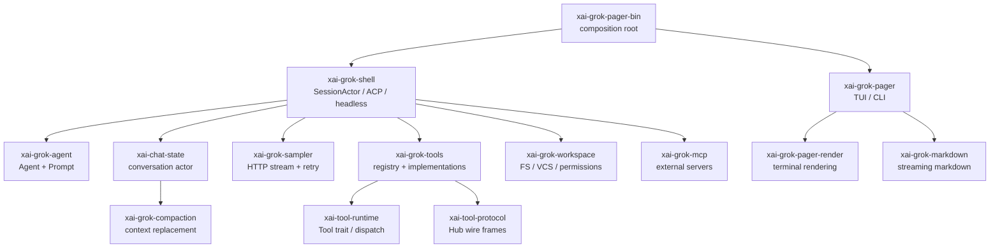

# 10 · Workspace Crate 全目录

这份目录回答“某个功能应该去哪一个 crate？”以及“这个 crate 先读哪个文件？”两个问题。表格由当前仓库的 `cargo metadata --no-deps --format-version 1` 和各包 `Cargo.toml` 的职责说明整理而成；代码同步后，先重新运行 metadata，再以 manifest 和源码为准。

> 根 `Cargo.toml` 是生成的 workspace 汇总，不把它当作业务模块阅读。这里列出的 81 个 package 也不都进入最终 `grok` 二进制：Cargo 会按目标包建立依赖闭包。

---

## 1. 先看依赖图，而不是先看目录树



### 推荐命令

```sh
# 看所有 package、路径和 target；不会编译
cargo metadata --no-deps --format-version 1 | jq '.packages[] | {name, manifest_path, targets}'

# 看某个产品入口的依赖闭包；`--invert` 可看反向依赖者
cargo tree -p xai-grok-pager-bin
cargo tree -p xai-grok-tools --invert

# 只看直接本地依赖，排除 crates.io 噪音
cargo tree -p xai-grok-shell --depth 1
```

`cargo tree` 的深度是依赖图，不是运行时调用图。调用关系仍需从 `src/lib.rs` 的模块声明、入口函数和测试 fixture 追踪。

---

## 2. 产品主闭包：先理解这 15 个

这是从二进制入口进入 Agent 主流程时最值得优先掌握的集合。

| Package | 目录 | 主要职责 | 首读源码 |
|---|---|---|---|
| `xai-grok-pager-bin` | `crates/codegen/xai-grok-pager-bin` | 二进制 composition root，选择 TUI、headless、leader、stdio | `src/main.rs` |
| `xai-grok-pager` | `crates/codegen/xai-grok-pager` | TUI 状态、输入、队列、scrollback、会话视图 | `src/app/`, `src/app/dispatch/`, `src/app/effects/` |
| `xai-grok-pager-render` | `crates/codegen/xai-grok-pager-render` | 终端 markdown、主题和渲染抽象 | `src/lib.rs`、`src/` 模块树 |
| `xai-grok-shell` | `crates/codegen/xai-grok-shell` | SessionActor、turn、权限、持久化、ACP、headless；认证实现位于 `src/auth/` | `src/session/`, `src/agent/app.rs`, `src/auth/` |
| `xai-grok-agent` | `crates/codegen/xai-grok-agent` | Agent definition、builder、system prompt、skills/plugins | `src/builder.rs`, `src/prompt/` |
| `xai-chat-state` | `crates/codegen/xai-chat-state` | conversation 权威状态、usage、持久化与 request builder | `src/actor/`, `src/handle.rs` |
| `xai-grok-sampler` | `crates/codegen/xai-grok-sampler` | 模型 HTTP streaming、响应解析、retry actor | `src/client.rs`, `src/actor/`, `src/stream/` |
| `xai-grok-sampling-types` | `crates/codegen/xai-grok-sampling-types` | Conversation、request/response、tool call 和 usage 数据类型 | `src/conversation.rs`, `src/lib.rs` |
| `xai-grok-tools` | `crates/codegen/xai-grok-tools` | ToolBridge、registry、Resources、内置/MCP/兼容工具 | `src/bridge.rs`, `src/registry/`, `src/types/resources.rs`, `src/implementations/` |
| `xai-grok-workspace` | `crates/codegen/xai-grok-workspace` | 本机 FS、Git/jj、命令执行、workspace session | `src/lib.rs`, `src/permission/`, `src/file_system/` |
| `xai-grok-compaction` | `crates/common/xai-grok-compaction` | 与传输解耦的上下文压缩和历史重建 | `src/lib.rs`, `src/code_compaction/` |
| `xai-grok-mcp` | `crates/codegen/xai-grok-mcp` | MCP server 连接、OAuth、credential store | `src/lib.rs`, `src/servers.rs`, `src/credentials.rs` |
| `xai-acp-lib` | `crates/codegen/xai-acp-lib` | ACP gateway、双向消息转发、tracing | `src/gateway.rs` |
| `xai-tool-runtime` | `crates/common/xai-tool-runtime` | 类型化 Tool trait、流式输出、object-safe dispatch | `src/tool.rs`, `src/dispatch.rs` |
| `xai-tool-protocol` | `crates/common/xai-tool-protocol` | Computer Hub 线协议、session/hook/notification frame | `src/frames.rs`, `src/capabilities.rs` |

这 15 个不是“所有代码”，而是解释一次普通用户消息所需的最短路径。先完成 [message-flow.md](./deep-dives/message-flow.md) 的 12 个断点，再扩展到下面的外围 crate。

---

## 3. Agent、Prompt 与会话扩展

| Package | 目录 | 职责 | 首读源码 |
|---|---|---|---|
| `xai-agent-lifecycle` | `crates/codegen/xai-agent-lifecycle` | turn/session 生命周期 contributors | `src/lib.rs` |
| `xai-grok-subagent-resolution` | `crates/codegen/xai-grok-subagent-resolution` | 子代理 definition、运行时解析、prompt 和 resume | `src/`、`src/context.rs`（以当前目录为准） |
| `xai-prompt-queue` | `crates/codegen/xai-prompt-queue` | shell/pager 共用的队列 wire types | `src/lib.rs` |
| `xai-workflow` | `crates/codegen/xai-workflow` | Rhai 脚本化工作流，编排 Agent 与 host channel | `src/lib.rs`, `src/validate.rs` |
| `xai-grok-hooks` | `crates/codegen/xai-grok-hooks` | 文件 hooks 发现、执行和 policy | `src/lib.rs`, `src/runner/mod.rs` |
| `xai-hooks-plugins-types` | `crates/codegen/xai-hooks-plugins-types` | hooks/plugins 的 ACP 扩展 DTO 和 wire shape | `src/lib.rs` |
| `xai-grok-plugin-marketplace` | `crates/codegen/xai-grok-plugin-marketplace` | 插件市场、registry 和安装元数据 | `src/lib.rs`, `src/` |
| `xai-grok-memory` | `crates/codegen/xai-grok-memory` | 跨 turn/session memory backend 和检索 | `src/lib.rs`, `src/` |
| `xai-grok-announcements` | `crates/codegen/xai-grok-announcements` | CLI announcement 类型、持久化和格式化 | `src/lib.rs` |
| `xai-interjection-core` | `crates/common/xai-interjection-core` | mid-turn 用户插话缓冲和格式化 | `src/lib.rs`, `src/buffer.rs`, `src/events.rs` |

### 按问题反查

| 现象/需求 | 阅读顺序 |
|---|---|
| Agent definition 没被发现 | `xai-grok-agent/src/discovery.rs` → `src/config.rs` → `src/builder.rs` |
| 子代理继承了错误上下文 | `xai-grok-shell/.../spawn.rs` → `xai-grok-subagent-resolution` → `xai-grok-agent/src/prompt/` |
| 子代理或 Workflow 状态不一致 | `xai-grok-shell/src/agent/subagent/` → `xai-grok-subagent-resolution` → `xai-workflow` → `session/workflow/{manager,tracker,store}.rs`；见 [`subagents-and-workflows`](./deep-dives/subagents-and-workflows.md) |
| Skill 热加载或重复注入 | shell `run_loop.rs` → `xai-grok-agent/src/prompt/skills.rs` → pager user guide skills |
| hook 没执行/被拒绝 | `xai-grok-hooks` → shell `session/acp_session_impl/hooks_plugins.rs` → `xai-agent-lifecycle` |
| `/goal` 或 workflow 反复续跑 | shell `session/acp_session_impl/goal*.rs` → `xai-workflow` → tools goal/workflow implementations |
| 用户插话没有打断等待工具 | `xai-interjection-core` → shell `interjection.rs` / `tool_calls.rs` |

---

## 4. 工具、Computer Hub 和 MCP

| Package | 目录 | 职责 | 首读源码 |
|---|---|---|---|
| `xai-tool-types` | `crates/common/xai-tool-types` | canonical tool description、参数和共享类型 | `src/lib.rs`, `src/types.rs` |
| `xai-computer-hub-core` | `crates/common/xai-computer-hub-core` | transport、ToolRegistry、resolver 抽象 | `src/lib.rs`, `src/registry.rs` |
| `xai-computer-hub-sdk` | `crates/common/xai-computer-hub-sdk` | connection pool、reconnect、tool harness/server runtime | `src/lib.rs`, `src/` |
| `xai-computer-hub-mcp-adapter` | `crates/common/xai-computer-hub-mcp-adapter` | 将 MCP 发现工具注册成 Hub 原生工具 | `src/lib.rs`, `src/bridge.rs` |
| `xai-grok-tools-api` | `crates/codegen/xai-grok-tools-api` | protobuf API 定义和生成类型 | `proto/`, `build.rs`, `src/lib.rs` |
| `xai-grok-tools` | `crates/codegen/xai-grok-tools` | GrokBuild 工具 registry、资源注入、持久化和实现 | `src/registry/types.rs`, `src/types/resources.rs`, `src/bridge.rs` |
| `xai-grok-mcp` | `crates/codegen/xai-grok-mcp` | rmcp 适配、MCP OAuth 和 server 生命周期 | `src/servers.rs`, `src/oauth.rs`, `src/credentials.rs` |

工具的依赖方向应大致保持：

```text
具体工具实现
  -> xai-grok-tools registry/bridge
  -> xai-tool-runtime（类型化执行契约）
  -> xai-tool-protocol / computer-hub（需要跨进程时）
  -> shell SessionActor（权限、取消、回写策略）
```

不要让一个具体工具反向依赖 Pager UI；需要展示进度时使用 runtime stream 和 notification handle，让不同 host（TUI、headless、IDE）都能消费。

---

## 5. Workspace、文件系统和代码理解

| Package | 目录 | 职责 | 首读源码 |
|---|---|---|---|
| `xai-grok-workspace` | `crates/codegen/xai-grok-workspace` | FS、VCS、执行、权限和 workspace session | `src/lib.rs`, `src/file_system/`, `src/permission/` |
| `xai-grok-workspace-types` | `crates/codegen/xai-grok-workspace-types` | workspace RPC request/chunk/event wire types | `src/lib.rs` |
| `xai-grok-workspace-client` | `crates/codegen/xai-grok-workspace-client` | hub-proxied `workspace.*` typed client | `src/lib.rs` |
| `xai-codebase-graph` | `crates/codegen/xai-codebase-graph` | tree-sitter 代码图、索引和增量内存 | `src/lib.rs`, `src/bin/code_graph.rs` |
| `xai-fast-worktree` | `crates/codegen/xai-fast-worktree` | CoW Git worktree 创建、overlay 与池 | `src/lib.rs`, `src/bin/cli.rs` |
| `xai-hunk-tracker` | `crates/codegen/xai-hunk-tracker` | agent/external 修改 hunk 归因 | `src/lib.rs` |
| `xai-fsnotify` | `crates/codegen/xai-fsnotify` | 语义化文件系统事件单一因果流 | `src/lib.rs`, `src/watcher.rs`, `src/event.rs` |
| `xai-gix-status` | `crates/codegen/xai-gix-status` | gix status 的线程预算和安全辅助 | `src/lib.rs` |
| `xai-grok-paths` | `crates/codegen/xai-grok-paths` | absolute/relative UTF-8 path type wrappers | `src/lib.rs` |
| `xai-file-utils` | `crates/codegen/xai-file-utils` | 每 turn 的本地事件收集和 trace helpers | `src/lib.rs`, `src/trace_context.rs` |
| `xai-sqlite-journal` | `crates/codegen/xai-sqlite-journal` | 按文件系统选择 WAL 或 rollback journal | `src/lib.rs` |

### 功能反查

| 需求 | 首查 crate | 需要同时验证 |
|---|---|---|
| 读/改文件后显示 diff | workspace FS → `xai-hunk-tracker` → Pager update | 权限、hunk 归因、回放 |
| Git 状态或 worktree 错误 | `xai-grok-workspace` → `xai-gix-status` / `xai-fast-worktree` | 临时目录、并发和网络盘 |
| 文件变化没有触发索引 | `xai-fsnotify` → shell fs watcher → `xai-codebase-graph` | debounce、watch capability gate |
| 路径穿越或 sandbox 问题 | `xai-grok-paths` → workspace permission → `xai-grok-sandbox` | Unix/macOS capability 差异 |
| session 在网络盘异常 | `xai-sqlite-journal` → shell persistence | WAL 降级和恢复测试 |

---

## 6. 网络、认证、配置和隐私

| Package | 目录 | 职责 | 首读源码 |
|---|---|---|---|
| `xai-grok-auth` | `crates/codegen/xai-grok-auth` | `HttpAuth` / credential provider 的依赖反转接口 | `src/lib.rs` |
| `xai-grok-config-types` | `crates/codegen/xai-grok-config-types` | 无 I/O 的配置 value types | `src/lib.rs` |
| `xai-grok-config` | `crates/codegen/xai-grok-config` | grok home、effective config、TOML merge | `src/lib.rs`, `src/loader.rs` |
| shell config runtime | `crates/codegen/xai-grok-shell/src/agent/config.rs` + `src/util/config/resolve/` | typed Config、来源优先级、runtime-only 字段和 settings refresh | `agent/config.rs`, `config/reloader.rs`, `agent/mvp_agent/agent_ops.rs` |
| `xai-grok-workspace` session/worktree | `crates/codegen/xai-grok-workspace/src/session/` + `src/worktree/` | workspace session、文件/hunk/git rewind、checkpoint mirror、隔离目录生命周期 | `session/file_state.rs`, `session/checkpoint.rs`, `worktree/mod.rs` |
| `xai-grok-env` | `crates/codegen/xai-grok-env` | endpoint defaults、环境变量测试 preset | `src/lib.rs` |
| `xai-grok-http` | `crates/codegen/xai-grok-http` | reqwest client、User-Agent 和 HTTP policy | `src/lib.rs` |
| `xai-grok-extra-ca` | `crates/codegen/xai-grok-extra-ca` | `GROK_EXTRA_CA_BUNDLE`、DER 缓存和 reqwest adapter | `src/lib.rs` |
| `xai-grok-secrets` | `crates/codegen/xai-grok-secrets` | Sentry/Mixpanel/product event outbound scrub | `src/lib.rs` |
| `xai-grok-sandbox` | `crates/codegen/xai-grok-sandbox` | Landlock/Seatbelt OS sandbox | `src/lib.rs`, `src/` |
| `xai-grok-models` | `crates/codegen/xai-grok-models` | 默认模型 ID 和 embedded model table | `src/lib.rs`, `default_models.json` |
| `xai-grok-version` | `crates/codegen/xai-grok-version` | lockstepped CLI version | `src/lib.rs`, `build.rs` |
| `xai-grok-update` | `crates/codegen/xai-grok-update` | update 检查、安装、并发收敛和回滚策略 | `src/lib.rs` |

配置与认证的依赖反转值得特别注意：leaf crate 定义 trait 或纯类型，shell 才提供具体 I/O。修改配置字段时先看 `xai-grok-config-types`，修改生效优先级时再看 `xai-grok-config`，修改 session 行为最后看 shell。

---

## 7. Sampler、协议和可观察性

| Package | 目录 | 职责 | 首读源码 |
|---|---|---|---|
| `xai-grok-sampler` | `crates/codegen/xai-grok-sampler` | sampling Actor、HTTP streaming、retry/doom loop | `src/lib.rs`, `src/client.rs`, `src/actor/` |
| `xai-grok-sampling-types` | `crates/codegen/xai-grok-sampling-types` | 纯 request/response/conversation 类型 | `src/conversation.rs`, `src/messages.rs` |
| `xai-acp-lib` | `crates/codegen/xai-acp-lib` | ACP gateway sender/receiver 和 forwarding | `src/gateway.rs` |
| `xai-tool-protocol` | `crates/common/xai-tool-protocol` | Hub JSON-RPC frames、hooks、session events | `src/frames.rs`, `src/session_event.rs` |
| `xai-grok-telemetry` | `crates/codegen/xai-grok-telemetry` | unified log、Mixpanel、Sentry、OTel layers | `src/lib.rs`, `src/` |
| `xai-mixpanel` | `crates/codegen/xai-mixpanel` | 轻量 Mixpanel HTTP client | `src/lib.rs` |
| `xai-file-utils` | `crates/codegen/xai-file-utils` | trace context、本地 turn event 数据 | `src/lib.rs` |
| `xai-tracing` | `crates/common/xai-tracing` | 共享 tracing 类型和初始化辅助 | `src/lib.rs` |
| `xai-tracing-macros` | `crates/codegen/xai-tracing-macros` | `timed` / `tprintln` 等过程宏 | `src/lib.rs` |
| `xai-circuit-breaker` | `crates/common/xai-circuit-breaker` | 失败熔断和恢复窗口 | `src/lib.rs` |

可观测性专题的最短源码路径是：`xai-grok-telemetry/{session_ctx,unified_log,debug_log,instrumentation,otel_layer,external}`，再接 `xai-file-utils/src/trace_context.rs` 和 `xai-tracing/src/tokio.rs`。这些模块分别拥有上下文、落盘、路由、耗时、导出、脱敏和跨 task/协议传播，不要把它们当成一个“大日志模块”。

### 事件的三种用途

```text
sampling/tool stream
  ├─ SessionUpdate：给当前 client/UI 的即时反馈
  ├─ replay/persistence：恢复和审计所需的事件顺序
  └─ tracing/unified log：调试、耗时和产品指标
```

修事件结构时，要分别测试这三种 consumer。一个序列化测试只能证明 wire shape，不能证明 Pager 会正确渲染或 persistence 会按顺序落盘。

---

## 8. UI、终端和跨平台辅助

| Package | 目录 | 职责 | 首读源码 |
|---|---|---|---|
| `ptyctl` | `crates/codegen/ptyctl` | 基于 `alacritty_terminal` 的 headless PTY controller | `src/lib.rs` |
| `ptyctl-cli` | `crates/codegen/ptyctl-cli` | PTY controller CLI | `src/main.rs` |
| `xai-grok-pager-minimal` | `crates/codegen/xai-grok-pager-minimal` | 最小 Pager host/可嵌入入口 | `src/lib.rs` |
| `xai-grok-pager-pty-harness` | `crates/codegen/xai-grok-pager-pty-harness` | Pager PTY e2e scenario、benchmark 和矩阵 | `src/lib.rs`, `src/bin/` |
| `xai-ratatui-inline` | `crates/codegen/xai-ratatui-inline` | inline ratatui 渲染辅助 | `src/lib.rs` |
| `xai-ratatui-textarea` | `crates/codegen/xai-ratatui-textarea` | textarea widget | `src/lib.rs`, `examples/textarea_demo.rs` |
| `xai-grok-markdown-core` | `crates/codegen/xai-grok-markdown-core` | headless markdown AST/分析 | `src/lib.rs` |
| `xai-grok-markdown` | `crates/codegen/xai-grok-markdown` | streaming markdown terminal renderer | `src/lib.rs`, `src/` |
| `xai-grok-mermaid` | `crates/codegen/xai-grok-mermaid` | Mermaid source 到 PNG 的 engine seam | `src/lib.rs` |
| `xai-grok-voice` | `crates/codegen/xai-grok-voice` | streaming speech-to-text 与 voice probe | `src/lib.rs`, `src/bin/voice_probe.rs` |
| `xai-tty-utils` | `crates/codegen/xai-tty-utils` | TTY 安全 spawn、进程组和 pager 抑制 | `src/lib.rs` |
| `xai-system-power` | `crates/codegen/xai-system-power` | suspend/resume 通知，避免系统休眠破坏后台工作 | `src/lib.rs` |
| `xai-crash-handler` | `crates/codegen/xai-crash-handler` | Unix signal/Windows SEH 和启动崩溃检测 | `src/lib.rs` |

UI 改动的测试层级通常是：纯状态 reducer → render/snapshot → PTY harness → 少量真实终端手测。`xai-grok-pager-pty-harness` 是理解“终端看到了什么”的关键，而不是生产运行时本身。

---

## 9. 共享叶子、构建和测试支持

| Package | 目录 | 职责 | 首读源码 |
|---|---|---|---|
| `xai-proto-build` | `crates/build/xai-proto-build` | protoc 定位、prost/tonic build 辅助 | `src/lib.rs`, `src/find_protoc.rs` |
| `xai-grok-tools-api` | `crates/codegen/xai-grok-tools-api` | Grok tools protobuf API | `build.rs`, `src/lib.rs`, `proto/` |
| `xai-grok-test-support` | `crates/codegen/xai-grok-test-support` | mock inference、SSE、ACP stdio、headless runner、env sandbox | `src/lib.rs` |
| `xai-test-utils` | `crates/common/xai-test-utils` | hermetic git 和 runfiles 测试工具 | `src/lib.rs` |
| `xai-grok-shell-base` | `crates/codegen/xai-grok-shell-base` | shell family 的 env、CPU profile、进程/FS 工具 | `src/lib.rs` |
| `xai-grok-shell-session-support` | `crates/codegen/xai-grok-shell-session-support` | MCP catalog/credential cache 和 file access tracking | `src/lib.rs` |
| `xai-grok-shared` | `crates/codegen/xai-grok-shared` | CLI family 共享辅助代码 | `src/lib.rs` |
| `xai-grok-paths` | `crates/codegen/xai-grok-paths` | UTF-8 absolute/relative path wrappers | `src/lib.rs` |
| `xai-token-estimation` | `crates/codegen/xai-token-estimation` | 共享 token 估算原语，供 prompt/上下文预算使用 | `src/lib.rs` |

构建失败时先按错误涉及的 package 选择 `cargo check -p`。例如 `protoc` 错误属于 `xai-grok-tools-api` / `xai-proto-build` 的构建闭包，不应先修改 Agent 代码。

---

## 10. Prod 和 third_party

| Package | 目录 | 为什么在 workspace | 阅读建议 |
|---|---|---|---|
| `prod-mc-cli-chat-proxy-types` | `prod/mc/cli-chat-proxy-types` | cli-chat-proxy 的轻量 request/response wire types | 先读 `src/lib.rs`，把它当外部 API 类型 |
| `dagre_rust` | `third_party/dagre_rust` | vendored Dagre layout port | 只有改 Mermaid layout 才进入 |
| `graphlib_rust` | `third_party/graphlib_rust` | vendored graphlib 数据结构/算法 | 先看 `../../third_party/README.md` 和许可 |
| `mermaid-to-svg` | `third_party/mermaid-to-svg` | Mermaid parser/layout/SVG renderer 的 vendored port | 改图表渲染时连同 `xai-grok-mermaid` 阅读 |
| `ordered_hashmap` | `third_party/ordered_hashmap` | vendored insertion-order map | 只在 Mermaid stack 依赖链中阅读 |

third-party 代码有独立许可证和变更通知要求。不要为了修一处产品行为直接复制或大改 vendored 源码；先确认上层 adapter 是否能解决。

---

## 11. 从功能到 crate 的反查矩阵

| 我想理解/修改… | 第一站 | 第二站 | 最小验证 |
|---|---|---|---|
| 用户消息如何进入模型 | Pager `dispatch/queue.rs` | shell `run_loop.rs` + `turn.rs` | `cargo test -p xai-grok-pager queue`；见 [`message-flow`](./deep-dives/message-flow.md) |
| 修改系统 prompt | `xai-grok-agent/src/prompt/` | shell `session/acp_session_impl/prompt_build.rs` | `cargo test -p xai-grok-agent` |
| 增加内置工具 | `xai-grok-tools/implementations/` | `registry/types.rs` + runtime `tool.rs` | `cargo test -p xai-grok-tools` |
| 工具结果没有回写 | shell `tool_calls.rs` | ChatState `handle.rs` / mutations | tool/session targeted test |
| 上下文过长 | ChatState `request_builder.rs` | `xai-grok-compaction` + shell compaction | `cargo test -p xai-chat-state` |
| 模型流式响应/重试 | `xai-grok-sampler/src/stream/` | shell `sampling/` | `cargo test -p xai-grok-sampler` |
| IDE/ACP 集成 | `xai-acp-lib/src/gateway.rs` | shell `mvp_agent/` + `session/acp_*` | ACP fixture / shell test |
| MCP 工具发现/断线 | `xai-grok-mcp` | shell `session/.../mcp.rs` | MCP integration test |
| MCP 状态事件/恢复竞态 | shell `session/mcp_dispatcher.rs` + `mcp_restart.rs` | `xai-grok-mcp/src/liveness.rs` | paused-clock dispatcher/e2e fixture；见 [`mcp-dispatcher`](./deep-dives/mcp-dispatcher.md) |
| 配置值不生效/策略覆盖 | `xai-grok-config/src/loader.rs` + `validation.rs` | shell `agent/config.rs` + `util/config/resolve/` | layer/resolver precedence fixture；见 [`configuration-and-runtime-resolution`](./deep-dives/configuration-and-runtime-resolution.md) |
| Agent 修改如何恢复 | `xai-grok-workspace/src/session/file_state.rs` + `checkpoint.rs` | `worktree/mod.rs` + `xai-hunk-tracker` | MockFs rewind + temp Git/JJ fixture；见 [`workspace-state-and-worktree-lifecycle`](./deep-dives/workspace-state-and-worktree-lifecycle.md) |
| 文件编辑权限 | workspace `permission/` | tools edit implementation + sandbox | temp-dir permission test；见 [`permissions-and-sandbox`](./deep-dives/permissions-and-sandbox.md) |
| worktree/fork | `xai-fast-worktree` | shell `spawn.rs` / workspace worktree | fork/worktree e2e |
| TUI 布局或滚动 | pager `src/views/` / `scrollback/` | pager PTY harness | render/snapshot/PTY；见 [`pager-rendering`](./deep-dives/pager-rendering.md) |
| 网络和证书 | `xai-grok-http` / `xai-grok-extra-ca` | shell auth/config | crate tests + offline fixture |
| 隐私脱敏 | `xai-grok-secrets` | telemetry layers | sanitizer tests |
| 版本更新 | `xai-grok-update` / `xai-grok-version` | pager-bin startup | package tests |

---

## 12. 贡献者的 crate 选择原则

### 12.1 先改契约定义处

如果改变的是跨进程 JSON、protobuf、ACP 或工具 schema，先修改定义它的低层 crate，再修 adapter 和产品层。这样编译器会把遗漏的 consumer 暴露出来。

### 12.2 不为一个功能制造第二份状态

| 状态 | 权威 owner | 其它层应该做什么 |
|---|---|---|
| conversation/history | `ChatStateActor` | 通过 `ChatStateHandle` 发命令 |
| turn running/cancel | `SessionActor` | 发送 `SessionCommand`，不要直接 abort 随机 task |
| 工具资源/registry | `FinalizedToolset` / ToolBridge | 通过 bridge/runtime 查询或 dispatch |
| TUI 显示 | Pager `AppView` / scrollback | 订阅 ACP/session update |
| workspace 权限 | workspace/session permission | 通过 host API 请求决策 |
| prompt 组成 | Agent + `PromptContext` | 修改输入字段或模板，不在下游拼字符串 |

### 12.3 读测试名判断维护者关心什么

大量行为测试按功能命名，例如 `test_mcp_integration`、`test_fork_session`、`pty_e2e_queue`、`tool_streaming`。先读测试的 fixture 建立方式，再读 production path，通常比从最大模块文件顶部开始更快。

---

## 13. 维护这份目录

代码同步后执行：

```sh
cargo metadata --no-deps --format-version 1 \
  | jq -r '.packages[] | [.name, .manifest_path] | @tsv'

rg -n '^pub mod |^mod |^\#\[path' crates/codegen/xai-grok-shell/src/session \
  crates/codegen/xai-grok-agent/src crates/codegen/xai-grok-tools/src
```

出现以下变化时更新本页：

- 新增 workspace package 或删除 package；
- composition root、Agent 主闭包或协议边界变化；
- 目录重命名、公共入口函数迁移；
- 某 package 从“共享叶子”变成产品运行时依赖，或反之。

本页的职责是导航，不替代 crate 内 README、Rustdoc、用户手册或协议规范。导航和源码冲突时，以源码为准，并把冲突记录为需要修正文档的任务。
