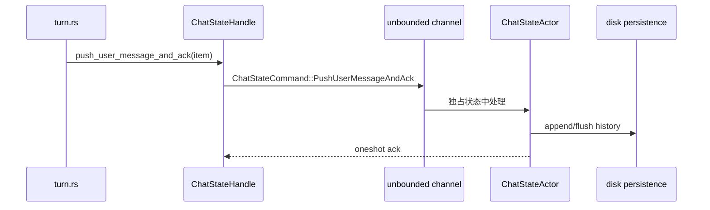

# 11 · Rust × Agent 源码实验手册

这不是一套脱离仓库的 Rust 练习，而是把语言概念和 Grok Build 的真实代码绑定起来。每个实验都包含：

- **Rust 目标**：需要理解的语言/异步/测试概念；
- **Agent 目标**：它在 Agent 运行时中解决什么问题；
- **源码入口**：先读哪些文件；
- **操作**：尽量使用现有测试和命令；
- **完成证据**：怎样证明自己真的理解，而不是只看过代码。

建议按顺序完成 0→10。每个实验都可以在不接入真实模型、不使用真实 API key 的情况下完成。

---

## 0. 建立自己的源码地图

### Rust 目标

理解 Cargo package、workspace member、crate root、module tree 和 feature。知道 `cargo check -p X` 检查的是依赖闭包，而不是一个孤立目录。

### Agent 目标

区分 composition root、host、runtime、data types、tool implementation 五类职责。

### 操作

```sh
cargo metadata --no-deps --format-version 1 \
  | jq -r '.packages[] | [.name, .manifest_path] | @tsv'

cargo tree -p xai-grok-pager-bin --depth 1
cargo tree -p xai-grok-shell --depth 1
cargo tree -p xai-grok-tools --depth 1
```

打开 [10-crate-catalog.md](./10-crate-catalog.md)，为你最感兴趣的功能画一条依赖链：

```text
用户功能 -> 产品入口 -> runtime crate -> shared leaf -> 外部依赖
```

### 完成证据

写下三条解释，不看目录名猜测：

1. 为什么 `xai-grok-sampling-types` 不应该依赖 `xai-grok-shell`？
2. 为什么 `xai-grok-pager-bin` 是 composition root，而不是 Agent Loop？
3. 为什么 `third_party/mermaid-to-svg` 不在普通工具调用的主闭包中？

---

## 1. 从 `Handle` 理解 Actor 和 ownership

### Rust 目标

理解 `Arc`、channel、消息所有权、`Send`/`Sync` 和“Handle 可 clone、状态不可直接借用”的设计。

### Agent 目标

理解为什么 `ChatStateActor` 是 conversation 的单一权威源，以及异步模块如何避免同时修改历史。

### 源码入口

- `crates/codegen/xai-chat-state/src/handle.rs`
- `crates/codegen/xai-chat-state/src/commands.rs`
- `crates/codegen/xai-chat-state/src/actor/mod.rs`
- `crates/codegen/xai-chat-state/src/actor/mutations.rs`

重点跟踪：`push_user_message_and_ack`、`push_assistant_response`、`push_tool_result` 和 actor 的 command match。

### 操作

```sh
cargo test -p xai-chat-state
rg -n "push_user_message|push_assistant_response|push_tool_result" \
  crates/codegen/xai-chat-state crates/codegen/xai-grok-shell/src/session
```

然后画出：



### 完成证据

回答：如果两个 task 同时调用 `push_tool_result`，为什么 conversation 顺序仍由 actor 的接收顺序决定？如果 actor 掉线，Handle 为什么只能返回 `None`/忽略 send，而不能修复状态？

---

## 2. 用 Tokio `select!` 看懂 SessionActor

### Rust 目标

理解 `tokio::select!`、biased 分支、取消安全和 `spawn_local` 生命周期。

### Agent 目标

理解一个 session 如何同时处理 prompt、取消、MCP liveness、文件 watcher、replay flush 和后台完成事件。

### 源码入口

- `crates/codegen/xai-grok-shell/src/session/acp_session_impl/run_loop.rs`
- `crates/codegen/xai-grok-shell/src/session/commands.rs`
- [deep-dives/run-session.md](./deep-dives/run-session.md)

### 操作

```sh
rg -n "tokio::select!|SessionCommand::Prompt|SessionCommand::Cancel|Shutdown|completion_rx" \
  crates/codegen/xai-grok-shell/src/session/acp_session_impl/run_loop.rs
cargo test -p xai-grok-shell run_session -- --nocapture
```

如果过滤不到测试，不要把它当失败：先用 `cargo test -p xai-grok-shell -- --list | rg -i 'session|cancel|shutdown'` 找当前版本的测试名。

### 完成证据

画出一个“输入到 running task”的状态图，并注明：

- 哪个状态表示队列非空但没有运行；
- `send_now` 取消的是谁；
- shutdown 为什么要 flush replay buffer；
- 哪些分支可以安全地让 `.await` 取消，哪些需要清理 guard。

---

## 3. 追踪 session 持久化、恢复和 replay

### Rust 目标

理解 trait object、消息顺序、oneshot barrier、文件 I/O 的提交边界，以及 JSONL 的 append-only 与原子 replace 的差异。

### Agent 目标

区分 durable `updates.jsonl`、可替换的 `chat_history.jsonl` 和只存在于内存的 `ReplayBuffer`，能够解释 crash、磁盘满、compaction、rewind 与 fork 的行为。

### 源码入口

- [deep-dives/persistence-and-replay.md](./deep-dives/persistence-and-replay.md)
- `crates/codegen/xai-grok-shell/src/session/persistence.rs`
- `crates/codegen/xai-grok-shell/src/session/storage/mod.rs`
- `crates/codegen/xai-grok-shell/src/session/storage/jsonl/mod.rs`
- `crates/codegen/xai-grok-shell/src/session/storage/mod.rs` 中的 `chat_rebuild` 模块
- `crates/codegen/xai-grok-shell/src/agent/update_chunk_merge.rs`

### 操作

```sh
rg -n "PersistenceMsg::(Chat|Update|FlushAndAck|ReplaceChatHistory)|AppendUpdateError" \
  crates/codegen/xai-grok-shell/src/session
rg -n "filter_rewind_(lines|updates)|load_updates_for_replay|collect_prompts_from_events" \
  crates/codegen/xai-grok-shell/src/session/storage/mod.rs
rg -n "ReplayBuffer|replay_buffer\.flush|FlushReplay" \
  crates/codegen/xai-grok-shell/src/agent crates/codegen/xai-grok-shell/src/session
```

只读测试 fixture 和临时目录相关测试，画出以下三个结果：

1. 两轮 prompt 后执行 compaction，哪些数据仍在 `updates.jsonl`？
2. 追加 `RewindMarker(target_prompt_index = 1)` 后，raw filter 如何删除旧分支？
3. 在 JSONL 尾部留下半行 JSON，为什么下一次 load 仍能恢复前面的记录？

### 完成证据

写一张表区分 `NotCommitted`、`Committed`、`Flush` 和 `FlushAndAck`。再回答：为什么 `replace_history` 可以改 `chat_history.jsonl`，却不能把 request-level pruning 当作永久历史删除？为什么 turn completion 和 shutdown 必须 flush `ReplayBuffer`？

## 4. 从 prompt 模板到最终 System Prompt

### Rust 目标

理解 enum 作为策略、Serde tagged/兼容反序列化、借用与拥有字符串的取舍，以及模板渲染错误如何传播。

### Agent 目标

理解 Agent definition、模板、AGENTS.md、skills、memory、primary/subagent audience 如何共同塑造模型行为。

### 源码入口

- `crates/codegen/xai-grok-agent/src/config.rs`
- `crates/codegen/xai-grok-agent/src/builder.rs`
- `crates/codegen/xai-grok-agent/src/prompt/context.rs`
- `crates/codegen/xai-grok-agent/src/prompt/template.rs`
- `crates/codegen/xai-grok-agent/templates/prompt.md`
- `crates/codegen/xai-grok-agent/templates/subagent_prompt.md`

### 操作

```sh
cargo test -p xai-grok-agent
rg -n "PromptMode|PromptAudience|TemplateOverride|AGENTS|skill" \
  crates/codegen/xai-grok-agent/src crates/codegen/xai-grok-agent/templates
```

用一个最小 definition 做静态实验：

```markdown
---
name: exercise-reviewer
description: Reads code and reports risks
tools:
  - read_file
permissionMode: plan
---

Return findings ordered by severity.
```

不需要运行真实 Agent；只需追踪 `AgentDefinition` 如何进入 `AgentBuilder`，再进入 `PromptContext` 和 `TemplateRenderer`。

### 完成证据

用表格写出 extend/full 两种模式的差异，并回答：为什么 subagent 不应无条件继承主 Agent 的 persona catalog？为什么工具名覆盖必须和 prompt 模板变量一起考虑？

---

## 5. 实现一个只读 Tool 的类型边界

### Rust 目标

理解 trait associated types、`Deserialize`、`JsonSchema`、object-safe adapter、`Result` 和 stream terminal invariant。

### Agent 目标

理解“工具能编译”与“模型能发现、调用、理解结果”之间的差异。

### 源码入口

- `crates/common/xai-tool-runtime/src/tool.rs`
- `crates/common/xai-tool-runtime/src/dispatch.rs`
- `crates/codegen/xai-grok-tools/src/registry/types.rs`
- `crates/codegen/xai-grok-tools/src/bridge.rs`
- `crates/codegen/xai-grok-tools/src/implementations/grok_build/list_dir/`

### 操作

```sh
cargo test -p xai-tool-runtime
cargo test -p xai-grok-tools registry
rg -n "register_with_params|ToolStreamItem|ToolOutput|should_list|capabilities" \
  crates/common/xai-tool-runtime crates/codegen/xai-grok-tools
```

不修改 production 代码，先为一个现有只读工具画出：

```text
JSON args -> Args -> Tool::execute -> Progress* -> Terminal -> ToolRunResult
         -> ToolDefinition/schema -----------------------> model
```

### 完成证据

说明以下故障各发生在哪一层：

- 工具不在 `tools` 数组：registry/finalize/allowlist；
- `unknown tool`：client-facing name 到 ToolId 的映射；
- 流结束但没有最终结果：runtime stream invariant；
- UI 有结果但模型不知情：`prompt_text` 或 ChatState mutation。

新增工具前先读 [tool-call-pipeline.md](./deep-dives/tool-call-pipeline.md) 的最小清单。

---

## 6. 观察一次采样和一次重试

### Rust 目标

理解 Stream、pin、背压、错误枚举、重试策略和 span 生命周期。

### Agent 目标

理解 sampler 为什么不拥有 session 历史，也不决定工具权限；它只负责把 request 变成流和可分类错误。

### 源码入口

- `crates/codegen/xai-grok-sampler/src/client.rs`
- `crates/codegen/xai-grok-sampler/src/stream/`
- `crates/codegen/xai-grok-sampler/src/retry.rs`
- `crates/codegen/xai-grok-shell/src/sampling/`

### 操作

```sh
cargo test -p xai-grok-sampler
cargo test -p xai-grok-sampler -- --list | rg -i 'stream|retry|error|doom'
rg -n "Stream|retry|doom|CancellationToken|usage" \
  crates/codegen/xai-grok-sampler/src crates/codegen/xai-grok-shell/src/sampling
```

读测试 fixture，记录每种错误的分类：可重试、需要刷新认证、不可重试、用户取消、后端协议错误。

### 完成证据

画出：

```text
ConversationRequest
  -> HTTP client
  -> byte/SSE stream
  -> typed delta
  -> sampler event
  -> SessionActor
```

并说明为什么“重试采样请求”不能复制或重排 ChatState 的 tool result。

---

## 7. 让上下文预算成为可解释的数字

### Rust 目标

理解纯函数测试、不可变 request copy、`Arc<str>`、token/byte budget 和边界条件。

### Agent 目标

理解 request-level pruning、image eviction、session-level compaction 的差异，以及为什么历史不能随便截断。

### 源码入口

- `crates/codegen/xai-chat-state/src/actor/request_builder.rs`
- `crates/codegen/xai-chat-state/src/compaction_utils.rs`
- `crates/common/xai-grok-compaction/src/code_compaction/`
- `crates/codegen/xai-grok-shell/src/session/compaction.rs`
- `crates/codegen/xai-token-estimation/src/lib.rs`

### 操作

```sh
cargo test -p xai-chat-state
cargo test -p xai-grok-compaction
cargo test -p xai-token-estimation
rg -n "should_prune|soft_trim|hard_clear|context_window|MAX_REQUEST_BYTES" \
  crates/codegen/xai-chat-state crates/common/xai-grok-compaction crates/codegen/xai-token-estimation
```

### 完成证据

针对一个包含 system、user、assistant tool call、tool result、image 的历史，写出三份结果：

1. 原始 ChatState conversation；
2. 本轮 request copy；
3. full compaction 后的新 conversation。

标出哪些内容只在 request 中被裁剪，哪些内容真正替换了权威历史，以及每一步如何保护 tool-call/result 配对。

---

## 8. 用 fake host 测试一个 Agent turn

### Rust 目标

理解测试 double、临时目录、mock server、ACP stdio client、环境隔离和 deterministic async test。

### Agent 目标

把前六个实验连接起来：一条 prompt 是否能从 host 到 sampler，再到 tool/result 和 completion。

### 源码入口

- `crates/codegen/xai-grok-test-support/src/`
- `crates/codegen/xai-grok-shell/tests/`
- `crates/codegen/xai-grok-pager-pty-harness/`
- `crates/codegen/xai-grok-sampler/tests/`

### 操作

```sh
cargo test -p xai-grok-shell -- --list | rg -i 'sampling|session|tool|acp|headless'
cargo test -p xai-grok-shell test_sampling_client
cargo test -p xai-grok-pager-pty-harness -- --list
```

从现有 fixture 复制最小测试结构，不接真实网络。测试输入、模型 fixture、预期 tool call、tool result 和 final stop reason。

### 完成证据

测试失败时能指出失败属于以下哪一层，而不是只说“Agent 不工作”：

```text
Pager queue -> ACP transport -> SessionCommand
             -> prompt parsing -> ChatState request
             -> sampler fixture -> tool dispatch
             -> ChatState result -> final response
```

---

## 9. 做一次真正的小改动

选择一个低风险改动：错误文案、日志字段、已有工具 schema 的描述、一个 prompt 渲染边界或一个纯函数 bug。遵循 [09-contributor-playbook.md](./09-contributor-playbook.md)：

1. 用 `rg` 找用户可见入口和测试；
2. 写出状态 owner、外部契约和预期证据；
3. 先改最底层契约或真正 owner；
4. 先跑过滤后的测试；
5. 再跑目标 crate 的完整 test/check/clippy；
6. 检查 `git diff --check` 和无关生成物；
7. 写一段可重放的变更说明。

```sh
cargo fmt --all
cargo test -p <crate> <focused_test>
cargo test -p <crate>
cargo check -p <crate>
cargo clippy -p <crate>
git diff --check
```

### 完成证据模板

```text
问题：什么行为不对？
入口：哪个用户动作/协议请求触发？
Owner：哪个 actor/crate 拥有权威状态？
修改：哪几个文件为什么要改？
验证：每条命令证明了哪一层？
残余风险：网络、真实 TUI、跨平台或外部 client 还未覆盖什么？
```

如果当前仓库上下游不接受外部 PR，仍然保留这份 evidence；它可以直接用于内部审查、下游 patch、问题报告或未来同步冲突处理。

---

## 10. 继续深入的分流

完成实验 0–10 后按兴趣选择：

| 方向 | 下一篇/下一组源码 |
|---|---|
| Rust async/actor | `rust-essentials/08`–`17`、shell `run_loop.rs` |
| Agent 行为和 prompt | `05-prompt-engineering.md`、`xai-grok-agent/src/prompt/` |
| 工具和安全 | `deep-dives/tool-call-pipeline.md`、workspace permission、sandbox |
| 长会话和 memory | `04-context-management.md`、compaction、memory crate |
| ACP/MCP 集成 | `06-interfaces.md`、`xai-acp-lib`、`xai-grok-mcp`、[`mcp-lifecycle.md`](./deep-dives/mcp-lifecycle.md) |
| TUI/终端 | `xai-grok-pager`、markdown、PTY harness、ratatui crates |
| 代码索引和 workspace | `xai-codebase-graph`、fsnotify、fast-worktree、hunk tracker |

目标不是背下 81 个 package，而是能从一个用户可见行为找到正确 owner，并用 Rust 类型、Agent 语义和测试证据解释这条路径。
