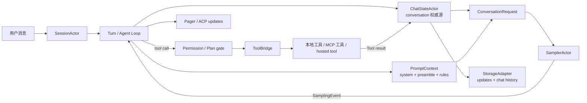

# 12 · Rust × Agent × Grok Build 术语索引

这张索引解决一个常见的阅读障碍：同一个词在 Rust 语言、Agent 设计和本项目源码里往往各有一层含义。例如，`handle` 既可能指 Rust 中的文件句柄，也可能指一个 Actor 的消息入口；`context` 既可能指函数参数，也可能指模型的上下文窗口。

## 怎么使用这张表

每一行都给出三个层次：

1. **通俗解释**：先建立直觉；
2. **本项目语义**：说明它在 Grok Build 中承担什么责任；
3. **源码入口**：从哪里验证，而不是只记术语。

源码链接均相对仓库根目录。文档用于建立地图，实际字段、枚举变体和错误语义以当前源码为准。

## 总体关系图



读代码时先问两个问题：**谁拥有状态**，以及**哪条消息把结果交给下一个 owner**。多数复杂 bug 都是把显示状态、conversation、registry 或持久化日志误当成了同一份数据。

## Rust 基础

| 术语 | 通俗解释 | 本项目中的准确语义 | 源码入口 / 延伸阅读 |
|---|---|---|---|
| package | 一个带 `Cargo.toml` 的可发布单元 | workspace 中的构建包；一个 package 可以包含多个 target | [`Cargo.toml`](../Cargo.toml)、[10-crate-catalog](./10-crate-catalog.md) |
| crate | Rust 编译单元，通常对应一个库或二进制 | `xai-grok-shell`、`xai-grok-agent` 等 crate 通过类型和 trait 组成运行时 | [`xai-grok-shell/src/lib.rs`](../crates/codegen/xai-grok-shell/src/lib.rs) |
| workspace | 一组共享依赖和锁文件的 package | 根 `Cargo.toml` 管理大量 `crates/common` 与 `crates/codegen` 成员 | [`Cargo.toml`](../Cargo.toml)、[02-architecture](./02-architecture.md) |
| module | crate 内的命名空间和文件组织 | `session/acp_session_impl/` 把 SessionActor 的大控制流按职责拆开 | [`xai-grok-shell/src/session/acp_session_impl`](../crates/codegen/xai-grok-shell/src/session/acp_session_impl) |
| trait | 一组行为契约 | `StorageAdapter`、`ChatPersistence`、工具 runtime trait 让实现可替换、可测试 | [`storage/mod.rs`](../crates/codegen/xai-grok-shell/src/session/storage/mod.rs)、[`persistence.rs`](../crates/codegen/xai-chat-state/src/persistence.rs) |
| `dyn Trait` | 运行时通过 vtable 调用未知的具体实现 | `Box<dyn ChatPersistence>` 把 ChatState 与具体 JSONL 存储解耦 | [`persistence.rs`](../crates/codegen/xai-chat-state/src/persistence.rs) |
| generic | 编译期参数化类型/函数 | 工具、序列化和测试 helper 用泛型复用逻辑；与 `dyn Trait` 的运行时多态相对 | [`xai-tool-runtime/src`](../crates/common/xai-tool-runtime/src) |
| ownership / borrow | 谁负责值，以及暂时借用它多久 | actor 把 conversation 所有权留在自己的 task，调用方只借用 `Handle` 发命令 | [Rust 01 ownership](./rust-essentials/01-ownership-and-borrowing.md)、[`xai-chat-state/src/actor/mod.rs`](../crates/codegen/xai-chat-state/src/actor/mod.rs) |
| `Arc` | 可在线程间共享所有权的引用计数指针 | 共享配置、取消令牌和只读上下文；不等于可以无锁修改内部状态 | [Rust 14](./rust-essentials/14-arc-mutex-rwlock.md)、[`acp_session.rs`](../crates/codegen/xai-grok-shell/src/session/acp_session.rs) |
| `Mutex` | 让多个任务排队访问一份可变状态 | 只用于确实需要共享可变数据的边界；conversation 本身优先由 actor 串行化 | [Rust 15](./rust-essentials/15-interior-mutability-and-locks.md)、[`streaming_capture.rs`](../crates/codegen/xai-grok-shell/src/session/streaming_capture.rs) |
| Actor | 独占状态、从邮箱按顺序处理命令的任务 | `SessionActor` 编排 turn，`ChatStateActor` 独占 conversation，`SamplerActor` 管理采样请求 | [`acp_session.rs`](../crates/codegen/xai-grok-shell/src/session/acp_session.rs)、[`actor/mod.rs`](../crates/codegen/xai-chat-state/src/actor/mod.rs)、[`sampler/actor/mod.rs`](../crates/codegen/xai-grok-sampler/src/actor/mod.rs) |
| Handle | 不直接持有状态的轻量消息入口 | `SessionHandle`、`ChatStateHandle`、`SamplingHandle` 通过 channel 发送命令，并可等待 oneshot 回复 | [`session/handle.rs`](../crates/codegen/xai-grok-shell/src/session/handle.rs)、[`sampler/handle.rs`](../crates/codegen/xai-grok-sampler/src/handle.rs) |
| `mpsc` | 多生产者、单消费者消息队列 | 多个 UI/后台任务可以发 `SessionCommand`，由一个 actor 决定处理顺序 | [`session/commands.rs`](../crates/codegen/xai-grok-shell/src/session/commands.rs)、[Rust 09](./rust-essentials/09-channels-cancellation-streams.md) |
| `oneshot` | 一次性的请求-回复通道 | 用于 ack、完成结果、权限回答和 flush barrier；发送端丢失通常表示 owner 已退出 | [`sampler/commands.rs`](../crates/codegen/xai-grok-sampler/src/commands.rs)、[Rust 09](./rust-essentials/09-channels-cancellation-streams.md) |
| `select!` | 同时等待多个 future，先就绪者获胜 | SessionActor 同时处理 prompt、cancel、后台完成、MCP liveness 和 shutdown | [`run_loop.rs`](../crates/codegen/xai-grok-shell/src/session/acp_session_impl/run_loop.rs)、[Rust 10](./rust-essentials/10-tokio-select.md) |
| `spawn_local` | 在当前 LocalSet 中运行可能非 `Send` 的 future | SessionActor 和部分 UI/permission task 借此保留线程亲和的状态；不能随意改成 `spawn` | [`spawn.rs`](../crates/codegen/xai-grok-shell/src/session/acp_session_impl/spawn.rs)、[Rust 12](./rust-essentials/12-spawn-local.md) |
| `Send` / `Sync` | 值能否跨线程发送 / 引用能否并发共享 | channel 边界、trait bound 和 actor 的线程模型会决定是否需要它们 | [Rust 03](./rust-essentials/03-traits-generics-and-dyn.md)、[Rust 19](./rust-essentials/19-platform-unsafe-performance.md) |
| RAII / `Drop` | 生命周期结束时自动执行清理 | guard、临时权限状态、取消和文件锁依靠 `Drop` 保证异常路径也收尾 | [Rust 18](./rust-essentials/18-macros-and-raii.md)、[`permission`](../crates/codegen/xai-grok-workspace/src/permission) |
| Serde | Rust 值与 JSON 等格式之间的序列化框架 | ACP、session JSONL、采样请求和工具 schema 依靠 `Serialize` / `Deserialize` 定义 wire shape | [`xai-grok-sampling-types/src/conversation.rs`](../crates/codegen/xai-grok-sampling-types/src/conversation.rs)、[06-interfaces](./06-interfaces.md) |
| JSONL | 每行一个 JSON 记录的 append-friendly 文件格式 | `updates.jsonl` 保存事件流，`chat_history.jsonl` 保存可重建的 conversation cache | [persistence-and-replay](./deep-dives/persistence-and-replay.md)、[`jsonl`](../crates/codegen/xai-grok-shell/src/session/storage/jsonl) |

## Agent 运行时

| 术语 | 通俗解释 | 本项目中的准确语义 | 源码入口 / 延伸阅读 |
|---|---|---|---|
| Session | 一段可恢复的长期交互 | 包含 `SessionActor`、conversation、工具/权限上下文、session id 和持久化目录 | [`acp_session.rs`](../crates/codegen/xai-grok-shell/src/session/acp_session.rs)、[persistence-and-replay](./deep-dives/persistence-and-replay.md) |
| `WorkspaceSession` | 一个 session 在 workspace 侧的资源容器 | 绑定 cwd、toolset、terminal、MCP、文件/hunk tracker 和 checkpoint；Local/Proxy 两种拓扑都以它为 owner | [`session/mod.rs`](../crates/codegen/xai-grok-workspace/src/session/mod.rs)、[workspace-state-and-worktree-lifecycle](./deep-dives/workspace-state-and-worktree-lifecycle.md) |
| `WorkspaceOps` | local 调用和 workspace RPC 的统一适配器 | Local 直接 `execute`，Proxy 走 `WorkspaceClient`；它不复制 workspace 状态 | [`workspace_ops.rs`](../crates/codegen/xai-grok-workspace/src/workspace_ops.rs)、[workspace-state-and-worktree-lifecycle](./deep-dives/workspace-state-and-worktree-lifecycle.md) |
| `FileStateTracker` | 按 prompt 记录文件 before/after 快照的 tracker | 用于检测外部修改并执行 FS rewind；相对 cwd 存储路径，历史数据兼容绝对路径 | [`file_state.rs`](../crates/codegen/xai-grok-workspace/src/session/file_state.rs)、[workspace-state-and-worktree-lifecycle](./deep-dives/workspace-state-and-worktree-lifecycle.md) |
| `RewindCheckpoint` | 同一 prompt 的多 domain checkpoint | 将 FS `RewindPoint` 与可选 hunk delta 对齐；git state 由旁路 `GitCheckpointStore` 管理 | [`checkpoint.rs`](../crates/codegen/xai-grok-workspace/src/session/checkpoint.rs)、[workspace-state-and-worktree-lifecycle](./deep-dives/workspace-state-and-worktree-lifecycle.md) |
| worktree | 一个隔离的源码工作目录 | workspace 负责 Git/JJ 创建、dirty/clean 复制、apply conflict 和清理；shell 另负责 session/auth 编排 | [`worktree/mod.rs`](../crates/codegen/xai-grok-workspace/src/worktree/mod.rs)、[workspace-state-and-worktree-lifecycle](./deep-dives/workspace-state-and-worktree-lifecycle.md) |
| Turn | 从一条 prompt 开始到本轮完成/取消/失败的边界 | `handle_prompt` 启动一轮；本轮可包含多次采样和多个工具调用 | [`turn.rs`](../crates/codegen/xai-grok-shell/src/session/acp_session_impl/turn.rs)、[03-agent-loop](./03-agent-loop.md) |
| Agent Loop | 模型决定下一步、宿主执行、结果再喂回模型的循环 | `SessionActor` 负责策略和生命周期，`ChatStateActor` 负责历史，直到模型给出终止文本或遇到错误 | [message-flow](./deep-dives/message-flow.md)、[03-agent-loop](./03-agent-loop.md) |
| sampling | 向模型发送上下文并接收增量输出 | `SamplerActor` 管理 HTTP 请求、SSE 解析、重试、取消和完成通知 | [`xai-grok-sampler/src/actor`](../crates/codegen/xai-grok-sampler/src/actor)、[sampling-lifecycle](./deep-dives/sampling-lifecycle.md) |
| `ConversationRequest` | 一次模型请求的完整输入 | 由 conversation、system/preamble、模型参数、tool definitions 和后端格式共同构成 | [`conversation.rs`](../crates/codegen/xai-grok-sampling-types/src/conversation.rs)、[`request_builder.rs`](../crates/codegen/xai-chat-state/src/actor/request_builder.rs) |
| `ConversationItem` | conversation 中的一条消息或事件 | 可表示 user、assistant、tool、system 等角色以及工具调用配对 | [`conversation.rs`](../crates/codegen/xai-grok-sampling-types/src/conversation.rs) |
| delta / stream event | 一段增量，而非完整答案 | `SamplingEvent` 将 completions、responses、messages 后端的流统一为 text/reasoning/tool/usage 等事件 | [`events.rs`](../crates/codegen/xai-grok-sampler/src/events.rs)、[sampling-lifecycle](./deep-dives/sampling-lifecycle.md) |
| tool call | 模型请求宿主执行一个命名工具 | 先由 session 校验参数和权限，再由 `ToolBridge` 找到实现；不是模型直接执行代码 | [`tool_calls.rs`](../crates/codegen/xai-grok-shell/src/session/acp_session_impl/tool_calls.rs)、[tool-call-pipeline](./deep-dives/tool-call-pipeline.md) |
| tool result | 工具执行后的结构化结果和 prompt 文本 | `ToolBridgeResult` 同时服务 UI/ACP 的结构化 output 与下一轮模型的 `prompt_text` | [`bridge.rs`](../crates/codegen/xai-grok-tools/src/bridge.rs) |
| hosted tool | 由模型服务端托管、宿主不执行本地进程的工具 | 仍需进入 request 的 tool 配置和结果协议，不能和本地工具实现混为一谈 | [`tool.rs`](../crates/codegen/xai-grok-tools/src/types/tool.rs)、[06-interfaces](./06-interfaces.md) |
| MCP tool | 通过 MCP server 暴露的外部工具 | 连接、握手和 `tools/list` 后注册到 `ToolBridge`；调用时再经 MCP client 发出 | [`xai-grok-mcp/src`](../crates/codegen/xai-grok-mcp/src)、[mcp-lifecycle](./deep-dives/mcp-lifecycle.md) |
| subagent | 被父 Agent 委托任务的独立 Agent | 通常拥有子 `SessionActor`、自己的 prompt audience 和工作上下文，结果回传父 session | [`spawn.rs`](../crates/codegen/xai-grok-shell/src/session/acp_session_impl/spawn.rs)、[`subagent_coordinator.rs`](../crates/codegen/xai-grok-shell/src/agent/mvp_agent/subagent_coordinator.rs) |
| goal | 对一组 turn 的目标、状态和评估约束 | goal harness 可启动 strategist/evaluator，并把进展写回 session 事件 | [`goal_orchestrator.rs`](../crates/codegen/xai-grok-shell/src/session/goal_orchestrator.rs)、[03-agent-loop](./03-agent-loop.md) |
| interjection | 在当前生成途中插入的用户/系统新信息 | 通过 interjection core / prompt queue 进入当前或下一次采样，不能简单当作普通历史尾部追加 | [`xai-interjection-core`](../crates/common/xai-interjection-core)、[`xai-prompt-queue`](../crates/codegen/xai-prompt-queue) |
| compaction | 用摘要替换较旧上下文以腾出预算 | Grok Build 的 code compaction 通常生成新摘要并替换模型可见历史，同时保留 durable update 证据 | [`xai-grok-compaction/src/code_compaction`](../crates/common/xai-grok-compaction/src/code_compaction)、[04-context-management](./04-context-management.md) |
| pruning | 从请求或内存中裁剪不再需要的内容 | request-level pruning 只影响本次采样；retained-conversation pruning 才会更新可替换的 chat cache | [`request_builder.rs`](../crates/codegen/xai-chat-state/src/actor/request_builder.rs)、[persistence-and-replay](./deep-dives/persistence-and-replay.md) |
| memory | 跨 session 保存并在后续 prompt 注入的知识 | memory extension 不是当前 conversation；它通过 prompt/context 边界进入请求，并有自己的存储与权限 | [`xai-grok-memory`](../crates/codegen/xai-grok-memory)、[04-context-management](./04-context-management.md) |
| reminder | 宿主在特定状态下追加的运行时提示 | 工具结果、MCP 变化、compaction、权限或系统状态可标记 reminder dirty，下一次 prompt 再消费 | [`reminders.rs`](../crates/codegen/xai-grok-shell/src/session/acp_session_impl/reminders.rs)、[`system_reminder.rs`](../crates/codegen/xai-grok-agent/src/system_reminder.rs) |
| replay | 根据事件流重新发送客户端可见更新 | replay 读取 `updates.jsonl` 并应用 rewind filter；它不是重新调用模型 | [`replay_events.rs`](../crates/codegen/xai-grok-shell/src/session/replay_events.rs)、[persistence-and-replay](./deep-dives/persistence-and-replay.md) |
| rewind | 把会话视图退回某个 prompt/事件边界 | 通过 marker 和 filter 隐藏旧分支；通常不删除 append-only update 审计记录 | [`storage/mod.rs`](../crates/codegen/xai-grok-shell/src/session/storage/mod.rs) |
| fork | 从现有 session 复制出可独立继续的分支 | 复制 session 数据到新 id/cwd，记录 parent；之后两个 session 的新事件互不共享 | [`fork.rs`](../crates/codegen/xai-grok-shell/src/session/fork.rs)、[persistence-and-replay](./deep-dives/persistence-and-replay.md) |
| durable | 已跨越明确持久化边界，崩溃后可恢复 | `FlushAndAck` 返回后才可把对应 update 当作 durable；UI 已显示不代表 durable | [`storage/mod.rs`](../crates/codegen/xai-grok-shell/src/session/storage/mod.rs) |
| derived cache | 可由更权威数据重新生成的加速文件 | `chat_history.jsonl` 是从 updates/消息重建的 cache；损坏时可 rebuild，不等同于审计日志 | [`chat_rebuild`](../crates/codegen/xai-grok-shell/src/session/storage/mod.rs)、[persistence-and-replay](./deep-dives/persistence-and-replay.md) |
| `ConfigLayers` | 把多个配置来源按信任顺序组织起来的加载结果 | 持有 system/user managed、user config、requirements 和 MDM；负责基础 TOML 合并，不负责 Agent turn | [`loader.rs`](../crates/codegen/xai-grok-config/src/loader.rs)、[configuration-and-runtime-resolution](./deep-dives/configuration-and-runtime-resolution.md) |
| effective config | 当前来源和 overlay 叠加后的配置文档 | `effective_config_base` 加上可选 campaign；它仍是 `toml::Value`，必须再经过 typed/runtime 解析 | [`util/config/campaigns.rs`](../crates/codegen/xai-grok-shell/src/util/config/campaigns.rs)、[configuration-and-runtime-resolution](./deep-dives/configuration-and-runtime-resolution.md) |
| requirements | 管理员/部署强制层 | 优先级高于普通配置；可 pin feature，不能被低信任 campaign 或 remote 默认重新打开 | [`validation.rs`](../crates/codegen/xai-grok-config/src/validation.rs)、[permissions-and-sandbox](./deep-dives/permissions-and-sandbox.md) |
| `version_overrides` | 按 CLI semver 条件选择的 TOML patch | 每层独立应用、按最低版本升序深度合并，完成后 section 被剥离 | [`version_overrides.rs`](../crates/codegen/xai-grok-config/src/version_overrides.rs)、[configuration-and-runtime-resolution](./deep-dives/configuration-and-runtime-resolution.md) |
| campaign | 可 dismiss 的实验/配置 overlay | 依照 requirements > remote > user > managed > system managed 合并；应用后再次恢复 requirements | [`campaigns.rs`](../crates/codegen/xai-grok-config/src/campaigns.rs)、[configuration-and-runtime-resolution](./deep-dives/configuration-and-runtime-resolution.md) |
| runtime resolution | 把 raw config、CLI、env、headless 和 remote 转成派生字段的阶段 | `Config::resolve_runtime_fields` 只重算明确列出的 runtime-only 字段，不是全量 serde reload | [`agent/config.rs`](../crates/codegen/xai-grok-shell/src/agent/config.rs)、[configuration-and-runtime-resolution](./deep-dives/configuration-and-runtime-resolution.md) |
| `Resolved<T>` / `ConfigSource` | 带来源的解析结果 | 除最终 value 外记录 env/config/managed/requirements/remote/default 等 source，供诊断和 UI 解释 | [`xai-grok-config-types/src/flags.rs`](../crates/codegen/xai-grok-config-types/src/flags.rs)、[`config.rs`](../crates/codegen/xai-grok-shell/src/agent/config.rs) |
| `RemoteSettings` | 认证后从 `/v1/settings` 获得的服务端设置快照 | 只能进入明确接入它的 resolver；刷新后新 session 可获得新派生值，已有 session 通常保留 snapshot | [`agent_ops.rs`](../crates/codegen/xai-grok-shell/src/agent/mvp_agent/agent_ops.rs)、[configuration-and-runtime-resolution](./deep-dives/configuration-and-runtime-resolution.md) |

## Prompt 与上下文

| 术语 | 通俗解释 | 本项目中的准确语义 | 源码入口 / 延伸阅读 |
|---|---|---|---|
| system prompt | 规定 Agent 身份、工具规则和行为边界的高优先级文本 | 由模板、Agent 定义、工具 renderer、规则和 audience 共同渲染；不等于用户输入 | [`templates/prompt.md`](../crates/codegen/xai-grok-agent/templates/prompt.md)、[prompt-assembly](./deep-dives/prompt-assembly.md) |
| user preamble | 首轮 user message 前由宿主插入的环境说明 | 可包含 workspace、rules、skills、MCP descriptor 等；它通常只在首轮或变更时出现 | [`user_message.rs`](../crates/codegen/xai-grok-agent/src/prompt/user_message.rs)、[05-prompt-engineering](./05-prompt-engineering.md) |
| `AGENTS.md` | 放在项目目录树里的局部协作规则 | 按 cwd/scope 发现、排序、去重后注入 prompt；子 agent 的 audience 会改变可见范围 | [`agents_md.rs`](../crates/codegen/xai-grok-agent/src/prompt/agents_md.rs) |
| rule | 比 AGENTS.md 更窄或由配置提供的约束 | 进入 `PromptContext` 的 rules 集合，可能来自项目、用户或运行时配置 | [`prompt/context.rs`](../crates/codegen/xai-grok-agent/src/prompt/context.rs)、[prompt-assembly](./deep-dives/prompt-assembly.md) |
| skill | 一组可发现的专门工作流/说明 | Agent 发现 skill 后可将其描述或工具入口放入 prompt；安装/信任与实际调用是不同阶段 | [`prompt/skills.rs`](../crates/codegen/xai-grok-agent/src/prompt/skills.rs)、[`implementations/skills`](../crates/codegen/xai-grok-tools/src/implementations/skills) |
| `AgentDefinition` | Agent 的配置和模板选择 | frontmatter 解析出的名字、模型、工具、`PromptMode` 等，交给 `AgentBuilder` 实例化 | [`config.rs`](../crates/codegen/xai-grok-agent/src/config.rs) |
| `AgentBuilder` | 把定义和运行时依赖组装成 Agent 的 builder | 连接 prompt context、ToolBridge、采样配置和插件发现；是分析“能力从哪里来”的入口 | [`builder.rs`](../crates/codegen/xai-grok-agent/src/builder.rs) |
| `PromptContext` | 模板渲染需要的结构化输入 | 携带 audience、mode、rules、tools、skills、MCP 和 override；不是模型最终收到的字符串 | [`context.rs`](../crates/codegen/xai-grok-agent/src/prompt/context.rs) |
| `PromptAudience` | 当前 prompt 是给谁看的标签 | `Primary` 与 `Subagent` 决定 persona、AGENTS/rules 和可见说明的范围 | [`context.rs`](../crates/codegen/xai-grok-agent/src/prompt/context.rs) |
| `PromptMode` | system prompt 的替换策略 | `Extend` 在基础模板上追加，`Full` 使用完整 override；两者影响调试和兼容性 | [`config.rs`](../crates/codegen/xai-grok-agent/src/config.rs)、[`plan_mode.rs`](../crates/codegen/xai-grok-shell/src/session/plan_mode.rs) |
| template override | 对默认 prompt 模板的显式替换/扩展 | 通过 Agent 定义选择；只改文本不代表工具 registry 或协议 schema 也改变 | [`prompt/context.rs`](../crates/codegen/xai-grok-agent/src/prompt/context.rs)、[prompt-assembly](./deep-dives/prompt-assembly.md) |
| tool definition | 给模型看的工具名、描述和 JSON schema | 最终来自注册完成的 `ToolBridge`/toolset；prompt 中手写一个名字不能制造可调用工具 | [`types/tool.rs`](../crates/codegen/xai-grok-tools/src/types/tool.rs)、[`bridge.rs`](../crates/codegen/xai-grok-tools/src/bridge.rs) |
| context window | 一次请求允许的 token/输入预算 | `ChatStateActor::build_request` 会在模型看到的 clone 上做预算、图片和历史裁剪 | [`request_builder.rs`](../crates/codegen/xai-chat-state/src/actor/request_builder.rs)、[04-context-management](./04-context-management.md) |
| context overflow | 请求超过后端可接受的上下文预算 | sampler 报错后 session 可能触发 compact、prune 或向用户报告；不是普通 HTTP retry | [`sampling-lifecycle.md`](./deep-dives/sampling-lifecycle.md)、[`compaction.rs`](../crates/codegen/xai-grok-shell/src/session/compaction.rs) |

## 协议与传输

| 术语 | 通俗解释 | 本项目中的准确语义 | 源码入口 / 延伸阅读 |
|---|---|---|---|
| ACP | Agent Client Protocol，客户端与 Agent 运行时之间的协议 | Pager、headless CLI、IDE client 都可通过 ACP 创建 session、发送 prompt、接收 `SessionUpdate` | [`xai-grok-shell/src/session/acp_types.rs`](../crates/codegen/xai-grok-shell/src/session/acp_types.rs)、[06-interfaces](./06-interfaces.md) |
| MCP | Model Context Protocol，宿主与外部工具/资源 server 的协议 | shell 管理 server 生命周期、OAuth、`tools/list` 和 `call_tool`；模型只看注册后的工具 | [`xai-grok-mcp/src`](../crates/codegen/xai-grok-mcp/src)、[mcp-lifecycle](./deep-dives/mcp-lifecycle.md) |
| JSON-RPC | 带 `id`、`method`、`params`、`result/error` 的请求回复约定 | MCP 和 tool protocol 的控制面使用 JSON-RPC；不要把它和模型消息格式混为一谈 | [`xai-tool-protocol/src`](../crates/common/xai-tool-protocol/src) |
| SSE | HTTP response body 中按事件分隔的单向流 | sampler 将不同后端的 SSE 行解析为统一 `SamplingEvent`；断线/半事件是状态机问题 | [`xai-grok-sampler/src/stream`](../crates/codegen/xai-grok-sampler/src/stream)、[sampling-lifecycle](./deep-dives/sampling-lifecycle.md) |
| Responses API | 支持 response item、工具和增量事件的模型接口 | `xai-grok-sampler/src/stream/responses.rs` 将其 wire event 转成内部事件 | [`stream/responses.rs`](../crates/codegen/xai-grok-sampler/src/stream/responses.rs) |
| Chat Completions | 以 messages/choices/delta 为中心的模型接口 | 与 Responses 共用内部 conversation，但流解析和终止语义不同 | [`stream/chat_completions.rs`](../crates/codegen/xai-grok-sampler/src/stream/chat_completions.rs) |
| Messages API | 以 content block、thinking/tool block 为中心的模型接口 | 解析器把 block 生命周期映射到统一文本、reasoning、tool event | [`stream/messages.rs`](../crates/codegen/xai-grok-sampler/src/stream/messages.rs) |
| wire compatibility | 外部可观察的字段、标签、顺序和错误契约兼容 | 修改 enum tag、JSON 字段或 ACP update 时必须检查 serializer、client 和 fixture | [`wire_tags.rs`](../crates/codegen/xai-grok-shell/src/session/wire_tags.rs)、[contributor-workflow](./deep-dives/contributor-workflow.md) |
| `SessionUpdate` | ACP 中代表进度/消息/工具状态的客户端事件 | Pager 将其归一为 render block，headless/IDE 则消费原始协议事件 | [`acp_types.rs`](../crates/codegen/xai-grok-shell/src/session/acp_types.rs)、[pager-rendering](./deep-dives/pager-rendering.md) |
| headless | 没有 TUI 的运行模式 | 复用 shell/session/turn，只把结果输出给 CLI 或 ACP client；适合 CI 和协议测试 | [`agent/app.rs`](../crates/codegen/xai-grok-shell/src/agent/app.rs)、[message-flow](./deep-dives/message-flow.md) |

## 安全、状态与可见性

| 术语 | 通俗解释 | 本项目中的准确语义 | 源码入口 / 延伸阅读 |
|---|---|---|---|
| `AccessKind` | “这个动作属于哪类风险”的分类 | `Read`、`Write`、`Shell`、`MCPTool` 等类型进入 permission resolver；它不是最终批准结果 | [`permission/types.rs`](../crates/codegen/xai-grok-workspace/src/permission/types.rs)、[permissions-and-sandbox](./deep-dives/permissions-and-sandbox.md) |
| permission | 是否允许一次具体操作 | resolver 结合 access kind、路径、命令、模式和用户选择得出 allow/deny/ask | [`permission/manager`](../crates/codegen/xai-grok-workspace/src/permission/manager)、[09-contributor-playbook](./09-contributor-playbook.md) |
| plan gate | 计划模式下对“先规划还是直接执行”的闸门 | session 在 tool call 前检查当前 plan 状态；它和普通文件/命令权限是两层策略 | [`tool_calls.rs`](../crates/codegen/xai-grok-shell/src/session/acp_session_impl/tool_calls.rs)、[`plan_mode.rs`](../crates/codegen/xai-grok-shell/src/session/plan_mode.rs) |
| sandbox | 操作系统或运行时施加的能力边界 | 约束终端、文件和网络访问；通过 permission 不代表能绕过 OS sandbox | [`xai-grok-sandbox/src`](../crates/codegen/xai-grok-sandbox/src)、[permissions-and-sandbox](./deep-dives/permissions-and-sandbox.md) |
| worktree | 一个隔离的源码工作目录 | workspace/session 管理 git/jj 状态、临时修改和子 agent 隔离；不是单纯的 cwd 字符串 | [`xai-grok-workspace/src/worktree`](../crates/codegen/xai-grok-workspace/src/worktree)、[09-contributor-playbook](./09-contributor-playbook.md) |
| checkpoint | 可用于回退或比较的工作区状态 | 文件状态/hunk tracker 和 session rewind 可记录边界；它不自动等于 git commit | [`xai-hunk-tracker/src`](../crates/codegen/xai-hunk-tracker/src)、[`workspace/session`](../crates/codegen/xai-grok-workspace/src/session) |
| `StorageAdapter` | session 持久化的抽象接口 | 负责加载、追加 update、重建 chat、replay、rewind 和 fork 的文件语义 | [`storage/mod.rs`](../crates/codegen/xai-grok-shell/src/session/storage/mod.rs) |
| `ChatPersistence` | ChatState 写入持久化层的窄接口 | `ChatStateActor` 通过它发 `PersistenceMsg`，避免直接依赖 JSONL 文件 | [`persistence.rs`](../crates/codegen/xai-chat-state/src/persistence.rs) |
| `ReplayBuffer` | 暂存尚未发送给客户端的增量更新 | turn end、cancel、shutdown 和 flush barrier 前必须排空，否则客户端可能缺最后一段文本 | [`update_chunk_merge.rs`](../crates/codegen/xai-grok-shell/src/agent/update_chunk_merge.rs)、[persistence-and-replay](./deep-dives/persistence-and-replay.md) |
| Pager | 终端 UI / 滚动显示层 | 把 ACP updates 转成 `RenderBlock` 和 scrollback；不是 conversation 的权威源 | [`xai-grok-pager/src`](../crates/codegen/xai-grok-pager/src)、[pager-rendering](./deep-dives/pager-rendering.md) |
| derived vs authoritative | 可重建副本 vs 唯一事实来源 | Pager scrollback、chat cache、snapshot 都可能 derived；actor state 或 durable update 才能回答“发生了什么” | [02-architecture](./02-architecture.md)、[persistence-and-replay](./deep-dives/persistence-and-replay.md) |

## 测试与调试

| 术语 | 通俗解释 | 本项目中的准确语义 | 源码入口 / 延伸阅读 |
|---|---|---|---|
| fixture | 为测试准备的固定输入、环境和预期输出 | 可以是 SSE 事件、旧 JSONL、临时工作区或协议帧；应只控制测试所需变量 | [`xai-grok-test-support`](../crates/codegen/xai-grok-test-support)、[contributor-workflow](./deep-dives/contributor-workflow.md) |
| `MockInferenceServer` | 不访问真实模型服务的本地 HTTP server | 模拟 Chat Completions、Responses、Messages、models/settings，记录请求并提供可控的响应 barrier | [`mock_server.rs`](../crates/codegen/xai-grok-test-support/src/mock_server.rs)、[`README.md`](../crates/codegen/xai-grok-test-support/README.md) |
| scripted SSE | 由测试指定顺序和字节的流式响应 | `ScriptedResponse::sse` 和 `sse` builders 复现 text、reasoning、tool delta、malformed stream 和终态 | [`sse.rs`](../crates/codegen/xai-grok-test-support/src/sse.rs)、[`scripted.rs`](../crates/codegen/xai-grok-test-support/src/scripted.rs) |
| `TestSandbox` | 每个测试独有的临时文件系统和环境边界 | 隔离 HOME、GROK_HOME、workspace、TMPDIR、Git 和 mock URL，避免环境泄漏和误用真实凭据 | [`sandbox.rs`](../crates/codegen/xai-grok-test-support/src/sandbox.rs)、[`README.md`](../crates/codegen/xai-grok-test-support/README.md) |
| `TestProcess` | 测试中对子进程的生命周期 owner | 统一处理环境、stdout/stderr tail、deadline、终止和 reap；不要在同一测试中另起无 owner 的子进程 | [`process.rs`](../crates/codegen/xai-grok-test-support/src/process.rs) |
| `LocalSet` | 为 `!Send` future 提供单线程执行域 | session 的 `spawn_local` 测试必须在 `current_thread` runtime + `LocalSet` 中运行，才能复现生产 ownership 模型 | [`acp_session.rs`](../crates/codegen/xai-grok-shell/src/session/acp_session.rs)、[Rust 12](./rust-essentials/12-spawn-local.md) |
| deterministic synchronization | 用可观察信号而不是猜时间完成了 | 测试优先等待 `oneshot` ack、channel event、request count 或 mock barrier；`timeout` 只是失败上限，不是同步机制 | [`test_actor.rs`](../crates/codegen/xai-grok-sampler/tests/test_actor.rs)、[contributor-workflow](./deep-dives/contributor-workflow.md) |
| paused time | 由 Tokio 虚拟推进时间来测 timer/backoff | 适合 retry/backoff 的精确边界；不能拿 wall-clock `sleep` 掩盖 actor 竞态 | [`request_task.rs`](../crates/codegen/xai-grok-sampler/src/actor/request_task.rs)、[Rust 10](./rust-essentials/10-tokio-select.md) |
| test pyramid | 从廉价确定的底层断言到昂贵端到端验证的分层 | 纯函数/serde → actor/stream → mock integration → ACP/headless → 人工 TUI；改动风险决定最小覆盖面 | [contributor-workflow](./deep-dives/contributor-workflow.md)、[09-contributor-playbook](./09-contributor-playbook.md) |
| trace timeline | 按关联 ID 排列的可重放事件证据 | 用 session/turn/request/tool ID、event type、attempt 和脱敏配置定位异步问题，而不是只截最终 UI 文本 | [`xai-grok-telemetry`](../crates/codegen/xai-grok-telemetry)、[contributor-workflow](./deep-dives/contributor-workflow.md) |

## 项目 owner 速查

遇到问题先按“谁拥有这份状态”找 owner。不要从 UI 文本或最后一个报错文件反推责任。

| Owner | 它拥有的状态/策略 | 常见改动 | 先读 |
|---|---|---|---|
| `SessionActor` | session 命令、turn 生命周期、取消、权限与工具循环 | 新增命令、改变 turn 完成/取消、接入扩展 | [`session/acp_session.rs`](../crates/codegen/xai-grok-shell/src/session/acp_session.rs)、[`run_loop.rs`](../crates/codegen/xai-grok-shell/src/session/acp_session_impl/run_loop.rs) |
| `ChatStateActor` | conversation、usage、图片/预算和状态 mutation | 消息顺序、request 构建、compact 前后历史 | [`actor/mod.rs`](../crates/codegen/xai-chat-state/src/actor/mod.rs)、[`request_builder.rs`](../crates/codegen/xai-chat-state/src/actor/request_builder.rs) |
| `SamplerActor` | 并发请求、attempt、重试、取消和流事件 | 新后端解析、HTTP 错误策略、流 drain | [`actor/mod.rs`](../crates/codegen/xai-grok-sampler/src/actor/mod.rs)、[`request_task.rs`](../crates/codegen/xai-grok-sampler/src/actor/request_task.rs) |
| `AgentBuilder` / `PromptContext` | Agent 定义、模板、audience、rules、skills | 新人格、新 prompt mode、工具说明注入 | [`builder.rs`](../crates/codegen/xai-grok-agent/src/builder.rs)、[`prompt/context.rs`](../crates/codegen/xai-grok-agent/src/prompt/context.rs) |
| `ToolBridge` | finalized tool registry、schema、dispatch 入口 | 新工具、MCP registration、tool result 映射 | [`bridge.rs`](../crates/codegen/xai-grok-tools/src/bridge.rs)、[`registry`](../crates/codegen/xai-grok-tools/src/registry) |
| permission / workspace | access 分类、路径/命令决策、sandbox/worktree | 新风险类型、权限提示、隔离行为 | [`permission`](../crates/codegen/xai-grok-workspace/src/permission)、[`workspace/lib.rs`](../crates/codegen/xai-grok-workspace/src/lib.rs) |
| `StorageAdapter` / JSONL | durable update、chat cache、replay/fork 文件语义 | 新事件、恢复、重放、磁盘错误处理 | [`storage`](../crates/codegen/xai-grok-shell/src/session/storage) |
| `xai-grok-config` / `AgentConfig` | 配置来源、类型和运行时 gate | `xai-grok-config` 决定哪些 TOML 进入有效配置；shell `AgentConfig` 决定字段何时解析并应用到 Agent/session | [`loader.rs`](../crates/codegen/xai-grok-config/src/loader.rs)、[`agent/config.rs`](../crates/codegen/xai-grok-shell/src/agent/config.rs)、[configuration-and-runtime-resolution](./deep-dives/configuration-and-runtime-resolution.md) |
| Pager render | 可见的 UI block、布局、scrollback | 终端显示、折叠、流式合并和 selection | [`xai-grok-pager-render/src`](../crates/codegen/xai-grok-pager-render/src)、[pager-rendering](./deep-dives/pager-rendering.md) |

## 典型症状到术语

| 现象 | 先区分的术语 | 推荐阅读 |
|---|---|---|
| UI 已显示答案，但恢复后不见 | display update vs durable update vs `ReplayBuffer` | [persistence-and-replay](./deep-dives/persistence-and-replay.md) |
| Agent 改动无法安全 rewind | before/after snapshot、checkpoint domain、外部冲突、hunk delta | [workspace-state-and-worktree-lifecycle](./deep-dives/workspace-state-and-worktree-lifecycle.md) |
| 模型说有工具，但调用失败 | tool definition vs registry vs permission vs dispatch | [tool-call-pipeline](./deep-dives/tool-call-pipeline.md) |
| MCP 已连接但模型看不到工具 | transport connection vs `ToolBridge` registration vs reminder/snapshot | [mcp-lifecycle](./deep-dives/mcp-lifecycle.md) |
| 改了 prompt 却行为没变 | `AgentDefinition`、`PromptMode`、audience、最终 request | [prompt-assembly](./deep-dives/prompt-assembly.md) |
| 一次请求偶尔重复/超时 | `SamplingEvent`、attempt、retry、cancel、stream-drain | [sampling-lifecycle](./deep-dives/sampling-lifecycle.md) |
| 子代理读到不该看的规则 | `PromptAudience`、scope、worktree、权限 | [prompt-assembly](./deep-dives/prompt-assembly.md)、[permissions-and-sandbox](./deep-dives/permissions-and-sandbox.md) |
| 配置明明写了却不生效 | effective TOML、unknown warning、resolver precedence、requirements pin、session snapshot | [configuration-and-runtime-resolution](./deep-dives/configuration-and-runtime-resolution.md) |
| rewind 后旧消息仍出现在客户端 | raw updates vs rewind marker vs replay filter | [persistence-and-replay](./deep-dives/persistence-and-replay.md) |
| 文档改动是否需要构建 | source code change vs Markdown-only static checks | [contributor-workflow](./deep-dives/contributor-workflow.md) |

## 一条可执行的阅读路线

当你第一次接触一个新功能，可以按下面的顺序建立证据链：

```text
产品症状
  -> 入口（Pager / ACP / headless）
  -> SessionActor 命令与 turn
  -> 状态 owner（ChatState / ToolBridge / Storage / Permission）
  -> wire type（ConversationItem / SessionUpdate / SamplingEvent）
  -> 测试 fixture 与错误路径
  -> 最小改动和对应验证
```

对应的命令通常是：

```sh
rg -n "症状关键词|类型名|命令名" crates docs
git log --all --oneline -- path/to/owner.rs
git diff --check
```

只改 Markdown 时，最后两项静态检查足够；只有 Rust、配置或协议代码改变，才根据 [contributor-workflow](./deep-dives/contributor-workflow.md) 选择最小的 Cargo 检查或测试。
