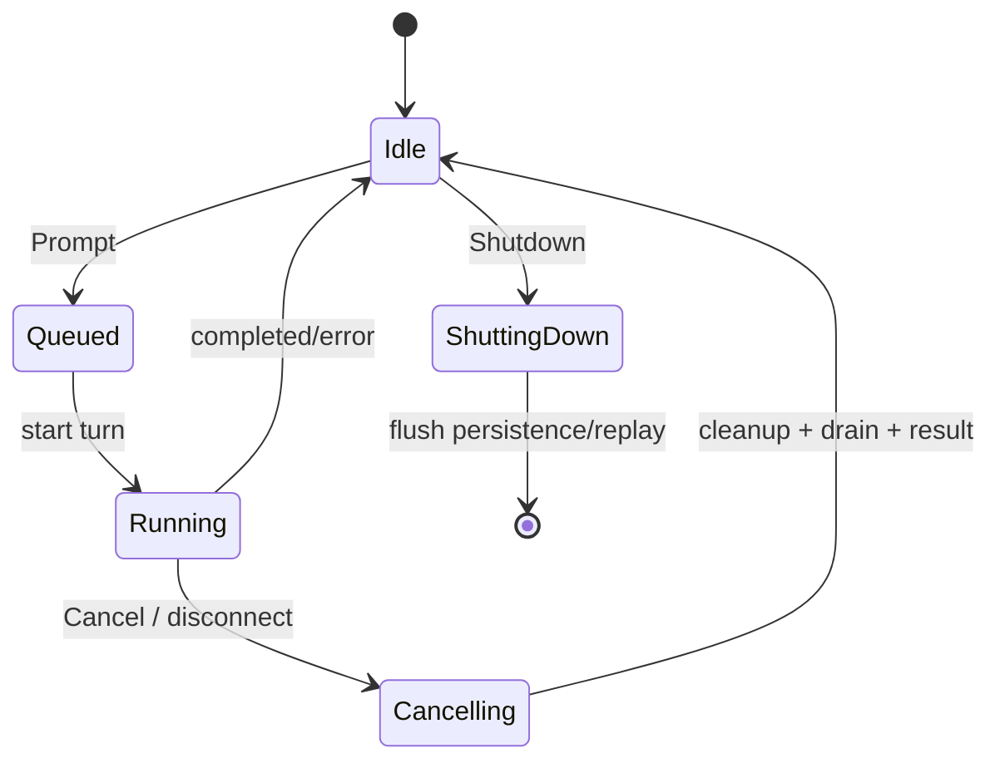

# 13 · 分阶段贡献项目：从读懂代码到提交可审查改动

这不是“再列一遍 Rust 练习”，而是一条把 Rust、Agent 语义、项目 owner、协议和测试证据串起来的实战路线。每个项目都故意有清晰边界：完成一个小项目后，你应该能解释输入、权威状态、外部契约、失败路径和验证范围。

前置阅读：

- [01-learning-guide.md](./01-learning-guide.md)：第一次建立 workspace/Agent 心智模型；
- [12-glossary.md](./12-glossary.md)：遇到术语时确认 Rust、Agent、本项目三层含义；
- [09-contributor-playbook.md](./09-contributor-playbook.md)：改动前的 owner 和测试原则；
- [deep-dives/contributor-workflow.md](./deep-dives/contributor-workflow.md)：fixture、异步取消和协议证据。
- [deep-dives/subagents-and-workflows.md](./deep-dives/subagents-and-workflows.md)：definition、fork/resume、隔离 worktree、Rhai journal 和 Workflow 状态机。
- [deep-dives/resources-and-capability-injection.md](./deep-dives/resources-and-capability-injection.md)：工具依赖、取消、session 能力和 rebuild 注入边界。
- [deep-dives/cancellation-and-shutdown.md](./deep-dives/cancellation-and-shutdown.md)：取消、超时、replay flush、工具进程和子代理关闭的跨层证据。
- [deep-dives/configuration-and-runtime-resolution.md](./deep-dives/configuration-and-runtime-resolution.md)：配置层级、requirements/MDM、campaign、来源优先级和 settings refresh。
- [deep-dives/workspace-state-and-worktree-lifecycle.md](./deep-dives/workspace-state-and-worktree-lifecycle.md)：WorkspaceSession、rewind checkpoint、hunk/git 恢复和 worktree 隔离。

## 1. 统一交付标准

每个项目都产出一份短记录，而不是只留下一个绿色测试：

```text
目标：用户/模型/协议看到的行为是什么？
入口：从哪个 CLI、ACP、tool、model event 或后台事件进入？
owner：谁拥有会被修改的状态？
契约：Rust type、Serde JSON、prompt、session 文件或 UI event 是什么？
失败：取消、权限拒绝、超时、旧数据/旧 client 怎么办？
改动：哪些文件必须改，哪些看起来相关但不应改？
验证：每条命令证明哪一层？还有什么未覆盖？
```

### 1.1 证据等级

| 等级 | 能证明什么 | 典型工具 |
|---|---|---|
| L0 静态 | 链接、路径、格式和文档一致 | `rg`、`git diff --check`、Markdown link check |
| L1 纯逻辑 | 解析、转换、边界和错误分类 | 单元测试、Serde fixture、纯函数测试 |
| L2 组件 | actor、stream、registry 的接线和顺序 | channel/mock backend/临时目录 |
| L3 进程/协议 | composition root、ACP/Leader/headless 实际接线 | mock server、stdio、process harness |
| L4 产品体验 | TUI、真实权限、真实网络和平台行为 | PTY/人工 smoke/受控环境 |

改动的风险决定最低等级。一个只改 Markdown 的项目停在 L0；一个新增工具 schema 的项目通常至少需要 L1/L2；一个修改 Leader protocol 的项目应补到 L3。不要把 L0 的“路径存在”写成 L3 的“功能已验证”。

## 2. 项目 0：文档和源码导航修复

### 目标

修正一个真实的文档错误：失效源码链接、错误 crate 名称、过期函数名或与当前代码矛盾的描述。

### 源码/文档入口

- [07-module-map.md](./07-module-map.md)
- [12-glossary.md](./12-glossary.md)
- 与问题对应的 `crates/**` 路径

### 操作

```sh
rg -n "旧术语|旧路径" docs crates
git diff --check
```

检查链接是否指向当前文件/目录；如果描述涉及一个类型，至少打开它的定义和一个调用点，不要只根据文件名猜测。

### 完成证据

- 记录旧链接/描述为何错误；
- 新链接和源码路径存在；
- 文档中的语义与当前定义/调用一致；
- 没有运行无关的 Cargo 构建。

### 不要做什么

不要为了顺手“统一格式”修改整个目录，也不要把未验证的推测写成源码事实。这个项目本身体现了用户明确的规则：**代码没改时，文档修改不需要构建。**

## 3. 项目 1：给纯函数补一个边界测试

### 目标

选择一个没有 I/O 的转换/分类函数，例如 retry 分类、prompt collector、Serde 默认值、工具名归一化或 rewind filter，补一个能描述边界的测试。

### 推荐入口

| 主题 | 入口 |
|---|---|
| retry 分类 | `crates/codegen/xai-grok-sampler/src/retry.rs` |
| prompt 规则去重 | `crates/codegen/xai-grok-agent/src/prompt/agents_md.rs` |
| memory marker | `crates/codegen/xai-grok-shell/src/session/helpers/memory_context.rs` |
| rewind filter | `crates/codegen/xai-grok-shell/src/session/storage/mod.rs` |
| 工具名/schema | `crates/codegen/xai-grok-tools/src/types/` |

### 方法

1. 先读相邻已有测试，确认作者已经选择的边界术语；
2. 写一个当前实现容易回归的输入/输出断言；
3. 只改 owner 模块，不在调用方复制判断；
4. 用测试名过滤，再跑目标 crate 的测试；
5. 解释测试没有覆盖的异步/协议层。

### 完成证据

```text
输入 -> 纯函数 -> 输出/错误
```

并说明为什么该断言不是“只验证 Ok”，而是锁定了产品语义（例如 401 不重试、unknown event 被拒绝、重复 memory marker 不再查询）。

## 4. 项目 2：新增一个 Agent/prompt 边界，而不是改默认人格

### 目标

为已有 Agent definition 增加一个局部、可选的描述/规则/工具说明，或为 `PromptContext` 增加“工具不存在/子 agent audience”测试。

### 推荐入口

- `crates/codegen/xai-grok-agent/src/config.rs`
- `crates/codegen/xai-grok-agent/src/builder.rs`
- `crates/codegen/xai-grok-agent/src/prompt/context.rs`
- `crates/codegen/xai-grok-agent/src/prompt/agents_md.rs`
- [prompt-assembly.md](./deep-dives/prompt-assembly.md)
- [subagents-and-workflows.md](./deep-dives/subagents-and-workflows.md)：definition、role/persona、fork/resume 和 child session 的完整边界

### 先回答

| 问题 | 证据 |
|---|---|
| 内容进入 system prompt 还是首轮 user preamble？ | `PromptContext`/`user_message` 的调用链 |
| primary 和 subagent 都应看见吗？ | `PromptAudience` 分支和 fixture |
| 工具名是文字说明还是 registry definition？ | `ToolBridge` 最终 definitions |
| 规则是否会重复、越 scope 或泄漏敏感路径？ | `AGENTS` discovery/scope/dedup |

如果改动针对子代理，不要只改 prompt 文案：先确认 definition discovery、runtime override precedence、capability intersection 和 child audience 是否仍一致。

### 验证

至少断言渲染后的结构或字段，而不是只断言模板文件包含某一行。若改动只涉及 Markdown definition，可做静态验证；若改动 Rust renderer、配置 schema 或模板 placeholder，运行 `xai-grok-agent` 的 focused tests。

### 风险边界

不要把临时运行时 reminder 写进稳定 system prompt；不要为了让模型“知道工具”而只改文案；不要让主 Agent 的 persona/catalog 无条件泄漏到 subagent。

## 5. 项目 3：给一个现有工具增加安全、可发现的字段

### 目标

为一个已有只读工具增加参数校验、schema 描述、结构化错误或有限输出，而不是从零创建一套平行 dispatch。

### 推荐入口

- `crates/codegen/xai-grok-tools/src/bridge.rs`
- `crates/codegen/xai-grok-tools/src/registry/`
- `crates/common/xai-tool-runtime/src/`
- 具体实现的 `implementations/grok_build/`
- [tool-call-pipeline.md](./deep-dives/tool-call-pipeline.md)
- [resources-and-capability-injection.md](./deep-dives/resources-and-capability-injection.md)
- [permissions-and-sandbox.md](./deep-dives/permissions-and-sandbox.md)

### 实施顺序

```text
Args/Serde/schema
  -> registry/finalize/allowlist
  -> SessionActor permission + plan gate
  -> ToolBridge dispatch
  -> Progress* + exactly one Terminal
  -> structured output + prompt_text
  -> ChatState tool result
```

### 最小验证

- 参数合法、缺失和 malformed JSON；
- 工具不应出现时的 allowlist/disallowed/feature 行为；
- permission deny、cancel、runtime error；
- stream 有终态且 `prompt_text` 能让下一轮模型继续；
- 输出上限不会被单个大文件/命令绕过。

### 不要做什么

不要让工具直接改 conversation、绕过 permission、自己调用 sampler，或把 UI 展示字符串当作模型结果。工具可见性、可执行性和安全批准是三件事。

## 6. 项目 4：用 mock inference server 改 sampler/重试行为

### 目标

为一个后端流、SSE 事件、429/500、idle timeout 或 structured response 增加确定性测试，验证 HTTP wire、内部 `SamplingEvent` 和 session 接续三层中的至少两层。

### 推荐入口

- `crates/codegen/xai-grok-sampler/src/stream/`
- `crates/codegen/xai-grok-sampler/src/retry.rs`
- `crates/codegen/xai-grok-sampler/tests/test_actor.rs`
- `crates/codegen/xai-grok-test-support/src/mock_server.rs`
- `crates/codegen/xai-grok-test-support/src/sse.rs`
- [sampling-lifecycle.md](./deep-dives/sampling-lifecycle.md)

### Fixture 设计

```text
请求 matcher / endpoint / backend
  -> scripted response 1 (status + headers + SSE)
  -> expected attempt count
  -> scripted response 2 或 terminal error
```

用 request count 或 expectation barrier 代替 `sleep`；对 stream 断开、partial frame、空响应和 reasoning-only response 逐一写出预期终态。transport retry 不应偷偷修改 ChatState，也不能把 tool call 重新排序。

### 完成证据

```text
HTTP body/header/path -> SSE bytes -> SamplingEvent order -> retry decision -> Session-visible result
```

每个断言注明层级。只验证最终文本会漏掉重复请求、错误 endpoint 或缺失终态；只验证 HTTP body 又不能证明 session 能继续 turn。

## 7. 项目 5：修改 SessionActor 的取消、队列或 replay 行为

### 目标

先选择一个局部边界：取消中的 pending prompt、shutdown flush、replay buffer drain、model switch 或 session idle contributor。不要第一次就改整个 `run_session`。

### 推荐入口

- `crates/codegen/xai-grok-shell/src/session/acp_session_impl/run_loop.rs`
- `crates/codegen/xai-grok-shell/src/session/acp_session_impl/turn.rs`
- `crates/codegen/xai-grok-shell/src/session/acp_session_impl/notification_drain.rs`
- `crates/codegen/xai-grok-shell/src/session/replay_events.rs`
- `crates/codegen/xai-grok-shell/src/agent/update_chunk_merge.rs`
- [run-session.md](./deep-dives/run-session.md)
- [persistence-and-replay.md](./deep-dives/persistence-and-replay.md)
- [workspace-state-and-worktree-lifecycle.md](./deep-dives/workspace-state-and-worktree-lifecycle.md)

### 先画状态图



在图上标记：谁能取消哪个 task、哪个 ack 是完成证据、哪些 `.await` 是可安全取消的、哪些 guard/oneshot 必须显式收尾。

### 最小验证

- 同时发送 prompt 和 cancel，结果只产生一个终态；
- cancel/shutdown 后不会继续发送 stream/tool update；
- `ReplayBuffer` 和 persistence flush 有可等待的 ack；
- 队列中的下一条 prompt 不会因旧 turn 残留状态被吞掉；
- replay/resume 看到的状态与 ChatState/durable updates 一致。

如果改动涉及文件编辑、rewind 或 fork，继续沿 Workspace 专题追踪 `FileStateTracker`、`RewindCheckpoint` 和 worktree lifecycle；不要只在 SessionActor 里修改路径字符串。

### 风险边界

不要在 UI 线程直接 abort 随机 Tokio task；不要在持有 actor state/lock 时跨 `.await`；不要把“屏幕已经显示”当作 durable commit。

## 8. 项目 6：修改 ACP/Leader/MCP 这类协议边界

### 目标

选择一个向后兼容的小改动：新增可选字段、增加 capability、补充 error code、添加 MCP tool metadata 或修复 request ID 路由。协议项目的重点是旧 payload/client/session 仍可工作。

### 先画 producer/consumer

```text
producer -> serde/wire -> transport -> old client/file
                         -> new client/file
                         -> adapter -> UI/Agent behavior
```

### 推荐入口

| 主题 | 入口 |
|---|---|
| ACP | `xai-grok-shell/src/session/acp_types.rs`、`xai-acp-lib` |
| Leader | `xai-grok-shell/src/leader/{protocol,client,server}.rs`、[leader-control-plane.md](./deep-dives/leader-control-plane.md) |
| MCP | `xai-grok-mcp/src/`、[mcp-lifecycle.md](./deep-dives/mcp-lifecycle.md) |
| MCP dispatcher/recovery | `xai-grok-shell/src/session/mcp_dispatcher.rs`、`mcp_restart.rs`、[mcp-dispatcher.md](./deep-dives/mcp-dispatcher.md) |
| tool protocol | `crates/common/xai-tool-protocol/src/` |

### 最小验证

- 新 payload round-trip；
- 缺字段、未知字段、旧 tag 和 malformed payload；
- 至少两个 client/consumer，尤其是相同 JSON-RPC ID；
- notification、request、response 三个方向；
- 版本/能力不匹配时的可观察错误；
- 不修改 API key、session token 或私有 prompt 的日志内容。

不要在一个提交里同时升级依赖、格式化全仓库和改 wire 行为；reviewer 必须能看出兼容性变化。

## 9. 项目 7：扩展、memory 或认证的跨边界改动

这是中高级项目，只有完成前面的 owner 练习后再做。

### 可选方向

| 方向 | 要保护的核心不变量 | 推荐专题 |
|---|---|---|
| lifecycle contributor | 扩展接收数据但不夺 loop 控制权；Local/Send 模型不混用 | [extensions-and-lifecycle.md](./deep-dives/extensions-and-lifecycle.md) |
| hook gate | hook deny、permission deny、hook failure 的语义分开；payload 脱敏 | [extensions-and-lifecycle.md](./deep-dives/extensions-and-lifecycle.md) |
| memory | marker idempotency、cache 稳定性、Markdown/index 分层、隐私 | [extensions-and-lifecycle.md](./deep-dives/extensions-and-lifecycle.md) |
| model/auth | BYOK 不携带 session token；401 recovery 有 turn budget | [authentication-and-model-resolution.md](./deep-dives/authentication-and-model-resolution.md) |

### 完成门槛

除了 focused tests，还要写一段“错误路径为什么不会越过安全边界”。如果只能证明 happy path，项目还没有完成。

## 10. 一次项目记录模板

提交前可直接复制：

```text
项目：
目标行为：
入口与 owner：
修改前行为：
修改后行为：
状态/契约变化：
失败与取消路径：
兼容性影响：
测试/静态检查：
每条命令证明的层级：
未覆盖的 E2E、平台或真实网络风险：
没有运行的命令，以及原因：
```

一条好的说明会明确写“没有构建，因为本次只改 Markdown”或“运行了目标 crate 测试，因为改了 Rust 的 retry 分类”，而不是笼统地说“已验证”。

## 11. 项目 8：补一条可观测性信号并证明隐私边界

### 目标

选择一个真实但缺少诊断证据的阶段，例如 ACP prompt admission、sampler retry、tool completion、startup phase 或 unified-log flush。补充最小结构化信号，让贡献者能从 `session_id`/`prompt_id`/`tool_call_id` 还原状态转移，同时不把 prompt、参数或 token 写入日志。

### 推荐入口

- [observability-and-trace-timeline.md](./deep-dives/observability-and-trace-timeline.md)
- `crates/codegen/xai-grok-telemetry/src/unified_log.rs`
- `crates/codegen/xai-grok-telemetry/src/debug_log.rs`
- `crates/codegen/xai-grok-telemetry/src/otel_layer/redact.rs`
- `crates/codegen/xai-grok-telemetry/src/external/{schema,emit,redact}.rs`
- `crates/codegen/xai-file-utils/src/trace_context.rs`

### 先画 sink 图

```text
call site
  -> tracing span/event ------> debug / instrumentation / internal OTLP
  -> unified_log ------------- > unified.jsonl / ACP forward / snapshot
  -> typed TelemetryEvent ----> product sink + optional external OTEL
```

明确这条信号的 owner、过滤器、文件路径、flush 屏障和 privacy gate。不要为了“更容易搜到”同时复制到所有 sink。

### 最小交付

1. 记录 ID、分类、耗时或计数，不记录完整内容；
2. 若跨 Tokio task，保留当前 span 或建立命名 child span；
3. 若跨 ACP/HTTP，补 `traceparent` round-trip fixture；
4. 若是 external OTEL，补 schema allowlist、content gate 和 secret canary；
5. 覆盖 success、cancel、timeout、error 和 process-exit flush 至少一条失败路径；
6. 在变更说明中写清“这条日志证明了哪一层”，以及仍未覆盖的真实网络/TUI 风险。

### 完成门槛

不能只证明“日志函数被调用”。必须同时证明：

- 关联字段能把事件放回正确 session/turn；
- 异步 task 或跨进程边界没有丢 trace context；
- redaction/exporter 对一个带 secret 的 canary 是 drop 或 `[REDACTED]`；
- 没有无界增长的 writer、buffer 或 metric cardinality；
- 只改 Markdown 时不构建；改 Rust 时只运行 owner 对应的 focused 验证。

## 12. 配置专项：让一个 feature gate 可解释、可刷新

### 目标

选择一个现有或待增加的布尔 feature，完整追踪“配置文件 -> typed Config -> runtime resolver -> Agent/session”。重点不是把 `true/false` 接通，而是让贡献者能回答来源、强制策略和生效时机。

### 推荐入口

- [configuration-and-runtime-resolution.md](./deep-dives/configuration-and-runtime-resolution.md)
- `crates/codegen/xai-grok-config/src/loader.rs`
- `crates/codegen/xai-grok-config/src/validation.rs`
- `crates/codegen/xai-grok-shell/src/agent/config.rs`
- `crates/codegen/xai-grok-shell/src/util/config/resolve/features.rs`
- `crates/codegen/xai-grok-shell/src/agent/mvp_agent/agent_ops.rs`

### 最小交付

1. 写出该字段的优先级表：requirements、managed、user config、env、CLI、remote、default；没有的层明确标为“不支持”；
2. 复用 `BoolFlag`/`Resolved` 或已有纯 resolver，保留 `ConfigSource`；
3. 覆盖“用户值 vs managed/requirements”“本地值 vs remote”“interactive vs headless”三组冲突；
4. 说明文件热加载、下一个 `/new` 和重启分别何时生效；
5. 若只改文档，执行 `git diff --check` 和链接检查，不运行 Cargo build。

### 失败问题

用一个最小报告说明：为什么某个看似更高的来源不能覆盖它，为什么当前 session 仍可能使用旧 snapshot，以及如何通过 `Resolved<T>::source` 或 warning 定位。

## 13. 推荐顺序和暂停点

```text
项目 0 文档导航
  -> 项目 1 纯函数
  -> 项目 2 Prompt/Agent
  -> 项目 3 Tool/Permission
  -> 项目 4 Sampler fixture
  -> 项目 5 Session/Replay
  -> 项目 6 Protocol/Leader/MCP
  -> 项目 7 Extension/Memory/Auth
  -> 项目 8 Observability/Privacy
```

每完成一层就暂停，回到 [12-glossary.md](./12-glossary.md) 更新自己的 owner 词汇表，并把源码路径、测试名和证据写进记录。若某项目需要猜测隐藏状态、真实 API key 或无界人工手测，先退回上一层补一个 deterministic fixture。

达到项目 5，通常已经能维护 Agent Loop 的局部行为；达到项目 6，才适合审查协议兼容；达到项目 7，才适合修改共享身份、扩展或跨 session 状态。这个分级不是限制贡献，而是让每次改动的 blast radius 与证据匹配。
