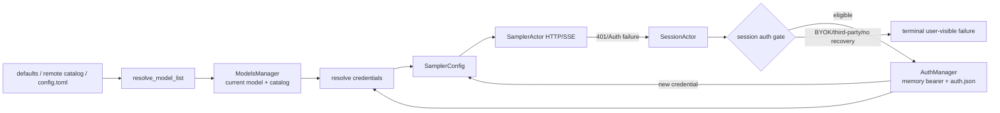
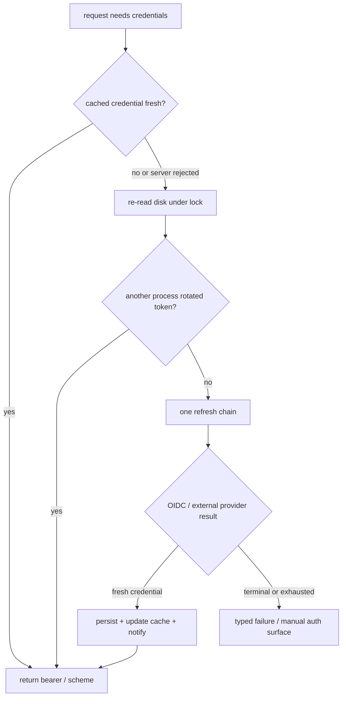
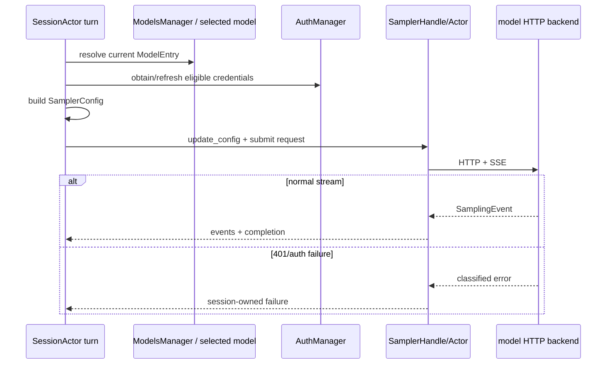
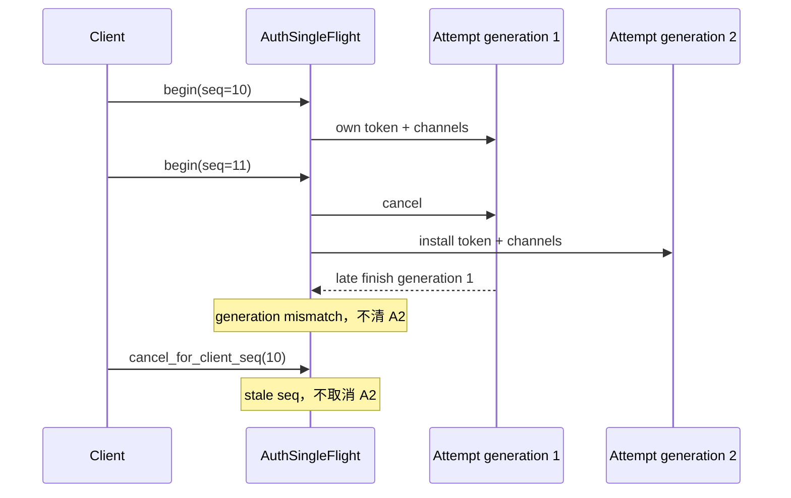

# 源码精读：认证与模型选择如何变成一次安全的采样请求

用户配置里的一个 `[model.<alias>]` 最终不会直接变成 HTTP 请求。它至少经过四层：模型目录合并、当前模型选择、credential resolution、每 turn 的 `SamplerConfig` 更新。认证也不是“拿到 401 就刷新”：自带 API key（BYOK）、第一方 session token、OIDC 和外部 provider 的可恢复性不同，错误刷新可能把凭据发往错误 endpoint，或造成无限重试。

本篇回答：

1. 模型别名、真实 API model ID、endpoint 与 backend 如何分别决定？
2. 用户配置、远程模型目录、内置 defaults 如何合并？
3. API key、`auth.json` session token、OIDC/external provider 各由谁拥有？
4. 为什么 SamplerActor 不自行无限刷新 token，而是把 401 交回 Session？
5. 改模型/认证功能时，应在哪一层写测试和避免哪些安全错误？

用户如何配置自定义模型、环境变量与登录，见 [08-build-troubleshooting.md](../08-build-troubleshooting.md)。这里聚焦源码控制流和贡献边界，所有示例都省略真实凭据。

## 1. 四类状态，四个 owner



| 状态 | owner | 它回答的问题 | 不应误当成 |
|---|---|---|---|
| `Config` / `ModelEntryConfig` | 配置加载和 agent config | 用户希望有哪些模型、端点、默认值与限制 | 已经验证可用的 HTTP 请求 |
| `ModelEntry` / model catalog | `resolve_model_list`、`ModelsManager` | 当前可选模型及每个模型的有效元数据 | 当前 session 正在用的 bearer token |
| `SamplerConfig` | Session/Agent 每次选择模型时构建，SamplerActor 消费 | 此请求的 model、URL、backend、headers、auth scheme、预算与重试参数 | 长期唯一的模型配置事实 |
| `AuthManager` | shell auth 模块 | 当前 session credential、磁盘 credential、refresh 和单飞协调 | 每个第三方 BYOK 的全局 token store |

这层分离非常重要：Pager 中切换显示名称不等于更新 `SamplerConfig`；刷新 `auth.json` 不等于把 session token 合法地用于第三方模型；远程 catalog 刷新也不应覆盖用户明确的 per-model 配置。

## 2. 从配置到模型目录

### 2.1 别名、显示名和真实模型 ID

一个模型条目至少有三种不同的标识：

| 字段 | 用途 | 常见误解 |
|---|---|---|
| `[model.<alias>]` 的 `alias` | 本地目录 key、`[models].default`、`/model` 输入 | 它一定是后端接受的 model ID |
| `name` | TUI/列表里的可读显示名 | 改它会改变实际请求 |
| `model` | 进入采样 HTTP body 的真实 API model ID | 一定能用作本地 `/model` 选择 key |

`base_url` 决定模型请求去往哪里，`api_backend` 决定 wire format（例如 Responses 或 Chat Completions），`context_window` 决定 request 预算/compact 阈值。它们是同一 `ModelEntry` 的不同字段，不应由 UI 或 sampler 各自猜测。

### 2.2 `resolve_model_list` 的合并方向

[`agent/config.rs`](../../crates/codegen/xai-grok-shell/src/agent/config.rs) 中的 `resolve_model_list` 组装最终 model map。高层优先级为：

```text
用户 config.toml [model.*]     最高：覆盖或新增某个 model key
        ↓
prefetched / remote catalog    作为可用模型基础；可补部分默认元数据
        ↓
hardcoded defaults             没有 custom endpoint 时的本地基础目录
```

当配置了 custom models endpoint，内置 defaults 会被跳过，避免把第一方默认模型错误地混入第三方目录。远程 catalog 不是简单 append：对同 key 它会替换 base entry，但还可能从原条目继承缺失的 context window、agent type 或 backend metadata；随后显式 `[model.*]` 覆盖再次应用。

合并完成后还会应用全局 `[models]` 的 fallback，例如没有 per-model 值时的采样 scalar 或 extra headers。per-model 值优先，global 值只是 fallback。修改这一层时，不要将 global default 写成强制覆盖，否则会破坏现有 BYOK/remote-model 行为。

### 2.3 `ModelsManager` 不只是 UI 下拉框

`ModelsManager` 保存当前有效目录和选择状态，负责把 catalog refresh、缓存/ETag 与 session model selection 连接起来。它是“可选模型”的 owner；`SessionActor` 则保存这次 session/turn 真正采用的 sampling state。

```text
models endpoint / cache / config change
  -> ModelsManager refresh + resolve list
  -> selected model entry
  -> Agent prepares fresh SamplerConfig
  -> Session sampler handle receives update
```

这解释了两个正确性要求：

- 只改 `ModelEntry` parser 还不够，必须验证 ModelsManager refresh 和已打开 session 的 model switch；
- 不要将一次模型请求的 response metadata 当成长期 catalog 的唯一来源。catalog 可刷新，当前请求也可能使用显式 override。

关键源码：

- [`agent/config.rs`](../../crates/codegen/xai-grok-shell/src/agent/config.rs)
- [`agent/models.rs`](../../crates/codegen/xai-grok-shell/src/agent/models.rs)
- [`agent/models/fetch.rs`](../../crates/codegen/xai-grok-shell/src/agent/models/fetch.rs)
- [`agent/models/cache.rs`](../../crates/codegen/xai-grok-shell/src/agent/models/cache.rs)
- [`agent/models/resolution.rs`](../../crates/codegen/xai-grok-shell/src/agent/models/resolution.rs)

## 3. 凭据解析：BYOK 与 session token 不能混用

模型配置可包含显式 `api_key`、`env_key` 或 provider reference；同时，Grok Build 的登录流程会维护 scope 对应的 session credential。两类 secret 的来源和可恢复性不同：

| 认证来源 | 常见归属 | 通常是否可经 AuthManager 刷新 | 401 时的正确初始态度 |
|---|---|---|---|
| per-model `api_key` / `env_key` | 某个模型或第三方网关的 BYOK | 否，除非该 model 显式绑定可信 provider | 报告该模型凭据/endpoint 问题，不发送 session token |
| 第一方登录 bearer | `AuthManager` 内存缓存与 `auth.json` scope | 可以，取决于 refresh authority | 允许走 session-owned recovery |
| OIDC credential | `AuthManager` + issuer/client/refresh token metadata | 可以走 OIDC refresh；有 terminal/transient 分类 | 只在第一方/已允许 scope 走刷新链 |
| external auth provider | 受信任的 provider config 和受控子进程 | 可能；输出经 parse/TTL/timeout 处理 | 通过 provider refresh contract，不当作裸 API key |

`resolve_credentials` 和 `sampling_config_for_model` 的职责是把模型选择和 credential facts 映射成 sampler 可消费的 `AuthScheme`/header 配置。它们是所有调用路径（主 session、subagent、model switch）的共同入口；不要在某个 UI 或 subagent 分支手写 `Authorization`，否则会绕开 per-model endpoint、provider 和 auth-type 判断。

### 3.1 endpoint 是安全边界

session bearer 只能在允许的 endpoint/auth 类型上使用。`auth_method.rs` 和 session 的 auth gate 特意区分：

- 当前 session 是否语义上是 refreshable 的 session-auth；
- 当前 model 是否是明确的 BYOK；
- 失败 endpoint 是否是允许使用 session bearer 的第一方 endpoint；
- auth state 短暂不可读时，是否应保守保持 session-auth 而非降级为 API key。

这不只是“更少刷新”：如果把第一方 session bearer 自动拿去重试任意 `base_url`，会把用户登录 token 泄漏给自定义网关。相反，BYOK 的 401 不能靠刷新 `auth.json` 修复，应把错误留在当前模型配置/credentials 边界。

### 3.2 `AuthManager` 的单一事实与锁规则

`AuthManager` 是一个 scope 的 `auth.json` 与内存 bearer cache 的单一事实来源。它负责：

- 从受控路径读取登录凭据，或接受明确的 process-level credential source；
- 缓存当前 credential，避免每次请求都读磁盘；
- 用 async refresh lock 和文件锁协调多个进程/任务，防止重复使用一次性 refresh token；
- 成功后通知依赖者，供模型目录/请求路径更新；
- 对刷新失败保留带 credential identity 的短期 verdict，避免忙循环；
- 以 redacted `Debug`、suffix/布尔字段而非完整 secret 参与 telemetry。

它的注释给出关键约束：不要在 `parking_lot` guard 持有期间 `.await`；刷新网络请求由 `refresh_lock` 串行化，磁盘层还有 `auth.json.lock` 协调。任意“为了方便”在另一个模块中直接读写 `auth.json` 的改动都会破坏跨进程刷新与旋转 token 的安全性。



`GROK_AUTH`、`GROK_AUTH_PATH` 与默认 `$GROK_HOME/auth.json` 的解析属于 AuthManager 构造边界；用户级 `auth.json` 由登录流程管理。项目级 `.grok/config.toml` 不应携带个人 API key 或 session credential。

## 4. OIDC 与外部 provider：刷新是受控状态机

### 4.1 401 不等于“再跑一次同样请求”

`UnauthorizedRecovery` 的设计按来源收敛：

```text
server rejects a credential
  -> ReloadFromDisk
       another process may already have rotated the token
  -> RefreshFromAuthority
       OIDC refresh or external provider refresher
  -> optional environment-specific recovery
  -> terminal typed AuthError / manual login surface
```

先 reload disk 的原因是多进程：另一个 Leader、CLI 或窗口可能已经刷新并写入新的 credential。直接再次调用 IdP 会浪费请求，甚至在 refresh token 轮换时使旧 token 被重复使用。

`RefreshReason::PreRequest` 可以复用仍有效的缓存 token；`RefreshReason::ServerRejected` 则要求获得不同的 credential，并受到 fresh-mint guard 保护，避免刚生成的 token 因旧 in-flight request 的迟到 401 被立刻重复刷新。

### 4.2 OIDC 的 terminal 与 transient 区分

OIDC exchange 返回纯数据结果，实际写入 `AuthManager` 仍由 refresh chain 统一处理。它区分：

- `invalid_grant` 等 terminal 情况：refresh token 已失效，需要明确的人工登录路径；
- DNS/connect/timeout 等没有到达 IdP 的 transient 情况：不把凭据判死；
- refresh 期间系统 suspend 的情况：用 monotonic/wall clock 差检测可能跨越 rotation grace，避免重放可能已轮换的 refresh token。

这是典型的 Rust/async 贡献点：不要用一个简单 `.retry(3)` 覆盖所有 error。错误分类决定是否更新 permanent failure verdict、是否显示 manual-auth、是否可以继续 relay/reconnect。

### 4.3 外部 provider 不是 shell command 的快捷出口

external auth provider 会被当成受控的 credential provider：stdout 被解析成 token output，刷新有单次 timeout，子进程由可终止的 runner 托管，初始交互登录和无交互 mid-session refresh 是不同路径。provider 的命令、args、TTL 和 cwd 共同构成 token identity；配置变动会使已 mint token 过期，以防新 provider 配置仍使用旧结果。

不要把 provider stdout、command arguments 或 raw token 写进 log/测试失败信息。测试应断言“是否有 refresh token”“issuer 是否匹配”“expiry 是否有效”或使用 fake token，而非打印 bearer 内容。

关键源码：

- [`auth/manager.rs`](../../crates/codegen/xai-grok-shell/src/auth/manager.rs)
- [`auth/recovery.rs`](../../crates/codegen/xai-grok-shell/src/auth/recovery.rs)
- [`auth/single_flight.rs`](../../crates/codegen/xai-grok-shell/src/auth/single_flight.rs)
- [`auth/oidc/refresh.rs`](../../crates/codegen/xai-grok-shell/src/auth/oidc/refresh.rs)
- [`auth/external_auth.rs`](../../crates/codegen/xai-grok-shell/src/auth/external_auth.rs)
- [`auth/credential_provider.rs`](../../crates/codegen/xai-grok-shell/src/auth/credential_provider.rs)

## 5. 每 turn：重新准备 sampler，而不是相信旧配置

Session 在真正提交采样前调用 `prepare_sampler_for_turn`。它会读取当前认证/模型状态，更新即将过期的 session credential，重建或更新 `SamplerConfig`，并通过 sampler handle 将新配置交给 `SamplerActor`。这样 model switch、刷新 token、catalog refresh 或 session 相关配置不会只在启动时读取一次后永久陈旧。



SamplerActor 负责 transport、SSE、取消和 transient retry；它不知道一个 401 对此 session 是否能安全刷新。因此它将 auth/context/turn-policy failure 上交给 `SessionActor::handle_sampling_failure`。

### 5.1 一次 turn 的 auth recovery 预算

`handle_sampling_failure` 先检查失败是否是认证错误、当前 session auth gate 是否允许 recovery、endpoint 是否符合条件以及本 turn 是否已消耗恢复机会。成功时返回“刷新后重提”的意图，外层再次经过完整的 `prepare_sampler_for_turn`；失败则以清晰错误结束或通知用户。

这有三个好处：

1. 401 不会在 SamplerActor 内无限重试；
2. 恢复后的 request 一定重新取当前 `SamplerConfig`，而不是复用旧 Authorization header；
3. compact、doom-loop、max-turns 与 auth recovery 的顺序仍由一个 turn owner 决定。

关于 stream/retry 的底层事件见 [采样生命周期](./sampling-lifecycle.md)；不要把其中的 transport 429/5xx retry 与 session-owned 401 recovery 混为一谈。

## 6. 观察与脱敏：调试认证不是打印 token

一个足够诊断问题、又不会泄漏凭据的事件时间线应包含：

```text
model alias + real model id（可选）
base URL origin/category（不要携带 query/userinfo）
api_backend + auth scheme / auth type
catalog source（config / cache / remote）
request/turn ID + attempt
HTTP status / classified error kind
recovery decision（skipped / adopted disk token / refreshed / terminal）
```

不要记录或返回：

- `Authorization`、API key、refresh token、cookie、OAuth callback code；
- 完整 `auth.json`、provider stdout、原始 model request body；
- 带 secret query string 的 endpoint URL；
- 把 credential 放进 `Debug`、panic 或 snapshot fixture。

`AuthManager` 自身刻意实现 redacted `Debug`。贡献新日志时沿用这一约束；“只在 debug log 打一次”仍是泄漏。

## 7. 常见症状到 owner 的映射

| 现象 | 首先排查 | 常见根因 |
|---|---|---|
| `/model` 中没有预期模型 | `resolve_model_list`、ModelsManager、catalog fetch/cache | custom endpoint 跳过 defaults、hidden/disabled、remote catalog/配置 key 冲突 |
| 显示名正确但请求发到错误网关 | `ModelEntry` 的 `model`、`base_url`、`api_base_url`、`api_backend` | 将 alias/name 当作 wire model，或只改 UI state |
| 登录后仍偶发 401 | `AuthManager` recovery、`prepare_sampler_for_turn`、endpoint gate | 用旧 in-memory header、另一个进程刚刷新、错误把 BYOK 视为 session auth |
| 第三方模型收到了第一方 token | `resolve_credentials`、auth method/session gate | endpoint 分类或 fallback 逻辑破坏；属于安全 bug |
| 每轮都反复执行 external provider | provider token identity/TTL、refresh failure verdict、single flight | 没有缓存/过期判断，或将 transient failure 当作立即可重试 |
| 401 后无限采样 | `handle_sampling_failure` 的 turn budget | Sampler 层错误重试了 session policy，或恢复成功后未重新准备 config |
| 模型目录在唤醒/刷新后不更新 | `ModelsManager` refresh/ETag 与 AuthManager refresh notification | 只读启动缓存，没有接入刷新事件 |

## 8. 测试和贡献检查表

先运行 [`mini_auth_model_boundary.rs`](../rust-essentials/labs/async-demos/src/bin/mini_auth_model_boundary.rs)，预测五组 auth gate 和三条 401 路径的结果：

```sh
cargo run --locked \
  --manifest-path docs/rust-essentials/labs/async-demos/Cargo.toml \
  --bin mini_auth_model_boundary
```

程序固定 alias/display/wire model 的区别、`Unknown` 只对第一方 endpoint 保守放行、第三方 BYOK 不调用 Session refresh、单 Turn 只消费一次恢复机会，以及 `Secret` 的脱敏 `Debug`。它不实现 provider/OIDC 刷新、多进程 `auth.json` 锁或 catalog merge；这些必须由下表对应 owner 的 fixture 证明。

| 改动 | 最小验证面 |
|---|---|
| 模型字段/合并优先级 | `agent/config.rs` 的 `resolve_model_list` 与 `sampling_config_for_model` tests |
| model fetch/cache/ETag | `agent/models/{fetch,cache,tests}.rs` 的离线 fixture |
| auth method / endpoint classification | `agent/auth_method.rs` tests，覆盖 BYOK、OIDC、未知状态和第一方 endpoint |
| `auth.json` / refresh state machine | `auth/manager_tests.rs`、`auth/recovery.rs` tests，使用临时目录和 fake token |
| OIDC refresh classification | `auth/refresh/oidc_refresher_tests.rs` 与 `auth/oidc` tests |
| external provider | `auth/external_auth.rs` tests，验证 timeout、parse 和 child cleanup，不输出 secret |
| turn 401 policy | `session/acp_session_tests/auth_error_no_retry_tests.rs`、`turn/auth_retry_budget_tests.rs` |
| end-to-end request wiring | `xai-grok-test-support::MockInferenceServer`，断言脱敏后的 header presence、endpoint、backend 与 request count |

修改时依次问：

1. 这是 catalog 选择、credential resolution、refresh，还是 transport retry？
2. 哪个 model/endpoint 可以安全携带 session token？哪个必须只用 BYOK/provider token？
3. 本次 401 是一次真实服务器拒绝、旧 in-flight 请求的迟到错误，还是本地配置错误？
4. 重试是否有明确 owner、次数预算和新的 `SamplerConfig`？
5. 测试/日志是否完全避免真实 secret？

纯文档修改只执行静态检查；修改 Rust、配置解析或 wire 行为时才根据这一表选择最小测试。不要为了文档变更构建 workspace。

## 9. 阅读练习

1. 在 `resolve_model_list` 找出三层 model map 的合并顺序，解释 config `[model.*]` 为什么必须高于 prefetched catalog。
2. 跟踪一个 selected `ModelEntry` 到 `sampling_config_for_model`，列出最终影响 HTTP 请求的字段和只影响 UI 的字段。
3. 从 `try_recover_unauthorized` 跟到 `UnauthorizedRecovery`，画出“磁盘已有新 token”与“必须刷新 authority”两条路径。
4. 找到 `handle_sampling_failure` 对 401 的分支，说明为什么它必须在 Session 而不是 SamplerActor。
5. 设计一个测试：第三方 BYOK endpoint 返回 401。写出应断言的负面性质，即 AuthManager 的 session refresh 不应被调用。

完成后，你应能将“模型不可用”拆成可验证的问题：模型目录、选择、credential source、endpoint 安全边界、refresh 状态机或采样错误策略，而不是笼统地反复登录或重复发送请求。

## 10. 模型合并不是整条目覆盖，而是逐字段 lattice

把 model resolution 简化成 `config > remote > defaults` 仍不够精确。最终条目包含 alias key、wire slug、context window、backend、agent type、headers、reasoning efforts 等字段；不同字段的“未设置”表达也不同。

```text
base catalog membership
  -> hardcoded defaults，或 prefetched catalog（包括 Some(empty)）
  -> 全局 [models] fallback 只填空位
  -> [model.<alias>] 显式 override
  -> 同 wire model slug 的受限 metadata propagation
  -> visibility / supported-in-api filtering
```

`prefetched: None` 表示没有远端目录事实，可以使用 bundled base；`prefetched: Some(empty)` 表示服务器明确返回空目录，结果不应偷偷恢复 bundled models。这是 Option 与 empty collection 的协议差异，测试必须分别覆盖。

### 10.1 同 slug 不等于同 harness

配置 key `grok-build` 与远端 key `grok-4.5` 可能都指向 `ModelInfo.model = "grok-4.5"`。为了避免默认选择落到只有 fallback context window 的 sibling，resolution 会传播部分 metadata；但不能复制整个条目：

- context window 只在 recipient 仍是 parser fallback 时继承，显式值不能覆盖；
- `api_backend` 可以跟随同一 wire API 语义；
- `agent_type` 不传播，因为每个 alias 可能选择不同 harness/prompt；
- reasoning efforts 的显式 config list 高于 remote list；
- alias/name/model 仍保持各自角色，不能被 slug propagation 合并为一个标识。

这类合并最好用“字段来源表”测试，而不是只 snapshot 最终 JSON。失败时才能知道是 membership、fallback、override 还是 propagation 出错。

### 10.2 HTTP header 名大小写不敏感

全局 `extra_headers` 只填 per-model 未覆盖的 key，且比较必须 ASCII case-insensitive。否则：

```text
global:    X-Request-Tags: global
per-model: x-request-tags: private
```

最终 map 会同时包含两个逻辑相同的 header，HTTP client 的合并/发送顺序决定谁生效。正确结果只保留 per-model 版本。认证 header 更不能依赖普通 extra-header precedence；`Authorization`、token-auth marker 等应由 credential resolver/HTTP auth owner 构造，避免用户配置与 session token 形成双头事实。

## 11. `SamplerConfig` 是一次请求的 immutable snapshot

模型目录和 `AuthManager` 都会变化，正在执行的 HTTP request 却必须看到一致配置。`prepare_sampler_for_turn` 将当时的 model、base URL、backend、headers、credential 和预算复制进新的 `SamplerConfig`，再交给 sampler actor。

这个 snapshot 边界解决两个竞态：

1. catalog refresh 不能在 SSE 中途改变解析 backend 或 context window；
2. token refresh 不能原地修改已经发出的 request header，让 tracing/重试无法判断实际发送了哪个 credential。

恢复后重提必须重新构建 snapshot。重用原 request builder 即使 `AuthManager` 已更新，也可能继续携带旧 `Authorization`。反过来，正常 transport retry 若语义上属于同一 attempt，需要明确它是否重新 apply live provider；不能让实现细节隐式决定 auth policy。

### 11.1 model switch 是复合事务

一次成功切换至少需要同步：

```text
selected model ID
  -> resolved ModelEntry
  -> credential source + endpoint gate
  -> SamplerConfig/backend
  -> context window / compaction policy
  -> tool/agent definition rebuild（若 agent_type 变化）
  -> session update / UI confirmation
```

只更新 sampler model string 会留下旧 context budget 或旧 harness；只更新 UI 会让下一 turn 仍请求旧 endpoint。测试应在切换后真正提交一次 mock request，并断言 wire model、origin、backend、header presence 和 compact threshold，而不是只检查 manager 的 selected field。

## 12. Credential snapshot、live provider 与 endpoint scope

不同 consumer 对凭据的读取方式不同：主 sampler 可在 turn 前重建 config，upload、embedding、OTel exporter 等长寿命 client 更适合持有 `AuthCredentialProvider`，在每次请求取 snapshot。

`CredentialSnapshot` 只暴露 consumer 所需事实：可发送 token、user/team/organization/deployment identity、API key ID 等。provider 的 `Debug` 必须脱敏；snapshot 也不应被整体记录。

### 12.1 precedence 必须在 provider 内统一

`ShellAuthCredentialProvider` 中 deployment key 高于 session credential。存在 deployment key 时：

- `snapshot` 返回 deployment token/ID；
- 不附加普通 session token-auth 语义；
- 401 recovery 不调用 session `AuthManager` refresh。

否则 provider 从 live `AuthManager::current_wire_valid()` 取 bearer，并允许 unauthorized recovery。若每个 upload/client 自己实现 precedence，很容易出现请求用 deployment key、401 却刷新用户 OIDC 的错配。

### 12.2 endpoint-scoped credentials 防止旁路泄漏

embedding 使用 `EndpointScopedCredentials::for_endpoint`：只有通过 `is_xai_api_bearer_url` 且为 HTTPS 的 xAI-operated endpoint 才附加 session credential；其他 endpoint 使用明确 API-key provider 或无凭据。

这条规则必须覆盖所有非 sampler consumer。主模型 endpoint gate 正确，不代表 memory embedding、repo upload、managed MCP 或 telemetry exporter 自动安全。每新增一个 HTTP client，应回答：

1. endpoint 由谁配置和验证；
2. bearer 在 request build 的哪一刻读取；
3. 401 由谁归因和恢复；
4. deployment/session/API key 的 precedence；
5. 日志只记录哪种 redacted identity。

## 13. Interactive auth single-flight 是带 generation 的 owner

设备码/loopback 登录会同时持有 cancellation token、code sender 和 URL receiver。`AuthSingleFlight` 把它们放在一个 `Attempt` 中，`begin` 原子替换 active attempt 并取消 predecessor：



RAII `AuthAttemptGuard` 保证 authenticate future 被 abort 时仍调用 `end(generation)`；generation check 保证旧 future 的 Drop 不会清除新 attempt。Pager 的 `request_seq` 进一步约束显式 cancel，避免网络延迟的旧取消杀掉后续登录。

单飞不仅减少重复登录窗口，更保护一次性 code/url channel 的所有权。只共享一个全局 cancel token、把 channels 分散存储，会让旧 attempt 的 cleanup 拆掉新 attempt 的交互界面。

## 14. Refresh concurrency：内存锁、文件锁和 authority call

认证刷新跨越 task 与进程，至少有三层协调：

| 层 | 防止的竞争 | 关键规则 |
|---|---|---|
| 内存 `refresh_lock` | 同进程多个 401 同时刷新 | lock 后重新检查当前 token/verdict |
| `auth.json.lock` | 多进程消费同一个 rotating refresh token | authority call 与结果持久化期间保持唯一 owner |
| credential identity | 迟到 401 / sibling token / provider config 变化 | 只让 verdict 和 recovery 作用于实际尝试的 credential |

刷新链在获得内存锁后重新查看 current token：另一个 task 可能已完成刷新；`ServerRejected` 只有当 token 与入锁前相同才强制继续。随后获取文件锁，先尝试 adopt sibling 写入的新 token；只有仍无新事实时才调用 IdP。

### 14.1 irreversible refresh 不能随便 cancel

一旦 rotating refresh token 已发送给 IdP，直接 drop future 可能丢掉响应中的新 refresh token，导致整个 token family 被旧值永久锁死。因此 authority exchange 开始后让 in-flight call 完成，并通过 sleep gate/hold-awake 协调系统 suspend：

- sleep 已 imminent 时，在调用 IdP 前 defer；
- call 已在途时，sleep ack 有界等待它 drain；
- dark wake 没有正常 sleep 通知时，best-effort hold awake；
- deferral 是 transient，不应累计成 permanent revocation verdict。

这与普通 HTTP GET 的 cancel 语义不同。可取消边界应放在“发送 rotating credential 之前”，不可逆之后依靠 bounded completion 与 durable write。

## 15. Credential-scoped verdict 与迟到 401

永久失败缓存不能只是 `bool auth_broken`。`ScopedRefreshFailure` 绑定实际尝试的 credential key、失败原因和双时钟时间：

```text
verdict applies iff
  attempted credential identity == recorded token_key
  and (reason sticky or TTL not expired)
```

它解决以下竞态：

- sibling process 已写入不同 refresh token：旧 verdict 不得阻止新 token；
- 内存 access token 被替换，但磁盘 refresh token 未变：verdict 仍应限制对同一 dead RT 的 IdP storm；
- `RefreshTokenRejected` 是 sticky，直到 login/logout/credential change；
- transient/escalated verdict 可由 monotonic 或 wall clock 任一达到 TTL 后失效，跨 suspend 也能恢复；
- wire-valid access token 即使对应 RT 有 verdict，真实 expiry 前仍可服务请求，但不能再次调用已知失败的 refresher。

### 15.1 `ServerRejected` 与 `PreRequest` 的不同采用规则

`PreRequest` 可以使用仍 fresh 的 current/disk token；`ServerRejected` 必须证明 candidate 与刚被拒绝的 key 不同。否则“reload disk”只是把同一 bearer 再发一次，形成每 turn 401 循环。

两个并发请求都携带 token A，A 被刷新为 B 后，第二个请求的迟到 401 不应再把 B 立刻刷新成 C。lock 后 token identity re-check/fresh-mint guard 应让它采用 B。测试不能只串行模拟 401，必须控制两个请求的响应顺序。

## 16. 401 attribution：知道哪个 consumer 发了哪个 token

共享 `AuthManager` 的 consumer 不止 sampler。Storage、OTel、managed MCP 等各自可能返回 401；若日志只有“auth 401”，无法判断是 token 真失效、某个 client 缓存旧 snapshot，还是 endpoint/marker 错配。

attribution 事件应包含：

- consumer kind 与 operation；
- session/request correlation；
- sent bearer 的不可逆短 prefix/fingerprint，而不是 token；
- AuthManager 当前 credential 是否与 sent identity 一致；
- recovery decision 与新旧 identity 是否变化。

`StorageClientAttributionBridge` 把 file-utils 的 callback 接回 shell auth owner，而不让底层 crate 依赖整个 shell。长寿命 client 必须同时得到 live provider 和 attribution callback；只给静态 token 会造成 refresh 前缓存窗口，且 401 没有足够证据定位。

### 16.1 ancillary consumer 矩阵

| consumer | credential 读取时机 | endpoint gate | 401 owner |
|---|---|---|---|
| main sampler | turn 前构造 `SamplerConfig` | model/auth gate | Session turn recovery budget |
| embedding/memory | request provider snapshot | xAI HTTPS predicate | endpoint credential/provider |
| storage/upload | live provider per request | proxy factory/config | provider + attribution bridge |
| OTel exporter | bootstrap manager，后 hot-swap live manager | exporter config | refreshable exporter/provider |
| managed MCP | managed config header + refresh context | managed proxy/config | MCP reauth state machine |

不能把所有 401 都塞进 Session turn budget：后台 upload 可能发生在 turn 结束后，OTel exporter 甚至不属于某个 session。它们共享 credential authority，但各自拥有请求重试和用户可见失败语义。

## 17. 安全测试矩阵与进阶练习

| 风险 | 正向断言 | 必须同时断言的负面性质 |
|---|---|---|
| custom model endpoint | 使用其显式 BYOK/provider | 从未读取或发送 session bearer |
| global/per-model headers | per-model case-insensitive override | 不产生大小写变体重复 header |
| concurrent 401 | 至多一次 authority refresh，后者采用新 token | 迟到 401 不触发第二次 fresh mint |
| sibling rotation | 文件锁下 adopt 新 disk token | 不再消费旧 rotating RT |
| interactive login replacement | predecessor 被 cancel，successor channels 可用 | stale end/cancel 不清 successor |
| sticky verdict | 同 credential 快速 short-circuit | credential 改变后不继续阻塞 |
| sleep deferral | 返回 transient 并在唤醒后可恢复 | 不记录 permanent failure/KPI revocation |
| ancillary client | 请求时读取 live provider | log、Debug、callback 不暴露 bearer |

进阶练习：

1. 为 `prefetched=None`、`Some(empty)`、`Some(models)` 写三格 catalog membership 预期，并解释为何 empty 不能回退 bundled defaults。
2. 给两个 alias 指向同 slug 的条目制作字段来源表，逐项判断 context window、backend、agent type、reasoning efforts 是否传播。
3. 模拟 request R1/R2 都发送 token A：R1 401 后刷新 B，R2 再迟到 401；写出每次 lock 前后应观察的 credential identity。
4. 画出 `AuthSingleFlight` generation 1 的 guard 在 generation 2 建立后 Drop 的状态，证明 active channels 不被清除。
5. 审计一个新 background HTTP client：列出 endpoint gate、provider snapshot、401 attribution、retry owner 和 secret-redaction 五项实现证据。
6. 设计 property test：对任意 header 大小写组合，合并结果中每个 case-insensitive key 最多出现一次，且 per-model value 优先。
