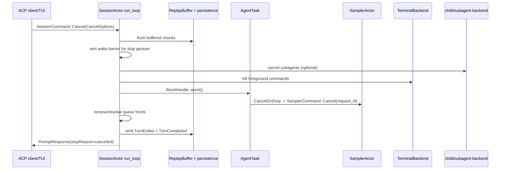

# 取消、超时与关闭精读

Agent 运行时的“取消”不是一个按钮，而是一组跨层协议。一次 Ctrl+C 可能同时影响 SessionActor、模型流、前台 shell、工具 stream、子代理、通知队列、replay buffer 和 ACP response；如果只调用 `JoinHandle::abort`，很容易留下活着的进程、悬挂的 `session/prompt` 或没有落盘的最后一段文本。

本文从所有权和完成证据出发，说明每一层应该取消什么、等待什么，以及哪些动作不能混用。

## 1. 四种停止机制

| 机制 | 作用 | 是否协作式 | owner/证据 |
|---|---|---|---|
| `CancellationToken::cancel()` | 通知正在等待的 future 尽快收尾 | 是 | token 的持有者；future 看到 `cancelled()` 或 `select!` 分支 |
| `AbortHandle::abort()` / 丢弃 future | 立即停止 Tokio future 的轮询并运行 Drop | 否，属于硬边界 | `SessionActor::AgentTask`；JoinHandle 不代表子进程已停止 |
| channel/oneshot 关闭 | 让接收方结束循环或让等待方得到 `RecvError` | 取决于接收方 | sender/receiver owner；必须把关闭当作状态而不是静默 EOF |
| kill foreground process | 终止工具启动的真实 OS 进程/进程组 | 通常是硬停止 | `ToolBridge`/`TerminalBackend`；不能等 registry 锁释放后再杀 |

**规则**：token 负责让业务 future 选择正常退出，abort 负责切断不能再继续的 turn future，进程 kill 负责 OS 子进程；它们各自的完成证据不同。

## 2. 从客户端到 SessionActor



这里的箭头不是“每一步都同步等待到完成”——例如 `abort()` 本身不等待被 abort 的 future 完成；但 SessionActor 必须在自己的 actor 逻辑中先保存需要持久化的数据，再发送终态 response。顺序不对就会出现客户端已回到 idle、磁盘却没有最后一个 chunk 的情况。

## 3. `CancelOptions` 是策略输入

[`session/commands.rs`](../../crates/codegen/xai-grok-shell/src/session/commands.rs) 将取消原因和范围拆开：

```rust
pub struct CancelOptions {
    pub cancel_subagents: bool,
    pub kill_background_tasks: bool,
    pub rewind_if_no_output: bool,
    pub trigger: Option<CancelTrigger>,
    pub user_initiated: bool,
}
```

`CancelTrigger` 至少区分 `Esc`、`CtrlC`、`SendNow`、`Shutdown`、`SessionClose`、`SessionDelete` 和外部 client 字符串。`from_client` 只把明确的 `esc`/`ctrl_c` 映射为内部 stop gesture，未知字符串留在 `Client(String)`，这样新客户端不能意外获得内部语义。

### 3.1 Stop gesture 与 send-now 不是一回事

`Esc`、`Ctrl+C` 和 client stop 会设置 `notifications_suppressed` 与 `task_wake_suppressed`。这叫 **wake barrier**：取消期间到达的后台任务完成事件不应该马上重启模型，因为用户明确要求停止。通知会被放进 `pending_notifications`，供下一次真实用户 prompt 消费。

`SendNow` 是“取消当前 turn，立即运行新 prompt”，所以它：

- 仍然 flush replay buffer 和 stranded interjection；
- 不设置持久的 stop barrier；
- 清除 suppression，让新 prompt 可以接收后台完成通知；
- 不发“上一轮被用户中断”的 interrupt reminder。

这解释了为什么不能把“用户按 Esc”简单改写成“调用 send-now”。前者要阻止自动唤醒，后者要保证用户的新输入尽快接管。

### 3.2 队列不变量

`cancel_running_task` 把 `pending_inputs.front()` 视为当前运行 turn 的唯一权威位置，即使 `running_task` 在竞态窗口中已经被取走。正常取消会：

1. 用 `Cancelled` resolve 当前 front 的 `respond_to`，避免客户端永远等待。
2. 保留后面的真实用户 prompt，让 `maybe_start_running_task` 继续推进队列。
3. Stop gesture 时移除 task/workflow completion wake，并保留 fallback；下一次真实用户 turn 只消费一次。
4. `kill_background_tasks=true` 时清空整个队列，因为这是 session/subagent teardown，不应再启动任何后续输入。

测试 [`cancel_running_task_interactive_preserves_queued_work`](../../crates/codegen/xai-grok-shell/src/session/acp_session_tests/cancel_running_task_tests.rs) 证明取消运行项后 `q1/q2` 仍在队列；`stop_gestures_arm_wake_barrier` 和 `non_stop_cancels_preserve_queued_task_wakes_and_do_not_arm_barrier` 则证明两类 trigger 的差异。

## 4. Replay 与终态必须先后有序

`run_loop.rs` 的 `SessionCommand::Cancel` 分支先调用 `replay_buffer.flush()`，再执行 `cancel_running_task`。原因不是视觉体验，而是 durable correctness：长 reasoning stream 的尾部可能还只存在 actor-owned buffer；先 abort 再 flush 会永久丢失这一段。

取消结束时至少有三类信号：

```text
PromptResponse / oneshot       -> 这次 session/prompt RPC 已结束
TurnCompleted                   -> durable、replayable 的终态通知
updates.jsonl / events.jsonl    -> 磁盘和分析管道的持久证据
```

`turn_end.rs::emit_turn_completed` 是 completion 和 cancel 共用的终态 chokepoint，使用同一套 `prompt_complete_fields` 计算 stop reason 与 agent result，并在 `_meta.cancelTrigger` 中保留触发原因。客户端不能把“收到一个 cancelled response”当成磁盘已 flush 的充分证据，除非它还观察到 `TurnCompleted` 或对应的 persistence ack。

## 5. Session 如何真正停止 AgentTask

`tasks_cancel.rs::AgentTask` 只保存 `prompt_id` 与 `AbortHandle`。`cancel_running_task` 的关键顺序是：

```text
记录取消 telemetry / trigger
  -> 可选关闭子代理 spawn admission
  -> kill foreground terminal commands
  -> 取出 running_task 与需要 resolve 的 queue items
  -> 清理 MonitorEventBuffer / pending notifications
  -> emit TurnEnded(Cancelled)
  -> abort AgentTask
  -> finalize usage、清 current_prompt_id
  -> emit TurnCompleted + resolve PromptTurnResult
```

`AbortHandle::abort` 会让 `run_task` 的 future 被 Drop，但不应被误认为“所有副作用已经收尾”：

- `TurnActiveGuard` 的 `Drop` 负责清 `is_turn_active`；
- `CancelOnDrop` 负责通知 SamplerActor；
- 子进程需要 TerminalBackend 先杀；
- replay、usage、events 和 ACP terminal 信号由 SessionActor 显式处理。

因此贡献代码时，新增一个 `spawn_local` task 必须回答：谁保存 `AbortHandle`？谁在 cancel/shutdown 路径调用它？Drop 后是否还需要一个 oneshot/flush barrier？

## 6. 采样器：request-id 取消与 RAII

`SamplerActor` 每次 `Submit` 都创建一个独立 token，并在 `ActorState.active_requests` 注册 `request_id`。`SamplerHandle::cancel(request_id)` 只是投递 `SamplerCommand::Cancel`；真正的 actor 分支会从 active map 移除并 `cancel_token.cancel()`。

```text
Session aborts submit_and_collect future
  -> SubmitAndCollect::CancelOnDrop sends Cancel(request_id)
  -> SamplerActor::handle_command
  -> ActorState::cancel removes active request + fires token
  -> request_task::drive_l2 select! sees cancelled
  -> AttemptOutcome::Cancelled
  -> no retry; completion/error path closes
```

`submit_and_collect` 里的 `CancelOnDrop` 是关键 RAII：调用方 future 因 abort、panic 或正常返回而 Drop 时，都会给 sampler 一个 best-effort cancel。`request_task::drive_l2` 在 stream next 和 `cancel_token.cancelled()` 之间使用 biased `select!`；取消赢得竞争时返回 `AttemptOutcome::Cancelled`，不会进入 retry policy。

但 token 是协作式的。如果底层 HTTP/SDK future没有被轮询，Session 仍需要 abort 上层 future；如果一个新增 retry sleep 不使用 `sleep_or_cancel`，取消可能要等完整 backoff 才生效。

## 7. ToolBridge 与工具取消

### 7.1 两条取消通道

[`xai-tool-runtime::Cancellation`](../../crates/common/xai-tool-runtime/src/context.rs) 是单次工具调用的 typed extension。`ToolRegistry` 的 `call_streaming_with_cancellation` 将它放入 `ToolCallContext`，工具可以轮询：

```rust
let cancel = ctx
    .get::<xai_tool_runtime::Cancellation>()
    .map(|c| c.0.clone());

tokio::select! {
    _ = cancel.cancelled() => return Err(ToolError::cancelled()),
    result = do_io() => use_result(result?),
}
```

这条通道适合停止网络、文件或子代理等待；工具仍必须把部分输出、临时资源和 child ownership 处理清楚。

### 7.2 为什么 ToolBridge 单独持有 terminal

`ToolBridge` 的文档明确指出：运行 bash 时 registry lock 可能被 `call()` 持有，而 cancel 路径不能等待这个锁。因此 terminal backend 存在一个独立字段，Session 可以直接调用 `kill_foreground_commands()`，随后再 abort tool future。顺序反过来可能只丢掉 Rust future，真实 shell 进程仍在运行。

`LocalTerminalActor` 自己的主循环也用 biased `select!`：cancel token 优先于 command 和周期性 polling；收到取消会 `shutdown_all()`，频道关闭同样走 shutdown。周期 ticker 只在有 live process 时启用，idle session 不会无意义地唤醒。

## 8. 子代理：前台继承，后台脱钩

`task` 工具读取 parent `ToolCallContext` 的 cancellation。对于默认前台子代理，它创建 child token 并启动 forwarder：

```text
parent tool cancellation
          │
          └─> child_cancellation.cancel()
                    │
                    └─> SubagentRequest.cancel_token
```

前台 `backend.spawn(request).await` 返回后，forwarder 会 abort；这样不会泄漏一个只等待父取消的任务。对于 `run_in_background=true`，源码故意不建立这个 forwarder：后台工作要在父 turn 结束后继续存在，由 coordinator、`kill_task`、session stop 或 owner scope 决定何时取消。

Session stop 如果要求 `cancel_subagents`，会先 abort 当前 producer，再按 `parent_session_id`/`parent_prompt_id` 作用域取消子代理，并关闭新的 spawn admission；不能使用全局 wildcard，否则会误杀兄弟 session 的任务。`kill_background_tasks` 另外决定是否终止已经脱钩的后台任务。

## 9. Compaction、Workflow 和 MCP 的子树取消

取消也有独立子树：

```text
Session cancel
  ├─ current AgentTask / sampler request
  ├─ ToolCallContext::Cancellation
  │   ├─ foreground terminal
  │   └─ foreground subagent
  ├─ compaction cancel gate
  ├─ workflow host service token
  └─ MCP restart / reconnect task
```

Compaction 使用自己的 gate/token，并在流式摘要的等待点调用 `await_unless_cancelled`；Workflow host service 在 acquire、I/O 和 queue wait 中监听 token；MCP restart loop 也在 backoff、连接和 shutdown 分支中监听。它们不能只看 `is_turn_active=false`，因为该标志是观测状态，不是取消信号。

## 10. 取消、超时、关闭的区别

| 场景 | 语义 | 典型动作 | 是否允许下一条用户 prompt |
|---|---|---|---|
| 用户 Stop | 当前 turn 被中断 | flush、kill foreground、abort、arm wake barrier | 允许，排队的真实 prompt 保留 |
| Send Now / interjection | 当前 turn 被替换 | flush、cancel、清 suppression、启动新 front | 立即允许 |
| 工具/HTTP idle timeout | 一个子操作失去进展 | token cancel 或工具内部超时；上层分类 error | 由 Session 决定，通常结束当前 turn |
| session close/delete | 宿主不再服务该 session | `kill_background_tasks`、取消子代理、关闭资源、落盘 | 不允许旧队列继续启动 |
| 进程 shutdown | 宿主生命周期结束 | cancel root token、关闭 actor、flush sink、join/drain | 只允许 shutdown protocol 完成 |

“超时”不自动等于“用户取消”：超时通常要保留错误类型、重试资格和诊断上下文；用户取消则应映射为 `StopReason::Cancelled`，并带上 `cancelTrigger`。

## 11. 开发时的完成证据

改动取消或关闭逻辑时，至少收集以下证据：

1. **客户端证据**：当前 `session/prompt` 的 `PromptResponse` 只结束一次，stop reason/category 正确。
2. **Session 证据**：`running_task`、`current_prompt_id`、队列 front、wake barrier 和 `is_turn_active` 达到预期状态。
3. **外部资源证据**：sampler `is_active=false`，前台 terminal child 已退出，前台 subagent 已收到 cancel。
4. **持久化证据**：`updates.jsonl`/`events.jsonl` 有 `TurnEnded`/`TurnCompleted`，replay buffer 的尾部已 flush。
5. **关闭证据**：所有 task/actor/channel 的 owner 都已结束；不能只看到一个 `JoinHandle` 被 drop。

推荐的确定性测试矩阵：

| 注入时点 | 断言 |
|---|---|
| 模型首个 token 前 | request 被取消、不重试、PromptResponse 不悬挂 |
| reasoning chunk 留在 ReplayBuffer 时 | cancel 前 flush，磁盘包含尾 chunk |
| 工具持有 registry lock 时 | terminal 先被 kill，取消不被锁阻塞 |
| 前台 task 正在等待子代理 | child token 被触发，父 turn 只产生一个终态 |
| 后台 task 已 backgrounded | 普通 stop 不误杀；显式 teardown 才按 owner 清理 |
| cancel 与 completion 同时到达 | queue front、usage、TurnCompleted 不重复 |
| sampler backoff 中 | `sleep_or_cancel` 立即结束，不等待完整 backoff |
| channel sender 全部 drop | actor 进入 shutdown，pending response 得到明确错误 |

不要用固定长 `sleep` 证明取消成功。优先等待 oneshot ack、request count、`is_active`、child cancellation 或 test barrier；`timeout` 只作为失败上限。

## 12. 源码阅读顺序

1. [`session/commands.rs`](../../crates/codegen/xai-grok-shell/src/session/commands.rs)：先理解 `CancelOptions`、`CancelTrigger`、`ShutdownKind`。
2. [`session/acp_session_impl/run_loop.rs`](../../crates/codegen/xai-grok-shell/src/session/acp_session_impl/run_loop.rs)：看 Cancel command 如何 flush、cancel、重启队列。
3. [`session/acp_session_impl/tasks_cancel.rs`](../../crates/codegen/xai-grok-shell/src/session/acp_session_impl/tasks_cancel.rs)：追队列、子代理、终端、usage 和终态。
4. [`session/acp_session_impl/turn_end.rs`](../../crates/codegen/xai-grok-shell/src/session/acp_session_impl/turn_end.rs)：确认 PromptResponse 与 durable `TurnCompleted` 的共同映射。
5. [`xai-grok-sampler/src/handle.rs`](../../crates/codegen/xai-grok-sampler/src/handle.rs) 与 [`actor/request_task.rs`](../../crates/codegen/xai-grok-sampler/src/actor/request_task.rs)：看 request-id cancel、RAII 和 retry/backoff。
6. [`xai-tool-runtime/src/context.rs`](../../crates/common/xai-tool-runtime/src/context.rs)、[`xai-grok-tools/src/registry/types.rs`](../../crates/codegen/xai-grok-tools/src/registry/types.rs)：看取消 token 如何进入工具上下文。
7. [`xai-grok-tools/src/bridge.rs`](../../crates/codegen/xai-grok-tools/src/bridge.rs) 与 [`computer/local/terminal.rs`](../../crates/codegen/xai-grok-tools/src/computer/local/terminal.rs)：确认进程级 kill 和 actor shutdown。
8. [`session/acp_session_tests/cancel_running_task_tests.rs`](../../crates/codegen/xai-grok-shell/src/session/acp_session_tests/cancel_running_task_tests.rs)：用测试名称反向读取竞态和不变量。
