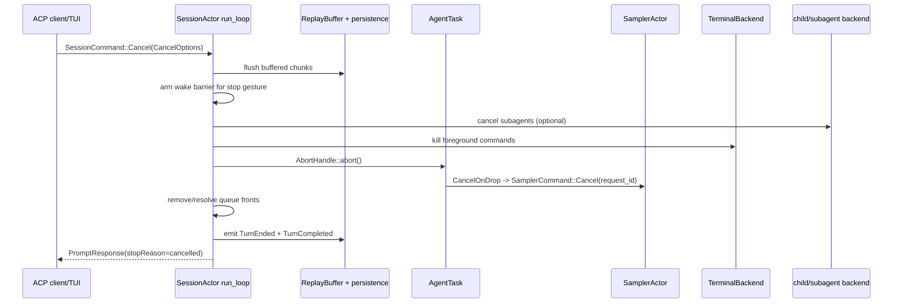

# 取消、超时与关闭精读

Agent 运行时的“取消”不是一个按钮，而是一组跨层协议。一次 Ctrl+C 可能同时影响 SessionActor、模型流、前台 shell、工具 stream、子代理、通知队列、replay buffer 和 ACP response；如果只调用 `JoinHandle::abort`，很容易留下活着的进程、悬挂的 `session/prompt` 或没有落盘的最后一段文本。

本文从所有权和完成证据出发，说明每一层应该取消什么、等待什么，以及哪些动作不能混用。

## 1. 四种停止机制

| 机制 | 作用 | 是否协作式 | owner/证据 |
|---|---|---|---|
| `CancellationToken::cancel()` | 通知正在等待的 future 尽快收尾 | 是 | token 的持有者；future 看到 `cancelled()` 或 `select!` 分支 |
| `AbortHandle::abort()` / 丢弃 future | 立即停止 Tokio future 的轮询并运行 Drop | 否，属于硬边界 | `SessionActor::AgentTask`；JoinHandle 不代表子进程已停止 |
| channel/oneshot 关闭 | 让接收方结束循环或让等待方得到 `RecvError` | 取决于接收方 | sender/receiver owner；必须把关闭当作状态而不是静默 EOF |
| kill foreground process | 终止工具启动的真实 OS 进程/进程组 | 通常是硬停止 | `ToolBridge`/`TerminalBackend`；不能等 registry 锁释放后再杀 |

**规则**：token 负责让业务 future 选择正常退出，abort 负责切断不能再继续的 turn future，进程 kill 负责 OS 子进程；它们各自的完成证据不同。

## 2. 从客户端到 SessionActor



这里的箭头不是“每一步都同步等待到完成”——例如 `abort()` 本身不等待被 abort 的 future 完成；但 SessionActor 必须在自己的 actor 逻辑中先保存需要持久化的数据，再发送终态 response。顺序不对就会出现客户端已回到 idle、磁盘却没有最后一个 chunk 的情况。

## 3. `CancelOptions` 是策略输入

[`session/commands.rs`](../../crates/codegen/xai-grok-shell/src/session/commands.rs) 将取消原因和范围拆开：

```rust
pub struct CancelOptions {
    pub cancel_subagents: bool,
    pub kill_background_tasks: bool,
    pub rewind_if_no_output: bool,
    pub trigger: Option<CancelTrigger>,
    pub user_initiated: bool,
}
```

`CancelTrigger` 至少区分 `Esc`、`CtrlC`、`SendNow`、`Shutdown`、`SessionClose`、`SessionDelete` 和外部 client 字符串。`from_client` 只把明确的 `esc`/`ctrl_c` 映射为内部 stop gesture，未知字符串留在 `Client(String)`，这样新客户端不能意外获得内部语义。

### 3.1 Stop gesture 与 send-now 不是一回事

`Esc`、`Ctrl+C` 和 client stop 会设置 `notifications_suppressed` 与 `task_wake_suppressed`。这叫 **wake barrier**：取消期间到达的后台任务完成事件不应该马上重启模型，因为用户明确要求停止。通知会被放进 `pending_notifications`，供下一次真实用户 prompt 消费。

`SendNow` 是“取消当前 turn，立即运行新 prompt”，所以它：

- 仍然 flush replay buffer 和 stranded interjection；
- 不设置持久的 stop barrier；
- 清除 suppression，让新 prompt 可以接收后台完成通知；
- 不发“上一轮被用户中断”的 interrupt reminder。

这解释了为什么不能把“用户按 Esc”简单改写成“调用 send-now”。前者要阻止自动唤醒，后者要保证用户的新输入尽快接管。

### 3.2 队列不变量

`cancel_running_task` 把 `pending_inputs.front()` 视为当前运行 turn 的唯一权威位置，即使 `running_task` 在竞态窗口中已经被取走。正常取消会：

1. 用 `Cancelled` resolve 当前 front 的 `respond_to`，避免客户端永远等待。
2. 保留后面的真实用户 prompt，让 `maybe_start_running_task` 继续推进队列。
3. Stop gesture 时移除 task/workflow completion wake，并保留 fallback；下一次真实用户 turn 只消费一次。
4. `kill_background_tasks=true` 时清空整个队列，因为这是 session/subagent teardown，不应再启动任何后续输入。

测试 [`cancel_running_task_interactive_preserves_queued_work`](../../crates/codegen/xai-grok-shell/src/session/acp_session_tests/cancel_running_task_tests.rs) 证明取消运行项后 `q1/q2` 仍在队列；`stop_gestures_arm_wake_barrier` 和 `non_stop_cancels_preserve_queued_task_wakes_and_do_not_arm_barrier` 则证明两类 trigger 的差异。

## 4. Replay 与终态必须先后有序

`run_loop.rs` 的 `SessionCommand::Cancel` 分支先调用 `replay_buffer.flush()`，再执行 `cancel_running_task`。原因不是视觉体验，而是 durable correctness：长 reasoning stream 的尾部可能还只存在 actor-owned buffer；先 abort 再 flush 会永久丢失这一段。

取消结束时至少有三类信号：

```text
PromptResponse / oneshot       -> 这次 session/prompt RPC 已结束
TurnCompleted                   -> durable、replayable 的终态通知
updates.jsonl / events.jsonl    -> 磁盘和分析管道的持久证据
```

`turn_end.rs::emit_turn_completed` 是 completion 和 cancel 共用的终态 chokepoint，使用同一套 `prompt_complete_fields` 计算 stop reason 与 agent result，并在 `_meta.cancelTrigger` 中保留触发原因。客户端不能把“收到一个 cancelled response”当成磁盘已 flush 的充分证据，除非它还观察到 `TurnCompleted` 或对应的 persistence ack。

## 5. Session 如何真正停止 AgentTask

`tasks_cancel.rs::AgentTask` 只保存 `prompt_id` 与 `AbortHandle`。`cancel_running_task` 的关键顺序是：

```text
记录取消 telemetry / trigger
  -> 可选关闭子代理 spawn admission
  -> kill foreground terminal commands
  -> 取出 running_task 与需要 resolve 的 queue items
  -> 清理 MonitorEventBuffer / pending notifications
  -> emit TurnEnded(Cancelled)
  -> abort AgentTask
  -> finalize usage、清 current_prompt_id
  -> emit TurnCompleted + resolve PromptTurnResult
```

`AbortHandle::abort` 会让 `run_task` 的 future 被 Drop，但不应被误认为“所有副作用已经收尾”：

- `TurnActiveGuard` 的 `Drop` 负责清 `is_turn_active`；
- `CancelOnDrop` 负责通知 SamplerActor；
- 子进程需要 TerminalBackend 先杀；
- replay、usage、events 和 ACP terminal 信号由 SessionActor 显式处理。

因此贡献代码时，新增一个 `spawn_local` task 必须回答：谁保存 `AbortHandle`？谁在 cancel/shutdown 路径调用它？Drop 后是否还需要一个 oneshot/flush barrier？

## 6. 采样器：request-id 取消与 RAII

`SamplerActor` 每次 `Submit` 都创建一个独立 token，并在 `ActorState.active_requests` 注册 `request_id`。`SamplerHandle::cancel(request_id)` 只是投递 `SamplerCommand::Cancel`；真正的 actor 分支会从 active map 移除并 `cancel_token.cancel()`。

```text
Session aborts submit_and_collect future
  -> SubmitAndCollect::CancelOnDrop sends Cancel(request_id)
  -> SamplerActor::handle_command
  -> ActorState::cancel removes active request + fires token
  -> request_task::drive_l2 select! sees cancelled
  -> AttemptOutcome::Cancelled
  -> no retry; completion/error path closes
```

`submit_and_collect` 里的 `CancelOnDrop` 是关键 RAII：调用方 future 因 abort、panic 或正常返回而 Drop 时，都会给 sampler 一个 best-effort cancel。`request_task::drive_l2` 在 stream next 和 `cancel_token.cancelled()` 之间使用 biased `select!`；取消赢得竞争时返回 `AttemptOutcome::Cancelled`，不会进入 retry policy。

但 token 是协作式的。如果底层 HTTP/SDK future没有被轮询，Session 仍需要 abort 上层 future；如果一个新增 retry sleep 不使用 `sleep_or_cancel`，取消可能要等完整 backoff 才生效。

## 7. ToolBridge 与工具取消

### 7.1 两条取消通道

[`xai-tool-runtime::Cancellation`](../../crates/common/xai-tool-runtime/src/context.rs) 是单次工具调用的 typed extension。`ToolRegistry` 的 `call_streaming_with_cancellation` 将它放入 `ToolCallContext`，工具可以轮询：

```rust
let cancel = ctx
    .get::<xai_tool_runtime::Cancellation>()
    .map(|c| c.0.clone());

tokio::select! {
    _ = cancel.cancelled() => return Err(ToolError::cancelled()),
    result = do_io() => use_result(result?),
}
```

这条通道适合停止网络、文件或子代理等待；工具仍必须把部分输出、临时资源和 child ownership 处理清楚。

### 7.2 为什么 ToolBridge 单独持有 terminal

`ToolBridge` 的文档明确指出：运行 bash 时 registry lock 可能被 `call()` 持有，而 cancel 路径不能等待这个锁。因此 terminal backend 存在一个独立字段，Session 可以直接调用 `kill_foreground_commands()`，随后再 abort tool future。顺序反过来可能只丢掉 Rust future，真实 shell 进程仍在运行。

`LocalTerminalActor` 自己的主循环也用 biased `select!`：cancel token 优先于 command 和周期性 polling；收到取消会 `shutdown_all()`，频道关闭同样走 shutdown。周期 ticker 只在有 live process 时启用，idle session 不会无意义地唤醒。

## 8. 子代理：前台继承，后台脱钩

`task` 工具读取 parent `ToolCallContext` 的 cancellation。对于默认前台子代理，它创建 child token 并启动 forwarder：

```text
parent tool cancellation
          │
          └─> child_cancellation.cancel()
                    │
                    └─> SubagentRequest.cancel_token
```

前台 `backend.spawn(request).await` 返回后，forwarder 会 abort；这样不会泄漏一个只等待父取消的任务。对于 `run_in_background=true`，源码故意不建立这个 forwarder：后台工作要在父 turn 结束后继续存在，由 coordinator、`kill_task`、session stop 或 owner scope 决定何时取消。

Session stop 如果要求 `cancel_subagents`，会先 abort 当前 producer，再按 `parent_session_id`/`parent_prompt_id` 作用域取消子代理，并关闭新的 spawn admission；不能使用全局 wildcard，否则会误杀兄弟 session 的任务。`kill_background_tasks` 另外决定是否终止已经脱钩的后台任务。

## 9. Compaction、Workflow 和 MCP 的子树取消

取消也有独立子树：

```text
Session cancel
  ├─ current AgentTask / sampler request
  ├─ ToolCallContext::Cancellation
  │   ├─ foreground terminal
  │   └─ foreground subagent
  ├─ compaction cancel gate
  ├─ workflow host service token
  └─ MCP restart / reconnect task
```

Compaction 使用自己的 gate/token，并在流式摘要的等待点调用 `await_unless_cancelled`；Workflow host service 在 acquire、I/O 和 queue wait 中监听 token；MCP restart loop 也在 backoff、连接和 shutdown 分支中监听。它们不能只看 `is_turn_active=false`，因为该标志是观测状态，不是取消信号。

## 10. 取消、超时、关闭的区别

| 场景 | 语义 | 典型动作 | 是否允许下一条用户 prompt |
|---|---|---|---|
| 用户 Stop | 当前 turn 被中断 | flush、kill foreground、abort、arm wake barrier | 允许，排队的真实 prompt 保留 |
| Send Now / interjection | 当前 turn 被替换 | flush、cancel、清 suppression、启动新 front | 立即允许 |
| 工具/HTTP idle timeout | 一个子操作失去进展 | token cancel 或工具内部超时；上层分类 error | 由 Session 决定，通常结束当前 turn |
| session close/delete | 宿主不再服务该 session | `kill_background_tasks`、取消子代理、关闭资源、落盘 | 不允许旧队列继续启动 |
| 进程 shutdown | 宿主生命周期结束 | cancel root token、关闭 actor、flush sink、join/drain | 只允许 shutdown protocol 完成 |

“超时”不自动等于“用户取消”：超时通常要保留错误类型、重试资格和诊断上下文；用户取消则应映射为 `StopReason::Cancelled`，并带上 `cancelTrigger`。

## 11. 开发时的完成证据

改动取消或关闭逻辑时，至少收集以下证据：

1. **客户端证据**：当前 `session/prompt` 的 `PromptResponse` 只结束一次，stop reason/category 正确。
2. **Session 证据**：`running_task`、`current_prompt_id`、队列 front、wake barrier 和 `is_turn_active` 达到预期状态。
3. **外部资源证据**：sampler `is_active=false`，前台 terminal child 已退出，前台 subagent 已收到 cancel。
4. **持久化证据**：`updates.jsonl`/`events.jsonl` 有 `TurnEnded`/`TurnCompleted`，replay buffer 的尾部已 flush。
5. **关闭证据**：所有 task/actor/channel 的 owner 都已结束；不能只看到一个 `JoinHandle` 被 drop。

推荐的确定性测试矩阵：

| 注入时点 | 断言 |
|---|---|
| 模型首个 token 前 | request 被取消、不重试、PromptResponse 不悬挂 |
| reasoning chunk 留在 ReplayBuffer 时 | cancel 前 flush，磁盘包含尾 chunk |
| 工具持有 registry lock 时 | terminal 先被 kill，取消不被锁阻塞 |
| 前台 task 正在等待子代理 | child token 被触发，父 turn 只产生一个终态 |
| 后台 task 已 backgrounded | 普通 stop 不误杀；显式 teardown 才按 owner 清理 |
| cancel 与 completion 同时到达 | queue front、usage、TurnCompleted 不重复 |
| sampler backoff 中 | `sleep_or_cancel` 立即结束，不等待完整 backoff |
| channel sender 全部 drop | actor 进入 shutdown，pending response 得到明确错误 |

不要用固定长 `sleep` 证明取消成功。优先等待 oneshot ack、request count、`is_active`、child cancellation 或 test barrier；`timeout` 只作为失败上限。

## 12. 可运行的缩小模型

```sh
cargo run --locked \
  --manifest-path docs/rust-essentials/labs/async-demos/Cargo.toml \
  --bin mini_cancel_shutdown
```

[`mini_cancel_shutdown.rs`](../rust-essentials/labs/async-demos/src/bin/mini_cancel_shutdown.rs) 的第一条 Turn 在 timer 完成前收到 Cancel。Cancel ack 只在 Turn 内 RAII guard drop、completion 回到 Session 后发出；随后同一个 Session 成功运行第二条 Turn。最后 Shutdown 通知并 join 一个后台 workflow，再记录 flush 和发送 ack。

缩小模型没有真实 sampler request-id、工具进程、subagent、persistence 或 replay 数据，但它固定了最重要的 owner 区别：Cancel 结束当前 Turn，Session 仍然服务；Shutdown 由 Session owner 收回后台资源后结束。

## 13. 源码阅读顺序

1. [`session/commands.rs`](../../crates/codegen/xai-grok-shell/src/session/commands.rs)：先理解 `CancelOptions`、`CancelTrigger`、`ShutdownKind`。
2. [`session/acp_session_impl/run_loop.rs`](../../crates/codegen/xai-grok-shell/src/session/acp_session_impl/run_loop.rs)：看 Cancel command 如何 flush、cancel、重启队列。
3. [`session/acp_session_impl/tasks_cancel.rs`](../../crates/codegen/xai-grok-shell/src/session/acp_session_impl/tasks_cancel.rs)：追队列、子代理、终端、usage 和终态。
4. [`session/acp_session_impl/turn_end.rs`](../../crates/codegen/xai-grok-shell/src/session/acp_session_impl/turn_end.rs)：确认 PromptResponse 与 durable `TurnCompleted` 的共同映射。
5. [`xai-grok-sampler/src/handle.rs`](../../crates/codegen/xai-grok-sampler/src/handle.rs) 与 [`actor/request_task.rs`](../../crates/codegen/xai-grok-sampler/src/actor/request_task.rs)：看 request-id cancel、RAII 和 retry/backoff。
6. [`xai-tool-runtime/src/context.rs`](../../crates/common/xai-tool-runtime/src/context.rs)、[`xai-grok-tools/src/registry/types.rs`](../../crates/codegen/xai-grok-tools/src/registry/types.rs)：看取消 token 如何进入工具上下文。
7. [`xai-grok-tools/src/bridge.rs`](../../crates/codegen/xai-grok-tools/src/bridge.rs) 与 [`computer/local/terminal.rs`](../../crates/codegen/xai-grok-tools/src/computer/local/terminal.rs)：确认进程级 kill 和 actor shutdown。
8. [`session/acp_session_tests/cancel_running_task_tests.rs`](../../crates/codegen/xai-grok-shell/src/session/acp_session_tests/cancel_running_task_tests.rs)：用测试名称反向读取竞态和不变量。

---

## 14. 取消的线性化点在哪里

并发系统中的“取消发生了”必须对应一个可观察的线性化点。对 Session 来说，至少有四个候选时刻：

```text
T1 client 发出 Cancel
T2 actor 从 command channel dequeue Cancel
T3 running AgentTask 被 take + abort
T4 PromptResponse / TurnCompleted 发布
```

客户端意图从 T1 开始，但 actor-owned 状态只能从 T2 串行改变；T3 之后旧 turn future 不再合法地产生新业务结果；T4 才是外部观察者可以依赖的完成证据。

因此 cancel 与自然 completion 同时到达时，不能让两个路径都独立“完成一次 turn”。Actor 的 `running_task`、queue front 和 prompt ID 是仲裁状态：谁先在 actor 顺序中取得并清理它，谁拥有 terminalization；另一条路径必须发现状态已被消费并变成 no-op/幂等清理。

### 14.1 为什么先 pin prompt ID

`cancel_running_task` 在跨多个 `await` 之前固定当前 prompt identity。之后终端 kill、子代理 sweep 等操作可能给 completion task 运行机会；如果最后再读取“当前 prompt”，它可能已经指向下一条排队输入。

```text
pin P1
  -> await kill foreground
  -> completion/queue state may move
  -> terminalize exactly P1
```

这是 async 状态机的一般规则：跨 `await` 使用的身份必须在进入操作时捕获，不能在收尾时从可变全局状态重新猜。

### 14.2 `running_task.take()` 是所有权转移

从 state 中 `take()` 出 `AgentTask` 后，cancel path 成为该 abort handle 的唯一 owner。后续再次取消会看到 `None`，不会对同一 task 重复 terminalize。`AgentTask::abort()` 本身也是幂等检查：已 finished 的 handle 不再 abort。

但只有 handle 所有权是线性的，外围资源仍需独立回收。因此代码先处理 terminal/subagent，再 take/abort future，而不是期望 `AbortHandle` 自动知道所有外部资源。

## 15. Wake barrier 是取消后的 admission control

stop gesture 最大的竞态不是“旧模型还多吐一个 token”，而是后台 task completion 在 cancel 后立刻排入一个 synthetic prompt，又把模型唤醒。

`WakeBarrier::{Armed, Clear}` 把 `cancel_running_task` 的结果显式交给调用方：

```text
Esc / Ctrl+C / unknown client stop
  -> task_wake_suppressed = true
  -> notifications_suppressed = true
  -> WakeBarrier::Armed

SendNow / rewind / shutdown cancel
  -> suppression cleared or保持 clear
  -> WakeBarrier::Clear
```

`#[must_use]` 防止调用方无意丢弃这个结果。因为 barrier 不只是 cancel 函数内部状态：run loop 在 cancel 返回后是否 drain pending notifications，必须由同一个 outcome 决定。

### 15.1 Monitor buffer sweep 关闭一个窄竞态

AgentTask abort 后，`TurnActiveGuard::drop` 还可能尚未执行，`is_turn_active` 短暂保持 true。此时到达的 `InjectNotification` 可能仍进入 `MonitorEventBuffer`，而不是 `pending_notifications`。

cancel path 在持有 session state 时显式 `sweep_monitor_buffer_into_pending`：

- stop gesture：事件留下，下一次真实用户 turn 再消费；
- non-stop cancel：允许随正常 drain 继续；
- hard teardown：后台 producer 已被杀，相关 pending notification 一并清理。

如果只切换 suppression flag 而不 sweep，竞态窗口里的通知会被困在旧 buffer。

## 16. Rewind 是回滚 admission，不是普通 cancel

`rewind_if_no_output` 只在 state 标记 turn 可 rewind、queue front 是真实 user row 时生效。它把尚未产生可观察输出的当前输入取回，而不是给它写一个 cancelled terminal：

```text
user prompt admitted
  -> turn 尚无输出
  -> rewind request
  -> abort task
  -> recover original queued input
  -> replacement path 重新处理
```

这解释了几个条件：

- 不能 rewind workflow/task synthetic front；
- 已有模型输出时回滚会破坏历史，必须走正常 cancel；
- rewind 不计作用户 cancellation metric；
- rewind 不应 arm stop barrier，因为 turn 在被替换而不是要求系统静止；
- 被取回 front 的 `respond_to` 不能同时收到 `Cancelled`。

这是事务语义中的“尚未 commit 可回滚”；一旦输出进入 replay/history，系统只能追加一个 cancellation terminal，不能假装 turn 从未发生。

## 17. Terminal timeout、后台化与 kill 是三种状态转换

[`computer/local/terminal.rs`](../../crates/codegen/xai-grok-tools/src/computer/local/terminal.rs) 同时处理 foreground block budget、用户请求 timeout、后台任务最大寿命和显式 kill。它们不能压成一个 `TimedOut`：

| 触发 | auto-backgroundable | 动作 | 进程是否继续 |
|---|---:|---|---:|
| foreground block budget | 是 | transition to background，通知 waiter | 是 |
| request timeout | 是 | transition to background | 是 |
| request timeout | 否 | TERM/标记 timeout，结束 foreground result | 否/进入回收 |
| Ctrl+G | 适用的 foreground | transition to background | 是 |
| explicit `kill_task` | 无关 | TERM，宽限后 KILL，等待 reap | 否 |
| interactive session cancel | 只选 foreground | KILL process group，bounded wait | 否 |
| actor/root shutdown | 全部 | `shutdown_all` KILL | 否 |

### 17.1 后台化不是失败

默认 foreground block budget 只限制“这个 turn 等多久”，不限制任务总运行时间。后台化会：

- 将 key 从内部 foreground ID 迁移到 tool-call ID；
- 标记 `BackgroundStatus::Backgrounded { reason }`；
- 把 runtime timeout 改为 `BACKGROUND_MAX_RUNTIME`；
- 向当前 waiter 返回 task snapshot/result，让模型可稍后轮询；
- 保留真实 child 和输出收集。

如果把它映射成 timeout error，模型可能重复启动同一命令；如果误杀 child，`get_task_output` 又永远拿不到结果。

### 17.2 显式 kill 的 TERM→KILL→reap

`graceful_kill_and_wait()` 用两阶段进程组终止：

```text
SIGTERM(group)
  -> wait up to SIGTERM_GRACE (1s)
  -> still alive: SIGKILL(group)
  -> wait up to 5s for reap
  -> bounded drain remaining stdout/stderr
```

进程组而不是只杀 leader，防止 shell 已启动的子进程继续运行。SIGKILL 后仍要 `wait()`：signal 送达不等于内核资源已回收，快速启动下一条大内存命令时尤其重要。

5 秒后仍未退出可能是 D-state 等不可中断内核 I/O；代码记录 warning 并让 poll loop 后续接手，避免 terminal actor 永久阻塞。

### 17.3 interactive cancel 为什么直接 KILL

Session cancel 追求快速停止当前 turn，`kill_foreground_commands()` 对所有非 backgrounded process 直接发 KILL，并 bounded wait。它还会：

- abort state-dump reader，避免继承 pipe 的孙进程让 blocking read 永久挂住；
- 标记 exit signal 为 `cancelled`；
- flush/truncate output file；
- resolve completion waiters；
- 从 live process map 移除条目。

所以完成证据不是“调用了 kill method”，而是 child wait、waiter resolution 和 process-map removal 的组合。

## 18. 输出 drain 也必须有预算

进程已经退出，stdout/stderr pipe 仍可能有尾数据；反过来，逃逸或后台化的 descendant 也可能继续持有 pipe write end，使 EOF 永远不到达。

`drain_remaining_output()` 用 `DRAIN_TIMEOUT` 限制尾部读取，然后主动 drop pipe handles。收集的数据追加到内存 buffer 和可选输出文件，再执行 truncate policy。

这在关闭协议中提供一个明确取舍：

```text
最多等待有限时间保存尾输出
而不是为了理论上的完整 EOF 永久卡住 actor shutdown
```

测试要覆盖“child 已退出但 pipe 有尾数据”和“descendant 持有 pipe”两种相反案例。只用立即 EOF 的短命令无法验证 drain budget。

## 19. `ShutdownKind` 区分 quiesce 与强制终止 turn

[`ShutdownKind`](../../crates/codegen/xai-grok-shell/src/session/commands.rs) 有：

```rust
pub enum ShutdownKind {
    Graceful,
    CancelRunningTurn,
}
```

`SessionCommand::Shutdown` 共同先做 workflow shutdown、replay flush 和 side-task abort。只有 `CancelRunningTurn` 会调用完整 `cancel_running_task`，并设置 `cancel_subagents=true`、`kill_background_tasks=true`、trigger=`Shutdown`。

`Graceful` 用于宿主已保证 running work 不需在此处被破坏的 quiesce/卸载路径；它不是“慢一点的 CancelRunningTurn”。调用者必须根据是否仍可能有 active turn 选择类型，不能为了退出更快总发 Graceful。

### 19.1 shutdown 不是 stop gesture

Shutdown trigger 不属于 `is_stop_gesture()`，不会 arm 一个等待下一次用户输入解除的 wake barrier，因为 session 已准备退出，不会再开始普通 turn。这里靠 hard teardown 清队列和资源，而不是靠 admission suppression 暂停。

### 19.2 SessionEnd 的完成证据在 owner 手里

Pager 的 [`AgentShutdownGuard`](../../crates/codegen/xai-grok-pager/src/acp/spawn.rs) 在 Drop 中：

1. cancel agent root token；
2. 把 worker thread 的阻塞 `join` 放到 helper thread；
3. 在 `SESSION_FLUSH_GRACE + slack` 预算内等待；
4. 区分 joined、worker error、panic、timeout 和 helper lost。

它不能在 Drop 中 `.await`，所以用同步 channel 等 helper 的 join 结果。超时后只记录“SessionEnd 可能不完整”，不能谎称 shutdown 成功。

这个 guard 必须覆盖所有 `spawn_grok_shell` 调用点；否则 `?` 提前返回或 panic unwind 会跳过 SessionEnd hooks、telemetry、upload drain 和 memory flush。

## 20. 资源关闭应遵循依赖图的逆拓扑

创建顺序通常是：

```text
root runtime
  -> SessionActor
      -> turn task
          -> sampler request
          -> tool call
              -> terminal/LSP/subagent child
```

关闭时应从叶子向 owner 回收：

```text
停止 admission
  -> cancel leaf producers
  -> kill/reap OS children
  -> resolve pending waiters
  -> flush replay/persistence/telemetry
  -> close actor channels
  -> join actor/worker owner
```

如果先 drop persistence receiver，再让 turn task写 terminal event，最后的记录会丢失；如果先等待 registry lock，再杀正在持锁的 Bash，可能死锁；如果先 join owner thread、却没有触发 root token，join 会永远等待。

### 20.1 LSP 是 graceful-with-backstop 的例子

[`implementations/lsp/client.rs`](../../crates/codegen/xai-grok-tools/src/implementations/lsp/client.rs) 的正常 shutdown：

```text
didClose all documents
  -> request shutdown
  -> send exit
  -> bounded await main loop
  -> abort tasks + kill/reap process group
```

若 transport 已死，直接跳过必败 handshake；若 timeout，abort main loop；`Drop` 共享幂等 `reap_children()` 作为 backstop。graceful path 改善协议完整性，Drop path 保证资源最终不泄漏，两者缺一不可。

## 21. 取消代码的常见错误模式

| 错误写法 | 为什么错误 | 正确证据 |
|---|---|---|
| `handle.abort(); return Ok(())` | child、sampler、waiter 可能仍活着 | leaf cancel + child reap + terminal response |
| 只检查 `is_turn_active=false` | 观测 flag 不是通知机制 | token/channel/owned handle |
| cancel 后立即 drain 所有 task wake | stop gesture 会被后台完成自动唤醒 | `WakeBarrier::Armed` |
| channel EOF 当正常成功 | producer 可能 panic 或提前 drop | 明确 terminal/ack variant |
| timeout 一律 kill | auto-backgroundable command 应继续 | background status + task ID |
| 只杀 shell leader PID | descendants 继续运行/持有 pipe | process-group signal |
| SIGKILL 后不 wait | zombie/RSS 尚未回收 | bounded child reap |
| fixed sleep 后断言已取消 | CI 时序不确定，且无因果证据 | oneshot、barrier、process exit |
| Drop 中启动无 owner async cleanup | runtime 可能先消失 | owner 保存 handle 或同步 backstop |
| cancel/completion 都写 TurnCompleted | 重复终态和 usage | actor state take/linearization |

## 22. 更完整的确定性测试设计

### 22.1 Session 竞态

- 在 completion 入 actor channel 前后分别注入 cancel，断言只有一个 terminal；
- cancel 跨 `await` 时排入下一 prompt，证明 pinned prompt ID 不误伤新 turn；
- `running_task=None` 但 queue front 仍是当前 prompt 的窗口，response 不悬挂；
- stop gesture sweep monitor buffer 但不 drain；
- SendNow 清 barrier 并立即让 replacement front 运行；
- hard teardown resolve 整个队列，不留下 oneshot receiver。

### 22.2 Sampler 与 retry

- future Drop 发送正确 request ID 的 Cancel；
- active map 移除后重复 Cancel 为 no-op；
- stream-ready 与 token-ready 同时发生时 biased select 选择 cancel；
- retry backoff 使用 cancel-aware sleep；
- cancellation 不计入可重试错误，也不发第二次 completion。

### 22.3 进程生命周期

- foreground budget 后 child 仍活且可按 tool-call ID 查询；
- non-backgroundable timeout 结束 child；
- explicit kill 先 TERM，宽限后才 KILL；
- child 派生孙进程时 process-group kill 全部终止；
- KILL 后 waiter 被 resolve、map 条目删除；
- 尾输出在退出竞态中仍保存；
- descendant 持 pipe 时 drain 在 2 秒预算后返回；
- owner-scoped kill 不影响 sibling session 的进程。

### 22.4 Shutdown

- `Graceful` 不意外取消允许存活的 running work；
- `CancelRunningTurn` 清 foreground/background/subagent 与 queue；
- shutdown 前 replay buffer 尾 chunk 已 emit；
- LSP 正常 handshake、timeout fallback 和 already-dead transport；
- `AgentShutdownGuard` 对正常返回、错误、panic、timeout 分别分类；
- 所有 pending RPC 都得到 response 或明确 channel-close error。

### 22.5 阅读练习

1. 从 `SessionCommand::Cancel` 追到 `emit_turn_completed`，标出每个跨 `await` 前固定的 identity。
2. 构造 cancel 与 completion 同时 ready 的时序，证明 queue front 和 `running_task.take()` 如何阻止双终态。
3. 对比 Ctrl+C、SendNow、rewind、SessionDelete 的 `CancelOptions`，列出 wake、queue、subagent 和 background task 四列差异。
4. 从 TerminalActor 的 biased `select!` 追一次 cancel，验证 command/channel close/root token 都进入 `shutdown_all()`。
5. 用一个产生孙进程并保持 stdout pipe 的脚本解释为什么同时需要 process group、bounded wait、state-dump abort 和 drain timeout。
6. 阅读 `AgentShutdownGuard` 的 join helper，说明为何它只适用于进程正在退出的 teardown，不能复用成常规线程池 join。

真正可靠的取消实现不是“返回得快”，而是能指出每个 producer 已停止接收新工作、每个外部资源已回收、每个 waiter 已终结、每段需要持久化的数据已越过 flush barrier。只有这些证据同时成立，Session 才是真的从 Running 进入了可继续或可关闭的状态。
