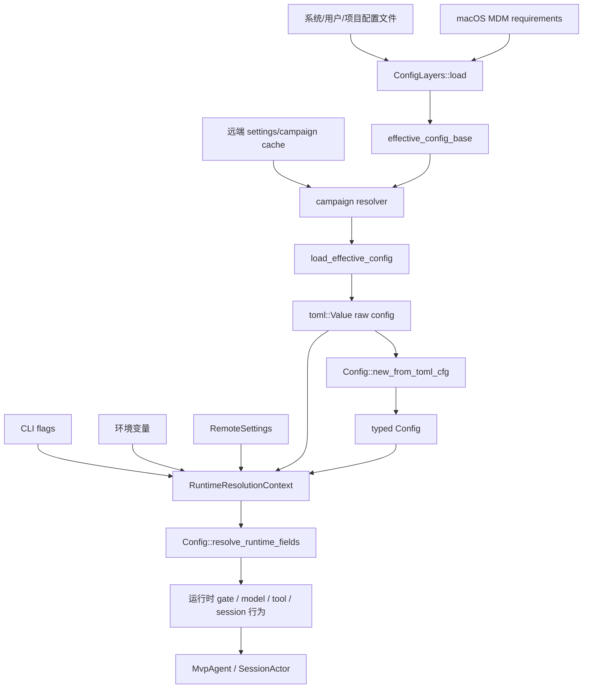
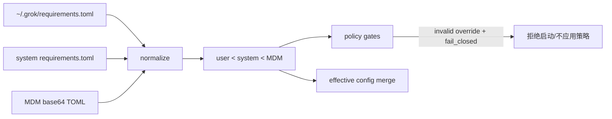
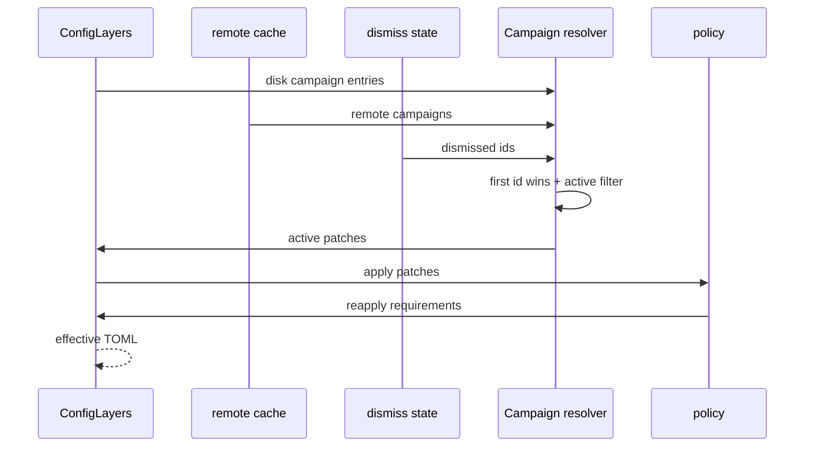
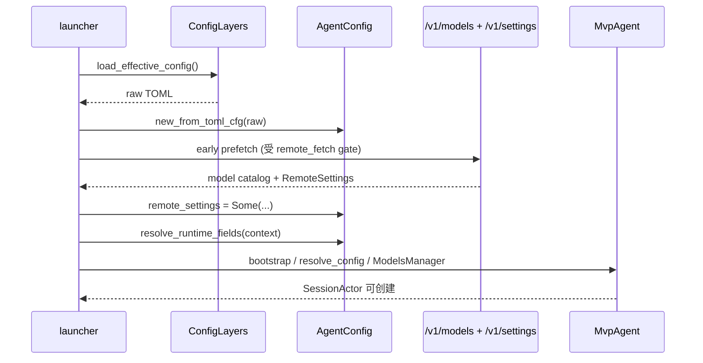

# 源码精读：配置加载、策略层与运行时生效

配置不是“读一个 `config.toml`，反序列化成一个 struct”这么简单。Grok Build 把配置拆成两个问题：

1. **哪些输入有资格进入有效配置？** 这是 `xai-grok-config` 的分层、合并和策略校验问题；
2. **一个字段在当前进程/当前会话应该取什么值？** 这是 `xai-grok-shell::agent::config` 的解析、CLI/环境变量/远端优先级和运行时重算问题。

如果只看最终的 `Config`，很容易把“用户偏好”“管理员强制策略”“服务器实验开关”和“本次启动的 CLI 参数”混为一谈。本文从 owner、数据形状和控制流三条线同时阅读，帮助贡献者判断一个新设置应该放在哪里，以及为什么改完配置文档不需要重新构建。

## 1. 总体数据流



关键点是两份配置形状同时存在：

| 形状 | 作用 | 典型 owner | 能否直接决定运行时行为 |
|---|---|---|---|
| `toml::Value` | 保留来源结构，做深度合并、版本 patch、campaign overlay | `xai-grok-config` 与 shell `util/config` | 不能；它是解析输入 |
| typed `Config` | `serde` 反序列化后的稳定字段、模型和 provider 定义 | `xai-grok-shell/src/agent/config.rs` | 部分可以 |
| `#[serde(skip)]` runtime fields | 依赖 CLI、环境、headless 状态或远端设置的派生字段 | `Config::resolve_runtime_fields` | 可以，直接被 Agent/Session 消费 |
| `RemoteSettings` | 认证后从 `/v1/settings` 得到的服务端默认/实验值 | `xai-grok-config-types` + `agent_ops` | 只有 resolver 明确接入时才可以 |

### 1.1 入口之间的关系

不要把下面三个函数当成同一个“加载配置”函数：

```text
ConfigLayers::load()
  -> 读取并规范化各层文件，拆走 campaigns

load_effective_config()
  -> ConfigLayers::effective_config_base()
  -> 解析 remote/disk campaigns 和 dismiss 状态
  -> overlay 后再次 reapply requirements

Config::new_from_toml_cfg(raw)
  -> raw alias/模型/provider/MCP 专用解析
  -> default Config + deep merge raw
  -> serde 反序列化和 unknown-key warnings
  -> 环境认证补充、静态 model override、环境覆盖

Config::resolve_runtime_fields(ctx)
  -> 只重算 runtime-only 字段
  -> 不替代上面的 layer merge，也不重新读取所有 typed 字段
```

启动代码通常在 [agent/init.rs](../../crates/codegen/xai-grok-shell/src/agent/init.rs) 和 [agent/app.rs](../../crates/codegen/xai-grok-shell/src/agent/app.rs) 之间编排这些步骤。新贡献应先确定自己修改的是“来源合并”“类型解析”还是“运行时派生”，否则测试会放错位置。

## 2. 配置层级：谁能覆盖谁

`ConfigLayers` 的字段在 [loader.rs](../../crates/codegen/xai-grok-config/src/loader.rs) 中定义。有效配置的基础合并顺序是从低到高：

```text
system managed
  -> user managed
  -> user config
  -> user requirements
  -> system requirements
  -> macOS MDM requirements
```

后层通过 `deep_merge_toml` 覆盖前层，因此表格中的顺序是“后者 wins”。换成权限语言就是：

| 层 | 常见来源 | 语义 | 信任/owner |
|---|---|---|---|
| system managed | 系统配置目录下的 `managed_config.toml` | 机器级默认/托管值 | root/部署管理员；`xai-grok-config` |
| user managed | `$GROK_HOME/managed_config.toml` | 服务端同步的托管值 | 管理服务 + 本地缓存 |
| user config | `$GROK_HOME/config.toml` | 用户偏好和自定义模型/provider | 当前用户 |
| user requirements | `$GROK_HOME/requirements.toml` | 用户域的强制要求 | 管理策略层 |
| system requirements | 系统配置目录下的 `requirements.toml` | 机器级强制要求 | root/部署管理员 |
| MDM requirements | macOS 强制偏好 `ai.x.grok:requirements_toml_base64` | OS 保护的最高强制层 | MDM 管理员 |

这里有一个容易误读的点：`managed_config.toml` 是“托管配置”，但普通字段合并时仍低于 `config.toml`；真正不可被用户偏好绕开的值应该进 `requirements.toml`。贡献者不应为了让某个开关“更强”而随意把所有 managed 字段改成特殊逻辑，应先确认它是偏好、部署默认还是硬约束。

### 2.1 配置目录和安全边界

`load_user_config_layer` 在无法解析用户 home 时返回空表，而不是读取 cwd 下的 `.grok/config.toml` 作为用户层。这是安全边界：项目目录可被仓库内容影响，不能因为 `GROK_HOME`/home 不可用就自动提升为用户策略。

项目级配置另有专门路径发现逻辑，例如 MCP 会通过 `find_project_configs(cwd)` 从 cwd 向 git root 查找；这不是全局 `ConfigLayers` 的简单第五层。阅读一个字段时要先看它的 owner 是否 global，不能看到 `.grok/config.toml` 就假定所有设置都支持项目级覆盖。

### 2.2 深度合并，不是字符串覆盖

```rust
pub fn deep_merge_toml(base: &mut toml::Value, overrides: &toml::Value) {
    if both_are_tables {
        for (key, value) in overrides {
            if existing_key {
                deep_merge_toml(existing, value);
            } else {
                insert_clone(key, value);
            }
        }
    } else {
        *base = overrides.clone();
    }
}
```

实际语义如下：

| base | override | 结果 |
|---|---|---|
| `[features.telemetry] enabled=false sample_rate=0.1` | `enabled=true` | `enabled=true`，`sample_rate=0.1` 保留 |
| `allowed=["a","b"]` | `allowed=["c"]` | `allowed=["c"]`，数组整体替换 |
| `x="old"` | `[x] child=1` | 类型不同，整个 `x` 被表替换 |
| 缺少 key | 新 key | 插入新 key |

因此数组型配置（例如某些 models、hooks 或 campaigns）不能靠“多个层拼接”来实现 additive 语义。若需要“各层都保留”，通常要看专用的 `hook_config_layers` 或 campaign merge，而不是修改 `deep_merge_toml`。

运行 [`mini_config_resolution.rs`](../rust-essentials/labs/async-demos/src/bin/mini_config_resolution.rs) 可以把 merge、runtime priority 和 Session snapshot 放在同一次实验中：

```sh
cargo run --locked \
  --manifest-path docs/rust-essentials/labs/async-demos/Cargo.toml \
  --bin mini_config_resolution
```

程序断言 object 递归合并、数组和异类型整体替换、requirement pin 覆盖普通来源、`Resolved<T>` 保留 `ConfigSource`，以及全局刷新只影响之后创建的 Session。它用 JSON 模拟 TOML 的结构合并，不覆盖环境变量展开、MDM/fail-closed、campaign 或模型目录；这些仍需对应生产 owner 的测试。

### 2.3 环境变量展开发生在什么位置

普通 `load_toml_file` 先解析 TOML，再递归调用 `expand_env_vars_in_toml`，支持 `$VAR` 和 `${VAR}`。因此：

```toml
[endpoints]
models_base_url = "${GROK_MODELS_BASE_URL}"
```

在进入 typed `Config` 前已经是字符串值。缺少变量时 `shellexpand::env_with_context_no_errors` 保留可用的原始文本，不把整个配置加载直接变成环境错误。

Hooks 是故意的例外：`hook_config_layers` 使用不展开的 `read_toml_file`，让 `${VAR}` 留给 hook runner 做一次展开，避免加载器和执行器各展开一次。修改 hooks loader 时必须保留这个“不提前展开”的契约。

## 3. Requirements、MDM 和 fail-closed

`validation.rs` 负责把 requirements 变成策略输入：

1. 读取 user、system 和 macOS MDM 三个来源；
2. 每层先执行 `[[version_overrides]]`；
3. 移除 `fail_closed` 控制字段，不让它作为普通业务配置流入 `Config`；
4. 供 `load_merged_requirements` 和 `ConfigLayers` 使用。



`requirements` 与普通 config 的区别不是“文件位置”这么简单，而是它参与安全决策。典型字段在 [resolve/features.rs](../../crates/codegen/xai-grok-shell/src/util/config/resolve/features.rs) 中明确声明为：

```text
requirements > env > user config > managed > remote settings > default
```

但每个字段是否有 env、是否允许 remote、默认值是什么，都必须以该 resolver 为准。`remote_fetch` 是重要特例：它没有 env 和 remote tier，因为远端设置本身需要先 fetch；当 requirements 或 managed 禁止远端访问时，远端不能重新打开这个开关。

在 requirements 中出现非法 `version_overrides` 时，规范化会跳过该层，并记录“admin policy NOT applied”；在启用 fail-closed 的启动校验路径上，非法策略可能导致拒绝启动。贡献者修改验证逻辑时，应同时检查“坏策略不应静默降级为普通用户偏好”的安全目标。

## 4. `version_overrides`：先在层内 patch，再跨层 merge

配置支持：

```toml
[[version_overrides]]
minimum_version = "1.7.0"
maximum_version = "1.9.999"

[version_overrides.features]
new_tool = true
```

`version_overrides.rs` 的处理规则：

1. 先取出并删除整个 `version_overrides` 数组；
2. 预先解析全部 semver 边界，任何非法边界都返回错误；
3. 按 `minimum_version` 升序稳定排序；
4. 对当前安装版本匹配的 patch 逐个深度合并；同一版本的后声明项覆盖先声明项；
5. 即使没有命中，section 也不会泄漏给后续 serde。

这意味着版本 patch 的作用域是“它所在的层”：

```text
managed layer:  [version_overrides] -> managed patch
user layer:     [version_overrides] -> user patch
requirements:   [version_overrides] -> requirement patch
                              ↓
                       deep merge by layer priority
```

不能先把所有原始文件合成一个 TOML 再统一执行 overrides，否则会改变“哪个来源拥有 patch”的优先级，也会让非法用户 patch 影响管理员层的读取结果。

## 5. Campaign：软 overlay，不是管理员策略

`[[campaigns]]` 也会在 layer load 时从 TOML 中取出，但它不是直接参与基础 merge。它有自己的 priority：

```text
requirements > remote > user > managed > system managed
```

同一个 campaign id 采用 first-id-wins；活动 campaign 去掉 `campaigns_state.json` 中已 dismiss 的 id 后，patch 按低优先级到高优先级应用。应用完后 `ConfigLayers::reapply_requirements` 再覆盖一遍 requirements，保证远端或用户 campaign 不能改管理员强制字段。



远端 campaign cache 是进程级缓存；`None` settings 不会清空已有 cache，明确返回空数组才表示服务端撤回 campaigns。用户在 `/model` 等设置中持久化某个被 campaign 影响的路径时，系统会记录 dismiss，避免每次启动重新弹出同一实验。

调试 campaign 时要区分两个入口：

- `xai_grok_config::load_effective_config_disk_only`：只看磁盘 campaign，适合不 fetch remote 的一次性命令；
- shell `util::config::load_effective_config`：看远端缓存、dismiss 和 `GROK_CAMPAIGNS_OVERRIDE`，是交互 Agent 的主路径。

## 6. `Config::new_from_toml_cfg` 做了哪些事

`new_from_toml_cfg` 的输入是已经完成 layer/campaign 处理的 `toml::Value`，但它仍不是简单的 `toml::from_str`。

### 6.1 先处理专用 namespace

函数先复制 `[auth]` 到 `[grok_com_config]` 的 alias；当两者都存在时，显式的 `[grok_com_config]` 字段优先。随后单独解析：

| namespace | 专用解析原因 |
|---|---|
| `model.*` | 需要把配置模型转换成 `ModelEntry`，校验 glob 和模型字段 |
| `auth_provider.*` | 建立命名凭据 provider，并生成引用警告 |
| `model_providers.*` | 建立 custom endpoint/provider，处理 inline auth 的保留命名空间 |
| `mcp_servers.*` | 交给 MCP config parser，支持 transport/setup/OAuth 和兼容来源 |
| 其余表 | 与 `Config::default()` 深度合并后由 serde 反序列化 |

代码先从 `Config::default()` 序列化出 base，再移除默认中不应被通用 serde 消费的 `model`。原始配置中的 model/provider/MCP sections 也暂时移除，避免它们被“重复解析”；最后再把专用解析结果写回 `config`。

### 6.2 unknown key 警告是有来源过滤的

`serde_ignored::deserialize` 会报告所有未被 struct 消费的路径，但 `Config::deserialize_collecting_unrecognized` 只保留那些顶层 key 确实出现在用户 raw config 的路径，并排除 `NON_SERDE_CONFIG_PATHS`。

这避免了一个常见假阳性：`Config::default()` 序列化出来的内部/兼容字段本来就没有 serde 目标，不能把它们归咎于用户。最终警告会进入 `config.config_warnings`，并通过 `log_config_warnings` 记录。

贡献者新增配置字段时，至少要回答：

1. 它是否应该是 `Config` 的 serde 字段，还是 `#[serde(skip)]` runtime field？
2. 如果是专用 section，是否需要在 `new_from_toml_cfg` 之前移除并单独解析？
3. 未识别/类型错误是整份配置失败，还是字段级 tolerant warning？

### 6.3 环境值只补齐特定字段

`new_from_toml_cfg` 结束时会补充 OIDC/OAuth 环境配置、默认 client version，并调用 `apply_env_overrides()`。这不是“所有环境变量自动覆盖所有 TOML”；每个字段的 env 规则写在自己的 resolver 中。比如 model provider 的 env credential 和 feature flag 的 env 都有独立的安全语义。

## 7. Runtime resolution：第二阶段的优先级

`RuntimeResolutionContext` 把启动器传入的动态信息集中起来：

| 输入 | 例子 | 生命周期 |
|---|---|---|
| raw config | 当前 `load_effective_config()` 结果 | 可热刷新 |
| remote settings | `/v1/settings` 成功响应 | 认证后可刷新 |
| CLI | `--subagents`、model override、`--no-memory` | 启动时固定，存回 Config 供 refresh 使用 |
| mode | TUI/headless/stdio 等 | Agent 实例级 |
| session flags | todo gate、debug log | 进程/会话级，不能写回 TOML |

`resolve_runtime_fields` 不是一个统一的“remote 最后覆盖”函数。它为每类字段选择不同 resolver。常见优先级如下：

| 字段/功能 | 实际优先级（高 -> 低） | 代码入口 |
|---|---|---|
| subagent enabled | `GROK_SUBAGENTS` -> CLI -> `[subagents].enabled` -> remote/default（具体 enable resolver） | `SubagentsConfig::resolve` |
| subagent depth/concurrency | 对应 env -> `[subagents]` -> remote -> clamp/default | `resolve_max_*` |
| model override | CLI -> env/config -> remote -> catalog/default | `ModelOverrideConfig::resolve` |
| memory | `--no-memory`/CLI -> env/config -> remote -> default | `MemoryConfig::resolve` |
| compatibility cell | env -> `[compat]` -> remote -> default ON | `resolve_compat_config` |
| auto wake | `GROK_AUTO_WAKE` -> `[features].auto_wake` -> remote -> true | `BoolFlag` chain |
| compaction mode/detail | env -> config -> remote -> default | `resolve_compaction_*_from` |
| storage mode | CLI/env -> remote（且受 auth/mode gate） -> Local | `StorageMode::resolve` + `reapply_storage_mode` |
| remote fetch gate | requirements -> managed -> user -> true；无 env/remote | `resolve_remote_fetch_enabled` |

对某个布尔 feature，常见链式代码形态是：

```rust
BoolFlag::env("GROK_AUTO_WAKE")
    .config(self.features.auto_wake)
    .feature_flag(remote.and_then(|r| r.auto_wake_enabled))
    .default(true)
    .resolve()
```

`Resolved<T>` 同时保留 value 和 `ConfigSource`，这很重要：设置 UI、诊断和 policy log 不只需要知道“结果是 true”，还要知道它是 env、config、managed、requirements、remote 还是 default。新增 resolver 时应尽量复用 `BoolFlag`/`Resolved`，而不是写一个只返回 bool 的局部 if 链。

### 7.1 requirement pin 会在 runtime 阶段再钳制

`Config` 反序列化后含有 typed `Requirements`，例如 telemetry、web fetch、write file、sandbox profile、respect gitignore 等。`resolve_runtime_fields` 对 `respect_gitignore` 先检查 `self.requirements.respect_gitignore.pinned()`，只有未 pin 时才采用 `ToolsConfig::resolve`。

这说明“effective TOML 已经合并”还不是安全决策的全部证据：强制字段可能需要在 typed/runtime resolver 再次约束。贡献者添加可被管理员固定的 feature 时，要同时修改 requirements 映射、运行时 gate 和来源诊断，而不是只在 `Features` 加一个 serde 字段。

### 7.2 headless 不是一个普通配置值

一些 resolver 根据 `ctx.is_headless` 选择默认值，例如 managed MCP gateway 或无头模式的工具集。headless 是启动器传入的上下文，不应写成 TOML 的默认值。测试要覆盖 interactive 与 headless 两个分支，否则 CI/ACP 与 TUI 的行为可能悄悄分叉。

## 8. 启动时序：远端设置为什么在 config 之后

启动过程可按以下顺序阅读：



`agent/init.rs::bootstrap` 还会在 managed-policy gate 前做 settings-only 预取，防止在线同步先“修复”本地被篡改的 fail-closed 策略。通过 gate 后才允许完整 managed-config sync。这个顺序是安全不变量，不应为了让启动更短而调换。

## 9. 运行时刷新：什么会变，什么不会变

远端 settings 有两个重要应用路径：

### 9.1 一般 settings arrival

`MvpAgent::store_remote_settings` 写入 `cfg.remote_settings`，同步 campaign 字段和 `path_not_found_hints`；`on_remote_settings_changed` 再执行 remote side effects、storage/marketplace gate、模型目录更新、通知客户端和 heap monitor。

这个路径不会自动重跑所有 `#[serde(skip)]` 字段。源码注释明确指出，`worktree_type`、`restore_code` 等 Agent-level 启动字段不在这里重解析；贡献者不能看到 settings 更新就假设全局行为即时改变。

### 9.2 `/new` 的 settings re-apply

`refresh_settings_and_reapply` 在远端刷新后重新读取有效 TOML，并调用 `cfg.re_resolve_runtime_fields(&raw_config)`。它复用 Config 中已保存的 CLI tri-state、memory flags、model overrides 和 session flags，然后把新 remote settings 重新送入每个 resolver。

```text
remote refresh
  -> store_remote_settings
  -> sync_campaign_fields
  -> load_effective_config (fresh disk + cache)
  -> re_resolve_runtime_fields
  -> sync collection gate / settings notification
```

刷新任务有 `in_flight` coalescing 和 timeout；多个 `/new` 不会无限并发 fetch。已经创建的 in-flight SessionActor 使用创建时的 config snapshot，不会被中途的全局 config 替换。这是会话可重复性的必要条件，也解释了为什么“设置已更新但当前 turn 未变”可能是预期行为。

### 9.3 文件热加载不是全量重启

`ConfigReloader` 监听 auth、global config、project MCP 和 models cache，按事件批处理后发 `ConfigUpdate`。global config 变更通常重建相关 config/model/MCP；坏文件会保留 last-known-good，而不是清空运行中的配置。新增热加载字段时要决定它属于：

- 需要 `ConfigUpdate` 的动态字段；
- 下一个 Agent/session 才读取的字段；
- 只在进程启动时解析的字段。

## 10. 用一个字段追踪完整优先级

以 `auto_wake` 为例：

```toml
[features]
auto_wake = false
```

```text
1. ConfigLayers 把 requirements/managed/user 等层合成 raw TOML；
2. new_from_toml_cfg 把 [features] 反序列化到 Config.features；
3. resolve_runtime_fields 读取 GROK_AUTO_WAKE；
4. 若 env 未设置，读取 Config.features.auto_wake；
5. 若仍无值，读取 RemoteSettings.auto_wake_enabled；
6. 若仍无值，使用 default(true)；
7. BoolFlag 返回 value + ConfigSource；
8. MvpAgent/Session 使用 Config.auto_wake_enabled，而不是重新读 TOML。
```

若 `GROK_AUTO_WAKE=0`，远端 true 不能覆盖；若 TOML 没写、远端为 false，则 false 生效；若 requirements pin 了该字段，resolver 必须在更高层阻断。这个例子可以作为阅读其它 feature 的模板，但不能把 `auto_wake` 的优先级机械复制给 `storage_mode` 或 `remote_fetch`。

## 11. 开发/贡献时的定位方法

### 11.1 新增一个设置

先写一张小表，再动代码：

| 问题 | 必须决定的答案 |
|---|---|
| owner 是谁？ | `xai-grok-config`、`agent/config.rs`、某个 `util/config/resolve/*.rs`，还是 Agent/session |
| 需要哪种来源？ | user、managed、requirements、env、CLI、remote、default |
| 是偏好还是硬策略？ | 能否被用户覆盖、能否被 campaign 覆盖、是否 fail-closed |
| 是静态还是 runtime-only？ | 是否需要 `#[serde(skip)]` 和 `RuntimeResolutionContext` |
| 什么时候生效？ | 启动、文件 watcher、下一个 `/new`、下一个 turn，还是只对新 session |
| 如何诊断？ | `Resolved<T>::source`、`ConfigWarning`、policy log 或 ACP settings update |

然后沿着同类设置寻找纯函数 resolver 和测试。已有 resolver/tests 比在 `MvpAgent` 里临时增加 if 分支更可靠。

### 11.2 调试一个“配置不生效”问题

按这条证据链检查：

```text
文件是否真的被哪个 path loader 读取？
  -> version_overrides 是否已应用/被拒绝？
  -> 该 key 是否在 effective TOML？
  -> new_from_toml_cfg 是否生成 warning？
  -> runtime resolver 是否有更高优先级 env/CLI？
  -> requirements 是否 pin/钳制？
  -> remote settings 是否尚未 fetch 或刷新？
  -> 当前 session 是否已经 snapshot 旧 Config？
```

不要只在 TUI 里重复改文件并重启。优先构造最小 `toml::Value`，调用纯 resolver，断言 value 和 source；再补一条最小 runtime/session 测试。

### 11.3 适合的测试层级

| 改动 | 首选证据 | 是否需要构建整个项目 |
|---|---|---|
| 优先级纯函数 | `agent/config.rs` 或 `util/config/resolve` 单元测试 | 不需要；只改文档时更不需要 |
| TOML 层 merge | `xai-grok-config` loader tests | 不需要全 workspace build |
| remote refresh | `config/tests.rs`、`mvp_agent/tests.rs` | focused test 即可 |
| Session snapshot | session spawn/turn fixture | focused integration/e2e |
| 文档/导航 | `git diff --check`、链接和 code fence 检查 | 不构建 |

这里的“不要随意构建”是工程判断，不是降低验证标准：配置文档只改 Markdown 时，Cargo 构建不会增加证据，反而会制造无关产物和等待。只有 Rust owner 或可执行行为改变时，才按 [09-contributor-playbook.md](../09-contributor-playbook.md) 选择最小验证。

## 12. 推荐源码阅读顺序

1. [xai-grok-config/src/loader.rs](../../crates/codegen/xai-grok-config/src/loader.rs)：`ConfigLayers::load`、`effective_config_base`、`deep_merge_toml`；
2. [xai-grok-config/src/validation.rs](../../crates/codegen/xai-grok-config/src/validation.rs)：requirements、MDM、fail-closed；
3. [xai-grok-config/src/version_overrides.rs](../../crates/codegen/xai-grok-config/src/version_overrides.rs)：semver patch；
4. [xai-grok-config/src/campaigns.rs](../../crates/codegen/xai-grok-config/src/campaigns.rs)：remote/disk campaign overlay；
5. [agent/config.rs](../../crates/codegen/xai-grok-shell/src/agent/config.rs)：`new_from_toml_cfg`、`RuntimeResolutionContext`、`resolve_runtime_fields`；
6. [util/config/resolve/features.rs](../../crates/codegen/xai-grok-shell/src/util/config/resolve/features.rs)：策略 feature 的例外；
7. [agent/init.rs](../../crates/codegen/xai-grok-shell/src/agent/init.rs)：bootstrap 顺序；
8. [agent/mvp_agent/agent_ops.rs](../../crates/codegen/xai-grok-shell/src/agent/mvp_agent/agent_ops.rs)：settings refresh 和 re-resolve；
9. [config/reloader.rs](../../crates/codegen/xai-grok-shell/src/config/reloader.rs)：文件 watcher 到动态更新消息。

## 13. 贡献练习：添加一个可解释的 feature gate

选择一个尚未覆盖的布尔开关，完成以下最小项目：

1. 在 `ConfigLayers`/requirements 中定义它是否是硬策略；
2. 在 typed config 中保留“未设置”和 `false` 的区别（必要时使用 `Option<bool>`）；
3. 用 `BoolFlag` 或同等纯 resolver 实现来源顺序；
4. 返回 `Resolved<bool>`，让诊断可以显示 source；
5. 在启动和 settings refresh 两条路径接入；
6. 加入 env/config/managed/requirements/remote/default 的冲突测试；
7. 加入 headless 与 interactive 的默认测试；
8. 在本专题或 `13-contribution-projects.md` 记录生效时机和“不重新解析”的例外。

完成后用一次真实源码追踪回答：

```text
如果用户把 config.toml 的值从 false 改成 true，
当前 session、下一个 /new、重启进程分别何时看到 true？
```

能准确回答这三个时间点，通常就已经掌握了该 feature 的配置 owner、Agent runtime 和 session 生命周期边界。
