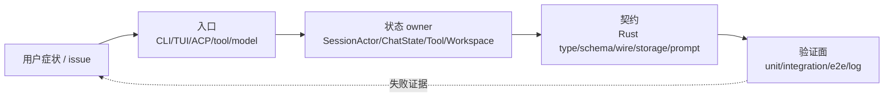
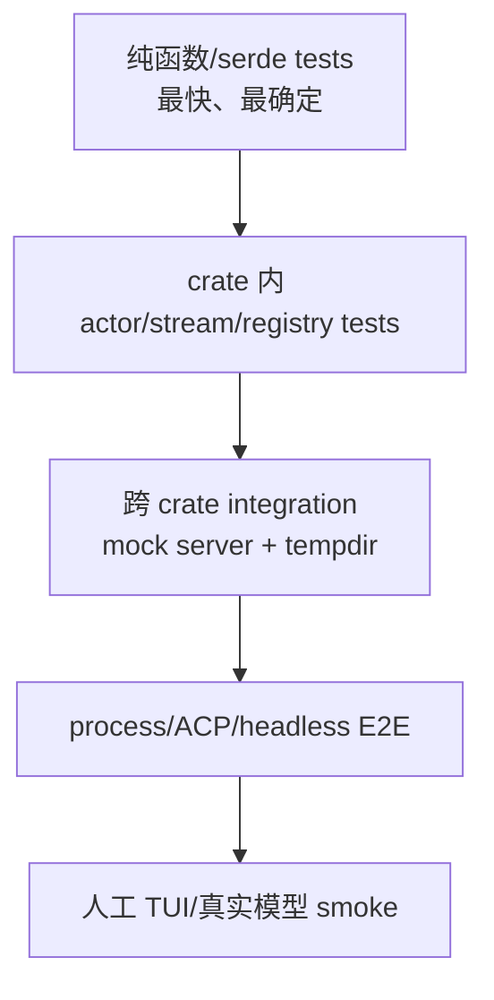
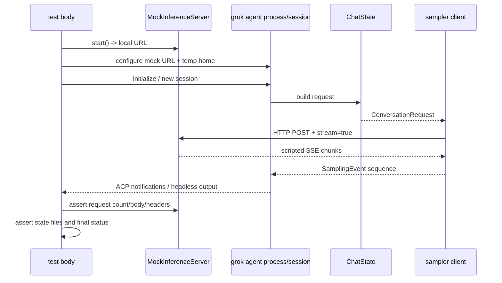
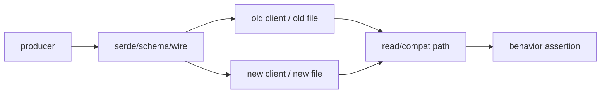

# 贡献者工作流：从症状、owner 到可审查证据

这篇专题把“我想修一个行为”拆成仓库里可执行的步骤。重点不是背 Cargo 命令，而是建立一条能被别人复核的证据链：**哪个入口触发、哪个 owner 改状态、哪个测试证明边界、哪个日志能在失败时定位。**

它补充 [09-contributor-playbook.md](../09-contributor-playbook.md) 的原则，尤其展开真实测试目录、mock inference server、异步 actor 测试和协议兼容检查。

## 1. 先画 ownership，而不是先改文件



### 1.1 五个定位问题

在编辑器里打开文件前写下：

| 问题 | 必须给出的具体答案 |
| --- | --- |
| 入口是什么？ | 一个 CLI flag、ACP method、TUI action、模型 tool call 或后台事件 |
| 状态 owner 是谁？ | `SessionActor`、`ChatStateActor`、Tool runtime、workspace tracker 还是 storage actor |
| 契约在哪里？ | Rust enum/trait、Serde JSON、ACP/MCP frame、prompt placeholder 或 JSONL 文件 |
| 最小可观察结果是什么？ | 某个 event、conversation item、wire payload、文件内容、exit code 或 UI block |
| 失败时如何收集证据？ | request/session/tool ID、tracing span、mock server 请求、临时目录快照 |

如果其中一项只能回答“可能在某个 session 文件”，说明还没有找到 owner。大型 Agent 的常见 bug 不是算法错，而是把派生显示状态误当成权威状态修改。

## 2. 按症状选择第一处源码

| 症状 | 先读 | 再读 | 典型测试 |
| --- | --- | --- | --- |
| prompt 没进入模型 | `pager` input / ACP request | `session/acp_session_impl/prompt_build.rs`、`turn.rs` | `load_user_prompts_tests.rs`、`test_built_binary_e2e.rs` |
| 工具不可发现或名字错 | `xai-grok-agent` builder | ToolBridge/registry/schema | Agent prompt tests、registry tests |
| 工具执行后模型没继续 | `tool_calls.rs` | ChatState mutation/request builder | `parallel_dispatch_tests.rs`、tool pipeline tests |
| session 历史恢复异常 | `session/storage/*` | `ChatState` restore/repair | storage tests、`trace_replay.rs` |
| stream 少 chunk/顺序错 | sampler stream transform | `handle_sampling_event`、ReplayBuffer | `replay_buffer_send_update_tests.rs`、sampler actor tests |
| 401 重复或错误重试 | `sampler/retry.rs` | shell `sampler_turn.rs` auth gate | `auth_error_no_retry_tests.rs`、`auth_retry_budget_tests.rs` |
| context 400 循环失败 | sampler error classification | `compaction.rs`、`handle_sampling_failure` | inline auto-compact tests、context tests |
| 权限/沙箱绕过 | tool dispatch | workspace permission/sandbox | permission matrix、sandbox integration |
| ACP client 兼容失败 | wire adapter | `mvp_agent` / protocol crate | stdio/integration tests |
| 只在 TUI 观感错 | Pager render model | `xai-grok-pager-render` | snapshot/PTY harness |

沿依赖方向读：底层类型定义约束实现，上层负责把实现接入产品。不要把一个上层现象的修复硬塞进最容易打开的 UI 文件。

## 3. 测试金字塔在仓库里的真实形状



### 3.1 纯函数和类型测试

适合放在实现旁边的 `#[cfg(test)]` 模块：

- JSON/Serde round-trip、旧字段默认值；
- `ToolKind`、name override 和 schema 变换；
- retry 分类、backoff、token/prune 选择；
- ACP/xAI update 到内部 enum 的纯映射；
- `filter_rewind_updates`、prompt collector 等无 I/O 算法。

这层的断言应描述边界，而不是只断言“返回 Ok”。例如 retry 测试要明确 401 不重试、429 在阈值后终止，不能只验证 500 重试一次。

### 3.2 crate 内异步/Actor 测试

常见结构是 `tokio::test` + channel + mock backend：

- `xai-grok-sampler/tests/test_actor.rs` 测试 `SamplerActor` 的 active count、并发 request、取消、500 retry、429 阈值和 401 不重试；
- `xai-grok-shell/src/session/acp_session_tests/` 按主题拆分 session tests，再由 `acp_session.rs` 挂载；
- `xai-chat-state/src/persistence.rs` 使用 mock persistence channel 观察 actor 发出的 record；
- `xai-grok-agent/src/prompt/context.rs` 测试不同 audience、tool present/absent 和 prompt size。

这些测试的价值在于不启动完整二进制，却仍能验证 mailbox 顺序、取消边界和事件终态。

### 3.3 跨 crate integration

`xai-grok-test-support` 提供共享测试基础设施：

| 文件 | 能力 |
| --- | --- |
| `mock_server.rs` | 用本地 HTTP server 模拟 inference/settings/storage 端点 |
| `sse.rs` | 构造可控 SSE stream 和事件序列 |
| `counting_server.rs` | 记录请求次数，验证是否发生了错误重试 |
| `headless.rs` | 启动 headless/ACP 流程并收集结果 |
| `acp_client.rs` | 发送 ACP 请求、等待 session notification |
| `sandbox.rs` | 临时 workspace、Git、权限和 mock URL 组合 |
| `env.rs` | 隔离环境变量与测试 home/state 目录 |
| `scripted.rs` | 用脚本化响应驱动重复 turn |

这些设施让测试可以同时证明“代码接线”与“wire 结果”，但仍不需要真实 API key 或外网。

### 3.4 进程级 E2E

`xai-grok-shell/tests/test_built_binary_e2e.rs` 展示最完整的路径：mock model catalog → 启动 grok/stdio → 发送 prompt → 收到 inference request → SSE parse → response render → 进程退出。它还覆盖 streaming JSON、structured output、usage 和 session close 等入口。

进程测试适合验证 composition root、环境变量和协议接线，不适合替代每个纯函数测试。失败时优先读取 stderr、请求日志和临时 state 目录，而不是立即放大到 workspace 全量构建。

## 4. 一个 mock inference turn 的完整结构



### 4.1 测试 fixture 应该控制什么

一个可靠的 fixture 至少固定：

- backend 类型（Chat Completions、Responses 或 Messages）；
- 模型名和返回的 metadata/context window；
- SSE chunk 顺序、finish reason、usage；
- 是否有 tool call delta、错误和重试响应；
- state/home/cwd 的临时路径；
- 认证和权限决策是否是 fake 或 auto-approved。

不要在一个测试里同时依赖真实网络、真实用户 home、真实模型行为和 wall-clock sleep。那样失败时无法判断是哪一层变了。

### 4.2 断言三类结果

```text
wire 结果：请求 method/path/header/body 是否正确
runtime 结果：event 顺序、tool dispatch、ChatState mutation
product 结果：ACP/headless 输出、退出状态、持久化文件
```

只断言最终文本可能漏掉“请求发了两次”“工具 schema 不对但模型碰巧回答了”“session 没有落盘”等问题；只断言 HTTP body 又可能漏掉 UI/actor 竞态。跨层测试应有至少一个每类断言。

## 5. 异步测试：避免把时间当作同步信号

### 5.1 `tokio::test` 与 `LocalSet`

仓库中部分 session 使用 `spawn_local`、`Rc` 或 actor-local state，因此测试需要 `current_thread` runtime 与 `LocalSet`。看到这种结构时，不要随意改成多线程 runtime 以“让测试通过”；这可能掩盖真实的 non-Send ownership 约束。

```rust
#[tokio::test(flavor = "current_thread")]
async fn deterministic_session_case() {
    let local = tokio::task::LocalSet::new();
    local
        .run_until(async {
            // spawn_local actor, send command, await observable ack
        })
        .await;
}
```

### 5.2 用 ack、channel 和 request count 取代 sleep

不稳定：

```rust
tokio::time::sleep(Duration::from_millis(100)).await;
assert!(state.is_done());
```

可靠：

```rust
let response = tokio::time::timeout(Duration::from_secs(5), done_rx)
    .await
    .expect("actor should finish before timeout")
    .expect("completion sender should remain alive");
assert_eq!(response.status, ExpectedStatus::Completed);
```

对 HTTP retry 使用 `counting_server` 或可控响应队列；对 actor 使用 `oneshot`/`mpsc`；对 shutdown 使用明确的 flush/close ack。sleep 只能用于你正在验证 timer 本身的测试，而且应使用 paused time 或小而明确的时钟断言。

### 5.3 取消安全

每次 `.await` 都可能是取消点。测试取消时应同时检查：

1. 取消信号确实发送给 owner（例如 `Cancel(request_id)`）；
2. 后台 task 不再发送后续终态/工具调用；
3. actor mailbox、oneshot receiver 和临时资源没有泄漏；
4. conversation 不留下 dangling tool call，或下一个写边界能修复它；
5. shutdown 仍能 flush persistence/replay buffer。

`cancel_running_task_tests.rs`、sampler `test_actor.rs` 和 `turn_completion_emit_tests.rs` 是理解这些边界的好入口。

## 6. 日志和可观测性：报告一条可重放时间线

### 6.1 最小关联字段

```text
session_id
turn/prompt index
sampler request_id
tool call id / tool name
event type + attempt
model/base URL（必要时脱敏）
```

Session、sampler、tool 和 storage 已分别有 tracing/unified log。新增日志时优先复用现有 span，不要把完整 prompt、API key、OAuth token 或大段工具输出写进日志。

### 6.2 用事件顺序描述问题

```text
StreamStarted
  -> FirstToken
  -> ChannelToken(Text)
  -> ToolCallDelta*
  -> Retrying? / Completed / Failed
  -> stream drain ack
  -> ChatState mutation
```

例如“工具先于文字出现”应报告为 event/notification 的相对顺序和是否触发 drain timeout，而不是只写“模型输出错了”。“第二次请求不该发生”应同时给出 request count、retry kind 和触发它的 status/header。

### 6.3 脱敏边界

问题报告可以保留路径结构、长度、hash、ID 和错误类型，但要脱敏：

- API key、Bearer/JWT、cookie；
- 私有源码、用户完整 prompt、MCP secret；
- tool 输出中的 token、个人数据、远程 URL query secret。

保留“是否为空、字节数、行数、哪一类事件”通常足以复现控制流。

## 7. 协议和持久化变更的审查方法



### 7.1 兼容性检查表

- 新字段是否可选、带 `serde(default)` 或被明确版本保护？
- 旧二进制读取新文件时，会跳过未知字段还是直接失败？
- 新二进制读取旧文件时，缺失字段是否有合理默认？
- ACP/MCP/Tool Protocol 的 wire tag 是否与内部 enum 变体一一对应？
- `updates.jsonl` / `chat_history.jsonl` 是否需要迁移、rebuild 或 torn-tail 容忍？
- plugins、external clients、subagent fork 是否依赖旧工具名或 prompt placeholder？
- 失败后的 rollback 是继续读取旧值、跳过单条记录，还是明确终止？

不要只运行当前 Rust 单元测试就宣布协议安全；必须为旧 payload、未知字段、缺字段和错误格式补 fixture。

### 7.2 契约变更的最小提交形状

跨 crate 变更建议拆成可审查的逻辑层：

```text
1. shared type / serde compatibility
2. producer implementation
3. consumer/adapter wiring
4. focused tests and docs
```

如果只能一个提交，也要在 commit message 或说明里写清“哪个 consumer 尚未迁移”。不要同时大规模格式化、升级依赖和修改行为，让 reviewer 无法判断真正的兼容变化。

## 8. 选择验证命令，而不是盲目构建

| 改动范围 | 优先验证 | 不需要的动作 |
| --- | --- | --- |
| 只有 Markdown/源码路径说明 | `git diff --check`、相对链接/路径检查 | 不需要 Cargo build/check/test |
| 纯函数、serde、prompt renderer | 目标 crate 的过滤测试 | 不必先全 workspace build |
| sampler stream/retry | sampler unit + `tests/test_actor.rs` | 不必启动真实 TUI |
| ChatState/persistence | chat-state tests + storage focused tests | 不必先跑真实模型 |
| Session/ACP wiring | 对应 `acp_session_tests` 或 headless fixture | 不必先跑所有平台 E2E |
| workspace root、共享协议、构建配置 | 依赖闭包 check/test，再扩大范围 | 不要只凭一个局部 test 宣布完成 |

命令的输出范围就是证据范围：`cargo check -p xai-grok-agent` 只证明该 crate 的编译依赖闭包，不证明模型行为、TUI、旧 session 或远程 client。文档修改不应触发无关构建，避免制造 target 生成物和无意义的反馈噪声。

## 9. 一份可直接使用的 bug/patch 记录模板

```text
问题：用户做了什么，实际看到什么？
入口：CLI/TUI/ACP/tool/model event 的具体入口。
环境：OS、模式（TUI/headless/stdio）、backend、是否 resume/fork。
配置：Agent、tools、permission、MCP/skills（脱敏）。
时间线：按 session_id/turn/request/tool ID 列出关键事件。
权威状态：哪一个 actor/file 在变化？预期值和实际值是什么？
复现：最小命令、fixture、临时目录或 mock server 响应序列。
修改：为什么 owner 在这里，哪些替代路径被排除？
验证：每一条命令证明哪一层，哪些层尚未覆盖？
兼容性：旧 payload/session/client 是否仍可读？
残余风险：真实网络、平台、TUI 或权限体验还缺什么？
```

这个模板既适合 issue，也适合 commit/PR 描述。它迫使贡献者把 Agent 语义、Rust ownership 和产品协议放在同一份证据里。

## 10. 90 分钟贡献练习

选一个低风险行为，例如让一个 sampler error message 携带更多结构化字段，或给已有 prompt renderer 增加“tool absent”测试：

1. 用 `rg` 找到用户可见入口和当前测试；
2. 画出 3-5 个节点的 owner/contract 图；
3. 先补一个当前失败的 focused assertion；
4. 修改最底层 owner，不在上层复制状态；
5. 使用 mock/fixture/ack 而非 wall-clock sleep；
6. 运行与改动匹配的最小 test/check；
7. `git diff --check`，检查生成物、secret 和无关格式化；
8. 写出上面的 bug/patch 记录，并说明未覆盖的 E2E 层。

完成这套练习的标志不是“全仓库测试绿”，而是你能解释每个失败可能来自哪一层，并给出下一条最有信息量的命令。

## 11. 源码索引

| 主题 | 入口 |
| --- | --- |
| 通用贡献原则 | `docs/09-contributor-playbook.md` |
| sampler actor + mock HTTP | `crates/codegen/xai-grok-sampler/tests/test_actor.rs` |
| 测试基础设施总览 | `crates/codegen/xai-grok-test-support/src/lib.rs` |
| mock inference/settings server | `crates/codegen/xai-grok-test-support/src/mock_server.rs` |
| SSE fixture | `crates/codegen/xai-grok-test-support/src/sse.rs` |
| 临时 sandbox/Git/mock URL | `crates/codegen/xai-grok-test-support/src/sandbox.rs` |
| ACP/headless client | `crates/codegen/xai-grok-test-support/src/acp_client.rs`、`headless.rs` |
| session 主题测试 | `crates/codegen/xai-grok-shell/src/session/acp_session_tests/` |
| 进程级完整路径 | `crates/codegen/xai-grok-shell/tests/test_built_binary_e2e.rs` |
| prompt context 测试 | `crates/codegen/xai-grok-agent/src/prompt/context.rs` tests |
| 持久化/replay 测试 | `crates/codegen/xai-grok-shell/tests/trace_replay.rs`、storage tests |

真正的贡献能力来自可重复的闭环：**找到 owner → 写出最小行为断言 → 用受控异步/协议 fixture 验证 → 记录兼容和残余风险**。这比一次未经解释的全量构建更能帮助 reviewer 判断改动是否安全。
