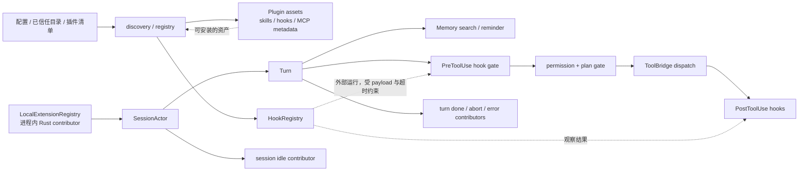
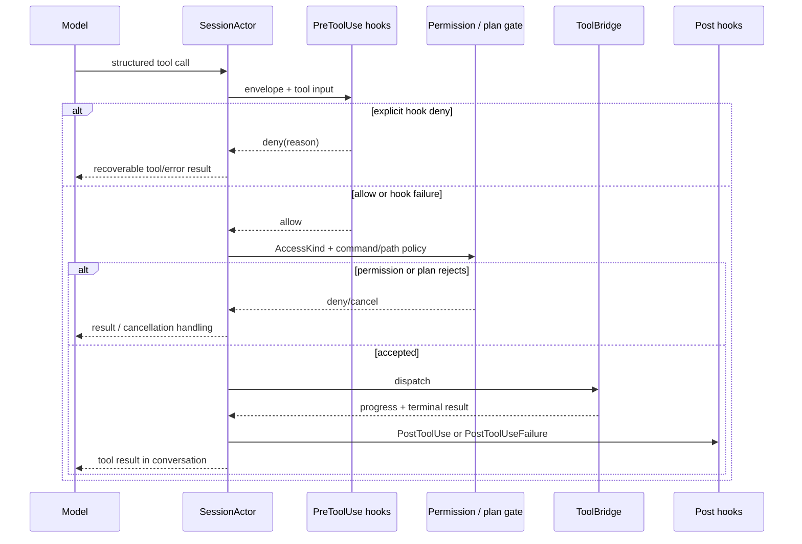
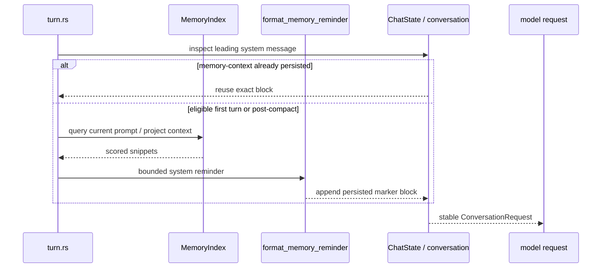

# 源码精读：扩展运行时如何接入 Turn，而不夺走 Session 控制权

Grok Build 的“扩展”不是一个统一的 plugin API。它至少包含五条边界不同的路径：

- **lifecycle contributor**：随二进制编译、在进程内运行的 Rust 扩展；
- **hook**：从配置发现、作为独立命令或 HTTP 调用执行的用户/项目扩展；
- **plugin**：一套可发现、安装、信任和注册的资产，可携带 skill、hook、MCP 等内容；
- **skill / rule**：主要改变模型看见的说明和工作流，不直接接管 Rust 控制流；
- **memory**：跨 session 的检索和存储能力，在明确位置生成模型可见的 reminder。

把它们混成“插件会在任意时刻改 Agent”会导致错误设计。真正的不变量是：**`SessionActor` 仍然拥有 session、turn、permission、tool dispatch 与持久化的决定权；扩展只能通过已定义的输入、事件或 capability 边界影响它。**

## 1. 总览：五种扩展的边界



| 机制 | 主要解决的问题 | 可以影响什么 | 不能替代什么 |
|---|---|---|---|
| lifecycle contributor | 在明确生命周期点附加产品能力 | 接收 turn/session 数据；通过安装时注入的 capability 做异步工作 | SessionActor 的 event loop、turn 终止和状态所有权 |
| hook | 在工具、turn、session 事件上观察或施加有限 gate | `PreToolUse` 显式 deny；Stop 类事件的继续决策；其他事件的日志/通知 | sandbox、permission、ToolBridge schema、任意 Rust 内存状态 |
| plugin | 分发一组扩展资产并记录来源/信任 | 提供 skill、hook 配置、MCP/元数据等可被宿主加载的内容 | 绕过 discovery、trust、registry 或 tool allowlist |
| skill / rule | 给模型任务知识、操作步骤或局部约束 | 最终 prompt 与可发现性 | 直接注册一个可执行工具或跳过权限 |
| memory | 在未来会话中检索有价值的历史知识 | system-reminder 形式的模型上下文；受控写入与索引 | 当前 conversation 的权威历史或 session audit log |

这张表也是修改时的第一道分流：如果需求是“模型应该知道什么”，优先检查 prompt/skill/memory；如果需求是“模型调用前能否拒绝动作”，检查 hook 与 permission；如果需求是“宿主收到 turn 状态后做什么”，检查 lifecycle contributor；如果需求是“给用户安装一套能力”，检查 plugin registry。

## 2. 生命周期 contributor：数据进来，能力在安装时注入

`xai-agent-lifecycle` 是 host-agnostic crate。它把扩展接口定义成**数据输入**和**安装时注入的能力**，而不是把 `SessionActor` 或 mutable conversation 暴露给扩展。

| Trait | 宿主调用时机 | 输入的关键事实 | 合适的用途 |
|---|---|---|---|
| `TurnLifecycleContributor` | turn start / done / abort / error | synthetic、abort reason、error message | 计数、通知、清理、异步外部同步 |
| `TurnInputContributor` | host 的 sampling chokepoint | stable `turn_id`、synthetic | 返回本轮可见的 `TurnInputFragment` |
| `SessionLifecycleContributor` | session 进入 idle | session 已无 running turn 或队列工作 | idle notification、延迟后台维护 |
| `CommandContributor` | 宿主解析到扩展声明的 slash command | 已解析的命令名和参数 | `Rewrite` model-visible 文本或执行受控 side effect |

源码中的 trait 特意很窄：

```rust
#[async_trait]
pub trait TurnLifecycleContributor: Send + Sync {
    async fn on_turn_start(&self, input: &TurnStartInput) {}
    async fn on_turn_done(&self, input: &TurnDoneInput) {}
    async fn on_turn_abort(&self, input: &TurnAbortInput) {}
    async fn on_turn_error(&self, input: &TurnErrorInput<'_>) {}
}
```

它没有 `&mut SessionActor`、没有直接的 `Conversation`，也没有“替换 loop”回调。这不是限制功能，而是所有权设计：扩展能被审查，Session 的复杂状态机仍由一个 owner 串行化。

### 2.1 `Send` 与 `Local` 两套 registry

普通 `ExtensionRegistry` 保存 `Send + Sync` contributor，适合多线程 host。Grok Build 的 session 使用 `spawn_local` 和 `LocalSet`，因此还使用 `LocalExtensionRegistry` 与 `Local*Contributor`；它们允许依赖 `Rc` 等 `!Send` 的 UI/session-local 状态。

```text
可跨线程 host      -> ExtensionRegistry / TurnLifecycleContributor: Send + Sync
Grok session LocalSet -> LocalExtensionRegistry / LocalTurnLifecycleContributor: ?Send
```

`local/contributors/turn_lifecycle.rs` 为同时满足 `Send + Sync` 的实现提供 bridge，所以能跨 host 的实现不必复制两份逻辑。反过来，依赖 `Rc<RefCell<_>>` 的实现不能被错误地安装到多线程 registry。

### 2.2 注册顺序就是 dispatch 顺序

`ExtensionRegistryBuilder` 收集 contributor，`build()` 后产生不可变 registry。Session 构造时的 [`session_extension_registry`](../../crates/codegen/xai-grok-shell/src/session/acp_session_impl/extensions.rs) 将其冻结；注释明确指出“registration order is dispatch order”。

因此：

- 两个 contributor 对同一外部系统产生副作用时，顺序是行为契约，应写测试；
- 不要在 callback 中递归创建新的 Session 或直接重入 `handle_prompt`；
- contributor 持有 `Weak<SessionActor>` 时，session 已结束应是 no-op，不能因为扩展还活着而延长 session 生命周期；
- 长耗时动作应由扩展自身管理，不要把 actor 的可变借用、锁或临时 guard 跨越无界 `.await`。

当前内置的 `idle_prompt` 展示了正确形状：它把通知发到一个 host-owned sink；sink 用 `Weak<SessionActor>` 升级后再 `spawn_local` 投递，而非让 contributor 直接修改 actor 字段。

源码入口：

- [`xai-agent-lifecycle/src/lib.rs`](../../crates/codegen/xai-agent-lifecycle/src/lib.rs)
- [`send/contributors`](../../crates/codegen/xai-agent-lifecycle/src/send/contributors)
- [`local/contributors`](../../crates/codegen/xai-agent-lifecycle/src/local/contributors)
- [`send/registry.rs`](../../crates/codegen/xai-agent-lifecycle/src/send/registry.rs)
- [`extensions.rs`](../../crates/codegen/xai-grok-shell/src/session/acp_session_impl/extensions.rs)

## 3. Hook：外部可配置的事件 rail，不是内部控制流替身

`xai-grok-hooks` 发现 JSON hook 定义，将标准化事件 envelope 交给 command 或 HTTP runner，再把结果收集回宿主。它适合项目策略、审计、通知或与外部系统集成，前提是明确区分**gate**与**observe**。

### 3.1 事件名、别名和 gate 类型

[`event.rs`](../../crates/codegen/xai-grok-hooks/src/event.rs) 将每个事件声明为三元组：`GateKind`、matcher policy、是否转发给 hub。常见事件包括：

| 事件 | 类型 | 语义 |
|---|---|---|
| `SessionStart` / `SessionEnd` | Observe | session 边界的观测/记录 |
| `UserPromptSubmit` | Observe | prompt 提交前的通知；matcher 不参与决定 |
| `PreToolUse` | Tool gate | 匹配的 hook 顺序运行；显式 deny 可以阻止工具执行 |
| `PostToolUse` / `PostToolUseFailure` | Observe | 成功和失败是互斥的事后事件，不能再撤回执行 |
| `PermissionDenied` | Observe | 记录 permission 的最终拒绝 |
| `Stop` / `SubagentStop` | Stop gate | 可提供额外上下文、阻塞继续或要求停止 |
| `StopFailure` | Observe | API 错误结束 turn 的事件 |
| `PreCompact` / `PostCompact` | Observe | 长上下文压缩边界 |
| `Notification` | Observe | host 产生的用户注意力事件 |

事件解析接受兼容别名，例如 `beforeShellExecution` 归入 `PreToolUse`；`SubagentEnd` 会 canonicalize 为 `SubagentStop`，避免同一 hook 被双重分发。新增事件必须同时审查解析、serialization、matcher、hub forwarding 和 session 触发点，不能只改 enum。

### 3.2 `PreToolUse` 与 permission 是两道不同的门

真正的工具路径应按如下理解：



这里有四个容易混淆的事实：

1. `PreToolUse` 是在 dispatch **之前**；它不是文件/命令 sandbox 的替身。
2. hook **显式** `deny` 会阻止 call；runner timeout、command crash、找不到命令和 malformed output 默认是 fail-open，并被记录为 hook failure。不要把这种运行失败误报成安全拒绝。
3. permission / plan gate 仍会独立检查 `AccessKind`、路径、命令和当前模式。hook allow 不授权，hook deny 也不应伪装成用户在 permission UI 中点击 deny。
4. 成功只发 `PostToolUse`，失败只发 `PostToolUseFailure`。这是一条一次性事件不变量，`client_hooks_tests.rs` 明确测试它。

Session 侧的 [`hook_dispatch.rs`](../../crates/codegen/xai-grok-shell/src/session/acp_session_impl/hook_dispatch.rs) 负责构造 context、发执行通知和 telemetry，并把 hook 的结果映射回 turn/tool 语义；不要在工具实现内部各自启动 hook，否则会产生顺序、payload 和重试语义漂移。

### 3.3 配置、信任和 payload 边界

hook 可来自用户目录、已信任项目目录、插件 adapter 或 client 注册。项目级 hook 需要 folder trust；`hooks_plugins.rs` 中的 Trust/Untrust 操作会 reload hooks，并重新计算同样受信任边界影响的 project MCP 配置。

交给外部 hook 的是 `HookEventEnvelope`：session id、cwd、workspace root、prompt id、permission mode 和事件 payload。tool input/result 会被限制大小（`MAX_PAYLOAD_SIZE`），文档和日志还必须自行避免 API key、cookie、私有源码和大段 terminal 输出泄漏。

一个安全的 hook 改动至少回答：

```text
谁能发现并启用它？项目目录是否要求 trust？
它是 gate 还是 observer？失败时是否允许正常工作继续？
传给子进程/HTTP 的数据是否最小且已脱敏？
它的超时、取消和 child-process 清理由谁拥有？
```

源码入口：

- [`xai-grok-hooks/src/discovery.rs`](../../crates/codegen/xai-grok-hooks/src/discovery.rs)
- [`xai-grok-hooks/src/event.rs`](../../crates/codegen/xai-grok-hooks/src/event.rs)
- [`xai-grok-hooks/src/dispatcher.rs`](../../crates/codegen/xai-grok-hooks/src/dispatcher.rs)
- [`xai-grok-hooks/src/runner`](../../crates/codegen/xai-grok-hooks/src/runner)
- [`session/acp_session/hooks.rs`](../../crates/codegen/xai-grok-shell/src/session/acp_session/hooks.rs)
- [`tool_calls.rs`](../../crates/codegen/xai-grok-shell/src/session/acp_session_impl/tool_calls.rs)

## 4. Plugin：资产发现、来源标记和宿主加载，不是裸代码注入

`xai-grok-agent/src/plugins/` 的职责是发现候选插件、读取 manifest、管理安装来源与信任，并建立 `PluginRegistry`。registry 是“哪些 plugin 已加载”的单一事实来源；它保存 id、scope、origin、manifest 元数据和关联 asset 的索引。

```text
目录 / marketplace / git install
  -> discovery + manifest parse
  -> trust / install registry
  -> PluginRegistry（当前已加载的 plugin）
  -> skill discovery、hook adapter、MCP/其他宿主接线
  -> AgentBuilder / Session 的最终有效能力
```

**plugin 被发现或安装，不等于它的每种能力已在当前 session 生效。** 仍需分别确认：

- 对应 skill 是否满足 discovery/scope/audience 条件，因而进入 prompt；
- plugin 提供的 hook 是否被 adapter 解析、过滤不支持的 event、标为 `HookProvenance::Plugin` 并进入 HookRegistry；
- MCP 配置是否实际建立连接、完成 `tools/list` 并注册到 `ToolBridge`；
- Agent allowlist/denylist、权限和 plan mode 是否让最终 tool schema 对模型可见。

[`hooks_adapter.rs`](../../crates/codegen/xai-grok-agent/src/plugins/hooks_adapter.rs) 是一个很好的边界示例：它为 plugin hook 注入 `GROK_PLUGIN_ROOT` / data path，令 plugin-owned 环境键覆盖用户声明值，并在 load 时剔除当前 hook parser 不接受的 event。这样 plugin manifest 中的“有一个 hook 文件”不会绕过 host 的事件模型或路径解析。

修改 plugin 系统时，重点保护：

- **provenance**：UI、日志、trust 与优先级必须能区分用户、项目、managed、plugin；
- **scope**：用户级、项目级和 marketplace 来源不能简单合并；
- **reload**：reload 应产生一致的新 registry/snapshot，旧资源关闭和新资源注册不能交错；
- **compatibility**：manifest、安装记录和 enabled/disabled 状态是跨版本磁盘契约。

源码入口：

- [`plugins/discovery.rs`](../../crates/codegen/xai-grok-agent/src/plugins/discovery.rs)
- [`plugins/manifest.rs`](../../crates/codegen/xai-grok-agent/src/plugins/manifest.rs)
- [`plugins/registry.rs`](../../crates/codegen/xai-grok-agent/src/plugins/registry.rs)
- [`plugins/hooks_adapter.rs`](../../crates/codegen/xai-grok-agent/src/plugins/hooks_adapter.rs)
- [`plugins/local_refresh.rs`](../../crates/codegen/xai-grok-agent/src/plugins/local_refresh.rs)
- [MCP 生命周期](./mcp-lifecycle.md) 与 [Prompt 装配](./prompt-assembly.md)

## 5. Skill：模型可见的工作流，和可执行能力分开验证

skill 通常是让模型发现一套任务知识、约束或调用步骤的资产。它会影响 `PromptContext`、首轮 preamble 或 model-visible reminder，因此属于**prompt 面**。它不自动授予文件、网络或 shell 能力。

判断 skill 改动正确与否，至少验证三个不同问题：

| 问题 | 检查的 owner |
|---|---|
| 模型能否看到 skill 的描述/入口？ | agent discovery、`PromptContext`、`PromptAudience` |
| skill 说明的工具是否真的在本 session 注册？ | `ToolBridge`、tool definitions、MCP 状态 |
| 工具执行是否仍经权限和 sandbox？ | SessionActor、workspace permission、plan gate |

因此“在模板里写了调用 `foo` 工具”不是新增 `foo`；“注册了 schema”也不保证模型知道何时用它。两条路径必须在最终 `ConversationRequest` 汇合。详见 [Prompt 装配](./prompt-assembly.md) 和 [工具调用管线](./tool-call-pipeline.md)。

## 6. Memory：跨会话知识，不是 conversation 的第二权威源

memory 的 core engine 位于 `xai-grok-memory`，session shim 只保留与 shell/sampling/compaction 强耦合的 glue。它由 `--experimental-memory` 或 `GROK_MEMORY=1` 启用；禁用时 host 不初始化该能力。

### 6.1 存储和索引分层

```text
~/.grok/memory/
  MEMORY.md                         全局、人工可编辑的知识
  {project-slug}-{hash8}/
    MEMORY.md                       workspace 知识
    sessions/YYYY-MM-DD-...md       session 摘要/日志
    index.sqlite                    chunk / embedding 索引
```

`MemoryStorage` 将 global、workspace 和 session source 分开；临时 cwd 的 workspace 写入会被标记为 ephemeral 并跳过。Markdown 是人可读的事实载体，SQLite/vector index 是检索加速结构，二者不能当成同一份权威数据。

### 6.2 哪些时候进入模型上下文

session 在首轮或 compaction 后根据当前输入检索相关 memory；结果经 `format_memory_reminder` 格式化成带 `<memory-context>` 标记的 system-reminder。每段 snippet 有大小上限，含 score、source、文件位置与 staleness 提示。

一个重要的 cache 不变量是：若 leading system message 已有这个标记，`conversation_has_memory_context` 会复用原 block，不重新搜索。原因不是节省一次查询而已：重新排序/打分会改变 system prompt 前缀，从而破坏 downstream KV cache，也会让同一 conversation 在无新输入时不可复现。



memory flush/dream 还会把长期会话信息整理为 Markdown；此流程应有质量过滤、去重和 token 阈值，不能把每条 transient progress 或用户密钥写进长期 memory。`memory_flush.rs` 中的 prompt 和 `process_flush_response` 是审查这种路径的入口。

### 6.3 Memory 与 compaction / persistence 的区别

| 数据 | owner / 目的 | 对当前 turn 的地位 |
|---|---|---|
| ChatState conversation | 当前 session 的权威对话历史 | 构造请求的主输入；可 compact/prune |
| `updates.jsonl` | durable replay/audit 事件 | 恢复和客户端 replay 的证据 |
| memory Markdown | 跨 session 的长期知识 | 检索后作为有界 reminder 注入 |
| memory index | chunk/embedding 查询加速 | 可由文件重新索引；不能单独充当审计事实 |

源码入口：

- [`xai-grok-memory/src/lib.rs`](../../crates/codegen/xai-grok-memory/src/lib.rs)
- [`storage.rs`](../../crates/codegen/xai-grok-memory/src/storage.rs)
- [`index.rs`](../../crates/codegen/xai-grok-memory/src/index.rs)
- [`search.rs`](../../crates/codegen/xai-grok-memory/src/search.rs)
- [`memory_context.rs`](../../crates/codegen/xai-grok-shell/src/session/helpers/memory_context.rs)
- [`memory_flush.rs`](../../crates/codegen/xai-grok-shell/src/session/helpers/memory_flush.rs)

## 7. 一次 turn 中扩展的时间线

下面是普通用户 turn 的简化时序。每个扩展点都故意落在 host 拥有的明确边界上：

```text
SessionActor 收到 Prompt
  -> 生命周期 contributor: on_turn_start
  -> 解析 prompt / skill / project rules
  -> memory 搜索或复用已持久化的 memory-context
  -> ChatState 构造 ConversationRequest
  -> sampling / model stream
  -> 模型要求 tool call
      -> PreToolUse hooks（可能显式 deny）
      -> permission + plan gate
      -> ToolBridge dispatch
      -> PostToolUse 或 PostToolUseFailure hooks
      -> tool result 写回 ChatState
      -> 再次 sampling
  -> 结束：on_turn_done / on_turn_abort / on_turn_error
  -> session 空闲时：on_session_idle
```

注意不是每个 turn 都走所有分支：没有 tool call 就没有 tool hooks；memory 若不启用、不命中或已存在 marker 就不查询；Stop/subagent hooks 只在相应结束分支触发。不要以“一个 hook 没收到事件”推断整个 session loop 没有运行。

## 可运行缩小实验

先运行 [`mini_extension_lifecycle.rs`](../rust-essentials/labs/async-demos/src/bin/mini_extension_lifecycle.rs)，再追真实 hook runner：

```sh
cargo run --locked \
  --manifest-path docs/rust-essentials/labs/async-demos/Cargo.toml \
  --bin mini_extension_lifecycle
```

程序固定验证 contributor 按注册顺序 dispatch；explicit hook deny 会阻止 permission/dispatch；hook runner failure 默认 fail-open；hook allow 仍必须经过 permission；成功与工具失败只触发各自互斥的 post event。运行前写出每个场景的事件序列，再把差异映射到 `TurnLifecycleContributor`、`PreToolUse`、permission gate、ToolBridge 和 post hook fire point。

## 8. 贡献时按问题选择 owner

| 想改变的行为 | 首先读 | 需要同时审查 |
|---|---|---|
| 增加一个进程内 idle/turn 通知 | `xai-agent-lifecycle` trait 与 session extension registry | LocalSet/`Send`、注册顺序、弱引用与取消 |
| 让工具调用前增加项目策略 | hook event/dispatcher + session `tool_calls.rs` | folder trust、fail-open 行为、permission/sandbox 仍独立 |
| 增加一个 hook event | `event.rs` table | alias、Serde wire、matcher、hub forwarding、payload、所有 fire point 与 client fixture |
| 调整 plugin 提供的 hook/skill | plugin manifest/discovery/registry + adapter | provenance、path/env expansion、reload、最终 prompt/tool 可见性 |
| 改 memory 搜索或注入格式 | `xai-grok-memory` search/index + `memory_context.rs` | marker idempotency、KV-cache 稳定性、snippet/token budget、隐私 |
| 改 session 长期摘要/flush | `memory_flush.rs` + storage | 质量过滤、semantic dedup、ephemeral workspace、写失败/重试 |

### 最小测试面

| 改动 | 优先测试 |
|---|---|
| lifecycle trait/registry | registry 的 dispatch-order 和 Local/Send bridge 测试 |
| hook event / gate | `xai-grok-hooks` dispatcher tests + shell `client_hooks_tests.rs` |
| plugin discovery/manifest | `xai-grok-agent` plugin module tests，至少覆盖来源/disabled/unsupported event |
| memory format / storage | `memory_context.rs` unit tests + `xai-grok-memory` storage/search tests |
| 跨 session 接线 | shell `acp_session_tests/memory_config_tests.rs` 或受控 headless fixture |

文档改动本身只需 `git diff --check` 和链接检查；当改动 Rust、hook wire 或 manifest schema 时，再按以上 owner 选择最小测试。不要因为一个 Markdown 文档变更触发 workspace 构建。

## 9. 阅读练习

1. 从 `TurnLifecycleContributor` 跟到 `turn.rs` 的 `on_turn_start` 和结束分支，说明为什么 contributor 不能直接结束 turn。
2. 从 `PreToolUse` 的 `HookEventName` 跟到 `tool_calls.rs`，画出 explicit deny、hook runner failure、permission deny 三种结果分别返回给谁。
3. 让一个 plugin hook 的事件名无效，跟踪它在哪一层被过滤并如何变成 warning；确认它不会进入 runtime dispatch。
4. 在 `memory_context.rs` 找到 marker guard，解释为什么“每次都重新检索 memory”会改变同一 conversation 的请求前缀。
5. 为一个新的扩展需求写一句 owner 判断：它是 lifecycle、hook、plugin asset、skill，还是 memory？写出为什么其它四种机制不适合。

完成这些练习后，再阅读 [贡献者工作流](./contributor-workflow.md)，你应能为扩展改动给出明确的 owner、契约、风险和最小验证面。
