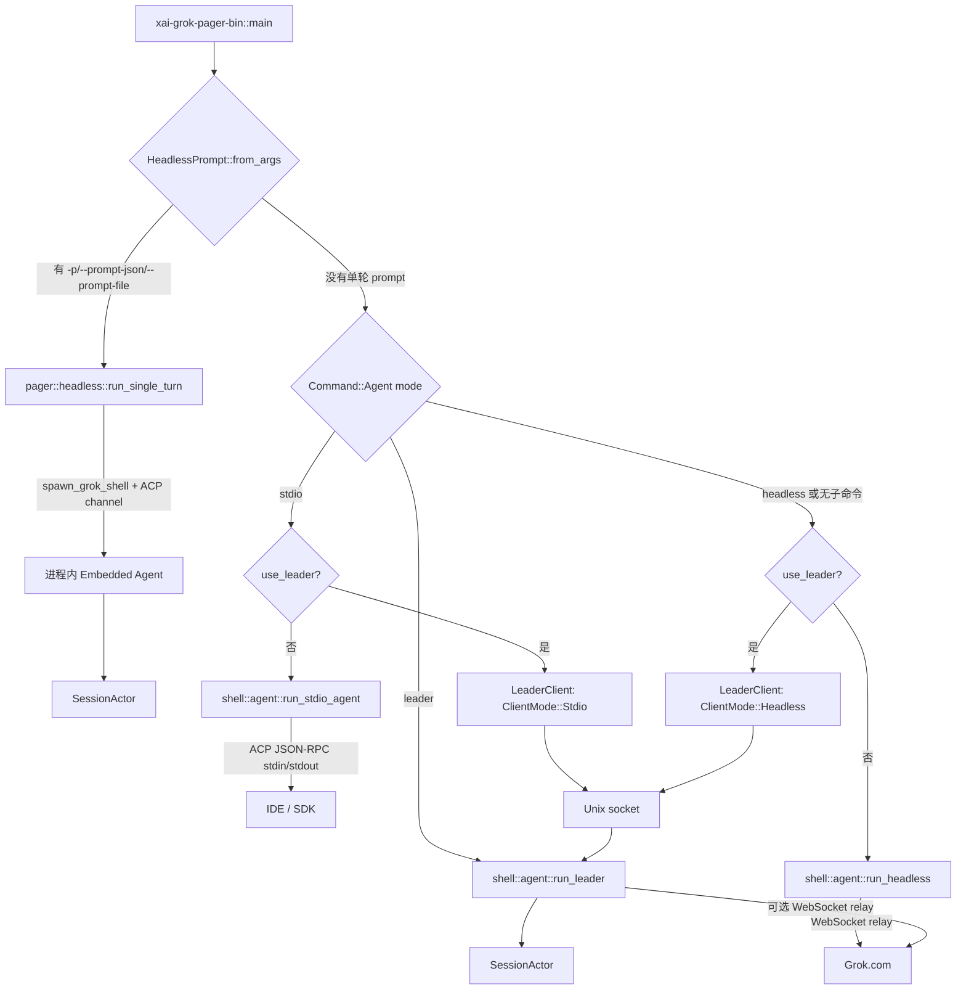
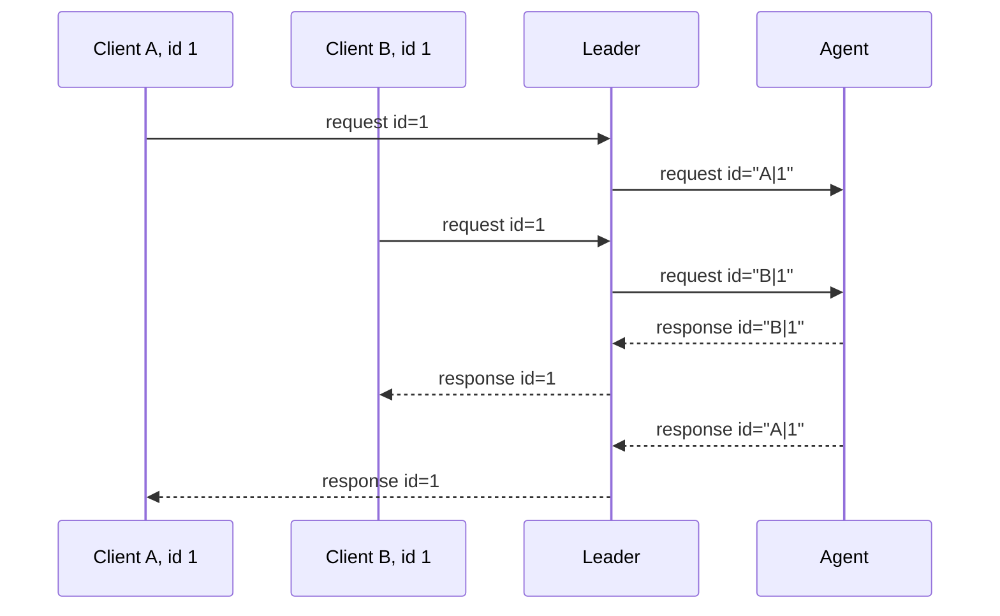

# 宿主模式与运行入口精读

本文回答一个很容易误判的问题：`grok`、`grok -p`、`grok agent headless`、`grok agent stdio` 和 `grok agent leader` 到底是不是同一个入口？

答案是：它们最终复用 `SessionActor`、采样器和工具桥，但**进程所有权、传输协议、鉴权来源、输出契约和退出条件都不同**。开发新入口或排查“消息没有到达”的问题时，必须先判断自己位于哪一条路径。

## 1. 先看总分流图



图中最重要的分界是顶部的 `HeadlessPrompt::from_args`：单轮 `grok -p` 在普通 Agent 子命令分流之前就返回，因此它不会进入 `run_agent_command`，也不会因为 `use_leader` 配置而自动改走 Leader。

## 2. 五种模式的契约

| 命令 | 真实函数 | 核心传输 | stdout 是否为协议 | 鉴权/连接 | 退出条件 |
|---|---|---|---|---|---|
| `grok` | pager app 的交互入口 | 进程内 ACP client，或可选 Leader | TUI 输出 | 由当前宿主处理 | TUI 退出 |
| `grok -p "..."` | `xai_grok_pager::headless::run_single_turn` | 进程内 ACP channel | 否；是 plain/JSON/流式 JSON 结果 | 可用 API key 或 session | Prompt 完成、后台任务收敛或取消 |
| `grok agent stdio` | `xai_grok_shell::agent::run_stdio_agent` | stdin/stdout ACP JSON-RPC | **是，必须保持纯净** | 可走 API key | stdin EOF、连接结束或父进程死亡 |
| `grok agent headless` | `xai_grok_shell::agent::run_headless` | Grok WebSocket relay + ACP simplex | relay/agent 内部使用；不是一次性结果 CLI | 要求 grok.com session | 取消；WebSocket 断线本身不结束 Agent |
| `grok agent leader` | `xai_grok_shell::agent::run_leader` | Unix socket + 可选 WebSocket relay | socket 上转发 ACP | session 可选；BYOK 先只服务 IPC | 策略允许时最后客户端断开，或显式关闭 |

`grok agent headless` 的 `headless` 是宿主模式名称，不等于 `grok -p` 的单轮输出模式。前者是长期运行的远程 relay agent，后者是 pager 进程内的“一次 prompt 驱动器”。

## 3. `grok -p`：Pager 内的单轮 ACP 驱动器

### 3.1 入口为什么不走 `run_headless`

`xai-grok-pager-bin/src/main.rs` 先调用：

```rust
let headless_prompt = HeadlessPrompt::from_args(
    args.single.as_deref(),
    args.prompt_json.as_deref(),
    args.prompt_file.as_deref(),
)?;

if let Some(prompt) = headless_prompt {
    return xai_grok_pager::headless::run_single_turn(prompt, ...).await;
}
```

这段 `return` 是架构上的关键。`-p` 的用途是把 pager 当作一个可脚本化的客户端：它自己创建 shell、通过 ACP 请求完成一次 session/prompt，然后把 ACP 更新折叠为用户指定的输出格式。它不是远端 agent 的守护进程，也不需要通过 Grok WebSocket relay 注册为在线 Agent。

### 3.2 `run_single_turn` 的阶段

源码 [`xai-grok-pager/src/headless.rs`](../../crates/codegen/xai-grok-pager/src/headless.rs) 的生命周期可以按下面的 owner 划分：

```text
run_single_turn
  1. 解析 cwd、模型、rules、权限、agent 和输出格式
  2. spawn_grok_shell(...)                 -> 新的 shell/SessionActor
  3. acp_send(Initialize)                  -> 初始化能力与鉴权方法
  4. authenticate(...)                     -> API key 或网页登录/设备流
  5. materialize_startup_for_cwd(...)      -> new / resume / fork 意图
  6. open_session(...)                     -> 得到 session_id 和模型目录
  7. apply_headless_model_and_effort(...)  -> 设置模型/推理努力度
  8. acp_send(PromptRequest)               -> 进入正常 Agent Loop
  9. select!(ACP update, PromptResponse, background timeout)
 10. drain/reap background tasks           -> flush 日志、注销 active session
 11. HeadlessEmitter::on_end/on_error      -> 生成最终 stdout
```

`spawn_grok_shell` 返回 ACP channel 和线程句柄；`AgentShutdownGuard` 将 `CancellationToken` 与线程生命周期绑定。也就是说，单轮模式并没有另写一套采样/工具循环，而是把真实的 ACP client 生命周期跑在同一进程里。

### 3.3 输出格式是产品契约，不是 ACP 协议

`HeadlessEmitter` 按 `OutputFormat` 处理相同的 ACP 更新：

```text
plain                  文本增量直接写 stdout；生命周期/错误写 stderr
json                   缓冲文本，结束时写一个结果对象
streaming-json         每个 reducer 事件输出一行 NDJSON
streaming-messages-json
                       输出消息事件；可选 include_partial_messages
```

`json` 的终态对象至少包含 `text`、`stopReason`、`sessionId`、`requestId`，并可能附带 usage、thought 和 schema 校验后的 structured output。stdout 写入遇到 BrokenPipe 会被视为正常停止；其他 I/O 错误会记住并以失败返回。

因此脚本应只解析 stdout，诊断信息应看 stderr/unified log。不要把 `grok -p` 的 JSON 与 `session/update` ACP JSON-RPC 混用。

### 3.4 背景任务为什么会延迟退出

`PromptResponse` 到达不一定意味着所有后台子任务已完成。循环会先把 ACP channel 中已经排队的 `task_backgrounded` / `task_completed` 消息排空；默认 `wait_for_background=true`，直到 pending 集合为空或超时。关闭前还会做一次最终 drain，仍未完成的任务通过 `reap_pending_background_tasks` 取消。

这个顺序解释了两个常见现象：

1. 模型已经给出答案，但 `grok -p` 还没有退出；它可能正在等后台搜索或子代理的完成事件。
2. 下游提前关闭 stdout 时，单轮循环会停止继续写输出，但仍尝试清理任务和 flush 日志。

## 4. `grok agent stdio`：IDE 的协议子进程

### 4.1 stdout 是唯一的 ACP 线

`run_stdio_agent` 把 `tokio::io::stdout()` 交给 `AgentSideConnection`，stdin 由专用 OS 线程逐行读入，再写入 simplex。simplex 的作用不是“多一个队列”这么简单：skills watcher 等内部事件也要注入同一条 ACP 输入流，因此它可以保证内部消息不会插入客户端 JSON 行的中间。

```text
stdin reader thread ─┐
                     ├─> simplex ─> AgentSideConnection ─> SessionActor
skills watcher ──────┘                         │
                                              └─> stdout (ACP JSON-RPC)
```

日志不能写 stdout。`tracing`、启动诊断和警告必须落到 stderr 或 unified log；否则 IDE 会把日志当作 JSON-RPC 帧，导致解析失败。

### 4.2 两阶段关闭

stdin EOF 后，reader 线程只发送 `stdin_closed` 信号；LocalSet 内的任务再等待约 100ms，然后关闭 simplex writer。这是为了让尚未完成的 ACP response handler 先在同一个 LocalSet 中 flush，而不是跨线程立即关闭导致响应丢失。退出后还会关闭 PTY 子进程，并给 upload queue 两秒排空时间。

stdio 子进程在启动时尝试设置 Linux `PR_SET_PDEATHSIG(SIGTERM)`：父进程（IDE、desktop 或 subagent harness）死亡时，子进程跟着退出。其他平台可能是 no-op；失败时 stdin EOF 仍是兜底清理机制。

### 4.3 经过 Leader 的 stdio

当 `resolve_leader_mode` 选中 Leader 时，`main.rs` 不调用 `run_stdio_agent`，而是：

```text
stdin -> LeaderClient(ClientMode::Stdio) -> Unix socket -> Leader -> ACP agent
stdout <- LeaderClient <- Unix socket <- Leader
```

该桥仍保持 stdout 纯净，并缓存 session ID、`session/new`/`session/load` 等关键 ACP 状态。Leader 断开后使用 bounded reconnect；重连成功会先 replay ACP state，再发送 `x.ai/leader_reconnected`。客户端桥设置 parent-death 语义，Leader 本身不设置。

## 5. `grok agent headless`：长期 Relay Agent

### 5.1 鉴权和 transport 约束

shell 的 `run_headless` 明确把 AgentMode 设置为 `Headless`，并设置 headless process client mode。它的唯一 transport 是 Grok WebSocket relay，因此源码使用固定错误文案拒绝没有 grok.com session 的启动：

```text
Headless mode requires a grok.com session.
Run `grok login` to sign in, or use `grok agent stdio` for API-key access.
```

这不是说 headless Agent 永远不能调用 API，而是说该宿主必须先通过 relay 注册和接收远端控制；`grok agent stdio` 才是支持 BYOK/API-key 的本地 ACP 入口。

### 5.2 WebSocket 与 Agent 解耦

`run_headless` 建立两条桥：

```text
WebSocket -> ws_to_agent_rx -> acp_incoming simplex -> AgentSideConnection
AgentSideConnection -> acp_outgoing simplex -> agent_to_ws_tx -> WebSocket
```

Agent 在 `LocalSet` 中长期运行。relay 断开时，发送到 `agent_to_ws_tx` 但没有活动连接的消息会被丢弃；这不是数据丢失契约，因为 SessionActor 已将会话与更新持久化，客户端重新连接时通过 `session/load` replay。开发 relay 时，不能把“发送失败”误判为“turn 失败”；要同时检查 durable session 和 replay。

首次连接可能通过 stderr 打印 Grok Build URL，并等待用户按 Enter 打开浏览器。这是人机辅助登录提示，不是 stdout 协议的一部分。

## 6. Leader：长寿命 Agent Host 与客户端

### 6.1 server 启动顺序

`run_leader` 的 lock-then-socket 顺序是一个并发不变量：

```text
acquire flock
  -> 清理旧 socket / 写 pid
  -> 先 bind Unix socket，ready=false
  -> connect_or_spawn 可以发现 socket
  -> 完成 auth / model prefetch
  -> ready=true，放行 ACP 转发
  -> LocalSet 中运行 Agent、IPC bridge、WS bridge、watcher
```

socket 先出现并不代表 Agent 已经可用。ready 之前的 ACP 请求收到结构化 `leader_starting` 错误，避免客户端无限等待或把早期请求静默丢掉。

### 6.2 所有权与断线

Leader 持有 Agent、Session、Workspace 和 relay；客户端只持有 socket channel。客户端断线后：

- `no_exit_on_disconnect=false` 时，server 可以在没有客户端且没有活动工作的情况下退出；
- `--no-exit-on-disconnect` 时，Leader 继续驻留；
- 断线不等于 session 销毁，持久化和 replay 负责恢复；
- Leader 不绑定 parent-death，因为它设计为比某个 TUI/IDE client 活得更久。

### 6.3 relay 是 eager 还是 on-demand

显式 `grok agent leader` 默认 eager 连接 relay：没有本地 headless client 时，远端 prompt 仍必须能到达，等待“headless 注册”会形成鸡生蛋死锁。交互客户端自动拉起的 Leader 可传 `--relay-on-demand`，只在第一个 `ClientMode::Headless` 注册时启动 WebSocket，单纯 TUI/IDE 使用时不支付 relay 镜像成本。

## 7. 选择模式的决策树

```text
需要一次命令得到结果文件？
  ├─ 是 -> grok -p，选择 json 或 streaming-messages-json
  └─ 否
      需要 IDE/SDK 按 ACP 长期对话？
        ├─ 是 -> grok agent stdio（stdout 只能是 ACP）
        └─ 否
            需要 grok.com 远程 Agent 在线？
              ├─ 是 -> grok agent headless
              └─ 否
                  多客户端共享 session/workspace？
                    ├─ 是 -> grok agent leader 或 use_leader
                    └─ 否 -> 默认交互 TUI / 进程内 session
```

## 可运行缩小实验

[`mini_host_leader_routing.rs`](../rust-essentials/labs/async-demos/src/bin/mini_host_leader_routing.rs) 把 CLI 分流、Leader readiness 和多客户端 ID 路由放进同一个确定性模型：

```sh
cargo run --locked \
  --manifest-path docs/rust-essentials/labs/async-demos/Cargo.toml \
  --bin mini_host_leader_routing
```

程序断言 `-p` 在 command/Leader 分流前提前返回，stdio/headless/Leader 分支遵守 auth 与 ready gate，registration/capabilities 保持 per-client，数字和字符串 JSON-RPC ID 经 namespace 后都能无损恢复，client disconnect 也不会删除 shared Session。缩小模型不模拟 lock、socket、进程清理和 reconnect；这些仍需用 Leader integration fixture 验证。

## 8. 开发与调试断点

按问题选择最短源码路径：

| 症状 | 先读哪里 | 重点检查 |
|---|---|---|
| `grok -p` 没输出 | `pager/src/headless.rs` 的 `HeadlessEmitter` | output format、stdout BrokenPipe、`PromptResponse` |
| `-p` 卡在退出 | `headless.rs` 的 background drain | pending task、wait timeout、reap |
| IDE 报 JSON 解析错误 | `shell/src/agent/app.rs::run_stdio_agent` | 是否有日志写 stdout、simplex 关闭顺序 |
| stdio 子进程残留 | `run_stdio_agent` + `kill_current_process_on_parent_death` | PDEATHSIG 平台支持、stdin EOF |
| headless 显示无 session | `run_headless` 的 `HEADLESS_NO_SESSION` | auth scope、relay config、API key 误用 |
| relay 断线后消息缺失 | `agent/relay.rs` 与 session persistence/replay | 是否落盘、`session/load` 是否重放 |
| Leader 客户端连接但请求失败 | `run_leader` + `leader/server.rs` | flock、socket ready、`leader_starting` |
| Leader 没有远程 Agent | `spawn_leader_relay` | eager/on-demand、是否有 relay-eligible session |

建议给每个入口保留三类 fixture：

1. **进程 fixture**：明确 stdin/stdout/stderr、父进程退出和 socket 生命周期。
2. **协议 fixture**：用固定 ACP JSON 行验证 initialize、session/new、prompt、update、reconnect。
3. **持久化 fixture**：在 relay/client 断线后读取 session 文件，确认重连 replay 而不是依赖内存缓存。

## 9. 相关源码

- [`xai-grok-pager-bin/src/main.rs`](../../crates/codegen/xai-grok-pager-bin/src/main.rs)：顶层 prompt 检测、Leader client 转发、Agent 子命令分流。
- [`xai-grok-pager/src/headless.rs`](../../crates/codegen/xai-grok-pager/src/headless.rs)：单轮 `-p` 驱动器、输出 reducer、后台任务 drain。
- [`xai-grok-pager/src/app/cli.rs`](../../crates/codegen/xai-grok-pager/src/app/cli.rs)：`AgentCmd`、Headless/Leader 参数定义。
- [`xai-grok-shell/src/agent/app.rs`](../../crates/codegen/xai-grok-shell/src/agent/app.rs)：stdio、relay headless、Leader host 的 composition root。
- [`xai-grok-shell/src/agent/relay.rs`](../../crates/codegen/xai-grok-shell/src/agent/relay.rs)：WebSocket reconnect、401 recovery、cancel 和消息桥。
- [`xai-grok-shell/src/leader/client.rs`](../../crates/codegen/xai-grok-shell/src/leader/client.rs)：注册、bounded reconnect、ACP replay。
- [`xai-grok-shell/src/leader/server.rs`](../../crates/codegen/xai-grok-shell/src/leader/server.rs)：socket/lock、ready gate、client mode、session route。

## 10. Composition root：为什么宿主差异不能藏进一个布尔开关

五种模式共享 Agent 内核，却没有共享同一种资源所有权。入口函数首先是 composition root：它决定创建哪些对象、谁负责关闭它们，以及哪些对象可以活过一次 client 连接。

| 宿主 | Agent owner | client connection owner | session owner | durable state owner |
|---|---|---|---|---|
| pager TUI / `-p` | pager 进程中的 agent worker | pager 自己 | worker 内的 `MvpAgent` | session storage |
| stdio | IDE 拉起的子进程 | stdin/stdout 生命周期 | stdio Agent | session storage |
| relay headless | 长期 shell 进程 | 可重连 WebSocket task | headless Agent | session storage |
| Leader server | Leader 进程 | 每个 Unix socket handler | Leader 中唯一 Agent | session storage |
| Leader client | 不拥有 Agent | 本地 bridge 与 reconnect state | 只缓存 attach 意图 | 不是真正 owner |

这张表给出三个不能混淆的概念：

1. **连接存活**：一条 stdin、socket 或 WebSocket 是否仍可读写；
2. **Agent 存活**：请求能否继续进入 `MvpAgent` / `SessionActor`；
3. **Session 存活**：历史、工具状态和事件是否仍能从持久化层恢复。

例如 Leader client 断开只改变第一项；Leader 仍然拥有 Agent，session 也可能在磁盘上继续存在。相反，pager worker 被强制丢弃时，连接和 Agent 同时消失，但已提交的 session state 仍可能恢复。调试“断线后丢会话”时应逐项验证，不能只看进程是否还在。

### 10.1 `LocalSet` 是运行时约束，不是性能选项

`MvpAgent`、ACP connection 和部分 session 状态使用 `Rc` 或包含非 `Send` future。它们必须在创建它们的线程上被轮询，因此入口通常组合：

```text
专用 OS 线程
  -> current_thread Tokio runtime
     -> LocalSet
        -> spawn_local(agent / ACP bridge / watcher)
```

`LocalSet` 的作用是允许多个非 `Send` task 在同一线程协作，并不意味着所有外围任务都必须在里面。上传 worker、阻塞 stdin reader 或能够安全跨线程的 channel pump 可以运行在普通 runtime/OS thread 上。边界判断很直接：

- 持有 `Rc<MvpAgent>`、调用 `spawn_local` 的 future 必须留在 `LocalSet`；
- 只持有 `Send + Sync` channel、token 或序列化消息的 task 可以放到外围；
- 从 LocalSet 向外传递时，应传字符串、结构化值或 channel handle，不能把非 `Send` actor 引用泄漏出去。

若把 `LocalSet` 当成普通 task group 提前 drop，里面的 task 会被直接取消，`SessionEnd`、memory save 和 telemetry drain 没有机会完成。这也是后文要求“先 flush session，再结束 LocalSet”的根本原因。

## 11. stdio 的字节流不变量与背压

stdio 模式表面上只有两根管道，实际需要同时维护 framing、所有权和关闭顺序。

### 11.1 stdout purity 是可测试的不变量

ACP 使用逐行 JSON-RPC。对 stdout 的正确约束不是“尽量不打印日志”，而是：

```text
stdout = zero or more valid ACP JSON lines
stderr = human-readable diagnostics
```

任意 banner、panic backtrace、progress spinner 或调试 `println!` 都会成为非法协议帧。进程 fixture 应逐行解析 stdout，并断言每一行都是 JSON-RPC object；仅检查 initialize 成功不足以发现稍后某个错误分支污染 stdout。

### 11.2 simplex 集中写入所有权

stdin reader 和 skills watcher 都可能产生进入 Agent 的消息。simplex 将它们汇合到单一 async reader，避免多个生产者直接操作 `AgentSideConnection` 的 parser 状态：

```text
OS stdin thread --完整 JSON 行--\
                               > simplex writer -> ACP parser
watcher/internal event --------/
```

这里的“完整行”很重要。生产者必须在写入前完成序列化；不能让两个 task 分别写同一 JSON 的片段。simplex 容量还形成显式背压：当 Agent 消费不过来时，生产者等待，而不是无限创建独立 task 或无界缓存。若调大 buffer，只是延后背压，不会增加 Agent 的处理吞吐。

### 11.3 EOF 不是立刻 abort

stdin EOF 的两阶段关闭顺序是：

```text
reader 看到 EOF
  -> 发送 stdin_closed
  -> LocalSet 获得调度机会，等待短暂 grace
  -> shutdown simplex writer
  -> ACP connection 收敛
  -> 清理 PTY / upload queue / session
```

如果 reader 线程直接 drop 全部 writer，恰好在执行的 response handler 可能还未把最后一帧写出；如果永不关闭 writer，ACP loop 又无法观察 EOF。短 grace 不是业务延迟，而是为同一 LocalSet 内已经 ready 的 handler 提供 flush 窗口。

## 12. Leader 请求 ID：多客户端共享一条 Agent 线

两个客户端都可能发送 JSON-RPC `id: 1`。Leader 若原样转发，Agent 返回 `id: 1` 时无法判断响应属于谁。服务端因此只对“同时有 `method` 和 `id` 的请求”做命名空间变换：

```text
client 73 sends id = 1
  -> agent sees id = "73|1"

client 74 sends id = "1"
  -> agent sees id = "74|\"1\""
```

后半段不是简单的字符串拼接值，而是原始 ID 的 JSON 序列化。因此数字 `1` 与字符串 `"1"` 能无损区分。响应返回时，`parse_response_id` 用第一个 `|` 拆出 client ID，再把剩余 JSON 解析回原始类型：



只有 request 被改写。client 发回的 reverse-request response 没有 `method`，必须保持 Agent 原先发出的 ID，否则 Agent 自己的 pending request table 无法匹配。notification 没有 ID，也走 session route 而不是 request-ID route。

### 12.1 per-client 元数据不是全局配置

Leader 在 `session/new`、`session/load` 和 `session/resume` 的 `_meta` 中注入当前连接信息，包括：

- `x.ai/leaderClientId`：之后把 replay 单播给 attach 发起者；
- `clientIdentifier`：区分 pager、IDE、headless 等 client 类型；
- `yoloMode` / `autoMode` / default model：当前 client 的会话意图；
- `codeNavEnabled`、`clientTerminal`、`clientFsRead`、`clientFsWrite`：客户端可提供的能力。

这些字段必须在每次 session attach 时计算。若把它们缓存为 Leader 全局值，后注册的 IDE 可能继承 pager 的权限或模型，形成跨客户端能力泄漏。

## 13. Session 路由不是单一 owner，而是订阅图

Leader 至少维护四组互相关联的状态：

```text
session_driver:      session -> 一个负责 reverse request 的 client
session_subscribers: session -> 所有接收 live notification 的 clients
child_sessions:      parent -> child session routes
clients:             client -> channel / mode / capabilities
```

普通 live delta 广播给 `session_subscribers`；需要唯一回答者的 reverse request（且不是 interaction）只发给 `session_driver`。这能让两个 UI 同时观察一段会话，同时避免两个客户端都回答同一个文件选择或协议请求。

断线时不能简单删除 session：先从所有 subscriber set 移除 client；若它是 driver 而仍有其他 subscriber，则转移 driver；只有最后一个 subscriber 消失时才清掉 route，并通知 Agent 评估 session eviction。

### 13.1 子代理 route 是动态有向图

父 session 的 `subagent_spawned` 会建立 child route，使父 session 的观察者也能收到 child 更新。重放使这个图比普通 map 更难维护：

- replayed spawn 应把加载者加入 child subscriber set，与已有 live owner **取并集**；
- replayed finish 只移除该 replay 对应的 subscriber，不能拆掉其他 client 仍在使用的 live child route；
- subscriber set 为空且 child 已结束时，才真正 prune route；
- 新 attach 建图和 live finish 可能交错，所以测试必须覆盖两种事件顺序。

把 child route 写成 `child -> client` 的单值 map 会在第二个观察者加载历史时“抢走”第一个观察者；把 replayed finish 当成全局 finish 又会让当前 live turn 的 child 更新无处投递。

## 14. `session/load` 的顺序屏障

session history replay 是给发起 load 的 client 的快照，不应广播给已经在观看同一 session 的其他 client。Agent 因此回显 Leader 注入的 `x.ai/leaderClientId`，Leader 用它对 replay notification 做 targeted unicast；没有该 tag 的 live delta 继续广播。

仅做单播仍不够。考虑如下竞态：

```text
t0 Client B 发 session/load
t1 live event #105 到达 Leader
t2 replay event #1..#104 到达
t3 load response 到达
```

若 B 在 t1 先收到 #105，客户端的 event high-water mark 可能使后续 #1..#104 被当作旧事件去重，界面看起来像“历史为空”。Leader 使用 `(client_id, session_id)` 的 `load_live_buffer` 把 load 期间的 live event 暂存，并遵循：

1. 先向加载者发送所有 targeted replay；
2. 发送恢复原始 ID 的 load response；
3. 再按到达顺序 flush buffered live；
4. 利用 replay 的最大 `event_seq` 丢弃已经被 replay 覆盖的 buffer 项；
5. 最后补发仍未解决的 pending interaction。

buffer 有容量上限。超限时实现选择继续转发并记录“顺序不再保证”，而不是无限占用 Leader 内存。这个退化行为也应进入告警和压力测试，否则极慢 load 会变成内存拒绝服务。

### 14.1 pending interaction 是连接之外的状态

权限确认、用户问题等 interaction 可能在没有 subscriber 时产生，也可能在提问后 client 断线。Leader 按 `session_id + tool_call_id` 缓存仍待处理的请求：

- 新客户端完成 load 后重放未解决 interaction；
- 全部 client 断开不应立即清掉它，因为 Agent 仍在等待答案；
- 收到 `interaction_resolved` 后必须删除，避免晚加入者看到已经失效的 modal；
- interaction 是可由订阅者处理的特殊 reverse request，不应误走普通 driver-only 路由。

这类缓存不是 session 持久化的替代品。它解决的是“Agent 当前正在 await，而 transport 短暂消失”的连接连续性；进程重启后的恢复仍要由 session/turn 状态机另行定义。

## 15. Pager Leader bridge 的 channel identity 防陈旧写入

Leader client 重连时，旧 sender 与新 socket 可能短时间交替。危险窗口是：writer 已经从 ACP simplex 读出一行，向旧 channel 发送失败；随后 reader 安装新 sender。若 writer 把失败返回的同一行重投到新连接，一条旧 `session/load` 可能触发第二次完整 replay，破坏 reconnect 的显式恢复边界。

`forward_outbound_line` 记住第一次发送失败的 `mpsc::UnboundedSender`，等待 reader 完成 sender swap，再用 `same_channel` 判断连接身份：

```text
send line to channel N -> failure，保留原 line 并阻塞后续 line
  -> reader swaps shared sender to channel N+1
  -> same_channel(N, N+1) == false
  -> 旧 line 标记 DroppedStale；队列中的下一行可发往 N+1
```

它是 best-effort 的 connection-scoped heuristic，不是精确 generation：若某条断线前组成的 line 第一次 send 时 swap 已完成，它不会观察到失败，仍可能发往新 channel；而被失败 line 阻塞在后面的行也会在 swap 后继续发送。源码承诺的窄不变量是“**已经在旧 channel 上发送失败的 line 不会被重投到新 channel**”。被丢弃的方法会写入 `leader.ipc.outbound_dropped_stale`，因为一次性 `session/cancel` 被丢弃仍可能造成 stuck-cancel，必须可诊断。

需要恢复的 session attach 意图由 `LeaderReconnector` 明确重放。正确设计不是把所有旧字节盲目重发，而是区分可由状态机重建的 attach state 与只能发送一次的 notification。

## 16. Readiness、存活与关闭是三套状态机

### 16.1 socket exists 不等于 ready

Leader 为了让并发 `connect_or_spawn` 尽早发现唯一进程，会先 bind socket，再完成 auth、model prefetch 和 Agent setup。注册响应携带 `ready`：

```text
socket missing       -> client 可尝试 spawn leader
socket accepts       -> leader process exists
Registered ready=false -> 等 LeaderReady，受 timeout 约束
LeaderReady          -> 才可发送 initialize/session 请求
```

server 仍以 `leader_starting` 拒绝穿透 ready gate 的早期 ACP 请求；正式 client 会等待 `LeaderReady`，从而不需要把 `leader_starting` 当成普通业务错误反复重试。socket 文件残留则是第四种状态，需要 lock/PID 检查而不是直接视为活 Leader。

### 16.2 关闭必须从语义 owner 向外展开

正常顺序应为：

```text
停止接收新工作
  -> 通知/取消 session turn
  -> flush_all_sessions(SessionEnd / memory / persistence)
  -> 关闭 Agent bridge 与 relay
  -> 结束 LocalSet
  -> join worker / drain upload 和 telemetry
  -> 退出 runtime / process
```

Leader auto-update 专门测试 flush 发生在 cancel 之前，因为 cancel 会导致 LocalSet drop。pager 的 `AgentShutdownGuard` 在 Drop 时 cancel worker，并用有界等待 join；等待覆盖完整 SessionEnd pipeline，而不是只等采样 future。超过 grace 时进程必须能继续退出，但会明确报告 teardown 可能不完整。

这种 bounded grace 是两个风险的折中：无限等待会让退出永久挂住，立即退出会稳定损坏收尾。新增 hook 时应保证可取消、可超时，并把真正 durable 的提交放在 grace 早期。

## 17. 测试矩阵与源码阅读练习

### 17.1 四层测试矩阵

| 层次 | 必测场景 | 关键断言 |
|---|---|---|
| process | stdio EOF、父进程死亡、Leader lock/socket、最后 client 断开 | 无孤儿进程；socket/PID 被正确清理；stdout 无杂质 |
| protocol | 数字/字符串 ID、response/reverse response、ready gate | ID 类型往返不变；请求只回原 client；早期请求有确定错误 |
| persistence | turn 后断线、load replay、shutdown flush | live state 已落盘；重放完整；SessionEnd 在 LocalSet drop 前完成 |
| reconnect | load 中 live event、双 client、child route、pending interaction | replay 先于 live；join-not-steal；resolved modal 不再重放 |

尤其要保留以下回归组合：

1. A、B 同时使用原始 `id: 1`，Agent 乱序返回响应；
2. B load A 正在运行的 session，live delta 恰好夹在 replay 中间；
3. child 的 replayed finish 与另一个 client 的 live subscription 同时存在；
4. driver 在 interaction pending 时断线，另一个 subscriber attach 并回答；
5. auto-update 在 session busy 后触发，最终仍先 flush 再 cancel；
6. downstream 关闭 stdout，headless/pager 能收敛后台任务而不无限报错。

### 17.2 阅读练习

1. 从 [`main.rs`](../../crates/codegen/xai-grok-pager-bin/src/main.rs) 标出 `HeadlessPrompt` early return 与 `resolve_leader_mode` 的先后关系，解释为什么 `grok -p` 不继承普通 Agent 子命令的 Leader 分流。
2. 在 [`leader/server.rs`](../../crates/codegen/xai-grok-shell/src/leader/server.rs) 分别找到 request-ID route、session subscriber route、driver-only route 和 targeted replay route；为每条 route 写出唯一 key。
3. 追踪一次 `session/load`：client 原始 ID、namespaced ID、`pending_load_by_req`、load response、buffer flush，证明 response 一定先于该 load 期间缓存的 live notification。
4. 构造两个 client 同看 parent、只让其中一个经历 replayed child finish，判断 child subscriber set 的正确终态。
5. 从 [`acp/spawn.rs`](../../crates/codegen/xai-grok-pager/src/acp/spawn.rs) 追踪 `AgentShutdownGuard::drop` 到 `flush_all_sessions`，列出每个 bounded timeout 保护的资源。
