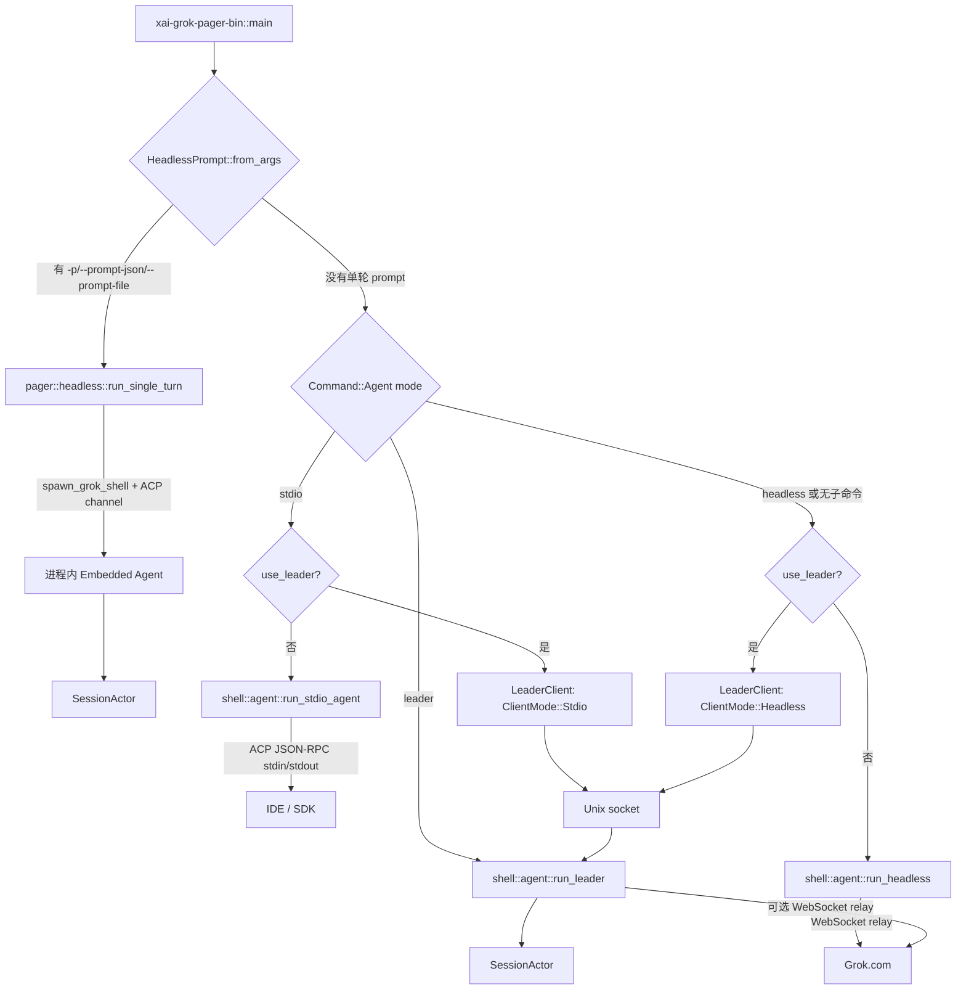

# 宿主模式与运行入口精读

本文回答一个很容易误判的问题：`grok`、`grok -p`、`grok agent headless`、`grok agent stdio` 和 `grok agent leader` 到底是不是同一个入口？

答案是：它们最终复用 `SessionActor`、采样器和工具桥，但**进程所有权、传输协议、鉴权来源、输出契约和退出条件都不同**。开发新入口或排查“消息没有到达”的问题时，必须先判断自己位于哪一条路径。

## 1. 先看总分流图



图中最重要的分界是顶部的 `HeadlessPrompt::from_args`：单轮 `grok -p` 在普通 Agent 子命令分流之前就返回，因此它不会进入 `run_agent_command`，也不会因为 `use_leader` 配置而自动改走 Leader。

## 2. 五种模式的契约

| 命令 | 真实函数 | 核心传输 | stdout 是否为协议 | 鉴权/连接 | 退出条件 |
|---|---|---|---|---|---|
| `grok` | pager app 的交互入口 | 进程内 ACP client，或可选 Leader | TUI 输出 | 由当前宿主处理 | TUI 退出 |
| `grok -p "..."` | `xai_grok_pager::headless::run_single_turn` | 进程内 ACP channel | 否；是 plain/JSON/流式 JSON 结果 | 可用 API key 或 session | Prompt 完成、后台任务收敛或取消 |
| `grok agent stdio` | `xai_grok_shell::agent::run_stdio_agent` | stdin/stdout ACP JSON-RPC | **是，必须保持纯净** | 可走 API key | stdin EOF、连接结束或父进程死亡 |
| `grok agent headless` | `xai_grok_shell::agent::run_headless` | Grok WebSocket relay + ACP simplex | relay/agent 内部使用；不是一次性结果 CLI | 要求 grok.com session | 取消；WebSocket 断线本身不结束 Agent |
| `grok agent leader` | `xai_grok_shell::agent::run_leader` | Unix socket + 可选 WebSocket relay | socket 上转发 ACP | session 可选；BYOK 先只服务 IPC | 策略允许时最后客户端断开，或显式关闭 |

`grok agent headless` 的 `headless` 是宿主模式名称，不等于 `grok -p` 的单轮输出模式。前者是长期运行的远程 relay agent，后者是 pager 进程内的“一次 prompt 驱动器”。

## 3. `grok -p`：Pager 内的单轮 ACP 驱动器

### 3.1 入口为什么不走 `run_headless`

`xai-grok-pager-bin/src/main.rs` 先调用：

```rust
let headless_prompt = HeadlessPrompt::from_args(
    args.single.as_deref(),
    args.prompt_json.as_deref(),
    args.prompt_file.as_deref(),
)?;

if let Some(prompt) = headless_prompt {
    return xai_grok_pager::headless::run_single_turn(prompt, ...).await;
}
```

这段 `return` 是架构上的关键。`-p` 的用途是把 pager 当作一个可脚本化的客户端：它自己创建 shell、通过 ACP 请求完成一次 session/prompt，然后把 ACP 更新折叠为用户指定的输出格式。它不是远端 agent 的守护进程，也不需要通过 Grok WebSocket relay 注册为在线 Agent。

### 3.2 `run_single_turn` 的阶段

源码 [`xai-grok-pager/src/headless.rs`](../../crates/codegen/xai-grok-pager/src/headless.rs) 的生命周期可以按下面的 owner 划分：

```text
run_single_turn
  1. 解析 cwd、模型、rules、权限、agent 和输出格式
  2. spawn_grok_shell(...)                 -> 新的 shell/SessionActor
  3. acp_send(Initialize)                  -> 初始化能力与鉴权方法
  4. authenticate(...)                     -> API key 或网页登录/设备流
  5. materialize_startup_for_cwd(...)      -> new / resume / fork 意图
  6. open_session(...)                     -> 得到 session_id 和模型目录
  7. apply_headless_model_and_effort(...)  -> 设置模型/推理努力度
  8. acp_send(PromptRequest)               -> 进入正常 Agent Loop
  9. select!(ACP update, PromptResponse, background timeout)
 10. drain/reap background tasks           -> flush 日志、注销 active session
 11. HeadlessEmitter::on_end/on_error      -> 生成最终 stdout
```

`spawn_grok_shell` 返回 ACP channel 和线程句柄；`AgentShutdownGuard` 将 `CancellationToken` 与线程生命周期绑定。也就是说，单轮模式并没有另写一套采样/工具循环，而是把真实的 ACP client 生命周期跑在同一进程里。

### 3.3 输出格式是产品契约，不是 ACP 协议

`HeadlessEmitter` 按 `OutputFormat` 处理相同的 ACP 更新：

```text
plain                  文本增量直接写 stdout；生命周期/错误写 stderr
json                   缓冲文本，结束时写一个结果对象
streaming-json         每个 reducer 事件输出一行 NDJSON
streaming-messages-json
                       输出消息事件；可选 include_partial_messages
```

`json` 的终态对象至少包含 `text`、`stopReason`、`sessionId`、`requestId`，并可能附带 usage、thought 和 schema 校验后的 structured output。stdout 写入遇到 BrokenPipe 会被视为正常停止；其他 I/O 错误会记住并以失败返回。

因此脚本应只解析 stdout，诊断信息应看 stderr/unified log。不要把 `grok -p` 的 JSON 与 `session/update` ACP JSON-RPC 混用。

### 3.4 背景任务为什么会延迟退出

`PromptResponse` 到达不一定意味着所有后台子任务已完成。循环会先把 ACP channel 中已经排队的 `task_backgrounded` / `task_completed` 消息排空；默认 `wait_for_background=true`，直到 pending 集合为空或超时。关闭前还会做一次最终 drain，仍未完成的任务通过 `reap_pending_background_tasks` 取消。

这个顺序解释了两个常见现象：

1. 模型已经给出答案，但 `grok -p` 还没有退出；它可能正在等后台搜索或子代理的完成事件。
2. 下游提前关闭 stdout 时，单轮循环会停止继续写输出，但仍尝试清理任务和 flush 日志。

## 4. `grok agent stdio`：IDE 的协议子进程

### 4.1 stdout 是唯一的 ACP 线

`run_stdio_agent` 把 `tokio::io::stdout()` 交给 `AgentSideConnection`，stdin 由专用 OS 线程逐行读入，再写入 simplex。simplex 的作用不是“多一个队列”这么简单：skills watcher 等内部事件也要注入同一条 ACP 输入流，因此它可以保证内部消息不会插入客户端 JSON 行的中间。

```text
stdin reader thread ─┐
                     ├─> simplex ─> AgentSideConnection ─> SessionActor
skills watcher ──────┘                         │
                                              └─> stdout (ACP JSON-RPC)
```

日志不能写 stdout。`tracing`、启动诊断和警告必须落到 stderr 或 unified log；否则 IDE 会把日志当作 JSON-RPC 帧，导致解析失败。

### 4.2 两阶段关闭

stdin EOF 后，reader 线程只发送 `stdin_closed` 信号；LocalSet 内的任务再等待约 100ms，然后关闭 simplex writer。这是为了让尚未完成的 ACP response handler 先在同一个 LocalSet 中 flush，而不是跨线程立即关闭导致响应丢失。退出后还会关闭 PTY 子进程，并给 upload queue 两秒排空时间。

stdio 子进程在启动时尝试设置 Linux `PR_SET_PDEATHSIG(SIGTERM)`：父进程（IDE、desktop 或 subagent harness）死亡时，子进程跟着退出。其他平台可能是 no-op；失败时 stdin EOF 仍是兜底清理机制。

### 4.3 经过 Leader 的 stdio

当 `resolve_leader_mode` 选中 Leader 时，`main.rs` 不调用 `run_stdio_agent`，而是：

```text
stdin -> LeaderClient(ClientMode::Stdio) -> Unix socket -> Leader -> ACP agent
stdout <- LeaderClient <- Unix socket <- Leader
```

该桥仍保持 stdout 纯净，并缓存 session ID、`session/new`/`session/load` 等关键 ACP 状态。Leader 断开后使用 bounded reconnect；重连成功会先 replay ACP state，再发送 `x.ai/leader_reconnected`。客户端桥设置 parent-death 语义，Leader 本身不设置。

## 5. `grok agent headless`：长期 Relay Agent

### 5.1 鉴权和 transport 约束

shell 的 `run_headless` 明确把 AgentMode 设置为 `Headless`，并设置 headless process client mode。它的唯一 transport 是 Grok WebSocket relay，因此源码使用固定错误文案拒绝没有 grok.com session 的启动：

```text
Headless mode requires a grok.com session.
Run `grok login` to sign in, or use `grok agent stdio` for API-key access.
```

这不是说 headless Agent 永远不能调用 API，而是说该宿主必须先通过 relay 注册和接收远端控制；`grok agent stdio` 才是支持 BYOK/API-key 的本地 ACP 入口。

### 5.2 WebSocket 与 Agent 解耦

`run_headless` 建立两条桥：

```text
WebSocket -> ws_to_agent_rx -> acp_incoming simplex -> AgentSideConnection
AgentSideConnection -> acp_outgoing simplex -> agent_to_ws_tx -> WebSocket
```

Agent 在 `LocalSet` 中长期运行。relay 断开时，发送到 `agent_to_ws_tx` 但没有活动连接的消息会被丢弃；这不是数据丢失契约，因为 SessionActor 已将会话与更新持久化，客户端重新连接时通过 `session/load` replay。开发 relay 时，不能把“发送失败”误判为“turn 失败”；要同时检查 durable session 和 replay。

首次连接可能通过 stderr 打印 Grok Build URL，并等待用户按 Enter 打开浏览器。这是人机辅助登录提示，不是 stdout 协议的一部分。

## 6. Leader：长寿命 Agent Host 与客户端

### 6.1 server 启动顺序

`run_leader` 的 lock-then-socket 顺序是一个并发不变量：

```text
acquire flock
  -> 清理旧 socket / 写 pid
  -> 先 bind Unix socket，ready=false
  -> connect_or_spawn 可以发现 socket
  -> 完成 auth / model prefetch
  -> ready=true，放行 ACP 转发
  -> LocalSet 中运行 Agent、IPC bridge、WS bridge、watcher
```

socket 先出现并不代表 Agent 已经可用。ready 之前的 ACP 请求收到结构化 `leader_starting` 错误，避免客户端无限等待或把早期请求静默丢掉。

### 6.2 所有权与断线

Leader 持有 Agent、Session、Workspace 和 relay；客户端只持有 socket channel。客户端断线后：

- `no_exit_on_disconnect=false` 时，server 可以在没有客户端且没有活动工作的情况下退出；
- `--no-exit-on-disconnect` 时，Leader 继续驻留；
- 断线不等于 session 销毁，持久化和 replay 负责恢复；
- Leader 不绑定 parent-death，因为它设计为比某个 TUI/IDE client 活得更久。

### 6.3 relay 是 eager 还是 on-demand

显式 `grok agent leader` 默认 eager 连接 relay：没有本地 headless client 时，远端 prompt 仍必须能到达，等待“headless 注册”会形成鸡生蛋死锁。交互客户端自动拉起的 Leader 可传 `--relay-on-demand`，只在第一个 `ClientMode::Headless` 注册时启动 WebSocket，单纯 TUI/IDE 使用时不支付 relay 镜像成本。

## 7. 选择模式的决策树

```text
需要一次命令得到结果文件？
  ├─ 是 -> grok -p，选择 json 或 streaming-messages-json
  └─ 否
      需要 IDE/SDK 按 ACP 长期对话？
        ├─ 是 -> grok agent stdio（stdout 只能是 ACP）
        └─ 否
            需要 grok.com 远程 Agent 在线？
              ├─ 是 -> grok agent headless
              └─ 否
                  多客户端共享 session/workspace？
                    ├─ 是 -> grok agent leader 或 use_leader
                    └─ 否 -> 默认交互 TUI / 进程内 session
```

## 8. 开发与调试断点

按问题选择最短源码路径：

| 症状 | 先读哪里 | 重点检查 |
|---|---|---|
| `grok -p` 没输出 | `pager/src/headless.rs` 的 `HeadlessEmitter` | output format、stdout BrokenPipe、`PromptResponse` |
| `-p` 卡在退出 | `headless.rs` 的 background drain | pending task、wait timeout、reap |
| IDE 报 JSON 解析错误 | `shell/src/agent/app.rs::run_stdio_agent` | 是否有日志写 stdout、simplex 关闭顺序 |
| stdio 子进程残留 | `run_stdio_agent` + `kill_current_process_on_parent_death` | PDEATHSIG 平台支持、stdin EOF |
| headless 显示无 session | `run_headless` 的 `HEADLESS_NO_SESSION` | auth scope、relay config、API key 误用 |
| relay 断线后消息缺失 | `agent/relay.rs` 与 session persistence/replay | 是否落盘、`session/load` 是否重放 |
| Leader 客户端连接但请求失败 | `run_leader` + `leader/server.rs` | flock、socket ready、`leader_starting` |
| Leader 没有远程 Agent | `spawn_leader_relay` | eager/on-demand、是否有 relay-eligible session |

建议给每个入口保留三类 fixture：

1. **进程 fixture**：明确 stdin/stdout/stderr、父进程退出和 socket 生命周期。
2. **协议 fixture**：用固定 ACP JSON 行验证 initialize、session/new、prompt、update、reconnect。
3. **持久化 fixture**：在 relay/client 断线后读取 session 文件，确认重连 replay 而不是依赖内存缓存。

## 9. 相关源码

- [`xai-grok-pager-bin/src/main.rs`](../../crates/codegen/xai-grok-pager-bin/src/main.rs)：顶层 prompt 检测、Leader client 转发、Agent 子命令分流。
- [`xai-grok-pager/src/headless.rs`](../../crates/codegen/xai-grok-pager/src/headless.rs)：单轮 `-p` 驱动器、输出 reducer、后台任务 drain。
- [`xai-grok-pager/src/app/cli.rs`](../../crates/codegen/xai-grok-pager/src/app/cli.rs)：`AgentCmd`、Headless/Leader 参数定义。
- [`xai-grok-shell/src/agent/app.rs`](../../crates/codegen/xai-grok-shell/src/agent/app.rs)：stdio、relay headless、Leader host 的 composition root。
- [`xai-grok-shell/src/agent/relay.rs`](../../crates/codegen/xai-grok-shell/src/agent/relay.rs)：WebSocket reconnect、401 recovery、cancel 和消息桥。
- [`xai-grok-shell/src/leader/client.rs`](../../crates/codegen/xai-grok-shell/src/leader/client.rs)：注册、bounded reconnect、ACP replay。
- [`xai-grok-shell/src/leader/server.rs`](../../crates/codegen/xai-grok-shell/src/leader/server.rs)：socket/lock、ready gate、client mode、session route。
