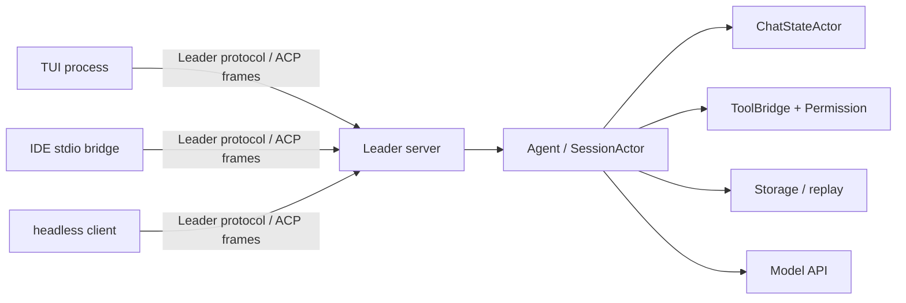
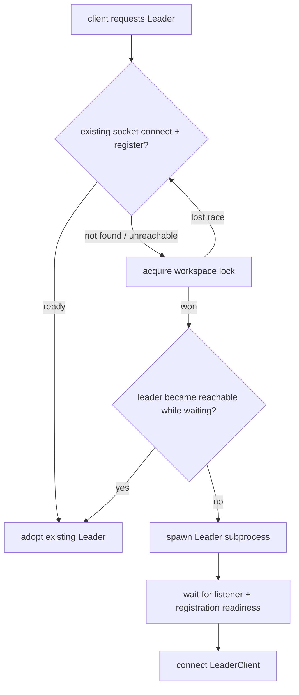
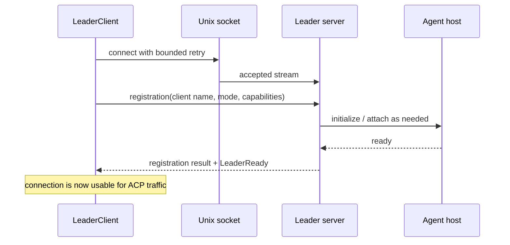
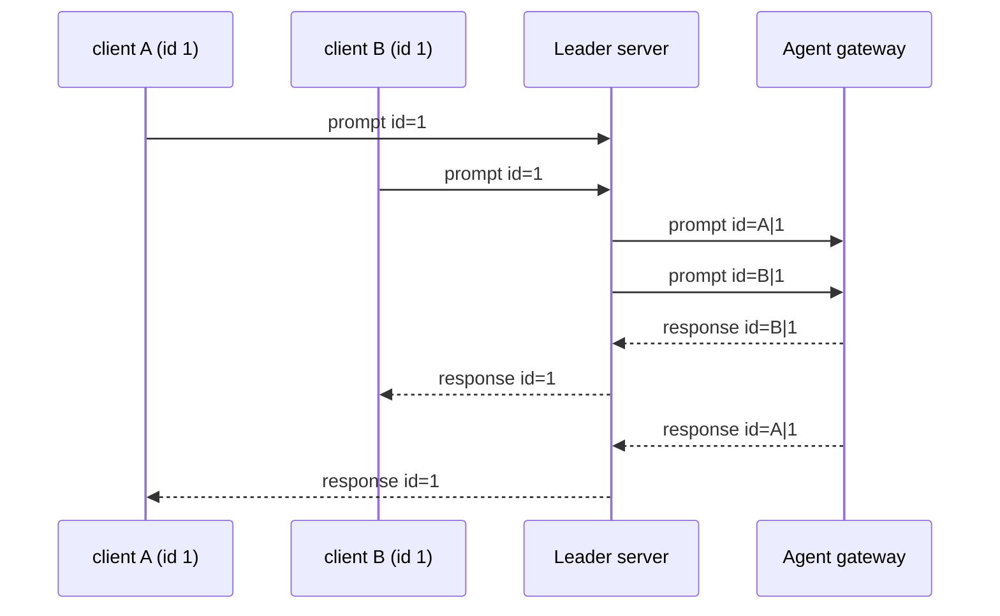
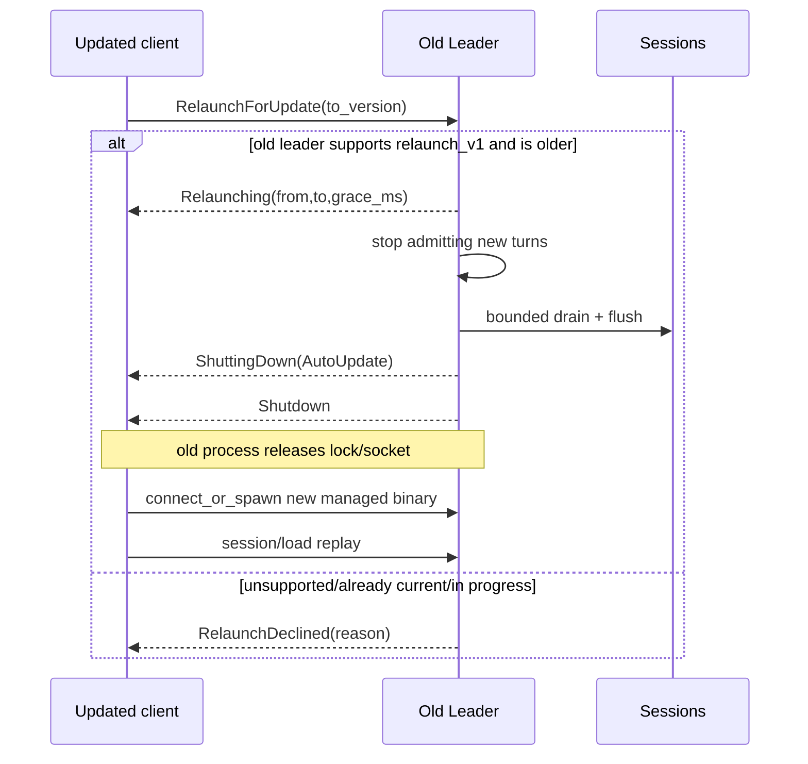

# 源码精读：Leader 控制面如何让多个客户端共享一个 Agent Host

Leader 是 Grok Build 的可选本机控制面：一个进程持有 Agent、Session 和工作区状态，多个 TUI、IDE/stdio 或 headless client 通过本地 Unix socket 连接它。它不是模型后端，不是 Git leader，也不是远程服务。

这篇追踪四个问题：

1. 多个客户端同时启动时，为什么不会各自拉起一个 Leader？
2. 两个客户端都使用 JSON-RPC `id: 1` 时，响应为什么不会串台？
3. Leader 未完全 ready、断线、升级或版本偏斜时，客户端如何恢复？
4. 修改 IPC/协议代码时，哪些兼容和所有权不变量必须测试？

架构定位、开关优先级和普通运行模式见 [02-architecture.md](../02-architecture.md)；本篇只深入 Leader 的控制面。

## 1. Leader 解决的所有权问题

直连模式中，Pager/stdio client 与当前进程的 shell Session 相连。Leader 模式将这个关系拆为“本机 IPC 客户端”和“唯一的 Agent host”：



Leader 不会让多个客户端直接可变地访问 `SessionActor`。它仍是 session 的 owner；Leader server 的职责是：

- 接收/验证本地 framed message；
- 记录客户端注册、模式和 capabilities；
- 为请求建立 client namespace，防止 ID 冲突；
- 将入站请求转给 Agent，并将 response/notification 路由回正确客户端；
- 在 disconnect、server shutdown、升级或重连时维护连接生命周期。

因此，修复“IDE 收不到 response”通常不应改 ChatState 或 Sampler；先检查 Leader forwarding、namespaced request ID、session attachment 和 client bridge。

## 2. 文件地图与术语

| 文件 | owner / 重点 |
|---|---|
| [`leader/mod.rs`](../../crates/codegen/xai-grok-shell/src/leader/mod.rs) | `connect_or_spawn`、版本/僵尸 Leader 处理、reconnection policy、公开类型 |
| [`leader/lock.rs`](../../crates/codegen/xai-grok-shell/src/leader/lock.rs) | workspace/环境派生的 lock、socket 路径和单 Leader 互斥 |
| [`leader/transport.rs`](../../crates/codegen/xai-grok-shell/src/leader/transport.rs) | Unix socket listener 与 framed transport 的就绪边界 |
| [`leader/protocol.rs`](../../crates/codegen/xai-grok-shell/src/leader/protocol.rs) | registration、capabilities、control command/payload、协议版本 |
| [`leader/client.rs`](../../crates/codegen/xai-grok-shell/src/leader/client.rs) | connect、register、读写 loop、disconnect reason 与 watch 状态 |
| [`leader/server.rs`](../../crates/codegen/xai-grok-shell/src/leader/server.rs) | client 接入、ID 命名空间、消息路由、session ownership |
| [`pager/acp/leader_bridge.rs`](../../crates/codegen/xai-grok-pager/src/acp/leader_bridge.rs) | Pager 如何把 Leader connection 接进自己的 ACP 读写边界 |
| [`agent/relay.rs`](../../crates/codegen/xai-grok-shell/src/agent/relay.rs) | Agent 与客户端之间的消息 relay 边界 |

三个词要严格区分：

| 词 | 含义 |
|---|---|
| Leader socket | 本机进程间传输入口；它不是模型 API endpoint |
| ACP frame | 客户端与 Agent 会话的 request/response/notification 语义 |
| Leader control payload | Leader 自己的注册、就绪、状态、关闭等控制消息；它不是普通模型/工具 payload |

## 3. 发现、锁和 `connect_or_spawn`

### 3.1 路径不是全局常量

Leader 按 workspace/环境派生 lock 和 socket 路径，而不是只在所有项目之间共享一个没有上下文的固定 socket。`lock.rs` 中的 `compute_ws_url_suffix`、`lock_path_for_ws_url`、`socket_path_for_ws_url` 将目标环境映射成可区分的本地资源名。

其目的有两层：

1. 让 client 找到与当前 target 相符的 Leader；
2. 避免不同环境错误附着到彼此的控制面。

路径文件只是发现线索，不是“进程活着”的充分证据。代码还需要实际连接、registration/control 信息和 PID/lock-holder 校验。

### 3.2 并发客户端的竞争路径

`connect_or_spawn` 的高层流程可读成：



最关键的设计是：**先尝试附着，再以 lock 串行化 spawn 竞争，再在 lock 下二次确认**。若两个 Pager 同时启动，后到者不能因为最开始 `connect` 失败就盲目再启动一份 Agent；它应重新检查并采用先到者建立的 Leader。

这是一条控制面不变量，而不是性能优化：两份 Leader 会有独立的 Session、MCP 状态、worktree 操作和本地持久化写入，造成 split-brain。

### 3.3 旧版本与失联进程

Leader 有两个不同的异常分类：

| 情况 | 正常处理思想 | 不应做什么 |
|---|---|---|
| 可连接、注册完成但 binary version 严格更旧 | 只允许更高版本 client 发起受控替换，避免旧版本反复驱逐新版本 | 同版本或不可解析版本也驱逐，造成升级抖动 |
| lock 被同一 PID 持有但 socket/registration 长时间不可用 | 等待一个明确 deadline，并确认文件 PID 与真实 flock holder 一致后才作为 zombie 候选 | 仅凭 stale pid file 或未知 holder 向某个 PID 发 kill |
| socket 不存在且 lock 没被持有 | 获取 lock 后 spawn | 跳过 lock 直接 spawn |

`leader_is_older_than` 使用可解析 semver 的严格比较；不能解析的开发版字符串不会被当作旧版本。zombie 计时器按 PID 键控，PID 更换会重置计时；这防止新 Leader 因为旧 PID 积累的时间被误杀。相关纯函数测试在 `leader/mod.rs` 末尾，修改驱逐逻辑时应先保住这些安全条件。

## 4. 连接不是 ready：registration / capabilities / readiness

Unix socket `accept` 成功只证明 listener 接受了一个字节流，不能证明 Agent 已完成初始化。`LeaderClient::connect` 会完成 framed transport、发送注册，再等待 registration/ready 控制路径；所以调用者拿到 client 时，不应再看到“leader_starting”的半初始化状态。



### 4.1 `LeaderRegistration` 是 per-client 数据

registration 包含 client identity、`ClientMode`、capabilities 和 Leader 的 ready/version 信息。它不是全局开关：例如某个 client 是否有 code navigation、交互能力或特定 mode，必须随该连接保存并在 routing/attachment 时使用。

这解释了一个常见 bug：若把“最后连接 client 的 capabilities”写进全局 Agent 状态，随后 TUI 与 IDE 会互相污染行为。正确方向是让 Leader server 保留 client-scoped registration，并在需要时将对应 capability 注入到对应 session/load 或 response 路径。

### 4.2 协议版本与二进制版本不同

| 字段 | 保护的对象 |
|---|---|
| `LEADER_PROTOCOL_VERSION` | framed control messages 的形状和能力协商 |
| leader/client binary version | 升级替换与版本偏斜决策 |
| client capabilities | 当前一条连接能理解/需要的行为 |

不要只比一个版本字符串就宣布 wire compatible。新增 control enum 或 capability 时，至少考虑旧 client、未来 client、注册成功但某 control command 不支持，以及发生错误时的明确反馈。

## 5. 转发的核心：ID 命名空间和回复去命名空间

多个 JSON-RPC client 都可以合法发送：

```json
{"jsonrpc":"2.0","method":"session/prompt","id":1,"params":{}}
```

若 Leader 原样把两个 `id: 1` 交给共享 Agent，后续 response 没有办法知道该回给哪个 socket。Leader server 因此在转发前将 request ID 编成 client-specific 的内部 ID：

```text
client A, original id 1  ->  A<separator>1
client B, original id 1  ->  B<separator>1
```

Agent/ACP 层只看到不冲突的 namespaced ID。返回路径做反向映射：

```text
Agent response id A<separator>1
  -> Leader locates client A
  -> restore original id 1
  -> only client A receives the response
```



这条规则同样适用于 Agent 反向向 client 发起的请求，例如 tool/hook 相关 client interaction：服务器必须依靠 namespace 将 reply 定回原连接。不要在协议测试里只使用递增全局 ID；至少用两个 client 都发送相同 ID 的 fixture，才能证明隔离真的有效。

相对地，广播型 notification 不应被误当作 response：它没有可反向路由的 request ID，server 需按照事件与 session ownership 决定接收者集合。把 notification 强行塞进 response map 会造成断线后内存泄漏或遗漏 UI 更新。

## 6. Session 归属、附着与 disconnect

Leader 的共享性不表示每个 client 都拥有所有 session。Server 跟踪 client registration、绑定/attach 关系和 request route；client disconnect 时应移除它的 sender/routing state，但不能因为一个 TUI 窗口退出就销毁仍被其他 client 使用的 session。

有三类状态要分开：

| 状态 | owner | disconnect 后的典型处理 |
|---|---|---|
| Agent/session/conversation | Leader host / `SessionActor` | 仍可能继续存在、持久化或被其他 client 附着 |
| 一条 client connection 的 registration/capabilities | Leader server | 删除或失效；不能泄漏给下一条连接 |
| pending request response route | Leader server 的 namespace/routing state | 结束、回收或报告 disconnect，绝不能交给相同原始 ID 的新 client |

尤其不要将“socket EOF”翻译为“turn 必须立即失败”。到底 abort、detach、继续后台任务还是等 session load/replay，是 Session/Agent 的产品语义；Leader 的责任是准确报告连接状态、保持 route 不串台，并让客户端走重连/重新附着路径。

## 7. 断线、重连与受控关闭

`LeaderReconnector` 将连接状态通过 `watch` 广播给 UI/bridge。它按 mode 区分恢复策略：有界调用（例如 headless）使用有限尝试；交互 TUI 可由 cancellation token 控制持续重试。退避从基础延迟开始并设上限，避免 client 在 socket 不可用时忙循环。

```text
connected
  -> EOF / transport error / server ShuttingDown(reason)
  -> publish Reconnecting { attempt }
  -> connect_or_spawn
  -> replace transport channels
  -> client reattach / session load / replay as appropriate
  -> publish Connected { generation + 1 }
```

重连成功仅表示新的 IPC connection 可用了；它不神奇地恢复旧 socket 上未完成的所有 request。调用者必须遵守具体 operation 的 retry/ack 语义，必要时通过 session load/replay 重建可见状态。特别是 cancel、tool approval 这类副作用命令不能在不具备幂等或 ack 证据时盲目重复发送。

Leader 在更新或受控退出时会向已连 client 发布 shutdown reason。客户端可以据 reason 决定何时重连；server 应先停止接新工作/通知 client，再关闭 listener/连接。新增 shutdown reason 时，需要同时审查 protocol serde、client watch state、Pager bridge 以及 integration fixture。

## 8. 测试面：不要只测一个 socket 能连上

Leader 的风险在边界和竞争，所以测试也要按不变量分层：

先运行 [`mini_host_leader_routing.rs`](../rust-essentials/labs/async-demos/src/bin/mini_host_leader_routing.rs)，预测两个 client 使用相同原始 ID 后的内部 ID 和响应目标。它会确定性断言 ready gate、per-client capabilities、数字/字符串 ID round trip，以及 disconnect 不销毁 shared Session；随后再用本节 integration fixture 覆盖缩小模型没有模拟的 lock、socket、重连和真实进程所有权。

```sh
cargo run --locked \
  --manifest-path docs/rust-essentials/labs/async-demos/Cargo.toml \
  --bin mini_host_leader_routing
```

| 风险 | 最小证据 |
|---|---|
| lock/PID/zombie 决策 | `leader/mod.rs` 的纯函数测试：只驱逐严格旧版本、PID 改变重置计时、holder 不一致不驱逐 |
| framing / register / readiness | `leader/client.rs` 单测和 `test_leader_stdio_integration.rs` 的 delayed-ready/garbage/partial-frame fixture |
| 两 client ID 冲突 | 两 client 都发相同 JSON-RPC ID，断言 forwarded ID 不同且 response 回到各自 client |
| capability isolation | 使用不同 client mode/capability attach 相同 session，验证各自注入/返回没有串联 |
| disconnect / reconnect | `UdsProxy` 或 test support 人为 sever frame/connection，断言状态 watch、generation 和后续 attach 行为 |
| 真正进程清理 | `LeaderFixture` / `TestProcess` 所有权测试；避免测试留下 detached leader |

重要测试入口：

- [`test_leader_stdio_integration.rs`](../../crates/codegen/xai-grok-shell/tests/test_leader_stdio_integration.rs)
- [`test_leader_version_skew.rs`](../../crates/codegen/xai-grok-shell/tests/test_leader_version_skew.rs)
- [`test_leader_soak.rs`](../../crates/codegen/xai-grok-shell/tests/test_leader_soak.rs)
- [`leader/test_support.rs`](../../crates/codegen/xai-grok-shell/src/leader/test_support.rs)
- [`xai-grok-test-support/uds_proxy.rs`](../../crates/codegen/xai-grok-test-support/src/uds_proxy.rs)
- [贡献者工作流](./contributor-workflow.md)

部分真实 leader death/replacement 测试可能因 detached process 的跨平台 containment 条件被标记为 ignored。不要把“有 ignored 测试”当作该路径已被完全验证；修改相关代码时应补受控 proxy/fixture 覆盖，或明确记录未覆盖的 OS 级风险。

## 9. 贡献检查表

### 增加 control command / payload

1. 在 `protocol.rs` 定义稳定 wire shape，考虑旧/未知字段；
2. 明确它是 registration、server control，还是应作为普通 ACP message；
3. 在 client 与 server 两端做 exhaustive handling，未知 command 应有可观察错误；
4. 验证 future/older protocol negotiation，不要只在同版本测试；
5. 为 serialization、round trip、错误及 multi-client routing 加 fixture。

### 修改转发或 session route

1. 写出入站 ID、内部 namespaced ID、出站 restored ID 的样例；
2. 同时覆盖 request、response、notification、Agent-to-client request 四种方向；
3. 让至少两个 client 复用相同原始 JSON-RPC ID；
4. 断线后清理 pending route，确认新 client 不能继承旧 client 的 response；
5. 只在 Leader 层处理 IPC route，不改变 ChatState/Session 的单写者边界。

### 修改连接、驱逐或重连

1. 明确 lock、socket、PID、binary version、protocol version 中哪些是证据、哪些只是线索；
2. 保住“不杀未知/不匹配 holder”“只用更高版本替换严格旧版本”“不产生双 Leader”的不变量；
3. 用可控时间/connection failure 测 backoff，避免 wall-clock sleep；
4. 说明重连后哪些 request 可重试、哪些必须 session load/replay；
5. 测试进程 owner 是否会清理 spawned leader 和子进程。

## 10. 阅读练习

1. 从 `connect_or_spawn` 画出“两个 client 同时发现无 socket”的竞争图，标出 lock 下二次检查的位置。
2. 在 `test_leader_stdio_integration.rs` 找两个 client 都发送 `id: 1` 的 fixture，追踪 namespaced ID 怎样被恢复。
3. 找到 delayed-ready 测试，解释为什么 TCP/Unix connect 成功不能作为 Agent ready 的证据。
4. 从 `LeaderReconnector` 找到 bounded 与 continuous policy，分别说明 headless 与 TUI 为什么不能共享同一重试语义。
5. 假设给 Leader 增加一个 `GetDiagnostics` control command，写出它需要更新的 protocol、server、client 和测试文件。

能够回答这些问题后，你就可以区分“模型/Agent 问题”“Session 状态问题”和“本机 IPC 控制面问题”，而不会把多客户端故障错误修到 Pager 或 Sampler 中。

## 11. Lock、socket 与 PID：三种证据的强弱

Leader discovery 同时出现 lock file、socket path 和 PID，很容易把它们都当成“Leader 存活证明”。实际上三者回答不同问题：

| 证据 | 能证明什么 | 不能单独证明什么 |
|---|---|---|
| socket/pipe 名存在 | 某个 listener 曾经或正在占用该地址 | 进程仍活着、Agent ready、版本合适 |
| lock file 内容中的 PID | 上一次持有者写入的诊断 identity | 当前 OS lock holder 就是该 PID |
| OS exclusive flock 被占用 | 某个进程仍持有这个 inode 的锁 | 文件中 PID 正确、socket 可连接 |
| register/control 响应 | 当前连接对端能执行 Leader 协议 | session 已 attach、某个 turn 已恢复 |

因此 zombie eviction 需要组合证据：连接持续失败、flock 仍被占用、文件 PID 与真实 live lock holder 匹配，并且同一 PID 已超过 deadline。只凭 stale PID file 发送 signal 会遇到 PID reuse，可能终止完全无关的进程。

### 11.1 为什么等待 lock 时每轮重新 open

`LeaderLock::acquire_reopen_timeout` 每 200ms 重新打开 lock path，再尝试 `try_lock_exclusive`。这不是低效实现，而是针对 Unix inode 语义：旧流程可能 unlink lock file；继续轮询原先打开的 fd，只会盯着已从目录移除的旧 inode。另一个进程已经在同一路径创建并锁住新 inode，等待者却永远看不到。

```text
waiter fd -> inode A (已 unlink)
path      -> inode B (新 Leader 正在使用)

复用 fd:  只观察 A，产生错误 leader 判断
重新 open: 下一轮解析 path，观察 B
```

正确清理顺序也依赖 `was_leader`：获得锁后异常退出应清理自己负责的文件；显式 `release()` 是把 spawn 责任交给 child，必须先清 `was_leader`，即使后续 unlock 报错，Drop 也不能删除新 child 将使用的 socket。

### 11.2 path override 必须成对覆盖

`GROK_LEADER_SOCKET` / `--leader-socket` 覆盖 socket 时，lock 路径必须由同一 socket 的 sibling `.lock` 派生，并同时被 client 与 spawned Leader 继承。若只覆盖 socket、不覆盖 lock：

- 两组 client 可能竞争同一个全局 lock，却连接不同 socket；
- 或两个 Leader 绑定同一个 socket，却认为自己拥有不同 lock；
- 测试分支的 Leader 可能与已安装稳定版互相驱逐。

默认路径按 relay WS URL 做短 hash；生产 URL 不加 suffix。hash 是实例分区 key，不是安全认证，也不应包含在协议授权判断中。

## 12. `connect_or_spawn` 是 adopt-or-create 循环

源码并不是一次 `connect` 加一次 `spawn`，而是带重新验证的循环：

```text
probe listener
  -> 可连且版本可采用: return connection
  -> 不可连/需替换: try flock
       -> 获得 flock
            -> 再次探测 sibling 是否已经建立可采用 Leader
            -> 必要时驱逐严格旧版本
            -> release handoff lock
            -> spawn subprocess
            -> bounded wait for connect + register
       -> 未获得 flock
            -> 等对方完成 startup
            -> connect-level failure 持续时才进入 zombie decision
            -> 回到 try flock
```

lock 下的第二次连接检查防止 eviction/spawn race：本进程等待时，另一个更快的 client 可能已经完成替换。此时继续 spawn 会重新制造 split-brain，正确行为是释放临时责任并 adopt sibling。

### 12.1 self-spawn 与 zombie eviction 都有预算

spawned child 未在 deadline 内可连接时不能无限拉起进程；同一 zombie PID 的 TERM/KILL 尝试也有上限。PID 改变后 eviction counter 与 timer 都应重新计数，因为它代表新的 holder。测试时间状态机时应注入 `Instant` 或调用纯 decision function，不能用几秒 sleep 模糊覆盖 race。

### 12.2 sandbox 中拒绝拉起 Leader

`connect_or_spawn` 在检测到请求的 confinement profile 时返回 `SandboxConfinement`。Leader 是长期、跨客户端且可能超出当前 sandbox 生命周期的进程；在受限工具进程中偷偷 spawn 它会扩大权限与持久化范围。调用者应回到直连/已授权宿主路径，而不是为了连接成功绕过 confinement。

## 13. Leader wire framing：ACP JSON 外还有一层协议

Leader transport 不是 newline-delimited JSON。每个 `ClientMessage` / `ServerMessage` 使用：

```text
4-byte big-endian u32 body length
JSON body bytes
```

`read_frame` 先完整读取 4 字节，再检查 64 MiB 上限，然后才分配 body buffer。`write_frame` 同样在写入前检查上限，并依次 `write_all(length)`、`write_all(body)`、`flush()`。

这形成几条安全不变量：

1. partial header 必须受 connect/registration timeout 约束，否则恶意或损坏 peer 可永久占住 handler；
2. oversized length 必须在 allocation 之前拒绝，避免本机 memory DoS；
3. valid frame + invalid JSON 与 EOF 是不同错误，便于区分版本/数据损坏和普通断线；
4. 多 frame 连续读取必须严格保持边界，不能把 ACP payload 中的换行当 framing；
5. `ServerMessage::Acp { payload }` 的 payload 自身仍是 JSON 字符串，不能直接把它的 object shape 混进 control enum。

### 13.1 连接超时要覆盖“读了一半”

只给 `UnixStream::connect` 加 timeout 不够。对端可能 accept 后只写两个 length bytes，client 会卡在 registration response。`LeaderClient::connect` 的 timeout 必须包住 register/readiness handshake，测试也应覆盖：无响应、partial header、完整 header + partial body、garbage JSON、`Registered ready=false` 后永不 `LeaderReady`。

## 14. Unix socket 与 Windows named pipe 的共同抽象

Unix 上 `LeaderStream`/`LeaderListener` 是 Tokio Unix 类型别名；Windows 上是 named pipe wrapper。调用方依赖共同的 async read/write/accept API，但 readiness 语义不同：

- Unix 可以检查 socket path 是否存在；
- Windows pipe 不出现在文件系统，必须用非连接式 `WaitNamedPipeW` probe；
- probe 不能真实 `open`，否则会消耗 server 的一次 accept，制造 phantom client；
- Windows listener 每次连接后需要预创建下一 pipe instance；失败后必须重新 arm，不能把 accept slot 永久留空。

跨平台测试不能只断言 path.exists。抽象的契约应是“listener 可被探测/连接”，文件存在只是 Unix 实现细节。

## 15. Control plane 与 ACP data plane 的隔离

`ClientMessage` 明确区分 `Register`、`Acp`、`Control`、`Ping` 和 `Disconnect`。Control 使用独立 `request_id`，返回 `ControlResult`；它不进入共享 Agent 的 JSON-RPC namespace。

```text
Leader control request_id -> server control handler -> ControlPayload/ControlError
ACP JSON-RPC id            -> namespace -> Agent -> restored response
```

如果把 CPU profile、workspace exposure 或 diagnostics 实现为假 ACP method，会污染 session history/routing，并要求 Agent 在尚未 ready 时处理本应由 Leader 回答的问题。反过来，把 session prompt 当 control command 会绕开 session permission、persistence 和 replay。

`LeaderCapabilities` 是 feature negotiation，而不是只看 protocol version：`control_v1`、`runtime_cpu_profile`、`workspace_exposure`、`relaunch_v1` 可独立缺失。新 client 面对旧 Leader 时读取 serde default `false` 并降级；不能看到 `LEADER_PROTOCOL_VERSION == 1` 就假设所有后加 capability 都存在。

## 16. 受控 relaunch 的事务边界

`RelaunchForUpdate { to_version }` 是有 ack 的 disruptive control command：



`to_version` 是防重复/降级决策输入，不是执行任意 binary 的路径。managed install 应从原子更新后的稳定 symlink 启动新 Leader；若复用旧进程的 `current_exe()`，更新成功也只会再次拉起旧 binary。

`ShuttingDown.delay_ms` 当前为 0，client 只能把它当“立即 shutdown 的预告”，不能依赖真实 grace。真正的 grace 在 Leader 内部 drain/flush 路径；protocol 字段是未来兼容面。

### 16.1 shutdown reason 影响 reconnect policy

`AutoUpdate` 表示应立即走 `connect_or_spawn` 并 restore；`Manual` 可能是 SIGTERM 或外部取消，client 应避免形成无休止 spawn storm；`IdleTimeout` 当前只是保留 enum，不能写测试假设 runtime 会产生它。新增 reason 时要同时更新 serde round-trip、UI state、bridge reconnect 和 server broadcast。

## 17. 背压、慢客户端与内存边界

Leader 对每个 client 持有 outbound channel。一个慢 UI 不应让 server 主循环在 socket write 上 await，否则它会阻塞所有其他 client 的 response。主循环使用 try-send 将消息交给 per-client writer，关闭或容量问题必须记录并按消息类别处理。

需分别定义：

- response 发送失败：原请求已完成但请求方不可达，不能广播给别人；
- live notification 发送失败：其他 subscriber 仍应继续收到；
- load-live buffer：每个 `(client, session)` 有 4096 项上限，超限后退化为直接转发并告警；
- pending interaction：不能因普通 live buffer 清理而丢失，直到 resolved 或 session owner 结束；
- control result：必须只回 control request 的连接。

容量上限不是完整流控。压力测试还要验证断开慢 client 后其 sender、load buffer、pending request route 和 subscriber membership 都被回收。

## 18. 故障矩阵与进阶练习

| 症状 | 先区分的状态 | 最短证据 |
|---|---|---|
| socket 存在但一直连不上 | stale path / live holder / half-started Leader | listener probe、真实 flock holder、registration timeout |
| 更新后仍运行旧版本 | relaunch capability / spawn binary resolution | `LeaderInfo` version、managed symlink、replacement event |
| 一个 client 卡住拖慢全部客户端 | server loop 是否 await socket write | per-client writer、channel/backpressure fixture |
| Windows 偶发 phantom session | readiness probe 是否真实 open pipe | named-pipe probe/accept count |
| control command 无响应但 ACP 正常 | control request ID route | `ControlResult.request_id`、capability flag |
| 退出后会话少最后一段 | LocalSet 先 drop 或 flush 超时 | shutdown reason timeline、session flush completion |

进阶练习：

1. 画出 waiter 打开 inode A、A 被 unlink、winner 创建 inode B 的时序，解释 reopen polling 如何收敛。
2. 为 64 MiB frame 写边界表：0、上限、上限+1、partial header、partial body 分别应得到什么结果。
3. 给 `GetDiagnostics` 设计 capability flag，而不是只提升 protocol version；写出旧 client 与旧 Leader 的四格兼容矩阵。
4. 模拟三个 client，其中一个永不读 socket；证明另两个仍能收到 response，并列出慢 client 断开后必须清除的 map entry。
5. 从 `Relaunching` ack 追到 `AutoUpdate` shutdown，再到新进程 `session/load`，标出可重试操作和不可盲目重放的一次性操作。
