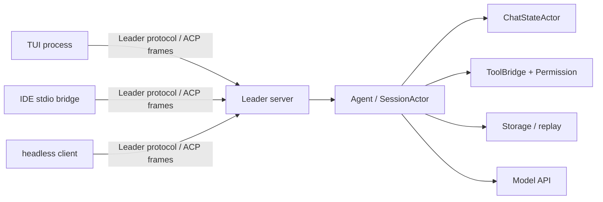
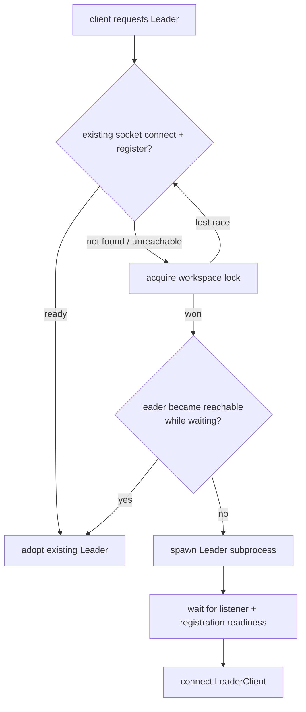
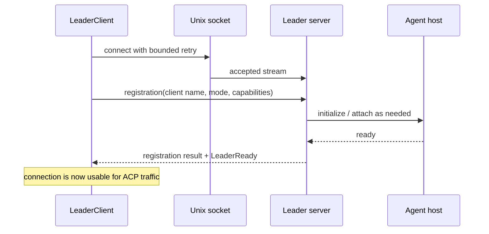
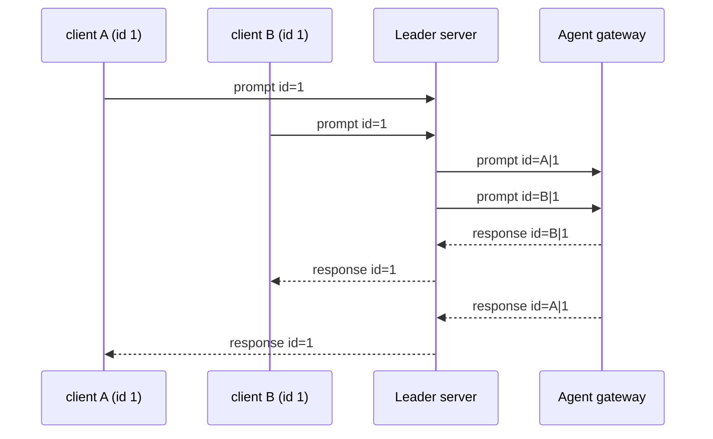

# 源码精读：Leader 控制面如何让多个客户端共享一个 Agent Host

Leader 是 Grok Build 的可选本机控制面：一个进程持有 Agent、Session 和工作区状态，多个 TUI、IDE/stdio 或 headless client 通过本地 Unix socket 连接它。它不是模型后端，不是 Git leader，也不是远程服务。

这篇追踪四个问题：

1. 多个客户端同时启动时，为什么不会各自拉起一个 Leader？
2. 两个客户端都使用 JSON-RPC `id: 1` 时，响应为什么不会串台？
3. Leader 未完全 ready、断线、升级或版本偏斜时，客户端如何恢复？
4. 修改 IPC/协议代码时，哪些兼容和所有权不变量必须测试？

架构定位、开关优先级和普通运行模式见 [02-architecture.md](../02-architecture.md)；本篇只深入 Leader 的控制面。

## 1. Leader 解决的所有权问题

直连模式中，Pager/stdio client 与当前进程的 shell Session 相连。Leader 模式将这个关系拆为“本机 IPC 客户端”和“唯一的 Agent host”：



Leader 不会让多个客户端直接可变地访问 `SessionActor`。它仍是 session 的 owner；Leader server 的职责是：

- 接收/验证本地 framed message；
- 记录客户端注册、模式和 capabilities；
- 为请求建立 client namespace，防止 ID 冲突；
- 将入站请求转给 Agent，并将 response/notification 路由回正确客户端；
- 在 disconnect、server shutdown、升级或重连时维护连接生命周期。

因此，修复“IDE 收不到 response”通常不应改 ChatState 或 Sampler；先检查 Leader forwarding、namespaced request ID、session attachment 和 client bridge。

## 2. 文件地图与术语

| 文件 | owner / 重点 |
|---|---|
| [`leader/mod.rs`](../../crates/codegen/xai-grok-shell/src/leader/mod.rs) | `connect_or_spawn`、版本/僵尸 Leader 处理、reconnection policy、公开类型 |
| [`leader/lock.rs`](../../crates/codegen/xai-grok-shell/src/leader/lock.rs) | workspace/环境派生的 lock、socket 路径和单 Leader 互斥 |
| [`leader/transport.rs`](../../crates/codegen/xai-grok-shell/src/leader/transport.rs) | Unix socket listener 与 framed transport 的就绪边界 |
| [`leader/protocol.rs`](../../crates/codegen/xai-grok-shell/src/leader/protocol.rs) | registration、capabilities、control command/payload、协议版本 |
| [`leader/client.rs`](../../crates/codegen/xai-grok-shell/src/leader/client.rs) | connect、register、读写 loop、disconnect reason 与 watch 状态 |
| [`leader/server.rs`](../../crates/codegen/xai-grok-shell/src/leader/server.rs) | client 接入、ID 命名空间、消息路由、session ownership |
| [`pager/acp/leader_bridge.rs`](../../crates/codegen/xai-grok-pager/src/acp/leader_bridge.rs) | Pager 如何把 Leader connection 接进自己的 ACP 读写边界 |
| [`agent/relay.rs`](../../crates/codegen/xai-grok-shell/src/agent/relay.rs) | Agent 与客户端之间的消息 relay 边界 |

三个词要严格区分：

| 词 | 含义 |
|---|---|
| Leader socket | 本机进程间传输入口；它不是模型 API endpoint |
| ACP frame | 客户端与 Agent 会话的 request/response/notification 语义 |
| Leader control payload | Leader 自己的注册、就绪、状态、关闭等控制消息；它不是普通模型/工具 payload |

## 3. 发现、锁和 `connect_or_spawn`

### 3.1 路径不是全局常量

Leader 按 workspace/环境派生 lock 和 socket 路径，而不是只在所有项目之间共享一个没有上下文的固定 socket。`lock.rs` 中的 `compute_ws_url_suffix`、`lock_path_for_ws_url`、`socket_path_for_ws_url` 将目标环境映射成可区分的本地资源名。

其目的有两层：

1. 让 client 找到与当前 target 相符的 Leader；
2. 避免不同环境错误附着到彼此的控制面。

路径文件只是发现线索，不是“进程活着”的充分证据。代码还需要实际连接、registration/control 信息和 PID/lock-holder 校验。

### 3.2 并发客户端的竞争路径

`connect_or_spawn` 的高层流程可读成：



最关键的设计是：**先尝试附着，再以 lock 串行化 spawn 竞争，再在 lock 下二次确认**。若两个 Pager 同时启动，后到者不能因为最开始 `connect` 失败就盲目再启动一份 Agent；它应重新检查并采用先到者建立的 Leader。

这是一条控制面不变量，而不是性能优化：两份 Leader 会有独立的 Session、MCP 状态、worktree 操作和本地持久化写入，造成 split-brain。

### 3.3 旧版本与失联进程

Leader 有两个不同的异常分类：

| 情况 | 正常处理思想 | 不应做什么 |
|---|---|---|
| 可连接、注册完成但 binary version 严格更旧 | 只允许更高版本 client 发起受控替换，避免旧版本反复驱逐新版本 | 同版本或不可解析版本也驱逐，造成升级抖动 |
| lock 被同一 PID 持有但 socket/registration 长时间不可用 | 等待一个明确 deadline，并确认文件 PID 与真实 flock holder 一致后才作为 zombie 候选 | 仅凭 stale pid file 或未知 holder 向某个 PID 发 kill |
| socket 不存在且 lock 没被持有 | 获取 lock 后 spawn | 跳过 lock 直接 spawn |

`leader_is_older_than` 使用可解析 semver 的严格比较；不能解析的开发版字符串不会被当作旧版本。zombie 计时器按 PID 键控，PID 更换会重置计时；这防止新 Leader 因为旧 PID 积累的时间被误杀。相关纯函数测试在 `leader/mod.rs` 末尾，修改驱逐逻辑时应先保住这些安全条件。

## 4. 连接不是 ready：registration / capabilities / readiness

Unix socket `accept` 成功只证明 listener 接受了一个字节流，不能证明 Agent 已完成初始化。`LeaderClient::connect` 会完成 framed transport、发送注册，再等待 registration/ready 控制路径；所以调用者拿到 client 时，不应再看到“leader_starting”的半初始化状态。



### 4.1 `LeaderRegistration` 是 per-client 数据

registration 包含 client identity、`ClientMode`、capabilities 和 Leader 的 ready/version 信息。它不是全局开关：例如某个 client 是否有 code navigation、交互能力或特定 mode，必须随该连接保存并在 routing/attachment 时使用。

这解释了一个常见 bug：若把“最后连接 client 的 capabilities”写进全局 Agent 状态，随后 TUI 与 IDE 会互相污染行为。正确方向是让 Leader server 保留 client-scoped registration，并在需要时将对应 capability 注入到对应 session/load 或 response 路径。

### 4.2 协议版本与二进制版本不同

| 字段 | 保护的对象 |
|---|---|
| `LEADER_PROTOCOL_VERSION` | framed control messages 的形状和能力协商 |
| leader/client binary version | 升级替换与版本偏斜决策 |
| client capabilities | 当前一条连接能理解/需要的行为 |

不要只比一个版本字符串就宣布 wire compatible。新增 control enum 或 capability 时，至少考虑旧 client、未来 client、注册成功但某 control command 不支持，以及发生错误时的明确反馈。

## 5. 转发的核心：ID 命名空间和回复去命名空间

多个 JSON-RPC client 都可以合法发送：

```json
{"jsonrpc":"2.0","method":"session/prompt","id":1,"params":{}}
```

若 Leader 原样把两个 `id: 1` 交给共享 Agent，后续 response 没有办法知道该回给哪个 socket。Leader server 因此在转发前将 request ID 编成 client-specific 的内部 ID：

```text
client A, original id 1  ->  A<separator>1
client B, original id 1  ->  B<separator>1
```

Agent/ACP 层只看到不冲突的 namespaced ID。返回路径做反向映射：

```text
Agent response id A<separator>1
  -> Leader locates client A
  -> restore original id 1
  -> only client A receives the response
```



这条规则同样适用于 Agent 反向向 client 发起的请求，例如 tool/hook 相关 client interaction：服务器必须依靠 namespace 将 reply 定回原连接。不要在协议测试里只使用递增全局 ID；至少用两个 client 都发送相同 ID 的 fixture，才能证明隔离真的有效。

相对地，广播型 notification 不应被误当作 response：它没有可反向路由的 request ID，server 需按照事件与 session ownership 决定接收者集合。把 notification 强行塞进 response map 会造成断线后内存泄漏或遗漏 UI 更新。

## 6. Session 归属、附着与 disconnect

Leader 的共享性不表示每个 client 都拥有所有 session。Server 跟踪 client registration、绑定/attach 关系和 request route；client disconnect 时应移除它的 sender/routing state，但不能因为一个 TUI 窗口退出就销毁仍被其他 client 使用的 session。

有三类状态要分开：

| 状态 | owner | disconnect 后的典型处理 |
|---|---|---|
| Agent/session/conversation | Leader host / `SessionActor` | 仍可能继续存在、持久化或被其他 client 附着 |
| 一条 client connection 的 registration/capabilities | Leader server | 删除或失效；不能泄漏给下一条连接 |
| pending request response route | Leader server 的 namespace/routing state | 结束、回收或报告 disconnect，绝不能交给相同原始 ID 的新 client |

尤其不要将“socket EOF”翻译为“turn 必须立即失败”。到底 abort、detach、继续后台任务还是等 session load/replay，是 Session/Agent 的产品语义；Leader 的责任是准确报告连接状态、保持 route 不串台，并让客户端走重连/重新附着路径。

## 7. 断线、重连与受控关闭

`LeaderReconnector` 将连接状态通过 `watch` 广播给 UI/bridge。它按 mode 区分恢复策略：有界调用（例如 headless）使用有限尝试；交互 TUI 可由 cancellation token 控制持续重试。退避从基础延迟开始并设上限，避免 client 在 socket 不可用时忙循环。

```text
connected
  -> EOF / transport error / server ShuttingDown(reason)
  -> publish Reconnecting { attempt }
  -> connect_or_spawn
  -> replace transport channels
  -> client reattach / session load / replay as appropriate
  -> publish Connected { generation + 1 }
```

重连成功仅表示新的 IPC connection 可用了；它不神奇地恢复旧 socket 上未完成的所有 request。调用者必须遵守具体 operation 的 retry/ack 语义，必要时通过 session load/replay 重建可见状态。特别是 cancel、tool approval 这类副作用命令不能在不具备幂等或 ack 证据时盲目重复发送。

Leader 在更新或受控退出时会向已连 client 发布 shutdown reason。客户端可以据 reason 决定何时重连；server 应先停止接新工作/通知 client，再关闭 listener/连接。新增 shutdown reason 时，需要同时审查 protocol serde、client watch state、Pager bridge 以及 integration fixture。

## 8. 测试面：不要只测一个 socket 能连上

Leader 的风险在边界和竞争，所以测试也要按不变量分层：

| 风险 | 最小证据 |
|---|---|
| lock/PID/zombie 决策 | `leader/mod.rs` 的纯函数测试：只驱逐严格旧版本、PID 改变重置计时、holder 不一致不驱逐 |
| framing / register / readiness | `leader/client.rs` 单测和 `test_leader_stdio_integration.rs` 的 delayed-ready/garbage/partial-frame fixture |
| 两 client ID 冲突 | 两 client 都发相同 JSON-RPC ID，断言 forwarded ID 不同且 response 回到各自 client |
| capability isolation | 使用不同 client mode/capability attach 相同 session，验证各自注入/返回没有串联 |
| disconnect / reconnect | `UdsProxy` 或 test support 人为 sever frame/connection，断言状态 watch、generation 和后续 attach 行为 |
| 真正进程清理 | `LeaderFixture` / `TestProcess` 所有权测试；避免测试留下 detached leader |

重要测试入口：

- [`test_leader_stdio_integration.rs`](../../crates/codegen/xai-grok-shell/tests/test_leader_stdio_integration.rs)
- [`test_leader_version_skew.rs`](../../crates/codegen/xai-grok-shell/tests/test_leader_version_skew.rs)
- [`test_leader_soak.rs`](../../crates/codegen/xai-grok-shell/tests/test_leader_soak.rs)
- [`leader/test_support.rs`](../../crates/codegen/xai-grok-shell/src/leader/test_support.rs)
- [`xai-grok-test-support/uds_proxy.rs`](../../crates/codegen/xai-grok-test-support/src/uds_proxy.rs)
- [贡献者工作流](./contributor-workflow.md)

部分真实 leader death/replacement 测试可能因 detached process 的跨平台 containment 条件被标记为 ignored。不要把“有 ignored 测试”当作该路径已被完全验证；修改相关代码时应补受控 proxy/fixture 覆盖，或明确记录未覆盖的 OS 级风险。

## 9. 贡献检查表

### 增加 control command / payload

1. 在 `protocol.rs` 定义稳定 wire shape，考虑旧/未知字段；
2. 明确它是 registration、server control，还是应作为普通 ACP message；
3. 在 client 与 server 两端做 exhaustive handling，未知 command 应有可观察错误；
4. 验证 future/older protocol negotiation，不要只在同版本测试；
5. 为 serialization、round trip、错误及 multi-client routing 加 fixture。

### 修改转发或 session route

1. 写出入站 ID、内部 namespaced ID、出站 restored ID 的样例；
2. 同时覆盖 request、response、notification、Agent-to-client request 四种方向；
3. 让至少两个 client 复用相同原始 JSON-RPC ID；
4. 断线后清理 pending route，确认新 client 不能继承旧 client 的 response；
5. 只在 Leader 层处理 IPC route，不改变 ChatState/Session 的单写者边界。

### 修改连接、驱逐或重连

1. 明确 lock、socket、PID、binary version、protocol version 中哪些是证据、哪些只是线索；
2. 保住“不杀未知/不匹配 holder”“只用更高版本替换严格旧版本”“不产生双 Leader”的不变量；
3. 用可控时间/connection failure 测 backoff，避免 wall-clock sleep；
4. 说明重连后哪些 request 可重试、哪些必须 session load/replay；
5. 测试进程 owner 是否会清理 spawned leader 和子进程。

## 10. 阅读练习

1. 从 `connect_or_spawn` 画出“两个 client 同时发现无 socket”的竞争图，标出 lock 下二次检查的位置。
2. 在 `test_leader_stdio_integration.rs` 找两个 client 都发送 `id: 1` 的 fixture，追踪 namespaced ID 怎样被恢复。
3. 找到 delayed-ready 测试，解释为什么 TCP/Unix connect 成功不能作为 Agent ready 的证据。
4. 从 `LeaderReconnector` 找到 bounded 与 continuous policy，分别说明 headless 与 TUI 为什么不能共享同一重试语义。
5. 假设给 Leader 增加一个 `GetDiagnostics` control command，写出它需要更新的 protocol、server、client 和测试文件。

能够回答这些问题后，你就可以区分“模型/Agent 问题”“Session 状态问题”和“本机 IPC 控制面问题”，而不会把多客户端故障错误修到 Pager 或 Sampler 中。
