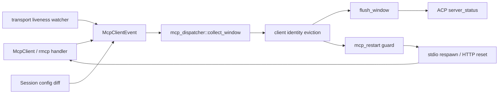
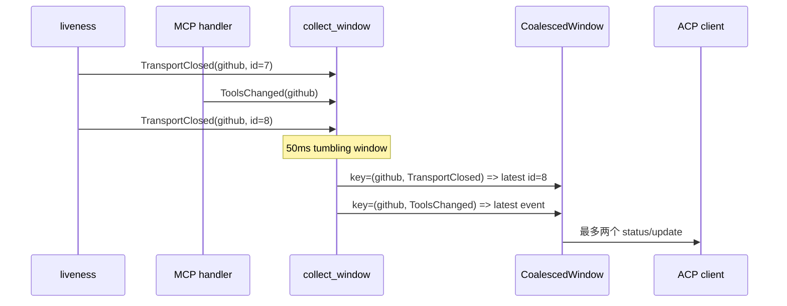
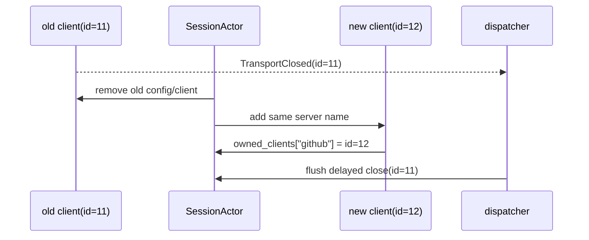
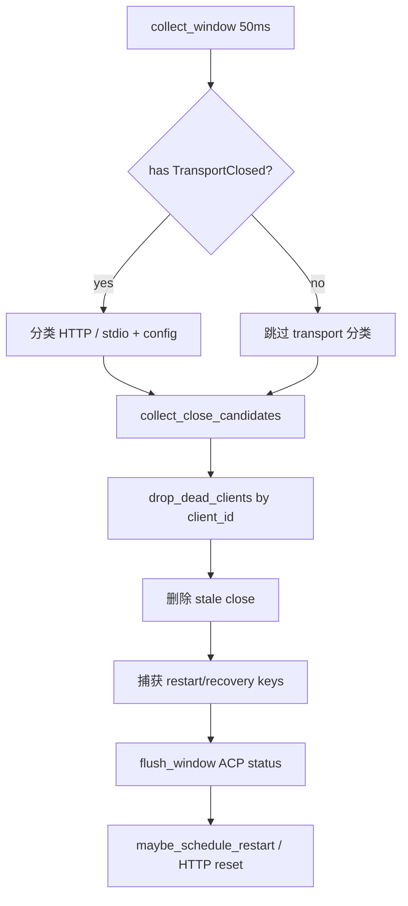

# 源码精读：MCP Dispatcher 如何把异步事件变成可靠的状态协议

[mcp-lifecycle.md](./mcp-lifecycle.md) 解释 MCP server 怎样连接、握手、注册工具和调用。本篇只研究连接成功之后的控制面：一个 server 断线、配置被删除、工具列表变化或认证失败时，事件如何经过 `mcp_dispatcher` 变成 ACP `x.ai/mcp/server_status`，以及何时触发恢复。

这条路径看似只是“转发状态”，实际上承担了四个并发不变量：

1. 高频事件要合并，但不能丢掉能识别旧 client 的 identity；
2. 旧 transport 的迟到 close 不能删除同名的新 client；
3. 用户主动删除与进程意外崩溃必须产生不同的 restart 语义；
4. stdio、普通 HTTP/SSE、managed connector 的恢复策略不能混用。

## 1. 先画出 owner 边界



| 对象 | 权威 owner | 本篇关心的接口 |
|---|---|---|
| 一个连接的状态 | `xai-grok-mcp::McpClient` | `ClientStateKind`、`client_id()`、`liveness_check()` |
| 事件来源 | client / liveness / SessionActor | `McpClientEvent` |
| 事件合并和 ACP payload | `session/mcp_dispatcher.rs` | `collect_window`、`flush_window`、`run_dispatcher` |
| restart/backoff | `session/mcp_restart.rs` | `maybe_schedule_restart`、`auto_restart_stdio` |
| session 内的 server map | `McpState` | `owned_clients`、`configs`、disabled set |

Dispatcher 不拥有 MCP 工具 registry，也不直接执行 `tools/call`。它只维护事件的短暂控制面状态，向 ACP 推送状态，并把合适的失败交给恢复层。

## 2. 事件类型是一个小型协议

`McpClientEvent` 的变体在 [servers.rs](../../crates/codegen/xai-grok-mcp/src/servers.rs) 定义，当前主要有：

| 事件 | 来源 | Dispatcher 的默认含义 |
|---|---|---|
| `Ready` | `ensure_initialized` 成功 | 首次 handshake 完成 |
| `HandshakeFailed` | 初始化/重握手失败 | server unavailable 或 managed auth required |
| `TransportClosed` | Ready client 的 one-shot liveness watcher | transport 意外关闭，可能需要恢复 |
| `ToolsChanged` | server 推送 `tools/list_changed` | registry/snapshot 需要刷新 |
| `ResourcesChanged` | server 推送 resource 变化 | UI/catalog 需要刷新 |
| `ConfigDiff` | SessionActor 更新配置 | 在 dispatcher 内拆成每 server 的 added/removed |

事件不是最终线协议。`McpClientEvent` 带有内部信息（例如 `client_id`），而 ACP payload 要稳定、跨语言且面向客户端，因此中间必须经过 projection，而不是把 Rust enum 直接 `serde_json` 发出去。

## 3. 50ms tumbling window：合并什么，保留什么

### 3.1 采集算法

`collect_window` 的算法在 [mcp_dispatcher.rs](../../crates/codegen/xai-grok-shell/src/session/mcp_dispatcher.rs)：

1. 阻塞等待第一个事件；channel 关闭则结束 dispatcher；
2. 以当前时间加 `COALESCE_WINDOW = 50ms` 建立 deadline；
3. deadline 前继续接收事件；
4. 以 `(server_name, event_kind)` 为 key 写入 `HashMap`，后到事件覆盖先到事件；
5. `ConfigDiff` 在插入阶段 fan-out 成 `ConfigAdded` / `ConfigRemoved`，下游不用再解释全局 diff。



最后写入优先适合 ACP 状态推送，但仅保留最后一个 close identity 会有竞态：id=7 可能是当前 client，id=8 可能是已经被替换的旧 client。因此 `CoalescedWindow` 同时维护：

```text
buf:
  (server, kind) -> latest event       # wire dedup

closed:
  server -> { every TransportClosed client_id in this window }
                                      # eviction evidence
```

这是一个重要的“两个视图”：不能为了减少内存而删除 `closed`，也不能把 `closed` 中的每个 id 都直接推到 ACP。

### 3.2 ConfigDiff 为什么要拆成 per-server

`McpState::update_configs_diff` 一次可能包含 added、removed、retained 多个名字。Dispatcher 把它拆成独立事件后：

- 每个 server 都有自己的 `status` 和 `reason`；
- 同一 server 的 add/remove 可以按 key 合并；
- `ShutdownState` 可以精确标记被用户删除的 server；
- restart 层无需理解配置 diff 的集合语义。

如果新事件携带多个 server，优先在 `insert_event` 处 fan-out，而不是让 `build_payload` 里循环发包。后者会让 coalescing 失效，也会让 status 顺序无法测试。

## 4. Client identity：防止旧 close 误杀新 client

### 4.1 为什么 server name 不够

配置变更可能产生下面的时间线：



如果 dispatcher 只按 `"github"` 删除，id=11 的迟到事件会把健康的 id=12 一并删掉，并错误触发 unavailable/restart。

### 4.2 `drop_dead_clients` 的三种结果

`collect_close_candidates` 只把非 HTTP 的 `TransportClosed` 送入 eviction。然后 `drop_dead_clients` 在 `McpState` lock 内比较：

```text
closed_ids contains current.client_id()
  -> remove owned_clients[server]
  -> close is real, keep status/restart path

current exists, but id does not match
  -> return server as stale
  -> remove TransportClosed from window
  -> no unavailable push, no disconnect telemetry, no restart

current does not exist
  -> no-op eviction
  -> close status remains meaningful
```

“stale”必须在 status flush 前剔除。只是不删除 map 里的 client 还不够，因为 UI 仍会看到错误的 unavailable，restart 仍可能重新 spawn 一个重复进程。

测试入口在 `mcp_dispatcher.rs` 和 [mcp_dispatcher_e2e_tests.rs](../../crates/codegen/xai-grok-shell/src/session/mcp_dispatcher_e2e_tests.rs)：重点测试“当前 close 先到、旧 close 后到”和“旧 close 对 replacement 不产生任何副作用”。

## 5. `flush_window`：内部事件到 ACP payload

### 5.1 状态和 reason 要分开

`McpServerStatusPayload` 包含 `status` 和 `reason` 两个字段。status 是当前可用性，reason 是本次变化的原因：

| Event | `status` | `reason` | 说明 |
|---|---|---|---|
| `Ready` | `ready` | `initialized` | 首次 `ensure_initialized` 成功 |
| `TransportClosed` | `unavailable` | `transport_closed` | 传输死亡，不等于用户删除 |
| 普通 `HandshakeFailed` | `unavailable` | `handshake_failed` | detail 保留错误原因 |
| managed auth rejection | `needsAuth` | `auth_expired` | 客户端需要重新认证 |
| `ConfigAdded` | `initializing` | `config_added` | 已配置，握手尚未完成 |
| `ConfigRemoved` | `unavailable` | `config_removed` | 用户/配置主动移除 |
| `ToolsChanged` / `ResourcesChanged` | `ready` | `config_changed` | 连接仍可用，但目录需要刷新 |

不要把 `Ready` 直接映射成 `restart_succeeded`。代码把“第一次初始化成功”和“自动重启成功”分成两个 reason，客户端才能区分首次加载与恢复。

### 5.2 Managed 与 local 的 auth 分支

`classify_source` 用 `grok_com_` 前缀判断 managed connector。只有 managed server 的 handshake error 经过 `is_auth_rejection_message` 后，才映射为 `NeedsAuth/AuthExpired`；local server 即使错误文本包含 401，也仍是普通 unavailable/handshake_failed。

这个判断必须与 managed reactive reauth 使用同一 classifier，否则会出现“UI 显示需要登录，但恢复层不尝试刷新”或反过来的漂移。

`detail` 对 handshake failure 保留完整原因，便于调试；新增日志/ACP consumer 时要注意这与一般 telemetry 脱敏策略不同，不要把 payload 直接复制到公开指标或持久化用户数据。

## 6. `run_dispatcher` 的固定顺序



顺序不能任意交换：

1. 先 eviction，再 status：避免已经替换的旧 close 被报告成 unavailable；
2. 在消费 `buf` 前捕获 restart keys：避免为了不 clone event 而漏掉恢复候选；
3. `flush_window` 只负责 wire push 和 shutdown set；实际 respawn 由 restart layer 完成；
4. dispatcher channel 关闭时取消 `restart_cancel`，防止 session 关闭后 backoff task 还在向已销毁的 ACP gateway 发消息。

dispatcher 通过 `spawn_local` 运行，因为 `AcpAgentGatewaySender` 和生产 `RestartActions` 可能是 `!Send`。把它改成 `tokio::spawn` 不是机械优化，而是会改变 LocalSet/actor 线程边界；先证明所有捕获值满足 `Send + 'static`，并重新检查 session ownership。

## 7. stdio、HTTP 和 managed recovery 不能混用

### 7.1 stdio：替换 client

stdio child 使用 `kill_on_drop(true)`。真实 transport death 时，dispatcher 可以移除 dead `Arc<McpClient>`，由 `maybe_schedule_restart` 进入最多三次 backoff：

```text
attempt 1: +1s
attempt 2: +4s (累计 5s)
attempt 3: +16s (累计 21s)
```

每次重试前都重新检查“仍配置且启用”。成功时只由 `auto_restart_stdio` 发 `RestartSucceeded`；失败时发 `RestartFailed`，三次耗尽后 unregister server tools，防止模型继续调用一个已经没有实现的名字。

### 7.2 普通 HTTP/SSE：保留 Arc，原地 reset

HTTP transport 不进入 stdio eviction；`recoverable_http_servers` 只选择配置中仍启用、非 managed 的 HTTP/SSE server。恢复层调用 `reset_http_client`，保留 `owned_clients` 中的 `Arc`，从而保留工具对象和 qualified names。

如果 `recoverable_http_servers` 与 `is_http_server_configured` 的 predicates 不一致，就会出现既不 evict 又不 recover 的 orphan client。新增 transport 或 disabled 语义时，这两个函数必须一起改、一起测。

### 7.3 Managed connector：认证恢复优先

managed server 的 headers/token 由 managed config/reactive reauth 管理。它不应因为一个 auth rejection 被当成普通 stdio 重启；典型状态流是：

```text
HandshakeFailed(auth rejection)
  -> NeedsAuth/AuthExpired status
  -> re-fetch managed token/config
  -> swap client + handshake
  -> ManagedTokenRefreshed
```

“传输重启”和“凭据刷新”是两个不同的副作用和 telemetry 维度。贡献时不要只把两者都包装成 `RestartSucceeded`。

## 8. `ShutdownState`：用户意图与故障分离

`ShutdownState` 有两个集合：

| 集合 | 写入 | 读取 | 目的 |
|---|---|---|---|
| `shutting_down` | `ConfigRemoved` flush；`Ready` 清除 | restart guard | 阻止被用户删除的 server 复活 |
| `in_flight_restart` | schedule 前原子 claim | 后续事件 | 同一 server 只允许一个 restart task |

关键规则：`TransportClosed` **不能**写入 `shutting_down`。如果它也写入，随后的 `maybe_schedule_restart` 会把每次崩溃都看成 intentional teardown，auto-restart 永远不会启动。

restart task 通过 `RestartInFlightGuard` 的 `Drop` 释放 claim，覆盖成功、失败、取消和 panic 路径。没有 RAII 的话，一个失败 task 留下的名字会永久阻止未来恢复。

## 9. 测试如何对应不变量

先按纯函数/事件层阅读测试，再看真实 session wiring：

| 不变量 | 测试入口 | 证据 |
|---|---|---|
| 同 key last-write-wins | `collect_window` tests | 50ms 内同 server/kind 只剩一个 wire event |
| ConfigDiff fan-out | `project_config_change_emits_per_server_status_for_added_and_removed` | 一个集合 diff 产生多个 per-server payload |
| payload mapping | `payload_maps_transport_closed_to_unavailable`、auth mapping tests | status/reason/detail 的稳定 JSON 语义 |
| 当前 client 才能被 evict | `drop_dead_clients` async tests | id match 删除，stale id 保留 replacement |
| HTTP 不走 stdio restart | `collect_close_candidates_keeps_http_transport_closed` | HTTP close 进入 in-place recovery 集合 |
| auto restart 去重/guard | `mcp_dispatcher_e2e_tests.rs` | start_paused 时间推进、配置删除、重试次数和 status push |
| liveness 不误报 | `xai-grok-mcp/src/liveness.rs` | 非 Ready 状态静默退出，Ready+closed 才发 close |

这些测试大量使用 `#[tokio::test(start_paused = true)]`。贡献者不应该用真实 `sleep(21s)` 测 backoff；使用 paused clock、mock `RestartActions` 和明确的 expectation barrier，才能分别证明每个 guard。

## 10. 改 dispatcher 的贡献路线

### 只改 wire payload

先改 `McpServerStatusPayload`/enum，再检查：

```text
build_payload
  -> serde snapshot / existing ACP consumer
  -> pager MCP status model
  -> managed/local auth mapping
```

如果新增 reason，必须说明旧客户端看到未知 enum 时的行为；若采用可选字段，验证缺失字段的反序列化。

### 改合并策略

先写 `CoalescedWindow` 的纯逻辑测试，再看 `run_dispatcher`。明确回答：

- 哪些字段允许 last-write-wins；
- 哪些 identity/ack 必须累积；
- ConfigDiff 是否需要 fan-out；
- stale 事件是否完全从 status、telemetry、restart 三条路径剔除。

### 增加 transport 或恢复方式

同时更新四层：

1. `McpClientEvent` / liveness source；
2. dispatcher 的 transport classification 和 eviction/recovery 分流；
3. restart actions 的 guard/backoff/取消；
4. ACP payload、snapshot/reminder、集成 fixture。

不要只让新 transport “能握手”：模型可发现、工具调用、断线状态和 session shutdown 都是同一个功能的组成部分。

## 11. 调试一条具体事件

假设 server 名是 `github`，按这条证据链搜索：

```text
McpClientEvent emitted
  -> collect_window key=(github, kind)
  -> closed identity captured?
  -> current owned_clients id match?
  -> stale key removed?
  -> build_payload status/reason
  -> ACP x.ai/mcp/server_status
  -> restart gate or HTTP reset
```

| 最后看到的证据 | 下一步 |
|---|---|
| 有 close，但没有 status | `drop_dead_clients` 是否把事件判成 stale；channel 是否关闭 |
| status 是 unavailable 但应是 needsAuth | server 是否 managed 前缀；auth rejection classifier 是否一致 |
| restart 从不出现 | `shutting_down` 是否误标；stdio configured predicate 是否为 false |
| 同名 replacement 被删除 | close identity 是否在 `closed` 累积，当前 `client_id` 是否匹配 |
| HTTP client 既不删也不恢复 | `recoverable_http_servers` 与 SessionActor recovery gate 是否漂移 |
| shutdown 后还收到 ACP push | dispatcher cancellation 是否传给 restart backoff task |

## 12. 相关阅读

- [MCP 生命周期](./mcp-lifecycle.md)：配置、握手、tools/list、snapshot/reminder 和调用路径；
- [工具调用](./tool-call-pipeline.md)：MCP registration 之后如何经过 permission、ToolBridge 和 ChatState；
- [Leader 控制面](./leader-control-plane.md)：ACP/本地 client 连接断开时的另一套 identity/routing 边界；
- [认证与模型选择](./authentication-and-model-resolution.md)：session auth、managed token 和 turn 级恢复的分层；
- [贡献者工作流](./contributor-workflow.md)：异步 actor、mock fixture、取消和协议证据的选择。
