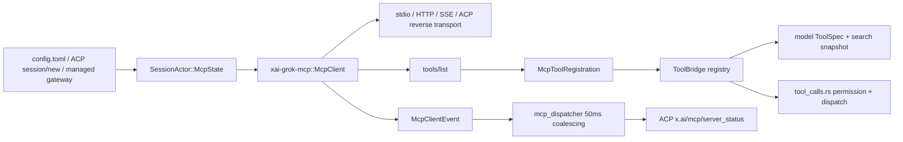
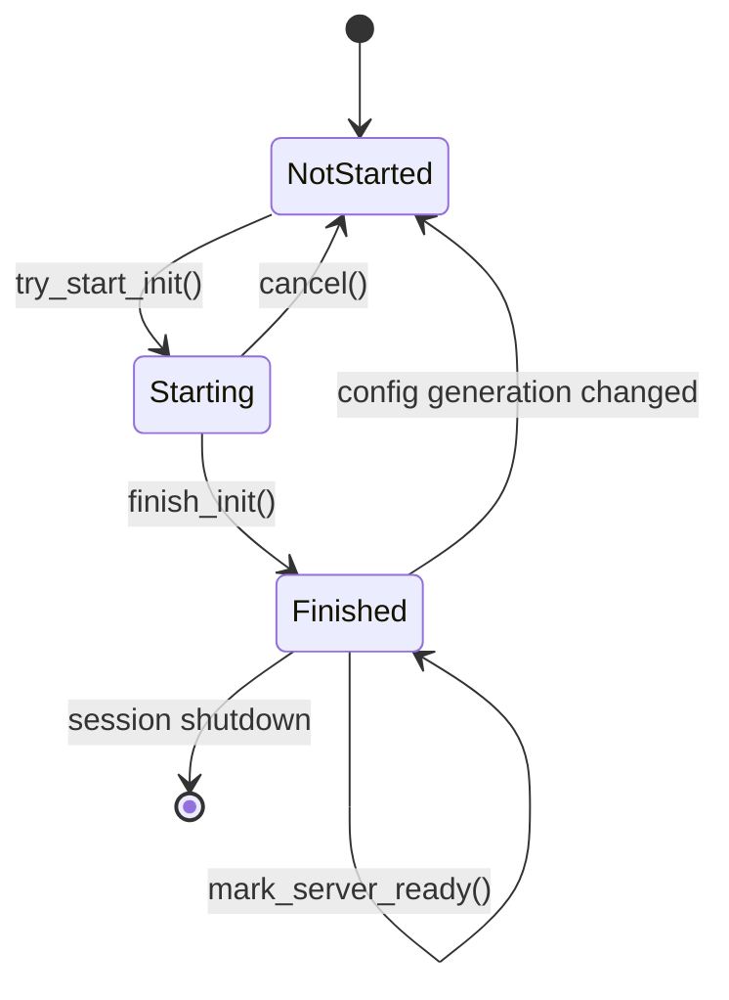
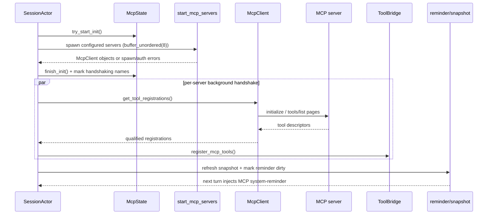
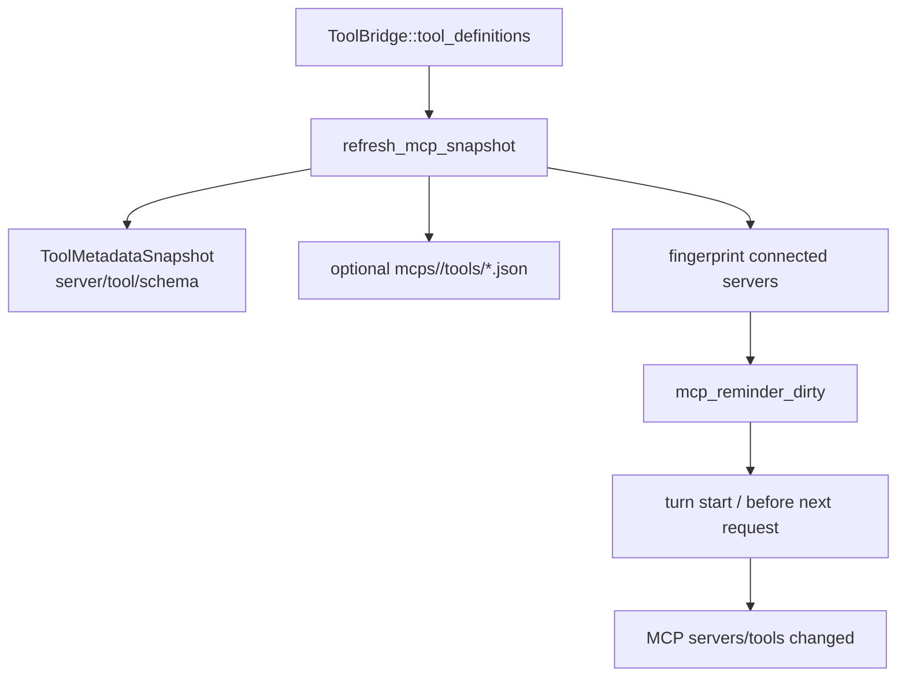
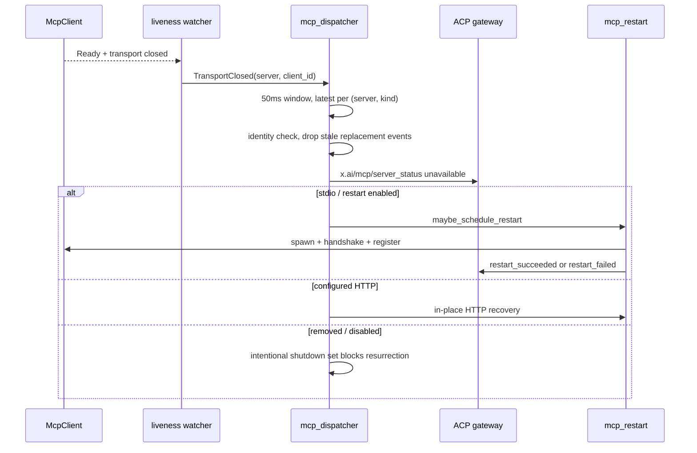

# 源码精读：MCP 从配置到工具调用的完整生命周期

MCP（Model Context Protocol）在本项目中不是一个“把 URL 放进配置就完事”的客户端。它横跨配置解析、Session 初始化、外部进程/HTTP 传输、工具注册、提示词提醒、权限决策和断线恢复。

本文追踪一个 MCP server 从配置出现到模型能够调用工具，再到 server 断线或配置变更的完整控制流。重点源码：

- [`xai-grok-mcp/src/servers.rs`](../../crates/codegen/xai-grok-mcp/src/servers.rs)：传输、client 状态、握手、`tools/list` 和 `tools/call`；
- [`xai-grok-shell/src/session/acp_session_impl/mcp.rs`](../../crates/codegen/xai-grok-shell/src/session/acp_session_impl/mcp.rs)：SessionActor 侧初始化、注册和提醒；
- [`mcp_snapshot.rs`](../../crates/codegen/xai-grok-shell/src/session/acp_session_impl/mcp_snapshot.rs)：模型可见工具快照；
- [`mcp_dispatcher.rs`](../../crates/codegen/xai-grok-shell/src/session/mcp_dispatcher.rs)：状态事件合并、ACP 通知和重启入口；
- [`xai-grok-mcp/src/liveness.rs`](../../crates/codegen/xai-grok-mcp/src/liveness.rs)：传输存活探测。

## 1. 先建立边界



几个“不应该混淆”的所有者：

| 对象 | 所有者 | 责任 |
|---|---|---|
| `McpState` | SessionActor | 当前配置、owned/shared clients、初始化 generation、禁用工具和失败状态 |
| `McpClient` | `xai-grok-mcp` | 一个 server 的 transport、rmcp service、握手并发和工具调用 |
| `ToolBridge` | Agent/Session | 把注册结果接入统一工具 registry，供模型和运行时发现 |
| `ToolMetadataSnapshot` | SessionActor | search 工具、MCP reminder 和 UI/描述器使用的轻量索引 |
| `McpClientEvent` | client → dispatcher | ready、断线、工具列表变化等控制面事件 |

模型不会直接访问 MCP socket。模型只看到经过 `ToolBridge` 注册后的 qualified tool；真正的 transport 调用仍由宿主运行时完成。

## 2. 配置从哪里来

本地 MCP 通常来自用户或项目配置中的 `[mcp_servers.<name>]`，在 shell 的 `util::config::load_mcp_servers` 中转换成 ACP `McpServer`。此外还有三类输入：

1. **ACP session metadata**：客户端可以通过 `x.ai/mcp/servers` 声明进程内 SDK server；
2. **managed gateway**：服务端下发的 `grok_com_` 前缀 connector，由 managed MCP cache 维护 token 和 headers；
3. **插件/产品 UI**：Pager 通过 `x.ai/mcp/upsert`、`toggle`、`auth_trigger` 等扩展请求修改配置，最终仍回到 Session 的 config diff。

配置不是 `McpClient` 的直接输入。Session 建立时会同时准备普通 `configs`、MCP meta overrides、OAuth config map 和可能的 ACP reverse invoker，再放进 `McpState`。

## 3. 两个状态机：池和单 client

### 3.1 `McpState::InitProgress`



`Finished` 不代表每一个 server 已经完成握手。`InitProgress` 还携带 `handshaking` 集合，因此：

- `is_initializing()`：初始化尚未结束，或后台握手仍在进行；
- `has_finished_init()`：外层 `finish_init()` 已经触发；
- `is_initialized()`：只有 `Finished { handshaking: empty }` 才为真。

这个设计允许普通文件工具先工作，不必被一个慢 MCP server 阻塞；但 MCP 工具路径仍可等待 `wait_for_mcp_initialized`，避免在 handshake 中间调用。

### 3.2 `McpClient::ClientState`

```text
Empty         没有可复用 transport（stdio 失败后通常到这里）
Pending       有 transport，等待一次握手
Initializing  某个 task 正在握手，其他 caller 必须等待 init_done
Ready         持有 rmcp RunningService，可 list/call tool
```

`ensure_initialized()` 的关键并发不变量是：同一个 client 只能有一个 handshake owner。并发 caller 看到 `Initializing` 时等待通知，不会启动第二个 rmcp service。若 owner 被取消，`InitGuard` 尽力恢复 transport，使后续 caller 可以重试。

## 4. 初始化时序



源码中的重要顺序：

1. `ensure_mcp_tools_initialized` 在 `McpState` 锁内抢 `try_start_init`，并读取当前 `generation`；
2. 锁外并发创建 stdio/HTTP client，最多由 `buffer_unordered(8)` 控制启动并发；
3. generation 若在等待期间改变，旧初始化结果全部丢弃，不能把旧配置的工具注册到新 session；
4. 每个 `get_tool_registrations` 有独立 startup budget，成功或失败都要 `mark_server_ready`，否则池会永久保持 handshaking；
5. 注册结束后刷新 snapshot，并设置 `mcp_reminder_dirty`，但不在任意后台 task 里直接修改模型 conversation。

## 5. 三种常规 transport

### stdio

`start_mcp_server` 创建 child command，设置 `kill_on_drop(true)`，把环境变量写入进程，并通过 `SafeTokioChildProcess` 接入 rmcp。stderr 被单独 drain 到 `~/.grok/logs/mcp/<server>.stderr.log`，避免外部 server 的诊断输出污染 ACP stdout。

### HTTP / SSE

HTTP 和 SSE 配置先做 session placeholder 展开、Authorization 检查和 OAuth discovery。没有 Authorization 时，`discover_and_prepare_auth` 可能返回：

- `ManagerReady`：创建带认证 manager 的 HTTP client；
- `NoOauthSupport`：创建普通 HTTP client；
- `NeedsInteractiveLogin`：不启动一个注定收到 401 的 worker，返回 `AuthRequired`。

### ACP reverse MCP

`xai/mcp/servers` metadata 注册进程内 SDK server，调用通过 `x.ai/mcp/sdk_call` 反向穿过 ACP gateway。它没有独立 socket，但在 `McpState::acp_mcp` 中和普通 server 一样参与 pending、握手、tools/list 和 ToolBridge 注册。

## 6. `tools/list` 到模型可见工具

`McpClient::get_tool_registrations` 会循环处理分页 cursor，并把每个 MCP tool 转为 `McpToolRegistration`：

```text
MCP name:             create_issue
qualified name:      github__create_issue
model-visible schema: { type: "object", properties: ... }
runtime implementation: McpTool { server_name: "github" }
```

这里有几个兼容性保护：

- `validate_tool_name` 使用跨供应商最严格的正则，非法名字跳过注册；
- 空或不完整的 `inputSchema` 补 `type: object` 和空 `properties`，避免下游 API 拒绝；
- qualified name 使用 `server__tool`，server 前缀隔离同名工具；
- `model_visible == false` 的 app-only tool 不进入模型工具数组，但仍可保留 UI metadata；
- `disabled_tools` 的 registration 暂存到 `disabled_tool_registrations`，重新启用时不必重新握手；
- tool timeout 配置按未限定的 raw tool name 匹配，拼写不匹配会打日志提醒。

SessionActor 的 `register_mcp_tool` 再做两件事：调用 `ToolBridge::register_mcp_tools`，并把带 `meta.ui.resourceUri` 的工具加入 Pager 可见的 UI tool catalog。工具注册成功并不等于模型已经知道 server；这需要下一节的 snapshot/reminder。

## 7. Snapshot、descriptor 和 system reminder



snapshot 是索引，不是第二份 registry。`mcp_snapshot.rs` 从 ToolBridge 当前 definitions 收集 qualified name、server、description、参数和 JSON schema，同时合并 managed gateway catalog；它再更新 search 资源并标记 reminder dirty。

如果启用了 external harness，`McpClient::materialize_descriptors` 会分页读取 `tools/list`，先在内存序列化，再使用临时文件 + rename 原子写入 descriptor。不要在 async runtime 中直接执行大量 `std::fs`；源码把写入放进 `spawn_blocking`。

`maybe_inject_mcp_reminder` 在 turn start 和 loop 内 request 构建前运行，支持 `Delta` / `Full` 两种模式，并用 server fingerprint 去重。这样 mid-turn 新连接的 server 也会在下一次 inference 前被模型看到，但不会把每次工具调用都重复注入完整目录。

## 8. 工具调用如何回到 MCP

模型产生 `github__create_issue` 后，普通 Agent Loop 仍先走 `tool_calls.rs`：schema 校验、`AccessKind::MCPTool`、permission gate、ToolBridge dispatch。MCP tool implementation 再从 qualified name 拆出 server 和 raw tool name，调用 `McpClient::call_tool`。

```text
assistant ToolCall("github__create_issue", args)
  -> ToolInput::MCPTool
  -> AccessKind::MCPTool { name, input }
  -> permission manager
  -> ToolBridge registry lookup
  -> McpTool::call
  -> McpClient::ensure_initialized
  -> rmcp CallToolRequest
  -> MCP CallToolResult
  -> MCPOutput / ToolResult
  -> ChatState + next sampling
```

因此 MCP server 的网络错误、超时和 auth rejection 仍是 tool result/error，不应被 UI 层伪装成模型回答。权限拒绝的语义见 [permissions-and-sandbox.md](./permissions-and-sandbox.md)。

## 9. 动态配置与 generation

配置变更不是简单地重建所有 clients。`McpState::update_configs_diff` 将 server 分为 `added`、`removed`、`retained`：

| 变化 | client 行为 |
|---|---|
| retained 且配置字节相同 | 保留同一个 `Arc<McpClient>` 和 transport |
| removed | 标记 intentional shutdown，丢弃旧 client，不得自动重启 |
| added | 创建新 client，接入同一初始化/注册流程 |
| changed | 移除旧 client，按新配置重新握手 |

`generation` 是旧异步初始化的栅栏。配置在 handshake 中变化时，后台 task 发现 generation 不一致就发 `McpInitCancelled` 并丢弃结果；否则旧工具可能“复活”到新配置里。

## 10. 断线、事件合并和恢复



`liveness.rs` 的 watcher 是 one-shot：只对 `Ready + transport closed` 发事件，`Pending/Initializing/Empty` 都静默退出，避免重握手过程产生假断线。事件带 `client_id`，dispatcher 在删除 `owned_clients` 前核对 identity；旧 client 的迟到 close 不能杀掉同名的新 client。

dispatcher 的 50ms tumbling window 按 `(server, McpClientEventKind)` 合并，防止一个 server 连发 100 个 `tools/list_changed` 时刷屏。它还区分：

- stdio：可以自动重启，重启 task 有 in-flight 去重和取消 token；
- 普通 HTTP：可以原地 recovery；
- managed HTTP：优先走 token re-fetch/reactive reauth；
- config removed / toggle disabled：必须跳过自动重启。

## 11. OAuth 和 managed reauth

OAuth credential store 位于 `xai-grok-mcp/src/credentials.rs`，OAuth 流程在 `oauth.rs`，MCP HTTP client 只消费准备好的 auth manager。工具调用得到 auth rejection 后，SessionActor 的 `reactive_managed_reauth` 会：

1. 检查 session 是否拥有该 client，避免子 agent 替父 agent 换共享 Arc；
2. 检查 cooldown，合并并发的失败；
3. bypass stale cache 重新获取 managed config/headers；
4. swap client、重新 handshake、更新 snapshot；
5. 成功发 `ManagedTokenRefreshed`，终止失败标记为 `NeedsAuth`。

这条路径是“认证恢复”，不等同于 transport restart；日志和 wire reason 也刻意区分二者。

## 12. 调试路线

给定 server 名 `github`，按下面证据顺序搜索：

```text
config resolved
  -> mcp_start_one_server / McpServerStarting
  -> ensure_initialized / initialize
  -> mcp_list_tools / MCP handshake succeeded
  -> Registered MCP tool github__...
  -> mcp snapshot updated
  -> x.ai/mcp/server_status ready
  -> ToolInput::MCPTool / tool.decision
  -> mcp CallToolResult
```

| 最后证据 | 优先查看 |
|---|---|
| 没有 `McpServerStarting` | config loader、disabled list、managed merge |
| spawn 失败 | command/PATH/env、`SafeTokioChildProcess`、stderr log |
| handshake 超时 | client state、startup timeout、server stderr |
| handshake 成功但工具缺失 | name validation、pagination、disabled/model_visible |
| registry 有工具但模型看不到 | snapshot/reminder、tool definitions、prompt template |
| 工具调用后无结果 | permission、qualified name split、MCP timeout |
| 断线后状态错误 | client_id、dispatcher coalesce、intentional shutdown |

## 13. 源码练习和测试

先做只读练习，不需要启动真实 MCP server：

1. 用 `validate_tool_name` 写出 5 个合法/非法名字，并解释为什么跨供应商取交集；
2. 给 `InitProgress` 画出 `Starting` 但 `finish_init` 已触发时的两个布尔值；
3. 用三个 `McpClientEvent` 推演 50ms window 的最终 buffer；
4. 给同名 server 的旧/new `client_id` 设计一个 stale close 测试；
5. 从一个 `McpToolRegistration` 反查 ToolBridge、snapshot 和 reminder 的三个消费者。

源码测试入口：

- `xai-grok-mcp/src/servers.rs`：名称校验、state transitions、config diff、transport reset；
- `xai-grok-mcp/src/liveness.rs`：Ready/closed 与 transient state 的 watcher contract；
- `xai-grok-shell/src/session/mcp_dispatcher.rs`：50ms coalescing、stale close、config diff fan-out；
- `xai-grok-shell/src/session/acp_session.rs`：fixture MCP tool 注册和 snapshot 更新。

贡献新 MCP transport 或字段时，必须同步检查 wire compatibility、permission `AccessKind::MCPTool`、ToolBridge registry、snapshot/reminder、status dispatcher 和恢复路径；只改 `xai-grok-mcp` 往往会留下“能连接但模型不可发现”或“能调用但断线后状态错误”的半成品。
