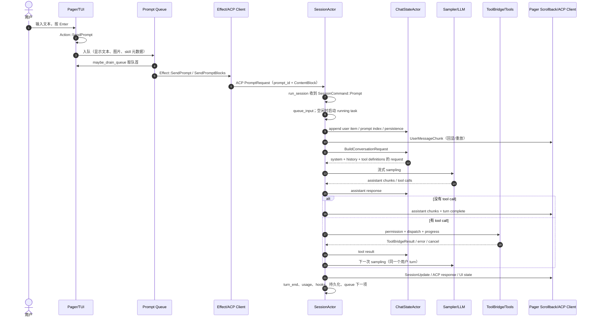
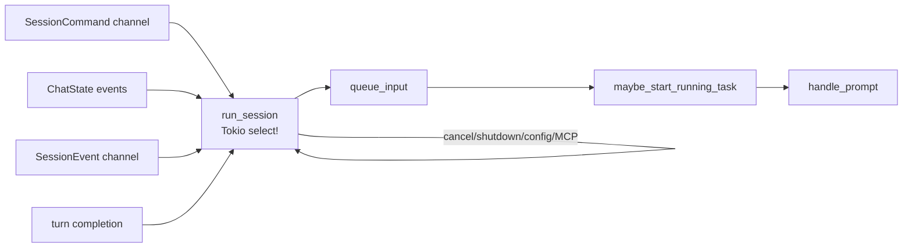
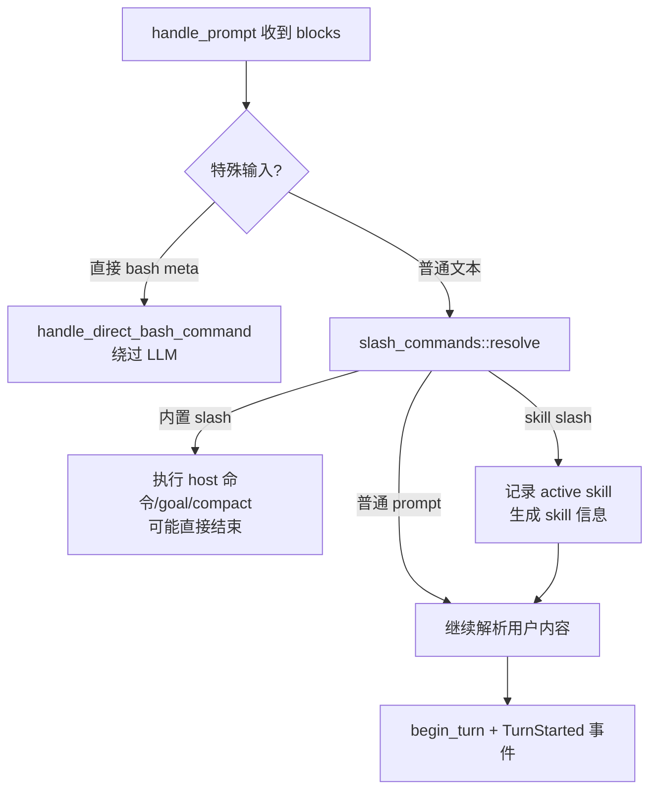
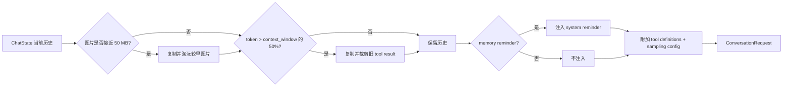
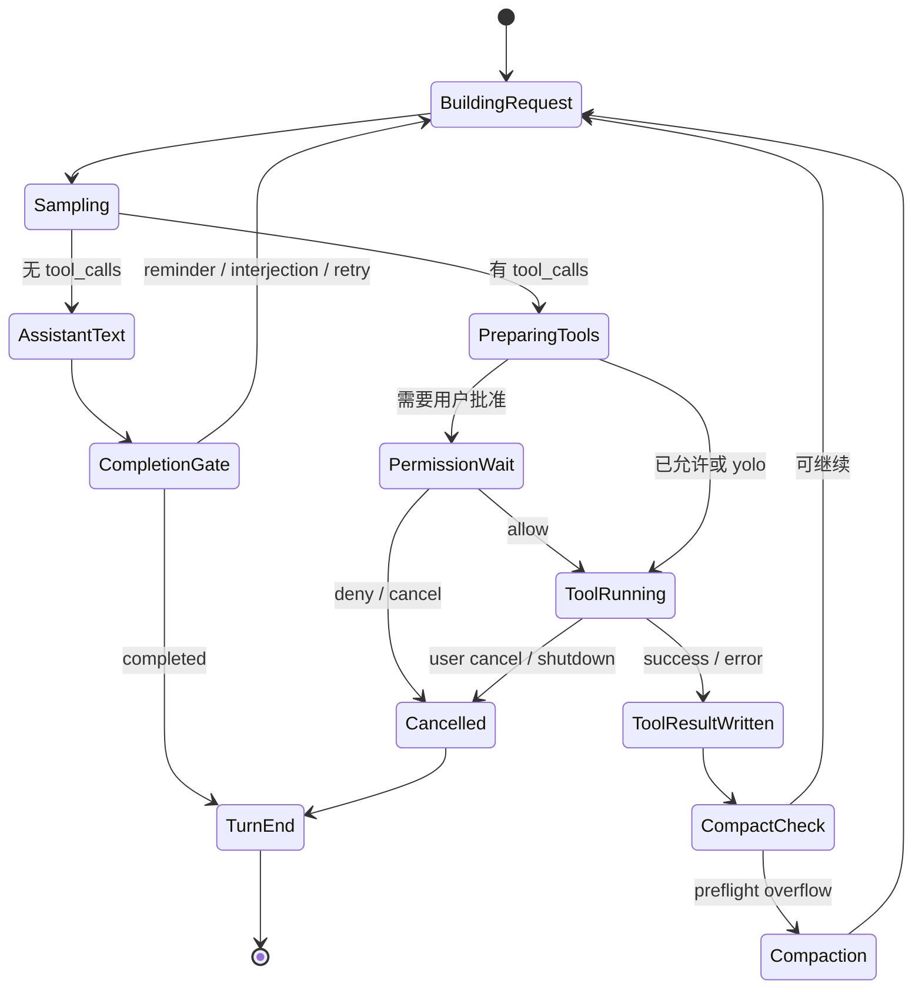
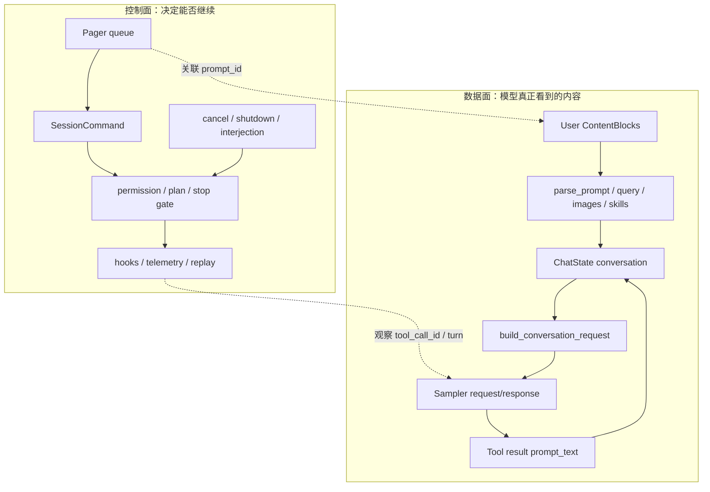

# 源码精读：用户发送一条消息后的完整流程

本文回答一个最适合入门源码的问题：**用户在终端输入一句话并按下发送后，系统到底做了什么？**

我们以普通 TUI 交互、已有 session、没有立即取消为主线；同时标出 headless、ACP、图片、skill、slash command、工具调用和上下文超限的分叉。阅读目标是能从一个 `prompt_id` 出发，解释它如何经过 UI、队列、ACP、SessionActor、ChatState、Sampler、ToolBridge，最后回到界面。

相关专题：

- [02-architecture.md](../02-architecture.md)：组件分层和 Actor 拓扑；
- [03-agent-loop.md](../03-agent-loop.md)：采样与工具的循环；
- [04-context-management.md](../04-context-management.md)：ChatState、pruning、compaction；
- [tool-call-pipeline.md](./tool-call-pipeline.md)：工具调用的细节和新增工具清单。
- [permissions-and-sandbox.md](./permissions-and-sandbox.md)：工具调用进入权限策略和 OS 沙箱后的安全边界；
- [pager-rendering.md](./pager-rendering.md)：ACP 更新如何回到 `RenderBlock`、scrollback 和终端画面。

---

## 1. 一张全景图

下面的图不是“一个函数调用”，而是三个异步边界和两个状态所有者之间的消息流。箭头表示消息或 effect，不表示同步调用栈始终保持不变。



最重要的心智模型：

1. **Pager 的 scrollback 不是模型上下文的权威源**；它负责用户看到什么和如何恢复显示。
2. **SessionActor 不等于模型**；它编排一个 turn，决定何时采样、执行工具、取消或结束。
3. **ChatStateActor 才拥有 conversation**；下一次请求由它根据历史和预算构建。
4. 一条用户消息可能触发多次模型请求，但仍属于一个 `handle_prompt` / turn。

---

## 2. 阶段 0：按下 Enter 到 `Action::SendPrompt`

### 2.1 输入层只产生意图

键盘处理最终产生 `Action::SendPrompt(String)`（定义在 `xai-grok-pager/src/app/actions.rs`）。路由器在 [dispatch/router.rs](../../crates/codegen/xai-grok-pager/src/app/dispatch/router.rs) 的 `Action::SendPrompt` 分支调用 `dispatch_send_prompt`。

这里仍然没有请求模型。UI 层可以在这一步处理：

- 当前是否处于 Agent 视图；
- 草稿、历史、语音 interim 文本和图片附件；
- `SendPromptNow` / interjection 与普通发送的差别；
- 需要新建 session、恢复 session 还是复用当前 session。

用户按 Enter 后若当前 turn 尚未结束，消息通常不会丢失，而是进入队列。这个行为由 `queue.rs` 维护，避免 UI 事件循环被模型网络调用阻塞。

### 2.2 queue 的三个副作用

[queue.rs](../../crates/codegen/xai-grok-pager/src/app/dispatch/queue.rs) 的 `maybe_drain_queue` 只在 session idle 且没有阻塞条件时取队首。对普通 prompt，它会一次完成三件事：

```text
队列条目
  ├─ 写入 scrollback 的 UserPrompt（用户立即看到自己的消息）
  ├─ 记录 in_flight_prompt / turn_started_at / prompt index
  └─ 产生 Effect::SendPrompt 或 Effect::SendPromptBlocks
```

注意这三个动作的文本来源可能不同：

| 内容 | 供谁使用 | 可能包含什么 |
|---|---|---|
| `queued.text` | Pager 的显示 | 用户原文、合并后的气泡文本 |
| `wire_blocks` | ACP 请求 | skill 注入、结构化文本、图片块及 meta |
| `prompt_id` | 关联事件 | UI、SessionActor、tracing、完成响应的 join key |

普通纯文本走 `Effect::SendPrompt`；带图片、skill block 或 send-now 的消息走 `SendPromptBlocks`。不要用“scrollback 上看到的文字”推断模型真实收到的 payload。

### 2.3 图片和 Skill 为什么在 queue 阶段出现

queue 会在出 effect 前决定是否使用结构化 `ContentBlock`：

- 图片需要文字块 + image block，并传入 workspace cwd，以便恢复旧 session 中的图片占位符；
- skill 可能把运行时指令放入 wire blocks，但通过 meta 保存 `displayText`，让恢复/重放仍显示干净的用户文本；
- 多条合并 prompt 会附加 `combinedDisplayTexts`，保持 UI 气泡与真实请求的对应关系。

这是一种“显示面和数据面分离”的设计：模型需要额外上下文，用户不应被迫看到内部包装文本。

---

## 3. 阶段 1：Effect 层通过 ACP 发送

[effects/mod.rs](../../crates/codegen/xai-grok-pager/src/app/effects/mod.rs) 执行 `Effect::SendPrompt` 时会：

1. 创建一个普通文本 `ContentBlock`；
2. 调 `prompt_request_meta(&prompt_id, screen_mode)` 填充请求元数据；
3. 构造 `acp::PromptRequest`；
4. 经 `acp_send` 发送给当前 agent connection；
5. 把异步结果变成 Pager 的 `TaskResult::PromptResponse`，再由事件循环更新状态。

```rust
// 结构近似，实际代码还包含 tracing、错误格式化和 send-now meta。
let prompt = vec![plain_prompt_content_block(text, &skill_token_ranges)];
let request = acp::PromptRequest::new(session_id.clone(), prompt)
    .meta(prompt_request_meta(&prompt_id, screen_mode));
let result = acp_send(request, &acp_tx).await;
```

这里的 `acp_send` 是重要边界：Pager 不直接依赖 `SessionActor` 的私有字段，也不直接调用 sampler。TUI、headless 和 IDE 都可以通过 ACP/Session 接口复用同一套 agent 运行时。

### 3.1 ACP 请求携带的最小语义

`SessionCommand::Prompt`（[commands.rs](../../crates/codegen/xai-grok-shell/src/session/commands.rs)）接收的内容比“一个字符串”丰富得多：

| 字段 | 影响 |
|---|---|
| `prompt_id` | 完成响应、取消、日志和任务唤醒的关联键 |
| `prompt_blocks` | 文本、图片和结构化内容 |
| `prompt_mode` | 普通、interjection 等模式决策 |
| `verbatim` | 是否跳过用户查询包装和大 prompt 截断 |
| `json_schema` | 是否要求结构化输出 |
| `send_now` | 是否取消当前 turn 并把新消息优先调度 |
| `persist_ack` | 用户消息持久化屏障完成后的确认 |
| `parsed_prompt_tx` | 把解析后的 prompt 信息返回给调用方，供 metadata/trace 使用 |

调试 ACP/IDE 问题时，首先确认这些 meta 在发送端存在，接收端没有在跨 channel 时丢失。

---

## 4. 阶段 2：`run_session` 接收并调度 Prompt

`SessionActor` 的长生命周期事件循环在 [run_loop.rs](../../crates/codegen/xai-grok-shell/src/session/acp_session_impl/run_loop.rs) 的 `run_session`。它同时监听：



这个边界解释了两个常见现象：

- 发消息后 UI 可能立即显示用户消息，但模型任务尚未开始，因为它仍在 queue 或等待当前 turn 结束；
- cancel 是发给 session 的命令，不是 UI 线程直接杀一个随机 Tokio task。SessionActor 知道哪些子代理、前台命令、后台任务和通知也要收尾。

收到 `SessionCommand::Prompt` 后，事件循环大致做以下工作：

1. 若这是 task wake，先进行 actor-authoritative admission；被移除的队列项会用 `RemovedFromQueue` 方式回应，而不是伪造一次成功 turn；
2. `ensure_prefix_ready()`，保证 session 前缀/系统初始化已完成；
3. 用户输入清除 task-wake 抑制 gate，递增 `user_input_generation`，使旧的 laziness classifier 结果失效；
4. 通过 `queue_input` 放入 session 内部的 pending input；
5. 若 `send_now` 需要取消当前 turn，执行 `cancel_turn_for_send_now`；
6. `maybe_start_running_task` 在合适时启动 `handle_prompt`，结果通过 completion channel 回到 `run_session`。

`run_session` 因此是控制面；实际 prompt 解析和 sampling 在 turn 函数中完成。

---

## 5. 阶段 3：`handle_prompt` 的前处理

源码入口是 [turn.rs](../../crates/codegen/xai-grok-shell/src/session/acp_session_impl/turn.rs) 的 `handle_prompt`。它的前半段不是“马上请求模型”，而是在确定这次输入究竟要执行什么。

### 5.1 建立 turn 身份和生命周期

函数开始会记录 prompt 长度和 `shell.handle_prompt.start`，根据 `prompt_id` 判断是用户输入还是 synthetic input；然后：

- 确保 session 磁盘可写；
- 增加 turn/Prompt index；
- 设置 `is_turn_active` 和 `session_turn_active` guard；
- 通知 `xai-agent-lifecycle` 的 `on_turn_start` contributors；
- 处理 rewind 后同文再发（regeneration）与编辑后重试的 telemetry。

两个 guard 都是 RAII 思路：即使后面发生错误或取消，离开函数时也会清除 active 状态。阅读 Rust 时要注意“变量没有被显式使用”并不代表它没作用，它的 `Drop` 正在维护生命周期。

### 5.2 三个提前分叉



- **直接 bash**：输入被识别为特殊 bash 形式时，直接执行 shell；这不是模型决定调用 bash tool 的 agentic loop。
- **内置 slash command**：如 `/goal`、`/compact`、模型或 session 控制命令，可能由 host 完成并返回 `ok_end_turn`，不产生模型请求。
- **skill slash**：保留用户可见的原文，但为模型追加 skill information；plugin 来源也会记录 telemetry。

这就是为什么测试“发送字符串后应该调用模型”时，不能只测普通字符串，还要明确 slash/direct-bash 分支的预期。

### 5.3 给 UI 和持久化发用户回显

确认这是一轮需要模型的输入后，`handle_prompt` 会：

1. `events.begin_turn()` 并发送 `TurnStarted` 到内部事件和 Tool Protocol observability bridge；
2. 增加 ChatState prompt index，缓存 trimmed prompt text；
3. 调 `file_state_tracker.begin_prompt`；
4. 对每个原始 `ContentBlock` 产生 `Acp::UserMessageChunk`；
5. 根据 `UserEchoMode` 选择直接通知客户端或仅写入 persistence（例如某些合成/恢复场景）。

此时用户看到“我的消息已经出现”，但它仍可能尚未被模型采样。回显和推理是两个事件。

### 5.4 解析文本、规则、skill 和图片

`parse_prompt_with_skills` 把 blocks 拆为 `context`、`query`、skill information、images 和 harness 标记。随后：

- 从 query 中恢复磁盘上的 orphan image placeholder；
- 去掉不应暴露给模型的本地路径占位信息；
- 规范化图片并在必要时发出提示；
- 抽取 base64 图片，转换为 ACP 图片内容并从 query 文本中移除内嵌数据；
- 为大 prompt 计算截断/offload 需要的 metadata。

可以把结果想象成：

```text
原始 blocks
  ├─ context：用户引用/附件/环境信息
  ├─ query：真正的用户问题文本
  ├─ images：独立的图片内容，受大小预算控制
  └─ skill_information：给模型的运行时说明
```

不要在 UI 层自行复制这套解析。模型真正看到的是后续构造的 `ConversationItem::User` 和 system reminder；显示层保留的只是可读回显。

---

## 6. 阶段 4：把用户输入追加到 ChatState

`ChatStateHandle` 是一个轻量 channel handle，不持有 conversation 本身。它把 mutation 发给独占状态的 `ChatStateActor`：

```rust
// 近似调用形态；真正代码还会带 prompt 元数据、图片和持久化屏障。
self.chat_state_handle
    .push_user_message_and_ack(ConversationItem::User(user_item))
    .await;
```

关键 mutation 包括：

- `push_user_message` / `push_user_message_and_ack`；
- `push_assistant_response`；
- `push_tool_result`；
- `increment_prompt_index`；
- `record_model_call_usage`；
- `replace_conversation_for_compaction`。

“Handle 发消息，Actor 改状态”是本项目反复出现的 Rust 异步模式：调用者可以 clone handle 并跨 task 发送，但不能绕过 actor 直接改历史。`persist_ack` 让调用者知道用户消息及其磁盘 flush 已完成，再继续 trace snapshot 或 session/load 等需要读盘的操作。

### 6.1 ChatState 如何构造模型 request

在下一次采样前，`actor/request_builder.rs` 的 `build_conversation_request` 会以 actor 自己的 conversation 为基础，按顺序处理：



一个细节很重要：pruning/image eviction 通常发生在**请求副本**上，不等于把 ChatState 永久删除；真正的 session-level compaction 才会替换权威历史。这样可以在保护上下文窗口的同时保留恢复、回放和后续压缩所需的信息。

request 最终包含：system/history items、当前可见的 `ToolSpec`、模型和采样参数、conversation/request ID、trace context 等。它是发送到 sampler 的数据面快照。

---

## 7. 阶段 5：Sampler 流和 assistant 输出

`process_conversation_turn` 是一次用户 turn 内的 agentic loop。每次迭代都大致执行：

```rust
loop {
    let request = chat_state.build_conversation_request(tool_definitions).await?;
    let stream = sampler.sample(request).await?;
    let response = consume_stream(stream).await?;
    chat_state.push_assistant_response(response.as_conversation_item());

    if response.tool_calls.is_empty() {
        // 还要经过 structured output / interjection / completion gate 等检查
        break;
    }

    execute_tool_calls(response.tool_calls).await?;
    // tool results 已进入 ChatState，下一次 loop 再采样
}
```

这是解释“为什么一条消息会产生多个模型请求”的核心：模型先给出 assistant message + tool calls，工具结果写回历史后，第二次请求带着完整的新历史继续推理。只有没有 tool calls 且通过结束门禁时，才算完成一个 turn。

### 7.1 流式输出如何同时服务 UI、ChatState 和 telemetry

sampler 返回的是流，不是一次完整字符串。消费过程中通常会把：

- reasoning/text delta 发为 session update，Pager 立即渲染；
- tool call delta 合并为完整名称和 JSON 参数；
- usage、首 token 时间、模型调用耗时写入 ChatState ledger；
- 事件送入 replay buffer，批量持久化到 `updates.jsonl`；
- stream 结束后的 assistant item 作为完整 conversation item 保存。

这解释了“屏幕已有半句回答但历史文件还没有完整 assistant item”的短暂状态：显示流和权威历史在不同时间点完成。取消或进程退出时，`run_session` 会先 flush replay buffer，避免最后一段流丢失。

### 7.2 无工具调用时仍有结束门禁

采样没有 tool calls 不必然立即结束。当前代码还会检查 structured output validator、completion requirement、todo/goal gate、interjection 和自动续跑策略。若需要继续，它会构造 reminder/follow-up 并再次进入 loop；否则产生 `TurnOutcome::Completed`、`Cancelled`、`MaxTurnsReached` 或错误。

因此调试“模型已经回答但 turn 一直没结束”时，检查结束门禁和 pending input，不要只检查网络流是否 closed。

---

## 8. 阶段 6：工具调用、结果回写和再次采样

当 assistant response 带 tool calls，`process_conversation_turn` 会把它们转换成 session 内部的 `ToolCallResponse`，标记 `Phase::ToolExecution`，再调用 `execute_tool_calls`。完整边界见 [tool-call-pipeline.md](./tool-call-pipeline.md)。

简化的状态机如下：



结果回写后，ChatState 的顺序必须保持可配对：assistant 的 tool call ID 与对应 `ToolResult.tool_call_id` 一一对应。fork/resume 逻辑也依赖“完整 turn”的定义；若留下 dangling tool call，恢复子 session 会在最后一个完整边界截断。

### 8.1 权限拒绝和工具错误的区别

| 结果 | 谁决定 | 对模型/turn 的影响 |
|---|---|---|
| 参数或业务错误 | 具体工具/runtime | 通常写一个 error tool result，模型可修正后继续 |
| 用户拒绝 | Session permission gate | 可能返回 `PermissionReject` 并取消本轮 |
| 用户取消 | Session cancellation | 停止前台/子代理，turn 以取消结束 |
| max-turns | Session loop | 防止工具调用无限增长，结束并报告限制 |

把用户拒绝伪装成普通工具错误，会让模型重复请求；把普通工具失败直接当 session cancel，则损失 Agent 的自我修复能力。

---

## 9. 阶段 7：完成、持久化和 UI 更新

当内层 loop 返回 `PromptTurnResult` 后，完成结果经 `completion_tx/completion_rx` 回到 `run_session`，再由外层执行 turn-end 逻辑。典型收尾包括：

```text
TurnOutcome
  -> stop reason / token usage / structured output
  -> turn_end hooks + after-turn observability
  -> flush replay / persistence barrier
  -> 更新 session roster 为 Idle 或保留 Working
  -> 回复 ACP Prompt 请求
  -> Pager 收到 TaskResult::PromptResponse，清理 in_flight_prompt
  -> maybe_drain_queue 处理下一条等待中的输入
```

这里仍有两个“完成”：

- **模型完成**：sampler stream 结束并有 assistant 内容；
- **产品完成**：hooks、usage、replay、chat history 和客户端 response 都已处理。

对用户而言，最终看到的是 Pager 的 scrollback/状态更新；对 ACP client 而言，最终看到的是 `PromptResponse` 和一串 `SessionNotification`；对后续 turn 而言，权威证据是 ChatState 和持久化历史。三者应一致，但时间点不完全相同。

---

## 10. 一条消息的“数据面”和“控制面”



阅读一个 bug 时先判断它属于哪一面：

- 模型没有上下文、图片或工具结果：查数据面；
- 消息排队、权限弹窗、取消不生效、UI 状态错：查控制面；
- 两面交界处（例如 `prompt_id`、display meta、persistence ack）最容易出现时序问题。

---

## 11. 代码阅读路线：按这 12 个断点跳转

不用从 2000 多行 `turn.rs` 头读到尾。用下面断点逐个建立调用图：

| 顺序 | 源码断点 | 你要回答的问题 |
|---:|---|---|
| 1 | `pager/src/app/actions.rs` 的 `Action::SendPrompt` | 输入事件如何变成应用意图？ |
| 2 | `pager/src/app/dispatch/router.rs` | 谁路由这个意图？ |
| 3 | `pager/src/app/dispatch/prompt.rs` | prompt 如何进入队列？ |
| 4 | `pager/src/app/dispatch/queue.rs` 的 `maybe_drain_queue` | 何时显示回显、何时生成 effect？ |
| 5 | `pager/src/app/effects/mod.rs` 的 `Effect::SendPrompt*` | ACP payload 和 meta 如何构造？ |
| 6 | `shell/src/session/commands.rs` 的 `SessionCommand::Prompt` | channel 边界携带哪些字段？ |
| 7 | `shell/.../run_loop.rs` 的 `run_session` | actor 如何接收、排队、取消和启动任务？ |
| 8 | `shell/.../turn.rs` 的 `handle_prompt` | slash、skill、图片、回显和 turn hook 如何处理？ |
| 9 | `chat-state/src/handle.rs` + `actor/request_builder.rs` | 谁拥有历史，request 如何裁剪？ |
| 10 | `shell/.../turn.rs` 的 `process_conversation_turn` | assistant stream 如何决定结束或调用工具？ |
| 11 | `shell/.../tool_calls.rs` | permission、dispatch、progress、结果如何串起来？ |
| 12 | `turn_end.rs`、`updates.rs`、Pager `TaskResult::PromptResponse` | 完成如何持久化并让 UI 进入 idle？ |

建议每跳一个断点就写一行：`输入类型 -> 输出类型 -> 状态所有者 -> 可取消点`。写完 12 行，基本就能独立追踪普通消息。

---

## 12. 分支专题

### 12.1 Headless 和 ACP

headless 入口仍复用 shell 的 session/turn；区别在于没有 Pager 的 scrollback 和用户批准 UI，输出通常由 CLI/ACP response 承担。`pager-bin/src/main.rs` 将命令分派到 `run_headless`、`run_leader` 或 `run_stdio_agent`。所以修复 Agent Loop 时，优先在 shell/session 层验证，不能只在 TUI 手测。

### 12.2 Send-now / Interjection

用户在模型或工具运行期间发送新内容时，可能走 `SendPromptNow`：

```text
新输入 -> queue 标记 send_now
      -> SessionCommand::Prompt { send_now: true }
      -> 取消当前可取消工作
      -> 当前输入进入优先队列（同类消息仍保持 FIFO）
      -> 新 handle_prompt 开始
```

它与普通 prompt 的区别是调度和取消，不是另一种模型 API。要测试它，必须验证旧 task 是否收到取消、新 prompt 是否只执行一次、旧 turn 的 completion 不会误报成新 turn 的完成。

### 12.3 Slash、Skill、Goal

这些输入在 `handle_prompt` 前处理阶段可能被 host 消费或重写：

- `/compact` 可能直接触发上下文压缩；
- `/goal` 更新 goal harness，并可能把 reminder 作为模型输入继续；
- `/skill` 记录 active skill，把 skill 内容送给模型，但 UI 仍显示用户原文；
- 普通文本才进入统一的 query/context/images 解析路径。

阅读任何 slash 功能时，应同时检查“host 直接返回”的分支和“rewrite 后继续 inference”的分支。

### 12.4 失败、重试和恢复

失败不是一种状态：认证失败可能重试采样，工具失败可能写回模型，compact 失败可能直接结束 turn，ACP 传输失败则由外层把错误交还调用者。用 `PromptTurnResult`、`TurnOutcome`、`ToolLoop` 和 `acp::Error` 的类型分层理解，不要把所有 `?` 视为同一种错误。

---

## 13. 如何用日志验证这条流程

给定一个已脱敏的 `prompt_id`，推荐按下面顺序搜索 unified log / tracing：

```text
prompt.acp_send.start
  -> shell.handle_prompt.start
  -> session TurnStarted / PhaseChanged
  -> sampling stream start / first token / done
  -> tool.execution（若存在）
  -> chat-state usage / persistence flush
  -> shell.handle_prompt.done
  -> prompt.acp_send.done / Pager PromptResponse
```

具体日志名称会随版本扩展，稳定的关联字段是 `session_id`、`prompt_id`、`tool_call_id`、`turn_number` 和 trace context。记录日志时优先记录长度、ID、状态和耗时，不要打印完整 prompt、参数或工具结果。

### 常见定位结论

| 最后看到的事件 | 说明 |
|---|---|
| 有 `Action::SendPrompt`，没有 queue drain | UI 队列被 busy/model switch/权限状态阻塞 |
| 有 `prompt.acp_send.start`，没有 `SessionCommand::Prompt` 后续 | ACP 连接、session ID 或传输失败 |
| 有 `handle_prompt.start`，没有 `TurnStarted` | 前处理提前 return、磁盘不可写或解析失败 |
| 有 `TurnStarted`，没有 sampling | slash/direct-bash/compact 分支，或 request 构建前错误 |
| 有 sampling 和 tool call，没有 tool result | permission、dispatch、取消或工具流缺 terminal |
| 有 tool result，没有下一次 sampling | max-turns、compact、cancel 或结束门禁 |
| 有 assistant stream，没有 Pager response | replay/turn-end/ACP completion 处理问题 |

---

## 14. 用一个最小例子手工复盘

假设用户输入：`请读取 src/main.rs，并告诉我入口函数。`

1. Pager 将文本放进 queue，立即绘制 UserPrompt；
2. queue drain 产生单个 text `ContentBlock`，effect 层构造带 `prompt_id` 的 ACP request；
3. `run_session` 收到 Prompt，session idle，于是启动 `handle_prompt`；
4. handle_prompt 追加 user item，构建包含 system prompt、历史和 `read_file`/相关工具 definition 的 request；
5. sampler 返回 assistant tool call：`read_file({path:"src/main.rs"})`；
6. session 通过 permission/plan gate，ToolBridge 找到 registry 中的 read-file implementation；
7. 工具结果同时产生 UI/ACP output 和 `prompt_text`；
8. ChatState 追加 tool result，下一次 request 带着 assistant tool call + tool result 回到模型；
9. 模型返回普通文本，session 通过 completion gate，写入 assistant item，结束 turn；
10. Pager 收到增量和最终 response，清理 in-flight 状态，队列中的下一条消息才可能启动。

这 10 步中，只有第 5 和第 9 步是模型生成；其余步骤是产品运行时为可靠性、权限、上下文和可观察性提供的工程。

---

## 15. 读完后的自测题

不看答案，尝试解释：

1. 为什么 Pager 已经显示用户消息，但 ChatState 还可能没有持久化？
2. 为什么图片 prompt 走 `SendPromptBlocks`，普通文本走 `SendPrompt`？
3. 为什么一轮用户消息会产生多次 sampler request？
4. 工具参数解析失败应该由谁变成模型可读结果？
5. `send_now` 如何防止旧 turn 的完成消息污染新 turn？
6. request-level pruning 和 session-level compaction 分别改变什么？
7. 没有 `tool_calls` 时，哪些 gate 仍可能让 turn 继续？
8. 如果 UI 有结果而下一次模型请求没有结果，你会先查哪两个状态/事件？

若能用本文的 12 个源码断点回答这些问题，就已经具备用调试器、日志或 `rg` 从任意一条真实消息反向还原完整流程的能力。
