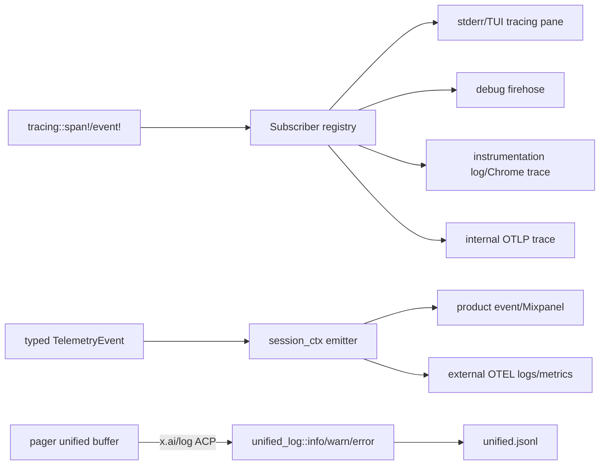
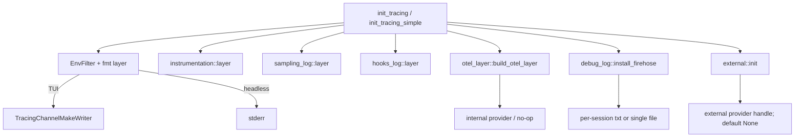
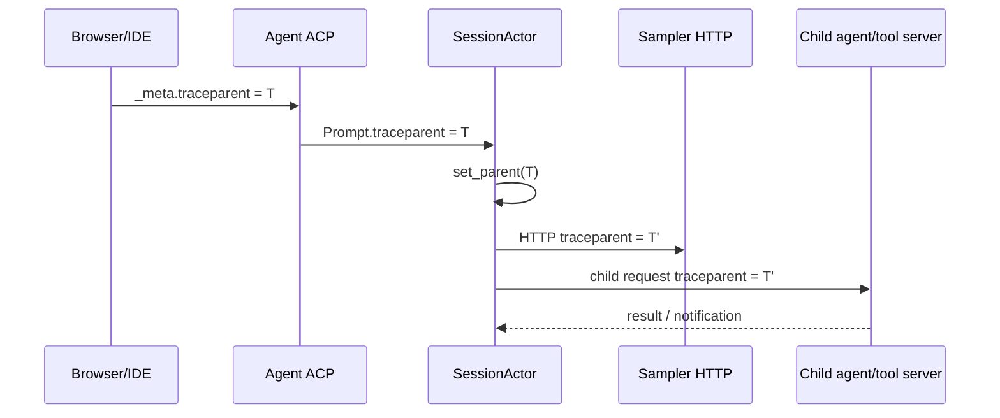
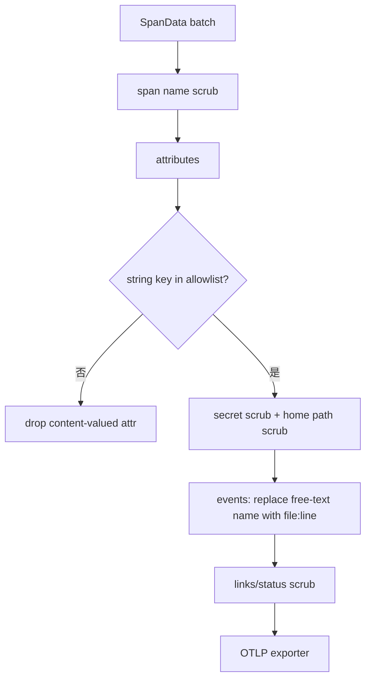

# 源码精读：可观测性与一次消息的 Trace Timeline

Agent 出问题时，最难的通常不是“有没有报错”，而是回答：**这条用户消息到底走到了哪一步？**

- UI 是否真的把 prompt 发出去了？
- ACP channel 是否传丢了 `prompt_id` 或 `traceparent`？
- `SessionActor` 是否收到了消息，但被排队、取消或提前分叉？
- ChatState 是否提交了 user item，Sampler 是否真的发出 HTTP 请求？
- 模型是否返回了 tool call，工具是否经过 permission gate，结果是否回写？
- 进程退出前，异步日志和 OTLP batch 是否来得及 flush？

本文从源码解释项目的观测面，并给出一套**从一个 session/prompt 反向还原完整时间线**的方法。它与 [message-flow.md](./message-flow.md) 的关系是：前者解释业务控制流，本文解释如何用 span、字段和文件把这条控制流重新找回来。

相关入口：

- `crates/codegen/xai-grok-telemetry/src/`：遥测 crate 的统一 owner；
- `crates/codegen/xai-grok-pager/src/tracing.rs`：TUI subscriber composition；
- `crates/codegen/xai-grok-pager-bin/src/main.rs`：headless/serve 等非 TUI 入口；
- `crates/codegen/xai-file-utils/src/trace_context.rs`：W3C `traceparent` 的提取、注入和跨 ACP 边界链接；
- `crates/common/xai-tracing/src/tokio.rs`：Tokio task 的 tracing context 传播；
- `crates/codegen/xai-grok-shell/src/session/acp_session_impl/`：session、turn、sampler、tool 的观测点。

---

## 1. 先建立正确的观测模型

可观测性不是“多打几条 `println!`”。本项目把同一行为拆成四类信号：

| 信号 | 主要问题 | 典型载体 | 是否有用户内容 |
|---|---|---|---|
| `tracing` span/event | 代码现在在哪个阶段、耗时多少、父子关系是什么 | stderr、debug 文件、OTLP trace | 默认应只有结构化字段 |
| unified log | 跨 shell/pager/desktop 进程的产品生命周期发生了什么 | `~/.grok/logs/unified.jsonl` | `ctx` 只放可脱敏诊断字段 |
| debug firehose | 某个 session 内哪些 Rust 事件按顺序发生 | `~/.grok/debug/<session_id>.txt` | 可能很密集，仍禁止 prompt/tool payload |
| 专项日志 | sampling、hooks、memory、启动阶段的专门细节 | `sampling.jsonl`、`hooks.log`、`memory.log` | 由各自 target/filter 控制 |
| OTLP | 跨进程、跨网络服务看拓扑、耗时和指标 | 内部 collector 或用户自己的 collector | 内部有 redact；外部是双重 opt-in + schema gate |

全局关系如下：



这几条线**不会严格一一对应**。例如：

1. `unified_log::info` 是手动写入 JSONL，不会自动生成一个 `tracing` span；
2. 一个 `tracing` event 只有在对应 layer/filter 打开时才会落到某个 sink；
3. typed event 可能先进入 external OTEL，再因 `TelemetryMode` 被内部产品事件 gate 掉；
4. fire-and-forget 的 product event 在进程立即退出时可能尚未发送，因此不能把“没有事件”当作“代码没有执行”。

### 1.1 观测的三个层次

调试时先分清三个层次，不要拿一个层次的证据替代另一个层次：

```text
业务事实：SessionActor 是否完成了一个 turn？
    ↓ 由状态、ACP response、persistence ack 证明
执行事实：Sampler/Tool/Storage 的某个阶段是否运行、耗时多久？
    ↓ 由 tracing span/event、instrumentation timer 证明
诊断事实：日志/trace 是否成功写出或上传？
    ↓ 由 writer flush、OTLP export health、upload outcome 证明
```

例如，看到 `assistant` 已经出现在 TUI 只能证明渲染层收到了更新；它不能单独证明 durable storage 已提交，也不能证明 OTLP export 成功。

---

## 2. 一次消息的关联键：不要混用它们

### 2.1 `session_id`：最长生命周期的主键

`session_id` 标识一条 ACP session。它会出现在：

- `unified.jsonl` 的 `sid`；
- `tracing::info_span!("session", session_id = %...)`，供 debug firehose 路由；
- external OTEL 的 `session.id`（是否附到 metrics 还受 cardinality 配置）；
- session storage、trace artifact 和恢复命令的路径。

它适合回答“这一次对话发生了什么”，不适合回答“这条消息是第几次尝试”。

### 2.2 `prompt_id`：客户端请求/一次输入的关联键

Pager queue 和 ACP `PromptRequest` 用 `prompt_id` 关联发送、取消和完成响应。它也会进入 `session.handle_prompt` span；在 synthetic prompt、task wake、subagent 等场景，`prompt_id` 可能带有来源语义，不一定是用户手写文本对应的 UUID。

`TelemetryCtx::begin_prompt_id()` 维护另一种 per-prompt UUID：它在 turn 开始时旋转，供 external OTEL 的 `prompt.id` 使用，且**只附到 event，不附到 metrics**，避免无界 cardinality。贡献者要先确认自己要的是 ACP 请求 ID，还是 external event 的 `prompt.id`。

### 2.3 `turn_number` / `prompt_index`：状态所有者的顺序号

`xai-chat-state` 的 `prompt_index` 是 conversation 的 turn 边界计数；`TelemetryCtx` 会在可用时把它快照成 external OTEL 的 `turn_number`。它和 `prompt_id` 不等价：

- 一个 turn 可能因 retry、401 recovery 或 tool loop 产生多次 HTTP attempt；
- synthetic user item 可能不递增真实 prompt index；
- rewind/fork 后，新的 session 或截断后的 state 可能重新组织历史。

所以按顺序重建 timeline 时，优先排序 `ts`，再用 `turn_number`/`prompt_index` 解释业务边界，不要只按 UUID 排序。

### 2.4 `request_id`、`tool_call_id` 和 trace context

| 字段 | owner | 用途 | 常见误读 |
|---|---|---|---|
| `request_id` | 某个事件/HTTP 请求调用点 | 关联一次网络或 analytics emission | 不一定是整条 turn 的 ID |
| `tool_call_id` | 模型 assistant tool call / ToolBridge | 关联 permission、执行、结果和 UI row | 一条 turn 可有多个 |
| `traceparent` | ACP/HTTP 分布式链路 | 传递 W3C trace id + parent span id | 它不是业务 session id |
| `trace_id` | OTel provider | 把多个 process/service span 归到一条分布式 trace | 本地没有有效 provider 时可能不存在 |
| `span_id` | 单个 span | 定位某阶段父子关系 | 只在 exporter/trace 中可见 |

W3C `traceparent` 的形状是：

```text
00-<32 hex trace-id>-<16 hex parent-span-id>-<2 hex flags>
```

不要把完整 token、prompt、工具参数塞进这些关联字段。关联键应该短、稳定、可脱敏。

---

## 3. Subscriber 是怎么组装出来的

### 3.1 TUI 入口

`xai-grok-pager/src/tracing.rs::init_tracing` 创建 registry，按 layer 叠加：

```rust
let registry = tracing_subscriber::registry()
    .with(fmt_layer.with_filter(env_filter))
    .with(instrumentation_layer)
    .with(sampling_log_layer)
    .with(hooks_log_layer)
    .with(otel_layer);
xai_grok_telemetry::debug_log::install_firehose(registry, "tui");
xai_grok_telemetry::external::init(resolve_external_otel_config(...));
```

实际源码还会建立 TUI tracing channel 和目标过滤器。顺序的关键不是“越多越好”，而是每个 layer 的 owner 和 filter 都有自己的语义：



headless 的 `init_tracing_simple` 默认把 `-p` 的 stderr filter 设为 `off`，其它非 TUI 模式一般为 `error`，但 `GROK_LOG_FILE`、`GROK_DEBUG_LOG`、OTLP layer 仍可独立打开。因此“终端没有日志”不等于“没有 tracing event”。

### 3.2 span/event 到 layer 的路径

`tracing` 宏只创建抽象记录：

```rust
#[tracing::instrument(
    name = "session.handle_prompt",
    skip_all,
    fields(
        session_id = %self.session_info.id.0,
        prompt_id = %prompt_id,
        prompt_length = tracing::field::Empty,
    )
)]
async fn handle_prompt(...) { ... }
```

`skip_all` 很重要：它避免把参数的 `Debug` 输出自动写入 span。函数内部随后可以显式记录安全字段：

```rust
tracing::Span::current().record(
    "prompt_length",
    prompt_length as i64,
);
```

这比 `tracing::info!("prompt = {prompt}")` 更容易过审：记录长度、状态、类型和耗时，而不是原文。

### 3.3 Tokio task 为什么会丢 span

`tracing` 的当前 span 是 task-local 的语义上下文，不是普通全局变量。裸 `tokio::spawn` 不会自动替你创建新业务 span；项目提供：

```rust
pub fn spawn_traced<F>(future: F) -> JoinHandle<F::Output>
where
    F: Future + Send + 'static,
    F::Output: Send + 'static,
{
    tokio::spawn(future.instrument(Span::current()))
}
```

若要给子任务命名，则显式创建 child span：

```rust
let parent = tracing::Span::current();
tokio::spawn(
    async move { upload_trace().await }
        .instrument(tracing::info_span!("trace.upload"))
        .instrument(parent),
);
```

项目中上传 task、tool retry 和其它后台任务都能看到类似模式。修改异步代码时，先问两个问题：

1. 这个 task 是否需要出现在当前 session 的 debug 文件里？
2. 它是否需要继承上游 `trace_id`，还是应该开始一个新的业务 span？

`xai-tracing::spawn_traced` 只是传播当前 span；它不会替你补 `session_id`、`prompt_id` 或 `tool_call_id`。

---

## 4. ACP 和 HTTP 边界的 traceparent 传播

### 4.1 从客户端 `_meta` 到 SessionActor

Pager/IDE 发出的请求可以携带 `_meta.traceparent`。`xai-file-utils::trace_context` 提供两个方向的操作：

```text
入口进程 span
  └─ current_traceparent()
       └─ ACP PromptRequest._meta.traceparent
            └─ SessionCommand::Prompt.traceparent
                 └─ link_current_span_to_meta()
                      └─ session.handle_prompt child span
```

`run_loop.rs` 收到 `SessionCommand::Prompt` 后，如果 `traceparent` 存在，会把它解析为 OTel parent，再链接当前 session span。这样跨 channel 后，业务 span 仍属于调用者的 trace，而不是凭空开始另一棵树。

入口 server 也通过 `with_on_meta(xai_file_utils::trace_context::span_from_meta_traceparent)` 在 ACP dispatch 层建立 parent span。注意：

- 无效 `traceparent` 会被 `extract_context` 拒绝；
- 没有有效 OTel provider 时，业务代码仍可运行，只是没有可导出的 trace；
- traceparent 是 header/meta，不是用户可见的 prompt 内容。

### 4.2 从 SessionActor 到 Sampler HTTP

`sampler_turn.rs` 的 `TraceContextInjector` 在请求发出前读取 `current_traceparent()`，把它放到 `traceparent` header：

```rust
impl xai_grok_sampler::HeaderInjector for TraceContextInjector {
    fn inject(&self, headers: &mut HeaderMap) {
        if let Some(tp) = xai_file_utils::trace_context::current_traceparent() {
            headers.insert("traceparent", tp.parse()?);
        }
    }
}
```

因此从本地可以区分两件事：

- `session.handle_prompt` span 存在，但没有 sampler span/header：可能卡在 prompt assembly、permission 或 queue；
- sampler span 存在且 HTTP 发出，但没有 response event：看网络、retry、认证和 cancellation；
- response 有了但 UI 没更新：看 ACP notification、ReplayBuffer 和 pager renderer，而不是继续查模型。

### 4.3 子代理和工具服务

子代理请求会读取 `current_traceparent()`，把 parent context 放进 child session 的 meta；服务端用 `span_from_meta_traceparent` 还原 parent。工具运行时也有 `TraceContext` extension，供 computer hub / tool server 继续转发。



`T'` 可能有新的 span id，但 trace id 应保持一致。判断传播是否正常时，比较 trace id，不要要求每一跳的 parent span id 一样。

---

## 5. `unified.jsonl`：跨进程的生命周期账本

### 5.1 记录结构

owner 是 `xai-grok-telemetry/src/unified_log.rs`。一行 JSON 对应一个 `LogEntry`：

```json
{"ts":"2026-08-09T06:12:31.245Z","src":"shell","pid":12345,"ver":"0.1.211","lvl":"info","sid":"sess_abc","msg":"startup phase","ctx":{"phase":"session_create","elapsed_ms":412}}
```

字段语义：

| 字段 | 说明 |
|---|---|
| `ts` | UTC RFC3339，毫秒精度；跨进程排序的第一依据 |
| `src` | `shell`、`grok-pager` 或 `grok-desktop` |
| `pid` | 生产者 PID；多个 shell 共享文件时用于区分进程 |
| `ver` | 启动时 stamp 的二进制版本，识别旧进程/升级混跑 |
| `lvl` | `error`、`warn`、`info`、`debug` |
| `sid` | session id；无 session 的启动/认证事件可为空 |
| `msg` | 稳定的短消息 key，如 `startup phase`、`connect finished` |
| `ctx` | JSON 结构化字段；应是长度、状态、耗时、分类或已脱敏路径 |

`src` 不是调用方可以随便声明的字符串：pager 通过 `x.ai/log` 发送 `ClientLogEntry`，shell 的 `ingest_client_entries` 强制把来源设为 pager/desktop，并拒绝伪装成 shell 的 batch。

### 5.2 pager 为什么不直接写文件

TUI 侧的 `crates/codegen/xai-grok-pager/src/unified_log.rs` 先把 `ClientLogEntry` 放进内存 buffer：

```text
unified_log::info()
    └─ BUFFER.push(entry)
        ├─ >= 16 条且 ACP ready：立即 batch flush
        └─ 每 1 秒后台 flush
              └─ x.ai/log notification
                    └─ shell::unified_log::ingest_client_entries()
                          └─ ~/.grok/logs/unified.jsonl
```

进程退出时，`flush_blocking().await` 是必要屏障；普通 `flush()` 是 fire-and-forget。它解释了“屏幕上已经报错，但 unified log 没有最后一条”的可能性：应用可能在 ACP notification 真正送达前退出。

### 5.3 5 MB 上限和为什么必须原地 trim

`MAX_SIZE` 固定为 5 MiB。writer 每 2 秒维护一次真实文件状态，而不是只计算本进程写了多少字节：

1. 发现路径指向了不同 inode 或文件被删除，尝试 reopen；
2. 发现文件达到上限，调用 `trim_file`；
3. trim 在文件上拿跨进程 advisory lock；
4. 读取文件，从大约中点之后的第一个换行开始保留尾部；
5. 在**原 inode** 上 rewind、写回尾部、`set_len` 截断。

不能简单地 `temp + rename`：其它进程已经持有旧 inode 的 `O_APPEND` descriptor，rename 后它们会继续写入一个没人能读、也不会再 trim 的 orphan inode。诊断日志宁可接受 trim 期间丢一行，也不能让多进程写入永久失联。

### 5.4 snapshot 的边界

`snapshot_log()` 会 flush 当前进程的 writer，再读取整个文件；`snapshot_session_log(session_id)` 逐行解析 JSON，只保留 `sid` 相等的 entries。两者都是 approximate snapshot：

- 释放 writer mutex 后，另一个进程仍可能追加；
- 正在 ACP buffer 中的 pager entries 尚未到 shell 时不可见；
- trim 可能同时发生；
- 空文件或没有匹配 session 时返回 `None`。

401/404 认证诊断会在 `upload/trace.rs::upload_unified_log` 中用 `spawn_blocking` 调用 session snapshot，再上传 `application/x-ndjson`。这不是每 turn 自动上传，而是受控的诊断路径。

---

## 6. Debug firehose：按 session 读 tracing

`debug_log.rs` 处理的是 tracing 事件，不是 unified JSON schema。它有两种目标：

| 环境变量 | 结果 |
|---|---|
| `GROK_DEBUG_LOG=1` / `--debug` | `~/.grok/debug/<sanitized_session_id>.txt`，无 session 的事件进入 `<role>-<pid>.txt` |
| `GROK_DEBUG_LOG=/tmp/x.txt` | 单文件 firehose，使用固定宽过滤器 |
| `GROK_LOG_FILE=/tmp/x.jsonl` | 单文件 `fmt` layer，`GROK_LOG_FILE` 优先于 `GROK_DEBUG_LOG`，遵守 `RUST_LOG` |
| 都未设置 | 不安装 firehose |

per-session 路由的关键实现是：

```text
on_new_span(attrs)
  └─ 找字段名为 "session_id" 的 span
       └─ sanitize_key()
            └─ 存入 span.extensions()
on_event(event)
  └─ 从 event_scope 由叶到根寻找最近 SessionId
       ├─ 找到：写 <sid>.txt
       └─ 没找到：写 <role>-<pid>.txt
```

字段名是协议的一部分。`session_ctx.rs` 和 `debug_log.rs` 共享 `SESSION_ID_FIELD = "session_id"`，测试会固定这个不变量；把 span 字段改名成 `sid` 会让 debug 文件悄悄退化为 fallback 文件。

`latest.txt` 是原子替换的 symlink，指向最近打开的 session 文件；旧 `*.txt` 和 crash 遗留的 `.latest.*.tmp` 会按 7 天 retention 清理。每个 session sink 的 non-blocking writer 由 appender guard 统一 flush，进程长时间运行时会保留每个 session 的 writer，不能把它当作无限制的生产日志系统。

### 6.1 为什么 `RUST_LOG` 看起来“不生效”

`GROK_DEBUG_LOG` 的 per-session firehose 使用固定的 first-party debug directives，并且明确关闭 `sampling_log`；它的设计目标是“故障时多拿上下文”。`GROK_LOG_FILE` 才是遵守 `RUST_LOG` 的窄日志：

```bash
GROK_LOG_FILE=/tmp/grok.log \
RUST_LOG='info,xai_grok_shell::auth=debug' \
grok
```

因此：

- 想看某个模块的少量 debug：`GROK_LOG_FILE + RUST_LOG`；
- 想按 session 拆分整条 firehose：`--debug`；
- 想看模型采样原始诊断 target：单独打开 `GROK_LOG_SAMPLING=1`。

---

## 7. 专项日志和 instrumentation

### 7.1 sampling/hooks/memory

三个 layer 都是 target 到文件的窄映射：

| target | 开关 | 默认文件 | 适合回答 |
|---|---|---|---|
| `sampling_log` | `--log-sampling` / `GROK_LOG_SAMPLING=1` | `~/.grok/logs/sampling.jsonl` | request/attempt/stream/retry 的 sampling 细节 |
| hooks target | `GROK_HOOKS_LOG=1` 或路径 | `~/.grok/logs/hooks.log` | hook/plugin 阶段、耗时、失败分类 |
| `xai_memory` | `GROK_MEMORY_LOG=1` 或路径，并启用 feature | `~/.grok/logs/memory.log` | memory marker、索引、读写和 cache |

sampling layer 也复用 unified log 的 `MAX_SIZE` 和 `trim_file`，而 hooks/memory 使用 non-blocking file writer。新增 target 时，应把过滤器、默认路径、开关、flush 和测试一起定义，不能只加一条 `tracing::debug!`。

### 7.2 `GROK_INSTRUMENTATION`

`instrumentation.rs` 提供四种模式：

```text
unset              -> Server（交给 internal OTLP layer）
0/false/off        -> Disabled（NoOpLayer，低开销）
1/log/json         -> Log，~/.grok/logs/instrumentation.log
chrome/trace       -> Chrome async trace，~/.grok/logs/instrumentation.trace.json
```

调用点通常是 shell 保留的 `instrumentation_timer!` 宏：

```rust
let _timer = crate::instrumentation_timer!("session.prefix_build");
// 可选的结构化字段只在安全模式下加入
```

`InstrumentationTimer::Drop` 在 Log/Server 模式写：

```json
{
  "target":"xai_grok_instrumentation",
  "fields":{
    "event":"timing",
    "name":"session.prefix_build",
    "elapsed_us":18342,
    "fields":{"cache":"miss"}
  }
}
```

Chrome 模式不会另外写 timing event，而是让 `tracing_chrome` 记录 async span；`generate_chrome_trace` 也能把旧的 JSON instrumentation timing 转成 Chrome `traceEvents`。启动阶段还有一条特殊镜像：startup timer 会把 phase 和 duration 写入 unified log，便于慢启动问题不依赖额外 env。

### 7.3 panic 和退出

`install_panic_hook` 会记录 `error_type = "panic"` 和已脱敏的 location；external stream 只发 error class，不发 panic message。shell 的 `finalize_and_exit` 顺序是：

```text
process_exit tracing event
  -> instrumentation::finalize()
  -> otel_layer::shutdown_otel()
  -> debug_log::flush()
  -> process::exit(code)
```

普通 RAII 路径由 `InstrumentationFinalizer` 和 `OtelGuard` 的 `Drop` 完成。添加新的 `process::exit` 分支时，必须复用这条顺序，否则最后一批 trace/log 可能丢失。

---

## 8. 两条 OTLP 管道：内部和 external 不要混淆

### 8.1 内部 trace provider

`otel_layer::build_otel_layer` 建立 `tracing-opentelemetry` layer。`InstrumentationMode::Server` 才构造 OTLP exporter；其它模式可以有 tracing span，但 provider 可能是 no-op。资源属性包括：

```text
service.name = grok-cli
service.version = version + commit
client.name / client.version
app.entrypoint = tui | headless | agent
terminal.type（若有）
```

exporter 不把 token 固定在初始化时：每个 batch 根据 live `AuthCredentialProvider` 取 credential，失败后刷新 token 并重试一次。`OTEL_EXPORTER_OTLP_TIMEOUT` 默认 10 秒，batch size 固定上限为 64；退出时 provider shutdown 负责 flush。

内部 layer 的 filter 由 `GROK_OTEL_FILTER` 决定，默认 `info`，并强制关闭 `sampling_log` target，避免 sampling 专项日志重复进入 trace pipeline。

### 8.2 internal redact：默认拒绝字符串

`otel_layer/redact.rs` 在 batch export 前遍历 `SpanData` 的所有文本面：span name、attributes、events、links 和 error description。



数字和布尔值默认安全；字符串必须出现在 allowlist，例如 `session_id`、`prompt_id`、`tool_call_id`、`model`、分类 enum 和经过 scrub 的 path。event name 是 tracing message 的自由文本，不能依赖 key allowlist，因此会被替换成 `code.filepath:code.lineno`，找不到位置时退化为 `event`。

这套策略是 fail-closed：新增 `SpanData` 字段会因 exhaustive destructure 触发编译检查；不认识的字符串 key 会丢弃，而不是“先发了再说”。

### 8.3 external OTEL：用户自己的 collector

external stream 是独立 provider，**不注册到 `opentelemetry::global`**，也不使用内部 auth header。启动需要双重 opt-in：

```text
GROK_EXTERNAL_OTEL=1
    + (OTEL_METRICS_EXPORTER=otlp|console
       或 OTEL_LOGS_EXPORTER=otlp|console)
    -> build ExternalTelemetry
```

只设置 master switch 或只设置 exporter 都不会创建 provider、线程或 socket。配置文件 `[telemetry] otel_*` 只能提供默认层，环境变量覆盖；collector header 只从 `OTEL_EXPORTER_OTLP_HEADERS` 及 signal-specific header 读取，配置文件没有 headers 字段，避免 token 落盘。

external log record 的上下文由 `external::emit` 同步组装后交给 BatchLogProcessor：

```text
typed TelemetryEvent
  -> schema mapping (event + attrs + metric increments)
  -> ContentGates（prompt/tool details）
  -> session_ctx snapshot
       ├─ session.id
       ├─ turn.number
       └─ prompt.id（events only）
  -> secret/path scrub + truncate
  -> external redacting exporter
  -> customer collector
```

external 的内容 gate 默认关闭：

- `OTEL_LOG_USER_PROMPTS=1` 才允许 prompt，且最多 60 KB；
- `OTEL_LOG_TOOL_DETAILS=1` 才允许完整工具参数、路径和 verbatim MCP/skill/plugin name；
- 远端 settings 只能 tighten：`force_disable` 或 lock gates，不能在进程启动后偷偷打开内容。

日志 exporter 会丢弃非 schema key、未 scrub 的 secret 或带 body 的记录；metrics exporter 遇到属性违规时丢弃整个 export。可观测性本身也必须有 privacy invariant。

### 8.4 typed event 的双 sink 顺序

`session_ctx::log_event` 先调用 external emit，再检查内部 `TelemetryMode`：

```rust
pub fn log_event<T: TelemetryEvent>(data: T) {
    crate::external::emit(&data); // external gate 独立
    if !client::is_enabled() {
        return;
    }
    emit_event(T::NAME, data);     // product event / Mixpanel
}
```

这意味着：

- external 开着、内部 analytics 关着：仍可能有 customer collector event；
- internal `Enabled` 时，`emit_event` 后台 `tokio::spawn`，要在短命命令退出前调用 `drain_pending`；
- 不要在同一个调用点再手动调用 `external::emit`，否则会 double-send。

---

## 9. 从一条用户消息还原完整时间线

下面是一套贡献者可以直接执行的顺序。假设你已经取得一个脱敏的 session id `sess_abc`，并从 ACP/UI 看到 prompt id `p_123`。

### 9.1 第一步：先确认启动和进程拓扑

```bash
GROK_HOME=/path/to/home
jq -c 'select(.sid == "sess_abc")' \
  "$GROK_HOME/logs/unified.jsonl" | head -100
```

先按 `ts`、`pid`、`ver` 排序理解是否有 TUI、leader、embedded agent 多进程交错。若 `src` 是 `grok-pager`，说明它来自 ACP forward；`shell` 说明由 agent 进程直接写入。

如果日志为空，按下面顺序排除：

1. pager 是否调用过 `unified_log::init`；
2. 是否在退出前 `flush_blocking().await`；
3. session id 是否写入 `sid`，还是这个事件本来就是 startup/auth 无 session；
4. 是否被 5 MB trim 淘汰；
5. 是否正在另一个 `$GROK_HOME` 下运行。

### 9.2 第二步：找 prompt intake

```bash
rg -n 'p_123|prompt_id|session.handle_prompt|shell.task_wake' \
  "$GROK_HOME/debug" "$GROK_HOME/logs" /tmp/grok.log
```

预期能看到类似阶段（名字会随版本增减）：

```text
ACP PromptRequest -> SessionCommand::Prompt
session actor admitted -> queue_input
session.handle_prompt.start
user item persisted / replay update
```

如果只有 Pager 的 `UserPrompt` 而没有 shell 的 `handle_prompt`，问题在 ACP transport/leader route。若有 `RemovedFromQueue`，不要把它当作模型失败：该 prompt 没有开始 turn，completion side effects 也应被跳过。

### 9.3 第三步：分辨 queue、ChatState 和 Sampler

在 tracing firehose 中以 session 文件为主：

```bash
tail -f "$GROK_HOME/debug/sess_abc.txt"
```

读到 `session.handle_prompt` 后，继续找：

```text
prompt parse / slash or direct command
chat state mutation / persist ack
build conversation request
prepare sampler / auth refresh
HTTP sampling attempt / response status
```

区分依据：

- `ChatState` 相关事件说明 conversation authority 已变更或构建请求；
- `sampling_log` 只说明 sampler target 的细节，不等同于 HTTP 成功；
- `traceparent` 在 sampler HTTP header 中出现，才证明分布式链路被注入；
- `request_id` 可能每次 attempt 都不同，不能拿它判断是否发生了新 turn。

### 9.4 第四步：追 tool loop

模型返回 tool call 后，围绕同一个 `tool_call_id` 搜索：

```bash
rg -n 'tool_call_id=.?tc_456|tc_456|permission|tool.*(start|finish|failed|cancel)' \
  "$GROK_HOME/debug/sess_abc.txt" /tmp/grok.log
```

时间线通常是：

```text
assistant tool call
  -> permission decision (allow/deny/ask)
  -> sandbox / ToolBridge dispatch
  -> progress + partial output
  -> tool result or cancellation
  -> ChatState append ToolResult
  -> next sampler request
```

只看到 permission allow 而没有 tool result，多半是 dispatch、OS sandbox 或 cancellation；只看到 tool result 而没有下一次 sampling，则看 turn loop 的 stop reason、compaction、doom-loop 和 retry budget。

### 9.5 第五步：验证完成、持久化和 flush

最后确认三类完成信号：

| 信号 | 证明什么 |
|---|---|
| ACP `PromptResponse` / `turn_complete` | 调用者收到这次 prompt 的业务结果 |
| persistence flush/ack | durable session state 已提交或明确失败 |
| `unified_log::flush_blocking` / OTel shutdown | 诊断信号有机会写出/导出 |

若只缺第三类，不要修改 Agent 业务逻辑；应修 exit path 或 flush barrier。若第一类已经完成但第二类缺失，优先检查 `persist_ack` 和 storage actor。若第二类成功但 UI 缺失，再转去 [pager-rendering.md](./pager-rendering.md)。

### 9.6 一条可复用的 timeline 模板

```text
[ts pid=... ver=...] session created: sid=...
[trace_id=...] acp_dispatch received PromptRequest: prompt_id=...
[trace_id=...] session.handle_prompt.start: turn=... prompt_length=...
[sid=...] user item persisted: ack=...
[trace_id=...] sampler attempt=1: model=... status=...
[trace_id=...] tool call: tool_call_id=... tool_name=...
[trace_id=...] permission: decision=...
[trace_id=...] tool result: outcome=...
[trace_id=...] sampler attempt=2: stop_reason=...
[sid=...] turn complete: tokens=... persistence=confirmed
[pid=...] flush/shutdown: pending=0
```

这不是要求所有日志都使用这些固定文案，而是写新代码时应让读者能拼出同样的状态转移。

---

## 10. 按症状选择证据

| 症状 | 第一处看 | 第二处看 | 不要先做什么 |
|---|---|---|---|
| 按 Enter 没反应 | Pager queue、`x.ai/log` | ACP connection/leader route | 不要直接重试模型请求 |
| UI 有用户气泡但 Agent 没运行 | shell `SessionCommand::Prompt` | `RemovedFromQueue`、admission、send-now | 不要把 scrollback 当 conversation |
| Agent 卡在“思考” | `session.handle_prompt` span | sampling log、OTLP span、HTTP retry | 不要只看 TUI stderr |
| tool row 一直 running | `tool_call_id` | permission/sandbox/ToolBridge result | 不要 abort 随机 Tokio task |
| 401 后重复失败 | auth refresh + sampler attempt | external/internal export auth headers | 不要打印 bearer token |
| 退出时最后日志缺失 | pager `flush_blocking` | shell `drain_pending`、OTel shutdown | 不要把 fire-and-forget 当 durable |
| unified log 突然变小 | `MAX_SIZE`/trim 时间 | inode/pid/ver 是否变化 | 不要用 rename 替换共享日志 |
| OTLP 有 span 无 prompt 内容 | content gates/redact | external schema and provider selection | 不要为了排障默认打开 prompt gate |
| trace 分成多棵树 | `_meta.traceparent` | `link_current_span_to_meta` / sampler header | 不要只比较 span id |

---

## 11. 脱敏边界：什么能记、什么不能记

### 11.1 建议记录

- `session_id`、`prompt_id`、`tool_call_id`、`request_id` 等关联 ID；
- `model_id`、tool/skill/MCP 名称（仅名称，不含参数）；
- 长度、token 数、耗时、retry 次数、HTTP status、stop reason、分类 enum；
- `cwd`/repo path，但必须经过 home-path 和 secret scrub；
- `pid`、版本、entrypoint、terminal 类型，用于多进程和版本偏斜定位。

### 11.2 默认禁止

- 完整用户 prompt、assistant 回复、reasoning 和 tool output；
- tool 参数中的文件内容、命令行、SQL、URL query、MCP verbatim payload；
- API key、OAuth access/refresh token、session token、`Authorization` header；
- 未经 scrub 的绝对 home path、云存储签名 URL 和 query string；
- 把用户可控自由文本放入 OTel event name 或 span name。

### 11.3 为什么有两层 redact

external emit 阶段做 gate、schema mapping、secret scrub 和 truncation，保证正常路径低成本；exporter 阶段再次做 allowlist 验证，保证新 call site 误加字段时 fail-closed。内部 `otel_layer/redact` 则对 `SpanData` 的所有文本面做更广泛 scrub。两层不能互相替代：

```text
call site discipline
  + typed schema / content gate
  + exporter validation
  = 不把“贡献者记得小心”当作隐私保证
```

新增字段的正确流程是：先确定它是 enum/identifier/length 还是 content，再加入 schema/allowlist 和 wire fixture；不要先加 `String`，再期待 exporter 猜出它是否安全。

---

## 12. 贡献者如何新增一条可观测信号

### 12.1 选择正确的 owner

```text
状态转移事实       -> SessionActor/ChatState owner + unified_log lifecycle event
阶段耗时            -> tracing span 或 instrumentation_timer!
跨服务关联          -> span + traceparent propagation
产品计数/分类        -> typed TelemetryEvent + session_ctx
用户 collector 信号  -> external schema + gate + redact fixture
```

不要用 unified log 代替状态 actor，也不要用 external OTEL event 代替 UI completion。

### 12.2 新增 tracing 字段的 checklist

1. 用 `#[tracing::instrument(skip_all, fields(...))]` 声明有限字段；
2. 用数值/enum/ID 代替自由文本；
3. 检查字段是否会进入 internal allowlist；
4. 若任务跨 `.await` 或 `tokio::spawn`，补 `.instrument(Span::current())` 或命名 child span；
5. 若跨 ACP/HTTP，显式携带 `traceparent`，并写传播测试；
6. 在失败、取消、超时和 process exit 路径都保留可解释的终态。

### 12.3 新增 unified log 字段的 checklist

1. `msg` 用稳定短 key，不把变量插入 message；
2. `ctx` 只放 schema 化字段，调用前走 secret/path scrub；
3. 有 session 就传 `sid`，没有就明确传 `None`；
4. pager 侧调用后考虑 `flush_blocking` 是否是退出前屏障；
5. 跨进程事件保留 `pid` 和 `ver`；
6. 对 snapshot/trim 并发写出测试，不假设读取是线性一致的。

### 12.4 推荐 focused tests

先运行 [`mini_trace_timeline.rs`](../rust-essentials/labs/async-demos/src/bin/mini_trace_timeline.rs)：

```sh
cargo run --locked \
  --manifest-path docs/rust-essentials/labs/async-demos/Cargo.toml \
  --bin mini_trace_timeline
```

程序直接证明 Tokio task-local 不会随裸 `spawn` 自动传播，显式 scope 后 `session_id`/`prompt_id` 与 `traceparent` 可进入 child，同时 `request_id` 和 `tool_call_id` 保持各自作用域；简化 external exporter 对非 allowlist 字符串默认拒绝。它不替代真实 tracing subscriber、W3C parser、JSONL writer、OTLP exporter 或 flush 测试。

| 改动 | 最小测试 |
|---|---|
| span 字段/路由 | `debug_log` 的 session routing fixture，确认 inside/outside 文件分离 |
| task propagation | `spawn_traced` fixture，断言 child event 仍在父 span 下 |
| ACP traceparent | `xai-file-utils/trace_context` 的 meta -> span -> header round-trip |
| unified log | JSONL shape、client source spoof、snapshot_session_log、trim 原 inode |
| instrumentation | timer 输出、Chrome conversion、disabled mode 不产生 I/O |
| external schema | content gate、secret canary、unknown key drop、metric attr validation |
| 退出流程 | pending event drain、OTel/debug flush 顺序和 timeout |

测试分层建议见 [contributor-workflow.md](./contributor-workflow.md)：先纯函数和 wire fixture，再单 crate async fixture，最后才做真实进程/网络 smoke。

---

## 13. 源码阅读地图

| 你要回答的问题 | 从哪里开始 |
|---|---|
| tracing layer 在哪里组装？ | `xai-grok-pager/src/tracing.rs`、`xai-grok-pager-bin/src/main.rs` |
| session 文件为何能按 sid 路由？ | `xai-grok-telemetry/src/session_ctx.rs`、`debug_log.rs` |
| unified JSONL 如何写、trim、snapshot？ | `xai-grok-telemetry/src/unified_log.rs` |
| pager 日志如何到 shell？ | `xai-grok-pager/src/unified_log.rs`、ACP `x.ai/log` handler |
| traceparent 如何过 ACP/HTTP？ | `xai-file-utils/src/trace_context.rs`、`run_loop.rs`、`sampler_turn.rs` |
| OTel 为什么不泄漏字符串？ | `otel_layer/redact.rs`、`external/redact.rs`、`redact_common.rs` |
| external metrics/logs 的 schema 是什么？ | `external/schema.rs`、`external/emit.rs` |
| instrumentation timer 如何转 Chrome？ | `xai-grok-telemetry/src/instrumentation.rs`、shell `instrumentation_timer!` |
| sampling/hooks/memory 如何单独开？ | `sampling_log.rs`、`hooks_log.rs`、`memory_log.rs` |
| 401 诊断何时上传 unified log？ | `xai-grok-shell/src/upload/trace.rs` |
| 某条消息的业务终态在哪里决定？ | `session/acp_session_impl/run_loop.rs`、`turn.rs`、`turn_completion.rs` |

---

## 14. 小练习：从一个故障写出证据链

### 练习 A：判断“模型没有收到消息”是否成立

给定：Pager 显示了用户气泡，shell debug 文件没有 assistant 输出。

要求按顺序证明：

1. `x.ai/log` 是否到达 shell；
2. `SessionCommand::Prompt` 是否被 actor admission 接受；
3. `session.handle_prompt.start` 是否出现；
4. ChatState 是否有 user item/persist ack；
5. sampler 是否产生 attempt/HTTP trace。

结论只能写成“最早缺失的边界”，不能直接写“模型故障”。

### 练习 B：给一个新增日志做隐私审查

下面的改动不合格：

```rust
tracing::info!(
    prompt = %prompt,
    tool_args = ?args,
    "calling {tool_name}"
);
```

请改成：

```rust
tracing::info!(
    tool_name = %tool_name,
    tool_call_id = %tool_call_id,
    arg_bytes = args.len(),
    "tool dispatch started"
);
```

然后补一个 redact canary，证明 secret-shaped value、home path 和 event message 都不会进入 external wire payload。

### 练习 C：模拟跨 task 丢 span

写两个 fixture：一个裸 `tokio::spawn`，一个 `.instrument(Span::current())`；分别检查 debug firehose 是否能路由到 session 文件、OTLP span 是否有正确 parent。这个练习能把 Rust 的 `Future + Send + 'static` 约束和 Agent 的 trace continuity 联系起来。

---

## 15. 结论：把日志当作可验证的控制流

一次用户消息的完整证据链不是一条日志，而是：

```text
prompt_id / session_id
  -> ACP admission
  -> handle_prompt span
  -> ChatState/persistence ack
  -> sampler attempt + traceparent
  -> tool_call_id / permission / result
  -> next sampling or stop_reason
  -> ACP completion + durable commit
  -> flush / export outcome
```

当你能为每个箭头指出“谁拥有状态、哪条 channel 传递、哪个字段关联、哪个测试证明失败路径”，你就不只是会读 Rust 语法，而是已经具备用源码定位 Agent runtime 行为、设计可审查改动和贡献诊断能力的工程心智模型。
