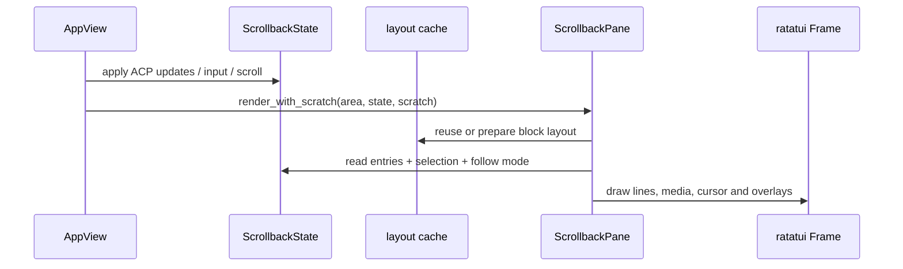

# 源码精读：Pager 如何把流式事件变成稳定的终端画面

消息流程中的“回到 UI”并不是把字符串直接 `println!`。Pager 先把 ACP `SessionUpdate` 归一为 `RenderBlock`，再放进带显示状态的 `ScrollbackEntry`，最后由 `ScrollbackPane` 在每一帧布局和绘制。

## 1. 事件到画面的路径


控制面和渲染面分开：`dispatch` 修改 `AppView` 并返回 effect；effect 在异步任务中调用 ACP；ACP notification 回到 tracker；tracker 只修改 scrollback；真正的 terminal draw 发生在 render crate。

## 2. 三个核心类型

### `RenderBlock`

`scrollback/block.rs` 的枚举是 UI 语义层：`UserPrompt`、`AgentMessage`、`Thinking`、`ToolCall`、`SessionEvent` 等。每种 block 自己决定默认 display mode、是否可选、是否 groupable、是否显示 bullet，以及完成后是否自动折叠。

### `ScrollbackEntry`

`scrollback/entry.rs` 包装 block 和 entry-level 状态：稳定 `EntryId`、当前折叠模式、running/finished 标记、选中状态和布局缓存引用。**block 是内容，entry 是内容在当前 UI 中的生命周期。**同一类 block 在 streaming、replay、finished 三个阶段可采用不同显示模式。

### `ScrollbackState`

`scrollback/state/mod.rs` 拥有 entries，并维护当前 scroll offset、follow mode、selection、turn 边界和布局数据。它是 Pager 画面状态的唯一写入者；渲染函数不应偷偷改变会话历史。

## 3. ACP tracker 的增量合并

[`acp/tracker.rs`](../../crates/codegen/xai-grok-pager/src/acp/tracker.rs) 的 `process_update` 对每类 `SessionUpdate` 走不同路径：

| ACP 更新 | scrollback 操作 |
|---|---|
| `UserMessageChunk` | 回显/重放时寻找对应 user entry，必要时合并文本 |
| `AgentMessageChunk` | 创建或追加 `AgentMessage` block |
| `AgentThoughtChunk` | 创建/追加 `Thinking`，通常在完成后折叠 |
| `ToolCall` | 按 tool kind 创建 `ToolCall` block |
| `ToolCallUpdate` | 通过 tool-call ID 更新标题、状态、输出和错误 |
| `Plan` / mode update | 更新计划或当前模式，而不是伪造 assistant 文本 |

流式 agent 文本的关键不是“每个 delta 一个 block”，而是用 session/turn 和最后一个兼容 block 找到追加目标。否则一段回答会变成几十个 entry，折叠、搜索和 resize 都会失真。tool update 同样以 `tool_call_id` 配对，不能按到达顺序猜测。

## 4. 一帧渲染做什么



`ScrollbackPane::render_with_scratch()` 是首选路径，因为长会话中 markdown wrapping、代码高亮和媒体尺寸计算很贵。scratch buffer 让临时 `Line`/`Span` 不必在每个 block 重复分配；layout cache 让未变化的 block 不必重新测量。渲染应尽量接近纯函数：输入为 `ScrollbackState` 快照和 terminal area，输出为 frame 内容。

## 5. Follow、scroll 和 selection

新 assistant delta 到达时：

1. tracker 追加 block 文本并标记 dirty；
2. 若 state 在 follow mode，scroll offset 跟随末尾；
3. 若用户手动上滚，state 暂停 follow，避免新文本把视口拉走；
4. 用户回到底部后重新启用 follow；
5. selection 以 `EntryId`/行列坐标为锚点，resize 后通过重新布局而不是固定屏幕坐标恢复。

因此“流式输出覆盖了我正在看的旧内容”通常不是 ACP 顺序问题，而是 follow/selection 状态被错误重置。

## 6. 输入发送和 scrollback 的先后

普通发送的本地路径可以简化为：

```text
Action::SendPrompt
  -> dispatch_send_prompt
  -> pending_prompts.push_back
  -> maybe_drain_queue
  -> scrollback.push_block(UserPrompt)
  -> Effect::SendPrompt / SendPromptBlocks
```

这解释了为什么用户回车后先看到自己的气泡：queue drain 的 UI mutation 与 effect 创建在同一应用状态变更中完成，但 effect 的 ACP 网络请求是异步的。服务器确认、重放或失败时，`AcpUpdateTracker` 还可能根据 prompt ID 修正这条 optimistic echo。

## 7. 常见渲染 bug 的定位法

```text
有 ACP update，没有 RenderBlock       -> tracker 分支或 prompt-id gate
有 RenderBlock，没有画面               -> entry 被过滤、scroll offset 或 layout
有画面但文字重复                       -> delta 合并键/重放去重错误
resize 后内容跳动                      -> layout cache 失效或 selection 锚点错误
工具完成但仍显示 running               -> ToolCallUpdate terminal 状态未应用
```

先查 `acp/tracker.rs` 的 `process_update` 和 `update_summary`，再查 `scrollback/state/{mod.rs,nav.rs,selection.rs}` 的 follow/selection mutation，最后才看 `pager-render` 的主题和 terminal adapter。颜色或主题通常不是数据丢失的根因。

## 8. 测试和可视化验证

- tracker 单测：构造 `AgentMessageChunk`、thought、tool call/update，断言 entry 数量、文本合并和终态；
- scrollback 单测：上滚时不跟随、回到底部恢复 follow、selection 跨 resize 保持；
- `mermaid_playground`：用 `RenderBlock::user_prompt`/`agent_message` 生成最小画面；
- PTY/snapshot：在固定终端宽高下验证折叠、代码块、图片占位和长行换行；
- 手工检查：窄终端、Unicode 宽字符、流式 delta 断在 UTF-8 边界、工具输出很长四种情况。

渲染问题的回归断言应同时检查数据结构和像素/快照：只检查 `RenderBlock` 不能发现裁剪错位，只检查截图又难以定位 tracker 是否漏事件。
