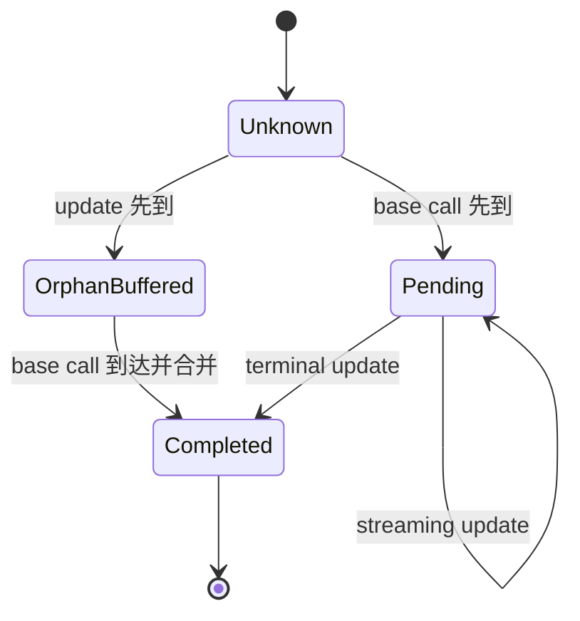
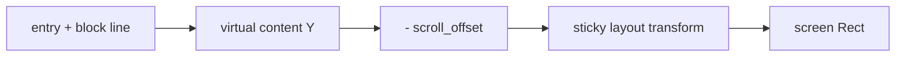
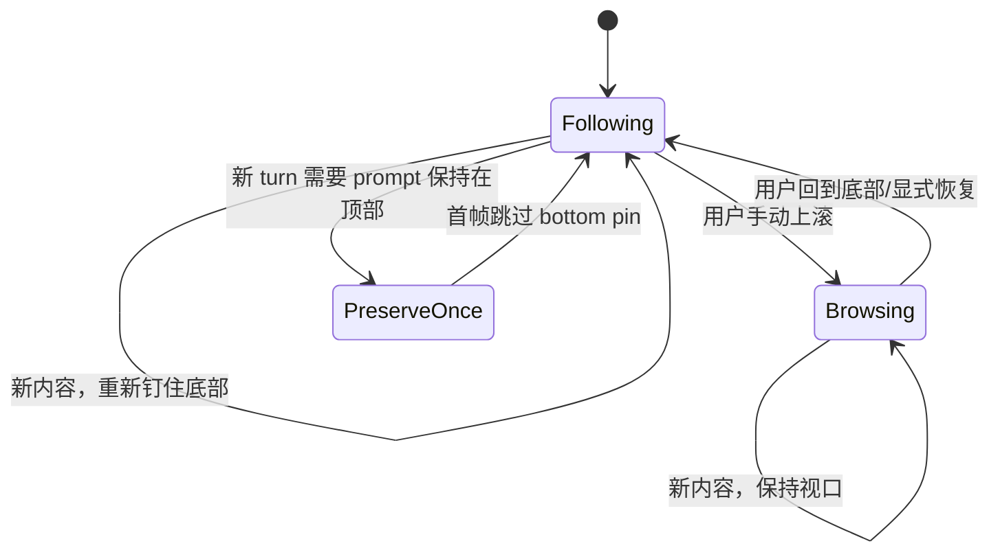
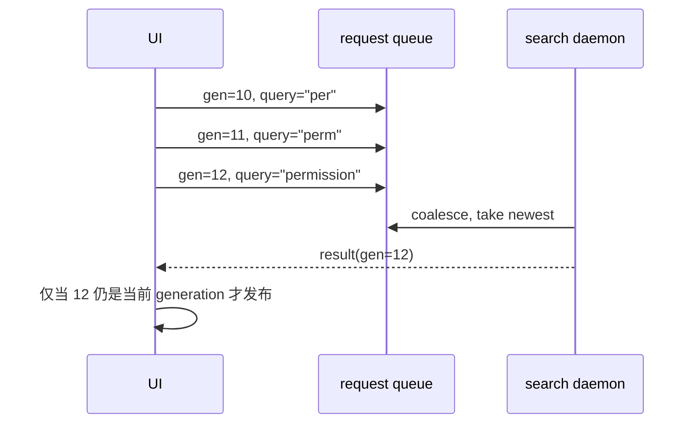

# 源码精读：Pager 如何把流式事件变成稳定的终端画面

Pager 不是一个把字符串直接 `println!` 出去的薄壳。它更接近一个保留模式（retained-mode）的终端 UI：ACP 事件先被归并成有稳定身份的条目，条目保存显示生命周期，布局层把条目映射到虚拟内容坐标，最后一帧渲染才把可见部分投影到终端屏幕。

这套分层要同时解决几类互相牵制的问题：

- 流式 delta 可能交错、重放，甚至先收到工具完成更新、后收到工具开始事件；
- 新内容持续增长，但用户可能正在上滚、搜索、选择文字或点击链接；
- resize 会改变几乎所有换行位置，却不应让视口跳到完全不同的内容；
- 长会话不能每帧重新做 Markdown 渲染、语法高亮和全量搜索索引；
- 折叠分组和 sticky prompt 会让“数据中的第 N 条”“虚拟第 Y 行”“屏幕第 Y 行”不再等价。

本文以以下源码为主线：

- [`acp/tracker.rs`](../../crates/codegen/xai-grok-pager/src/acp/tracker.rs)：把 ACP update 归并为 scrollback mutation；
- [`scrollback/block.rs`](../../crates/codegen/xai-grok-pager/src/scrollback/block.rs)：不同内容类型的渲染语义；
- [`scrollback/entry.rs`](../../crates/codegen/xai-grok-pager/src/scrollback/entry.rs)：稳定身份、显示状态和条目级缓存；
- [`scrollback/state/mod.rs`](../../crates/codegen/xai-grok-pager/src/scrollback/state/mod.rs)：条目集合、滚动、选择、generation；
- [`scrollback/state/layout.rs`](../../crates/codegen/xai-grok-pager/src/scrollback/state/layout.rs)：虚拟布局、惰性精确测量和 resize anchor；
- [`scrollback/state/groups.rs`](../../crates/codegen/xai-grok-pager/src/scrollback/state/groups.rs)：连续工具组的折叠投影；
- [`scrollback/sticky.rs`](../../crates/codegen/xai-grok-pager/src/scrollback/sticky.rs)：吸顶 prompt 的屏幕布局；
- [`scrollback/scrollback_pane.rs`](../../crates/codegen/xai-grok-pager/src/scrollback/scrollback_pane.rs)：一帧绘制的编排入口；
- [`scrollback/search.rs`](../../crates/codegen/xai-grok-pager/src/scrollback/search.rs)：搜索快照、后台 daemon 和陈旧结果防护；
- [`scrollback/text_selection.rs`](../../crates/codegen/xai-grok-pager/src/scrollback/text_selection.rs)：线性、单元格和表格网格选择；
- [`scrollback/link_map.rs`](../../crates/codegen/xai-grok-pager/src/scrollback/link_map.rs)：每帧可点击区域映射。

## 1. 先建立边界：控制面、数据面和投影面


可以把这条链分成三个平面：

| 平面 | 主要输入 | 主要输出 | 不应该承担的职责 |
|---|---|---|---|
| 控制面 | 用户 action、ACP notification | effect、scrollback mutation | 不直接绘制 terminal cell |
| 数据面 | `SessionUpdate` | `RenderBlock`、`ScrollbackEntry` | 不依赖某一帧的屏幕坐标 |
| 投影面 | state、viewport、theme | layout、buffer、link rect | 不修改会话事实 |

这个边界是排障的第一把尺子：事件已经进入 tracker 但没有 entry，是归并问题；entry 存在但高度为 0，是布局或分组问题；文字已画出但点不中，是屏幕区域映射问题。不要把所有现象都归因于“终端渲染”。

## 2. Tracker 是有记忆的 reducer

[`AcpUpdateTracker`](../../crates/codegen/xai-grok-pager/src/acp/tracker.rs) 的职责可以概括为：

```text
(旧 tracker 状态, 一条 SessionUpdate, 旧 ScrollbackState)
    -> (新 tracker 状态, 新 ScrollbackState)
```

它不是纯函数，因为会原地修改 state；但从推理方式看，它是一个 reducer。正确性不只取决于单条消息，还取决于此前保留的活动流和待完成工具。

核心状态包括：

```rust
current_agent_msg: Option<EntryId>
current_thinking: Option<EntryId>
pending_tools: HashMap<String, PendingTool>
orphan_updates: HashMap<String, acp::ToolCallUpdate>
skip_next_user_echo: bool
last_stream_start_ms: Option<i64>
```

### 2.1 agent 文本和 thought 是两条独立流

`current_agent_msg` 与 `current_thinking` 分开保存。这不是重复状态：thinking 和最终回答可能交错出现，而且二者默认显示模式、完成后的折叠策略和状态栏活动文案都不同。

同一兼容流中的 chunk 追加到原 entry，而不是每个 chunk 新建一条：

```text
AgentMessageChunk("hel")  -> create AgentMessage E17
AgentMessageChunk("lo")   -> append E17 => "hello"
AgentThoughtChunk("...")  -> finish E17, create Thinking E18
ToolCall(...)              -> finish active text/thought as required
```

如果错误地按 delta 建 entry，会同时破坏：

- 折叠粒度：一句话会变成几十个可折叠对象；
- 搜索结果：一个匹配跨 chunk 时无法命中；
- resize anchor：逻辑段落被拆成无意义的小块；
- 性能：entry、gap、缓存对象随 token 数增长。

### 2.2 `stream_start_ms` 是流边界，不只是时间戳

tracker 保存 `last_stream_start_ms`。当 notification meta 中的 stream start 改变，意味着新的模型流已经开始；仍在进行的 thinking 或 agent message 必须结束，后续 chunk 应新建 entry，不能追加到上一轮或上一推理阶段的尾部。

因此，看到两次回答被黏在一起时，应检查 stream boundary 是否传入、比较和清理，而不只是检查字符串追加代码。

### 2.3 工具更新按 ID 合并，而不是按到达顺序猜测

`pending_tools` 以 ACP tool-call ID 为键，`PendingTool` 同时保存：

- 基础 `ToolCall`，用于与后续 update 合并字段；
- 可选 `entry_id`，因为首条事件可能还不足以确定真正 block 类型；
- streaming UTF-8 decoder，处理任意字节边界切开的命令输出；
- eager creation 时记录的 `started_at`，防止 block 从 `Other` 精化为具体类型时丢失计时。

工具的初始消息可能只有 `kind=Other`，真正的 search/read/edit/execute 类型在第一条 in-progress update 才明确。延迟创建 entry 可以避免 UI 短暂画错类型；如果已经 eager create，则必须把计时等生命周期状态迁移到精化后的 block。

### 2.4 为什么需要 `orphan_updates`

分布式通知不能假定观察顺序严格等于逻辑顺序：

```text
ToolCallUpdate(id=42, status=completed)
ToolCall(id=42, title="cargo test")
```

第一条到达时还没有 `pending_tools[42]`。正确做法不是丢弃，而是暂存到 `orphan_updates`；基础 `ToolCall` 到达后合并，并直接创建已完成 entry。



turn 结束时 orphan 必须清空。否则一个永远等不到 base call 的旧 update 可能污染后续重用相同字符串 ID 的调用。这是“容忍局部乱序”与“限制乱序状态寿命”的组合。

### 2.5 UTF-8 delta 也是状态机问题

Bash 输出以字节增量到达时，一个多字节字符可能被切开：

```text
delta 1: [0xE4, 0xB8]
delta 2: [0xAD]              # 合起来才是“中”
```

每段分别 `from_utf8_lossy` 会产生两个替换字符。`Utf8Decoder` 保留末尾不完整的最多几个字节，下个 delta 到来后再解码；只有真正非法的序列才生成 `U+FFFD`。测试流式输出时必须覆盖字节边界，而不能只用 ASCII。

### 2.6 optimistic echo 只能跳过一次

发送 prompt 时 UI 已经本地插入 user entry，让用户立即看到输入。ACP 随后可能回显同一消息，`skip_next_user_echo` 只吸收下一次对应 echo，然后复位。

这个状态若不复位，会吞掉下一条真实用户消息；若完全没有它，当前 prompt 会出现两次。缩小实验中的“只跳过一次”正是在验证这条不变量。

## 3. `RenderBlock` 与 `ScrollbackEntry` 分工

[`RenderBlock`](../../crates/codegen/xai-grok-pager/src/scrollback/block.rs) 是内容多态层：user prompt、agent message、thinking、tool call、session event 等 block 各自决定输出、是否可折叠、默认显示模式、selection range 和 raw mode 支持。

[`ScrollbackEntry`](../../crates/codegen/xai-grok-pager/src/scrollback/entry.rs) 则是内容在 UI 中的生命周期容器：

| 字段 | 含义 |
|---|---|
| `id: EntryId` | 跨插入、删除仍稳定的外部句柄 |
| `block` | 具体内容和 block-specific 行为 |
| `is_running` | 是否仍在执行或流式生成 |
| `is_pending_user_input` | 是否卡在权限/提问，而不是主动运行 |
| `display_mode` | collapsed、truncated 或 expanded |
| `display_mode_pinned` | 用户是否显式固定模式，防止自动策略覆盖 |
| `raw` | 支持时显示原始 Markdown 等源码 |
| `created_at` / `finished_at` | 本地时间和完成后的视觉反馈 |
| `hook_data` | 工具条目附加的 hook 展示信息 |

“block 是内容，entry 是显示生命周期”是最重要的区分。改变工具输出要让内容缓存失效；用户切换 fold mode 是 entry 状态变化；权限等待时保留 `is_running` 相关语义但用 `is_pending_user_input` 改变 loading bullet，避免把“等人点击”画成“工具仍在工作”。

## 4. 稳定 ID 与有序存储

`ScrollbackState` 用 `IndexMap<EntryId, ScrollbackEntry>` 保存条目：

- map 键提供按稳定 ID 的平均 O(1) 查找；
- insertion order 提供确定的渲染顺序；
- 插入或删除前面的条目不会让外部 `EntryId` 失效。

这是典型的“身份”和“位置”分离：

```text
EntryId = 事实身份，供异步更新持有
usize index = 当前布局位置，只能在当前 state 快照中使用
```

异步任务若长期保存 index，前面插入一个 session event 后就可能更新错条目。正确模式是保存 `EntryId`，需要布局位置时再通过 state 查 index。

## 5. 三层条目缓存及其失效边界

长对话的成本主要不在把字符写进 buffer，而在 Markdown wrap、代码高亮、工具输出格式化和高度测量。`ScrollbackEntry` 使用互补的缓存：

### 5.1 完整渲染输出缓存

`CachedOutput` 的键包含：

```text
(width, raw, theme, effective_selection, cwd)
```

`cwd` 影响工具路径显示为相对还是绝对；`theme` 影响高亮；`raw` 改变 Markdown 渲染；宽度决定换行。selection 只有对输出确实随选中状态变化的 block 才进入有效 key，避免普通 block 因上下移动选择而无意义 miss。

### 5.2 truncated 高度缓存

sticky prompt 和折叠布局只需要 truncated 模式的高度，但计算这个高度仍可能触发完整 Markdown wrap 或 syntect 高亮。因此单独保存：

```text
(width, raw, theme, cwd, height)
```

它与完整 output 分离，因为很多布局路径只需要行数，不需要保留所有 styled lines。

### 5.3 source line width 缓存

`cached_line_widths` 保存每个源码逻辑行的 display width。它与终端宽度无关，所以 resize 时保留；新宽度下只需做每行 `ceil(line_width / content_width)` 的便宜估算。

这条优化把 resize 从“重新遍历并复制整段会话文本”缩小为“重算宽度数组上的整数运算”。内容变化调用 `invalidate_cache()`，会连 source widths 一起清掉；纯 resize 调用 `invalidate_width_caches()`，保留 widths。

### 5.4 缓存失效表

| 变化 | output | truncated height | estimated lines | source widths |
|---|---:|---:|---:|---:|
| 内容追加/替换 | 清除 | 清除 | 清除 | 清除 |
| fold/raw/theme/cwd 影响输出 | 清除 | 清除 | 清除 | 视内容是否变化 |
| terminal resize | 清除 | 清除 | 清除 | 保留 |
| 条目离开视口后的内存回收 | 可驱逐 | 保留 | 保留 | 保留 |

缓存 bug 往往不是“没有缓存”，而是依赖集合少了一项，或失效范围太大。前者产生陈旧画面，后者产生卡顿。

## 6. `LayoutCache`：从 entry 到虚拟内容空间

[`LayoutCache`](../../crates/codegen/xai-grok-pager/src/scrollback/state/layout.rs) 保存：

```rust
entries: Vec<EntryLayoutInfo>          // height + gap_after 等
entry_truncated_heights: Vec<u16>
measured: Vec<bool>                    // 精确值还是估算值
virtual_y: Vec<usize>                  // 每条的虚拟起始 Y
prompt_descriptors: Vec<PromptDescriptor>
groups: Vec<GroupSpan>
width: u16
```

虚拟内容空间把“完整历史有多高”与“terminal 只有几十行”分开：

```text
entry 0: virtual_y=0,   height=3, gap=1
entry 1: virtual_y=4,   height=18, gap=1
entry 2: virtual_y=23,  height=2, gap=0
viewport: scroll_offset=12, height=10
```

屏幕只需考虑与 `[12, 22)` 相交的部分。`virtual_y` 单调递增，可用二分查找定位某个 content Y 属于哪条 entry，而不必从头累计。

### 6.1 估算优先，进入视口后精确测量

批量加载历史时，所有 entry 一开始可以用 source width 得到廉价高度估算；进入或接近 viewport 时再做精确渲染和测量，并把 `measured[idx]` 置为 true。

这是一种虚拟列表策略：首屏延迟与可见内容量相关，而不是与总会话字节数严格线性相关。精确高度替换估算时仍要修复 scroll offset，避免可见内容突然跳动。

### 6.2 resize 不能只保存绝对行号

宽度变化后，旧的 wrapped row 没有稳定含义。`ScrollAnchor` 因此记录：

```text
(entry_idx, logical_line, sub_rows)
```

逻辑行由换行符定义，与终端宽度无关；`sub_rows` 表示在该逻辑行包裹结果中的偏移。重建布局后重新定位同一 entry 和逻辑行，即使长段落重新换行，视口最多在该行内部发生受控漂移，不会跳到完全不同的对话位置。

## 7. 分组折叠：数据仍在，布局高度可以为零

连续、同类的工具步骤可以投影成一个 group。[`groups.rs`](../../crates/codegen/xai-grok-pager/src/scrollback/state/groups.rs) 计算权威 `GroupSpan`，再把结果投影到每条 `EntryLayoutInfo`。

折叠不是从 `IndexMap` 删除成员，而是让隐藏成员的布局高度为 0：

```text
IndexMap:     [header, hidden-1, hidden-2, visible-tail]
layout h:     [1,      0,        0,        3]
```

这样工具 update 仍能按稳定 ID 找到隐藏条目，展开时原数据仍在。代价是 selection 可能落到不可见成员；`fixup_hidden_selection()` 会向后寻找可见 group header，优先把选择移到展开控件所在行。

需要维护的不变量是：

```text
selected == None
or selected entry has visible height > 0
```

如果键盘焦点“消失”，先查 group pass 后是否执行 selection repair。

## 8. Sticky prompt 与坐标变换

普通 scrollback 的映射近似为：

```text
screen_y = content_y - scroll_offset + content_area.y
```

prompt 吸顶后，顶部若干屏幕行被 sticky 区占用；某些 prompt 从自然位置被投影到固定位置，正文可见区也随之变化。此时必须显式区分：

- entry/index space：数据结构中的位置；
- virtual content space：完整历史累计 Y；
- viewport space：扣除 scroll offset 后的位置；
- screen space：加上 pane origin、sticky 和 overlay 后的 terminal 坐标。



鼠标 hit test、文字选择、链接点击都必须使用与当前帧绘制相同的变换。仅凭 entry 高度重新推导而忽略 sticky 区，会出现“看到的是 A，点中的却是 B”。

## 9. Follow mode 不是简单的“永远滚到底”

`ScrollbackState` 保存 `scroll_offset`、`follow_mode` 和 `follow_preserve_scroll`。典型状态转换如下：



`follow_preserve_scroll` 用于新 turn 等场景：既要开启后续自动跟随，又要在第一帧保住 prompt 的位置，不能立刻把它推离视口。

关键不变量：

- 用户主动设置 offset 会关闭 follow；
- follow 模式下结构或高度变化后重新计算最大 offset；
- 非 follow 状态 resize 时恢复逻辑 anchor；
- 新 delta 不得擅自把 Browsing 改回 Following。

所以“流式输出把我正在读的旧内容拉走”通常是 follow 状态被误置，而不是 ACP 事件顺序错误。

## 10. 两种 generation 解决两种陈旧性

`ScrollbackState` 有两个单调 wrapping counter：

| counter | 何时增加 | 主要消费者 |
|---|---|---|
| `generation` | 内容、位置、外观、滚动、viewport 等可见投影变化 | `VisibleLinkMap` 等屏幕坐标缓存 |
| `content_generation` | 实际可搜索内容变化；同时也增加 `generation` | search index/snapshot |

滚动会让链接 rect 失效，却不会改变可搜索文本；如果搜索索引也绑定普通 `generation`，每次方向键滚动都要重建所有 entry 的 searchable string。双 generation 把“画面变了”和“语料变了”分开。

实现关系可写成：

```text
bump_content_generation():
    content_generation += 1
    generation += 1

bump_generation():
    generation += 1
```

新增 mutation API 时必须先回答：它改变文本事实，还是只改变投影？这决定调用哪一个 bump。

## 11. 搜索 daemon、合并突发和 ABA 防护

[`search.rs`](../../crates/codegen/xai-grok-pager/src/scrollback/search.rs) 不在 UI thread 上每次按键都全量搜索。其核心流程是：

1. 根据 `content_generation` 同步 owned searchable-text snapshot；
2. UI 同步增加 `request_generation` 并提交 query/snapshot；
3. daemon 合并短时间内的突发更新，只计算最新请求；
4. 结果携带 request generation 返回；
5. UI 只接受仍对应当前请求的结果。



为什么不能只比较 query 字符串？考虑 ABA：用户输入 `a`，改成 `ab`，又删回 `a`。最早那次 `a` 的慢结果字符串上仍“匹配当前 query”，但基于的内容快照和导航状态可能已经过时。单调 request generation 区分了两个表面相同的 `a`。

## 12. 文字选择保存逻辑位置，表格选择保存语义单元格

[`text_selection.rs`](../../crates/codegen/xai-grok-pager/src/scrollback/text_selection.rs) 的可选行包含：

```text
entry_idx
range_id
block_line_idx
screen_y / screen_x
selectable_cols
text
joiner_to_previous
```

屏幕坐标用于本帧 hit test；`entry_idx + range_id + block_line_idx` 才是跨滚动重建时较稳定的逻辑定位。Unicode grapheme 和 display width 也必须参与列计算：字节偏移、字符数和终端 cell 数不是同一个量。

选择形状有三种语义：

| `SelectionKind` | 行为 | 复制结果 |
|---|---|---|
| `Linear` | 普通跨行文本选择 | 按 selection boundary 重建文本 |
| `TableCell` | 限制在单个表格 cell/band | 单元格文本 |
| `TableGrid { anchor, head }` | 选择矩形单元格区域 | 按行列输出 TSV |

网格选择携带 `CellRef`，而不是复制时再从画面字符猜表格。空 cell 必须保留为空 TSV field；表格边框上的 anchor 则退回 linear，给用户保留选择原始渲染文本的路径。

## 13. `VisibleLinkMap` 是一帧有效的空间索引

Markdown hyperlink 和 citation 在 render pass 中生成屏幕 `Rect`。同一逻辑链接换行后有多个 rect；连续且同 ID 的 overlay segment 会合并成一个 `VisibleLink`。

`VisibleLinkMap` 保存创建它时的 `generation`：

```rust
map.is_stale(state.generation())
```

任何滚动、resize、fold 或内容变化都可能使 rect 失效，因此点击前必须确保 map 来自当前投影。裸 URL 还可通过“所有绘制 rect 的 cell 宽度之和是否等于 URL display width”判断展示形式。

这是一个通用原则：凡缓存的是屏幕坐标，就应绑定包含所有几何依赖的 generation，而不是绑定内容版本。

## 14. 一帧渲染的工作顺序

省略 block-specific 绘制后，一帧可理解为：

```text
prepare_layout(width, viewport)
  -> 必要时重建 layout cache
  -> 修复 group 中隐藏 selection
  -> settle 可见/邻近 entry 的精确高度
  -> 根据 follow 或 anchor 修正 scroll_offset
  -> 计算 sticky prompts 和可见 entry range

render_with_scratch(area, state, scratch)
  -> 只渲染可见 entry
  -> 复用 entry output cache 和 scratch allocations
  -> 投影 selection/highlight/media
  -> 收集 link overlay/citation rect
  -> 重建本帧 VisibleLinkMap
```

“prepare 后只读地 render”让状态变更点集中。若绘制函数暗中改变 scrollback 事实，generation、cache 和当前 frame snapshot 很容易彼此不一致。

## 15. 理论视角

### 15.1 保留模式渲染

立即模式只记“这一帧画什么”；保留模式保存有身份、有生命周期的场景对象，再重复投影。Pager 的 `EntryId + ScrollbackEntry + LayoutCache` 是保留模式结构，ratatui buffer 是最后的立即模式输出。

### 15.2 事件归并与最终一致

tracker 接受合法的局部乱序，以 ID 合并 base/update，并在 turn boundary 清理无法完成的中间状态。这比假定 transport 全序更稳健，也比无限保存 orphan 更有界。

### 15.3 虚拟化与增量计算

布局先估算、可见后精测；渲染缓存可驱逐但高度缓存保留；搜索只在 content generation 变化时重建。这些策略都在把成本从“总历史大小 × 每帧”降到“变化量 + 可见窗口”。

### 15.4 坐标变换与命中一致性

绘制和 hit test 必须共享同一个 entry-to-screen 变换。sticky、scroll、wrap 和 group 任意一个遗漏，都会造成视觉与交互分离。

### 15.5 generation 是依赖版本，不是业务版本

不同缓存依赖不同事实，所以需要不同 generation。版本计数器的设计目标不是记录“发生了多少事”，而是回答“这个派生值依赖的输入是否变过”。

## 16. 故障矩阵

| 症状 | 首查状态 | 常见原因 |
|---|---|---|
| 有 ACP update，没有 entry | tracker 当前流、skip flag、suppressed tool | 分支漏处理、错误吞 echo、工具被抑制 |
| 工具完成事件先到后永久丢失 | `orphan_updates` | 未缓存或 base 到达时未合并 |
| 工具类型先闪错再变 | `PendingTool.entry_id` | 信息不足时过早创建 `Other` block |
| 中文输出出现 `�` | `Utf8Decoder.buffer` | 对每个 byte delta 独立 lossy decode |
| 两轮回答黏在一起 | `last_stream_start_ms` | 新流没有 finish 旧 active entry |
| entry 存在但看不到 | cached height、group span | 高度为 0、offset 超界、布局未失效 |
| 折叠后键盘焦点消失 | selected index | selection 仍落在 hidden member |
| resize 后跳到别的段落 | `ScrollAnchor` | 用绝对 wrapped row 恢复位置 |
| 手动上滚仍被拉到底部 | `follow_mode` | 内容 mutation 误开启 follow |
| 搜索结果回跳 | request generation | 接受了旧 daemon result/ABA snapshot |
| 链接点中相邻文字 | link-map generation | 使用滚动或 resize 前的 rect |
| 长会话每帧卡顿 | cache hit、measured range | 全量精测、selection 导致无效 cache miss |

## 17. 测试证据应该分层

### 17.1 reducer 单测

构造事件序列并断言 entry 数、稳定 ID、running 状态和合并文本：

- agent/thought 分流；
- tool base/update 正序与逆序；
- terminal update 后 pending 清理；
- UTF-8 字符跨 delta；
- prompt optimistic echo 只跳过一次；
- stream start 改变时切断旧流。

### 17.2 state/layout 单测

- push/remove 后 ID 不变、index 正确变化；
- group hidden member 高度为 0，selection 修复到 header；
- follow 与 manual browse 转换；
- resize 后 logical anchor 保持；
- 内容 mutation 增加两个 generation，纯滚动只增加普通 generation；
- estimated height 被精确值替换时 viewport 不失控。

### 17.3 搜索与交互单测

- burst query 只发布最新 generation；
- `a -> ab -> a` 不接受第一次 `a` 的结果；
- linear、cell、grid 复制，grid 输出 TSV；
- wide character、combining grapheme 和换行链接 hit test；
- generation 变化后 link map 判 stale。

### 17.4 PTY/snapshot

数据结构测试发现不了 cell 级错位，最终仍需固定宽高验证：

- 窄终端下 Markdown、代码块、表格和 URL 换行；
- sticky prompt 与第一条正文不重叠；
- 展开/折叠后 bullet、gap 和 selection overlay；
- 图片或媒体占位对后续 virtual Y 的影响；
- completion accent 和 pending-user-input 动画不会改变布局尺寸。

## 18. 可运行缩小实验

[`mini_pager_reducer.rs`](../rust-essentials/labs/async-demos/src/bin/mini_pager_reducer.rs) 把事件归并缩成一个可观察 reducer：

```sh
cargo run --locked \
  --manifest-path docs/rust-essentials/labs/async-demos/Cargo.toml \
  --bin mini_pager_reducer
```

运行前先预测：最终有多少 entry、每条稳定 ID 是什么、哪个工具 update 会进入 orphan、手动上滚后 follow 是否恢复。这个实验不模拟 Markdown layout、Unicode cell width、sticky transform 和 terminal draw；这些应分别由 layout 单测与 PTY snapshot 覆盖。

## 19. 建议的源码阅读练习

1. 从 `AcpUpdateTracker::handle_update` 追一条 agent chunk，列出所有会结束 `current_agent_msg` 的事件。
2. 构造工具 completion 先于 base call 的时序，标出 `orphan_updates -> pending_tools -> ScrollbackEntry` 的所有权迁移。
3. 找出 content mutation 最终调用 `bump_content_generation()` 的路径，再找一个只调用 `bump_generation()` 的滚动路径，解释为何不能合并。
4. 选择一个 200 行 Markdown entry，手算宽度从 80 变 40 时哪些缓存清除、哪些保留。
5. 从 `virtual_y` 到 screen rect 写出包含 scroll offset 和 sticky prompt 的坐标转换，并用一个点击案例验证逆向 hit test。
6. 阅读 search daemon 的 enqueue/poll，证明旧 generation 结果不可能覆盖新结果，并专门验证 ABA 场景。
7. 阅读 table selection 的 `CellRef` 路径，解释为什么 TSV 应从 table geometry 生成，而不是从带边框的屏幕文本解析。

完成这些练习后，再看一个 Pager bug 时，应该能先判断它属于事件归并、显示生命周期、布局、缓存失效还是屏幕交互，而不是直接在最终 draw 函数里试错。
