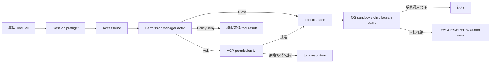
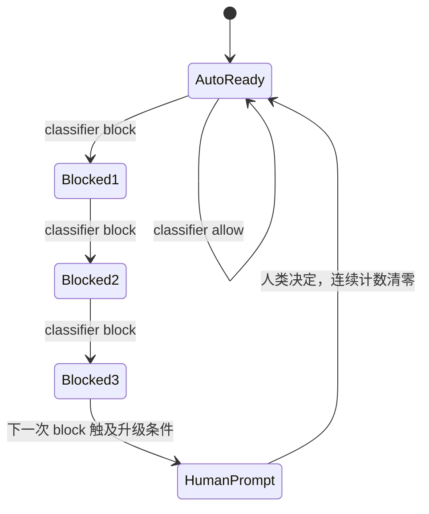
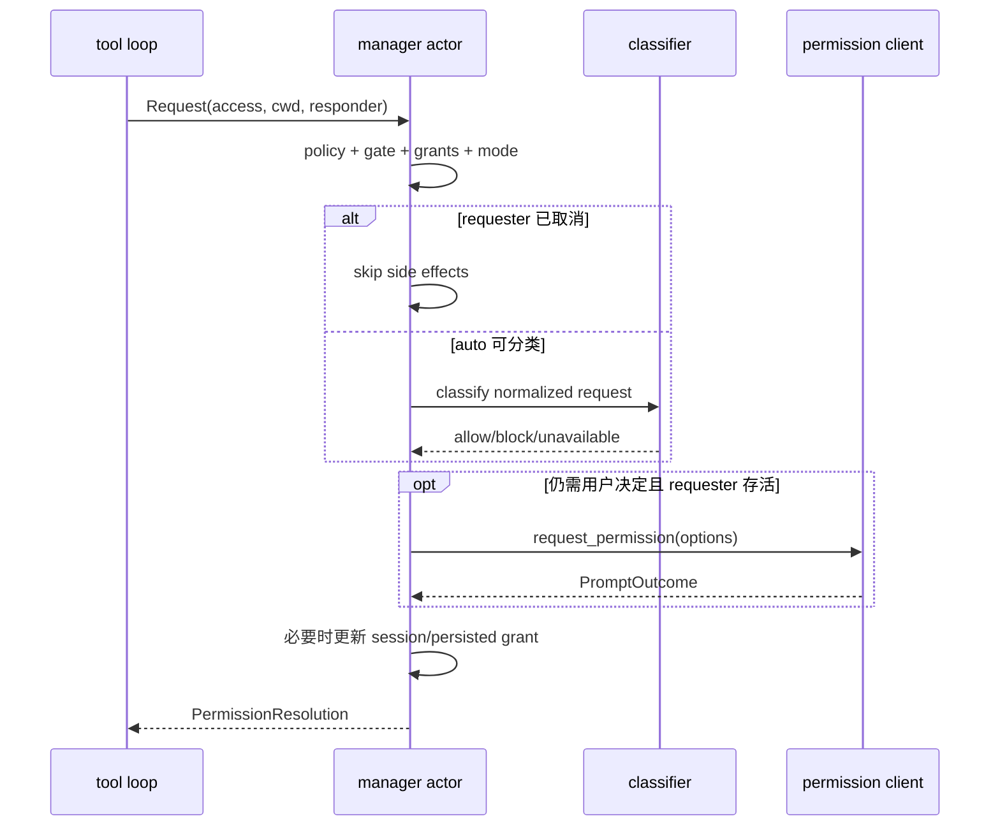

# 源码精读：工具权限、策略与操作系统沙箱

模型产生一个 tool call，不代表这个调用已经获得执行权。Grok Build 把“能否执行”拆成多个边界：Session 判断当前 turn 是否允许这种动作，PermissionManager 解释策略和用户授权，工具启动路径再受操作系统 sandbox 能力约束。

这几层不能互相替代：

- prompt 是用户意图确认，不是内核访问控制；
- YOLO/always-approve 可以减少询问，不能覆盖 managed deny；
- sandbox 能阻止部分真实系统调用，却不知道某次编辑是否符合用户意图；
- 一个权限 `Allow` 只表示产品策略通过，不能证明 sandbox 已成功安装；
- 一个 sandbox `EACCES` 也不表示 permission manager 曾经拒绝。

本文主要阅读：

- [`permission/manager/mod.rs`](../../crates/codegen/xai-grok-workspace/src/permission/manager/mod.rs)：Actor、模式、队列、决策和授权更新；
- [`permission/manager/request_classification.rs`](../../crates/codegen/xai-grok-workspace/src/permission/manager/request_classification.rs)：请求分类和 auto denial budget；
- [`permission/policy.rs`](../../crates/codegen/xai-grok-workspace/src/permission/policy.rs)：规则编译、Bash gate 和组合优先级；
- [`permission/gate_preflight.rs`](../../crates/codegen/xai-grok-workspace/src/permission/gate_preflight.rs)：保留 Ask 来源并决定能否交给 auto classifier；
- [`permission/state.rs`](../../crates/codegen/xai-grok-workspace/src/permission/state.rs)：按 cwd/client 保存授权；
- [`permission/prompter.rs`](../../crates/codegen/xai-grok-workspace/src/permission/prompter.rs)：ACP 选项与用户结果映射；
- [`permission/types.rs`](../../crates/codegen/xai-grok-workspace/src/permission/types.rs)：`AccessKind`、`Decision`、command 和 telemetry；
- [`xai-grok-sandbox/src/lib.rs`](../../crates/codegen/xai-grok-sandbox/src/lib.rs)：进程级 sandbox 安装和 child network 开关；
- [`xai-grok-sandbox/src/profiles.rs`](../../crates/codegen/xai-grok-sandbox/src/profiles.rs)：profile 解析与 capability set；
- [`xai-grok-sandbox/src/hook_write_deny.rs`](../../crates/codegen/xai-grok-sandbox/src/hook_write_deny.rs)：global hook 完整性保护；
- [`xai-grok-sandbox/src/network_policy.rs`](../../crates/codegen/xai-grok-sandbox/src/network_policy.rs)：未来精确 origin 策略的数据模型。

相关背景：

- [`tool-call-pipeline.md`](./tool-call-pipeline.md)：工具注册、dispatch 和结果回写；
- [`message-flow.md`](./message-flow.md)：权限等待如何插入完整消息流；
- [`xai-grok-shell tool_calls.rs`](../../crates/codegen/xai-grok-shell/src/session/acp_session_impl/tool_calls.rs)：turn 内 preflight 与 resolution 消费。

## 1. 威胁模型：到底在防什么

权限系统至少面对五类风险：

1. 模型误判：生成了用户并未授权的删除、推送或外部请求；
2. 输入混淆：复杂 shell wrapper、内嵌脚本或重定向绕过浅层命令匹配；
3. 规则冲突：一个宽泛 allow 意外覆盖更具体的 deny；
4. 授权扩张：一次 literal grant 被当成 glob，或一个 MCP tool grant 扩大成整个 server；
5. 执行时绕过：进程在通过产品策略后，经符号链接、硬链接、路径替换或新子进程访问受保护资源。

这解释了为什么架构不是单个 `if allowed { run() }`。

## 2. 三个主要执行边界



| 层 | 掌握的信息 | 能做什么 | 做不到什么 |
|---|---|---|---|
| Session preflight | turn mode、工具类型、取消状态 | plan-mode gate、决定是否进入权限流程 | 不能约束任意 syscall |
| PermissionManager | access、规则、授权、用户选择、auto/yolo | 产出语义 `Decision` | `Allow` 后无法替代内核强制 |
| OS sandbox/launch | profile、路径和平台能力 | 限制真实文件/网络能力 | 不理解 prompt 和用户意图 |

安全结论必须写明层级。例如，“policy denied”比“命令失败”精确；“sandbox requested”也不等于“sandbox applied”。

## 3. 先把工具输入归一成 `AccessKind`

策略不直接依赖几十个工具实现类，而是接收语义访问：

```rust
pub enum AccessKind {
    Read(Option<String>),
    Grep { path: Option<String>, glob: Option<String> },
    Edit(String),
    Bash(String),
    MCPTool { name: String, input: serde_json::Value },
    WebFetch(String),
    WebSearch(String),
}
```

这种归一化有两个效果：

- `ReadFile`、`ListDir` 等具体工具可以共享 read policy；
- auto classifier 仍能看到 Bash 原文或 MCP raw JSON，而不是只有一个模糊工具名。

### 3.1 路径必须绑定请求者 cwd

`RequestPathContext` 区分真实执行 cwd 与展示 cwd。共享 manager 可能同时服务父 agent 和不同 cwd 的 subagent；相对路径规则和 shell 文件 operand 必须以请求者的真实 cwd 解析，不能偷用 manager 创建时的 cwd。

```text
manager cwd: /repo
subagent request cwd: /repo/packages/a
Edit("src/lib.rs") -> /repo/packages/a/src/lib.rs
```

若错误锚定到 `/repo/src/lib.rs`，既可能误放行，也可能误拒绝。UI 为了简洁显示相对路径，可以使用 display cwd，但安全决策只能使用执行语义。

## 4. `Decision` 不是一个布尔值

```rust
pub enum Decision {
    Allow,
    Ask,
    FollowupMessage(String),
    Reject(String),
    PolicyDeny(String),
    Cancelled,
}
```

| 决策 | 来源 | 调用方应如何处理 |
|---|---|---|
| `Allow` | policy、grant、auto、YOLO、用户批准 | 继续 dispatch |
| `Ask` | binding ask 或 needs-user floor | 发起权限交互 |
| `FollowupMessage` | 用户在权限 UI 输入补充信息 | 不执行，把消息交回对话流 |
| `Reject` | 用户显式拒绝 | 通常以 permission reject 结束当前 tool loop |
| `PolicyDeny` | 管理策略 deny | 把原因作为模型可读结果，让模型调整方案 |
| `Cancelled` | 权限交互被取消 | 以 cancelled stop reason 结束 |

`Reject` 与 `PolicyDeny` 特意分开。企业策略阻止 `git push` 时，模型应看到“这条路径禁止”并尝试生成 patch；用户按下取消则表示当前交互结束。把二者压成同一错误会改变 turn 控制流。

`PermissionResolution` 还携带 manager 生成的唯一权威 `PermissionEvent`。shell 可以从中读取 mode、classifier verdict、security findings、wait time、queue depth，但不应再自行推导并发出第二份看似相同的事件。

## 5. PermissionManager 为什么是 Actor

Manager 通过 command channel 串行接收请求和模式变更，每个 `Request` 带一个 oneshot responder。Actor 模型集中拥有：

- persisted/session grants；
- YOLO 与 auto mode；
- auto denial counters；
- 当前权限 UI/并发请求状态；
- telemetry 事件顺序。

```mermaid
sequenceDiagram
    participant T1 as parent tool loop
    participant T2 as subagent tool loop
    participant A as PermissionManager actor
    participant P as AcpPrompter
    T1->>A: Request(access A, oneshot A)
    T2->>A: Request(access B, oneshot B)
    A->>A: dequeue A + preflight/classify
    A->>P: prompt A if needed
    P-->>A: PromptOutcome
    A-->>T1: PermissionResolution A
    A->>A: dequeue B; first check requester alive
    A-->>T2: PermissionResolution B
```

串行所有权避免两个并发 prompt 同时更新同一个 grant set 或 denial budget。代价是请求可能排队，因此 telemetry 的 `wait_ms` 从 actor dequeue 后开始，不能与 channel 排队时间混为一谈；`queue_depth` 记录共享 handle 上的并发 in-flight 数，也不是“用户本轮点了几次 yes”。

### 5.1 已死亡 requester 必须被跳过

请求在队列里等待时，tool loop 可能已经取消并 drop oneshot receiver。Actor 在昂贵 classifier 或 prompt 前后检查 `respond_to.is_closed()`：

- 已关闭则不再弹出一个无人接收的权限框；
- 释放队列位置，让后续活请求继续；
- 记录 requester-gone 原因时不能伪装成用户 reject；
- 中途死亡也不能错误修改 denial budget 或持久 grant。

这是 async cancellation 的关键规则：drop receiver 不只是“最终 send 会失败”，而是上游生命周期已经终止，应尽早停止副作用。

## 6. `CompiledPolicy` 的优先级与顺序无关

策略编译后按安全优先级组合：

```text
deny > ask > allow > no match
```

因此规则文件中先写 allow 还是先写 deny，不应该改变结果。一个宽泛 `Allow Any` 不能覆盖命中的 deny；Ask 也不能因另一个 allow 而消失。

这是一种单调策略：添加限制规则只会保持或收紧结果，不应因为排列位置反而放宽。它比“first match wins”更适合合并用户、项目和 managed 多来源策略。

### 6.1 managed deny 是不可下降的安全地板

显式 managed deny 必须早于并压过：

- YOLO/always-approve；
- auto classifier 的 allow；
- 持久化 allow grant；
- session grant；
- shell safe-command/static allowlist。

否则本地点击一次“always allow”就可能绕过企业规则。读 manager 分支时，不要只看最终 `Allow` 分支，要验证 deny 是否在所有 fast path 前形成 floor。

## 7. Bash 不是一个字符串匹配问题

如果只检查命令开头，下面的脚本都会制造绕过空间：

```sh
echo safe && rm -rf build
env FOO=1 timeout 5 sh -c 'git push origin main'
env -S 'bash -c "curl https://example.invalid"'
cat protected.txt > copied.txt
```

[`policy.rs`](../../crates/codegen/xai-grok-workspace/src/permission/policy.rs) 的 Bash gate 会：

1. 将完整 script 拆成 command segments；
2. 归一化 `env`、`timeout` 等 wrapper；
3. 递归检查 `bash -c` / `sh -c` 的 literal 内嵌脚本；
4. 对高置信度 `env -S` split string 使用共享递归预算；
5. 另外分析 shell file operands，使 Read/Edit 限制不能被 shell 间接绕过；
6. 对所有 segment 合并升级结果。

### 7.1 deny/ask gate 只负责升级

`evaluate_bash_command_gate` 返回：

```rust
enum GateDecision {
    Reject(String),
    AskRuleMatch,
    AskFailClosed,
}
```

它不会返回 allow，因为 gate 的职责是从复杂脚本中发现更严格的约束。优先级为：

```text
Reject > AskRuleMatch > AskFailClosed
```

只要任一嵌套 segment 命中 deny，整个脚本拒绝；一处明确 Ask 与另一处解析不明并存时，保留 rule-match Ask 的来源。

### 7.2 allow 对链式脚本是合取，不是析取

Bash allow 的正确条件是：

```text
allow(script) = allow(segment_1)
             AND allow(segment_2)
             AND ...
             AND allow(segment_n)
```

不是“有一个 segment 命中 allow 即放行”。例如只授权 `cargo test*`，不能因此放行 `cargo test && curl ...`。

### 7.3 解析不确定时返回 `AskFailClosed`

以下情况不能被静默当作安全：

- script 无法可靠拆分；
- wrapper 归一化耗尽或存在歧义；
- inline shell 超过递归深度；
- 动态生成、不可固定的 `-c` 参数；
- `env -S` 形状不明确；
- shell file operand 无法可靠锚定。

fail-closed 在这一层的含义是“不能自动证明安全，因此至少 Ask”，不是“立刻由 OS 阻止”。这个术语的层级必须写清。

## 8. `GatePreflight` 为什么保留 Ask 来源

如果把 `AskRuleMatch` 和 `AskFailClosed` 过早压成普通 `Decision::Ask`，auto mode 就无法区分：

- 管理员明确要求这类命令必须问人；
- 解析器无法判断，允许更强 classifier 继续判断。

`GatePreflight` 同时保存 direct policy、bash-command gate、shell-file gate 和 `defers_gate_ask`：

```text
explicit rule Ask
  -> binding prompt
  -> auto classifier 不得豁免

fail-closed Ask + auto mode
  -> 可暂时 defer 给 classifier
  -> classifier block 在预算内可直接拒绝
  -> classifier allow 才可能继续其他 floor
```

若同一脚本既有明确 Ask 又有 fail-closed Ask，明确 Ask 胜出并保持 binding。来源还决定 telemetry 的 `decision_reason` 是 `policy_ask`、`bash_command_gate_ask`、`shell_file_gate_ask` 还是 classifier/budget 原因。

## 9. 请求分类的安全地板与 fast path

Manager 不能只按“policy -> mode -> prompt”三步线性处理，因为有些请求天然需要人，有些可走静态安全路径，还有些可交给 classifier。理解代码时可按优先级检查：

```text
1. requester 是否仍存活
2. managed/direct deny floor
3. binding Ask / request floor / needs-user
4. 已保存 deny 或 grant
5. YOLO / sandbox auto / safe command 等合规 fast path
6. auto classifier（若 preflight 允许）
7. 用户 prompt
```

具体分支会随 access kind 和 client 能力不同，但原则是：任何自动 allow 都必须先证明没有不可覆盖的 floor。

## 10. YOLO 与 auto mode 不等价

```text
SetYoloMode(true) -> 清除 auto，进入 always-approve 产品模式
SetAutoMode(true) -> 清除 yolo，进入 classifier 模式
managed pin       -> 客户端不能解除或绕过管理员约束
```

YOLO 主要回答“产品是否继续询问”，auto 回答“能否由 classifier 代替部分人工判断”。两者互斥，且都不能覆盖 managed deny 或 binding Ask。

还要区分 sandbox auto-allow：某些路径会在确认 sandbox 真正 active 时自动批准 Bash，但这仍是 permission decision fast path，不等于关闭 sandbox。若 sandbox 只是 configured/requested 而未 applied，不应把它当成 active 证据。

## 11. Auto classifier 的拒绝预算

Auto 模式不能无限自动 block，让用户既看不到 prompt 又无法推进。当前常量为：

```rust
AUTO_DENY_CONSECUTIVE_LIMIT = 3;
AUTO_DENY_TOTAL_LIMIT = 20;
```

Manager 维护：

- `auto_consecutive_denials`：连续 classifier block 次数；
- `auto_total_denials`：该 actor 生命周期内累计次数。

预算内的 block 可以直接拒绝；达到连续或总量边界后，下一条需要升级到用户 prompt，并用 `auto_denial_limit` 记录触发原因。人类作出决定后，连续计数应重置；总量限制仍用于防止通过交替请求长期规避升级。



Classifier timeout/unavailable 不是经过证明的 allow。telemetry 分开保存 `classifier_source`、`classifier_verdict`、`security_findings` 和计数，不能从最终 decision 反推 classifier 实际做过什么。

## 12. Prompt outcome 会改变不同作用域的状态

[`PromptOutcome`](../../crates/codegen/xai-grok-workspace/src/permission/prompter.rs) 包含：

| outcome | 作用 |
|---|---|
| `AllowOnce` | 只允许当前请求 |
| `AllowAlways` | access-kind 默认的持久授权路径 |
| `AllowEditsForSession` | 仅当前 session 允许编辑，不落盘 |
| `AllowAlwaysBashCommand(String)` | literal/prefix 语义的 Bash grant |
| `AllowAlwaysBashGlob(String)` | 用户显式编辑的 glob grant |
| `AllowAlwaysDomain(String)` | web fetch domain grant |
| `AllowAlwaysMcpTool(String)` | 精确 MCP tool grant |
| `AllowAlwaysMcpServer(String)` | 经验证 qualified ID 的 server-wide grant |
| `RejectOnce` | 当前请求拒绝 |
| `RejectAlwaysBashCommand(String)` | 保存 Bash deny |
| `Cancelled` | 取消 turn |
| `FollowupMessage(String)` | 把补充文字交回对话 |
| `Error(String)` | 权限交互失败，按 deny 侧处理 |

`AcpPrompter` 根据 client type 构造不同 UI 元数据，但 manager 必须验证返回的 payload。客户端发回的 server 名或 glob 不能因为“来自权限 UI”就自动可信。

## 13. 授权持久化：作用域必须窄且可验证

[`PermissionState`](../../crates/codegen/xai-grok-workspace/src/permission/state.rs) 把不同 grant 分开保存：

```rust
allowed_bash_commands: HashSet<String>
allowed_bash_globs: HashSet<String>
allowed_web_fetch_domains: HashSet<String>
allowed_mcp_tools: HashSet<String>
allowed_mcp_servers: HashSet<String>
```

### 13.1 literal Bash 与 glob 必须分离

用户批准的原始命令可能恰好包含 `*`、`?`、`[` 等 shell 元字符。如果所有字符串都送进 glob matcher，一次具体授权会意外扩大匹配集合。

因此：

```text
AllowAlwaysBashCommand -> literal/prefix 集合
AllowAlwaysBashGlob    -> 只有用户显式编辑 pattern 才进入 glob 集合
```

这体现了 capability 最小化：授权对象应是用户实际选择的能力，而不是系统从字符串“聪明推导”的更大能力。

### 13.2 MCP tool 与 server grant 必须分离

精确 tool grant 只按完整工具名匹配；server-wide grant 只有在完整 qualified MCP ID 通过格式校验后才能提取 server component。

`validated_mcp_server_grants_version` 证明保存的 server grant 来自新验证路径。加载旧状态时，版本低于当前值会清空 server-wide grants 并原子写回；不能把来源不明的 legacy 字符串继续当成广域授权。

### 13.3 cwd 与 client identifier 共同限定状态

持久状态位于 cwd 对应的 session 目录，文件可进一步按 sanitized client identifier 区分：

```text
permission.toml
permission_<sanitized-client>.toml
```

加载时若存在 per-client 文件优先使用，否则回退通用文件。client ID 只保留 ASCII 字母数字、`-` 和 `_`，其他字符替换为 `_`，避免把外部标识当成路径片段。

持久写使用 atomic writer，防止进程崩溃留下半截 TOML。解析失败则回到安全默认状态；旧状态还会按年龄清理。

## 14. Prompt、拒绝与取消的并发时序



至少有三个不同取消时机：

1. 请求入队前/排队中取消：不应启动 classifier 或 prompt；
2. prompt 正在等待时取消：返回 `Cancelled` 或 requester-gone 路径，不能保存 grant；
3. 工具已经启动后取消：这已超出 permission actor，要由 tool process cancellation 终止子进程。

一个“取消测试”不能替代另外两种。

## 15. Sandbox profile 是第二道、不同性质的边界

[`SandboxProfile`](../../crates/codegen/xai-grok-sandbox/src/profiles.rs) 解析为：

```rust
pub struct SandboxProfile {
    pub name: String,
    pub read_only: Vec<PathBuf>,
    pub read_write: Vec<PathBuf>,
    pub deny: Vec<PathBuf>,
    pub write_deny: Vec<GlobalHookSource>,
    pub default_read: bool,
    pub restrict_network: bool,
}
```

内置 profile 有 `workspace`、`devbox`、`read-only`、`strict`、`off`，自定义 profile 可来自全局和项目 `.grok/sandbox.toml`。

### 15.1 全局 profile 名不能被项目偷偷重定义

项目配置只能添加新的 custom profile 名，不能覆盖全局同名定义。否则恶意 workspace 可以保留一个看似可信的 profile 名，却清空其中的 deny 或扩大 read-write。

这是“配置名字也是安全边界”的例子：不仅要验证最终路径集合，还要保护用户对名字含义的信任。

### 15.2 deny 高于 allow capability

profile 先构造 read-only/read-write capability，再应用 effective deny/write-deny。一个路径同时落入 workspace read-write 和 deny 时，deny 必须获胜，否则宽泛父目录授权会吞掉具体限制。

不同平台使用 nono/Landlock、Seatbelt、Linux bwrap bind-over 等机制，细节不完全相同。文档和日志应说明 profile 与平台结果，不能只说“sandbox on”。

## 16. Sandbox 安装是启动期、不可逆，但并非所有失败都终止进程

`SandboxManager::apply()` 在受支持 Unix + `enforce` 构建上把 capability 应用到当前进程；成功后 `applied=true`，约束不可逆，并覆盖当前进程内 `tokio::fs` 与继承/启动的子进程能力。

必须准确描述失败语义：

- profile 为 `off`：明确不应用；
- 构建未启用 enforcement：记录 unavailable，不应用；
- 平台不支持：记录 `apply_failed` 并继续；
- `Sandbox::apply` 失败：记录 `apply_failed` 并继续；
- 某些 shell/pager 启动包装路径对必需的 Linux bwrap/hook protection 有额外 fail-closed 检查，可能直接拒绝启动。

所以 crate-level `apply()` 返回 `Ok(())` 并不证明 `is_active()==true`。判断真实状态要区分：

```text
configured_profile_name()        # 配置请求，包括 off
requested_confinement_profile()  # 请求了非 off 约束
is_active()                      # 当前进程 sandbox 成功 applied
profile_name()                   # 仅 active 时存在
is_inside_bwrap()                # Linux re-exec namespace 状态
```

安全敏感 fast path 若需要“已有 sandbox 保护”，必须用 applied/verified 状态，而不是只看配置字符串。

## 17. 当前网络限制的真实边界

进程本身需要访问 LLM API，因此 crate 不在整个 agent 进程上粗暴关闭网络。当前网络限制是：

```text
profile requests restrict_network
AND sandbox successfully applied
AND Linux known child launch path
  -> child pre_exec 安装 network filter
```

`should_restrict_child_network()` 由 `applied && configured && target_os=linux` 派生。已知 terminal/streaming-local-terminal 启动点在 `pre_exec` 安装 child filter；未知或未接入的启动路径不能自动获得同样保证。

### 17.1 `network_policy.rs` 目前不是运行时 enforcement

[`network_policy.rs`](../../crates/codegen/xai-grok-sandbox/src/network_policy.rs) 定义 exact-origin policy：scheme、host、port、origin match、policy merge 等数据结构，为未来细粒度网络控制准备。

当前代码没有选择并执行这个 policy，因此不能写成：

```text
WebFetch grant -> network_policy exact origin -> kernel enforcement
```

当前真实关系是：PermissionManager 的 domain grant 控制产品级 WebFetch 授权；sandbox profile 的 `restrict_network` 在已接入的 Linux 子进程启动路径上做粗粒度网络限制。二者尚未由 `network_policy.rs` 统一成 exact-origin 内核策略。

## 18. Hook write-deny 与 TOCTOU

工具通常获准写 workspace，但不应借此篡改 Grok 自己会执行的 global hooks。[`hook_write_deny.rs`](../../crates/codegen/xai-grok-sandbox/src/hook_write_deny.rs) 为这些路径建立更窄的完整性边界。

### 18.1 为什么只记路径字符串不够

检查时路径安全，不代表使用时仍指向同一对象：

```text
T1: validate ~/.grok/hooks/a.json
T2: attacker replaces path with symlink/hard link/new inode
T3: sandbox binds or trusts the new target
```

这是典型 TOCTOU（time-of-check to time-of-use）。实现会：

- 拒绝 symlink；
- 拒绝不安全 hard-linked files；
- 捕获文件 identity，包括 inode/device 等；
- 对 hook 目录记录直接 JSON 文件快照；
- 在 bwrap plan/use 前重新验证 identity 和目录集合；
- 对 Linux 安排 ancestor read-write bind，再把具体 leaf 只读 bind 覆盖。

目录快照同样重要：即使已有文件 identity 不变，攻击者也可能在检查后新增一个会被自动发现的 JSON hook。比较目录中受管 JSON 集合能发现这种集合变化。

### 18.2 namespace lockdown

进入 bwrap 后还要阻止工具重新创建 namespace 或借其他机制逃开 bind 约束。相关路径安装 namespace-lockdown filter；这与普通文件 permission prompt 无关，是执行环境完整性的一部分。

## 19. 安全理论映射

### 19.1 Reference monitor

一个可靠 reference monitor 需要不可绕过、可验证、足够小。PermissionManager 是语义 reference monitor 的中心，但只有所有 tool dispatch 都经过它才满足 complete mediation；OS sandbox 则为 syscall 提供更低层的补充 mediation。

### 19.2 Least privilege

`AllowOnce`、literal Bash、exact MCP tool、server-wide MCP、domain grant 是不同大小的 capability。默认选择最窄作用域，只有用户明确选择时才扩大。

### 19.3 Monotonic precedence

`deny > ask > allow`、项目不能覆盖全局同名 profile、managed pin 不可由客户端解除，都是单调安全约束：低信任层只能维持或收紧，不能削弱高信任层的限制。

### 19.4 Fail closed 的精确定义

本系统至少有三种不同“失败”：

- Bash 分析失败：降级为 Ask；
- classifier unavailable：不能当成已证明 allow，按对应 floor/prompt 路径处理；
- OS sandbox apply 失败：crate 当前记录并继续，某些启动器对必需保护另有拒绝启动逻辑。

不要用一句“系统 fail closed”概括所有层，否则会掩盖真实保证。

### 19.5 TOCTOU 与对象身份

路径授权是名字授权，inode/device validation 更接近对象身份授权。对高价值 hook，二者必须组合，并在使用点附近 revalidate。

## 20. 一次 Bash 调用的完整追踪

```text
ToolInput::Bash(command)
  -> Session plan/preflight
  -> AccessKind::Bash(command)
  -> PermissionCommand::Request { path_context, respond_to, ... }
  -> Actor 检查 requester alive
  -> GatePreflight(policy, bash gate, shell-file gate)
  -> managed floor / persisted grant / mode / classifier
  -> PromptOutcome（若需要）
  -> PermissionResolution { decision, event }
  -> shell 根据 Decision 控制 turn
  -> ToolBridge / terminal dispatch
  -> child pre_exec sandbox/network guard（若适用）
  -> ToolCallUpdate / result / next sampling
```

推荐用 `tool_call_id` 串起日志，再按层判断：

| 观察 | 结论与下一步 |
|---|---|
| 没有 permission event，也没有进程 | 查 session preflight、manager channel 或 requester cancellation |
| `PolicyDeny` | 查命中的 managed/policy rule，不要反复点 UI |
| `user_prompted=true` 但没有响应 | 查 ACP client、prompt cancellation 和 requester alive |
| `Allow` 但进程未启动 | 查 dispatch、参数验证和 launch guard |
| 进程启动后 `EACCES/EPERM` | 查 active profile、deny path、bwrap/Seatbelt/Landlock |
| 网络失败 | 查是否是已知 child launch、`should_restrict_child_network` 和目标本身 |
| `sandbox requested` 但 auto-allow 未发生 | 查 `is_active`，不要把 requested 当 applied |

## 21. 测试矩阵

### 21.1 Policy/Bash parser

- deny、ask、allow 的规则排列顺序不影响优先级；
- 每个链式 segment 都需独立 allow；
- pipeline、`;`、`&&`、redirection；
- `env`、`timeout` wrapper；
- literal 与动态 `bash -c`；
- `env -S` 与递归深度耗尽；
- shell 间接读取/编辑受限文件；
- 任一 deny 压过 ask/fail-closed。

### 21.2 Manager actor

- YOLO 与 auto 互斥；
- managed deny/pin 压过所有 fast path；
- rule Ask 在 auto 下仍 binding；
- fail-closed Ask 可交 classifier；
- 连续第 3 次与总第 20 次 denial 边界；
- 人类决定后 consecutive reset；
- classifier timeout 不错误重置 total budget；
- requester 在 dequeue、classify、prompt 各阶段消失；
- 并发 parent/subagent 请求不会交叉响应。

### 21.3 Grant persistence

- literal 元字符不会变成 glob；
- 用户显式 glob 正确匹配且不越界；
- MCP exact tool 不放行同 server 其他工具；
- malformed qualified ID 不能生成 server grant；
- legacy server grants 按 validation version 清空；
- cwd/client 文件隔离、fallback 和 identifier sanitize；
- atomic writer 失败不留下被当作有效授权的半文件。

### 21.4 Sandbox

- 每个内置 profile 的 read/write/deny 预期；
- deny 覆盖父级 read-write；
- 全局 custom profile 不被项目同名覆盖；
- unsupported/apply-failed 时 active 状态与事件一致；
- requested 与 applied 状态不混淆；
- Linux bwrap required path 的启动器失败行为；
- child network filter 只在规定条件安装；
- hook symlink、hard link、inode/device replacement；
- hook 目录新增/删除 JSON 的 snapshot mismatch。

### 21.5 端到端取消

至少分别测试：排队前取消、prompt 中取消、工具启动后取消。断言对象分别是“无副作用”“`Cancelled`/无 grant”“子进程真正停止”，不能只看最终 UI 文案。

## 22. 可运行缩小实验

[`mini_permission_layers.rs`](../rust-essentials/labs/async-demos/src/bin/mini_permission_layers.rs) 展示简化的三层决策：

```sh
cargo run --locked \
  --manifest-path docs/rust-essentials/labs/async-demos/Cargo.toml \
  --bin mini_permission_layers
```

运行前先预测：未知 Bash 形状进入 Ask 还是 Allow、managed deny 能否被 YOLO 覆盖、`PolicyDeny` 与 `Reject` 对 tool loop 的差别，以及 permission `Allow` 后 sandbox 是否仍可拒绝。

缩小程序没有实现真实 shell parser、Actor 并发、ACP UI、atomic persistence 和平台 syscall。它用于建立层次模型，不能作为实际 sandbox 的安全证明。

## 23. 建议的源码阅读练习

1. 从 `PermissionCommand::Request` 进入 actor loop，列出所有在 classifier 前返回的 floor，并标注哪些能产生 `Allow`。
2. 构造 `cargo test && git push`，分别给 cargo allow、push ask/deny，手算 `GateDecision` 的组合结果。
3. 比较 `AskRuleMatch` 与 `AskFailClosed` 在 auto mode 下的路径，证明明确 Ask 不会被 classifier allow 豁免。
4. 从 `PromptOutcome::AllowAlwaysBashCommand` 和 `AllowAlwaysBashGlob` 追到 `PermissionState`，解释为什么两个集合不能合并。
5. 制造 `a__tool` 形式的 MCP qualified ID，追踪 server component 验证和 versioned legacy invalidation。
6. 在 requester drop oneshot 的三个时间点阅读 actor 分支，检查是否还会 prompt、计数或持久化。
7. 从启动入口追踪 `configured_profile_name -> requested_confinement_profile -> apply -> install -> is_active`，列出每个值在 unsupported 平台上的结果。
8. 找到所有 `should_restrict_child_network()` 调用点，说明为什么“profile restricts network”不能推出“所有可能的 child process 都已断网”。
9. 阅读 hook identity capture/revalidate，用 inode 被替换和目录新增 JSON 两个案例证明仅检查路径字符串不够。
10. 搜索 `network_policy` 的生产调用点，验证它当前仍是模型而非 enforcement，再为未来接入列出 selection、propagation、kernel application 和 telemetry 四个缺失环节。

完成这些练习后，面对权限故障应先回答四个问题：请求被归一成了什么 access、哪个不可下降的 floor 生效、最终 resolution 如何改变 turn、操作系统约束是否真的 installed。只有这四层证据齐全，才能对“为什么执行或为什么没执行”给出可靠结论。
