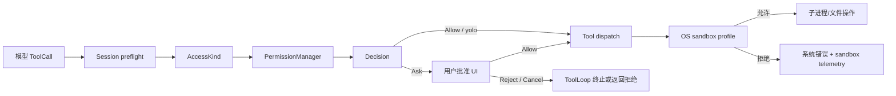
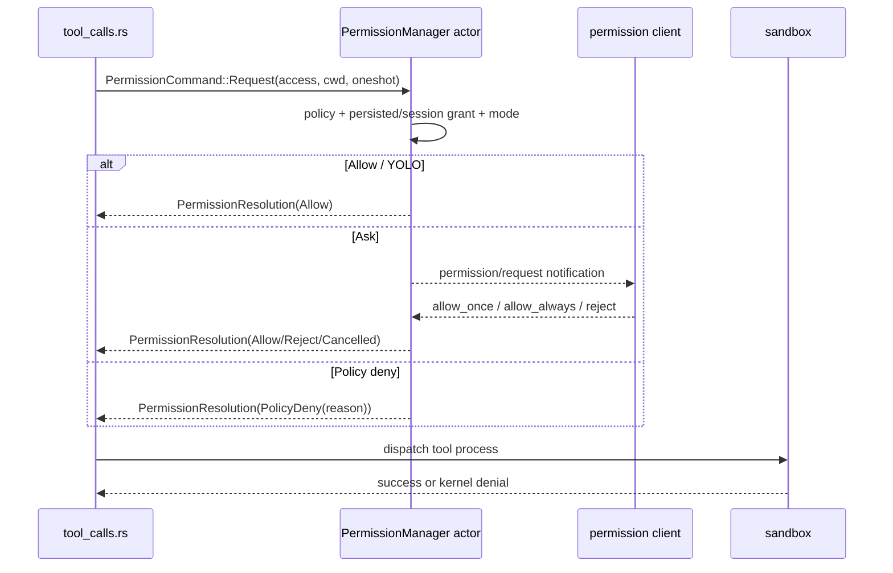

# 源码精读：工具权限、策略和操作系统沙箱

用户消息进入 Agent Loop 后，模型可以提出工具调用，但**提出调用不等于获得执行权**。本专题把一条危险操作拆成三个边界：Session 的语义权限、workspace 的策略匹配、sandbox 的内核约束。

相关入口：

- [`tool-call-pipeline.md`](./tool-call-pipeline.md)：工具注册、dispatch 和结果回写；
- [`message-flow.md`](./message-flow.md)：权限等待如何插入整条消息流；
- [`xai-grok-shell` tool_calls.rs](../../crates/codegen/xai-grok-shell/src/session/acp_session_impl/tool_calls.rs)：turn 内的 preflight 和决策消费。

## 1. 三层模型



三层职责不同：

| 层 | 保护什么 | 典型源码 | 失败表现 |
|---|---|---|---|
| Session preflight | plan mode、工具类型、取消和 pending interaction | `tool_calls.rs` | 不进入 manager 或转成显式拒绝 |
| PermissionManager | 用户意图、规则、YOLO/auto、持久授权 | `workspace/src/permission/manager/` | `Decision` |
| OS sandbox | 进程真实的 FS/网络能力 | `xai-grok-sandbox/src/` | 系统调用失败，不能被 prompt 绕过 |

## 2. `AccessKind` 是策略输入，不是工具名

[`types.rs`](../../crates/codegen/xai-grok-workspace/src/permission/types.rs) 将工具输入归一为语义访问：

```rust
pub enum AccessKind {
    Read(Option<String>),
    Grep { path: Option<String>, glob: Option<String> },
    Edit(String),
    Bash(String),
    MCPTool { name: String, input: serde_json::Value },
    WebFetch(String),
    WebSearch(String),
}
```

`From<&ToolInput>` 位于 `types.rs` 后半段：`ReadFile`、`ListDir` 归为 `Read`，三种编辑工具归为 `Edit`，`Bash` 和 `Monitor` 归为 `Bash`，MCP 保留工具名和原始 JSON。这样策略不必为每一个实现类写一套规则，同时 auto classifier 还能看到 MCP 的真实参数。

路径上下文也随请求传递：`RequestPathContext.real_cwd` 是工具真正解析相对路径的 cwd，`display_cwd` 只用于 UI。共享 manager 服务子 agent 时，不能拿 manager 自己的 cwd 替代请求者 cwd。

## 3. `Decision` 的语义必须保留

```rust
pub enum Decision {
    Allow,
    Ask,
    FollowupMessage(String),
    Reject(String),
    PolicyDeny(String),
    Cancelled,
}
```

它们不是同义的错误码：

| 决策 | 产生者 | turn 行为 |
|---|---|---|
| `Allow` | 规则、已保存授权、auto/yolo | 继续 dispatch |
| `Ask` | policy `ask` 或 fail-closed gate | 等待 UI 或由默认策略处理 |
| `FollowupMessage` | 需要用户补充信息的策略 | 把 follow-up 作为可观察消息，不执行工具 |
| `Reject` | 用户拒绝 | `ToolLoop::PermissionReject`，通常结束本轮 |
| `PolicyDeny` | 管理策略显式 deny | 写入模型可读的 tool result，允许模型调整 |
| `Cancelled` | 用户取消权限交互 | 以 cancelled stop reason 结束 |

`tool_calls.rs` 在收到 resolution 后会先记录 telemetry，再分支处理 `PolicyDeny`/`Reject`/`Cancelled`；不要把 policy deny 改成 user reject，否则模型无法得到可恢复的反馈。

## 4. 规则匹配和 Bash 的 fail-closed

[`policy.rs`](../../crates/codegen/xai-grok-workspace/src/permission/policy.rs) 在加载时预编译 glob，并把规则分成文件限制、Bash deny/ask、Bash allow 三类。Bash gate 会：

1. 拆分 `&&`、`;`、管道和重定向等脚本段；
2. 递归剥离 `env`、`timeout` 等 wrapper；
3. 处理 `bash -c` / `sh -c` 内嵌脚本；
4. 对每个 segment 组合结果，优先级为 `Reject > rule Ask > fail-closed Ask`。

无法安全分解的脚本不会假定“安全”，而是返回 `AskFailClosed`，最终表现为 `Decision::Ask`。这是权限系统中非常重要的保守性：解析器不完整时，宁可把决定交给人。

## 5. Ask、Allow、Reject 的请求时序



manager 返回 `PermissionResolution { decision, event }`。`event` 是 manager 唯一生成的权威 telemetry 记录；shell 可以读取它的 mode、classifier verdict、wait time，但不能重新构造第二份 trace 事件。

## 6. Plan mode、YOLO 和 auto 的关系

plan mode 是 Session 层 gate：某些会修改 workspace 的工具在计划阶段被阻止或降级为只读，即使 permission manager 会允许也不能越过 plan gate。YOLO 则是 manager 的自动批准模式；auto 是 classifier 模式，两者在 handle 层互斥。

```text
SetYoloMode(true)  -> 清除 auto -> yolo_state = true
SetAutoMode(true)  -> 清除 yolo -> classifier 路径
managed yolo pin   -> clamp_yolo(true) == false
```

代码中的 pin 是部署/管理员约束，客户端传入 `--yolo` 也不能解除。YOLO 只改变“是否询问”的产品策略，不会取消 OS sandbox，也不会覆盖 managed deny 规则。

## 7. Sandbox profile 的第二道边界

[`profiles.rs`](../../crates/codegen/xai-grok-sandbox/src/profiles.rs) 将 profile 解析成：

```rust
pub struct SandboxProfile {
    pub read_only: Vec<PathBuf>,
    pub read_write: Vec<PathBuf>,
    pub deny: Vec<PathBuf>,
    pub write_deny: Vec<GlobalHookSource>,
    pub default_read: bool,
    pub restrict_network: bool,
}
```

内置 profile 包括 `workspace`、`devbox`、`read-only`、`strict` 和 `off`；用户还可以通过 `~/.grok/sandbox.toml` 或项目 `.grok/sandbox.toml` 扩展。`deny` 优先于 read-only/read-write，`restrict_network` 控制子进程网络能力。权限弹窗通过后，工具仍可能在这里失败，这不是权限 UI 的 bug，而是两个不同的安全边界。

### 7.1 Hook 写保护

`hook_write_deny.rs` 对 Grok 管理的 global hook 做 identity capture 和 revalidate：拒绝 symlink、检查 hard link/文件身份，并在 profile apply 前后验证路径没有被替换。除 `devbox` 和 `off` 外，profile 默认启用 hook write-deny。它解决的是“工具获准写 workspace 后，是否能篡改执行前置 hook”这一更窄的完整性问题。

### 7.2 网络和审计

`network_policy.rs` 负责把 profile 的网络意图转换为平台能力；`types.rs` 定义 `ProfileApplied`、`ApplyFailed`、`FsViolation`、`NetViolation` 等事件。日志应记录 profile、目标和操作类型，不记录完整 prompt 或 secret。

## 8. 从一次 Bash 调用定位问题

```text
ToolInput::Bash(command)
  -> AccessKind::Bash(command)
  -> plan/preflight gate
  -> PermissionManager::Request
  -> Decision
  -> ToolBridge dispatch
  -> sandbox capability check
  -> ToolCallUpdate / tool result / next sampling
```

建议按 `tool_call_id` 搜索 `permission_requested`、`tool.decision`、`sandbox.profile_applied` 和 `sandbox.*_violation`。若有 `Allow` 却没有进程，查 preflight/dispatch；若没有 `Allow` 但进程确实启动，查是否绕过了 manager；若进程启动后得到 `EACCES` 或网络失败，查 profile，而不是重复点权限。

## 可运行缩小实验

先运行 [`mini_permission_layers.rs`](../rust-essentials/labs/async-demos/src/bin/mini_permission_layers.rs)，再追 manager 和 sandbox：

```sh
cargo run --locked \
  --manifest-path docs/rust-essentials/labs/async-demos/Cargo.toml \
  --bin mini_permission_layers
```

程序断言 ToolInput 先归一为语义 AccessKind；未知 Bash 形状 fail-closed 为 Ask；YOLO/auto 互斥且 managed pin/deny 不可绕过；plan gate 先于 manager；PolicyDeny 允许模型继续调整，而 Reject、Cancelled、Followup 各有不同 turn 终态；即使获得 Allow，网络仍可能被 OS sandbox 拒绝。缩小模型没有实现真实脚本解析、权限 UI 和平台 syscall，应继续用 policy、shell fixture 与 sandbox profile 测试覆盖。

## 9. 测试阅读路线

- `workspace/src/permission/manager/mod.rs`：YOLO/auto 互斥、managed pin、persisted grant 和并发请求测试；
- `permission/policy.rs`、`exec_risk.rs`：glob、脚本拆分、wrapper 递归和 fail-closed 测试；
- `xai-grok-shell` 的 `acp_session_tests`：permission reject、cancel、plan gate 如何转成 `ToolLoop`；
- `xai-grok-sandbox`：profile 解析、deny 优先级、hook identity 和网络 violation 测试。

一个好的回归测试至少覆盖三种时机：权限请求前取消、用户弹窗中取消、工具已启动后的取消；它们应分别验证 request 不执行、decision 为 `Cancelled`、以及子进程收到 cancellation。
