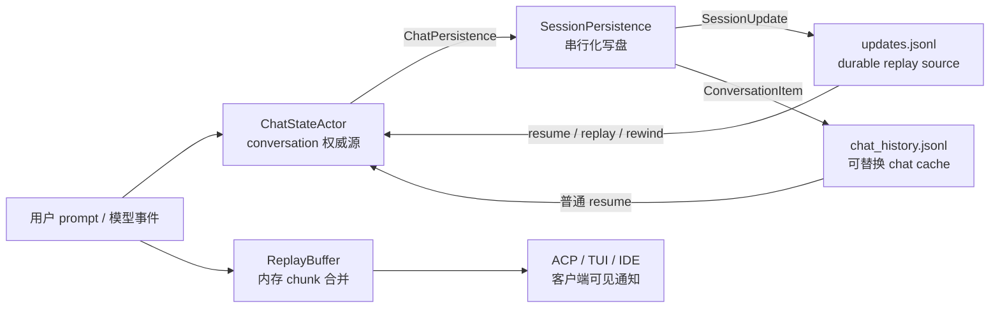
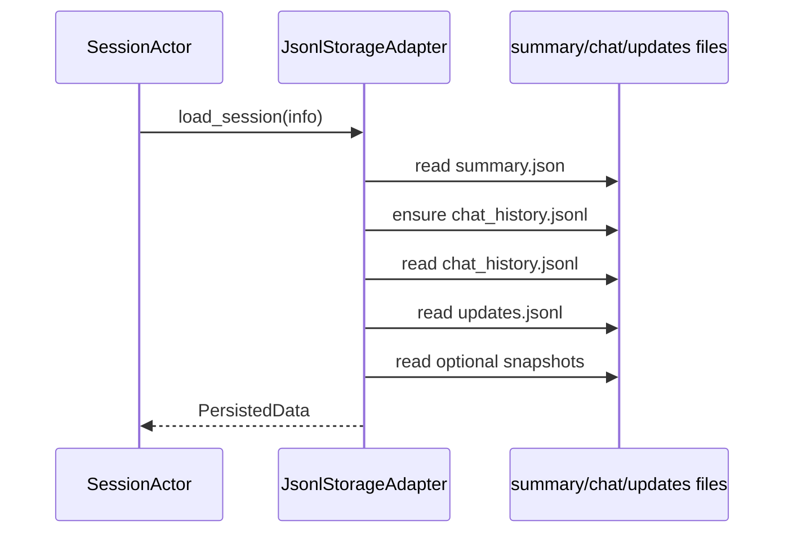
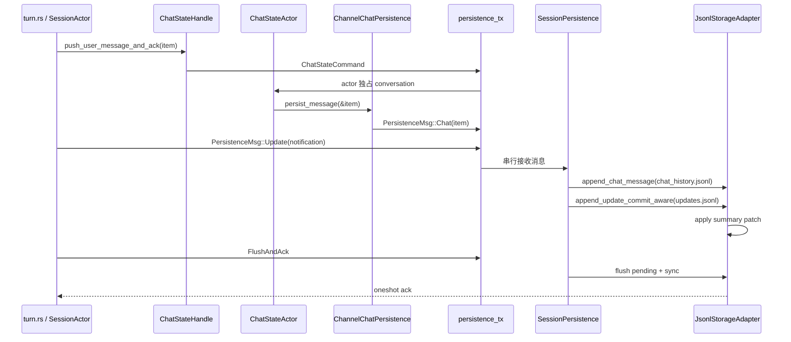
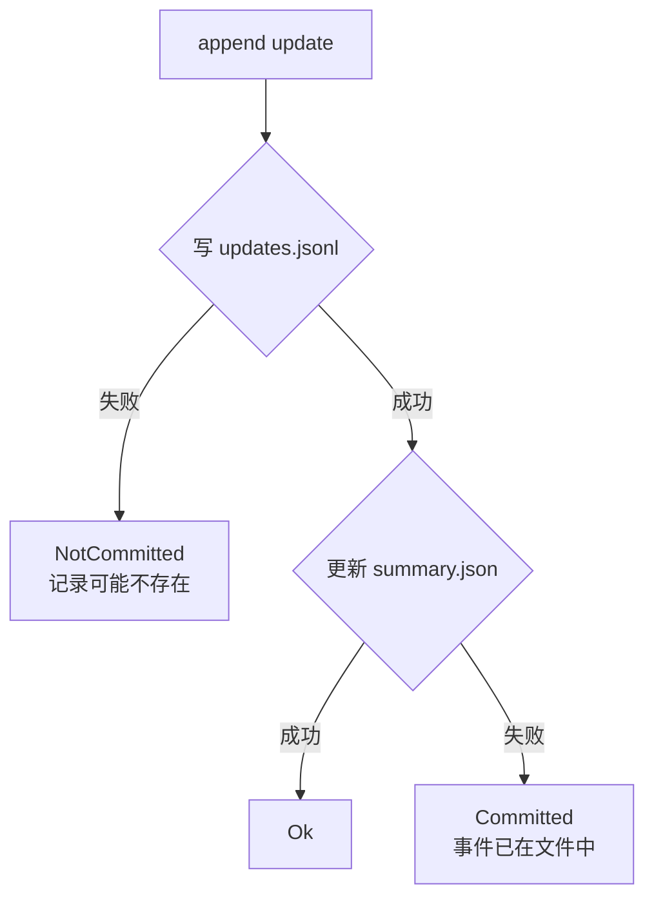
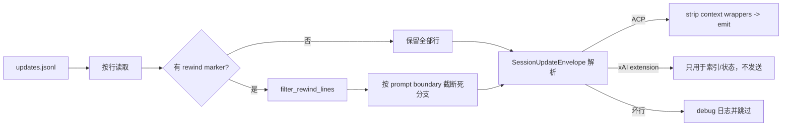
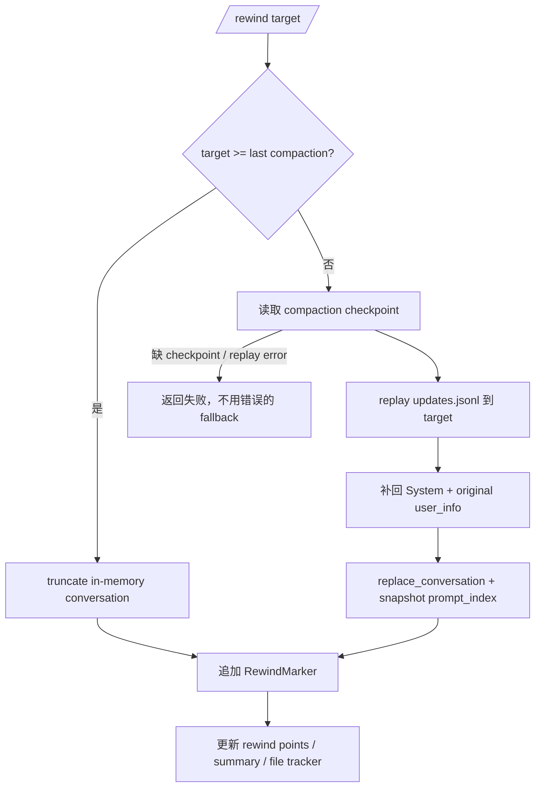
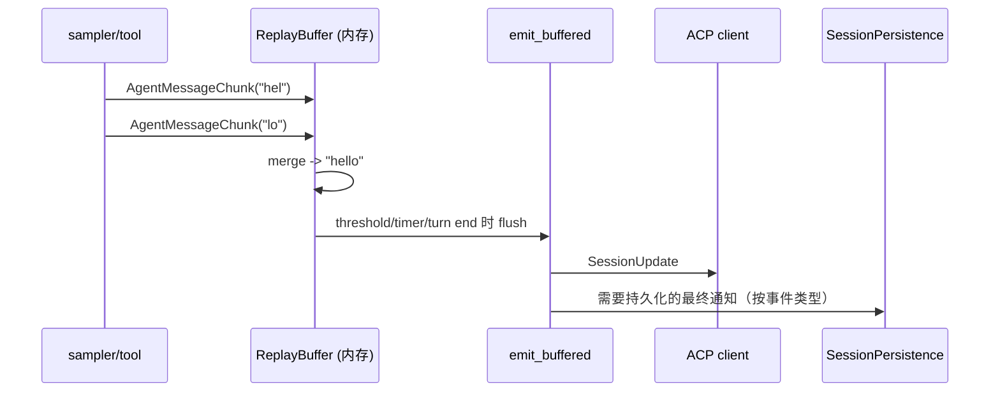
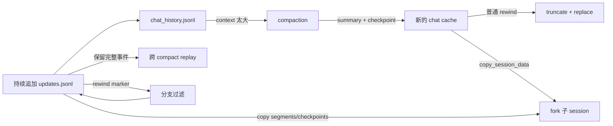

# 会话持久化与重放：从一次 turn 到恢复、rewind 和 fork

本文回答一个开发时很容易混淆的问题：**Agent 的状态究竟写在哪里，哪一份数据是权威的，进程重启后又怎样恢复？**

这里的“重放”有两种含义：

1. 从 `updates.jsonl` 重新构造历史或 UI scrollback；
2. `ReplayBuffer` 把正在生成的高频 chunk 合并后再发送给客户端。

它们都叫 replay，但生命周期、可靠性和数据格式完全不同。前者是磁盘上的 session 事件流，后者只是一个 turn 内的内存发送缓冲。

## 1. 先建立三个层次



### 1.1 权威关系

| 数据 | 所在位置 | 作用 | 能否被整体替换 |
| --- | --- | --- | --- |
| `SessionUpdate` | `updates.jsonl` | ACP/xAI 事件、用户 chunk、rewind marker；用于 replay、跨 compact rewind | 原则上 append-only；分支用 marker 表达 |
| `ConversationItem` | `chat_history.jsonl` | 当前可直接恢复的模型 conversation 快照 | 可以；compact、rewind、repair 都会 replace |
| `Summary` 和状态快照 | `summary.json`、`plan.json`、`signals.json` 等 | 列表、模型、标题、计划和运行时元数据 | 通过原子 JSON 写入 |
| 流式通知 | `ReplayBuffer.pending` | 限频、合并、保持客户端顺序 | 只在内存；关机前必须 flush |

`chat_history.jsonl` 是“当前历史的快速缓存”，不是完整历史的审计日志。旧的 tool result 可能在 retained-memory pruning 中被 hard-clear，但 `updates.jsonl` 仍保留可以用于 replay 的事件。反过来，客户端收到的 chunk 也不等于已经写入 conversation：高频通知可能还停留在 `ReplayBuffer`。

## 2. 会话目录布局

`JsonlStorageAdapter::session_dir` 的默认布局是：

```text
{grok_home}/
└── sessions/
    └── {url_encoded_cwd}/
        └── {session_id}/
            ├── summary.json
            ├── updates.jsonl
            ├── chat_history.jsonl
            ├── rewind_points.jsonl
            ├── plan.json
            ├── plan_mode.json
            ├── signals.json
            ├── announcement_state.json
            ├── goal/
            │   └── state.json
            ├── workflows/{run_id}/
            │   └── state.json
            ├── compaction_checkpoints/{id}.json
            ├── compaction_segments/{id}.json
            ├── compaction_requests/{request_id}.json
            ├── recap_requests/{request_id}.json
            ├── feedback.jsonl
            └── btw_history.jsonl
```

路径事实来自 `crates/codegen/xai-grok-shell/src/session/storage/jsonl/mod.rs`；文件名常量集中在 `session/storage/mod.rs`。子代理不一定建立新的 cwd 层级：`JsonlStorageAdapter::with_explicit_session_dir` 可以把数据放进父 session 的 `subagents/{subagent_id}/`。

### 2.1 哪个文件先读

普通恢复走 `StorageAdapter::load_session`：先读 `summary.json`，根据其中的 `chat_format_version` 确认或重建 chat cache，再读 `chat_history.jsonl`、`updates.jsonl`、计划和 rewind points。较快的 resume 路径用 `load_session_without_updates`，把大而且通常不需要的事件流、文件快照延迟到真正需要 replay/rewind 时再读。



如果 `chat_history.jsonl` 缺失或为空，而格式版本是当前版本，`ensure_chat_history` 调用 `chat_rebuild::rebuild_chat_history`，从 `updates.jsonl` 生成临时 JSONL，再用 rename 替换目标。这样恢复不依赖某一份可能过期的 cache。

## 3. 一条消息怎样落盘

下面的流程是一次真实用户 turn 的“持久化侧”视角；采样、工具循环和 UI 细节见 [message-flow.md](./message-flow.md)。



### 3.1 为什么要有 `ChatPersistence` 中间层

`xai-chat-state` 不依赖 `xai-grok-shell`。它只看到 `ChatPersistence` trait：

```rust
pub trait ChatPersistence: Send + 'static {
    fn persist_message(&mut self, item: &ConversationItem);
    fn persist_working_directory_switch_and_ack(...);
    fn replace_history(&mut self, items: &[ConversationItem]);
    fn flush(&mut self);
}
```

`ChatStateActor` 通过 `Box<dyn ChatPersistence>` 独占这个接口，所以多个异步任务不能同时借用 conversation，也不需要锁。生产实现 `ChannelChatPersistence` 只负责把调用翻译成 `PersistenceMsg`：

| ChatState 调用 | Persistence 消息 | 语义 |
| --- | --- | --- |
| `persist_message` | `Chat(item)` | append 一个 conversation item |
| `persist_working_directory_switch_and_ack` | `AppendCwdSwitchAndAck` | 写入一次 generation 并返回提交状态 |
| `replace_history` | `ReplaceChatHistory` | 原子替换整个 chat cache |
| `flush` | `Flush` | fire-and-forget 刷盘 |

注意 `ChatStateActor` 先更新自己的状态，再把持久化请求发给统一 actor；它不会自己打开文件。这样 SessionActor、ChatState 和 UI 不会形成多个写者。

### 3.2 `PersistenceMsg` 不是只有消息

`PersistenceMsg` 还承载当前模型、标题、计划、signals、MCP/skill announcement、goal/workflow、compaction checkpoint、rewind point、Git HEAD 等快照。它们都经过同一个 `SessionPersistence::run` 循环，因而有相对明确的写入顺序。

真正需要“写完才能继续”的操作必须带 oneshot：

- `AppendUpdateDurablyAndAck`：事件和 summary bookkeeping 都处理后才回应；
- `AppendCwdSwitchAndAck`：区分 `Appended`、`AlreadyPresent` 和不确定失败；
- `FlushAndAck`：`flush_pending()` 完成后才回应；
- `CopyFile`：先 flush，再返回用于上传的 session 文件快照。

普通 `Update`、`Chat`、`Flush` 是排队操作，调用方不能把“消息已发送到 channel”当作“已经在磁盘上”。

## 4. JSONL append 的可靠性边界

### 4.1 Buffered 与 Durable

`JsonlStorageAdapter` 的两个 append 入口共享 `append_update_with_bookkeeping`，区别在于 `AppendDurability`：

```text
Buffered: write_all -> flush -> close
Durable:  write_all -> flush -> sync_file -> sync_parent_directory
```

macOS 还会尝试 `F_FULLFSYNC`；其它支持的平台至少调用 `sync_all`。这不是“每个 chunk 都 fsync”：ACP 连续文本会先在 `SessionPersistence::pending_notification` 中合并，只有 flush 或遇到不能合并的事件才写入。

### 4.2 `NotCommitted` 与 `Committed`



`AppendUpdateError::NotCommitted` 表示无法证明 JSONL 记录已经写入；可以安全重试。`Committed` 表示 JSONL 已经写入，但之后的 summary 更新失败；重试可能造成重复事件，所以 `SessionPersistence` 会把已提交的 ACP 通知送入 remote/relay sync，再把错误报告给上层。恢复时事件流是事实来源，summary 的计数可以重新修复。

### 4.3 torn tail 为什么不会永久毁掉 session

JSONL append 不是 crash-atomic。进程被杀死或磁盘 `ENOSPC` 发生在 `write_all` 中间时，最后一行可能没有换行或只有半个 JSON。下一次 append 前，`append_jsonl_line_sync_with` 检查最后一个字节；如果不是 `\n`，先插入换行，把坏记录隔离成独立的一行。

读取端按行解析：

- `read_updates_jsonl` 跳过不可解析行并记录 warning；
- `read_chat_history_sync` 同样跳过坏行，并把原文件复制为 `chat_history.jsonl.corrupt` 供诊断；
- chat history 的正常加载完成后，可以用重建/快照写回清理坏行。

这是一种“尽量恢复可用 session”的策略，不是宣称数据完全没有丢失。最后一条被撕裂的记录仍可能丢失，但不会让整个 session 无法 resume。

### 4.4 为什么 summary 使用原子写

JSON 快照采用“写唯一临时兄弟文件，再 rename 覆盖”的方式。直接 `std::fs::write` 会先 truncate，读者可能看到 0 字节或半个 JSON；`write_bytes_atomic` 把可见状态切换推迟到完整文件准备好之后。`summary.json` 还有 sidecar lock，避免自动标题和手动 `/rename` 互相覆盖。

## 5. 恢复和 replay 的两条路径

### 5.1 普通 resume：优先 chat cache

恢复后模型需要的是 `Vec<ConversationItem>`，所以通常直接使用 `chat_history.jsonl`。它包含系统消息、用户消息、assistant、reasoning、tool call/result 等当前 conversation 形态。加载器还兼容旧格式，并在内存中把老的 inline reasoning 升级为 sibling `Reasoning` / `BackendToolCall` items。

流程可以概括为：

```text
summary.json
  -> chat_format_version
  -> chat_history.jsonl（缺失/空则由 updates 重建）
  -> ChatState::new / restore snapshot
  -> build_conversation_request 时再做 request-copy pruning
```

这里的 pruning 分两层：`build_conversation_request` 在 clone 上做“模型看见什么”的 soft trim；`ChatStateActor::prune_retained_conversation` 在写边界做旧 tool result hard-clear，减少进程内存。后者会 replace `chat_history.jsonl`，但不会修改 `updates.jsonl`，所以不要把 request-level pruning 误认为永久删除审计历史。

### 5.2 replay：从事件流恢复 ACP 输出

`StorageAdapter` 提供 `load_updates_for_replay`、`load_updates_for_replay_at` 和 `stream_replay_updates_at`。生产流式入口读取 `updates.jsonl`，先应用 rewind filter，再只转发 ACP updates；xAI extension（例如 rewind marker、compaction signal）被消费，不直接显示给客户端。



`filter_rewind_by` 同时有 raw-line 和 typed-update 两个入口，保证初始加载与增量 replay 使用同一个算法。它维护 `prompt_starts`；看到 `RewindMarker { target_prompt_index }` 时，把存活结果截断到目标 prompt 的起点，再继续处理 marker 后的新分支。

### 5.3 跨 compaction rewind

普通 rewind 可以直接把内存 conversation truncate 到目标 prompt。目标在最后一次 compaction 之前时，当前 chat cache 已经被 summary 替换，不能简单 truncate；`acp_session_impl/rewind.rs` 会读取 compaction checkpoint 和 `updates.jsonl`，重建原始 conversation，再通过 `ChatStateHandle::replace_conversation` 写回。



代码明确拒绝“checkpoint 不可用时继续用一个过大的 raw replay”这种 fallback，因为它可能超出 context window，并且 prompt 计数会错。用户应该改为 rewind 到 compaction 之后的点。

## 6. `ReplayBuffer` 不是持久化

`crates/codegen/xai-grok-shell/src/agent/update_chunk_merge.rs` 的 `ReplayBuffer` 只服务于高频客户端通知：

1. `consume_chunk` 接收 ACP agent message/thought chunk 或 xAI tool-call delta；
2. 相同 session、相同类型且在时间窗口内的文本合并；
3. 超过 `max_items`、`max_bytes` 或 `max_duration_ms` 时返回待发送通知；
4. `flush` 返回最后一个 pending 通知。

它不会写 `updates.jsonl`，也不会改变 `ChatState`。`SessionActor::run_session` 在 turn 完成、取消、shutdown 和 `FlushComplete` 前都要调用 `replay_buffer.flush()`；外部调用者通过 `flush_replay_actor` 等待 oneshot ack。否则最后一小段文本可能既没有发送给 IDE，也没有触发对应的完成事件。



图中的最后一条不是说每个 buffer flush 都必然写盘，而是提醒阅读 `emit_buffered` 的事件路由。源码注释已经区分：streaming chunk 走 buffered path，one-shot xAI event 走 `send_xai_notification`，后者才按事件触发 hook 与 persistence。

## 7. compaction、rewind、fork 的关系



### 7.1 compaction

compaction 生成摘要并用 `ReplaceChatHistory` 替换当前 conversation；它不是删除 `updates.jsonl`。为了跨 compact rewind，摘要前的材料进入 `compaction_checkpoints/{id}.json` 或 segments 归档。调试 compact 时同时查看：

- `session/compaction.rs`：何时触发以及如何编排；
- `xai-grok-compaction/code_compaction/`：摘要和历史组装；
- `PersistenceMsg::CompactionCheckpoint` / `CompactionSegment`：文件写入；
- `acp_session_impl/rewind.rs`：是否选择 checkpoint replay。

### 7.2 rewind

rewind 有文件、会话或两者的不同模式。对话被回退时，内存状态、`chat_history.jsonl`、`summary.last_turn_summary` 和 rewind point tracker 要一起收敛；同时向 append-only `updates.jsonl` 写入 marker 表示新的时间线。`ConversationOnly` 不回滚文件，但会把被丢弃 prompt 的 file effects 合并进上一个 rewind point，保证未来仍能做 `/rewind 0`。

### 7.3 fork

`fork_session` 通过 `StorageAdapter::copy_session_data_sync` 复制源目录到新 cwd/session id，默认还复制 compaction segments，并在 summary 中记录 parent。复制完成后本地 fork 就可用；后端 writeback 是异步的 telemetry，不应成为 fork 主路径的同步依赖。

## 8. 故障分支：看到日志后怎么判断

| 现象/日志 | 代表什么 | 下一步 |
| --- | --- | --- |
| `NotCommitted` | 不能证明 update 已写入 | 检查磁盘/权限后重试；避免先假定记录存在 |
| `Committed` | update 已写，summary bookkeeping 失败 | 保留该事件，检查 `summary.json`；恢复会以事件流为准 |
| `torn trailing line` | 上次 JSONL append 被打断 | 下一次 append 会隔离坏行；保留 `.corrupt` 文件并统计 skipped 行 |
| `skipping unparseable ... line` | 单行损坏或旧格式不可解析 | 对照 session 时间线；不要删除整个 session |
| `disk full` / `RetryState::Failed` | 写入或 fsync 遇到 `ENOSPC` | 清理空间后用 `ProbeWritable`，再继续当前 session |
| `FlushReplayError::Timeout` | actor 没有在 5 秒内确认内存 buffer | 查 `run_session` 是否卡在任务/关闭分支，确认 event channel 生命周期 |
| `Cannot rewind ... checkpoint data unavailable` | 跨 compact 所需 checkpoint 缺失 | 选择 compaction 之后的 prompt；不要强行 raw replay |
| resume 后 `num_updates` 与 summary 计数不同 | summary 是派生元数据或上次写入中断 | 以可解析的 JSONL 事件为主，修复 summary 写入路径 |

磁盘满并不只影响 `updates.jsonl`：原子写的临时文件、summary lock、chat rebuild 都可能失败。`SessionPersistence::mark_disk_full` 会通过 `x.ai/session_notification` 发出 retry-state，恢复成功后 `clear_disk_full` 清除 latch。

## 9. 源码阅读路线（按问题定位）

### 问题 A：某条消息为什么没出现在恢复后的 conversation？

```sh
rg -n "PersistenceMsg::Chat|append_chat_message|read_chat_history_sync|ReplaceChatHistory" \
  crates/codegen/xai-grok-shell/src/session \
  crates/codegen/xai-chat-state/src
```

先看 `ChatStateActor::push_message` 是否调用了 `persist_message`，再看 `SessionPersistence` 是否收到 `Chat`，最后检查 `chat_history.jsonl` 的坏行、格式版本和是否发生过 replace。不要只查 `updates.jsonl`：ACP update 可能描述了 UI 事件，却没有对应的 `ConversationItem`。

### 问题 B：客户端显示少了最后几个 token？

```sh
rg -n "ReplayBuffer|replay_buffer\.flush|FlushReplay|emit_buffered" \
  crates/codegen/xai-grok-shell/src/session \
  crates/codegen/xai-grok-shell/src/agent
```

沿 `run_loop.rs` 的 turn completion、cancel 和 shutdown 分支检查 flush。再区分是“通知没有发送”还是“通知发送了但没有落盘”：前者看 `ReplayBuffer`，后者看 `PersistenceMsg` 和 append 日志。

### 问题 C：rewind 后 replay 仍显示旧分支？

检查三处是否一致：

1. `rewind.rs` 是否追加 `XaiSessionUpdate::RewindMarker`；
2. `filter_rewind_lines` 与 `filter_rewind_updates` 是否使用相同的 prompt boundary；
3. `collect_prompts_from_events` 是否把 marker 映射到 `prompt_texts` 的索引空间。

### 问题 D：compact 后无法回到旧 prompt？

```sh
rg -n "CompactionCheckpoint|compaction_checkpoints|Cross-compaction|load_updates_for_replay" \
  crates/codegen/xai-grok-shell/src crates/common/xai-grok-compaction/src
```

确认 checkpoint 文件是否存在、是否在 fork 时复制、以及 replay 失败是否被错误地吞掉。当前设计在关键数据不可用时返回明确错误，而不是生成一个看似成功但会超出上下文的 conversation。

## 10. 测试入口与贡献边界

与持久化最相关的测试集中在：

- `xai-grok-shell/src/session/storage/mod.rs`：rewind filter、prompt collector、raw/typed replay parity；
- `xai-grok-shell/src/session/storage/jsonl/`：append durability、torn tail、chat rebuild、原子替换；
- `xai-grok-shell/src/session/chat_persistence.rs`：trait 到 `PersistenceMsg` 的映射；
- `xai-chat-state/src/persistence.rs` 和 `actor/`：mock persistence、repair、replace history；
- `session/acp_session_tests/replay_buffer_send_update_tests.rs`：buffer flush 和顺序；
- `session/acp_session_tests/turn_completion_emit_tests.rs`：turn 完成时不遗留 pending chunk；
- `session/acp_session_tests/cancel_running_task_tests.rs`：取消路径清空 buffer、修复 dangling tool call。

只改 Markdown 时不需要重新构建 Rust 工程；做下面的静态检查即可：

```sh
git diff --check
rg -n '\]\((\.\./)+[^)#]+\)' docs/deep-dives/persistence-and-replay.md
```

如果改了 storage 或 ChatState 代码，再按 [09-contributor-playbook.md](../09-contributor-playbook.md) 选择最小的 crate/test 命令。测试应覆盖提交边界，而不是只覆盖“channel send 成功”：至少要区分 `NotCommitted`、`Committed`、torn tail、flush ack 和 rewind marker。

## 11. 一个可执行的源码实验

先用缩小模型观察 ReplayBuffer 的纯顺序契约：

```sh
cargo run --locked \
  --manifest-path docs/rust-essentials/labs/async-demos/Cargo.toml \
  --bin mini_replay_order
```

[`mini_replay_order.rs`](../rust-essentials/labs/async-demos/src/bin/mini_replay_order.rs) 通过 oneshot processed ack 建立确定顺序，并断言客户端只能依次看到：合并后的 `Hello`、非流式 tool event、completion 分支 flush 的尾部文本、`TurnCompleted`。它只模拟内存 ReplayBuffer，不写 `updates.jsonl`，因此不能证明 crash recovery 或 durability。

不接真实模型也可以验证自己的理解：

1. 找一个测试用的临时 session 目录，写入两轮 ACP `user_message_chunk` 和一条 `RewindMarker(target_prompt_index = 1)`；
2. 用 `filter_rewind_lines` 或 `load_updates_for_replay_at` 读取，确认第二轮旧分支消失；
3. 删除 `chat_history.jsonl`，调用 `chat_rebuild::rebuild_chat_history`，比较重建结果与事件流能表达的 conversation；
4. 在 JSONL 尾部追加半行 JSON，确认 loader 跳过该行并保留前面的有效记录；
5. 让 `ReplayBuffer` 消费两段文本，再调用 `flush`，确认只得到一个合并后的通知。

完成实验后应能回答：

- 为什么 `chat_history.jsonl` 可以 replace，而 `updates.jsonl` 用 marker 表达分支？
- 为什么 `FlushAndAck` 比 `Flush` 更适合 turn completion 和导出？
- 为什么客户端“看见文本”与“session 可恢复”是两个独立的正确性条件？
- 为什么 cross-compaction rewind 缺 checkpoint 时必须失败得明确？

## 12. 关键源码索引

| 主题 | 入口 |
| --- | --- |
| 持久化消息和 actor 循环 | `crates/codegen/xai-grok-shell/src/session/persistence.rs` |
| ChatState 的持久化契约 | `crates/codegen/xai-chat-state/src/persistence.rs` |
| trait 到 channel 的适配 | `crates/codegen/xai-grok-shell/src/session/chat_persistence.rs` |
| storage 抽象、错误语义、replay filter | `crates/codegen/xai-grok-shell/src/session/storage/mod.rs` |
| JSONL append、恢复、原子写 | `crates/codegen/xai-grok-shell/src/session/storage/jsonl/mod.rs` |
| chat cache 从事件流重建 | `crates/codegen/xai-grok-shell/src/session/storage/mod.rs` 中的 `chat_rebuild` 模块 |
| 客户端事件缓冲协议 | `crates/codegen/xai-grok-shell/src/session/replay_events.rs` |
| chunk 合并实现 | `crates/codegen/xai-grok-shell/src/agent/update_chunk_merge.rs` |
| rewind 和跨 compact 恢复 | `crates/codegen/xai-grok-shell/src/session/acp_session_impl/rewind.rs` |
| session fork/copy | `crates/codegen/xai-grok-shell/src/session/fork.rs` |
| conversation mutation / dangling tool repair | `crates/codegen/xai-chat-state/src/actor/mutations.rs` |

记住阅读顺序：先确定数据的**权威性**，再看消息的**顺序化**，最后看故障时的**提交边界**。只有把这三件事分开，才能安全地修改 Agent loop、上下文压缩或持久化实现。
