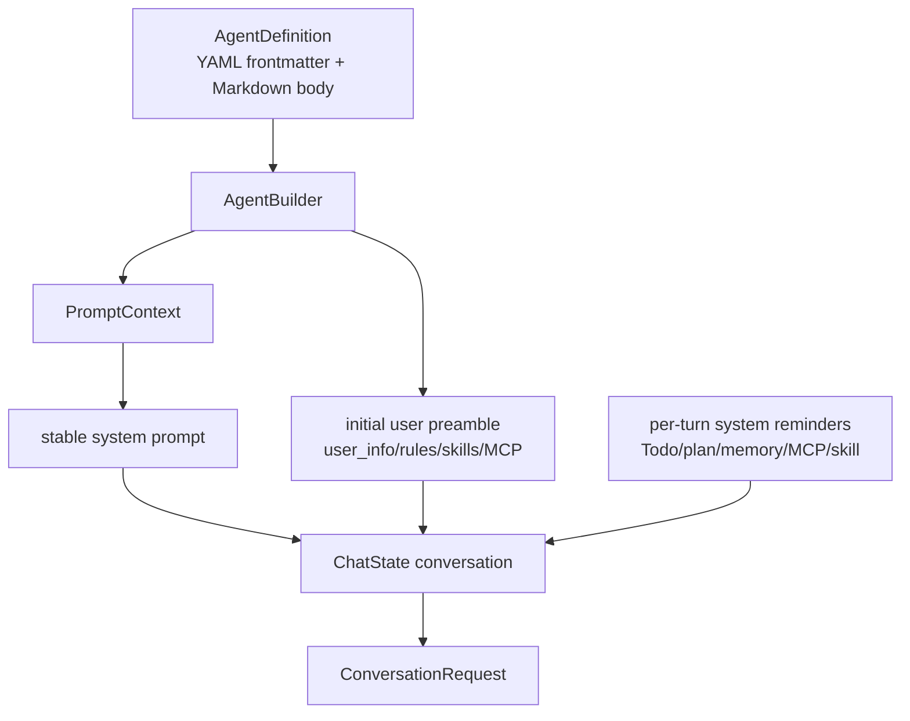
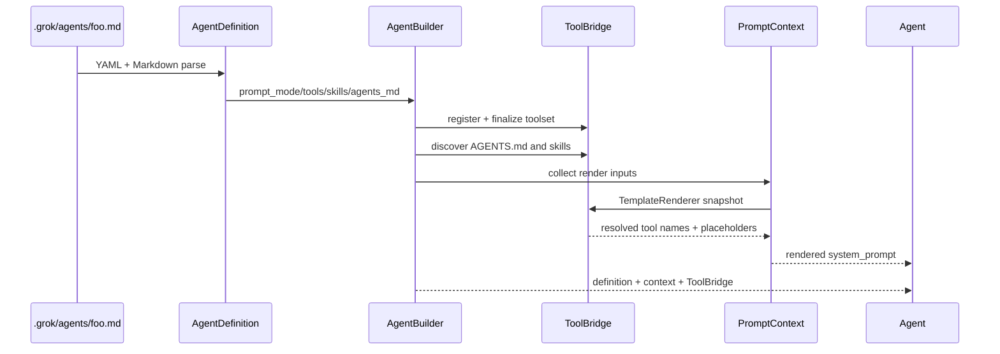
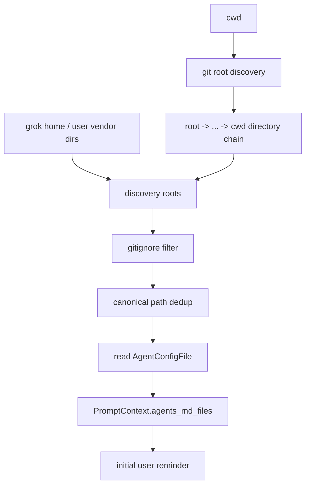
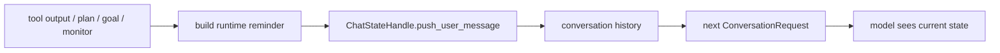

# Prompt 装配：Agent Definition、规则、Skills 如何成为模型上下文

“系统提示词在哪个文件？”对这个项目不是一个足够的问题。模型看到的上下文由多个 owner 在不同时间生成：有些内容进入稳定 system prompt，有些只在首轮 user preamble 出现，有些写进 conversation，还有些每个 turn 动态插入。

本文从源码解释这些内容为什么不能互换位置，以及当你新增 Agent、工具或规则发现逻辑时，应改哪个层。

## 1. 先分清四个生命周期



| 层 | 主要 owner | 典型内容 | 为什么在这里 |
| --- | --- | --- | --- |
| Stable system | `PromptContext::render` | Agent 身份、工具行为、安全、role | 尽量稳定，利于模型 KV cache 与 session identity |
| Initial user preamble | `UserMessageContext::render` | workspace、VCS、AGENTS/rules、skills、MCP 描述符 | 与本地 workspace 有关，可显示来源路径 |
| Conversation | `ChatStateActor` | 真正 user 输入、assistant、tool result、持久化 reminder | 能被采样、compact、rewind 与 replay 正确处理 |
| Per-turn reminder | Session/Tool extensions | todo、plan mode、tool 后置建议、monitor、goal | 运行时状态会变，不应反复重写 system prompt |

工程判断规则：**稳定身份放 system，工作区事实放首轮 preamble，可审计的对话事件放 conversation，短寿命状态放 reminder。** 若把所有信息塞进 system，resume、compact、缓存和动态更新都会变得脆弱。

## 2. 从 Agent Definition 到 `Agent`

Agent 定义是 `.grok/agents/*.md` 风格的 Markdown 文件：YAML frontmatter 描述能力和策略，正文是 prompt body。解析类型在 `crates/codegen/xai-grok-agent/src/config.rs`，构建入口在 `src/builder.rs`。



### 2.1 定义中哪些字段会改变模型上下文

| 字段 | 影响面 | 常见误解 |
| --- | --- | --- |
| `promptMode` | base template 和 body 的组合方式 | 不只是“正文是否追加”，还决定 body 是否经过渲染 |
| `systemPrompt` | `TemplateOverride` | custom template 必须仍引用实际可用工具，不是任意纯文本替换 |
| `tools` / `disallowedTools` | ToolBridge 注册、最终 API schema、模板条件 | 只改 prompt 里的工具名字不会把工具注册给模型 |
| `skills`、`discoverSkills`、`inheritSkills` | skill discovery 和提示信息 | skill 可发现不等于它的全文已经内联 |
| `agentsMd` | project instruction discovery | 关闭后不能指望 AGENTS.md 自动注入 |
| `userMessageTemplate` | 首轮 preamble 形状 | 不等于 system prompt template |
| `permissionMode`、`completionRequirement` | runtime guard/reminder | 模型文案与执行时 gate 是两套防线 |
| `toolNameOverrides` / 参数 override | schema 和 template placeholder | 只同步其中一边会造成模型说的名字不可调用 |

### 2.2 `extend`、`full` 与 template override

`PromptContext::render_with_renderer` 的关键分支很小，但决定了定制的正确方式：

```text
PromptMode::Extend
  = render(base template selected by audience/override)
  + render(prompt_body)         # body 存在时追加

PromptMode::Full
  = render(prompt_body only)    # body 就是完整 system prompt
```

`TemplateOverride` 有三类：

| 值 | Extend 模式下的 base |
| --- | --- |
| `None` | primary 使用标准 `prompt.md`，subagent 使用 `subagent_prompt.md` |
| `Codex` | apply-patch profile 模板 |
| `Custom(String)` | 调用者提供的可渲染模板 |

因此选择建议是：只加一小段任务人格、审查规则或团队约束时用 `extend`；只有明确愿意维护安全、工具、格式与运行时约定的全部 system 内容时才用 `full`。`full` 不是“更强”，而是你接管了原模板持续演进的兼容责任。

## 3. `PromptContext`：可审阅的 system prompt 输入

`xai-grok-agent/src/prompt/context.rs` 的 `PromptContext` 是 serializable 结构，而非散落的字符串拼接。重要字段包括：

```text
prompt_mode / audience / prompt_body / system_prompt
agents_md_files
memory_enabled + memory paths
role_instructions / persona_instructions
os_name / shell_path / working_directory / current_date
is_non_interactive / system_prompt_label
```

这样做的实际收益是：你可以审阅“模板输入是什么”与“渲染结果是什么”之间的关系，不需要从最终长字符串逆向猜测哪个模块加了内容。

### 3.1 `PromptAudience` 不是 UI 标签

`PromptAudience::Primary` 和 `Subagent` 同时决定：

- `extend` 时选择哪份 base template；
- 哪些 persona/subagent catalog section 可显示；
- 持久化 `PromptContext` 时哪些字段要抑制；
- 角色指令和子代理成本预算应怎样表达。

子代理仍可得到完整 AGENTS/rules block；它被抑制的是 parent-only persona/catalog 信息。否则 child 可能执行同一项目的代码却不知道项目规则，或者不必要地背负主 Agent 的巨大工具/角色目录。

### 3.2 为什么模板不硬编码工具名

模板通过 `TemplateRenderer` 使用 `${{ tools.by_kind.read }}`、`${{ tools.by_kind.edit }}` 一类 placeholder。渲染器来自完成注册后的 `ToolBridge` snapshot，因此它知道本 session 最终暴露给模型的名字。

```mermaid
flowchart LR
    K[ToolKind::Read] --> R[Tool registry]
    O[toolNameOverrides] --> R
    R --> T[TemplateRenderer]
    T --> M[`${{ tools.by_kind.read }}`]
    M --> P[rendered prompt: actual name]
    R --> S[ConversationRequest.tools schema]
```

这条“双输出”是必须的：同一工具配置既驱动 prompt 中的名称，又驱动送往模型 API 的 schema。新增或重命名工具时应同时检查：

1. registry 是否包含该工具；
2. `ToolKind` 是否正确；
3. base template 的条件块是否会渲染；
4. `ConversationRequest.tools` 是否包含相同 client-facing name；
5. tool-call bridge 是否能把该 name 映射回实现。

只有第 3 步成功，会得到“模型被教会使用一个不存在的工具”；只有第 4 步成功但第 3 步失败，则工具存在却没有相应行为说明。

### 3.3 模板渲染的测试价值

模板使用 MiniJinja，但 delimiter 是 `${{ ... }}` 和 `$`，避免普通 Markdown/code 示例中的 `{{ ... }}` 被误判。`context.rs` 和 `template.rs` 的测试覆盖：

- tool present/absent 时条件段出现或消失；
- override 后使用实际工具名；
- 未解析 placeholder 不应遗留；
- primary/subagent 的段落差异；
- rendered prompt 的体积上限。

修改模板时优先补这种“能力存在/不存在”的测试，而不是只断言某段英文仍然包含某个词。

## 4. AGENTS.md 与规则：发现、去重、作用域

规则发现主要在 `xai-grok-agent/src/prompt/agents_md.rs`。它不仅找一个 `AGENTS.md`，而是结合兼容配置发现：

- `AGENTS.md`、`Claude.md` 等命名文件；
- 项目中的 `.grok/rules/`、`.claude/rules/`、`.cursor/rules/` Markdown；
- 用户 home / Grok home 下的相应规则目录；
- 可选 workspace-user 目录。



### 4.1 顺序为什么重要

项目目录链按 repo root 到 cwd 组织，较深目录的内容在后面，符合“局部规则覆盖更宽规则”的阅读顺序。路径 canonicalization 防止同一文件通过 symlink 或多个 root 重复出现；gitignore 过滤避免把项目已经排除的内容偷偷注入模型。

规则文件与命名 instruction 文件不完全等价：规则内容可经 `extract_skill_body` 去掉 frontmatter，而 instruction 文件以原内容注入。将新文件类型接入发现逻辑时，先决定它属于哪一类，不要先加一个无条件 `read_to_string`。

### 4.2 为什么它是 user reminder 而非 system 拼接

`PromptContext::agents_md_user_reminder()` 将发现结果格式化为带来源路径的 `<system-reminder>` block，作为 prepended user message 进入 conversation。其好处是：

- project knowledge 能出现在可持久化、可 compact、可 replay 的消息历史中；
- 新增临时 runtime instruction 不必改变 system 前缀；
- fork/resume 可用 `SyntheticReason::ProjectInstructions` 做幂等判断；
- 用户可以从路径理解某一条规则来自哪里。

这不表示规则优先级低。提示词的实际优先级仍由模型消息角色、项目路径语义和用户当轮明确指令共同决定；运行时权限 gate 不能由任何 reminder 绕过。

## 5. 首轮 user preamble 是另一套模板

`xai-grok-agent/src/prompt/user_message.rs` 的 `UserMessageContext` 负责首次/重建时的工作区信息。它和 `PromptContext` 一样可渲染，但输入完全不同：

| `UserMessageContext` 字段 | 意义 |
| --- | --- |
| workspace path、OS、shell、date | `<user_info>` 的环境事实 |
| VCS root/status | 当前工作树状态的预取摘要 |
| terminals folder | 后台命令输出可被 read 工具读取的位置 |
| workspace/user rules | 规则内容和来源路径 |
| skills | 去重后的 skill registry snapshot 与 listing budget |
| MCP servers / descriptor root | 外部 MCP 描述符发现入口 |
| read tool name | 对模型显示的真实 read 工具名 |

`prompt_build.rs` 的 `build_initial_user_message_context` 聚合这些输入，并用 `partition_rules_by_scope` 把 workspace rule 与用户目录 rule 分开。这个分桶避免把 `~/.grok` 下的全局偏好伪装成项目文件，也让模板可以明确标注来源。

### 5.1 大 prompt offload 不是模板截断

真实用户输入很大时，`prompt_build.rs` 会通过 `maybe_offload_large_prompt` 把全文写入文件，在 conversation 中只保留可读的 head/tail 与读取指引。它与 rule/skill budget 是不同问题：

```text
large user input        -> protect first-turn request body
skill listing budget     -> protect registry overview size
context pruning/compact  -> protect long conversation window
```

不要把其中一个阈值当作另外两个的替代方案。尤其是把大用户输入静默截断，会改变用户意图；offload 的目的正是保持全文仍可通过工具访问。

## 6. Skills、MCP、Memory 怎样动态进入上下文

### 6.1 Skills：目录发现不等于全文注入

skill discovery 在 `prompt/skills.rs`：项目、用户、插件和 bundled 路径按 scope 收集，canonical path 去重，技能优先于同名 command。首轮 preamble 通常只携带 budgeted listing；真正 skill body 可由 slash 调用、Agent frontmatter preload 或 model 的 skill 工具按需载入。

这样避免把每个 `SKILL.md` 都塞进 context。加载的技能会通过 announcement/reminder 机制让模型知道当前有哪些指令已经生效；恢复 session 时持久化 announced 名称可以避免重复基线 announcement。

### 6.2 MCP：metadata 与 tool schema 分离

首轮 `UserMessageContext` 有连接的 MCP server 信息和 descriptor root，帮助模型知道到哪里发现说明。真正可调用的 MCP tool schema 仍由 MCP 初始化、ToolBridge 和本 turn 的 tool definitions 决定。只把 server 名塞进 prompt，不能让模型调用工具；只注册 schema 而没有说明，则难以发现正确资源/约束。完整连接生命周期见 [mcp-lifecycle.md](./mcp-lifecycle.md)。

### 6.3 Memory：稳定能力与动态内容分离

`memory_enabled` 会影响 system 模板是否渲染 memory 能力说明；具体 memory reminder 在 request build/turn 流程按需加入 history。前者说明“可以搜索记忆”，后者提供“这次相关的记忆是什么”。这与 tool schema/真实 tool result 的关系完全相同。

## 7. 运行时 reminder：让状态可变但前缀稳定

每轮都可能发生的 todo、plan mode、completion requirement、MCP 变更、tool 后置建议、monitor 或 goal 信息，不适合回写 system prompt。它们通常作为 `ConversationItem::User` 的 synthetic/system-reminder 内容进入 ChatState。



这样做还有两个贡献者层面的好处：

- `ChatStateActor` 可以维护 tool-call/result 配对与持久化；
- compaction 知道哪些是 synthetic message，能保留必要状态或去重，避免把动态状态永久镶进一段难以解释的 system 文本。

但 reminder 是软引导。plan mode 的 edit gate、权限策略、sandbox 等硬边界仍在工具执行路径中，不能只靠“提示模型不要做”。

## 8. Primary、subagent、resume 与 compaction 的差别

| 情况 | 关键问题 | 设计选择 |
| --- | --- | --- |
| primary session | 是否展示完整产品能力 | standard base template + primary audience sections |
| subagent spawn | 是否重复父 catalog/persona | compact subagent template，保留项目规则，抑制 parent-only catalog |
| resume | 如何避免重复规则/skill announcement | 依赖持久化 context、synthetic reason、announced state 做幂等 |
| fork | workspace 路径可能是 overlay | `prompt_working_directory` 可隐藏实际 worktree 路径给模型 |
| compaction | history 重建后如何保留动态状态 | 通过 structured reminder/compaction assembly，而不是重新拼 system |

一个很实用的调试问题是：“这段文本重开 session 后还在吗？”

- 应始终在：system template 或持久化 conversation；
- 应按项目变化：initial user preamble 的 rules/skills/MCP snapshot；
- 应按 turn 变化：runtime reminder；
- 不应出现在模型上下文：仅 UI 文字、日志、内部配置 secret。

## 可运行缩小实验

先不接真实模型，运行 [`mini_prompt_assembly.rs`](../rust-essentials/labs/async-demos/src/bin/mini_prompt_assembly.rs)：

```sh
cargo run --locked \
  --manifest-path docs/rust-essentials/labs/async-demos/Cargo.toml \
  --bin mini_prompt_assembly
```

运行前先预测 extend/full、primary/subagent 和工具名 override 各会改变什么。程序会断言四个核心契约：registry 同时驱动 prompt 名称与 tool definitions；首轮 preamble 携带 workspace/rules/skills/MCP；`ProjectInstructions` 恢复注入幂等；runtime reminder 只改变 conversation，不改 stable system。随后把缩小模型中的四层逐项映射回 `PromptContext`、`UserMessageContext`、`ChatState` 和 request build，记录生产代码多出的持久化与错误边界。

## 9. 自定义 Agent 的安全改法

下面例子保留 base prompt，只追加一个审查角色，适合作为起点：

```markdown
---
name: focused-reviewer
description: Review a patch for correctness and regressions
promptMode: extend
tools:
  - read_file
  - grep
permissionMode: plan
agentsMd: true
skills:
  - code-review
---

Report findings ordered by severity. Cite files and explain the failing path.
```

实现/调试顺序：

1. 先解析 `AgentDefinition`，确认 frontmatter 不是被未知字段静默忽略；
2. 检查最终 tool definitions 和名称 override；
3. 检查 `PromptContext` 的 audience、working directory 和 `agents_md_files`；
4. 渲染模板，确认没有 `${{` / `${%` 残留；
5. 再验证首轮 preamble 是否列出预期 rules、skills、MCP；
6. 最后验证实际工具执行是否仍受 permission/plan/sandbox 限制。

不要为了“让模型更听话”先改加密的默认模板。若行为只属于一个团队/仓库/工作流，优先使用 AGENTS.md、rule、skill 或 Agent definition；这四者更易审查、版本化和撤销。

## 10. 常见故障的定位路径

### “模型提到的工具不存在”

```sh
rg -n "ToolKind|toolNameOverrides|render_prompt|tool_definitions" \
  crates/codegen/xai-grok-agent crates/codegen/xai-grok-tools \
  crates/codegen/xai-grok-shell/src/session
```

检查 template placeholder、ToolBridge 最终 registry 和 `ConversationRequest.tools` 是否使用同一个名字。不要只改文本模板。

### “项目 AGENTS.md 没有生效或被重复注入”

```sh
rg -n "read_agents_config|agents_md_user_reminder|ProjectInstructions|conversation_has_project_instructions" \
  crates/codegen/xai-grok-agent crates/codegen/xai-grok-shell/src/session
```

依次确认：发现目录是否被 compat/gitignore 排除、内容是否进入 `PromptContext.agents_md_files`、初始 conversation 是否已有 `SyntheticReason::ProjectInstructions`、resume/fork 是否恢复 announced state。

### “full prompt 模式丢失了行为约束”

```sh
rg -n "PromptMode::(Extend|Full)|TemplateOverride|render_with_renderer" \
  crates/codegen/xai-grok-agent/src
```

确认 custom body 是否自带工具、安全、格式、subagent 或 memory 所需段落。`full` 不会自动把 base prompt 再拼进去。

### “更换 worktree 后模型仍看到旧路径”

看 `AgentBuilder::with_prompt_working_directory` 和 `prompt_build.rs`。真实工具执行 cwd 与 model-facing workspace path 有意可以不同；不要把安全隔离的 overlay 路径暴露给模型后又要求它修改用户项目的相对文件。

## 11. 测试与贡献清单

| 改动 | 最小应覆盖的证据 |
| --- | --- |
| 新 placeholder | 变量存在、缺能力时条件段不渲染、render 无残留 token |
| 新工具名/override | prompt 名称、API schema 名称、dispatch name 三者一致 |
| 新 rule source | 排序、gitignore、canonical dedup、project/user scope |
| 新 skill source | path dedup、同名优先级、listing budget、resume announcement 幂等 |
| primary/subagent 差异 | 两个 audience 的 rendered snapshot/关键 section 断言 |
| 大文本处理 | offload 保留全文可访问性，不能悄悄改变 user query |
| runtime reminder | 写入正确 conversation owner，且不会绕过权限/plan gate |

仅修改本专题和索引时，做 Markdown 静态检查即可：

```sh
git diff --check
```

真正修改 Rust prompt/agent 代码时，按 [09-contributor-playbook.md](../09-contributor-playbook.md) 选择 `xai-grok-agent`、`xai-chat-state`、`xai-grok-shell` 中实际受影响的最小测试。测试不是确认模板“能渲染”就结束，还要确认渲染结果与 registry、conversation 和 runtime gate 一致。

## 12. 源码索引

| 主题 | 入口 |
| --- | --- |
| Agent frontmatter、PromptMode、toolset 定义 | `crates/codegen/xai-grok-agent/src/config.rs` |
| AgentBuilder 与 ToolBridge 初始化 | `crates/codegen/xai-grok-agent/src/builder.rs` |
| PromptContext、audience、extend/full render | `crates/codegen/xai-grok-agent/src/prompt/context.rs` |
| base/subagent/apply-patch templates | `crates/codegen/xai-grok-agent/src/prompt/template.rs` 与 `templates/` |
| AGENTS/rules discovery | `crates/codegen/xai-grok-agent/src/prompt/agents_md.rs` |
| skill discovery 与 listing | `crates/codegen/xai-grok-agent/src/prompt/skills.rs` |
| first user preamble types/rendering | `crates/codegen/xai-grok-agent/src/prompt/user_message.rs` |
| shell 聚合、规则分桶、大 prompt offload | `crates/codegen/xai-grok-shell/src/session/acp_session_impl/prompt_build.rs` |
| user/synthetic messages 如何进入 turn | `crates/codegen/xai-grok-shell/src/session/acp_session_impl/turn.rs` |
| context request、memory/prune | `crates/codegen/xai-chat-state/src/actor/request_builder.rs` |

理解 Prompt 装配后，你应该能从一段模型可见文本反向回答三个问题：**它由谁生成、在什么时候进入 conversation、重开/compact/fork 后为什么还在或为什么消失。** 这是修改 Agent 行为时最可靠的导航方法。
