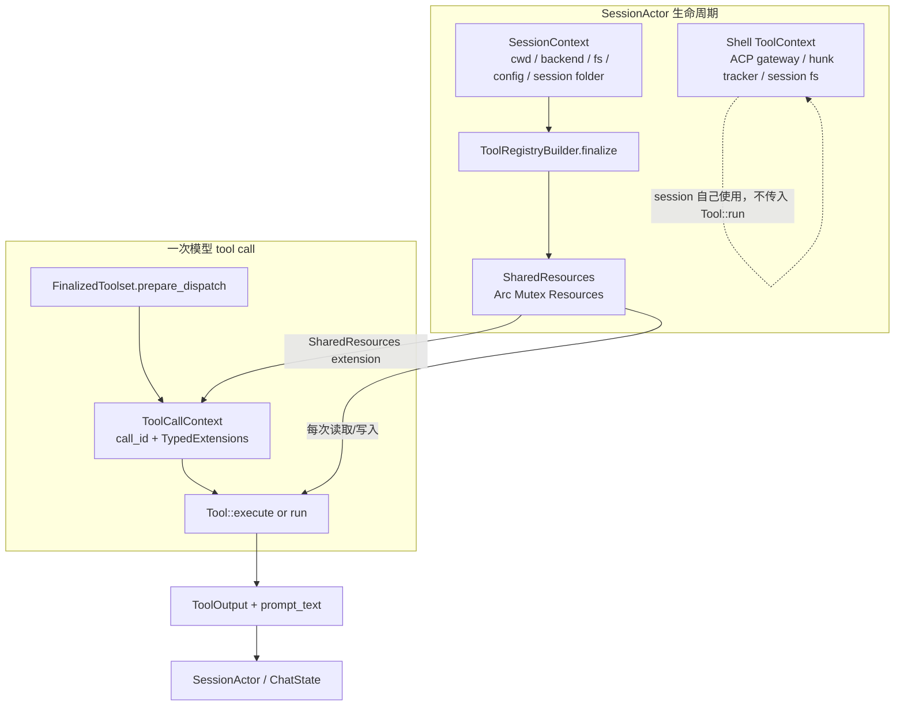
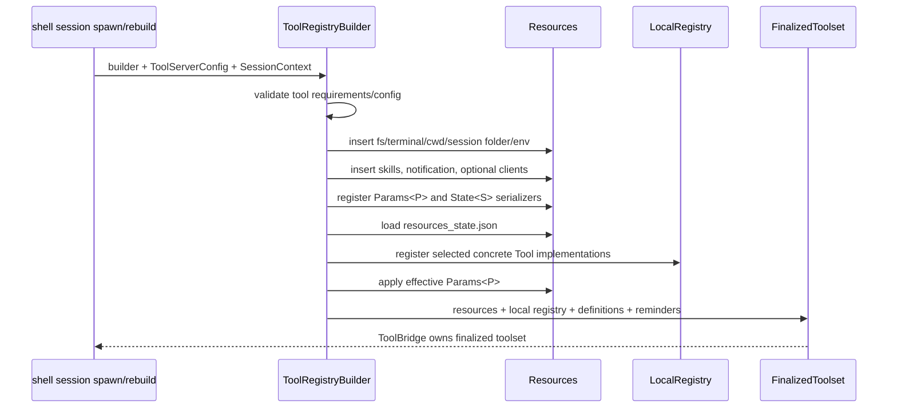
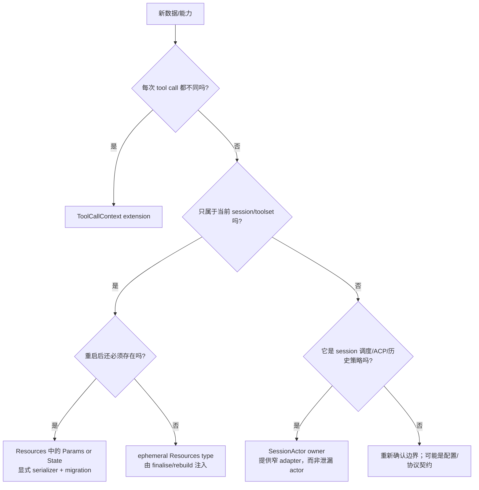

# 资源注入与能力边界：工具为何不直接拿全局状态

当你给 Agent 增加一个工具、接入外部客户端，或修复 fork/rebuild 后的奇怪行为时，最容易问出一个看似简单的问题：**这个工具该从哪里拿 cwd、文件系统、取消信号、配置、session ID 或后台任务句柄？**

在本项目中，这不是把一个 `Arc` 塞进全局单例的问题。系统刻意把这些值按生命周期拆到三种容器中：

1. `xai_tool_runtime::ToolCallContext`：一次调用的短生命能力；
2. `xai_grok_tools::Resources`：一个已 finalise 的 toolset 共享的、类型化依赖和状态；
3. shell 的 `ToolContext`：名称历史遗留，实际是 `SessionActor` 自己的基础设施状态，**不用于工具执行**。

本文解释三者怎样衔接，什么能持久化、什么必须每次重建，以及如何为新功能选择正确的 owner。建议先读 [工具调用链](./tool-call-pipeline.md)；本文只深入它在“工具到底依赖什么”处留下的实现细节。

---

## 1. 先看总图：不是一个万能 Context



这张图有两个很重要的否定结论：

- `ToolContext` 中有 `cwd`，**不代表**工具应该读取它；实际 tool execution 走的是 bridge/registry 创建的 `SessionContext` 和 `Resources`。
- `Resources` 有跨调用共享状态，**不代表**所有数据都应该放在那里；一次 tool call 的 correlation ID、取消 token 和 wire 元数据属于 `ToolCallContext`。

如果这两个边界被绕过，最典型的后果是：主 session 看起来正常，但 forked child、重建后的 Agent、测试 mock 或 MCP adapter 使用了过期的 path/credential/handle。

---

## 2. 三种容器的精确职责

### 2.1 `ToolCallContext`：一次 call 的不可持久化能力

源码：[xai-tool-runtime/src/context.rs](../../crates/common/xai-tool-runtime/src/context.rs)。

它只有两个核心字段：

```rust
pub struct ToolCallContext {
    pub call_id: ToolCallId,
    pub extensions: TypedExtensions,
}
```

`TypedExtensions` 是 `TypeId -> Arc<dyn Any + Send + Sync>` 的开放容器。runtime 为跨宿主的概念预留了类型化 extension，例如：

| extension | 生命周期 | 语义 |
|---|---|---|
| `Cwd` | 当前 call | 相对路径解析的工作目录 |
| `SessionContext` | 当前 call | wire/hub 场景中的 session identity |
| `TraceContext` | 当前 call | inbound `traceparent` 等相关性信息；不回写 wire |
| `Cancellation` | 当前 call | cooperative cancel；dispatcher 也会在取消时 drop call future |
| `WorkspaceViewerContext` | 当前 call/listing | 已解析的用户 feature flag，缺失即 fail closed |
| `SharedResources` | 当前 call 可取得 | 指向这个 session toolset 的共享依赖容器 |

这类值的共同点是：它们由 dispatcher 在 `prepare_dispatch` 时安装，call 结束即不应再被当作权威状态。工具可从 `ctx.get::<Cancellation>()` 取得协作取消能力，但不能把 token 克隆到一个无人管理的后台 task 中继续运行；那会破坏 session cancel 的收敛语义。

### 2.2 `Resources`：toolset 级的类型化依赖注入

源码：[xai-grok-tools/src/types/resources.rs](../../crates/codegen/xai-grok-tools/src/types/resources.rs)。

`Resources` 是 `TypeId -> Box<dyn Any + Send + Sync>` 的异构容器，finalise 后用 `SharedResources = Arc<tokio::sync::Mutex<Resources>>` 共享。它为工具提供的不是“任意全局对象”，而是由 session setup 明确授权的能力，例如：

| 资源类型 | 典型生产者 | 典型消费者 | 应否持久化 |
|---|---|---|---|
| `FileSystem`、`Terminal` | `SessionContext` -> `finalize` | read/edit/bash 等 I/O 工具 | 否，进程内 capability |
| `Cwd`、`DisplayCwd`、`SessionFolder` | session 创建/fork | 路径解析、临时/会话文件 | 否，实例绑定 |
| `NotificationHandle` | session 的 notification bridge | 进度、任务和工具通知 | 否，channel/handle |
| `Params<P>` | registry 的 effective tool config | 某个工具的稳定配置 | 可，若 `P` 注册为 params |
| `State<S>` | 工具或 scheduler | todo、已报告 completion 等跨 call 状态 | 可，若 `S` 注册为 state |
| `TemplateRenderer`、`AvailableSkills` | finalise/session 更新 | 描述模板、skill/reminder 逻辑 | 否，派生或 runtime snapshot |
| `DenyReadGlobs`、`PlanFilePath` | SessionActor 的 policy/mode setup | grep/read/plan 工具 | 否，必须跟随当前 session 重新注入 |

`Resources::require::<T>()` 会给出带 `missing_resource` code 的明确 `ToolError`，比在工具内 `unwrap()` 更适合暴露装配错误。读取后应尽快 clone 必需值并释放 mutex，再做 I/O：`SharedResources` 保护的是容器一致性，不应该成为整个网络请求或子进程生命周期的锁。

### 2.3 shell `ToolContext`：名字相近，职责不同

源码：[xai-grok-shell/src/tools/tool_context.rs](../../crates/codegen/xai-grok-shell/src/tools/tool_context.rs)。文件头已经明确说明：它是 legacy name，保存 ACP gateway、hunk tracker、session fs、goal/subagent bookkeeping、process scope 等**session 基础设施**，而“tool execution goes through `ToolBridge`”。

```text
需要发 ACP update、管理当前 turn、追踪 hunk、杀掉 session 子进程
  -> SessionActor / shell ToolContext

需要读文件、调用 terminal、使用 per-tool config、更新工具 state
  -> ToolBridge -> FinalizedToolset -> Resources

需要 call_id、cancel、traceparent、viewer feature flag
  -> ToolCallContext.extensions
```

因此，给一个 Tool 增加 `use crate::tools::ToolContext` 不是捷径，而是跨越架构边界。若一个能力只能从 session layer 得到，应由 session 在 finalise/rebuild 时把一个**窄类型的 adapter** 注入 bridge，例如 `WorkflowLaunchHandle` 或 `SubagentEventSender`，而不是把 `SessionActor` 本身泄漏给工具。

---

## 3. 生命周期：builder 怎样把 capability 装进 toolset

[registry/types.rs](../../crates/codegen/xai-grok-tools/src/registry/types.rs) 中的 `ToolRegistryBuilder::finalize_with_trunc_config` 是最关键的装配点。它大致按以下顺序工作：



`register_with_params::<T, P>()` 在 builder 阶段保存多个“在泛型类型仍然可见时”创建的 closure：生成 `T::Args` schema、验证 `P` 的 JSON、把 effective params 写为 `Params<P>`、把它注册为可序列化资源、把具体 `T` 放进 local registry，以及把 JSON output 转回产品的 `ToolOutput`。这解释了为什么不要在后续 session code 中重新手写一份工具 schema 或 params 解析。

finalise 并非“把所有 builder 中的工具都打开”。它先用 `ToolServerConfig`、requirement expression、agent toolset 和 version/config 计算当前 session 的**选中集**，才注册实现并生成 client-facing definition。一个缺少 `WebFetchClient` 的 tool 可以在代码中存在却无法取得必需资源；一个被 toolset 排除的工具则连 definition 都不应出现。两种问题的定位入口不同。

### 3.1 重建和 mode switch 为什么要再注入资源

Agent model switch、definition rebuild、fork 或 session setup 都可能得到新的 `ToolBridge`。shell 会在这些路径调用 `update_resource(...)`，向新 bridge 放入随 session 改变的能力，例如：

- `ToolIndex` 和 managed gateway client；
- 当前 `PlanFilePath`、`DenyReadGlobs`；
- `WorkflowLaunchHandle`、`GoalUpdateHandle`；
- 子代理 backend、session ID、depth、event sender；
- `DisplayCwd`，让模型历史中的旧绝对路径映射到 fork 的真实 worktree。

这不是重复初始化。它保证“新 bridge 的依赖完整”这一不变量。若新增一个 runtime resource，只在首次 spawn 插入、忘记在 rebuild/mode switch 重新插入，bug 往往只在长会话、切模型或子代理中出现。

---

## 4. `Params<T>`、`State<T>` 与 ephemeral resource

`Resources` 不会自动把每个类型写盘。持久化能力是显式的：`register_params::<P>()` 和 `register_state::<S>()` 将类型的 `ResourceType::ID` 与序列化/反序列化 closure 登记进容器。保存的 JSON 形状是：

```json
{
  "params": {
    "grok_build.ReadFile": { "cursor_rules_on_read": true }
  },
  "state": {
    "grok_build.Todo": { "items": [] }
  }
}
```

对应的判断表：

| 问题 | 放置位置 | 原因 |
|---|---|---|
| 用户/agent 配置，重启后仍应生效？ | `Params<P>` + `ResourceType` + `register_with_params` | config 在 finalise 时合并 default/override，并可恢复 |
| 工具管理的跨调用状态，重启后仍应恢复？ | `State<S>` + 显式 `register_state` | 例如 scheduler/todo 的状态是 toolset state |
| 当前 cwd、open channel、terminal、HTTP client、cancel token？ | 普通 ephemeral resource 或 `ToolCallContext` | 这些值依赖当前进程/session；持久化会制造失效 handle |
| 每个模型调用携带的输入、call ID、trace、取消？ | `ToolCallContext` | 不能跨 call 复用或写进 session state |

`Params<T>` 与 `State<T>` 即使内部都是同一个 `T`，也有不同 `TypeId`，所以配置和状态可以并存而不会冲突。`ResourceType::ID` 也是持久化/动态 option API 的稳定 key，改名等于改变存储和外部配置契约。新增字段应使用 serde default；否则旧的 `resources_state.json` 或工具配置会在升级后无法读取。

### 4.1 典型实例：`ReadFileParams` 与 `WebFetchClient`

`read_file` 定义了可序列化的 `ReadFileParams`，用 `register_resource!("grok_build", "ReadFile", ReadFileParams)` 给出稳定 ID；运行时从 `Resources` 的 `Params<ReadFileParams>` 读取 `cursor_rules_on_read`。

相反，`WebFetchClient` 来自 `WebFetchConfig::Enabled` 的 finalise 注入。它是带 HTTP 配置的运行时客户端，而非可恢复的用户 state；若拿不到它，工具应返回 `missing_resource`/配置错误，而不是私自从环境变量创建另一套 client。这样认证、SSRF policy、proxy 和 telemetry 的 owner 才不会分裂。

---

## 5. 一次 dispatch 中资源如何进入工具

`FinalizedToolset::prepare_dispatch` 先在短暂的 registry read guard 内解析 client-facing tool name、反向映射参数名、取得 local registry handle；释放该 guard 后才构造 `ToolCallContext` 并进入 async execution。源码中的 `DispatchParts` 注释专门强调：这些准备结果在 `.await` 前被捕获，避免把 registry lock 持有到工具执行期间。

下列代码是结构近似，不是源码复制：

```rust
// registry：运行时为每次 call 建新 context。
let mut ctx = ToolCallContext::new(call_id);
ctx.insert(shared_resources.clone());
ctx.insert(runtime_cwd);                 // 仅当 caller 提供 per-call override
ctx.insert(Cancellation(cancel_token));  // 仅当 dispatch 具备 cancel handle

// 具体工具：短暂锁住容器，拿出可 clone 的依赖，然后释放锁再 await。
let resources = shared_resources(&ctx)?;
let (fs, cwd, config) = {
    let res = resources.lock().await;
    (
        res.require::<FileSystem>()?.clone(),
        res.require::<Cwd>()?.0.clone(),
        res.get::<Params<MyParams>>().cloned().unwrap_or_default(),
    )
};
let output = fs.read(cwd.join(input.path)).await?;
```

这里的 owner 关系必须保持：

```text
模型 JSON args      -> Tool::Args              （call input）
ToolCallContext      -> call_id/cancel/trace    （call capability）
Resources            -> fs/config/tool state    （toolset dependency）
SessionActor         -> permission/UI/history   （session policy）
```

工具可以使用 context 和 resources 执行能力，但不能据此越过 session policy。例如读取 `FileSystem` 不等于可以忽略 permission gate；工具执行前的 approval、排队、并发和结果写回依然由 `SessionActor`/tool dispatch path 决定。

---

## 6. 新功能的选择流程

新增一个依赖前，用以下决策树，而不是先找最方便的 `static`：



### 6.1 新资源的实现清单

1. 写出 resource 的 owner、生命周期、是否可 clone、是否能序列化，以及丢失时的失败语义；
2. 若放入 `Resources`，定义独特的新类型，而不是用裸 `String`、`PathBuf` 或 bool，避免同类型 key 覆盖；
3. 只有真正需要恢复的 config/state 才实现 `ResourceType` 并注册 params/state；
4. 在 `ToolRegistryBuilder::finalize` 的 `SessionContext` 装配中加入稳定能力；在 shell setup/rebuild/mode switch 中注入动态能力；
5. 工具用 `require::<T>()` 报告不可执行依赖，用 `get::<T>()` 实现明确 optional capability；不要用环境变量或全局 fallback 偷偷改变行为；
6. 若资源包含 channel、guard 或 cancellation，把 drop/cancel/close 时的收尾责任写清，不能让 task 脱离 session process scope；
7. 为缺失资源、重建后的重新注入、持久化 round-trip（若适用）各写一个最小测试。

### 6.2 两个反模式

**反模式一：把 `SessionActor` 或长生命周期 mutex 直接放给 Tool。** 这让一个具体工具能绕过 permission、ChatState 和 replay 的串行 owner，也会把大锁带进 tool `await` 路径。正确做法是提炼为只表达所需意图的 `FooHandle(sender)` 或 trait object，并由 session 决定如何处理消息。

**反模式二：把 `CancellationToken`、terminal client 或临时 path 写进 `State<T>`。** 下次 restore 会得到一个语义上已失效的 handle。persistent state 只应表达可重新建立的值；运行时 capability 必须在新 session 中重新装配。

---

## 可运行缩小实验

[`mini_capability_injection.rs`](../rust-essentials/labs/async-demos/src/bin/mini_capability_injection.rs) 用 `TypeId + Arc<dyn Any + Send + Sync>` 保留生产 `Resources` 的关键类型边界：

```sh
cargo run --locked \
  --manifest-path docs/rust-essentials/labs/async-demos/Cargo.toml \
  --bin mini_capability_injection
```

程序断言 rebuild 会重新注入 Workspace/Web client、persistent counter 跨 rebuild 保留、credential 和 cancellation 只属于单次 call，以及缺少必需 Web client 时显式返回 `missing resource`。运行后分别为生产中的一个 `Params<T>`、`State<T>`、ephemeral resource 和 `ToolCallContext` extension 找到插入点与消费点；如果找不到 rebuild 路径，就还不能证明该能力生命周期完整。

---

## 7. 测试和调试路线

| 症状 | 优先检查 | 最小测试证据 |
|---|---|---|
| tool 报 `missing_resource` | `finalize_with_trunc_config` 的注入和工具 `require::<T>()` | 用 `Resources::new()` 缺少 T 时断言 error code；补 T 后成功 |
| 正常 session 可用，fork/rebuild 后失效 | `spawn.rs`、`agent_rebuild.rs`、model switch 的 `update_resource` | 创建/rebuild 两个 bridge，确认两者都带动态 resource |
| config 改了但 tool 行为不变 | `Params<P>` 的 `ResourceType::ID`、effective params、name remap | finalise 后读 `Params<P>`，断言 override 与默认值 |
| restart 后 state 丢失/污染 | `register_state`、`ResourcesPersistence`、serde defaults | `serialize -> load_from` round-trip，并覆盖旧 JSON 缺字段 |
| cancel 后 tool 仍运行 | `ToolCallContext::Cancellation`、session dispatch 和 process scope | 可控阻塞工具等待 cancellation，断言 terminal/cancel 收敛 |
| description 声称有能力，执行却没有 | `ToolServerConfig` selection、definition、资源注入 | 同时断言 definition 可见性和执行所需 resource |

调试时，先用具体类型名而不是“resource”泛搜：`rg -n "PlanFilePath|DenyReadGlobs|MyNewResource" crates`。然后沿三个方向确认：它在哪里被插入、在哪些 rebuild 路径重新插入、tool 在何处以 `require`/`get` 消费。只找到其中一个方向，不能证明资源生命周期正确。

---

## 8. 源码阅读断点

1. [xai-tool-runtime/src/context.rs](../../crates/common/xai-tool-runtime/src/context.rs)：`TypedExtensions`、call ID、cancellation 和跨宿主 extension；
2. [xai-grok-tools/src/types/resources.rs](../../crates/codegen/xai-grok-tools/src/types/resources.rs)：typed container、`Params`/`State`、序列化边界、path 资源；
3. [xai-grok-tools/src/registry/types.rs](../../crates/codegen/xai-grok-tools/src/registry/types.rs)：`register_with_params`、finalise、per-call dispatch 和 post-dispatch persistence；
4. [xai-grok-tools/src/bridge.rs](../../crates/codegen/xai-grok-tools/src/bridge.rs)：bridge 如何暴露 `update_resource`、display cwd、MCP 注册和 foreground cancel；
5. [xai-grok-shell/src/tools/tool_context.rs](../../crates/codegen/xai-grok-shell/src/tools/tool_context.rs)：为什么 shell 的同名 context 不是 tool DI；
6. [xai-grok-shell/src/session/acp_session_impl/spawn.rs](../../crates/codegen/xai-grok-shell/src/session/acp_session_impl/spawn.rs) 与 [agent_rebuild.rs](../../crates/codegen/xai-grok-shell/src/session/agent_rebuild.rs)：动态 resource 的重建注入。

读完后，你应该能对每个“我需要把这个对象传给工具”的改动回答四个问题：它归谁所有、存活多久、能否恢复、session rebuild 后由谁重新提供。能回答这四个问题，通常就能避免最隐蔽的 agent runtime 生命周期 bug。
