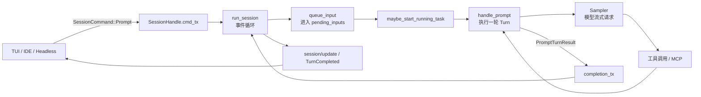
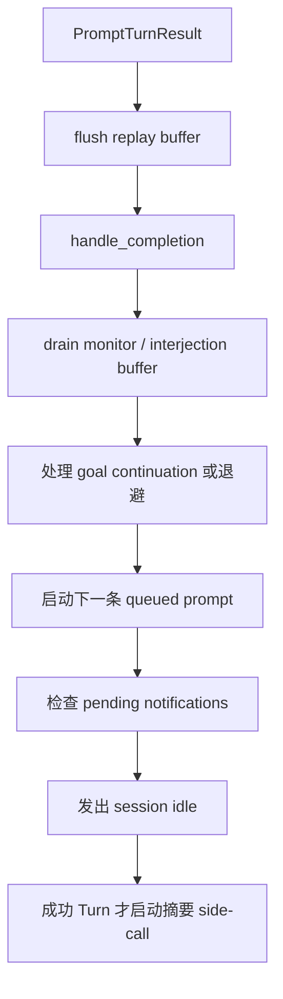

# 09 · `run_session`：SessionActor 的事件调度器

这篇文档专门解释 `xai-grok-shell` 中的 `run_session`。它面向第一次阅读 Tokio Actor 代码的开发者，目标是回答三个问题：

1. `run_session` 长时间运行时到底在等待什么？
2. 用户输入如何从 `SessionCommand::Prompt` 变成一次 Turn？
3. 为什么 `run_session` 自己不直接调用 LLM，却能协调记忆、MCP、工具和 UI 通知？

## 1. 先记住一句话

> `run_session` 是 SessionActor 的**事件循环和调度中心**，不是模型调用函数。

它持有 `SessionActor` 的长生命周期，持续从多个 channel 和 timer 接收事件；收到 Prompt 后把输入排队并启动 Turn，Turn 完成后再回到事件循环做收尾。

```text
外部事件
  ├─ 用户 Prompt / Cancel / Shutdown
  ├─ ChatState 状态通知
  ├─ Session 更新通知
  ├─ 内存定时器
  ├─ 模型切换通知
  └─ Turn 完成回调
          │
          ▼
  run_session：选择现在处理哪个事件
          │
          ├─ 修改 SessionActor 状态
          ├─ 启动或取消后台任务
          ├─ 启动一轮 Turn
          └─ 将结果/通知发回客户端
```

源码入口：[`run_session`](../../crates/codegen/xai-grok-shell/src/session/acp_session_impl/run_loop.rs#L169)。

## 2. 它在整个请求链路中的位置

从用户输入到模型响应，可以先只看下面这张图：



这里有两个重要边界：

- `run_session` 只负责**调度**，不会在主循环里直接写 Responses API 或 Chat Completions 请求。
- `handle_prompt` 负责**执行一轮 Turn**，内部才会进入采样、工具调用、上下文处理和结果写回。

### 函数级导航：按调用顺序阅读

不要只在文件之间跳转。第一次阅读时，按下表逐个打开函数，并在每一步回答“它接收什么、修改什么、下一步交给谁”：

| 顺序 | 函数 | 文件 | 这一层实际做什么 | 下一跳 |
|---|---|---|---|---|
| 1 | [`spawn_session_actor`](../../crates/codegen/xai-grok-shell/src/session/acp_session_impl/spawn.rs#L205) | `spawn.rs` | 创建 `SessionActor`、各 channel 和 `SessionHandle`；随后以 `spawn_local` 托管会话循环。 | [`run_session`](../../crates/codegen/xai-grok-shell/src/session/acp_session_impl/spawn.rs#L2073) |
| 2 | [`run_session`](../../crates/codegen/xai-grok-shell/src/session/acp_session_impl/run_loop.rs#L169) | `run_loop.rs` | 持有 mailbox、timer 和 completion receiver；在 `select!` 中串行处理会话级状态。 | Prompt 分支中的 [`queue_input`](../../crates/codegen/xai-grok-shell/src/session/acp_session_impl/run_loop.rs#L668) |
| 3 | [`queue_input`](../../crates/codegen/xai-grok-shell/src/session/acp_session_impl/prompt_queue.rs#L66) | `prompt_queue.rs` | 将用户或合成 Prompt 写入 `pending_inputs`，实现 `send_now`、入队顺序和取消策略；返回是否需要先取消当前 Turn。 | [`maybe_start_running_task`](../../crates/codegen/xai-grok-shell/src/session/acp_session_impl/run_loop.rs#L690) |
| 4 | [`maybe_start_running_task`](../../crates/codegen/xai-grok-shell/src/session/acp_session_impl/notification_drain.rs#L115) | `notification_drain.rs` | 仅在没有 `running_task` 时提升队首输入；创建 `AgentTask::new_prompt` 并保存为当前运行任务，因此同一 Session 同时最多有一个前台 Turn。 | [`AgentTask::new_prompt`](../../crates/codegen/xai-grok-shell/src/session/acp_session_impl/tasks_cancel.rs#L70) |
| 5 | [`handle_prompt`](../../crates/codegen/xai-grok-shell/src/session/acp_session_impl/turn.rs#L241) | `turn.rs` | 真正执行一轮 Turn：解析 prompt、更新 ChatState、采样、工具循环、生成 `PromptTurnResult`。 | `completion_tx.send((prompt_id, result))` |
| 6 | `completion_rx.recv()` 分支 | [`run_loop.rs`](../../crates/codegen/xai-grok-shell/src/session/acp_session_impl/run_loop.rs#L444) | 收到后台 Turn 的完成结果；先 flush 最后一个流式更新，避免 `TurnCompleted` 抢在最后 delta 前。 | [`handle_completion`](../../crates/codegen/xai-grok-shell/src/session/acp_session_impl/run_loop.rs#L473) |
| 7 | [`handle_completion`](../../crates/codegen/xai-grok-shell/src/session/acp_session_impl/turn_end.rs#L184) | `turn_end.rs` | 确认 completion 属于当前队首、清理 `current_prompt_id`/`running_task`、出队并发送终态通知；返回是否确实拥有该 completion。 | 再次调用 `maybe_start_running_task` 启动下一条 |

把这张表压缩成一条链，就是：

```text
spawn_session_actor
  -> run_session
  -> queue_input
  -> maybe_start_running_task
  -> AgentTask::new_prompt
  -> handle_prompt
  -> completion_tx / completion_rx
  -> handle_completion
  -> maybe_start_running_task（下一条队列输入）
```

其中第 2、3、4、6、7 步主要是**状态串行化和队列管理**；第 5 步才是模型和工具实际运行的位置。阅读时若想看“为何一次 Prompt 没有立即发请求”，优先检查 `queue_input` 和 `maybe_start_running_task` 是否因为已有 `running_task`、队列规则或 `send_now` 而改变了执行时机。

## 3. `run_session` 的输入是什么

函数签名中最值得先看的不是最后几个文件系统参数，而是三个接收器：

```rust
pub(super) async fn run_session(
    session: Arc<SessionActor>,
    mut cmd_rx: mpsc::UnboundedReceiver<SessionCommand>,
    mut chat_state_event_rx: mpsc::UnboundedReceiver<xai_chat_state::ChatStateEvent>,
    mut event_rx: mpsc::UnboundedReceiver<SessionEvent>,
    ...
)
```

| 输入 | 谁发送 | `run_session` 关心什么 |
|---|---|---|
| `cmd_rx` | `SessionHandle`、ACP/CLI 入口 | Prompt、取消、关闭、模型切换、配置变更 |
| `chat_state_event_rx` | `ChatStateActor` | 对话重置、图片预算、token 等状态变化 |
| `event_rx` | Session 内部通知生产者 | 流式通知和 replay buffer flush |
| `completion_rx` | `run_session` 自己创建，Turn 任务持有发送端 | 一轮 Turn 已结束 |

`SessionCommand` 的完整定义在 [`commands.rs`](../../crates/codegen/xai-grok-shell/src/session/commands.rs#L191)。初学时优先找 `Prompt`、`Cancel`、`Shutdown` 和 `SetSessionModel`，不用一开始读完所有命令变体。

## 4. 进入循环前：一次性启动准备

`run_session` 在进入 `loop` 前做了一批准备工作。它们可以分为“启动辅助设施”和“启动后台任务”两类。

### 4.1 创建 Turn completion channel

```rust
let (completion_tx, mut completion_rx) =
    mpsc::unbounded_channel::<(String, PromptTurnResult)>();
```

每个 Turn 在后台运行，结束时把 `(prompt_id, result)` 发回 `completion_tx`。主循环只从 `completion_rx` 接收结果，因此它不会被某一次模型请求长期阻塞。

代码见 [`run_loop.rs`](../../crates/codegen/xai-grok-shell/src/session/acp_session_impl/run_loop.rs#L179)。

### 4.2 启动 replay buffer 的定时 flush

流式 `session/update` 不一定每条都立即发给客户端。`ReplayBuffer` 会合并短时间内的更新，定时器通过发送 `SessionEvent::FlushReplay` 要求主循环刷新。

```mermaid
sequenceDiagram
    participant Producer as 通知生产者
    participant Buffer as ReplayBuffer
    participant Timer as flush timer
    participant Loop as run_session
    participant Client as 客户端

    Producer->>Buffer: SessionEvent::Notification
    Timer->>Loop: SessionEvent::FlushReplay
    Loop->>Buffer: flush()
    Buffer-->>Loop: 合并后的通知
    Loop->>Client: emit_buffered(notification)
```

代码位置：[`run_loop.rs`](../../crates/codegen/xai-grok-shell/src/session/acp_session_impl/run_loop.rs#L182-L196) 和 [`replay_events.rs`](../../crates/codegen/xai-grok-shell/src/session/replay_events.rs#L106)。

### 4.3 按能力启动文件系统 watcher

`fs_watch` 不是无条件启动。只有 `fs_watch_caps.needs_watcher()` 为真时，才会创建 watcher；没有消费者就跳过，减少后台线程和文件系统开销。

```text
fs_watch_caps.needs_watcher()
       ├─ true  -> 构建 FsWatchDeps -> spawn watcher
       └─ false -> 不启动
```

代码见 [`run_loop.rs`](../../crates/codegen/xai-grok-shell/src/session/acp_session_impl/run_loop.rs#L217-L231)。

### 4.4 启动 MCP liveness dispatcher

如果配置启用了 MCP liveness watcher，`run_session` 会建立 MCP 客户端事件 channel，并启动 dispatcher。它可以观察 MCP 客户端状态；在允许自动重启时，dispatcher 通过 `RestartActions` 重启失活客户端。

这段逻辑位于 [`run_loop.rs`](../../crates/codegen/xai-grok-shell/src/session/acp_session_impl/run_loop.rs#L237-L287)，MCP 初始化细节位于 [`mcp.rs`](../../crates/codegen/xai-grok-shell/src/session/acp_session_impl/mcp.rs#L1096)。

### 4.5 后台初始化 MCP 工具并尝试恢复任务

```rust
tokio::task::spawn_local(async move {
    session.ensure_mcp_tools_initialized().await;
    SessionActor::maybe_start_running_task(session, completion_tx).await;
});
```

注意这里使用 `spawn_local`：MCP 初始化可能涉及进程启动、网络或认证，不能让主事件循环一直等它完成。初始化完成后，还会检查是否有恢复中的任务需要继续运行。

代码见 [`run_loop.rs`](../../crates/codegen/xai-grok-shell/src/session/acp_session_impl/run_loop.rs#L289-L295)。

## 5. 核心：`tokio::select!` 事件循环

初始化完成后进入永久循环：[`run_loop.rs`](../../crates/codegen/xai-grok-shell/src/session/acp_session_impl/run_loop.rs#L308-L309)。核心结构可以简化为：

```rust
loop {
    tokio::select! {
        biased;
        idle_flush_timer => { ... }
        dream_timer => { ... }
        model_switch => { ... }
        chat_state_event => { ... }
        session_event => { ... }
        turn_completion => { ... }
        session_command => { ... }
    }
}
```

### 5.1 `biased` 是什么

`biased;` 表示多个分支同时 ready 时，按代码出现顺序优先选择前面的分支。它不是“所有分支并行执行”，也不是线程优先级。

阅读时要问两个问题：

1. 这个分支是否会长时间 `await`？
2. 长操作是否被 `spawn_local` 拆出去，避免阻塞 Actor 循环？

例如内存 flush 和 dream 分支只是启动后台任务，然后立即回到循环；因此用户的 Prompt 仍能继续进入 mailbox。

### 5.2 空闲 memory flush

当会话闲置一段时间、内存功能开启、且没有其他 flush 正在运行时，检查对话长度是否增长：

```text
定时器触发
  -> 读取当前 conversation_len
  -> 与 last_idle_flush_conversation_len 比较
  -> 有新消息：spawn_local(run_memory_flush)
  -> 重置 idle timer
```

代码见 [`run_loop.rs`](../../crates/codegen/xai-grok-shell/src/session/acp_session_impl/run_loop.rs#L311-L340)。它不是每次定时都无条件调用模型，先比较长度可以避免空转。

### 5.3 dream 检查

dream 是记忆系统的后台整理，不是用户当前 Turn 的一部分：

```text
dream timer
  -> spawn_local
  -> session.maybe_run_dream()
  -> 记忆系统决定是否真的整理
```

代码见 [`run_loop.rs`](../../crates/codegen/xai-grok-shell/src/session/acp_session_impl/run_loop.rs#L342-L355) 和 [`memory_dream.rs`](../../crates/codegen/xai-grok-shell/src/session/acp_session_impl/memory_dream.rs#L200)。

### 5.4 模型切换订阅

`models_manager.subscribe_model_switch()` 返回一个 watch receiver。模型切换发生后，循环读取新 generation，并调用 `handle_model_switch_for_laziness`，重置当前 session/model 的 laziness 计数。

代码见 [`run_loop.rs`](../../crates/codegen/xai-grok-shell/src/session/acp_session_impl/run_loop.rs#L296-L297、L357-L367)。

### 5.5 ChatState 事件

ChatState 是对话状态的权威来源。`run_session` 不重新计算整个对话，只处理少量需要由 Session 层协调的事件：

- `ConversationReset`：重置 idle flush 计数，并重新允许 context 注入检查；
- `ImageBudget`：记录图片大小和淘汰数量的遥测；
- `PromptIndexChanged`、`TokensUpdated`：信息性通知，实际数据由消费者按需查询。

代码见 [`run_loop.rs`](../../crates/codegen/xai-grok-shell/src/session/acp_session_impl/run_loop.rs#L369-L415)。

### 5.6 SessionEvent 与 replay buffer

`SessionEvent::Notification` 先进入 replay buffer，满足合并条件后才由 `emit_buffered` 发出。`FlushReplay` 则强制刷新，并可通过 oneshot 回传 ack。

这保证了一个重要顺序：**TurnCompleted 等持久事件不会跑到本轮最后一个流式 delta 前面。**

代码见 [`run_loop.rs`](../../crates/codegen/xai-grok-shell/src/session/acp_session_impl/run_loop.rs#L416-L442)。

## 6. 最重要的主链路：Prompt 如何启动 Turn

### 6.1 外部发送命令

调用方通常持有 [`SessionHandle`](../../crates/codegen/xai-grok-shell/src/session/handle.rs)，通过 `cmd_tx` 发送 `SessionCommand::Prompt`。Actor mailbox 收到后进入 Prompt 分支。

### 6.2 Prompt 分支做什么

初学时可把 [`run_loop.rs`](../../crates/codegen/xai-grok-shell/src/session/acp_session_impl/run_loop.rs#L597-L691) 压缩成以下六步：

```text
1. 判断 Prompt 是否被允许接纳
2. 确保 system prompt 前缀已准备好
3. 用户重新输入时清除取消后的通知抑制状态
4. 将 Prompt 放进 pending_inputs
5. 如果 send_now，先取消当前 Turn
6. maybe_start_running_task：空闲时启动下一轮
```

`queue_input` 只负责排队和处理队列策略；它不负责请求模型。真正启动位置是 `maybe_start_running_task`，实现位于 [`notification_drain.rs`](../../crates/codegen/xai-grok-shell/src/session/acp_session_impl/notification_drain.rs#L115)。

### 6.3 Turn 在哪里执行

Turn 入口是 [`handle_prompt`](../../crates/codegen/xai-grok-shell/src/session/acp_session_impl/turn.rs#L241)。它会继续处理：

```text
解析 prompt / slash command
  -> 写入用户消息和 ChatState
  -> 构造模型请求
  -> Sampler 接收流式响应
  -> 解析 tool call
  -> 执行工具 / MCP
  -> 写回 ToolResult
  -> 必要时再次采样
  -> 生成 PromptTurnResult
```

因此，想学习 LLM 调用，不要继续深挖 `run_session` 的 `select!`；应转到：

- Turn 编排：[`turn.rs`](../../crates/codegen/xai-grok-shell/src/session/acp_session_impl/turn.rs)
- 采样与工具循环：[`sampler_turn.rs`](../../crates/codegen/xai-grok-shell/src/session/acp_session_impl/sampler_turn.rs)
- 工具调用：[`tool_calls.rs`](../../crates/codegen/xai-grok-shell/src/session/acp_session_impl/tool_calls.rs)
- 模型 HTTP：[`remote/client.rs`](../../crates/codegen/xai-grok-shell/src/remote/client.rs)

## 7. Turn 完成后发生什么

Turn 任务将结果发送给 `completion_tx`，主循环在 `completion_rx` 分支统一收尾：[`run_loop.rs`](../../crates/codegen/xai-grok-shell/src/session/acp_session_impl/run_loop.rs#L444-L526)。顺序可以简化为：



关键原则：

- 先 flush 最后的流式 delta，再写持久的 TurnCompleted；
- `handle_completion` 负责把结果归属到对应 prompt；
- 之后才允许下一条排队输入启动，避免多个前台 Turn 同时修改同一个 Session；
- 取消、错误和“从队列移除”的结果不会走完全相同的成功后续逻辑。

## 8. 关闭路径

关闭有两类常见入口：

1. `cmd_rx` 关闭：发送者全部被丢弃；
2. 收到 `SessionCommand::Shutdown`：显式关闭。

两条路径都会做类似的事情：

```text
SessionEnd hooks
  -> memory session-end pipeline
  -> flush replay buffer
  -> 记录 SessionEnded telemetry
  -> shutdown workflows / persistence
  -> feedback sync 和上传队列 drain
  -> return
```

关闭相关辅助函数在 [`run_loop.rs`](../../crates/codegen/xai-grok-shell/src/session/acp_session_impl/run_loop.rs#L91-L167)，channel-closed 分支在 [`run_loop.rs`](../../crates/codegen/xai-grok-shell/src/session/acp_session_impl/run_loop.rs#L529-L558)。

## 9. 新手的推荐阅读顺序

不要按文件从上到下通读。建议每次只回答一个问题：

1. **谁创建 SessionActor？** 从 [`spawn.rs`](../../crates/codegen/xai-grok-shell/src/session/acp_session_impl/spawn.rs#L2073) 看 `run_session` 如何被放入 `spawn_local`。
2. **有哪些输入？** 看 `run_session` 签名和 [`SessionCommand`](../../crates/codegen/xai-grok-shell/src/session/commands.rs#L191)。
3. **Prompt 怎样排队？** 看 Prompt 分支和 `queue_input`。
4. **Turn 怎样开始？** 看 `maybe_start_running_task`，再跳到 [`handle_prompt`](../../crates/codegen/xai-grok-shell/src/session/acp_session_impl/turn.rs#L241)。
5. **Turn 怎样结束？** 回到 `completion_rx` 分支，看 `handle_completion` 和下一条任务启动。
6. **后台能力如何接入？** 最后再读 memory、MCP、fs watcher 和 replay buffer。

### 一个适合第一次阅读的简化笔记

```text
run_session = mailbox + timers + completion collector

Prompt      = 入队，不等于调用模型
Turn        = 真正的模型/工具执行
completion  = Turn 回到 Actor 的唯一收尾入口
SessionEvent = 流式通知的顺序和合并
Shutdown    = hooks、持久化、遥测和后台任务清理
```

## 10. 可执行练习

### 练习 A：画出一次 Prompt

从 `SessionHandle.cmd_tx` 开始，画出以下节点，并为每条箭头写出 channel 或函数名：

```text
客户端 -> SessionCommand::Prompt -> queue_input
      -> maybe_start_running_task -> handle_prompt
      -> completion_tx -> completion_rx -> handle_completion
```

### 练习 B：验证“主循环不被后台任务卡住”

在代码中寻找所有 `tokio::task::spawn_local`，分别判断它们是在执行：

- MCP 初始化；
- memory flush / dream；
- laziness 或摘要 side-call；
- 还是必须留在 Actor 内串行处理的状态变更。

### 练习 C：区分三种消息

给下面三种消息分别找发送端和接收端：

| 消息 | 要找的接收逻辑 |
|---|---|
| `SessionCommand::Prompt` | `cmd_rx.recv()` 的 Prompt 分支 |
| `SessionEvent::Notification` | `event_rx.recv()` 的 replay buffer 分支 |
| `PromptTurnResult` | `completion_rx.recv()` 的 completion 分支 |

如果这三条路径能独立讲清楚，就已经掌握了 `run_session` 的骨架；之后再深入具体工具、记忆或 MCP 实现。
