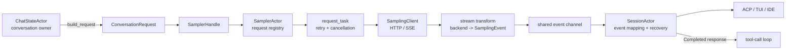
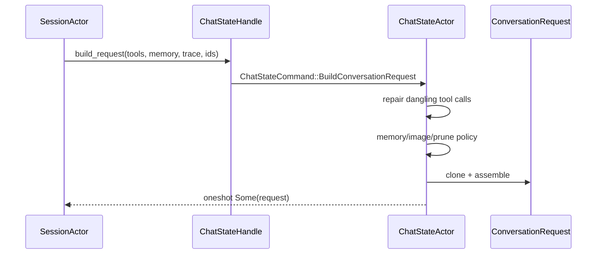
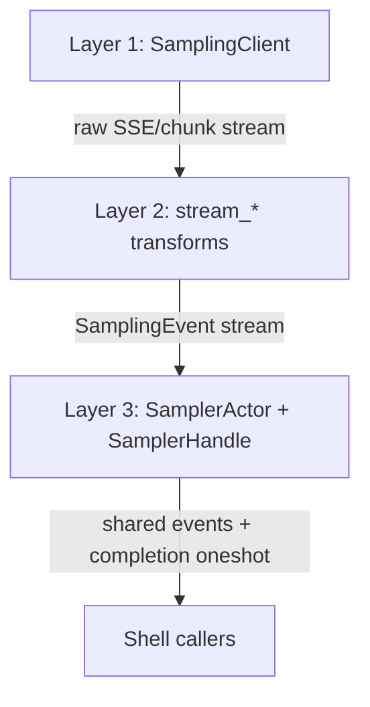
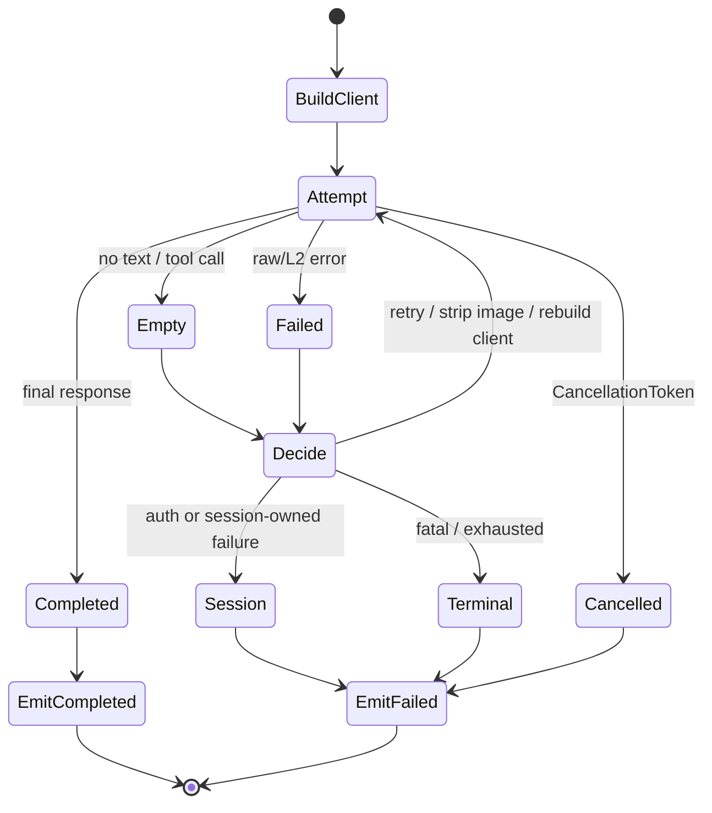
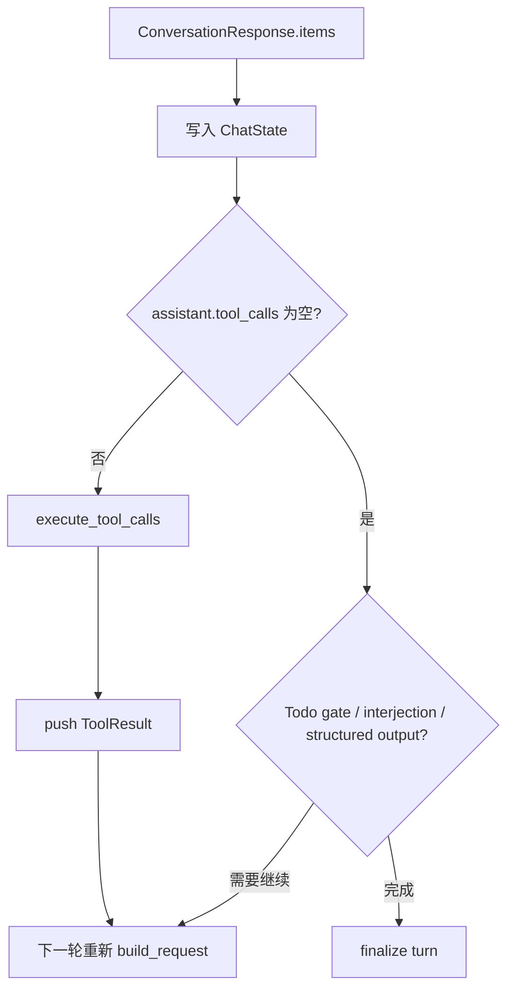

# 采样生命周期：从 `ConversationRequest` 到流事件、重试和最终响应

在 Agent Loop 中，`sample` 看起来像一行“向模型请求回答”的调用；实际上它跨越了四个不同的 owner：

1. `ChatStateActor` 拥有会话历史，构造 `ConversationRequest`；
2. `SamplerActor` 管理并发请求、配置和取消；
3. 每个 request task 调 HTTP、解析不同协议的流、执行网络级重试；
4. `SessionActor` 将 `SamplingEvent` 映射为 ACP/UI、工具状态和 session 级恢复策略。

把这四层混在一起读，很容易得出错误结论，例如“收到文本 chunk 就可以执行工具”或“任何 401 都应由 HTTP client 自动重试”。本文按数据和控制权解释实际边界。

## 1. 一张全链路图



核心不变量：**streaming event 负责“用户现在看见什么”，`ConversationResponse` 负责“下一步 Agent Loop 要根据什么执行”。** 两者都来自同一请求，但到达顺序由异步 channel 决定，所以有一个额外的 stream-drain barrier 来保证工具 UI 事件不会跑到文本/推理事件之前。

## 2. `ConversationRequest`：发送给模型的不是裸字符串

类型定义在 `crates/codegen/xai-grok-sampling-types/src/conversation.rs`。一个 request 至少包含：

| 字段 | 谁给出 | 用途 |
| --- | --- | --- |
| `items` | `ChatStateActor` | System/User/Assistant/Reasoning/ToolResult 等有序 conversation |
| `tools` | Shell 的 ToolBridge/registry | 需要客户端执行的 function tool schema |
| `hosted_tools` | agent/session 配置 | 后端原生执行的工具，例如 backend search |
| `model`、temperature、top-p、max output | `SamplingConfig` | 模型和采样参数 |
| `reasoning_effort` | 模型配置 | reasoning model 的 effort |
| `json_schema` | structured-output 逻辑 | 原生严格 schema 输出 |
| `x_grok_*`、`trace`、`prompt_cache_key` | Session/telemetry | 路由、可观测性、请求存档与缓存亲和 |

### 2.1 请求构建并不直接读 `Vec`

`SessionActor` 用 `ChatStateHandle::build_request` 把请求放入 `ChatStateActor` 的命令队列：



这保证 conversation 的读、完整性修复和可能的持久化写入都由同一个 actor 串行化。直接在 SessionActor 持有或修改 `Vec<ConversationItem>` 会绕开这个 ownership 边界，导致并发的工具结果、interjection 或 compaction 与请求快照竞态。

### 2.2 `build_conversation_request` 的五步

实现位于 `xai-chat-state/src/actor/request_builder.rs`：

1. 由 command handler 先 `ensure_conversation_integrity()`：去重重复 tool result，并为被取消/崩溃遗留的 tool call 补修复结果；
2. 判断 token 使用是否超过 context window 的一半；
3. 若需要，持久化 memory reminder 到真实 history；
4. 对 request copy 做图像 body 预算和旧 tool result pruning；
5. 组装类型化的 `ConversationRequest`。

其中要特别区分两类 mutation：

```text
真实 conversation：integrity repair、需要保留的 memory reminder
request copy：      image eviction、soft trim / hard clear tool result
```

前者可能调用 `ChatPersistence::replace_history`；后者只影响本次模型输入。不要看到 `prune_conversation` 就假定 session 历史永久变短。更完整的上下文策略参见 [04-context-management.md](../04-context-management.md)。

### 2.3 图片过大时有两道防线

第一道在 ChatState：请求 body 接近 50 MiB 才从最旧 inline image 开始驱逐到低水位，避免每轮改写历史前缀而损失 prompt-cache 命中。

第二道在 sampler request task：若上游给出 413 或“很可能是 body 被代理拒绝”的连接错误，调用 `ConversationRequest::strip_images()`，用文本占位替换用户图片、清空 tool result 图片后重试。前者是主动预算，后者是协议/代理误差的兜底；它们都只改即将发送的 request。

## 3. Sampler 的三层 API

`xai-grok-sampler/src/lib.rs` 把职责拆成可独立测试的三层：



### 3.1 Layer 1：`SamplingClient`

`SamplingClient` 拥有 `reqwest::Client`、默认 header、认证和三种 API 形状的请求构造：

- OpenAI Chat Completions：`/chat/completions`；
- OpenAI Responses：`/responses`；
- Anthropic Messages：`/messages`。

它负责把 API-agnostic `ConversationRequest` 转成各后端 wire type，并采集响应 header 中的 model metadata、`Retry-After`、`x-should-retry` 等事实。它不拥有 session，也不知道一次 400 是否应该触发 compaction。

### 3.2 Layer 2：协议流变为统一 `SamplingEvent`

三份纯 transform 分别在：

- `stream/chat_completions.rs`
- `stream/responses.rs`
- `stream/messages.rs`

它们把后端特定 SSE/chunk 翻译为同一种事件序列。无论后端如何，正常路径都应有一个终端 `Completed`，错误路径有一个终端 `Failed`；如果底层 stream 无终端地消失，collector 视为异常而不是“成功但没有内容”。

| 统一事件 | 表示什么 | Session 侧动作 |
| --- | --- | --- |
| `StreamStarted` | headers/stream 已建立 | 记录流开始时间 |
| `FirstToken` | 第一个可见内容到达 | 触发 first-token 事件/TTFT |
| `ChannelToken { Text }` | assistant 文本 delta | ACP `AgentMessageChunk` |
| `ChannelToken { Reasoning }` | reasoning delta | ACP thought chunk |
| `ToolCallDelta` | function arguments 的片段 | buffered xAI tool-call delta |
| `ResponseStarted` | Messages 后端的 message id/输入 usage | 发送 response-start metadata |
| `ReasoningCompleted` | Messages reasoning signature 到达 | 发送 signature 更新 |
| `BackendToolCallStarted/Completed` | 服务端 hosted tool 生命周期 | 展示但不由客户端执行 |
| `ModelMetadata` | context window / max output 等 header | 刷新本地模型事实 |
| `Retrying` | 当前请求会再尝试 | 发送 retry state |
| `Completed` | 最终的 `ConversationResponse` | 允许 turn 继续处理 tool call |
| `Failed` | 已无法完成 | 交给 turn-level recovery |

`ToolCallDelta.arguments_delta` 并不保证单独是合法 JSON。真正可执行的 tool call 只能从最终 `ConversationResponse` 的 assistant item 读取；否则参数可能只是 `{\"path\":` 的半截。

### 3.3 Layer 3：Actor 管登记，不串行网络

`SamplerActor` 的 mailbox 是单线程处理的，但每个 `Submit` 都通过 `JoinSet` spawn 一个 `request_task`。因此它可以同时维护多个采样任务，而不会让一个慢 stream 阻塞提交、取消、配置更新或其他请求。

```mermaid
flowchart LR
    H1[SamplerHandle clone A] --> Q[SamplerCommand queue]
    H2[SamplerHandle clone B] --> Q
    Q --> SA[SamplerActor]
    SA --> R1[request task #1]
    SA --> R2[request task #2]
    SA --> R3[request task #3]
    SA -->|Cancel(request_id)| CT[CancellationToken]
    R1 --> E[shared SamplingEvent channel]
    R2 --> E
    R3 --> E
```

`SamplerHandle` 的两种提交 API 意义不同：

| API | 调用者如何拿结果 | 典型用途 |
| --- | --- | --- |
| `submit` / `submit_with_config` | 只从共享 event channel 观察 | 纯流式/多请求调用方 |
| `submit_and_collect` | 共享 events + per-request completion oneshot | 顺序的主 turn、compaction、summary、`/btw` |

`submit_and_collect` 安装了 `CancelOnDrop` guard：future 因取消、panic 或早退被 drop 时，它会发 `Cancel(request_id)`。这不是强制杀线程；request task 在 `CancellationToken` 的 await/select 点协作退出。

## 4. request task：一次尝试与一次请求不同

每个 `request_task::run_request_task` 有一个 request id，内部却可能运行多次 attempt。它会：

1. 根据 config 创建 `SamplingClient`；
2. 为本次 request 构造 tracing span；
3. 选择对应 backend 的 Layer-2 stream transform；
4. 消费 events，同时保留最后的 rich `SamplingError`；
5. 根据 `RetryDecision` 选择 retry、图片剥离、client rebuild、转交 Session 或终止；
6. 只有成功后才发送一个规范化的 `SamplingEvent::Completed`，并完成 oneshot。



注意 terminal 事件的来源：Layer-2 的单次 attempt 会产生 `Completed` 或 `Failed`，但 request task 会先拦住它来决定是否 retry；最终才把一个“这整个 logical request 的结果”送给 Session。因此 UI 不会在一次失败 attempt 后先结束 turn，又在后续 retry 时继续生成。

### 4.1 空响应不是成功

`Completed` 但 assistant 没文本也没 tool call，可能是 reasoning-only、截断或上游异常。request task 把它转换为 `SamplingError::EmptyResponse { context }`，记录是否有 reasoning、finish reason、token 计数和 model，再走 retry policy。这样可以区分“模型确实拒绝”与“流不完整”，并避免把空 assistant 保存成成功回合。

### 4.2 `retry_only_before_output` 的安全含义

有些调用方要求一旦已经产生任何 text/reasoning/tool delta，就不再自动重试。request task 通过 `output_observed` 记录开始输出后，将有效 retry budget 置为 0。原因不是网络重试实现不了，而是对用户来说“先看见半段 A，再看见从头重试的 B”会产生重复输出和难以解释的状态。

## 5. 重试矩阵：谁决定、消耗哪个预算

`xai-grok-sampler/src/retry.rs` 是纯分类逻辑；实际 sleep、通知、client rebuild 和 request mutation 在 request task 中执行。

| 类别 | Sampler 决策 | 关键限制 | Session 是否再判断 |
| --- | --- | --- | --- |
| 连接、SSE 中断、可重试 5xx | 指数 backoff + jitter | 单次最多约 30 秒，受总 retry budget 限制 | 通常否 |
| 429 | 按 `Retry-After` 重试 | 429 有更低的重试次数上限 | 耗尽后显示 rate-limit 错误 |
| 413/图片处理错误 | strip inline images 后重试 | payload 改变后才值得重试 | 通常否 |
| 首次 transport failure | 可重建 HTTP/1.1 client | 只在相应条件下 | 通常否 |
| empty response | 作为 transient failure 重试 | 可受 output-observed 限制 | 耗尽后记录结构化空响应 |
| Doom loop | 很短 jitter 后重新 sample | 使用独立于 transport 的预算 | Session 记录 signal/telemetry |
| 401/Auth | `EmitToSession` | 不在 sampler 内盲刷 token | 是，按认证类型恢复一次 |
| context window / deterministic size | 不重试相同请求 | sampler 没有可靠的 session token 语义 | 是，决定是否 compact 后重送 |
| 400 encrypted content mismatch | 不重试 | history 与模型不兼容 | 是，给出新建 session 的明确错误 |
| IdleTimeout、serialization、max token truncation | 终止 | 重发大概率没有意义 | 记录并给出 terminal failure |

两个预算不能混：普通 transport/empty budget 由 `max_retries` 控制，doom-loop resample 由 `doom_loop_recovery.max_retries` 控制。`DoomLoopDetected` 在 request task 中先处理，不会悄悄消耗网络错误预算。

### 5.1 不能在 sampler 内处理 context overflow

`SamplingErrorKind` 特意没有“context exceeded”变体。上游可能把它报告为带 model metadata 的 API 400，且 sampler 不拥有：

- 当前 session 的真实/估计 token 数；
- compaction policy 与模型的 context window override；
- 何时写入 compaction checkpoint；
- compact 后如何替换 ChatState conversation。

所以 SessionActor 的 `handle_sampling_failure` 通过 `should_compact_on_error` 判断，再调用 `run_compact_only`，返回 `CompactAndResubmit` 给外层 turn loop。重试的 request 必须在 compaction 后重新由 ChatState 构建，绝不能把失败的旧 `ConversationRequest` 原样发第二遍。

## 6. SessionActor：事件映射与 stream-drain barrier

Sampler 在共享 channel 发送事件，session 的 drainer 调 `handle_sampling_event`。该函数是“低副作用映射”：它不执行 session 级 recovery，因为 recovery 需要当前 turn 的上下文和可能的再次 submit。

```mermaid
sequenceDiagram
    participant RT as request_task
    participant E as sampler_event_rx
    participant D as session drainer
    participant S as SessionActor
    participant U as ACP client
    participant O as run_turn_via_sampler

    RT->>E: ChannelToken(Text, "...")
    E->>D: event
    D->>S: handle_sampling_event
    S->>U: AgentMessageChunk
    RT->>E: Completed(response)
    RT-->>O: completion oneshot(response)
    E->>D: Completed
    D->>S: record metrics + signal stream drained
    O->>O: wait up to 5s for drain barrier
    O-->>S: return response; now evaluate tool_calls
```

为什么已有 `submit_and_collect` completion oneshot 仍要等？两个 delivery path 并不保证消费者的调度顺序。若先收到 response，SessionActor 立刻发 `ToolCall`，客户端可能先看到工具开始、后看到模型刚说的“我先检查文件”。`turn_stream_drained` 在收到 `SamplingEvent::Completed` 后释放；5 秒 timeout 是可观测的降级，而不是死锁。

### 6.1 事件映射表

| Sampler event | `SessionActor` 重要动作 |
| --- | --- |
| `StreamStarted` | 初始化 streaming capture，记录 ChatState stream start |
| `FirstToken` | 触发 `Event::FirstToken` |
| text/reasoning token | 记录 capture、更新 phase，发 ACP message/thought chunk |
| `ToolCallDelta` | 标记 ToolCall phase，走 buffered xAI delta |
| `Completed` | 释放 drain barrier、记录 API 时间/metrics、更新 doom-loop signals |
| `Retrying` | 记录 unified log 与 signal，发 `RetryState::Retrying` |
| `Failed` | 记录 typed error/empty-response context；终局由 turn loop 处理 |
| backend tool started/completed | 显示 server-side tool 状态，并统计成功/失败 |

`Completed` 本身不把 response 写进 ChatState。之后 `turn.rs` 收到 `SamplerTurnOutcome::Response`，根据 `ConversationResponse.items` 写入 reasoning、backend tool item、assistant item，再决定工具执行或结束。这样流式显示和权威会话 mutation 都有清晰 owner。

## 7. 认证、模型元数据和 usage 的不同入口

### 7.1 认证恢复是 Session 的责任

每个 turn 前 `prepare_sampler_for_turn` 会刷新将过期 token、重建 `SamplerConfig` 并 `sampler_handle.update_config`。如果仍收到 auth failure，`handle_sampling_failure` 依据认证方式与 endpoint 归属决定：

- session-based first-party token：`AuthManager::try_recover_unauthorized`；
- provider-backed 模型：走 provider 401 recovery；
- API-key/BYOK 非可恢复场景：直接向客户端报告，不把 token 刷新请求发给第三方 endpoint。

恢复成功后返回 `RefreshAuthAndResubmit`，外层重新走 turn 的采样路径。认证恢复次数是 turn 级控制，不能由 SamplerActor 对每个网络 event 无限重试。

### 7.2 model metadata 不是装饰

Responses/Messages 等后端可从 header/事件提供 context window、max completion tokens、models etag。`SamplingEvent::ModelMetadata` 到达 session 后更新模型事实，影响：

- 之后请求的 `SamplingConfig`；
- context 占用条与 auto-compaction 的阈值；
- 发生 overflow 时是否可以安全地改写 context window。

不要用静态 model catalog 代替实际响应 metadata；模型配置可能在服务端刷新。

### 7.3 使用量有三个时间点

```text
request 前：ChatState 的 token estimate，用于 pre-sampling compact/prune
stream 中：ResponseStarted/metadata 的输入 token 与 cache 信息，供 UI
完成后：ConversationResponse.usage + InferenceLatencyStats，写 UsageLedger/Signals
```

这三者目的不同。预估值用来防止发出必败 request；provider usage 用于成本/遥测；metrics 用于 TTFT、attempt 数、吞吐等性能判断。不要拿 `cached_prompt_tokens` 从 `prompt_tokens` 中相减，它是 full prompt 中的 cache-hit 子集。

## 8. response 如何回到 Agent Loop

`ConversationResponse` 是扁平有序 item 列表：`Reasoning`、`BackendToolCall` 与一个尾随 `Assistant` 可交织/连续出现。最后的 assistant 携带 client-executable `tool_calls`。



`message_chunks_emitted` 处理一个边界情况：response 有文本、但在 retry/流异常后没有产生 text chunk 时，Session 会补发 fallback message chunk；否则用户会看到工具或 turn 完成，却从未看到最终答复。详情和工具侧续环见 [tool-call-pipeline.md](./tool-call-pipeline.md)。

## 9. 排查手册

### “模型回复了，但 UI 没有文本”

```sh
rg -n "ChannelToken|AgentMessageChunk|message_chunks_emitted|fallback" \
  crates/codegen/xai-grok-sampler/src \
  crates/codegen/xai-grok-shell/src/session/acp_session_impl
```

先确认 Layer-2 是否产生 `ChannelToken(Text)`，再看 `handle_sampling_event` 是否转发，最后检查 response fallback。不应仅看最终 `ConversationResponse`，因为 response 成功不证明每个 delta 已发到 client。

### “工具卡片比文字先出现”

```sh
rg -n "turn_stream_drained|stream-drain barrier|handle_sampling_event|ToolCall" \
  crates/codegen/xai-grok-shell/src/session/acp_session_impl
```

检查 `Completed` event 是否真正到达 drainer、oneshot 是否被释放、以及 5 秒 timeout 的 warning。不要在 `submit_and_collect` 返回处直接删除 barrier；它修复的是两个异步 channel 的顺序问题。

### “401 后反复请求或把 key 发给了错误服务”

```sh
rg -n "auth_gate|try_recover_unauthorized|try_provider_401_recovery|RefreshAuthAndResubmit" \
  crates/codegen/xai-grok-shell/src/session/acp_session_impl/sampler_turn.rs
```

确认失败模型、base URL、session-based gate 和 BYOK/provider 分支。401 不是自动 retry 的 transport error，认证恢复必须在 Session 语义下进行。

### “为什么 context error 没有再发一次相同请求？”

```sh
rg -n "should_compact_on_error|CompactAndResubmit|run_compact_only|is_retry_vetoed" \
  crates/codegen/xai-grok-shell/src/session/acp_session_impl \
  crates/codegen/xai-grok-sampler/src
```

如果请求大小/上下文确定超限，原样 retry 只会浪费时间和额度。需要先 compact，再让 ChatState 根据新的 history 产生新 request。

## 10. 测试入口与贡献策略

建议从最小 owner 的测试开始：

| 变更 | 优先阅读/验证 |
| --- | --- |
| 后端 chunk 到统一事件 | `xai-grok-sampler/src/stream/*` 内的 unit tests |
| retry 分类或 backoff | `xai-grok-sampler/src/retry.rs` tests |
| actor cancel、完成 oneshot | `xai-grok-sampler/src/actor/` tests |
| request copy/prune/image 预算 | `xai-chat-state/src/actor/request_builder.rs` tests |
| 事件到 ACP 的映射/顺序 | `session/acp_session_tests/replay_buffer_send_update_tests.rs` |
| session 级 compact/auth recovery | `acp_session_impl/sampler_turn.rs` 附近的 tests |

改变采样时，至少验证以下不变量：

1. 每个 logical request 对 session 只产生一个终端 `Completed` 或 `Failed`；
2. `Completed` 的 response 与 UI stream 不会造成 tool event 乱序；
3. cancel 停止重试并完成/释放等待者；
4. retry 不重放已写入 ChatState 的 tool result；
5. context overflow、401 和 transport error 分别留给正确的 owner；
6. usage、metadata 和 reason/text chunk 不会因新增 backend 而被静默丢弃。

本轮如果只修改本文档，执行 Markdown 静态检查即可，不需要构建 Rust：

```sh
git diff --check
```

真正修改源码时，再按 [09-contributor-playbook.md](../09-contributor-playbook.md) 选择受影响 crate 的最小测试命令；不要把“文档没构建”误读为“代码改动无需验证”。

## 11. 源码索引

| 问题 | 入口 |
| --- | --- |
| conversation request 如何构建 | `crates/codegen/xai-chat-state/src/actor/request_builder.rs` |
| ChatState request handle | `crates/codegen/xai-chat-state/src/handle.rs` |
| API-agnostic request/response 类型 | `crates/codegen/xai-grok-sampling-types/src/conversation.rs` |
| Sampler 的公开分层 API | `crates/codegen/xai-grok-sampler/src/lib.rs` |
| Actor 的 command/并发模型 | `crates/codegen/xai-grok-sampler/src/actor/mod.rs`、`handle.rs` |
| 一请求多 attempt 的执行器 | `crates/codegen/xai-grok-sampler/src/actor/request_task.rs` |
| 事件类型 | `crates/codegen/xai-grok-sampler/src/events.rs` |
| 重试矩阵 | `crates/codegen/xai-grok-sampler/src/retry.rs` |
| HTTP backend/wire conversion | `crates/codegen/xai-grok-sampler/src/client.rs` |
| SSE transform | `crates/codegen/xai-grok-sampler/src/stream/` |
| Session 级采样准备/恢复 | `crates/codegen/xai-grok-shell/src/session/acp_session_impl/sampler_turn.rs` |
| SamplingEvent 到 ACP 的映射 | `crates/codegen/xai-grok-shell/src/session/acp_session_impl/tool_calls.rs` |
| response 写回和工具循环 | `crates/codegen/xai-grok-shell/src/session/acp_session_impl/turn.rs` |

把采样看成“跨 actor 的协议适配层”，而不是一个同步 HTTP 函数：ChatState 决定**发什么**，Sampler 决定**如何可靠地拿到流**，Session 决定**该怎样展示、恢复并继续执行 Agent Loop**。这三个问题分开，才能安全地扩展后端、调整 retry policy 或修复长会话错误。
