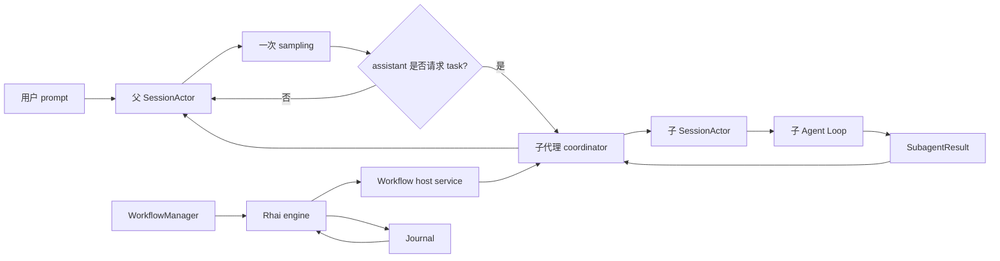
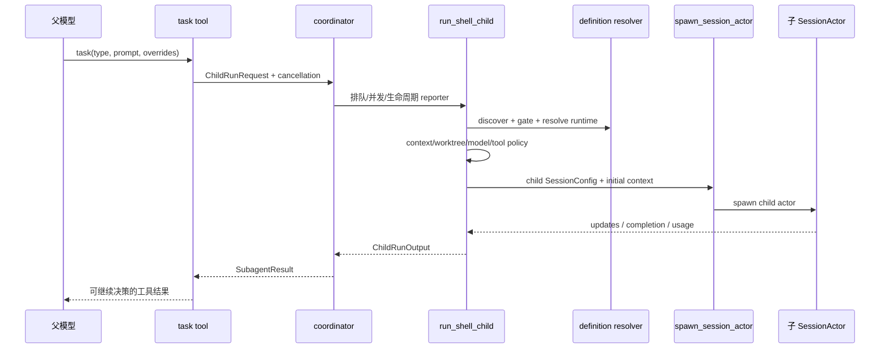
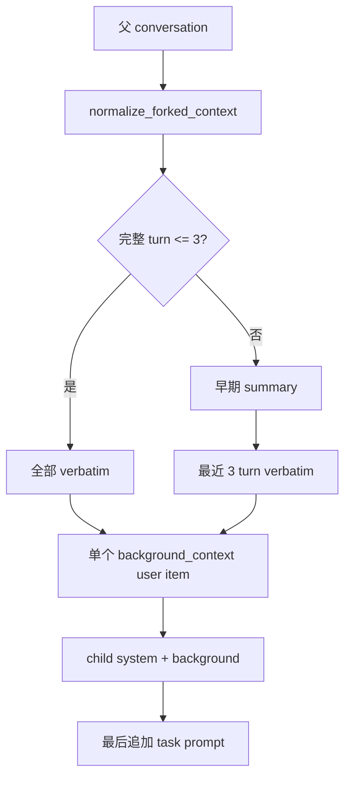
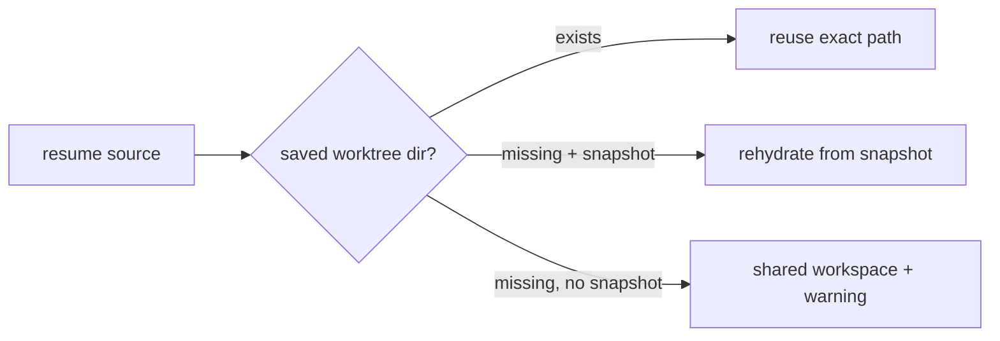
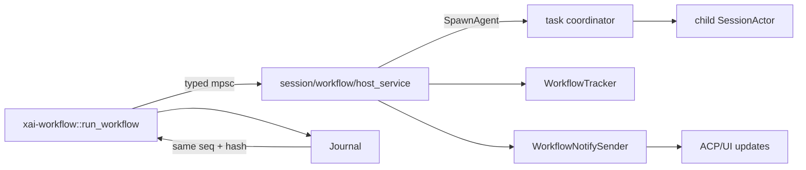
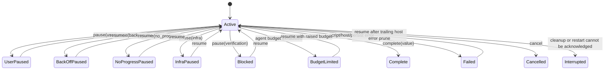

# 源码精读：子代理与 Workflow 如何组成第二层 Agent Loop

普通 Agent Loop 只有一层：当前 `SessionActor` 请求模型、执行工具，再把结果写回自己的 conversation。子代理和 Workflow 在这个循环外面再加一层编排：父 Agent 可以启动一个独立的 child session，Workflow 还可以用 Rhai 脚本决定何时并行启动多个 child、何时暂停、何时恢复。

这篇文章解决四个开发问题：

1. `task` 工具发出的子代理请求，怎样变成一个真正的 `SessionActor`；
2. role、persona、agent definition、runtime override 和工具能力为什么要分开；
3. fork/resume、隔离 worktree 和取消怎样保持上下文与文件状态一致；
4. Workflow 的脚本、host service、journal、tracker 和持久化谁拥有哪一份状态。

本文的主线是“从入口追到 owner”，不是 API 参考。字段和错误语义以当前源码为准。

## 1. 先区分三种循环



| 层级 | 负责什么 | 权威状态 | 结束条件 |
|---|---|---|---|
| 父 turn | 当前用户目标和最终回答 | 父 `SessionActor` + `ChatStateActor` | assistant 结束、取消或错误 |
| 子代理 | 一项可委托的局部任务 | 子 `SessionActor`、子 session 目录和 coordinator registry | 子 turn 完成/取消/失败 |
| Workflow | 多个子代理的阶段、并行、预算和恢复 | `WorkflowTracker`、manifest、journal | `complete`、`pause`、budget、cancel 或失败 |

一个重要结论是：**子代理不是一次普通工具调用的异步线程**。它有自己的 prompt、conversation、权限、模型、cwd、持久化和取消边界；父 Agent 只通过 coordinator/handle 得到状态和结果。

## 2. 子代理请求的完整路径

### 2.1 从 task 到 `run_shell_child`

子代理的运行时入口是 [handle_request.rs](../../crates/codegen/xai-grok-shell/src/agent/subagent/handle_request.rs) 的 `run_shell_child`。它接收 `ChildRunRequest<ShellChildRuntime>`，而不是直接接收一个字符串。请求中至少包含：

- 稳定的 `request.id`；
- `subagent_type`；
- prompt、可选 `cwd`；
- `SubagentRuntimeOverrides`（model、persona、role、capability、isolation 等）；
- `fork_context` 或 `resume_from`；
- owner（普通 task 或 Workflow host）；
- cancellation token、completion reporter 和 parent session id。

父 Session 的 tool handler 与 child runtime 之间的边界可以画成：



`run_shell_child` 的顺序是故意的：先拒绝明显无效的请求，再创建昂贵的 child session。修改顺序时要注意不要把 worktree 创建、模型解析或子 task 启动提前到 gate 之前，否则“未知/禁用的 agent”也会产生副作用。

### 2.2 Definition discovery 与 gate

`xai-grok-subagent-resolution` 把发现和策略抽成无会话状态的函数，入口见 [definition.rs](../../crates/codegen/xai-grok-subagent-resolution/src/definition.rs)：

1. `discover_agent_definition` 通过 `xai-grok-agent::discovery::by_name_in_cwd_with_plugins` 查项目/builtin/user/plugin definition；找不到时才回退到 session CLI definitions；
2. `gate_agent_definition` 检查 `subagents.toggle` 和父 agent 的 `allowed_types`；
3. `resolve_agent_definition` 将发现与 gate 组合成一个不可绕过的入口；
4. shell 侧的 `validate_subagent_type` 在真正创建 child 前还能做一次轻量验证，避免把未知名称送进 spawn。

发现和授权不是同一个问题：

| 检查 | 失败意味着 | 是否允许 fallback |
|---|---|---|
| definition 是否存在 | 名称未知，无法知道 prompt/toolset | 只能报告可用名称，不能猜一个相近 agent |
| toggle | 该类型被配置明确关闭 | 不应由 CLI override 绕过 |
| parent allow-list | 当前父 agent 不得启动该类型 | 只能换成允许的类型 |
| harness representable | 当前构建没有该 flavor 的工具模板 | 报告不可表示，不能伪造工具集 |

这里的 owner 是 `xai-grok-subagent-resolution` 的纯解析逻辑；shell 负责 I/O、插件 registry 和 session 上下文。新增一个 gate 时，优先放在解析 crate 的 context/返回错误中，而不是在多个 tool handler 里各写一份字符串比较。

### 2.3 Runtime precedence：谁覆盖谁

`resolve_runtime_config` 在 [definition.rs](../../crates/codegen/xai-grok-subagent-resolution/src/definition.rs) 中明确了合并顺序；`resolve_effective_overrides` 的细节在 [overrides.rs](../../crates/codegen/xai-grok-subagent-resolution/src/overrides.rs)：

```text
spawn-time override
  > selected role default
  > selected persona default
  > AgentDefinition default
  > downstream parent/model inheritance
```

实际每个字段的最终来源略有差异：

| 字段 | 典型来源顺序 | 安全/兼容注意 |
|---|---|---|
| `model` | task override → role/persona → definition → parent | resume 时由 source model 固定，不能悄悄换模型 |
| `reasoning_effort` | task override → role/persona → definition | 只有模型目录声明支持时才写进 sampling config |
| `capability_mode` | task override → role/persona → definition | 之后还要和 definition ceiling 求交集 |
| `isolation` | task override → role/persona → definition | resume 继承已有 worktree 的事实，不用新 override 重写历史 |
| prompt/persona | definition + role file + persona file | persona 文件读失败是 fatal；role prompt 文件读失败是 warning/degrade |

能力模式不是“最后一次赋值”，而是保守交集。`intersect_capability_modes` 的效果可以理解成一张偏序表：

| 请求 \ ceiling | `all` | `read-write` | `execute` | `read-only` |
|---|---:|---:|---:|---:|
| `all` | all | read-write | execute | read-only |
| `read-write` | read-write | read-write | read-only | read-only |
| `execute` | execute | read-only | execute | read-only |
| `read-only` | read-only | read-only | read-only | read-only |

这不是对工具数量的估算，而是 capability lattice 的 meet：如果两个边界意见不同，结果只能更窄。`apply_child_tool_policy` 随后按 `ToolKind` 过滤工具，并在达到 `subagents.max_depth` 时删除 `Task` 工具和孤立的后台 task helper，避免递归无限增长。

### 2.4 Prompt 与 child session 初始化

definition 已解析并套上工具策略后，shell 会构造 `SessionInfo` 和 child 的初始 context，最终交给 [spawn.rs](../../crates/codegen/xai-grok-shell/src/session/acp_session_impl/spawn.rs) 的 `spawn_session_actor`。这一步要把三类内容区分开：

```text
child system prompt
  = AgentDefinition prompt
  + role instructions
  + persona instructions
  + child tool names / environment

child initial user context
  = 可选 AGENTS.md reminder
  + 可选 fork background_context
  + 本次 task prompt（最后到达，保持最高 recency）
```

`render_subagent_system_prompt` 和 `render_subagent_initial_user_message` 在 [definition.rs](../../crates/codegen/xai-grok-subagent-resolution/src/definition.rs) 中复用生产模板。这样做很关键：测试或替代 host 不应自己拼一个“看起来差不多”的 system prompt，否则 production 与 fixture 会逐渐漂移。

## 3. Fresh、fork、resume：三种上下文语义

### 3.1 Fresh child

fresh child 只接收 definition、runtime context、项目规则和 task prompt。父 conversation 不会自动复制；这样可以防止一个小任务无意继承整段历史，也让 `subagent_type` 的 system prompt 真正生效。

### 3.2 Fork child

fork 需要背景，但不能简单 `clone()` 父 `Vec<ConversationItem>`。`normalize_forked_context` 位于 [context.rs](../../crates/codegen/xai-grok-subagent-resolution/src/context.rs)，做四件事：

1. 保留一个 system placeholder，后续由 child builder 替换；
2. 将父非 system items 合并到一个 `<background_context>` user item；
3. 最多保留最后 3 个完整 turn verbatim，更早的 turn 只保留消息数、工具名等摘要；
4. 删除 child 会重新生成的 `system-reminder`、`git_status`、`project_layout`、`attached_files` 和 skill orchestration block。



“完整 turn”必须同时识别 `User → Assistant → ToolResult*`，并跳过 `Reasoning` / `BackendToolCall` sibling。源码注释特别提醒：它与 session storage 的 `fork_filter_chat` 共享一个不变量；修改 conversation item 模型时要同时审查两个 scanner。

### 3.3 Resume child

resume 不是重新 fork，也不是只把一个 ID 当作 prompt。`run_shell_child` 先通过 reporter 或 durable metadata 找到 `ResumeSourceData`，然后在 [resume.rs](../../crates/codegen/xai-grok-subagent-resolution/src/resume.rs) 的 `validate_resume_identity` 约束身份：

- `subagent_type` 必须与 source 相同；
- 若请求指定 persona，必须与 source persona 相同；
- source model 仍存在于当前 model catalogue；
- 正在运行的 child 不能被同时 resume；
- 原有 worktree 存在就复用，缺失但有 snapshot 才 rehydrate；两者都没有时退回 shared workspace 并记录 warning。

因此 resume 的关键不变量是：**恢复同一条执行身份，而不是启动一条“差不多”的新执行**。模型 override 在 resume 上会被忽略并写 debug log，避免同一 child 的前后 turn 使用不同 tokenization 或能力。

## 4. 文件隔离、权限与取消

### 4.1 Worktree 是事实，不是请求愿望

请求中的 `isolation=worktree` 只是创建策略；最终是否拥有隔离目录由 worktree builder 的结果决定。创建失败时当前实现会记录 warning 并 fallback 到 shared workspace，这个行为必须在 UI/结果中可追踪，否则用户会误以为改动天然隔离。

resume 时更严格：



权限仍由 child session 的 permission mode 和 tool policy 共同决定。不要把“worktree 隔离”当作权限替代品：隔离解决文件视图和提交归属，permission/sandbox 才决定某个 tool call 是否能执行。

### 4.2 Cancellation 的 owner

取消 token 从 coordinator 进入 child runtime，再由 child `SessionActor` 传给 sampling、tool execution 和后台任务。父方不应直接 abort child 的随机 Tokio task；正确动作是发 owner 能理解的 cancel command，并等待 completion reporter 收尾。Workflow owner 还会在 workflow cancel 时取消 host service，再等待 child drain。

常见错误分类：

| 症状 | 不要做 | 应先读 |
|---|---|---|
| 父 turn 已取消但 child 仍输出 | 直接杀整个 runtime | `agent/subagent/mod.rs` 的 `await_subagent_turn_or_cancellation`、child handle |
| child 改动泄漏到父工作树 | 在 tool 层猜 cwd | `handle_request.rs` worktree 分支、`session/worktree` |
| cancel 后 usage 少记 | 把 0 当作真实 usage | `record_subagent_usage` 的 `incomplete` 语义和 parent `RecordSubagentUsage` |
| child 完成但 UI 无结果 | 只查子 session 日志 | coordinator reporter、`present_child_completion`、ACP update 路径 |

## 5. Workflow：用可重放脚本编排子代理

### 5.1 Registry 与信任边界

Workflow 定义由 [registry.rs](../../crates/codegen/xai-grok-shell/src/session/workflow/registry.rs) 扫描：

```text
builtin include_str!(...)
  -> trusted project `.grok/workflows/*.rhai`
  -> trusted user `grok_home/workflows/*.rhai`
```

项目目录只有在 folder trust 允许时才扫描；symlink 目录会被拒绝，文件大小有上限，同一 scope 的重复名字会标记为 ambiguity。解析后的 `WorkflowSource` 仍会保留来源，便于 telemetry 和调试。

脚本的第一条语句必须是 `let meta = #{ ... };`。`xai-workflow/src/meta.rs` 校验 name、description、phase 数量和长度，避免 registry 展示或 dry-run 时执行一份没有可识别元数据的脚本。

### 5.2 Rhai engine 与 host service 的依赖反转

`xai-workflow` 是一个尽量无 I/O 的叶子 crate。它只运行脚本、维护 host-call sequence、处理 `CancellationToken` 和发送 typed `WorkflowHostRequest`；真正的 spawn child、写 scratch、读 git diff、发 ACP notification 由 shell 的 host service 实现。



`WorkflowHostRequest` 的核心变体是 `SpawnAgent`、`ReserveAgentCalls`、`BudgetQuery`、`RenderTemplate`、`WriteScratchFile`、`ReadScratchFile` 和 `GitDiffSince`。新增脚本能力时先问它属于“纯脚本计算”还是“需要宿主 I/O”：前者留在 `xai-workflow`，后者扩展 host enum、shell service、journal/replay 和测试 fixture 四处契约。

### 5.3 为什么 journal 必须记录 request hash

`run_workflow` 为每个 result-bearing host call 分配单调 sequence，并用 `request_hash(kind, payload)` 记录请求。resume 时如果同一脚本在相同 seq 发出不同 payload，journal 会拒绝 replay；这比“按数组下标读旧结果”更能发现脚本修改或参数漂移。

```text
script host call #7
  kind = spawn_agent
  payload = canonical JSON(AgentOpts)
  hash = SHA-256(kind + payload)
  journal[7] = { kind, hash, value }

resume:
  seq 7 + same hash -> return recorded value, do not spawn
  seq 7 + different hash -> fail closed
```

Journal 还限制 result-bearing host calls（`MAX_HOST_CALLS`），Rhai engine 限制 operations、call depth、expression depth、string/array/map size，并禁用 `eval`、`timestamp`、`sleep`、`exit` 等会破坏可重放性的能力。Workflow 的 deterministic 不是风格要求，而是 resume 正确性的前提。

### 5.4 Manager、Tracker、Store 的三个 owner

启动入口是 [manager.rs](../../crates/codegen/xai-grok-shell/src/session/workflow/manager.rs) 的 `WorkflowManager::launch`。它先解析 script，再为新 run 生成 `wf_<UUIDv7>`，注册不可变的 script/args，创建 journal 和 tracker state，随后启动 host service 与 blocking workflow executor。

| Owner | 持有的权威状态 | 不应该负责 |
|---|---|---|
| `WorkflowManager` | active run、cancel/pause handle、executor/host 生命周期 | 不直接解释 Rhai AST，也不把 UI 当状态源 |
| `WorkflowTracker` | status、phase、agent rows、budget、revision、history | 不执行 child tool 或写脚本内容 |
| `WorkflowRunStore` | script/args source、manifest、journal 路径和恢复材料 | 不决定一次 host call 的产品策略 |
| `xai-workflow::Journal` | host-call sequence/hash/result | 不保存 session conversation |
| `WorkflowNotifySender` | 将 tracker 快照广播给 ACP/client | 不替代 tracker 的写入锁 |

`launch` 的 watcher 在 executor 完成后先取消并 drain host service，再检查 `execution_epoch`。如果用户快速 resume 产生了 successor，旧 watcher 不能覆盖新一轮 state；这就是 epoch check 必须和 tracker mutation 在同一把锁下完成的原因。

### 5.5 状态机与恢复



`WorkflowRunStatus::is_resumable` 只允许 paused 或 failed；complete/cancelled/interrupted 不会被当作可继续执行。恢复时 script 和 args 从 store 取回，不能用新的 inline script 或不同 args 偷换原 run；failed run 会先清理 journal 尾部的 host error marker，再从下一条可重放边界继续。

持久化目录大致是：

```text
<session>/workflows/<run_id>/
  args.json
  script.rhai
  scripts/revision-000000.rhai
  state.json
  journal.jsonl
  scratch/...
```

`state.json` 是 tracker snapshot，`journal.jsonl` 是脚本 host-call log，两者不要混为一份“聊天历史”。Workflow 的结果随后由 `WorkflowCompletionTurn` 注入父 session，父 Agent 才能基于结果继续回答用户。

## 6. 预算、并发和递归限制

这里有三种不同的上限：

| 上限 | owner | 保护什么 |
|---|---|---|
| child `max_turns` | 子 session / `resolve_subagent_max_turns` | 单个 child 的循环长度 |
| `subagents.max_depth` | shell subagent policy | 嵌套 task 无限递归 |
| Workflow agent budget / max concurrent | `WorkflowTracker` + `WorkflowManager` | 一个 run 的 agent 调用数和同时运行数 |

Workflow 的 agent budget 以 reservation 方式工作：parallel 启动前先 `ReserveAgentCalls`，child 完成后释放未使用的 reservation，journal 中的 reservation count 用于恢复时 reconcile。token usage 另由 child usage ledger 汇总；“调用次数预算”和“token 预算”不能互相替代。

如果增加并行 host function，必须同时检查：

1. `MAX_PARALLEL` 和 `MAX_HOST_CALLS`；
2. cancellation 时是否 drain 每个 pending oneshot；
3. journal sequence 是否按提交顺序稳定分配；
4. tracker 的 `agents_used`、`token_leases` 和 `execution_epoch` 是否保持单调/成对更新。

## 7. 贡献者的改动路线

### 7.1 修改子代理 definition 或能力策略

先改/测 [definition.rs](../../crates/codegen/xai-grok-subagent-resolution/src/definition.rs) 或 [overrides.rs](../../crates/codegen/xai-grok-subagent-resolution/src/overrides.rs) 的纯函数，再检查 shell 的调用点：

```text
definition / override pure test
  -> handle_request gate + policy
  -> prompt render test
  -> one child/session integration fixture
```

证据应至少区分 unknown、disabled、not allowed、capability intersection 和 max-depth stripping；只测 `resolve_runtime_config` 不足以证明真正 spawn 的 toolset 正确。

### 7.2 修改 fork/resume

先在 [context.rs](../../crates/codegen/xai-grok-subagent-resolution/src/context.rs) 覆盖完整 turn、reasoning sibling、noise stripping 和 3-turn cutoff，再检查 shell `bootstrap_initial_context`、storage `fork_filter_chat`、worktree rehydrate 和 resume identity。不要只改 prompt 文本来修复“子代理不知道背景”，因为真正的 source of truth 可能是 resume metadata 或父 session snapshot。

### 7.3 修改 Workflow DSL 或 host call

推荐顺序：

1. 在 `xai-workflow` 增加/修改 `WorkflowHostRequest`、engine 注册和 journal replay；
2. 在 shell `session/workflow/host_service.rs` 实现真实 I/O；
3. 在 `manager.rs` / `tracker.rs` 补生命周期、预算和持久化；
4. 添加 dry-run validation 和失败恢复 fixture；
5. 最后接 ACP/UI notification。

可重复验证的测试入口包括 `xai-workflow/src/validate.rs` 的 dry-run 单测、`xai-workflow/src/journal.rs` 的 sequence/hash 测试，以及 shell workflow manager/tracker 的模块测试。只有改了 Rust 代码时才运行对应的最小 `cargo test -p ...`；纯文档改动不需要构建。

### 7.4 调试清单

| 现象 | 先看谁 | 关键问题 |
|---|---|---|
| “Unknown subagent type” | `resolve_agent_definition` / `validate_subagent_type` | 发现路径、toggle、plugin refresh 是否一致 |
| 子代理权限过宽 | `intersect_capability_modes` → `apply_child_tool_policy` | 请求值是否绕过 definition ceiling 或 depth gate |
| fork prompt 过长 | `normalize_forked_context` | complete-turn scanner 是否识别 reasoning/tool siblings |
| resume 重新执行旧 host call | `Journal::replay` + request hash | script/args 是否发生漂移，seq 是否重复 |
| Workflow 卡在 active | manager watcher / host drain | cancel 后 pending child 是否全部 ack，epoch 是否过期 |
| Workflow 结果没有回到父 Agent | `WorkflowNotifySender` → `WorkflowCompletionTurn` | tracker terminal state 是否 durable，再看 ACP forwarding |
| isolated child 改动找不到 | `SubagentMeta`、worktree snapshot/ref | 结果中的 path 与 resume source 是否同一份 |

## 8. 源码实验：不接真实模型也能完成

先运行 child session 所有权模型：

```sh
cargo run --locked \
  --manifest-path docs/rust-essentials/labs/async-demos/Cargo.toml \
  --bin mini_subagent_scope
```

[`mini_subagent_scope.rs`](../rust-essentials/labs/async-demos/src/bin/mini_subagent_scope.rs) 区分 fresh、fork、resume 的上下文语义，断言父子 history 独立、resume 固定 identity/source model、worktree 隔离以实际创建结果为准，并演示 parent 通过 coordinator 请求取消、由 child drain 后报告终态。它覆盖的是单个 child session 的 scope 和 owner 边界。

再运行 Workflow journal 模型：

```sh
cargo run --locked \
  --manifest-path docs/rust-essentials/labs/async-demos/Cargo.toml \
  --bin mini_workflow_replay
```

[`mini_workflow_replay.rs`](../rust-essentials/labs/async-demos/src/bin/mini_workflow_replay.rs) 断言首次 host call 执行并记录、相同 sequence/kind/hash 直接 replay 且不重复副作用、参数漂移产生 divergence、非密集 sequence 被拒绝，以及失败 reservation 不改变预算。它覆盖 Workflow journal，而不是 child conversation。缩小版用 FNV-1a 内存哈希；生产 journal 使用 SHA-256、JSONL 上限/安全加载、torn-tail 恢复和 tracker reconcile。

1. 选 `explore` definition，调用 `resolve_agent_definition`，验证 read/search 工具存在而 execute/task 被 capability/depth policy 移除。
2. 构造含 `System → User → Reasoning → Assistant → ToolResult` 的 conversation，调用 `normalize_forked_context`，观察最近三轮 verbatim、早期摘要和被删除的 `<git_status>`。
3. 用 `xai-workflow::validate_script` 运行一个只调用 `complete` 的脚本，再把同一个 `agent()` host call 的参数改掉，观察 journal hash 为什么拒绝 replay。
4. 用 `pause("verification", ...)` 和 `resume` 观察 tracker 状态；确认 `BudgetLimited` 只有提高 budget 后才能恢复。

实验完成证据应包含：源码入口、一个状态快照或 journal 片段、失败分支解释，以及“谁拥有状态”的一句话。这样才是在理解系统，而不是只证明函数能返回 `Ok`。

## 9. 相关阅读

- [用户消息流](./message-flow.md)：父 turn 如何到达 task/tool loop；
- [Prompt 装配](./prompt-assembly.md)：definition、rules、skills 如何进入模型上下文；
- [扩展与生命周期](./extensions-and-lifecycle.md)：child 继承 hooks/plugins/memory 时的边界；
- [会话持久化与重放](./persistence-and-replay.md)：普通 session 的 storage/replay，与 Workflow journal 的区别；
- [认证与模型选择](./authentication-and-model-resolution.md)：child model resolution 与 session auth 的隔离；
- [贡献者工作流](./contributor-workflow.md)：如何为异步 actor、协议和 mock fixture 选择证据。
