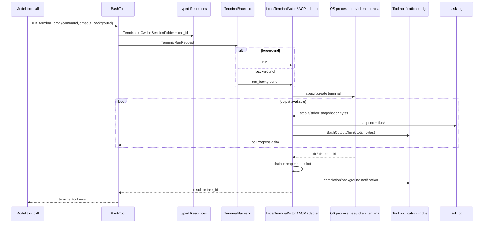
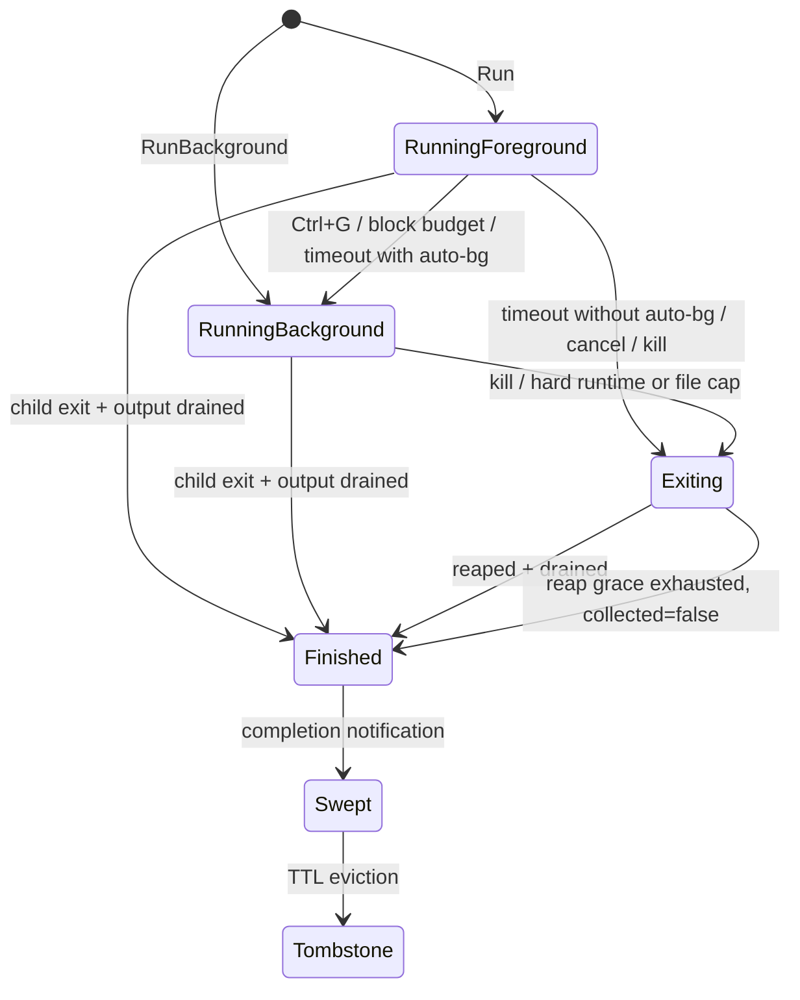

# 源码精读：终端命令、后台任务与进程树生命周期

模型调用 Bash 工具时，看到的只是 command、timeout 和最终输出；运行时实际要解决的是另一组问题：命令在哪个 backend 执行，stdout 如何流式上报又不撑爆内存，前台任务何时转后台，取消是否杀掉整个进程树，进程退出后谁负责 drain、reap、落盘和通知。

本文从 `BashTool` 追到 `TerminalBackend`，再分别进入本地 Actor 和 ACP 远端 terminal，建立一条完整的进程生命周期。

## 1. 一条命令经过哪些层



[`implementations/grok_build/bash/mod.rs`](../../crates/codegen/xai-grok-tools/src/implementations/grok_build/bash/mod.rs) 是模型协议到执行协议的 adapter。它负责参数解析、权限前后的工具语义、输出格式和 progress stream；它不应该自己持有 `tokio::process::Child`。

真正的执行能力从 typed `Resources` 中取出 `Terminal(Arc<dyn TerminalBackend>)`。同一个 Bash tool 因此可以在本机 Actor、ACP client terminal 或其它 backend 上运行，而不改变模型可见 schema。

## 2. `TerminalRunRequest` 是边界对象

[`computer/types.rs`](../../crates/codegen/xai-grok-tools/src/computer/types.rs) 的 request 不只包含 command：

```rust
pub struct TerminalRunRequest {
    pub command: String,
    pub working_directory: PathBuf,
    pub env: HashMap<String, String>,
    pub timeout: Duration,
    pub output_byte_limit: usize,
    pub output_file: PathBuf,
    pub notification_handle: ToolNotificationHandle,
    pub tool_call_id: String,
    pub display_command: Option<String>,
    pub auto_background_on_timeout: bool,
    pub foreground_block_budget: Option<Duration>,
    pub kind: TaskKind,
    pub owner_session_id: Option<String>,
    pub description: Option<String>,
}
```

这些字段分别服务不同 owner：

| 字段组 | owner/用途 |
|---|---|
| command/cwd/env | process spawn 与 shell state |
| timeout/background budget | terminal lifecycle policy |
| output limit/file | 内存投影与 durable log |
| notification/call ID | 工具 stream 和 UI correlation |
| display command | 隐藏 sandbox/isolation wrapper，保留用户语义 |
| task kind/owner session | monitor 分流与 scoped teardown |

把 `owner_session_id` 放进执行请求很关键。共享 backend 可能同时运行 parent、child 和 sibling session 的任务；“kill all”若只按 backend 全局执行，会跨 session 杀进程。

## 3. `TerminalBackend` 统一语义，不统一实现细节

trait 的主要操作是：

```text
run(request)                     -> foreground result
run_background(request)          -> task_id + output_file
get_task(task_id)                -> snapshot
wait_for_completion(task_id)     -> snapshot or timeout snapshot
kill_task(task_id)               -> killed / exited / missing
list_tasks()
kill_foreground_commands()
kill_*_by_owner(session_id)
```

返回值 [`TaskSnapshot`](../../crates/codegen/xai-grok-tools/src/computer/types.rs) 是 local/remote 共用的观察协议。`completed`、`exit_code`、`signal`、`truncated`、`output_total_bytes` 和 `output_file` 必须表达事实，而不是 UI 文案。

这里需要区分四件事：

- exit 已决定：观察到正常退出，或 runtime 已因 timeout/kill 进入退出路径；
- output 已收齐：继承 pipe 的 descendant 可能仍让 EOF 延迟；
- task 已完成：运行时已经决定不会再追加有效输出，可以 resolve waiter 和发 terminal notification。
- child 已 collected：`wait`/`try_wait` 已回收进程，不再有 zombie/PID reuse 风险。

四者不能用一个 `bool` 替代。

## 4. 本地 backend 为什么使用 Actor

[`computer/local/terminal.rs`](../../crates/codegen/xai-grok-tools/src/computer/local/terminal.rs) 把所有可变状态放进 `LocalTerminalActor`。handle 只通过 bounded `mpsc` 发送 `TerminalCommand`，需要结果的请求带 oneshot reply。

```text
TerminalCommand::Run
TerminalCommand::RunBackground
TerminalCommand::GetTask
TerminalCommand::Kill
TerminalCommand::BackgroundForeground
TerminalCommand::WaitForCompletion
TerminalCommand::KillForegroundCommands(ByOwner)
TerminalCommand::KillTasksByOwner
TerminalCommand::ReparentNotifications
```

Actor loop 使用 biased `tokio::select!`：cancel 和 command 分支优先于 100ms maintenance tick。这样一次慢 drain 不会让 Ctrl+C 长时间排在轮询之后。

```rust
tokio::select! {
    biased;
    _ = cancel_token.cancelled() => shutdown_all(),
    cmd = cmd_rx.recv() => handle_command(cmd),
    _ = ticker.tick(), if !processes.is_empty() => poll_all_processes(),
}
```

空闲时禁用 ticker，避免每个打开的 session 每秒无意义唤醒十次。这个小细节反映了 Actor 的成本模型：mailbox 串行化降低了锁复杂度，但每个 actor 的周期 timer 仍可能形成系统级 wakeup 开销。

## 5. Spawn：进程不是一个 PID

前台 `handle_run` 的主路径是：

```text
spawn_command
  -> detach from controlling TTY
  -> apply env / restore shell snapshot
  -> pipe stdout + stderr
  -> attach ProcessGroup / Job Object
  -> enroll ProcessScope
  -> open output file
  -> insert ProcessState(Foreground)
  -> send initial empty output notification
```

初始空 notification 让 Pager 在命令尚未产生输出时也能显示 running/timer 状态。

### 5.1 为什么必须管理进程树

shell 命令可能继续派生：

```bash
sh -c 'server & worker & wait'
```

只 kill shell leader 会留下 server/worker。Unix backend 把 child 放入 process group，teardown 使用 group signal；Windows 使用 Job Object。`ProcessScope` 还保存 group 的弱引用，使 TUI 全局退出路径在 terminal actor 没机会正常收尾时仍能清理进程树。

Actor 在 child 被 reap 后及时释放 Unix group 的强引用。否则稍后 `kill_all` 可能对已经被系统复用的旧 PID/PGID 发信号。这是典型的 ABA/PID reuse 风险：数值 ID 相同，不代表仍是同一个进程实体。

### 5.2 detached 不等于 background

`detach_from_tty` 处理 controlling terminal 和 signal 继承；`BackgroundStatus` 则表示 Agent turn 是否等待结果。两者是不同维度：一个 foreground tool command 也会从宿主 TTY detach，但其 oneshot waiter 仍阻塞当前工具调用。

## 6. Persistent shell：跨命令保留状态而不保留一个交互 shell

本地 backend 可在每次命令前恢复 shell snapshot，并在 fd 4 收集新的 state dump：

```text
previous snapshot --fd 3--> child shell
user command executes
updated cwd/env/aliases --fd 4--> state_dump task
```

已完成的 foreground command 才能更新 canonical shell state；background task 不能在任意未来时刻偷偷改变下一条命令的 cwd。actor 也不能跨 `.await` 同时借用 process map 和 shell state，因此先取出 dump handle，再更新 state。

若记录的 cwd 已被删除，backend 回退到 request cwd，并把 warning 写入命令输出。直接以失效 cwd spawn 只会得到难以解释的 IO error。

ACP/remote backend 不保证这套 snapshot 语义，所以 Bash 文档只承诺“是否持久取决于 backend”。trait 抽象的是执行能力，不应伪造所有实现都具有相同 shell internals。

## 7. 输出的三种表示

同一条命令输出同时存在三种表示：

| 表示 | 容量 | 用途 |
|---|---|---|
| `output_buffer` + `front_buffer` | `output_byte_limit` 附近 | tool result / snapshot 的头尾投影 |
| `output_file` | 运行中持续写，另有硬上限 | 后续 `read_file`、task output 和恢复 |
| `BashOutputChunk` | 约 100ms 一批，单 progress 有上限 | UI 增量显示和工具流 |

Actor 每个 tick 非阻塞读取当前可用的 stdout、stderr，合并后一次写文件并 flush。`total_bytes` 单调递增，是 progress cursor 的权威值；不能用当前 buffer length，因为 buffer 截断后长度不再增长。

[`BashTool`](../../crates/codegen/xai-grok-tools/src/implementations/grok_build/bash/mod.rs) 通过 `stream_chunk` 把 cumulative notification 转成 append delta：

```text
backend cumulative output + total_bytes
               |
               v
cursor(last_total) -> only new suffix -> ToolProgress
```

最终 Complete/Timeout/Backgrounded notification 也携带 `BashNotificationBase`。工具流必须再折叠一次最终 base，因为进程退出后的 drain 可能收到了最后一个 periodic chunk 之后才出现的字节。

### 7.1 两级截断解决不同风险

- 内存截断：保留头尾，让模型看到命令起因和最终错误；完整数据仍在文件。
- output file cap：防止 `yes` 或 runaway logger 填满磁盘；超过上限需要终止进程。
- 完成后 retained file cap：避免以后读取 snapshot 时物化数 GB 内容。

`truncated` 表示 snapshot 不是全量，并不表示数据一定丢失；调用方还要检查 `output_file`。只有文件也被 cap 或 backend 无法完整镜像时，才是不可恢复的截断。

## 8. 前台、显式后台与自动后台

`ProcessState` 用正交的 lifecycle 和 background status 表达状态：



自动后台有两个 timer：

- `foreground_block_budget`：默认短预算，只决定“不再阻塞 turn”，绝不杀进程；
- request `timeout`：auto-bg 开启时也转后台，关闭时发送终止信号。

因此 `timeout` 结果不能只用 `timed_out: bool` 理解。命令可能“前台等待超时但进程仍正常在后台运行”，此时 terminal result 的 signal 是 `auto_backgrounded`，并返回可供 `get_task_output`/`kill_terminal_command` 使用的 task ID。

`transition_to_background` 还要 resolve 原 foreground waiter、登记 task 语义并发 Backgrounded notification；漏掉任一步都会产生“模型以为结束、进程仍跑但没有 task ID”的孤儿任务。

## 9. Completion waiter 与 auto-wake

`wait_for_completion(task_id, timeout)` 不应通过 sleep 轮询工具层。Actor 注册带 deadline 的 waiter：

- task 已完成：立即返回 snapshot；
- task 运行中：保存 oneshot；
- deadline 到：返回当时 snapshot，但 task 继续运行；
- caller 被取消：oneshot receiver drop。

`block_waited` 用来防止重复唤醒：如果阻塞调用者已直接拿到完成结果，后台 completion notification 不应再合成一次“任务完成” prompt。

但若所有 receiver 因 Ctrl+C 被 drop，模型实际上没有看到结果。poll sweep 检查 reply 是否成功投递；无人收到时清除 `block_waited`，保留后续 auto-wake。这里“send 返回 Err”是业务证据，不只是日志噪声。

类似地，显式 kill 先标记 `explicitly_killed`，再发信号。模型已从 kill tool 得到结果，后台 bridge 不应重复唤醒。

## 10. Exit、drain、kill 与 reap

[`lifecycle.rs`](../../crates/codegen/xai-grok-tools/src/computer/local/lifecycle.rs) 把过程状态分为 `Running`、`Exiting`、`Finished`、`Swept`。其中：

```text
has_exited = 已有退出状态或终止决定
is_complete = output 已固定，可回答 waiter
is_settled = complete 且 child 已被 wait/try_wait 回收
```

正常退出后仍要 drain stdout/stderr。一个 descendant 若继承 pipe 却继续存活，读端可能永远等不到 EOF，因此有 `DRAIN_TIMEOUT`。

显式 `kill_task` 采用同步两阶段策略，确保 API 返回时尽量已经杀死进程树：

```text
SIGTERM process group
  -> 1s grace period
  -> SIGKILL process group
  -> try_wait/reap
  -> drain available output
```

timeout、后台最长运行时间和文件上限走异步路径：先发送 SIGTERM 并标记 `Exiting`，后续 poll tick 若仍存活就升级 SIGKILL；`REAP_GRACE` 后可把现有输出固定为 `Finished { collected: false }`，但 poll 仍会继续尝试回收 child。`ABANDONED` 是 collection 证据值，不是独立的 lifecycle enum variant。

`JoinHandle::abort` 或 drop tool future 都不能代替这条协议。future 停止轮询不会自动杀 detached process tree，也不会保证 child 被 wait/reap。

Actor loop biased command branch、Session cancel 的 `kill_foreground_commands` 和全局 `ProcessScope` 是三层防线：正常 turn 取消、session teardown、宿主异常退出分别有 owner。

## 11. 完成后的 sweep 与 tombstone

background task 完成后，actor 先：

1. 标记 lifecycle swept 并确定 end time；
2. 从 output file 构建最终 snapshot；
3. 无条件发 task-complete notification，供 Pager、持久化和 reservation bookkeeping 使用；
4. TTL 后移除 `ProcessState` 的大 buffer；
5. 保存最多固定数量的 metadata-only tombstone。

tombstone 让晚到的 `get_task(task_id)` 仍能回答 exit code 和完成状态，但输出字段为空、`truncated=true`，完整内容需要从 log 读取。这是 bounded metadata cache，而不是第二份日志存储。

## 12. ACP remote terminal 的不同生命周期

[`terminal/adapter.rs`](../../crates/codegen/xai-grok-shell/src/terminal/adapter.rs) 实现同一个 `TerminalBackend`，但真实进程由 ACP client 持有：

```text
CreateTerminalRequest
  -> TerminalOutputRequest snapshots
  -> WaitForTerminalExitRequest
  -> final TerminalOutputRequest
  -> ReleaseTerminalRequest
```

remote backend 无法直接 `killpg`，必须调用 ACP terminal kill/release 协议；也不一定能返回本地 PID。

[`exit_watcher.rs`](../../crates/codegen/xai-grok-shell/src/terminal/exit_watcher.rs) 同时等待 exit RPC 并每 250ms 拉 output。wait RPC 失败时会继续 polling；连续约 30 秒无法访问 gateway 后，以 `gateway-lost` terminal 状态完成，避免 task 永久悬挂。

ACP `terminal/output` 是累计快照，而且 client buffer 可能滚动。[`output_recorder.rs`](../../crates/codegen/xai-grok-shell/src/terminal/output_recorder.rs) 不能简单执行 `current.strip_prefix(last)`；滚动后它用 KMP 找 `last` 后缀与 `current` 前缀的最大重叠，只追加新 suffix。

```text
last    = ... line2\nline3\n
current =      line3\nline4\n
overlap =      line3\n
append  =             line4\n
```

这是一种 best-effort stream reconstruction。重复文本可能产生过度匹配，所以源码明确把精确 delta notification 作为更理想的协议；adapter 不能声称重建结果在所有内容下绝对无损。

不论 task map 中是否还存在 entry，`complete_and_release` 都尝试 release client terminal，避免远端资源泄漏。

## 13. Session resume 与“仍在运行”的事实边界

session 关闭时，某些 background task 会被允许继续。运行时把最小 manifest 写入 session 目录：task ID、command/display command、output file、start time、cwd 和 kind。

resume 时 manifest 被读取并删除，再生成 system reminder 告诉模型这些任务“可能仍在运行”。措辞必须是 may：manifest 是上次关闭时的事实，不是当前进程存活探针。模型应通过 task output 或其它观察重新确认。

这也是 event sourcing 中 snapshot 的边界：snapshot 描述过去状态，恢复后必须通过现实世界 reconciliation 才能成为当前事实。

## 14. 理论视角：结构化并发与资源所有权

理想的 structured concurrency 要求子任务生命周期不超过 parent scope。但后台命令有意逃离当前 tool future，因此必须建立新的显式 parent：

```text
foreground command parent = current tool/turn + session ProcessScope
background command parent = terminal actor + owning session + global ProcessScope
ACP command parent        = remote client terminal + adapter tracking entry
```

一旦允许任务 escape，就要同时提供：稳定 ID、查询、取消、完成通知、持久输出、恢复提示和最终资源回收。只实现 `spawn` + task ID，不是完整的后台任务抽象。

另一个核心原则是 single writer：local actor 是 `ProcessState` 的唯一写 owner。UI、Bash tool、kill tool 和 task-output tool 都通过消息/trait 观察或请求 mutation，避免同时 wait child、读 pipe 和发 signal 的竞态。

## 15. 调试路线

| 症状 | 先看 | 关键字段/状态 |
|---|---|---|
| 有 PID 但没有 tool progress | actor tick、notification handle、call ID | `total_bytes` 与 `last_notified_total` |
| 输出重复 | local cumulative-to-delta 或 ACP overlap | cursor、snapshot rolling、KMP overlap |
| 最后一段输出缺失 | exit 后 drain 和 final base folding | terminal notification `total_bytes` |
| timeout 后命令仍运行 | 是否开启 auto-background | signal、task ID、background reason |
| Ctrl+C 后 descendant 仍在 | group enrollment 和 owner-scoped kill | PGID/Job Object、ProcessScope |
| task 完成却没唤醒 Agent | `block_waited` / `explicitly_killed` | oneshot send 是否成功 |
| task 查不到但 log 存在 | TTL eviction/tombstone cap | output_file、completed snapshot |
| remote terminal 泄漏 | exit watcher terminal path | final output fetch、release RPC |
| resumed reminder 与现实不符 | manifest 只代表旧快照 | 重新查询 task/process |

## 16. 测试与贡献路线

推荐阅读顺序：

1. [`computer/types.rs`](../../crates/codegen/xai-grok-tools/src/computer/types.rs)：先固定 backend 契约。
2. [`bash/mod.rs`](../../crates/codegen/xai-grok-tools/src/implementations/grok_build/bash/mod.rs)：看工具参数、stream 和 terminal result。
3. [`computer/local/terminal.rs`](../../crates/codegen/xai-grok-tools/src/computer/local/terminal.rs)：追 Actor command、spawn、poll、transition 和 sweep。
4. [`lifecycle.rs`](../../crates/codegen/xai-grok-tools/src/computer/local/lifecycle.rs)：明确 exited/complete/settled。
5. [`terminal/adapter.rs`](../../crates/codegen/xai-grok-shell/src/terminal/adapter.rs)：对照 ACP backend。
6. [`exit_watcher.rs`](../../crates/codegen/xai-grok-shell/src/terminal/exit_watcher.rs) 与 [`output_recorder.rs`](../../crates/codegen/xai-grok-shell/src/terminal/output_recorder.rs)：理解远端 exit 和累计输出重建。

改动时按风险选测试：

| 改动 | 最小证据 |
|---|---|
| 输出截断/stream delta | pure buffer tests + final total bytes |
| foreground/background transition | actor test，断言 waiter、task ID、进程仍活着 |
| kill/reap | 真进程测试，包含 grandchild，不只 mock PID |
| owner scoped teardown | parent/child/sibling 三 session 隔离测试 |
| ACP polling/release | fake gateway，覆盖 wait error、poll error 和 release |
| Pager 可见状态 | PTY E2E/snapshot，确认 running 到 terminal 的画面 |

真进程测试必须有 bounded timeout 和 teardown guard。测试失败时不能留下 server 或 grandchild 污染后续用例。

## 17. 阅读练习

1. 解释 `exit decided`、`output final`、`child collected`、`task swept` 四个事件为何不能合并。
2. 构造一个 stdout buffer 滚动的例子，手算 `OutputRecorder` 应追加的 suffix。
3. 为什么取消 `BashTool::run` future 后仍必须调用 `kill_foreground_commands`？
4. 设计一个 parent、subagent、sibling 共用 backend 的测试，证明 scoped kill 不会越权。
5. 如果新增 WebSocket terminal backend，列出它必须实现的 terminal、output、exit、kill、release 和 reconnect 证据。
