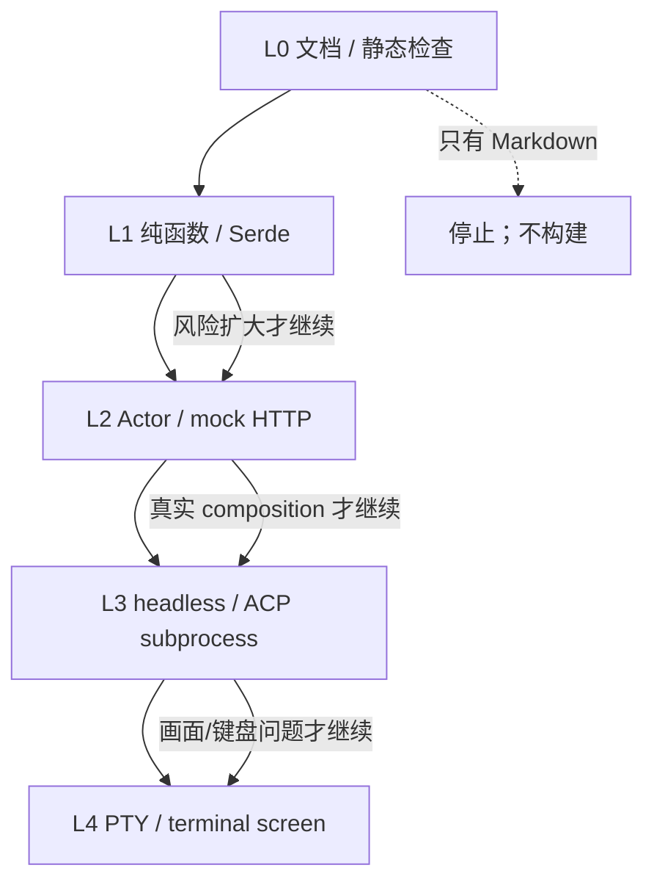
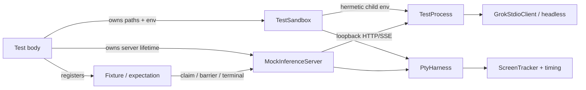
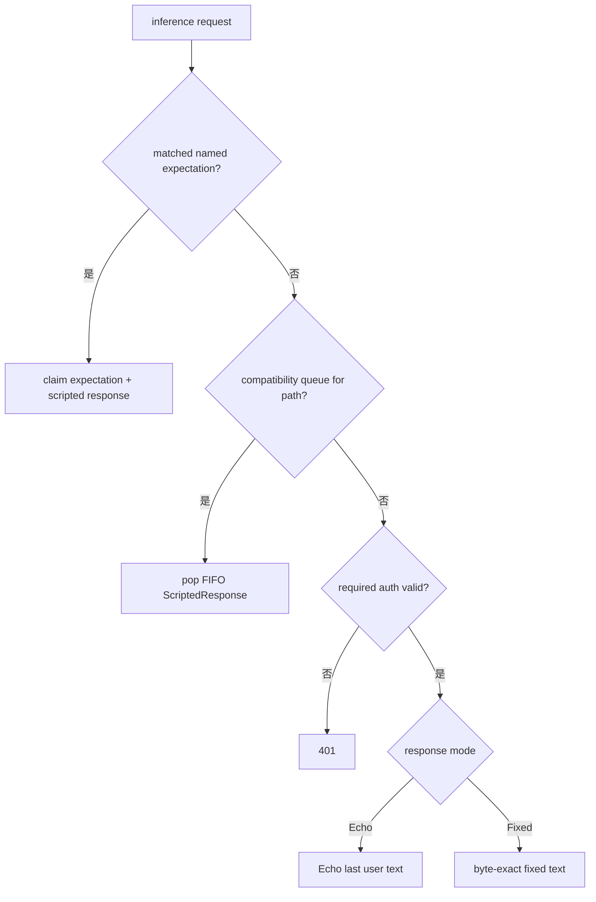
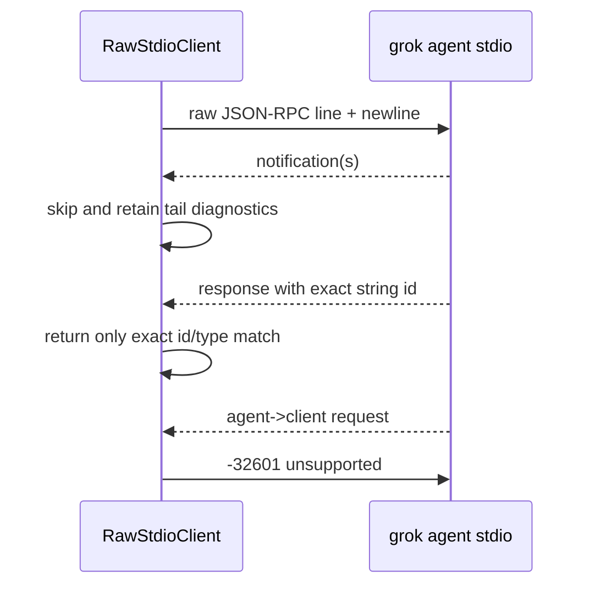

# 源码精读：测试、Fixture 与进程 Harness 架构

在 Agent runtime 中，“写一个测试”不只是构造输入并 `assert_eq!`。一条用户消息会穿过配置、临时目录、HTTP streaming、Actor mailbox、ACP、子进程、终端控制序列和持久化文件。若测试没有明确这些资源由谁拥有，它可能：

- 无意中使用开发者真实的 `HOME`、API key、leader socket 或代理；
- 依赖 `sleep`，在 CI 偶发失败；
- 只杀掉直接 child，却留下 session/leader/PTY 后代；
- 只验证最终文本，漏掉重复 request、错误 header 或未 flush 的 state；
- 为了一个 Markdown 修改触发 `grok_binary()`，从而开始不必要的二进制构建。

本项目把这些问题集中在 `xai-grok-test-support` 和 `xai-grok-pager-pty-harness` 中处理。本文解释它们的**资源 owner、同步协议和适用边界**。它补充 [contributor-workflow.md](./contributor-workflow.md) 的“应该测什么”，重点回答“fixture 为什么可靠、测试进程如何收尾、该选哪一种 driver”。

核心源码：

- `crates/codegen/xai-grok-test-support/src/{sandbox,process,mock_server,inference_override,scripted,sse}.rs`
- `crates/codegen/xai-grok-test-support/src/{acp_client,headless,env}.rs`
- `crates/codegen/xai-grok-pager-pty-harness/src/{lib,pty,content,screen,timing}.rs`
- `crates/codegen/xai-grok-sampler/tests/test_actor.rs`
- `crates/codegen/xai-grok-shell/tests/` 和 `src/session/acp_session_tests/`

---

## 1. 先把“测试通过”拆成证据层

测试数量不是证据。先问本次改动需要证明哪一个层次：

| 层次 | 证明的事实 | 合适的基础设施 | 不能证明 |
|---|---|---|---|
| L0 文档/静态 | 路径、链接、格式、描述是否一致 | `rg`、链接检查、`git diff --check` | Rust 是否编译、行为是否运行 |
| L1 纯逻辑 | 输入到输出的分类、Serde、边界和不变量 | 模块内 `#[cfg(test)]`、fixture bytes | actor 排队、网络、子进程 |
| L2 Actor/组件 | channel 顺序、retry、取消、状态 mutation | Tokio test、mock router、expectation | CLI composition、真实协议管道 |
| L3 协议/进程 | binary 的 env、ACP/headless wire、storage 连接 | `TestSandbox`、`TestProcess`、`GrokStdioClient` | 真实终端绘制和平台体验 |
| L4 终端体验 | key、resize、ANSI、scrollback、screen layout | PTY harness、`ScreenTracker`、脚本 scenario | 模型真实质量、生产网络 |



每升一级都会增加启动、并发、平台和清理成本。正确目标不是“把所有测试跑一遍”，而是找到能否证伪当前改动的最低层，并只在存在跨层风险时向上扩大。

---

## 2. Harness 的资源所有权图

测试支持 crate 的关键设计是把不同资源交给不同 owner：



这不是装饰性封装。以下边界不能互换：

| 资源 | owner | 不应该由谁暗中拥有 |
|---|---|---|
| HOME、GROK_HOME、workspace、TMPDIR、Git fixture | `TestSandbox` | 进程全局 `std::env` 或当前仓库 cwd |
| inference/settings/storage HTTP | `MockInferenceServer` | 真实线上 endpoint 或临时手写 router |
| child + descendant 退出、stdout/stderr tail | `TestProcess` / `TestProcessTree` | 随手 `tokio::process::Command` |
| typed ACP 交互 | `GrokStdioClient` | 直接拼 JSON，除非专门测 raw wire |
| escaped method/string ID 等非标准 wire | `RawStdioClient` | typed client 的错误转换层 |
| PTY key、resize、终端状态 | `PtyHarness` / `PtyController` | 普通 stdout capture |
| request 到达、terminal barrier、完成 | `InferenceExpectation` | 任意时长的 sleep |

如果一个测试把其中两类资源绕开，必须写清为什么。典型例外是 `xai-grok-sampler/tests/test_actor.rs`：它自身的 Axum router 专门构造 stall/conditional fixture，适合只测 sampler actor；它不需要启动完整 grok binary。

---

## 3. `TestSandbox`：让 child 没有环境遗产

### 3.1 它拥有的路径

`TestSandbox::build()` 创建一棵 temp tree：

```text
<temp root>/
  home/                 -> HOME / USERPROFILE
    .grok/              -> GROK_HOME
  workspace/            -> child cwd；可选 Git fixture
  tmp/                  -> TMPDIR / TMP / TEMP
```

默认 workspace 不是 Git 仓库；`TestSandbox::builder().git().build()` 才会初始化 Git、配置测试 user、写入并提交 `README.md`。因此一个测试若依赖 Git status、worktree、fork 或 hooks，应该显式选择 `.git()`，不要从开发者仓库的 `.git` 借状态。

### 3.2 child env 不是继承后再覆盖

关键点在 `apply_to_tokio_command` / `apply_to_std_command`：child 调用 `env_clear()`，再注入稳定排序的 sandbox env。它不是“继承父环境然后删几个变量”。

```rust
let sandbox = TestSandbox::builder()
    .mock_url(server.url())
    .git()
    .build();

let mut command = tokio::process::Command::new(grok_binary());
sandbox.apply_to_tokio_command(&mut command);
command.current_dir(sandbox.workspace());
```

baseline 只保留最少的平台变量，并设置：

- `HOME`、`USERPROFILE`、`GROK_HOME`、`TMPDIR`、`TMP`、`TEMP`；
- loopback `NO_PROXY` / `no_proxy`；
- 非交互 Git、pager 和 credential-prompt 抑制；
- telemetry、feedback、trace upload、instrumentation、updater、prompt suggestion 等 kill switch；
- 没有 ambient leader socket、代理或真实用户配置。

`mock_url(url)` 会把 grok API、models、feedback、trace upload、managed config、web、conversation 等 endpoint 都指向同一个 loopback server，并安装测试 key。这样一个“模型测试”不会意外向某个辅助 endpoint 发真实网络请求。

### 3.3 运行时 override 的正确位置

builder 只负责构造期选项（mock URL、Git）。特定 case 用：

```rust
sandbox.set_env("GROK_FEATURE_X", "1");
sandbox.remove_env("XAI_API_KEY");
sandbox.extend_env([("TERM_PROGRAM", "TestTerminal")]);
```

它们在 baseline 后应用，最后一项获胜。不要为了一个测试调用进程级 `set_var`：Rust 2024 下它是 `unsafe`，并且并发测试会互相污染。

需要测试当前进程读取 env 的纯函数时，才使用 `EnvGuard`，并且调用点必须标记 `#[serial_test::serial]`：

```rust
#[serial_test::serial]
#[test]
fn feature_is_disabled_when_env_is_absent() {
    let _guard = EnvGuard::unset("GROK_FEATURE_X");
    assert!(!read_feature_flag());
} // Drop 恢复原值，即使断言 panic
```

### 3.4 诊断输出也是安全边界

sandbox 的 `diagnostic_summary()` 能打印 temp path 和已消毒的 loopback endpoint，但会隐藏 credential-like key/value、非 loopback endpoint、URL userinfo/query/fragment。`TestProcess` 捕获 child stderr 时也使用这份 redaction 列表。

测试失败日志会被 CI 保存；因此“只是测试里打出来的 token”仍然是泄漏。不要把 raw `Authorization` 或 sandbox env 整体放进 panic message。

---

## 4. `MockInferenceServer`：不是简单的 echo server

### 4.1 路由范围和 request log

`MockInferenceServer::start()` 在 `127.0.0.1:0` 监听，至少覆盖：

```text
POST /v1/chat/completions
POST /v1/responses
POST /v1/messages
GET  /v1/models
GET  /v1/settings
GET  /v1/user
POST /v1/storage
PUT  /v1/privacy/coding-data-retention
```

它记录 method、path、JSON body、authorization 和所有 header。`request_count()`、`request_bodies()`、`requests()`、`last_system_prompt()`、`storage_uploads()` 让测试能分别验证：

```text
请求是否真的发出
    != 请求 body/header 是否正确
    != streaming result 是否被 session/UI 消费
```

request log 默认最多保留 1024 条，超出后淘汰最老项。这对长期 soak test 很重要：fixture 本身不能无界占用内存。

### 4.2 响应选择的优先级

同一 endpoint 的响应并非只有 FIFO：



`expect_response` 是新测试优先选择的 API；`enqueue_response(path, ...)` 仍保留给 `/v1/settings` 等非 inference one-shot 或兼容场景。不要用全局 FIFO 试图表达“前台 turn 的第二次 sampling”，因为 title/classifier 等 auxiliary request 可能插队并偷走脚本。

### 4.3 三种模型 wire 格式

`sse.rs` 生成三个实际采样协议的 event 序列：

| 后端 | builder | 典型用途 |
|---|---|---|
| Chat Completions | `chat_completion_events` / `_exact` | `choices[].delta`、tool delta |
| Responses | `responses_api_events` / `_exact` | response items、reasoning、tool call |
| Messages | `messages_api_events` | content block、thinking/tool block |

普通 echo builder 为了读起来方便可能按词拆分、折叠 whitespace；如果被测对象必须逐字重建 Markdown、代码块或多行文本，则用 `_exact`：

```rust
server.expect_response(
    "exact markdown",
    InferenceRequestMatcher::foreground(InferenceEndpoint::Responses),
    responses_api_script_exact("line 1\n\n```rust\nlet x = 1;\n```", "test-model"),
);
```

这里的测试价值是 byte contract，不是文本语义。若只断言渲染后看起来差不多，连续空格、换行或 fenced code block 可能已经在 stream transform 中损坏。

### 4.4 `ScriptedResponse` 是数据，不是 handler

`scripted.rs` 把 HTTP 测试输入归一为：

```rust
pub struct ScriptedResponse {
    pub status: u16,
    pub headers: Vec<(String, String)>,
    pub body: ScriptedBody, // Json | Sse | Raw
}
```

- `Json`：错误 envelope、settings、普通 API response；
- `Sse`：带可选 `event:` 名称的 event 序列；
- `Raw`：故意构造 malformed frame、错误分隔符、截断 body；
- `set_chunk_delay`：让每个 stream chunk 可控地间隔；
- `hold_agent_completions`：在 terminal event 前等待，制造可观察的 in-flight 状态。

脚本在注册时做 status/header 校验；不要把“非法 header 直到 HTTP server 才报错”当作被测产品的错误。

---

## 5. `InferenceExpectation`：用状态机替代 `sleep`

### 5.1 它要解决的竞态

下面代码不可靠：

```rust
send_prompt();
tokio::time::sleep(Duration::from_millis(100)).await;
cancel_prompt();
```

100ms 后你不知道 request 是否已经到 server、SSE 是否已经开始、terminal 是否已经越过，还是 CI 只是更慢。更糟的是：一个 auxiliary request 可能让你看到“有 HTTP 了”，但用户 turn 还没有开始。

named expectation 的 matcher 同时包含 endpoint 和 request kind：

```rust
let mut turn = server.expect_response_blocked(
    "foreground turn",
    InferenceRequestMatcher::foreground(InferenceEndpoint::Responses),
    ScriptedResponse::sse(events),
);

send_prompt();
turn.wait_received().await; // server 已原子 claim 到正确前台请求
turn.wait_blocked().await;  // stream 已到 terminal barrier，但尚未结束
cancel_prompt();
turn.release();             // 放开 barrier；Drop 也会防止永久阻塞
```

内部阶段是：

```mermaid
stateDiagram-v2
    [*] --> Pending: register
    Pending --> Received: matching request atomically claims
    Received --> Blocked: reaches terminal barrier
    Blocked --> Satisfied: release + primary reaches terminal
    Received --> Satisfied: unblocked terminal
    Received --> [*]: primary cancelled before terminal
    Blocked --> [*]: handle drop releases; request may cancel
```



`wait_received`、`wait_blocked`、`wait_satisfied` 基于 `tokio::sync::watch`，不是 polling loop。timeout 仍可包在外层作为失败上限，但不能作为事件排序手段。

### 5.2 为什么要区分 foreground 和 auxiliary

`InferenceRequestKind::classify` 大致使用：

1. 非空 `x-grok-turn-idx` -> foreground；
2. 否则非空 `x-grok-req-id` -> auxiliary；
3. header 都没有时，两个及以上 tool 的兼容 heuristic -> foreground；
4. 其余 -> auxiliary。

这不是产品业务协议，而是 mock 对测试意图的保护：标题生成、模型分类、prompt suggestion 或辅助采样不能消费“用户主 turn 应返回 tool call”的 response。

### 5.3 重试、重复请求和 fingerprint

同一个有效 request 可能因 transport replay 出现重叠副本。`InferenceOverrides` 用 endpoint、kind、非空 `x-grok-req-id` 和序列化 body 构成 `ModelCallFingerprint`：

```text
同 fingerprint 且上一份仍 active
    -> replay 已 claim 的 response，不消费下一个 expectation

primary 到 terminal、所有 active copy 都结束
    -> expectation Satisfied

primary 在 terminal 前取消
    -> 不标记 Satisfied，也不保留 replay state
```

注意 tool-result follow-up 往往沿用 turn id，但 body 已改变；它应 claim 下一个 expectation，而不是被误判为同一次 retry。这种区分让 retry 测试能准确断言 request count 和顺序。

### 5.4 断言的正确粒度

结束时至少：

```rust
turn.assert_satisfied();
assert_eq!(server.request_count(), expected_count);
assert!(server.requests().iter().any(|r| r.header("x-grok-turn-idx").is_some()));
```

不要只断言 `captured_text()`。否则以下回归可能漏掉：

- auxiliary request 消费了脚本；
- 401 后额外重试；
- client 在 terminal 之前已经完成；
- body/context/tool schema 与预期不符。

---

## 6. `TestProcess`：子进程及其后代也必须有 owner

### 6.1 进程生命周期

`TestProcess::spawn` 把三件事绑定在一起：

```text
TestSandbox baseline env
  + detached child process/session group
  + stdin/stdout/stderr policy and bounded tails
  = one test-owned process lifecycle
```

Unix 下 child 建立自己的 session/process group，测试可在 reaping 前先清理 descendants；Windows 维持 `CREATE_NO_WINDOW`，Job attachment 是 best effort，诊断会保留 attachment failure。`TestProcessTree` 让 PTY 等保留具体 child handle 的代码也能获得同一套 descendant cleanup 语义。

不要写：

```rust
let child = Command::new("grok").spawn().await?;
// 测试结束时只 drop Child；后代可能继续运行
```

应使用 wrapper，令 test 在 deadline、panic 或 Drop 时仍能释放树。

### 6.2 deadline 和 output drain 是不同阶段

headless runner 的逻辑揭示了一个重要分离：

```text
60s scaled process deadline
  -> timeout 时 kill tree + wait
  -> 再给 stdout/stderr 2s drain budget
       -> 若 pipe 仍卡住，保留 bounded partial tail
```

process 已退出不代表 reader task 已经拿到全部 pipe bytes；反之，等待 reader 无界又会让测试挂住。因此 `HeadlessResult` 同时返回 `status`、`stdout`、`stderr`、`timed_out`、`elapsed`。排障时先分辨：

| 结果 | 意义 |
|---|---|
| `timed_out = true` | command 未在主 deadline 内完成 |
| 退出码非零 | 业务/配置/协议失败，读 sanitized stderr + mock request log |
| 退出成功但 partial tail | child 已结束，pipe drain 超时或读取失败 |
| status 成功 + request 断言失败 | composition 路径运行了，但 wire/runtime 行为错误 |

### 6.3 bounded tail 不是完整 transcript

`TestProcess` 捕获 stdout/stderr 的有界尾部，记录字节数、截断状态和 read error。它存在为了让失败诊断可读且不泄漏/耗尽内存，不能当作一份完整审计日志。需要完整产品 state 时，保留 borrowed sandbox 并检查其 `GROK_HOME` 下的 session/artifact。

### 6.4 `Drop` 是最后防线，不是主同步机制

`Drop` 会做 bounded best-effort kill/reap，但正常测试仍应显式：

```rust
let status = client.close().await?;
assert!(status.success());
```

原因：显式 close 让断言可以区分自然退出、TERM、hard kill 和退出码；只依赖 Drop 会把 cleanup failure 混入下一个测试，造成看似无关的 flaky case。

---

## 7. 三种真实产品 driver：headless、typed ACP、raw ACP

### 7.1 Headless：验证 CLI composition

`run_headless` 启动 `grok -p`，用 canonical sandbox 和 mock endpoint 收集 `HeadlessResult`：

```rust
let result = run_headless(
    &server,
    &["-p", "summarize this file"],
    sandbox.workspace(),
).await;

assert_headless_success(&result, "simple prompt", Some(&server));
assert!(result.stdout.contains("expected answer"));
```

它适合验证：CLI parsing、默认 config、binary startup、headless output、exit code。使用 `run_headless_in_sandbox_borrowed` 时 sandbox 不被 runner 消耗，测试能继续检查 state 文件或 Git workspace。

**注意**：`grok_binary()` 的解析顺序是 `GROK_BINARY` -> `CARGO_BIN_EXE_xai-grok-pager` -> 本地 `target/debug/xai-grok-pager`；最后一种在 binary 不存在时会调用 Cargo build。因此：

```text
只改 Markdown：不要调用 headless/ACP/PTY harness。
改 Rust 且需要 L3：先确认 CI/本地已有目标 binary，或明确把二进制构建作为验证成本。
```

这正是“文档改动不随意构建”的代码级原因，而不只是流程偏好。

### 7.2 `GrokStdioClient`：优先使用 typed ACP

`GrokStdioClient` 运行 `grok agent stdio`，使用 `agent-client-protocol` 类型驱动：

```text
spawn sandbox + TestProcess
  -> initialize/authenticate
  -> session/new or session/load
  -> PromptRequest
  -> notifications/captured text
  -> PromptResponse + close
```

它提供带诊断的 `initialize_with_timeout`、`create_session_with_timeout`、`prompt_with_timeout`、`load_session_with_timeout` 等 helper。它适合验证 ACP schema 的正常调用，而不是手写字符串 JSON。

### 7.3 `RawStdioClient`：只在 wire 的字节形状本身是被测对象时使用

有些兼容 case 无法由 typed ACP client 表示，例如：

- Foundation/Xcode 输出的 escaped-slash method，如 `"session\\/prompt"`；
- JSON-RPC string UUID ID，而非 typed client 常用的整数 ID；
- malformed/noncanonical JSON line。

`RawStdioClient` 逐行写入 stdin，并读取直到精确同类型的 response ID 返回。它会跳过 notification；若 agent 向 client 发 request，则回 `-32601`，防止没有 capability 的 raw client 让 turn 永久等待。



不要把 Raw client 当作普通 ACP 测试默认选择。typed API 的编译期字段检查是资产；只在要验证 raw bytes 时放弃它。

---

## 8. PTY Harness：测试“用户实际看到什么”

普通 process test 看到 stdout 字节，但不能验证终端会如何解释 cursor move、ANSI color、scroll region 或 resize。`xai-grok-pager-pty-harness` 分成五层：

```text
L1 pty       : portable-pty spawn / key injection / resize / exit
L2 screen    : alacritty_terminal virtual screen
L2 timing    : frame marker 解析和每帧耗时
L3 content   : MockInferenceServer + TestSandbox
scenario     : 名称化交互步骤、artifact、baseline
```

`PtyHarness::update` 接收到每个 PTY chunk 后，立刻同时喂给 `ScreenTracker` 和 `FrameTimingParser`。这保留 inter-chunk timing；若先把所有 bytes 拼起来再解析，流式性能和 render 闪烁证据都会丢失。

### 8.1 启动方式不能混用

| API | 用途 |
|---|---|
| `new_inherited_env` | terminal brand / shell probe 等明确需要继承 host env 的测试 |
| `new_in_sandbox` | 任意 content-backed pager launch 的基础 API |
| `spawn_with_content` | 最常见：`ContentController` 拥有 mock server + sandbox，再起 pager |
| `spawn_with_content_env_ops` | 需要明确 Set/Remove override，例如 OAuth 测试移除 `XAI_API_KEY` |

大多数产品内容测试必须用 sandbox API。继承 host env 可能带入真实 home、代理、TERM、leader 或 auth，产生无法复现的 screen 差异。

### 8.2 终端操作和可观察完成条件

`PtyController` 提供真实 key bytes、`SIGWINCH` resize、signal、bounded exit poll；`PtyHarness` 则提供面向产品的等待：

```rust
harness.inject_keys(b"explain this\r")?;
harness.wait_for_text("expected phrase", Duration::from_secs(10))?;
harness.wait_for_turn_idle(Duration::from_secs(10))?;
harness.quit()?;
```

等待条件是 screen 文字或显式 turn-idle predicate，不是“等 200ms 看看”。测试最小化时优先保留一个能说明用户可见状态的 predicate，再保留 server expectation 证明后台请求正确。

### 8.3 terminal query 不一定应该自动回答

真实 terminal 会回答 cursor position/device attribute query。harness 默认 `respond_to_queries = false`，让 XTVERSION 等 probe 测试能自己控制回复；minimal mode 的测试可开启它，避免 `ESC[6n` query 超时导致模式降级。

这是一种很重要的 fixture 原则：**模拟环境要可控，不要为了“更真实”自动吞掉被测协议的一半。**

### 8.4 scenario 和 artifact

`scripted.rs` 把 scenario 表示为 data：terminal 配置、workspace、environment、mock response、输入、鼠标、resize、截图/visual artifact 和预期结果。它既服务回归测试，也服务 benchmark 与本地复现。改 terminal 代码时，优先在现有 scenario 上追加一个最小步骤，不要建立只能在你机器上复现的手工脚本。

---

## 9. 异步测试的四个不变量

### 9.1 timeout 是上界，不是因果关系

正确：

```rust
expectation.wait_received().await;
// 此时 request 的 arrival 已由 server 状态证明
cancel_tx.send(()).unwrap();
```

允许的 timeout：

```rust
tokio::time::timeout(Duration::from_secs(20), client.prompt(...)).await
```

前者建立事件顺序，后者在死锁时失败。不能把后者替代前者。

### 9.2 每个 task 都需要可观察的终态

一个 test spawn 的 task 应至少满足其一：

- 返回的 `JoinHandle` 被 await/abort；
- future 在 owner actor / `LocalSet` 内随 owner drop；
- mock expectation 的 terminal phase 被观察；
- TestProcess/PTY owner 负责退出和 descendant cleanup。

“sender drop 了，应该会结束”不是测试证据。特别是 `spawn_local` 的 session test，应使用 `current_thread` runtime + `LocalSet`，保持生产中的 `!Send` actor 约束。

### 9.3 取消必须检查后续静默

取消 case 至少覆盖：

```text
cancel signal sent
  -> owner observes it
  -> in-flight stream/tool stops or drains according to contract
  -> no second completion/update
  -> mailbox/replay/persistence reaches defined terminal state
```

如果用 `expect_response_blocked`，可以把服务器停在 terminal 前，先发 cancel，再 release；这能区分“取消确实处理了”与“response 刚好自然结束”。

### 9.4 扩展 CI timeout，但不隐藏 bug

`scaled(Duration)` 会读取正整数 `GROK_TEST_TIMEOUT_SCALE`，默认 1。它供慢 runner 扩大同一份 timeout budget，而不是把超时删掉。任何新长时间测试仍需要明确的 completion predicate 和诊断输出；不要把 scale 当作生产 behavior 开关。

---

## 10. 从改动选择最小 fixture

| 改动 | 首选 fixture | 必须额外断言 | 不该先做 |
|---|---|---|---|
| SSE parser 保留换行 | `sse.rs` exact bytes | 解析后的 delta 顺序/内容 | 起完整 Pager PTY |
| retry 分类 | sampler unit/actor + expectation | request count、error kind、terminal result | 真实网络 |
| turn 取消 | blocked foreground expectation + session test | cancel 后没有二次 update | `sleep(100ms)` |
| prompt/system 组装 | Agent/ChatState test + request body | system、tool schema、user block 分离 | 只看最终 assistant text |
| ACP optional field | typed ACP fixture + raw client（如 wire bytes 特殊） | missing/unknown/old payload | 修改 UI 来兜底 |
| headless CLI flag | `run_headless_in_sandbox_borrowed` | exit code、stdout、server request、state artifact | PTY screenshot |
| UI scroll/resize/render | `PtyHarness` + screen predicate | raw output、frame timing 或 artifact | 普通 stdout test |
| storage/auth diagnostic | mock storage 401 + sandbox artifacts | uploaded path/size、redaction、retry budget | 连接真实 bucket |
| Markdown/doc 链接 | 静态链接检查 | `git diff --check` | 任何 Cargo harness |

一条测试可以跨多层，但需要把每个断言属于哪层写清。例如：server request count 是 wire 证据；`ChatState` snapshot 是 runtime 证据；PTY screen text 是产品体验证据。三者不相互替代。

---

## 11. 一个完整的、可审查的测试配方

以下伪代码不是要原样复制 API，而是展示 owner 的顺序：

```rust
#[tokio::test]
async fn cancelled_turn_does_not_start_a_second_sampling_request() {
    let server = MockInferenceServer::start().await.unwrap();
    let sandbox = TestSandbox::builder().mock_url(server.url()).git().build();

    let mut primary = server.expect_response_blocked(
        "first foreground sampling",
        InferenceRequestMatcher::foreground(InferenceEndpoint::Responses),
        ScriptedResponse::sse(first_turn_events()),
    );

    let mut client = GrokStdioClient::spawn_with_sandbox(&server, sandbox).await;
    client.initialize_with_timeout().await;
    let session = client.create_session_with_timeout(client.sandbox().workspace()).await;

    let prompt = client.prompt_with_timeout(&session, "change this");
    tokio::pin!(prompt);

    primary.wait_received().await;
    primary.wait_blocked().await;
    // 这里调用真实 ACP cancel API；省略具体 method。
    send_cancel(&client, &session).await;
    primary.release();

    let result = prompt.await;
    assert_cancelled_or_contractual_stop(result);
    primary.assert_satisfied();
    assert_eq!(server.request_count(), 1);
    client.close().await.unwrap();
}
```

这个结构可以回答 reviewer 的问题：

| 问题 | 证据 |
|---|---|
| 真实 binary/ACP 启动了吗？ | `GrokStdioClient` + `TestProcess` |
| 请求是否是用户前台 turn？ | typed foreground matcher |
| cancel 发生在 streaming 中间吗？ | terminal barrier 的 `wait_blocked` |
| 是否意外发起第二个 request？ | 精确 request count |
| child 是否有确定退出？ | 显式 `close()` |
| 是否污染开发者环境？ | `TestSandbox` |

若改动只在 `retry.rs` 的纯分类函数，这个配方就过度了；将它缩小为 L1 fixture 才是正确选择。

---

## 12. 常见失败的解读顺序

### 12.1 expectation 没有 `Received`

检查：

1. child 是否真正启动，读取 `process.diagnostic_summary()`；
2. sandbox 是否把所有 base URL 指向 mock；
3. 这是 foreground 还是 auxiliary，matcher 是否匹配 endpoint/kind；
4. 模型目录/settings 是否在 inference 前失败；
5. 不要立即把 timeout 加长。

### 12.2 `Received` 但没有 `Satisfied`

检查：

1. 是否注册了 blocked expectation 但忘了 `release()`；
2. primary 是否在 terminal 前被取消（这会刻意不满足）；
3. overlapping request 是否仍 active；
4. SSE 是否缺少 terminal event；
5. client 是否在 tool/permission/ACP request 上等待。

### 12.3 headless 成功但断言没有输出

检查：

1. stdout 和 stderr 是不同 product channel；
2. reader drain 是否只返回 partial tail；
3. agent 是否用了 structured/stream JSON 输出模式；
4. request log 是否显示模型真的被调用；
5. session state 是否在 borrowed sandbox 中存在。

### 12.4 PTY 看到乱码或找不到文字

检查：

1. 是 raw ANSI bytes 的问题，还是 `ScreenTracker` 的 terminal interpretation；
2. 是否要让 harness 回答 terminal query；
3. rows/cols 是否与 fixture 的 layout 假设一致；
4. child 是否已经退出但 status 仍 pending；
5. 保存 scenario artifact，再缩小 key/resize 序列。

### 12.5 只在 CI timeout

先看 timeout 的 phase：mock request 未到、request 已到但 terminal gate 未开、child 已退出但 drain 未完、PTY child/descendant 未 reaped。只有确定是共享 runner 慢，才使用 `GROK_TEST_TIMEOUT_SCALE`；不要把未知 deadlock 伪装成慢机器。

---

## 13. 新增 test helper 的贡献边界

### 13.1 先问：这是产品能力还是 test capability？

| 需求 | 放置位置 |
|---|---|
| 新模型 stream wire shape | `xai-grok-test-support::sse` + mock route + parser fixture |
| 特定 inference request 匹配 | `inference_override` 的 typed matcher/expectation |
| 新环境/文件隔离 | `TestSandbox`，并记录诊断 redaction |
| 新子进程 lifecycle 行为 | `TestProcess` / `TestProcessTree`，不改 production spawn 作为测试便利 |
| 新终端输入/屏幕现象 | PTY harness scenario/layer |
| 新的产品协议字段 | 生产 type/serializer first，再让 test support 驱动它 |

test support 是 product test 的工具，不应偷偷改变 production leader、startup 或 auth 语义。

### 13.2 新 mock response mode 的最小清单

1. 加私有 `ResponseMode` + setter；
2. 连接 Chat Completions、Responses、Messages 三个 inference handler；
3. 保持 named expectation > FIFO > auth > fallback 的优先级；
4. 写 HTTP round-trip 和 fallback 测试；
5. 不破坏 echo 的 bytes pin；
6. README 与 `src/` 同一提交更新。

### 13.3 新 expectation matcher 的最小清单

1. matcher 是 typed/narrow 的 endpoint + kind 语义，不是任意闭包；
2. claim 必须在单一 mutex 状态下原子完成；
3. 定义并测试 concurrent duplicate、auxiliary non-consumption、cancel、terminal barrier；
4. failure diagnostic 要包含 expectation name/state，不含 secret；
5. handle Drop 必须释放 barrier，避免测试 panic 后永久挂住。

### 13.4 文档改动的特殊规则

本专题和其它 `docs/` 修改只需要做静态验证：

```sh
git diff --check
# Markdown relative link check
# source-path existence check
```

不要因文档引入了 `run_headless` 或 `grok_binary` 的说明就真的调用它们。测试 helper 的二进制 fallback 会构建程序，这与“代码未改无需构建”的贡献准则相冲突。

---

## 14. 阅读与练习路线

### 练习 A：给一次 retry 写确定性测试

1. 先在 `xai-grok-sampler/tests/test_actor.rs` 找一个现有 500/429/401 case；
2. 判断只需 actor router，还是需要 `MockInferenceServer` 的 named expectation；
3. 用 request count 或 `wait_received` 证明第 N 次 attempt；
4. 写 terminal result 和 no-extra-request 断言；
5. 不用 wall-clock sleep。

### 练习 B：把一个 flaky headless test 变成 owner 明确的测试

将：

```rust
run_command();
sleep(Duration::from_secs(1)).await;
assert!(output.contains("done"));
```

改为：sandbox + mock expectation + `assert_headless_success` + request body/count + borrowed sandbox artifact 检查。解释每个 owner 的 Drop 顺序。

### 练习 C：选择 typed 还是 raw ACP

创建两个 fixture：

```text
正常 session/new + prompt  -> GrokStdioClient
escaped-slash method + UUID -> RawStdioClient
```

比较两者能证明的东西，并说明为何不能总是选 raw client。

### 练习 D：只在 UI 层复现的 bug

用 `ContentController` + `PtyHarness` 驱动 key、resize 和 streaming response；同时对 server expectation 和 screen predicate 断言。最后把 case 保存为 data-driven scenario，避免只能靠人工终端复现。

---

## 15. 源码地图

| 问题 | 入口 |
|---|---|
| 测试基础设施公开 API | `xai-grok-test-support/src/lib.rs`、`README.md` |
| 临时路径/env/Git/脱敏诊断 | `xai-grok-test-support/src/sandbox.rs` |
| 进程树、deadline、tail、reap | `xai-grok-test-support/src/process.rs` |
| binary resolution 和 `EnvGuard` | `xai-grok-test-support/src/env.rs` |
| inference endpoints/request log | `xai-grok-test-support/src/mock_server.rs` |
| named request matcher/barrier/replay | `xai-grok-test-support/src/inference_override.rs` |
| raw/JSON/SSE script response | `xai-grok-test-support/src/scripted.rs` |
| 三种模型 SSE 生成器 | `xai-grok-test-support/src/sse.rs` |
| headless command runner | `xai-grok-test-support/src/headless.rs` |
| typed/raw ACP stdio client | `xai-grok-test-support/src/acp_client.rs` |
| sampler actor 专用测试 | `xai-grok-sampler/tests/test_actor.rs` |
| PTY layers、screen、timing | `xai-grok-pager-pty-harness/src/{lib,pty,screen,timing}.rs` |
| scenario data 和 visual artifact | `xai-grok-pager-pty-harness/src/scripted.rs` |

---

## 16. 结论：fixture 是运行时模型的缩小版

一个好的 fixture 不会“伪造成功”，而是只控制测试需要的外部边界，并保留真实的产品路径：

```text
owned env/filesystem
  + deterministic network/stream
  + explicit actor/process lifecycle
  + observable terminal condition
  + bounded cleanup and redacted diagnostics
  = 可审查的 Agent runtime 证据
```

当你能解释每个临时目录、HTTP response、Tokio task、ACP client、PTY child 和 timeout 的 owner，就已经具备把复杂 Agent bug 缩小为一个稳定 patch 的能力。测试不是开发最后的绿灯，而是理解项目架构和保护贡献边界的主要工具。
