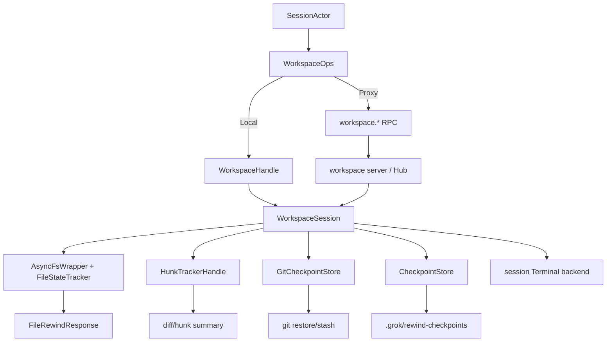
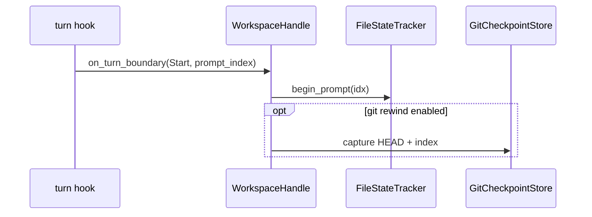
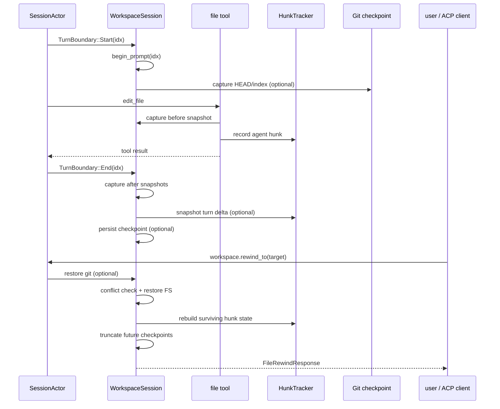

# 源码精读：Workspace Session、Rewind 与 Worktree 生命周期

编程 Agent 的“改文件”不是一次孤立的 `write()`。系统还要回答：这次修改属于哪一个 session/turn？用户能否在 rewind 时恢复？文件是否被用户在 Agent 之后改过？hunk/diff 如何出现在 UI？子代理应不应该在隔离 worktree 中运行？远程 workspace server 断线时，哪个进程负责清理？

本篇沿着 `xai-grok-workspace` 的代码回答这些问题。它补充 [permissions-and-sandbox.md](./permissions-and-sandbox.md) 的“能不能执行”部分，重点放在“执行后如何记录、恢复和隔离”。

## 1. 先画 owner 边界



| 对象 | 权威 owner | 不应该由谁复制 |
|---|---|---|
| workspace 的 session 绑定 | `WorkspaceHandle` 的 session map | shell 不应另外保存一份可调用 toolset |
| 当前 workspace 工具集 | `WorkspaceSession.inner` 中的 `FinalizedToolset` | UI/ACP client |
| 文件 rewind 点 | `FileStateTracker` | Pager scrollback、git status |
| hunk/diff 状态 | `HunkTrackerActor` | `FileStateTracker`、UI |
| git checkpoint | `GitCheckpointStore` | 文件快照模块 |
| durable checkpoint mirror | `CheckpointStore` | restore 逻辑本身 |
| 隔离目录 | `xai-fast-worktree` + workspace `worktree` | session 只持有路径和生命周期引用 |

`WorkspaceOps` 是调用方式的适配器，不是新的状态 owner。Local 模式直接调用 `WorkspaceHandle`，Proxy 模式序列化成 workspace RPC；两条路最终都要让 workspace session 持有 cwd、工具集和 tracking 状态。

## 2. Local 与 Proxy：同一语义的两种拓扑

```rust
pub enum WorkspaceOps {
    Local { handle: WorkspaceHandle },
    Proxy { client: WorkspaceClient },
}
```

### Local

Agent 与 workspace 在同一进程：

```text
SessionActor
  -> WorkspaceOps::Local
  -> WorkspaceHandle::session(session_id)
  -> WorkspaceSession::toolset().call(...)
```

`bind_local_session` 在 Agent 构建后创建或复用 workspace session，把 Agent 自己的 `HunkTrackerHandle` 装进去，再替换成 Agent 的 finalized toolset。这里有一个很容易引入资源 bug 的约束：

- 安装到 `WorkspaceSession` 的 toolset 使用 shell 自己的 terminal backend；
- `WorkspaceSession` 创建时生成的 backend 保持 idle，只作为 workspace teardown 的安全目标；
- 不能把外部拥有的 terminal backend 迁移到 session 字段，否则 `drop_session` 可能杀掉仍由 shell 共享的后台任务。

### Proxy

Agent 与 workspace server 分进程：

```text
SessionActor -> WorkspaceClient -> ToolHarness/WebSocket -> hub_server -> WorkspaceSession
```

Proxy 下 `call_tool` 需要先检查连接；断线返回 network error，不在 client 端假装执行。RPC handler 根据绑定的 session 选择 cwd、capability 和 toolset。添加 workspace RPC 时要同时确认 local `execute()` 和 proxy `METHOD`/wire type 是否保持同义。

## 3. WorkspaceSession 是 per-session 资源容器

`WorkspaceSession` 不只是 cwd：

| 字段 | 作用 |
|---|---|
| `session_id`, `cwd`, `session_env` | 路由、路径解析和子进程环境 |
| `capability_mode`, `depth`, `fork_budget` | 能力限制和子代理隔离预算 |
| `effective_tool_config`, `FinalizedToolset` | 当前可调用工具及其配置；在同一 `RwLock` 中原子替换 |
| `FileStateTracker` | prompt 级文件前后快照 |
| `HunkTrackerHandle` | diff/hunk 语义状态和摘要 |
| `GitCheckpointStore` | 每个 prompt 的 HEAD/staged state |
| `CheckpointStore` | checkpoint 的可选磁盘镜像 |
| `McpState`/bridges | session 生命周期内的 MCP client |
| terminal backend | persistent shell、background task registry |
| notification forwarder | 把 workspace 后台事件转成 session 可见通知 |

所有权意味着 teardown 必须是显式的。`drop_session`/evict 会停止 MCP、取消 hunk tracker、abort notification forwarder、关闭 terminal backend；不能依赖 `Arc` 最后一次释放的时机，因为 hub 可能还有其它 client 或 session。

## 4. Prompt 边界如何建立文件 rewind 点

### 4.1 开始一轮

Workspace hook 在 `TurnBoundary::Start { prompt_index: Some(idx) }` 上做两件事：

1. `FileStateTracker::begin_prompt(idx)` 建立空的 `RewindPoint`，并记录 current prompt；
2. 如果 `workspace_rewind_git` 开启，捕获当前 git HEAD 和 staged 状态到 `GitCheckpointStore`。



git capture 在 turn 开始而不是结束，因为结束时 Agent 可能已经改变 HEAD 或 index；失败不会伪造一个成功 checkpoint。

### 4.2 工具读/写前捕获 before snapshot

文件工具通过 `FileStateHandle` 调用 tracker。`capture_file_state` 的保护条件是：

- 只接受能相对于 session cwd 表示的路径；cwd 外的 `/etc/hosts` 或其它项目路径跳过；
- 没有 active prompt 时跳过，避免后台扫描变成一个可 rewind 的 Agent 修改；
- 读取当前内容（不存在表示 `None`），创建 `FileSnapshot`；
- `RewindPoint::add_snapshot` 使用 `or_insert`，同一 prompt 对同一文件只保存最早的 before 状态。

路径优先保存为 `RelPathBuf`，这样 session 从另一台机器或另一个 worktree 恢复时仍能相对 cwd 解析；旧 session 的绝对路径由 `FlexiblePath` 兼容读取。

### 4.3 结束一轮捕获 after snapshot

`FileStateTracker::end_prompt` 遍历本 prompt 捕获过的路径，读取当前内容并写入 `after_snapshots`。before/after 的用途不同：

```text
before snapshot = rewind 的目标内容
after snapshot  = 判断 Agent 写完后是否又被外部修改
```

如果 Agent 写 `a.rs` 后用户又在编辑器中改了它，rewind 不能静默覆盖用户修改，必须返回 `FileRewindConflict`。因此 after snapshot 不是冗余数据，而是保护用户数据的冲突检测基准。

## 5. Rewind 文件算法：先收集，再检查，再写回

`rewind_files` 的算法顺序是：

```text
points[prompt_index >= target]
  -> 每个文件取最早 before snapshot
  -> 读取 current 内容
  -> 与最后一个 after snapshot 比较
  -> 标记 clean / externally modified / created / deleted
  -> 写回 before 内容（None = 删除）
  -> 只有全部写回成功才 truncate points
```

冲突不会自动阻止写回：当前实现将冲突记录到 response，同时仍尝试恢复目标内容；真正的失败条件是文件读写错误。贡献者修改这个行为时要先确认 ACP/UI 对 `conflicts` 的呈现契约，否则“更安全”的修改可能让用户失去可见冲突信息。

用 [`mini_workspace_rewind.rs`](../rust-essentials/labs/async-demos/src/bin/mini_workspace_rewind.rs) 先观察这组容易混淆的状态转换：

```sh
cargo run --locked \
  --manifest-path docs/rust-essentials/labs/async-demos/Cargo.toml \
  --bin mini_workspace_rewind
```

内存 workspace 会断言权限拒绝发生在状态变化前、同轮同文件只保留最早 before、外部修改被报告但仍恢复 before，以及写回失败时 checkpoint 不 truncate。它不覆盖真实路径规范化、symlink、Git/hunk domain 或 proxy RPC；这些应留给本篇第 12 节的 focused fixtures。

`ConversationOnly` rewind 是另一个语义：它只退 conversation，不恢复文件。因此 tracker 会把被丢弃 prompt 的 file effects 合并到最后一个仍存活的 rewind point，保证未来的“文件 rewind”仍能撤销那些修改。不能简单删除 `target` 之后的快照。

## 6. Checkpoint 是多个 domain 的联合记录

```rust
pub struct RewindCheckpoint {
    pub prompt_index: usize,
    pub fs: RewindPoint,
    pub hunks: Option<HunkTurnDelta>,
}
```

它把三个可能独立开启的 domain 对齐到同一个 prompt index：

| domain | 开始/结束时机 | restore 动作 | 默认 gate |
|---|---|---|---|
| FS | before 工具操作 / turn end | 写回 before snapshot | 基础 rewind |
| git | prompt start 捕获 / rewind | stash live changes，再 soft reset/unstage，成功后 restage | `workspace_rewind_git` |
| hunk | turn end snapshot delta / rewind | 合并 `< target` 的文件 hunk state 并丢弃 `>= target` | `GROK_WORKSPACE_REWIND_HUNKS` |

### 6.1 结束顺序

`WorkspaceHandle::on_turn_boundary(End, Some(idx))` 依次：

1. `end_prompt` 写 FS after snapshots；
2. 开启 hunk 时 capture hunk delta；
3. 开启 durable 时 persist checkpoint；
4. 记录 domain-specific telemetry。

非 Completed turn 是否也 finalize，由 `workspace_rewind_all_outcomes` 控制。这样 cancel/error 后的部分写入仍可以被 rewind，但这是可配置的行为，不应在工具层重复实现。

### 6.2 用户 rewind 的跨 domain 顺序

```mermaid
flowchart TD
    R[workspace.rewind_to(target)] --> G{git enabled?}
    G -->|yes| GS[stash + reset --soft + unstage]
    G -->|no| F[rewind_files]
    GS --> F[rewind_files]
    F -->|失败| KEEP[保留 checkpoints，允许重试]
    F -->|成功| H{hunk enabled?}
    H -->|yes| HR[restore state from deltas < target]
    H -->|no| T[truncate git/hunk state]
    HR --> T
    T --> D{durable enabled?}
    D -->|yes| DT[truncate disk checkpoint files >= target]
    D -->|no| DONE[完成]
    DT --> DONE
```

git restore 先做 stash/reset，是为了让它的“live state changed” guard 看到真实工作树；FS restore 成功后才 restage git paths 并丢弃未来 checkpoint。FS 失败时保留所有 domain，避免一次磁盘错误让重试失去数据。

## 7. Durable checkpoint：镜像，不是恢复 owner

开启 `GROK_WORKSPACE_REWIND_DURABLE` 后，checkpoint 写到：

```text
<cwd>/.grok/rewind-checkpoints/<safe-session-id>/
  checkpoint-<prompt_index>.json
  .gitignore                  # 根目录用 *，不提交 blob
```

`CheckpointStore` 有三个关键性质：

1. **内存 cache 优先**：正常 get/restore 走 session 内的 tracker，不依赖磁盘；
2. **原子写入**：临时文件 + `sync_all` + rename，避免崩溃留下半个 JSON；
3. **有限保留**：默认每 session 64 个，超过上限删除最旧 index。

session id 来自 RPC，不能直接拼路径；store 会把它映射成安全且无碰撞的目录名，防止 `../../` 穿越。

恢复 session 时 store 可以从 rootfs snapshot 携带的 blob 重新 hydration，但它仍是 mirror：真正的 restore 由当前进程的 `FileStateTracker`/git/hunk domain 执行。贡献者不要把 disk JSON 当成独立的第四个权威状态源。

## 8. Hunk tracker 与用户可见 diff

文件 snapshot 只知道完整内容；hunk tracker 还维护：

- 文件当前的分段 diff/hunk；
- hunk id 与 prompt/turn 的归属；
- `FileAction`/`TurnAction`/`AllAction` 等用户选择；
- session summary 和 file summaries。

turn end 的 `snapshot_turn_delta(idx)` 只保存增量。rewind 时按 prompt 升序合并 `< target` 的 file state，最后清除不存在于重建 state 的 hunk ids。这样 UI 选择状态不会把已经 rewind 的 hunk 重新显示出来。

不要用 `git diff` 替代 hunk tracker：git 只能看到当前仓库状态，不能知道哪个 Agent turn 产生了哪一块，也不能表达一个未提交新文件的完整操作历史。

## 9. Worktree 创建：隔离不是复制 cwd 字符串

worktree 操作位于 [worktree/mod.rs](../../crates/codegen/xai-grok-workspace/src/worktree/mod.rs)，实际文件操作委托给 `xai-fast-worktree::WorktreeBuilder`。

### 9.1 请求含义

| 字段 | 语义 |
|---|---|
| `source_path` / `source_worktree_path` | 源仓库或源 worktree；先解析 main repo/root |
| `copy_mode` | `Dirty` 保留未提交变化，`Clean` 只取干净 tree |
| `worktree_type` | `Linked`、`Standalone`、`Git` checkout |
| `git_ref` | 可选 branch/tag/SHA；默认 source HEAD |
| `label` | 经过安全化和碰撞解决的目录名 |
| `session_id` | 关联创建进度、meta 和 dedup；不直接当路径片段 |
| cancellation token | 中途取消并清理 partial worktree |

### 9.2 类型解析和复制模式

```text
WorktreeCopyMode::Dirty -> PreserveWorkingTree
WorktreeCopyMode::Clean -> CleanAll
WorktreeType::Linked -> git linked worktree
WorktreeType::Standalone -> 独立 .git 目录（要求源 .git 是目录）
WorktreeType::Git -> GitCheckout
```

如果请求 `Standalone`，但 source 本身是 linked worktree（`.git` 是文件），实现会回退到 Linked 并记录 warning；不能假设请求字段就是最终创建模式。

创建是 blocking 的 Git/CoW 操作，包在 `spawn_blocking` 中；异步外层只负责取消、进度和通知。ignored files 默认跳过，可在创建完成后通过独立 background copy 复制，删除 worktree 时由 `BackgroundCopyContext` 取消对应任务。

### 9.3 防重复与 partial cleanup

`claim_worktree_in_progress(session_id)` 在进程内原子地去重并发创建；它不是跨进程锁，Proxy 模式的正确性不能依赖这个 marker。创建失败、panic 或 cancellation 都要清理 partial path，并发送一个确定终态（`error` 或 `cancelled`）。

通知状态是向后兼容的 wire：`progress`、`analyzing`、`sourceInfo`、`copyingChanges`、`created`、`error`、`cancelled` 等新变体应保持旧客户端能忽略未知值。增加状态字段时同时读 workspace types 的 serde rename。

## 10. Fork、Apply 和 Remove 的边界

### Fork

`create_worktree_from_worktree_*` 用源 worktree 的当前 tree 创建 `WorktreeKind::Fork`，可选择 dirty/clean、git ref 和 label。它只负责目录/Git 状态；shell 侧的 `resume_session_in_worktree` 还要负责新 session id、持久化、auth 和 registry。不要把“创建成功”误认为“child session 已经可运行”。

Jujutsu 路径有独立的 `.jj/repo` 检测和 workspace add/forget 语义，不应套 Git worktree remove。

### Apply

`apply_worktree` 比较 source worktree 的 base commit、主工作树的 ours 和隔离目录的 theirs：

```text
Overwrite: 直接把 theirs 写入主树
Merge:     base == ours 时才自动应用；ours/theirs 都改过则返回 FileConflict
```

它不自动 commit，也不自动绕过权限。apply 后的主树变化仍需由 hunk tracker、git status 和 session UI 再次观察。

### Remove

remove 先解析 `worktreePath` 或 id，拒绝两者同时存在；支持 dry-run、force、Jujutsu 分支和后台 ignored-copy 取消。安全上应按精确 path/id 清理，不能使用无界 `git worktree prune`：它可能删除当前 mount namespace 不可见但仍有用的其它 worktree registration。

## 11. 一次“Agent 修改后 rewind”完整流程



有三个容易混淆的“结果”：

1. `FileRewindResponse.success`：文件写回是否完成；
2. `conflicts`：写回前检测到用户/外部修改的证据；
3. git/hunk restore telemetry：其它 domain 是否也恢复成功。

因此 `success=true` 不应被 UI 解读为“所有 domain 都回到同一状态”；源码明确允许 git domain 失败而 FS 仍成功，并记录 partial rewind。

## 12. 贡献者如何选择 owner 和测试

| 需求 | 第一站 | 必须证明 |
|---|---|---|
| 新文件工具支持 rewind | tool FS capture + `session/file_state.rs` | cwd 外路径跳过、before 只取第一次、after 冲突分类 |
| 新 hunk metadata | `xai-hunk-tracker` + `checkpoint.rs` | prompt delta、rewind 后 id 清理、旧 checkpoint serde 兼容 |
| 修改 git rewind | `session/git.rs` + `checkpoint.rs` | stash/reset guard、FS 失败时 checkpoint 保留、restage 顺序 |
| 新 worktree copy mode | `worktree/mod.rs` + workspace types | dirty/clean 语义、取消清理、旧 client status 兼容 |
| apply conflict 行为 | `apply_worktree` | base/ours/theirs 三方分支，不覆盖外部修改 |
| hub/local 对齐 | `WorkspaceOps` + `hub_server.rs` | local execute 和 proxy RPC 的结果/错误等价 |

建议测试梯度：

1. `FileStateTracker` MockFs 单元测试：文件不存在、外部修改、路径相对化；
2. `checkpoint.rs` async fixture：FS + hunk + git domain 的组合和失败顺序；
3. `worktree` 临时 Git/JJ 仓库：dirty/clean、label collision、apply conflict；
4. hub dispatch fixture：RPC envelope、session not found、disconnect/cancel；
5. 最后才做真实 TUI/PTY 或多进程 server smoke。

只改本文档时，静态检查足够，不需要构建整个 workspace。改 Rust 时，也不应因为一个 worktree helper 直接运行全量测试；先用对应 crate/focused fixture 验证 owner 语义。
